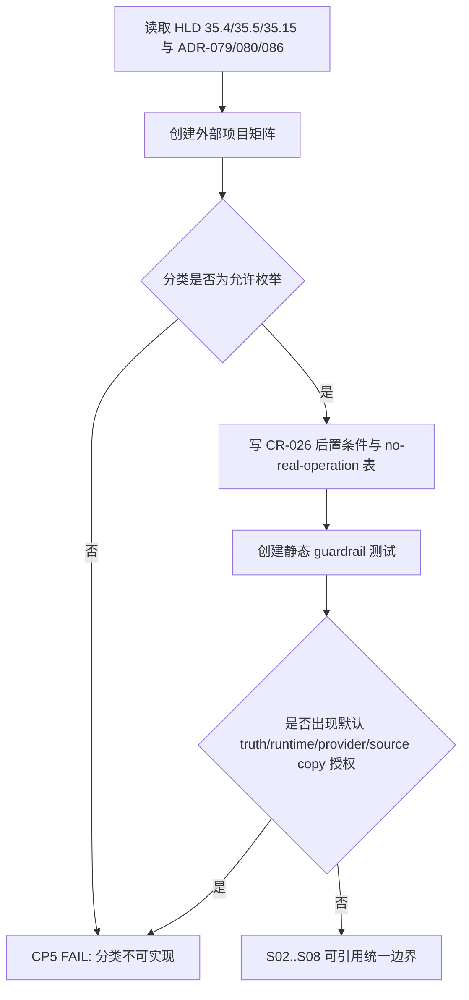

# LLD: CR030-S01 — 外部项目矩阵与多因子闭环总合同

本文档已通过 CR030-S01..S08 全量 LLD 统一 CP5 人工确认；允许按本 LLD 范围进行受控实现，但仍不允许改依赖、运行外部项目、源码迁移、provider/lake/publish、QMT/simulation/live 或读取凭据。

## 1. Goal

创建 `docs/CR030-MULTIFACTOR-REFERENCE-MATRIX.md` 与 `tests/test_cr030_external_reference_guardrails.py`，冻结 10 类外部项目的 reference / optional Spike / exclude / forbidden migration 分类、自有多因子研究闭环主线、CR-026 后置条件和 no-real-operation 边界，使 CR030-S02..S08 能消费同一套外部边界术语。

## 2. Requirements（Functional / Non-Functional）

### 2.1 Functional

- 外部矩阵必须覆盖 Qlib、Alphalens、vectorbt、PyBroker、bt、Zipline Reloaded、QuantConnect LEAN、RQAlpha、vn.py / vnpy.alpha、Backtrader 共 10 类对象。
- 每个项目必须包含 license/status、dependency boundary、provider/runtime boundary、可借鉴点、不可直接采用点、recommendation、when-to-switch、not-authorized。
- recommendation 只允许 `reference_only`、`optional_spike`、`exclude`、`forbidden_migration` 或组合分类；不得出现默认 runner/provider/truth/optimizer/report truth。
- CR-026 只能登记为 Qlib isolated runner 后续 Spike candidate；不得启动 CR-026、qrun、provider_uri 或依赖隔离实现。
- 测试文件必须提供静态扫描，验证外部 runtime/default truth/source migration/dependency authorization 命中次数为 0。

### 2.2 Non-Functional

- 安全：外部项目 clone/install/run/source copy、provider fetch、lake write、catalog publish、QMT/simulation/live、credential read 执行次数均为 0。
- 可审计：矩阵字段完整性可由测试直接枚举校验，分类值为 exact match。
- 可维护：文档中的分类术语作为 S02..S08 共享输入，后续变更必须经 CP5 或独立 CR/Spike。
- 最小依赖：不修改 `pyproject.toml`、`uv.lock`，不引入任何外部包。

## 3. 模块拆分与职责

| 模块 / 文件组 | 职责 | 说明 |
|---|---|---|
| `docs/CR030-MULTIFACTOR-REFERENCE-MATRIX.md` | 创建外部项目矩阵、分类语义、CR-026 后置条件和 no-real-operation 声明 | primary owner；S08 后续可在文档汇总中引用，不覆盖本矩阵 |
| `tests/test_cr030_external_reference_guardrails.py` | 创建 fixture-only 静态测试，校验矩阵字段、分类枚举、禁止声明和执行计数 | primary owner；不访问外部项目路径，不运行外部 runtime |
| `README.md` / `docs/USER-MANUAL.md` | shared；本 Story 不修改 | 由 CR030-S08 作为 merge owner 汇总用户文档边界 |

## 4. 代码结构与文件影响范围

| 动作 | 文件路径 | 变更内容 |
|---|---|---|
| 创建 | `docs/CR030-MULTIFACTOR-REFERENCE-MATRIX.md` | 增加矩阵字段定义、10 类项目表、分类枚举、CR-026 后置条件、禁止项表和切换条件 |
| 创建 | `tests/test_cr030_external_reference_guardrails.py` | 增加文档解析 / 文本扫描测试，验证字段完整、分类合法、禁止声明未被正向授权 |
| 不修改 | `README.md`、`docs/USER-MANUAL.md` | 保持 shared 文件交给 S08；本 Story 不提前合并用户文档 |
| 禁止 | `pyproject.toml`、`uv.lock`、`.env`、外部项目源码树、provider/lake/QMT 相关文件 | 不得修改、读取凭据或运行真实操作 |

## 5. 数据模型与持久化设计

本 Story 无数据库或运行态持久化变更。矩阵是 Markdown 合同文档，测试以静态表格和关键短语为输入。

| 对象 / 字段 | 类型 | 约束 | 说明 |
|---|---|---|---|
| `ExternalProjectReference` | 文档表行 | `project`, `license_status`, `dependency_boundary`, `provider_runtime_boundary`, `reference_points`, `forbidden_points`, `recommendation`, `when_to_switch`, `not_authorized` 必填 | 不实现为代码模型；测试按表头和项目名校验 |
| `recommendation` | enum-like string | 只允许 `reference_only`、`optional_spike`、`exclude`、`forbidden_migration` 或组合 | 作为 S02..S08 禁止外部 truth 的共享词汇 |
| `NoRealOperationCounter` | 文档声明 | external run/source copy/dependency/provider/lake/publish/QMT/credential 均为 0 | CP5 前只允许设计，不允许执行 |

## 6. API / Interface 设计

| 接口 / 入口 | 输入 | 输出 | 调用方 | 说明 |
|---|---|---|---|---|
| Reference matrix 文档接口 | 10 类外部项目和 HLD §35.4 分类 | 标准矩阵表、分类说明、CR-026 后置条件 | S02..S08 LLD、meta-qa、meta-doc | 文档是人工/测试共同消费的合同接口 |
| `test_reference_matrix_covers_required_projects` | `docs/CR030-MULTIFACTOR-REFERENCE-MATRIX.md` | 10 类项目覆盖 PASS/FAIL | pytest | 对应第 10 节 TS-S01-01 |
| `test_reference_matrix_has_required_columns` | 同上 | 字段完整 PASS/FAIL | pytest | 对应第 10 节 TS-S01-02 |
| `test_external_runtime_and_truth_are_not_authorized` | docs/tests 文本 | 禁止正向授权 PASS/FAIL | pytest | 对应第 10 节 TS-S01-03 |
| `test_cr026_is_deferred_spike_only` | docs 文本 | CR-026 后置声明 PASS/FAIL | pytest | 对应第 10 节 TS-S01-04 |

## 7. 核心处理流程

1. 从 HLD §35.4 提取 10 类外部项目及 recommendation。
2. 将 ADR-079/080/086 的禁止迁移、reference-first、CR-026 后置规则写成文档合同。
3. 在测试中用 exact project list、required column list 和 forbidden phrase scan 校验矩阵。
4. 若矩阵缺项目、缺字段或出现正向授权外部 runtime/truth/provider，测试失败；实现阶段不得降级为 warn。

## 8. 技术设计细节

- 关键规则：项目清单必须 exact 覆盖 10 类；classification 只能使用允许枚举；CR-026/optimizer/外部 runtime 只能写为后续独立 CR/Spike。
- 依赖选择与复用点：复用 HLD §35.4 外部项目矩阵和 ADR-080 reference-first 治理；不新增 Python 依赖，使用 pytest 和标准库文本读取即可。
- 兼容性处理：Backtrader 继承 CR-025 `reference_only / forbidden_migration` 口径；Qlib 只保留 `reference_only + optional_spike`。
- 图示类型选择：使用流程图，因为存在 classification -> forbidden scan -> downstream contract 的分支。
- 失败输出：测试失败必须指出缺失项目、缺失字段或 forbidden authorization 命中的字符串位置。

## 9. 安全与性能设计

| 维度 | 设计措施 | 验证方式 |
|---|---|---|
| 安全 | 禁止 clone/install/run/source copy/provider/lake/publish/QMT/credential；测试只读本仓库文档 | `test_external_runtime_and_truth_are_not_authorized`、依赖 diff 检查 |
| 性能 | 文档扫描为小文本读取，不进行外部 I/O | pytest 单文件 fixture-only 执行时间应为秒级 |
| 许可证 | 每个项目保留 license/status 口径和后续复核条件，不把限制性项目设默认依赖 | required columns + recommendation scan |
| 权限边界 | CP5 前 `implementation_allowed=false`；本 LLD 不授权实现 | CP5 自动预检检查 frontmatter 和 no-real-operation 表 |

## 10. 测试设计

| 测试场景 | 前置条件 | 操作 | 预期结果 | 验证方式 |
|---|---|---|---|---|
| TS-S01-01 10 类项目覆盖 | 文档存在 | 读取矩阵项目列 | Qlib、Alphalens、vectorbt、PyBroker、bt、Zipline Reloaded、LEAN、RQAlpha、vn.py/vnpy.alpha、Backtrader 全部存在 | pytest 文本/表格扫描 |
| TS-S01-02 字段完整 | 文档存在 | 校验 required columns | 每个项目有 license、boundary、recommendation、when-to-switch、not-authorized | pytest |
| TS-S01-03 外部运行未授权 | 文档和测试存在 | 扫描默认 truth/runtime/provider/source migration/dependency install 正向授权语义 | 命中次数为 0 | pytest forbidden phrase scan |
| TS-S01-04 CR-026 后置 | 文档存在 | 检查 CR-026 条件 | 只出现后续 Spike candidate / 单独 CR / 用户授权条件，不出现启动实现 | pytest |
| TS-S01-05 CP5 前实现关闭 | LLD 和 Story 卡片存在 | 检查 `implementation_allowed=false` | CP5 前不允许实现 | CP5 自动预检 |

## 11. 实施步骤

| TASK-ID | 动作 | 目标文件 | 详细描述 | 对应测试 |
|---|---|---|---|---|
| CR030-S01-T1 | 创建 | `docs/CR030-MULTIFACTOR-REFERENCE-MATRIX.md` | 写 10 类外部项目矩阵和分类理由 | TS-S01-01、TS-S01-02 |
| CR030-S01-T2 | 创建 | `tests/test_cr030_external_reference_guardrails.py` | 写矩阵字段、分类枚举、forbidden authorization 静态扫描 | TS-S01-01、TS-S01-02、TS-S01-03 |
| CR030-S01-T3 | 创建 | `docs/CR030-MULTIFACTOR-REFERENCE-MATRIX.md` | 写 CR-026 Qlib runner 后置条件、启动门槛和不授权项 | TS-S01-04 |
| CR030-S01-T4 | 创建 | `tests/test_cr030_external_reference_guardrails.py` | 写 dependency boundary 检查，确认 CP5 前 dependency diff 为 0 | TS-S01-03、TS-S01-05 |
| CR030-S01-T5 | 创建 | `docs/CR030-MULTIFACTOR-REFERENCE-MATRIX.md` | 写 no-real-operation 表，计数 provider/lake/publish/QMT/simulation/live/credential 均为 0 | TS-S01-03、TS-S01-05 |

## 12. 风险、难点与预研建议

### 12.1 实现灰区与取舍记录

| Clarification ID | 问题 | 选项与推荐 | 决策 / 答案 | 影响面 | 证据 | 重访条件 |
|---|---|---|---|---|---|---|
| 无 | 无阻断澄清 | 不写入 clarification queue | CP3 已批准 DQ-CP3-CR030-01/03/05/07；本 Story `open_items=0` | 接口 / 安全 / 文档 / 跨 Story 契约 | CP3 review approved；CP4 PASS | 若用户要求运行外部项目或启动 CR-026，meta-po 另起 CR/Spike |

| 风险 / 难点 | 影响 | 缓解措施 / 预研建议 |
|---|---|---|
| 外部项目描述被误读为默认集成 | 会污染 S02..S08 的 truth/provider 边界 | 文档每项必须写 not-authorized；测试扫描 forbidden authorization |
| license/status 口径后续变化 | 可能影响 optional Spike 路线 | 本 Story只冻结当前静态口径；后续运行/依赖必须独立 CR 复核 |
| shared README/docs 合并冲突 | S08 后续要汇总用户文档 | 本 Story 不修改 shared 文件，只提供矩阵源 |

### OPEN / Spike 跟踪

| ID | 类型（OPEN / Spike） | 问题 | 下一动作 | 责任方 |
|---|---|---|---|---|
| CR30-S01-NB-01 | Spike | CR-026 Qlib isolated runner 后置 | 合同冻结后由 meta-po 单独启动 CR-026；不计入本 LLD 阻断 open_items | meta-po |
| CR30-S01-NB-02 | Spike | vectorbt / PyBroker / RQAlpha / vn.py runtime | 仅保留 optional Spike 条件；不进入 CR-030 P0 | meta-po |

## 13. 回滚与发布策略

- 发布方式：CP5 全量确认后，按 Story DAG 在开发阶段创建文档和测试；本 LLD 不发布运行产物。
- 回滚触发条件：矩阵分类与 ADR-079/080/086 冲突、出现默认外部 runtime/truth/provider、测试无法证明禁止项。
- 回滚动作：回退 S01 文档和测试变更；不影响代码、依赖、数据或外部项目。

## 14. Definition of Done

- [ ] LLD 保持 14 个可见章节，frontmatter 包含 `tier=M`、`shared_fragments`、`open_items=0`。
- [ ] `docs/CR030-MULTIFACTOR-REFERENCE-MATRIX.md` 的字段、分类和 CR-026 后置条件可直接实施。
- [ ] `tests/test_cr030_external_reference_guardrails.py` 覆盖矩阵字段、分类、禁止授权和 CP5 前实现关闭。
- [ ] 不修改 shared README/docs；由 S08 后续合并。
- [ ] 不修改 `pyproject.toml`、`uv.lock`，不 clone/install/run 外部项目，不复制源码，不读取凭据。
- [ ] CP5 自动预检 PASS 后仍等待 CR030-S01..S08 全量 LLD 人工确认，不进入实现。

## 人工确认区

CP5 统一确认由 meta-po 在收齐 CR030-S01..S08 全部 LLD 与 CP5 自动预检后发起；本 Story 单独 LLD 不构成实现授权。
