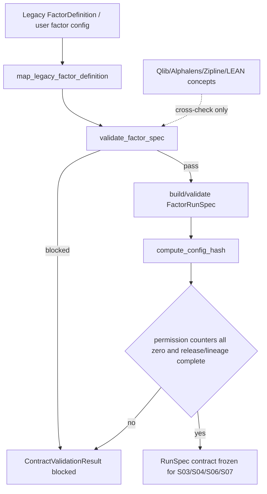

# LLD: CR030-S02 — FactorSpec / FactorRunSpec 契约

本文档已通过 CR030-S01..S08 全量 LLD 统一 CP5 人工确认；在 CR030-S01 参考边界 verified 后，允许按本 LLD 范围受控实现 `engine/multifactor_contracts.py` 与对应测试。仍不允许改依赖、运行外部项目、provider/lake/publish、QMT/simulation/live 或读取凭据。

## 1. Goal

创建 `engine/multifactor_contracts.py` 与 `tests/test_cr030_factor_spec_run_spec_contract.py`，冻结因子定义、运行规格、config hash、lineage、failure policy 和外部对象 cross-check 边界，使 S03 面板/标签、S04 评价、S05 组合、S06 manifest/catalog 和 S07 admission 能消费稳定的因子合同。

## 2. Requirements（Functional / Non-Functional）

### 2.1 Functional

- `FactorSpec` 必须覆盖 `factor_id`, `name`, `version`, `direction`, `input_fields`, `window`, `params`, `preprocessing`, `universe`, `availability_policy`, `data_lineage`, `blocked_claims`, `failure_policy`。
- `FactorRunSpec` 必须覆盖 `run_id`, `factor_id`, `factor_version`, `date_range`, `dataset_release`, `benchmark`, `label_window`, `cost_config`, `seed`, `code_version`, `config_hash`, `output_root`, `permission_counters`, `failure_policy`。
- `factor_id + version` 必须不可变；`direction` 必须为显式枚举；`config_hash` 必须覆盖因子、数据、标签、成本和组合相关配置。
- 缺必填字段、方向未知、lineage 不完整、config hash 缺失、外部对象替代内部 truth 时，返回 structured blocked reason，不抛裸异常。
- 外部项目对象只作为 cross-check 映射，不得作为内部 truth、runner、provider 或 optimizer。

### 2.2 Non-Functional

- 准确性：P0 字段覆盖率 100%；缺字段 fail-closed。
- 可追溯：每个 spec/run spec 必须能追溯到 `research_input_v1`、实验 17-21、数据 release 或明确 blocked claims。
- 安全：dependency change、Qlib qrun/provider_uri、provider fetch、credential read、QMT 调用均为 0。
- 兼容性：现有实验 17-21 `FactorDefinition` 通过映射进入新合同，不覆盖旧实验报告。

## 3. 模块拆分与职责

| 模块 / 文件组 | 职责 | 说明 |
|---|---|---|
| `engine/multifactor_contracts.py` | 创建 `FactorSpec`、`FactorRunSpec`、枚举、blocked reason 和校验入口 | primary owner；不导入外部项目 |
| `tests/test_cr030_factor_spec_run_spec_contract.py` | 创建字段覆盖、hash 稳定、lineage 缺失、外部对象不接管测试 | primary owner；fixture-only |
| `engine/research_dataset.py` | shared；只读引用 `research_input_v1` 字段语义 | 本 Story 只有在 CP5 后按最小适配修改；LLD 不要求当前修改 |
| `experiments/run_experiment_17_21_factor_suite.py` | shared；作为旧 `FactorDefinition` 映射来源 | 本 Story 不覆盖旧实验输出 |

## 4. 代码结构与文件影响范围

| 动作 | 文件路径 | 变更内容 |
|---|---|---|
| 创建 | `engine/multifactor_contracts.py` | 定义数据合同、枚举、校验函数、config hash 规则、structured blocked reason |
| 创建 | `tests/test_cr030_factor_spec_run_spec_contract.py` | 定义合法/非法 spec、run spec、外部对象替代、CP5 前边界测试 |
| 最小修改（CP5 后） | `engine/research_dataset.py` | 仅在实现阶段需要时增加只读适配或导出字段引用；不得改变数据 truth |
| 最小修改（CP5 后） | `experiments/run_experiment_17_21_factor_suite.py` | 仅在实现阶段需要时增加旧 `FactorDefinition` 到新合同的映射说明或 fixture；不得覆盖旧报告 |
| 禁止 | `pyproject.toml`、`uv.lock`、`.env`、Qlib runtime/provider 相关文件 | 不得修改或读取 |

## 5. 数据模型与持久化设计

本 Story 新增内存级 Python 合同对象，不新增数据库、不写真实 lake、不 publish catalog。

| 对象 / 字段 | 类型 | 约束 | 说明 |
|---|---|---|---|
| `FactorDirection` | enum | `positive`, `negative`, `neutral`, `custom`；`custom` 必须有解释 | 避免方向未知进入 IC / RankIC |
| `FactorSpec` | dataclass / typed object | P0 字段必填；`factor_id + version` 不可变；`data_lineage` 必填 | 因子定义 truth |
| `FactorRunSpec` | dataclass / typed object | P0 字段必填；`config_hash` 必填且可重算 | 单次研究运行 truth |
| `PermissionCounters` | typed dict / dataclass | dependency/external_run/provider/lake/publish/qmt/credential 均必须为 0 | 非 0 时 `MF_PROVIDER_OR_LAKE_NOT_AUTHORIZED` 或外部 runtime blocked |
| `ContractValidationResult` | dataclass | `status` in `pass|blocked`，`blocked_reasons` 为结构化列表 | 不抛裸异常，供 S03..S07 消费 |

## 6. API / Interface 设计

| 接口 / 入口 | 输入 | 输出 | 调用方 | 说明 |
|---|---|---|---|---|
| `validate_factor_spec(spec)` | `FactorSpec` 或 dict | `ContractValidationResult` | S03 panel builder、测试 | 校验字段、方向、lineage、外部 truth 禁止；TS-S02-01/02/04 |
| `validate_factor_run_spec(run_spec, factor_spec)` | `FactorRunSpec`, `FactorSpec` | `ContractValidationResult` | S03/S04/S06/S07 | 校验 run_id、release、label/cost/benchmark、config_hash、permission counters；TS-S02-01/03 |
| `compute_config_hash(config)` | 因子、数据、标签、成本、组合配置 | stable hash string | run spec builder、测试 | 相同输入 hash 相同，字段变更 hash 改变；TS-S02-03 |
| `map_legacy_factor_definition(legacy_definition)` | 实验 17-21 因子定义 | `FactorSpec` 或 blocked result | 兼容层、测试 | 只做映射，不覆盖旧报告；TS-S02-05 |
| `ExternalMappingNote` | 外部概念名和内部字段 | cross-check note | 文档 / QA | 只用于说明字段覆盖，不成为 truth；TS-S02-04 |

## 7. 核心处理流程

1. 将实验 17-21 或用户配置映射为内部 `FactorSpec`。
2. 校验 P0 字段、方向、窗口、预处理、universe、availability policy 和 lineage。
3. 基于合法 `FactorSpec` 生成/校验 `FactorRunSpec`，确认 dataset release、benchmark、label window、cost、seed、code version、output root。
4. 计算并校验 `config_hash`；缺失或不稳定时返回 blocked reason。
5. 任一 permission counter 非 0 或外部对象被设置为 truth/provider/runner 时 fail-closed。

## 8. 技术设计细节

- 关键算法 / 规则：`config_hash` 使用稳定序列化后的配置摘要；字段顺序不得影响 hash，任何 P0 配置变化必须改变 hash。
- 依赖选择与复用点：复用标准库 dataclass/enum/hashlib/json；不新增依赖；复用 HLD §35.7.2 字段字典和 ADR-081 provenance。
- 兼容性处理：旧 `FactorDefinition` 映射缺字段时输出 blocked reason 和 remediation，不自动填充外部默认值。
- 外部映射：Qlib Alpha158、Alphalens factor_data、Zipline Pipeline、LEAN Alpha Model 只写入 mapping note，不可进入 `FactorSpec` 的 `source_of_truth`。
- 图示类型选择：流程图，因为存在 legacy mapping、run spec、permission counters 与外部 cross-check 分支。

## 9. 安全与性能设计

| 维度 | 设计措施 | 验证方式 |
|---|---|---|
| 安全 | 禁止外部 runtime/provider/credential；permission counters 非 0 直接 blocked | TS-S02-04、TS-S02-06 |
| 性能 | 合同校验为字段和 hash 校验，适合在研究 run 前快速执行 | pytest fixture-only；无外部 I/O |
| 可追溯 | `data_lineage`、`dataset_release`、`code_version`、`config_hash` 必填 | TS-S02-02、TS-S02-03 |
| 可维护 | 数据合同集中在 `engine/multifactor_contracts.py`，避免分散在实验脚本 | 接口导入和字段覆盖测试 |

## 10. 测试设计

| 测试场景 | 前置条件 | 操作 | 预期结果 | 验证方式 |
|---|---|---|---|---|
| TS-S02-01 合法合同通过 | 完整 FactorSpec / FactorRunSpec fixture | 调用 `validate_factor_spec` 与 `validate_factor_run_spec` | status=`pass`，blocked_reasons 为空 | pytest |
| TS-S02-02 缺必填字段 fail-closed | 删除 direction、lineage、dataset_release 任一字段 | 调用校验 | `MF_SCHEMA_REQUIRED_FIELD_MISSING` 或 `MF_LINEAGE_MISSING` | pytest |
| TS-S02-03 config hash 稳定 | 两组相同配置和一组变化配置 | 调用 `compute_config_hash` | 相同配置 hash 相同，变化配置 hash 不同 | pytest |
| TS-S02-04 外部对象不接管 | 将 Qlib/Alphalens/Zipline/LEAN 对象标为 internal truth | 调用校验或扫描 | 返回 blocked；外部对象作为 internal truth 次数为 0 | pytest |
| TS-S02-05 旧实验映射 | 构造实验 17-21 `FactorDefinition` fixture | 调用 `map_legacy_factor_definition` | 输出内部 `FactorSpec` 或结构化 remediation | pytest |
| TS-S02-06 CP5 前权限关闭 | LLD / Story / dev_gate 可读 | 检查 `implementation_allowed=false`、dependency/QMT/credential counters | 均为 false/0 | CP5 自动预检 |

## 11. 实施步骤

| TASK-ID | 动作 | 目标文件 | 详细描述 | 对应测试 |
|---|---|---|---|---|
| CR030-S02-T1 | 创建 | `engine/multifactor_contracts.py` | 定义 `FactorSpec`、`FactorRunSpec`、`FactorDirection`、`PermissionCounters`、`ContractValidationResult` 和错误码 | TS-S02-01、TS-S02-02 |
| CR030-S02-T2 | 创建 | `tests/test_cr030_factor_spec_run_spec_contract.py` | 写必填字段、方向、lineage、run spec 和 blocked reason 测试 | TS-S02-01、TS-S02-02 |
| CR030-S02-T3 | 创建 | `engine/multifactor_contracts.py` | 定义 `map_legacy_factor_definition` 和旧实验字段映射规则 | TS-S02-05 |
| CR030-S02-T4 | 创建 | `engine/multifactor_contracts.py` | 定义 `compute_config_hash` 和 permission counters 校验 | TS-S02-03、TS-S02-06 |
| CR030-S02-T5 | 创建 | `tests/test_cr030_factor_spec_run_spec_contract.py` | 写外部对象不接管、Qlib qrun/provider_uri 禁止、依赖不变测试 | TS-S02-04、TS-S02-06 |

## 12. 风险、难点与预研建议

### 12.1 实现灰区与取舍记录

| Clarification ID | 问题 | 选项与推荐 | 决策 / 答案 | 影响面 | 证据 | 重访条件 |
|---|---|---|---|---|---|---|
| 无 | 无阻断澄清 | 不写入 clarification queue | CP3 已批准 schema provenance；S01 LLD 已固定外部边界；本 Story `open_items=0` | 接口 / 测试 / 跨 Story 契约 | CP3 DQ-CP3-CR030-02 approved；ADR-081 | 若实现发现旧实验字段无法映射，追加 blocked reason，不放宽 truth 边界 |

| 风险 / 难点 | 影响 | 缓解措施 / 预研建议 |
|---|---|---|
| 旧实验字段不完整 | 可能阻断自动映射 | 输出 structured remediation；不得静默填默认 truth |
| config hash 覆盖不足 | run 无法复跑 | 测试覆盖因子、数据、标签、成本、组合配置变化 |
| 外部对象字段名更成熟但不兼容 | 可能诱导直接采用外部对象 | 只允许 mapping note；内部字段以 HLD §35.7.2 为准 |

### OPEN / Spike 跟踪

| ID | 类型（OPEN / Spike） | 问题 | 下一动作 | 责任方 |
|---|---|---|---|---|
| CR30-S02-NB-01 | Spike | Qlib qrun/task 或外部 Factor 对象导入 | 合同冻结后进入 CR-026 或 adapter Spike；不计入本 LLD 阻断 open_items | meta-po |

## 13. 回滚与发布策略

- 发布方式：CP5 全量确认后，按 S01 -> S02 开发顺序创建合同模块和测试；本 LLD 不发布运行产物。
- 回滚触发条件：字段设计与 HLD §35.7.2/ADR-081 冲突、外部对象成为 truth、config hash 无法稳定复算、permission counters 无法 fail-closed。
- 回滚动作：撤回 `engine/multifactor_contracts.py` 和对应测试变更；不修改依赖、不改旧实验报告、不触发数据写入。

## 14. Definition of Done

- [ ] LLD 保持 14 个可见章节，frontmatter 包含 `tier=M`、`shared_fragments`、`open_items=0`。
- [ ] `FactorSpec` / `FactorRunSpec` P0 字段覆盖率 100%，错误码和 blocked reason 可实现。
- [ ] 第 6 节每个接口在第 10 节均有测试入口。
- [ ] 第 7 节异常路径在测试中覆盖缺字段、lineage、hash、外部 truth、权限计数。
- [ ] 每个 TASK-ID 对应至少 1 个文件影响项。
- [ ] CP5 自动预检 PASS 后仍等待 CR030-S01..S08 全量 LLD 人工确认，不进入实现。

## 人工确认区

CP5 统一确认由 meta-po 在收齐 CR030-S01..S08 全部 LLD 与 CP5 自动预检后发起；本 Story 单独 LLD 不构成实现授权。
