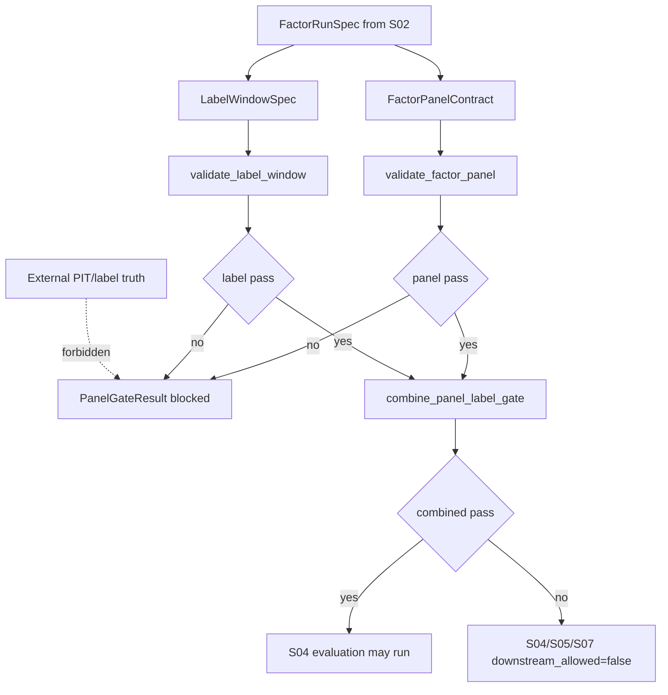

# LLD: CR030-S03 — FactorPanelContract / LabelWindowSpec 防泄漏合同

本文档仅设计 CR030-S03 的面板/标签合同和 fail-closed gate；在 CR030-S01..S08 全量 LLD 统一 CP5 人工确认前，不允许实现，也不允许 provider fetch、lake write、外部 PIT/label truth、凭据读取或 QMT 操作。

## 1. Goal

创建 `engine/factor_panel_contracts.py` 与 `tests/test_cr030_factor_panel_label_window_gates.py`，冻结因子面板、标签窗口、`available_at`、`decision_time`、lineage、复权口径、quality status、blocked reason 和 fail-closed 错误码，保证前视、label overlap、lineage 缺失、复权混用、quality 缺失时评价、组合和 admission 继续次数为 0。

## 2. Requirements（Functional / Non-Functional）

### 2.1 Functional

- `FactorPanelContract` 必须覆盖 `trade_date`, `symbol`, `factor_id`, `factor_version`, `raw_value`, `directional_value`, `winsorized_value`, `zscore_value`, `available_at`, `decision_time`, `source_dataset`, `quality_status`, `preprocessing_metadata`, `data_lineage`。
- `LabelWindowSpec` 必须覆盖 `label_id`, `trade_date`, `symbol`, `decision_time`, `label_window_start`, `label_window_end`, `label_available_at`, `return_kind`, `adjustment_policy`, `cost_policy`, `benchmark_policy`, `data_lineage`。
- 校验必须覆盖 `MF_AVAILABLE_AT_VIOLATION`、`MF_LABEL_OVERLAP_RISK`、`MF_LINEAGE_MISSING`、`MF_ADJUSTMENT_POLICY_MIXED`、`MF_PANEL_LAYER_INCOMPLETE`、`MF_QUALITY_GATE_FAILED`。
- gate fail 时返回 structured blocked result；S04 评价、S05 组合、S07 admission 不得继续。
- CR011-S08 factor panel audit 只读引用；不得回滚或覆盖 CR011 产物。

### 2.2 Non-Functional

- 防泄漏：`available_at > decision_time` 容忍次数为 0；label overlap 容忍次数为 0。
- 安全：不得使用外部框架生成 PIT/label truth；provider fetch、lake write、credential read、QMT 调用为 0。
- 可追溯：每行 panel 和 label 必须有 source dataset、release/lineage 或 blocked reason。
- 可测试：每类 fail-closed 错误码至少 1 个 fixture。

## 3. 模块拆分与职责

| 模块 / 文件组 | 职责 | 说明 |
|---|---|---|
| `engine/factor_panel_contracts.py` | 创建 panel/label 合同、gate result、错误码、校验入口 | primary owner；消费 S02 合同，不导入外部框架 |
| `tests/test_cr030_factor_panel_label_window_gates.py` | 创建 available_at、label overlap、lineage、复权混用、quality fail 和下游继续次数测试 | primary owner；fixture-only |
| `engine/research_dataset.py` | shared；只读映射 `research_input_v1` 到 panel/label 输入 | S03 dev_gate 当前 `file_conflict_free=false`，实现需 meta-po 重新判定合并顺序 |
| `market_data/readers.py` | shared；只读引用 published reader 语义 | 本 Story 不做 provider fetch 或 lake write |

## 4. 代码结构与文件影响范围

| 动作 | 文件路径 | 变更内容 |
|---|---|---|
| 创建 | `engine/factor_panel_contracts.py` | 定义 `FactorPanelContract`、`LabelWindowSpec`、`PanelGateResult`、错误码和校验函数 |
| 创建 | `tests/test_cr030_factor_panel_label_window_gates.py` | 定义泄漏、label overlap、lineage、复权口径、quality 和 forbidden external truth 测试 |
| 最小修改（CP5 后且文件 owner 重新放行） | `engine/research_dataset.py` | 仅增加只读映射或适配；不得改变 research_input truth |
| 最小修改（CP5 后且文件 owner 重新放行） | `market_data/readers.py` | 仅引用 reader metadata；不得触发 provider fetch 或 lake write |
| 禁止 | `pyproject.toml`、`uv.lock`、`.env`、外部 PIT/label truth、provider/lake/QMT 文件 | 不得修改或读取 |

## 5. 数据模型与持久化设计

本 Story 新增内存级合同对象和测试 fixture，不新增数据库、不写真实 lake、不覆盖 reports。

| 对象 / 字段 | 类型 | 约束 | 说明 |
|---|---|---|---|
| `FactorPanelContract` | dataclass / typed object | panel 四层和 `available_at <= decision_time` 必须成立 | 评价和组合的前置 gate |
| `LabelWindowSpec` | dataclass / typed object | `label_window_start` 晚于 decision point；label availability 不得被用作更早信号 | 标签防泄漏合同 |
| `PanelGateResult` | dataclass | `status` in `pass|blocked|research_limited`；包含 `blocked_reasons` 和 `downstream_allowed` | 下游 S04/S05/S07 消费 |
| `BlockedReason` | dataclass / dict | `code`, `message`, `object_id`, `field`, `evidence_ref`, `remediation` | 结构化错误暴露 |
| `DownstreamPolicy` | enum-like | gate blocked 时 evaluation/combo/admission 均 false | 确保继续次数为 0 |

## 6. API / Interface 设计

| 接口 / 入口 | 输入 | 输出 | 调用方 | 说明 |
|---|---|---|---|---|
| `validate_factor_panel(panel, run_spec)` | `FactorPanelContract`, `FactorRunSpec` | `PanelGateResult` | S04 评价、测试 | 校验四层、available_at、lineage、quality；TS-S03-01/03/04 |
| `validate_label_window(label_spec, run_spec)` | `LabelWindowSpec`, `FactorRunSpec` | `PanelGateResult` | S04 评价、测试 | 校验 label timing、overlap、return/adjustment/cost policy；TS-S03-02/04 |
| `combine_panel_label_gate(panel_result, label_result)` | 两个 gate result | 合并 gate result | S04/S05/S07 | 任一 blocked 则下游全部 blocked；TS-S03-05 |
| `assert_no_external_pit_label_truth(source)` | source metadata / text | `PanelGateResult` | 测试 / guardrail | 禁止外部 PIT/label truth 接管；TS-S03-06 |
| `to_blocked_claims(gate_result)` | gate result | blocked claims list | S04 report / S07 admission | 将错误码传给下游声明边界；TS-S03-05 |

## 7. 核心处理流程

1. 从 S02 的 `FactorRunSpec` 获取 factor version、dataset release、label window、cost/benchmark 和 permission counters。
2. 校验 panel 四层、`available_at <= decision_time`、source dataset、quality status、preprocessing metadata 和 lineage。
3. 校验 label window 起止、`label_available_at`、return/adjustment/cost/benchmark policy 和 overlap。
4. 合并 panel/label gate；任一 blocked 时输出 blocked claims，评价、组合、admission 继续次数必须为 0。
5. 若来源标记为外部 PIT/label truth 或 provider/lake 未授权，直接 fail-closed。

## 8. 技术设计细节

- 关键规则：available_at 以每行 panel 字段为准，必须小于等于 decision_time；label_window_start 必须晚于 decision point；同一 run 不允许复权口径混用。
- 依赖选择与复用点：复用 S02 的 `FactorRunSpec`；复用 CR011-S08 四层 panel audit 口径；不新增依赖。
- 兼容性处理：无法证明 PIT/lineage 的旧数据只能输出 `research_limited` 或 `blocked`，不得进入 production claim。
- 下游合同：`PanelGateResult.downstream_allowed.evaluation/combo/admission=false` 是 S04/S05/S07 的强输入。
- 图示类型选择：流程图，因为 panel 和 label 两条 gate 汇合并影响多个下游。

## 9. 安全与性能设计

| 维度 | 设计措施 | 验证方式 |
|---|---|---|
| 安全 | 禁止 external PIT/label truth、provider fetch、lake write、credential read；permission counters 非 0 blocked | TS-S03-06、CP5 自动预检 |
| 防泄漏 | available_at、decision_time、label overlap 和 label availability fail-closed | TS-S03-01、TS-S03-02 |
| 性能 | 校验以向量化/表级断言为目标，但 P0 可先 fixture-only 行级测试 | 单文件 pytest；无外部 I/O |
| 可维护 | 错误码集中在 `engine/factor_panel_contracts.py`，downstream policy 显式化 | TS-S03-05 |

## 10. 测试设计

| 测试场景 | 前置条件 | 操作 | 预期结果 | 验证方式 |
|---|---|---|---|---|
| TS-S03-01 available_at 前视 | panel fixture 中 `available_at > decision_time` | 调用 `validate_factor_panel` | `MF_AVAILABLE_AT_VIOLATION`，evaluation/combo/admission false | pytest |
| TS-S03-02 label overlap | label window 与 decision/holding window 重叠 | 调用 `validate_label_window` | `MF_LABEL_OVERLAP_RISK`，downstream false | pytest |
| TS-S03-03 panel 四层缺失 | 删除 raw/directional/winsorized/zscore 任一层 | 调用 panel 校验 | `MF_PANEL_LAYER_INCOMPLETE` | pytest |
| TS-S03-04 lineage / quality / adjustment fail | 缺 lineage、quality failed、复权混用 | 调用 panel/label 校验 | `MF_LINEAGE_MISSING` / `MF_QUALITY_GATE_FAILED` / `MF_ADJUSTMENT_POLICY_MIXED` | pytest |
| TS-S03-05 下游继续次数为 0 | panel 或 label gate blocked | 调用 `combine_panel_label_gate` 和 `to_blocked_claims` | S04/S05/S07 不允许继续，blocked claims 可消费 | pytest |
| TS-S03-06 外部 PIT/label truth 禁止 | source 标记为 Qlib/Alphalens/Zipline external truth | 调用 `assert_no_external_pit_label_truth` | blocked，外部 truth 接管次数为 0 | pytest |
| TS-S03-07 CP5 前门控 | LLD / Story / dev_gate 可读 | 检查 `implementation_allowed=false`、`file_conflict_free=false` | LLD 可评审，开发需等待 CP5 和文件 owner 重新判定 | CP5 自动预检 |

## 11. 实施步骤

| TASK-ID | 动作 | 目标文件 | 详细描述 | 对应测试 |
|---|---|---|---|---|
| CR030-S03-T1 | 创建 | `engine/factor_panel_contracts.py` | 定义 `FactorPanelContract`、`LabelWindowSpec`、`PanelGateResult` 和 fail-closed 错误码 | TS-S03-01、TS-S03-02、TS-S03-03 |
| CR030-S03-T2 | 创建 | `tests/test_cr030_factor_panel_label_window_gates.py` | 写 available_at、label overlap、lineage、复权混用、quality 缺失测试 | TS-S03-01、TS-S03-02、TS-S03-04 |
| CR030-S03-T3 | 创建 | `engine/factor_panel_contracts.py` | 定义 `combine_panel_label_gate`、`DownstreamPolicy` 和 blocked claims 输出 | TS-S03-05 |
| CR030-S03-T4 | 创建 | `tests/test_cr030_factor_panel_label_window_gates.py` | 写外部 PIT/label truth 禁止和 provider/lake/credential counter 测试 | TS-S03-06 |
| CR030-S03-T5 | 创建 | `engine/factor_panel_contracts.py` | 定义 `research_limited` 与 blocked 的边界，保证无法证明时点/lineage 不降级 warn-only | TS-S03-04、TS-S03-05 |

## 12. 风险、难点与预研建议

### 12.1 实现灰区与取舍记录

| Clarification ID | 问题 | 选项与推荐 | 决策 / 答案 | 影响面 | 证据 | 重访条件 |
|---|---|---|---|---|---|---|
| 无 | 无阻断澄清 | 不写入 clarification queue | CP3 已批准 fail-closed；S02 设计提供 run spec；本 Story `open_items=0` | 接口 / 测试 / 跨 Story 契约 | ADR-081/082；CP4 PASS | 若实现时共享文件 `engine/research_dataset.py` 或 `market_data/readers.py` 与其他 Story 冲突，meta-po 重新排 dev wave |

| 风险 / 难点 | 影响 | 缓解措施 / 预研建议 |
|---|---|---|
| S03 dev_gate `file_conflict_free=false` | CP5 后不能直接并行开发 | CP5 后由 meta-po 按 owner 和 shared files 串行合并；本 LLD 仅设计 |
| 历史数据缺 available_at / lineage | 评价链路可能 blocked | 输出 structured blocked reason 或 `research_limited`，不放宽为 warn-only |
| label window 口径与下游评价不一致 | IC / RankIC 可能失真 | 将 `LabelWindowSpec` 作为 S04 的强输入；测试覆盖 overlap |

### OPEN / Spike 跟踪

| ID | 类型（OPEN / Spike） | 问题 | 下一动作 | 责任方 |
|---|---|---|---|---|
| CR30-S03-NB-01 | OPEN | shared file dev merge order | CP5 全量确认后由 meta-po 根据 `dev_running` 和 file owner 重新判定；不阻断本 LLD | meta-po |

## 13. 回滚与发布策略

- 发布方式：CP5 全量确认且 S02 合同冻结后，按文件 owner 创建合同模块和测试；本 LLD 不发布运行产物。
- 回滚触发条件：fail-closed 被降级为 warn-only、外部 PIT/label truth 接管、provider/lake 写入、shared 文件冲突未被调度解决。
- 回滚动作：撤回 `engine/factor_panel_contracts.py` 和对应测试变更；保留 S02 合同；不修改数据、依赖、外部项目或 CR011 产物。

## 14. Definition of Done

- [ ] LLD 保持 14 个可见章节，frontmatter 包含 `tier=M`、`shared_fragments`、`open_items=0`。
- [ ] `FactorPanelContract` / `LabelWindowSpec` 字段、错误码、downstream policy 可直接实现。
- [ ] 第 6 节每个接口在第 10 节均有测试入口。
- [ ] 第 7 节异常路径在测试中覆盖 available_at、label overlap、lineage、复权混用、quality 和外部 truth。
- [ ] S03 的 `file_conflict_free=false` 已显式暴露，CP5 后仍需 meta-po 重新调度开发文件 owner。
- [ ] CP5 自动预检 PASS 后仍等待 CR030-S01..S08 全量 LLD 人工确认，不进入实现。

## 人工确认区

CP5 统一确认由 meta-po 在收齐 CR030-S01..S08 全部 LLD 与 CP5 自动预检后发起；本 Story 单独 LLD 不构成实现授权。
