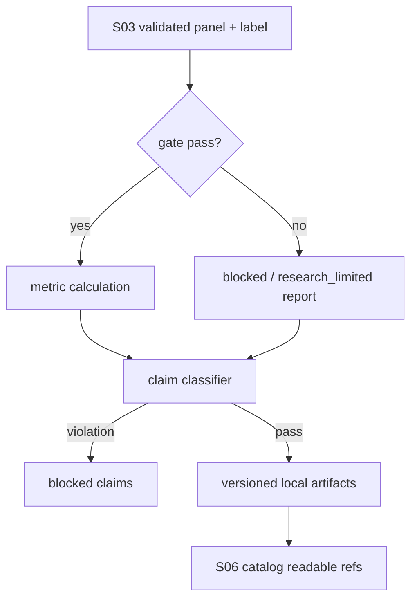

# LLD: CR030-S04-factor-evaluation-report - 单因子评价报告标准化

> 本 LLD 已通过全量 CP5 人工确认，允许按本设计合同受控实现 `FactorEvaluationReport`。仍不运行 Alphalens 或任何外部项目，不覆盖旧实验报告，不触发 provider / lake / publish / QMT / simulation / live / credential 操作。

## 1. Goal

创建单因子评价报告合同、指标集合、artifact 形态、状态模型和声明边界，使通过 S03 `FactorPanelContract` / `LabelWindowSpec` gate 的因子可以输出可审计的 coverage、IC、RankIC、ICIR、分层收益、成本、暴露和 claims；若输入 gate 失败或证据不足，只输出 `blocked` / `research_limited` 与 structured blocked claims。

## 2. Requirements（Functional / Non-Functional）

### 2.1 Functional

- 定义 `FactorEvaluationReport` schema，必填字段覆盖 `report_id`、`run_id`、`factor_id`、`coverage`、`IC`、`RankIC`、`ICIR`、`quantile_returns`、`long_short_returns`、`turnover`、`cost_sensitivity`、`exposure_summary`、`annual_breakdown`、`rolling_breakdown`、`status`、`allowed_claims`、`blocked_claims`、`evidence_refs`。
- 接口必须消费 S03 冻结的 validated panel / label / benchmark / cost / exposure / evaluation window，输入 gate fail 时不得继续生成生产有效声明。
- 报告 artifact 采用本项目 JSON / CSV / Markdown 本地报告形态，写入 `reports/factor_evaluation/**` 的版本化路径合同，不覆盖旧 `reports/experiment_17_21/**`。
- `status` 只允许 `pass`、`warn`、`fail`、`blocked`、`research_limited`。
- `allowed_claims` / `blocked_claims` 必须阻断单一全样本 IC、单一收益曲线或缺 exposure / cost 的生产有效声明。
- 报告路径和 claim boundary 必须能被 S06 `ResearchReportCatalog` 索引。
- 不调用 Alphalens runtime，不把 Alphalens `factor_data` 设为内部 truth。

### 2.2 Non-Functional

- 可追溯：每个 report 带 `run_id`、`factor_id`、`factor_version`、`dataset_release`、`label_window`、`evaluation_window` 和 `evidence_refs`。
- 可测试：所有指标、状态和 forbidden claims 通过 fixture-only 单元测试验证。
- 安全：provider fetch、lake write、catalog publish、QMT 调用、credential read、external project run 计数均为 0。
- 可维护：指标计算入口与 artifact writer 分离，便于 S06 catalog 只读索引。

## 3. 模块拆分与职责

| 模块 / 文件组 | 职责 | 说明 |
|---|---|---|
| `engine/factor_evaluation.py` | 定义评价报告 schema、指标计算接口、状态判定、claim guard 和 artifact path resolver | 当前 Story primary owner；后续实现必须保持自有合同，不导入 Alphalens runtime。 |
| `reports/factor_evaluation/**` | 定义本地 JSON / CSV / Markdown report artifact 输出根 | 只允许版本化新增，不覆盖旧实验报告。 |
| `tests/test_cr030_factor_evaluation_report.py` | 验证 schema、指标字段、gate fail blocked、claim scan 和 forbidden operation counter | fixture-only；不运行外部项目、不写真实 lake。 |
| `engine/factor_panel_contracts.py` | shared：提供 S03 validated panel / label gate 合同 | 本 Story 只消费，不拥有修改；开发需等待 S03 合同冻结。 |
| `reports/research_catalog/**` | shared：供 S06 索引 S04 报告路径和 claims | S04 只定义可索引字段，catalog 写入由 S06 owner 收敛。 |

## 4. 代码结构与文件影响范围

| 动作 | 文件路径 | 变更内容 |
|---|---|---|
| 创建 | `engine/factor_evaluation.py` | 后续实现新增 `FactorEvaluationReport`、评价状态、指标计算入口、claim guard、artifact path resolver 和 writer 合同。 |
| 创建 | `reports/factor_evaluation/**` | 后续实现新增版本化 report artifact 目录、schema 示例或 README；不得覆盖旧 `reports/experiment_*`。 |
| 创建 | `tests/test_cr030_factor_evaluation_report.py` | 后续实现新增指标字段、gate fail、blocked claims、old report no-overwrite、forbidden runtime counter 测试。 |
| 不修改 | `engine/factor_panel_contracts.py` | shared 上游合同；S04 实现只读消费 S03 validator 输出。 |
| 不修改 | `reports/research_catalog/**` | shared 下游目录；S06 负责 catalog entry 写入，S04 只输出可索引 report metadata。 |
| 禁止 | `pyproject.toml`、`uv.lock`、旧实验报告、provider / lake / publish / QMT / credential / external runtime | 本 Story 不新增依赖，不运行外部项目，不读取凭据，不触发真实操作。 |

## 5. 数据模型与持久化设计

后续实现可创建本地 report artifact；该 artifact 是研究证据，不是 lake current truth、catalog publish、broker lake 或交易授权。

| 对象 / 字段 | 类型 | 约束 | 说明 |
|---|---|---|---|
| `FactorEvaluationReport.report_id` | string | 必填，稳定可索引 | 由 `run_id`、`factor_id`、evaluation window 和 schema version 派生。 |
| `run_id` / `factor_id` / `factor_version` | string | 必填 | 追溯 S02 / S03 合同。 |
| `coverage` | object | 必填，含 observation count、date coverage、symbol coverage | coverage 不足时 status 不得为 `pass`。 |
| `IC` / `RankIC` / `ICIR` | object/number | 必填；缺失写 blocked reason | 不允许单一全样本指标独立形成 production claim。 |
| `quantile_returns` / `long_short_returns` | object/list | 必填 | 分层收益和多空收益必须携带时间窗口。 |
| `turnover` / `cost_sensitivity` | object | 必填 | 成本缺失时 `research_limited` 或 blocked claim。 |
| `exposure_summary` | object | 必填 | 缺行业 / 市值 / 风格暴露时阻断中性化、pure alpha、容量声明。 |
| `annual_breakdown` / `rolling_breakdown` | object/list | 必填 | 支持年度和 rolling 视角。 |
| `regime_breakdown` / `autocorr` / `capacity_summary` | object/list | 条件字段 | 有市场状态或容量证据时输出。 |
| `status` | enum | `pass` / `warn` / `fail` / `blocked` / `research_limited` | 输入 gate fail 时只能为 `blocked` 或 `research_limited`。 |
| `allowed_claims` / `blocked_claims` | list[object] | 必填 | 每条 claim 包含 reason、evidence ref 和限制。 |
| `evidence_refs` | list[string] | 必填 | 指向 panel、label、report artifact 或 fixture evidence。 |

## 6. API / Interface 设计

| 接口 / 入口 | 输入 | 输出 | 调用方 | 说明 |
|---|---|---|---|---|
| `build_factor_evaluation_report(panel, label, benchmark, cost, exposure, evaluation_config)` | S03 validated panel / label、benchmark、cost、exposure、evaluation window | `FactorEvaluationReport` | research runner / tests / S06 catalog | 测试覆盖完整指标、gate fail、缺 cost / exposure。 |
| `validate_factor_evaluation_inputs(panel, label, config)` | panel、label、evaluation config | validation result / blocked reasons | report builder | 测试覆盖 available_at violation、label overlap、lineage missing 的下游 blocked。 |
| `classify_factor_report_claims(report)` | report object | allowed / blocked claims | report builder、S06 catalog、QA scan | 测试覆盖单一全样本生产声明、QMT-ready、simulation-ready。 |
| `resolve_factor_evaluation_report_paths(report_id, output_root)` | report id、本地输出根 | JSON / CSV / Markdown path set | artifact writer | 测试路径限定在 `reports/factor_evaluation/**`，不覆盖旧报告。 |
| `write_factor_evaluation_artifacts(report, paths)` | validated report、本地路径 | write result / artifact refs | report layer | 测试只使用临时 fixture path；不得 lake write / publish。 |

## 7. 核心处理流程

1. 接收 S03 输出的 validated panel / label；若 gate status 为 blocked，生成 `status=blocked` 的 report shell，写入 blocked claims，停止指标计算。
2. 校验 benchmark、cost、exposure、evaluation window；缺 cost / exposure 时设置 `research_limited` 或对应 blocked claims。
3. 计算 coverage、IC、RankIC、ICIR、分层收益、多空收益、turnover、成本敏感性、暴露、年度 / rolling breakdown。
4. 调用 claim classifier，禁止单一全样本指标、缺门禁证据或缺暴露 / 成本证据形成 production claim。
5. 生成本地 JSON / CSV / Markdown artifact 路径，确认不覆盖旧 `reports/experiment_*`。
6. 输出 report metadata 和 artifact refs，供 S06 catalog 只读索引。



## 8. 技术设计细节

- 关键算法 / 规则：IC / RankIC 以 evaluation window 分组计算；ICIR 基于 IC 时间序列；分层收益使用固定 quantile bucket；多空收益明确 long / short 定义；turnover 和 cost sensitivity 必须携带成本参数。
- 状态判定：S03 gate fail -> `blocked`；缺 exposure / cost / benchmark -> `research_limited` 或 blocked claim；指标完整但稳定性不足 -> `warn`；结构校验失败 -> `fail`。
- 依赖选择与复用点：复用 HLD §35.7 字段字典、ADR-082 fail-closed、ADR-084 artifact 形态；不新增外部依赖。
- 兼容性处理：旧实验 17-21 报告只作为追溯基线，不被覆盖；新 report 使用 `report_id` 和版本化目录。
- 错误暴露：输入缺失返回 structured blocked reasons，例如 `MF_SCHEMA_REQUIRED_FIELD_MISSING`、`MF_QUALITY_GATE_FAILED`、`MF_REPORT_CLAIM_UNSUPPORTED`。
- 图示类型选择：本 LLD 使用流程图，因为输入 gate、指标计算和 claim guard 有清晰分支。

## 9. 安全与性能设计

| 维度 | 设计措施 | 验证方式 |
|---|---|---|
| 安全 | 不运行 Alphalens / Qlib / external runtime；不 provider fetch / lake write / catalog publish / QMT / credential | forbidden operation counter、import scan、claim scan。 |
| 声明边界 | 单一全样本 IC 或收益曲线不得产生 production claim | `classify_factor_report_claims` fixture 测试。 |
| 旧报告保护 | 新报告只写版本化 `reports/factor_evaluation/**` | old report no-overwrite 测试。 |
| 性能 | 指标计算按 factor / date group 批量处理，fixture 规模线性可测 | 小型 DataFrame fixture 单元测试。 |
| 可追溯 | report 带 `run_id`、`factor_id`、`dataset_release`、`evidence_refs` | schema validation 测试。 |

## 10. 测试设计

| 测试场景 | 前置条件 | 操作 | 预期结果 | 验证方式 |
|---|---|---|---|---|
| 完整输入生成报告 | 合格 panel / label / benchmark / cost / exposure fixture | 调用 `build_factor_evaluation_report` | 输出 coverage、IC、RankIC、ICIR、分层收益、多空、turnover、成本、暴露和 claims | `tests/test_cr030_factor_evaluation_report.py`。 |
| 输入 gate fail | S03 validation result blocked | 调用 builder | `status=blocked`，不输出 production claim | blocked fixture test。 |
| 缺 exposure / cost | 合格 panel 但缺 exposure 或 cost | 调用 builder | `status=research_limited` 或 blocked claims 包含缺失原因 | schema / claim assertion。 |
| 单一全样本指标误用 | report text 或 claims 含 production-valid by single IC | 调用 `classify_factor_report_claims` | violation 命中 `MF_REPORT_CLAIM_UNSUPPORTED` | claim scan test。 |
| artifact 路径保护 | 旧 reports 已存在 | 调用 path resolver / writer fixture | 新路径在 `reports/factor_evaluation/**`，旧报告覆盖次数为 0 | temp path no-overwrite test。 |
| 禁止外部运行 | fixture-only 环境 | 运行 S04 测试 | Alphalens runtime、provider fetch、lake write、credential read、QMT 调用均为 0 | monkeypatch / counter assertion。 |

## 11. 实施步骤

> 以下步骤仅在全量 CP5 人工确认通过、Story dev_gate 满足后执行；本 LLD 本身不实现。

| TASK-ID | 动作 | 目标文件 | 详细描述 | 对应测试 |
|---|---|---|---|---|
| CR030-S04-T1 | 创建 | `engine/factor_evaluation.py` | 定义 `FactorEvaluationReport` schema、status enum、error / blocked reason 数据结构。 | schema 字段覆盖测试。 |
| CR030-S04-T2 | 创建 | `engine/factor_evaluation.py` | 实现 input validator、metric builder、claim classifier 和 artifact path resolver。 | gate fail、指标、claim scan、path tests。 |
| CR030-S04-T3 | 创建 | `reports/factor_evaluation/**` | 定义 JSON / CSV / Markdown artifact 形态、命名和 no-overwrite 约束。 | artifact path / no-overwrite tests。 |
| CR030-S04-T4 | 创建 | `tests/test_cr030_factor_evaluation_report.py` | 增加完整输入、gate fail、缺 exposure / cost、forbidden claim 和 forbidden operation counter fixture。 | 全部 S04 测试。 |
| CR030-S04-T5 | 约束 | report claims / old reports | 禁止旧报告覆盖、Alphalens runtime 和单一全样本生产有效声明。 | old report no-overwrite、external runtime count、claim scan tests。 |

## 12. 风险、难点与预研建议

### 12.1 实现灰区与取舍记录

| Clarification ID | 问题 | 选项与推荐 | 决策 / 答案 | 影响面 | 证据 | 重访条件 |
|---|---|---|---|---|---|---|
| N/A-CR030-S04 | 本 Story 是否需要新增 LLD clarification item | 推荐：不新增。S04 的字段、状态、禁止项和下游 catalog 关系已由 Story、HLD §35.6/35.7/35.8/35.13、ADR-082/084 和 CP4 PASS 冻结。 | 未新增 LCQ；未回答阻断问题为 0；`open_items=0`。 | 接口 / 文件 owner / 测试 / 安全 / 跨 Story 契约 | Story 卡片；`process/HLD.md` §35；`process/ARCHITECTURE-DECISION.md` ADR-082、ADR-084；`process/checks/CP4-CR030-STORY-DAG-PARALLEL-SAFETY.md`。 | 若用户要求 Alphalens runtime、旧报告覆盖或 production-valid claim，回退 CP5 或另起 Spike / CR。 |

| 风险 / 难点 | 影响 | 缓解措施 / 预研建议 |
|---|---|---|
| S03 gate 合同未冻结前实现 S04 | 防泄漏失败进入报告 | dev_gate 要求 S03 contract frozen；输入 blocked 时只输出 blocked / research_limited。 |
| 指标完整但声明越界 | 用户误读为生产有效 | `allowed_claims` / `blocked_claims` 和 claim scan 双重约束。 |
| 旧实验报告被覆盖 | 丢失追溯基线 | 路径 resolver 限定版本化新目录，测试检查 no-overwrite。 |
| report 与 S06 catalog 字段漂移 | 下游无法索引 | `report_id`、artifact refs、claims、evidence refs 在 §5 / §6 固定。 |
| 外部评价库被引入 | 依赖和运行授权越界 | forbidden import / dependency diff / runtime counter 测试。 |

### OPEN / Spike 跟踪

| ID | 类型（OPEN / Spike） | 问题 | 下一动作 | 责任方 |
|---|---|---|---|---|
| N/A | OPEN | 无阻断 OPEN；无本 Story 新增 Spike。 | 等待 CR030-S01..S08 全量 LLD 和 CP5 统一确认。 | meta-po |

## 13. 回滚与发布策略

- 发布方式：CP5 approved 后作为受控离线合同增量进入 Story execution；仅创建自有 schema / report artifact / tests。
- 回滚触发条件：出现旧报告覆盖、Alphalens runtime、provider fetch、lake write、catalog publish、QMT / simulation / live、credential read、production-valid claim from single full-sample metric 任一非 0。
- 回滚动作：回滚 `engine/factor_evaluation.py`、`reports/factor_evaluation/**`、`tests/test_cr030_factor_evaluation_report.py` 中本 Story 增量；保留过程 LLD / CP5 审计；需要字段调整时回退 CP5。

## 14. Definition of Done

- [ ] 14 个章节全部填写完成。
- [ ] `FactorEvaluationReport` 覆盖 coverage、IC、RankIC、ICIR、分层收益、多空收益、turnover、成本敏感性、暴露和 claims。
- [ ] 输入 gate fail 时只输出 `blocked` / `research_limited`，生产有效声明次数为 0。
- [ ] 旧报告覆盖次数为 0。
- [ ] Alphalens runtime / external project run 次数为 0。
- [ ] provider fetch、lake write、catalog publish、credential read、QMT 调用均为 0。
- [ ] 第 6 节每个接口在第 10 节有测试入口。
- [ ] 第 11 节 TASK-ID 覆盖全部文件影响范围。
- [ ] 实现灰区与取舍记录已显式写“无阻断 clarification item”。
- [ ] `confirmed=false` 时不进入实现。
- [ ] `open_items=0`。

## 人工确认区

> **CP5 - Story LLD 可实现性门**
> meta-dev 已写入 `process/checks/CP5-CR030-S04-factor-evaluation-report-LLD-IMPLEMENTABILITY.md` 自动预检结果。meta-po 收齐 CR030-S01..S08 全量 LLD、clarification queue、CP4 摘要和 CP5 自动预检后，再统一发起 `checkpoints/CP5-ALL-STORIES-LLD-BATCH.md` 人工确认。

**CP5 checklist 摘要**：

| # | 检查项 | 状态 | 证据 |
|---|---|---|---|
| 1 | LLD 覆盖 AC | 待人工确认 | 第 2 / 10 / 14 节 |
| 2 | 与 HLD / ADR 一致 | 待人工确认 | 第 3 / 8 / 12 节 |
| 3 | 文件影响范围明确 | 待人工确认 | 第 4 / 11 节 |
| 4 | 接口契约完整 | 待人工确认 | 第 6 节 |
| 5 | 测试与 dev_gate 可计算 | 待人工确认 | 第 10 / 14 节 |
| 6 | clarification queue 已收敛 | 待人工确认 | 第 12.1 节；open_items=0 |

**人工确认回复**：

```text
approve
修改: <具体修改点>
reject
```

**人工审查结果回填**：

- 结论：`approved | changes_requested | rejected`
- 审查人：
- 审查时间：
- 修改意见：
- 风险接受项：
