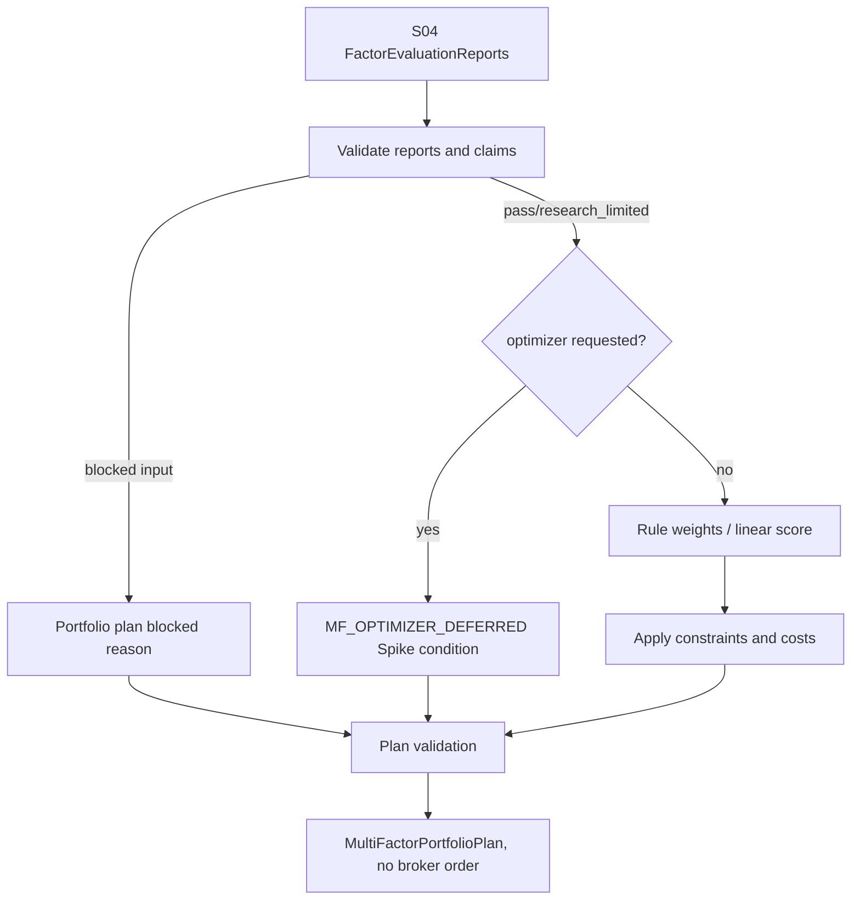

# LLD: CR030-S05-multifactor-combiner-portfolio-plan - 多因子组合与组合计划

> 本 LLD 已通过全量 CP5 人工确认，允许按本设计合同受控实现 P0 `MultiFactorCombiner` 与 `MultiFactorPortfolioPlan`。仍不新增 optimizer / cvxpy / vectorbt / Qlib 依赖，不运行 EnhancedIndexing，不生成 broker order。

## 1. Goal

创建多因子组合合同和组合计划合同，使多个 S04 `FactorEvaluationReport` 可以按可解释规则权重或轻量线性组合生成可审计的 `MultiFactorPortfolioPlan`；若输入报告、成本、容量、benchmark 或约束不足，则输出 structured blocked reason，并把 optimizer / ML workflow 需求登记为后续 Spike 条件。

## 2. Requirements（Functional / Non-Functional）

### 2.1 Functional

- 定义 `MultiFactorCombiner` schema，必填字段覆盖 `combiner_id`、`factor_inputs`、`normalization`、`winsorization`、`neutralization`、`orthogonalization`、`weighting_policy`、`missing_policy`、`constraints`、`rebalance_frequency`、`turnover_cap`、`cost_config`、`benchmark`、`freeze_policy`、`blocked_reason`。
- 定义 `MultiFactorPortfolioPlan` schema，输出因子权重、目标权重 / 数量、benchmark 偏离、成本、容量、调仓日、限制项、freeze version、claims 和 blocked reasons。
- P0 组合策略只允许规则权重或轻量线性组合；`optimizer_policy` 默认 disabled。
- 任一 S04 输入 report 为 `blocked`、缺 P0 claim boundary、缺成本 / 容量 / benchmark 约束时，组合输出 `blocked` 或 `research_limited`。
- optimizer、cvxpy、Qlib EnhancedIndexing、vectorbt optimizer、ML weighting、risk model 需求必须转 Spike，不进入 CR-030 P0。
- 组合计划是研究草稿或 S07 admission 输入，不是 broker order，不生成可提交订单。

### 2.2 Non-Functional

- 可解释：每个组合权重必须能追溯到规则、输入 report、rank / score 或人工配置。
- 可测试：全部策略、缺失值、约束、optimizer blocked、order boundary 均通过 fixture-only 测试验证。
- 安全：依赖变更、QMT 调用、broker order generation、credential read 计数均为 0。
- 可扩展：后续 optimizer Spike 只能消费冻结的内部合同，不替换内部 truth。

## 3. 模块拆分与职责

| 模块 / 文件组 | 职责 | 说明 |
|---|---|---|
| `engine/multifactor_combiner.py` | 定义 combiner 配置、组合计划 schema、规则权重 / 轻量线性组合、约束校验、blocked reason 和 Spike register 输出 | 当前 Story primary owner；不导入 optimizer 依赖。 |
| `tests/test_cr030_multifactor_combiner.py` | 验证规则权重、缺失值策略、约束、成本容量、optimizer blocked 和 broker order 禁止 | fixture-only；不运行 Qlib / vectorbt。 |
| `engine/factor_evaluation.py` | shared：提供 S04 report 输入合同 | 本 Story 只读消费 S04 输出；开发需等待 S04 合同冻结。 |
| `engine/order_intent_draft.py` | shared：S07 / CR025 的 draft handoff 上游参考 | S05 不写 order intent；只输出 portfolio plan。 |

## 4. 代码结构与文件影响范围

| 动作 | 文件路径 | 变更内容 |
|---|---|---|
| 创建 | `engine/multifactor_combiner.py` | 后续实现新增 `MultiFactorCombiner`、`MultiFactorPortfolioPlan`、规则权重 / 线性组合 builder、constraint validator 和 optimizer deferred guard。 |
| 创建 | `tests/test_cr030_multifactor_combiner.py` | 后续实现新增合格 reports、缺失 report、缺成本 / 暴露、optimizer forbidden、order generation forbidden、dependency counter 测试。 |
| 不修改 | `engine/factor_evaluation.py` | shared 上游合同；只读消费 S04 report schema。 |
| 不修改 | `engine/order_intent_draft.py` | shared 下游 / CR025 合同；S05 不生成订单草稿。 |
| 禁止 | `pyproject.toml`、`uv.lock`、optimizer / cvxpy / Qlib / vectorbt runtime、broker order、QMT / credential | 本 Story 不新增依赖，不生成真实订单，不触发真实操作。 |

## 5. 数据模型与持久化设计

本 Story 无新增持久化 truth。后续实现输出的 `MultiFactorPortfolioPlan` 是内存对象或本地研究 artifact 输入，由 S06 manifest/catalog 和 S07 admission 决定是否登记；它不是 broker order、broker lake 或交易授权。

| 对象 / 字段 | 类型 | 约束 | 说明 |
|---|---|---|---|
| `MultiFactorCombiner.combiner_id` | string | 必填 | 稳定识别组合配置。 |
| `factor_inputs` | list[object] | 必填；每项引用 S04 `report_id`、factor_id、status、allowed / blocked claims | blocked report 不得进入 pass plan。 |
| `normalization` / `winsorization` | object | 必填 | 明确标准化和去极值策略。 |
| `neutralization` / `orthogonalization` | object | 必填，可声明 disabled with reason | 若声明中性化，必须有 exposure evidence。 |
| `weighting_policy` | enum/object | 必填；只允许 `rule_weight`、`linear_score` 等 P0 策略 | optimizer disabled by default。 |
| `missing_policy` | object | 必填 | 缺 report / 缺指标 / 缺成本如何降级。 |
| `constraints` | object | 必填 | 包含单因子权重上限、行业 / 风格 / benchmark 偏离、禁入条件。 |
| `rebalance_frequency` / `turnover_cap` | string/object | 必填 | 组合计划必须可复核。 |
| `cost_config` / `capacity` | object | 必填 | 缺失时 blocked / research_limited。 |
| `benchmark` | object | 必填 | benchmark 不足时 blocked claims。 |
| `freeze_policy` | object | 必填 | 冻结版本、可变更条件。 |
| `MultiFactorPortfolioPlan` | object | 必填输出 | 含 target weights、constraints、cost / capacity summary、claims、blocked reasons、lineage。 |

## 6. API / Interface 设计

| 接口 / 入口 | 输入 | 输出 | 调用方 | 说明 |
|---|---|---|---|---|
| `build_multifactor_portfolio_plan(reports, combiner_config, constraints)` | 多个 S04 reports、组合配置、约束 | `MultiFactorPortfolioPlan` | research runner / S07 admission / tests | 测试覆盖合格 reports、blocked report、缺成本 / 暴露。 |
| `validate_combiner_inputs(reports, constraints)` | reports、benchmark、cost、capacity、exposure constraints | validation result / blocked reasons | builder | 测试覆盖缺 report、缺 claim boundary、缺 benchmark。 |
| `compute_rule_weights(reports, weighting_policy)` | 合格 reports、规则权重配置 | factor weights / reason map | builder | 测试覆盖规则权重和线性 score。 |
| `apply_portfolio_constraints(weights, constraints)` | factor weights、约束 | constrained plan / violations | builder | 测试覆盖权重上限、turnover cap、capacity block。 |
| `detect_optimizer_deferred_request(config)` | combiner config | Spike / blocked reason | builder、QA scan | 测试覆盖 cvxpy、EnhancedIndexing、vectorbt、ML workflow 关键词。 |
| `assert_no_broker_order(plan)` | portfolio plan | validation result | S07 / tests | 测试覆盖 plan 不含 order submit / account / broker execution 字段。 |

## 7. 核心处理流程

1. 接收多个 S04 `FactorEvaluationReport`；若任一候选 report 为 `blocked` 或缺 claims，写入 blocked reason 并从 pass plan 排除。
2. 校验 benchmark、cost、capacity、exposure、rebalance 和 turnover constraints；缺 P0 约束时输出 `research_limited` 或 blocked。
3. 检测组合配置是否要求 optimizer / cvxpy / EnhancedIndexing / vectorbt / ML workflow；命中时返回 `MF_OPTIMIZER_DEFERRED`，登记 Spike 条件。
4. 对合格 report 执行标准化、winsorization、必要的中性化 / 正交化说明和规则权重 / 轻量线性组合。
5. 应用组合约束，生成 `MultiFactorPortfolioPlan`，记录权重来源、constraints、cost / capacity、freeze version、allowed / blocked claims。
6. 验证输出不包含 broker order、QMT API、account query、order submit / cancel 字段。



## 8. 技术设计细节

- 关键算法 / 规则：P0 使用 explicit rule weight 或 linear score；输入 report 可按 ICIR、RankIC stability、coverage、turnover、cost sensitivity 形成 score，但每个权重必须记录 reason。
- 缺失值处理：缺单个 report -> 排除或降权并写 reason；缺关键约束 -> blocked；缺 exposure / cost -> 不允许声明中性化、容量或 production readiness。
- 依赖选择与复用点：复用 ADR-083 P0 可解释组合，S04 report schema，HLD §35.7 错误码 `MF_OPTIMIZER_DEFERRED`。
- 兼容性处理：初版只使用 Python 标准库和项目内部类型；不新增 cvxpy / LightGBM / vectorbt / qlib dependency。
- 错误暴露：validator 返回 structured blocked reasons，不抛裸 traceback 给研究报告。
- 图示类型选择：本 LLD 使用流程图，因为 optimizer deferred、input blocked 和 plan validation 分支需要显式表达。

## 9. 安全与性能设计

| 维度 | 设计措施 | 验证方式 |
|---|---|---|
| 安全 | optimizer / external runtime / broker order / QMT / credential 全部 forbidden | forbidden keyword scan、dependency diff、counter tests。 |
| 声明边界 | portfolio plan 只作为研究计划 / S07 admission 输入，不是可提交订单 | `assert_no_broker_order` 测试。 |
| 可解释性 | 每个权重保留 reason、source report 和 policy | rule weight fixture assertion。 |
| 性能 | 组合按 factor count 线性计算，P0 不运行优化器 | 小型 fixture 性能和无外部 runtime 测试。 |
| 可追溯 | plan 带 report refs、freeze policy、constraints、blocked claims | schema validation 测试。 |

## 10. 测试设计

| 测试场景 | 前置条件 | 操作 | 预期结果 | 验证方式 |
|---|---|---|---|---|
| 多个合格 report 组合 | S04 reports 均 pass / warn 且 claims 完整 | 调用 `build_multifactor_portfolio_plan` | 输出规则权重 / 线性 score plan，权重来源可追溯 | S05 unit test。 |
| 输入 report blocked | 至少一个 report `status=blocked` | 调用 builder | blocked report 不进入 pass plan，写入 reason | blocked fixture assertion。 |
| 缺成本 / 暴露 / benchmark | reports 合格但约束缺 P0 字段 | 调用 validator | 输出 `research_limited` 或 blocked claims | constraint test。 |
| optimizer 请求后置 | config 含 cvxpy / EnhancedIndexing / vectorbt / ML weighting | 调用 `detect_optimizer_deferred_request` | 返回 `MF_OPTIMIZER_DEFERRED`，不执行 optimizer | forbidden optimizer test。 |
| 组合计划不是 broker order | plan 生成后扫描字段 | 调用 `assert_no_broker_order` | 不含 order submit、cancel、account、broker execution 字段 | order boundary test。 |
| 禁止真实操作 | fixture-only 环境 | 运行 S05 测试 | dependency change、QMT call、credential read、external runtime 均为 0 | monkeypatch / counter assertion。 |

## 11. 实施步骤

> 以下步骤仅在全量 CP5 人工确认通过、Story dev_gate 满足后执行；本 LLD 本身不实现。

| TASK-ID | 动作 | 目标文件 | 详细描述 | 对应测试 |
|---|---|---|---|---|
| CR030-S05-T1 | 创建 | `engine/multifactor_combiner.py` | 定义 `MultiFactorCombiner`、`MultiFactorPortfolioPlan`、status / blocked reason / freeze policy schema。 | schema 字段覆盖测试。 |
| CR030-S05-T2 | 创建 | `engine/multifactor_combiner.py` | 实现 input validator、rule weight / linear score builder、constraint applier、optimizer deferred detector、no-order validator。 | 合格组合、缺失、optimizer blocked、order boundary tests。 |
| CR030-S05-T3 | 创建 | `tests/test_cr030_multifactor_combiner.py` | 增加规则权重、缺失值、成本容量、optimizer forbidden、order generation forbidden 和 counter fixture。 | 全部 S05 测试。 |
| CR030-S05-T4 | 约束 | optimizer Spike | 固化 optimizer / ML workflow 后置条件，不新增依赖、不运行 EnhancedIndexing。 | forbidden optimizer / dependency diff tests。 |
| CR030-S05-T5 | 约束 | order boundary | 确认组合计划不是 broker order，不写 `engine/order_intent_draft.py`。 | no broker order tests。 |

## 12. 风险、难点与预研建议

### 12.1 实现灰区与取舍记录

| Clarification ID | 问题 | 选项与推荐 | 决策 / 答案 | 影响面 | 证据 | 重访条件 |
|---|---|---|---|---|---|---|
| N/A-CR030-S05 | 本 Story 是否需要新增 LLD clarification item | 推荐：不新增。P0 可解释组合、optimizer 后置、真实 broker order 禁止已由 CP3 DQ-CP3-CR030-04/06、ADR-083 和 Story 卡片冻结。 | 未新增 LCQ；未回答阻断问题为 0；`open_items=0`。 | 接口 / 文件 owner / 测试 / 安全 / 跨 Story 契约 | `checkpoints/CP3-CR030-HLD-REVIEW.md`；`process/ARCHITECTURE-DECISION.md` ADR-083；Story 卡片。 | 若用户要求默认 optimizer、cvxpy、EnhancedIndexing 或 broker order，回退 CP5 或另起 Spike / CR。 |

| 风险 / 难点 | 影响 | 缓解措施 / 预研建议 |
|---|---|---|
| 组合权重不可解释 | 无法支撑 admission 和复核 | 每个权重必须记录 source report、score 和 reason。 |
| optimizer 需求混入 P0 | 新依赖、复杂验证和运行授权越界 | `MF_OPTIMIZER_DEFERRED` 与 forbidden dependency scan。 |
| 组合计划被误读为交易订单 | 越过 CR-020..CR-024 | no-order schema 和 S07 admission boundary 测试。 |
| 缺成本 / 容量仍输出 pass | 风险低估 | 缺 P0 约束时 blocked / research_limited。 |
| 与 S04 report schema 漂移 | 输入不可消费 | CP5 统一确认前保持 S05 消费 S04 §5 / §6 合同。 |

### OPEN / Spike 跟踪

| ID | 类型（OPEN / Spike） | 问题 | 下一动作 | 责任方 |
|---|---|---|---|---|
| CR30-SPIKE-OPTIMIZER | Spike | optimizer / cvxpy / Qlib EnhancedIndexing / vectorbt / ML weighting 后置 | 若 P0 组合不足且用户接受依赖和运行风险，由 meta-po 另起 Spike。 | meta-po / user |

## 13. 回滚与发布策略

- 发布方式：CP5 approved 后作为受控离线组合合同增量进入 Story execution；只创建自有 schema / combiner / tests。
- 回滚触发条件：出现 optimizer / cvxpy dependency、Qlib EnhancedIndexing runtime、vectorbt optimizer runtime、broker order generation、QMT 调用、credential read、依赖变更任一非 0。
- 回滚动作：回滚 `engine/multifactor_combiner.py`、`tests/test_cr030_multifactor_combiner.py` 中本 Story 增量；保留过程 LLD / CP5 审计；需要启用 optimizer 时另起 Spike。

## 14. Definition of Done

- [ ] 14 个章节全部填写完成。
- [ ] P0 组合只使用规则权重或轻量线性组合。
- [ ] `MultiFactorPortfolioPlan` 包含权重、约束、成本、容量、调仓、freeze policy 和 claims 字段。
- [ ] optimizer / cvxpy / EnhancedIndexing / vectorbt runtime 启用次数为 0。
- [ ] 真实 broker order 生成次数为 0。
- [ ] 依赖变更、QMT 调用、credential read 均为 0。
- [ ] 第 6 节每个接口在第 10 节有测试入口。
- [ ] 第 11 节 TASK-ID 覆盖全部文件影响范围。
- [ ] 实现灰区与取舍记录已显式写“无阻断 clarification item”。
- [ ] `confirmed=false` 时不进入实现。
- [ ] `open_items=0`；optimizer Spike 为非阻断后续项。

## 人工确认区

> **CP5 - Story LLD 可实现性门**
> meta-dev 已写入 `process/checks/CP5-CR030-S05-multifactor-combiner-portfolio-plan-LLD-IMPLEMENTABILITY.md` 自动预检结果。meta-po 收齐 CR030-S01..S08 全量 LLD、clarification queue、CP4 摘要和 CP5 自动预检后，再统一发起 `checkpoints/CP5-ALL-STORIES-LLD-BATCH.md` 人工确认。

**CP5 checklist 摘要**：

| # | 检查项 | 状态 | 证据 |
|---|---|---|---|
| 1 | LLD 覆盖 AC | 待人工确认 | 第 2 / 10 / 14 节 |
| 2 | 与 HLD / ADR 一致 | 待人工确认 | 第 3 / 8 / 12 节 |
| 3 | 文件影响范围明确 | 待人工确认 | 第 4 / 11 节 |
| 4 | 接口契约完整 | 待人工确认 | 第 6 节 |
| 5 | 测试与 dev_gate 可计算 | 待人工确认 | 第 10 / 14 节 |
| 6 | clarification queue 已收敛 | 待人工确认 | 第 12.1 节；open_items=0 |

**人工确认回复**：

```text
approve
修改: <具体修改点>
reject
```

**人工审查结果回填**：

- 结论：`approved | changes_requested | rejected`
- 审查人：
- 审查时间：
- 修改意见：
- 风险接受项：
