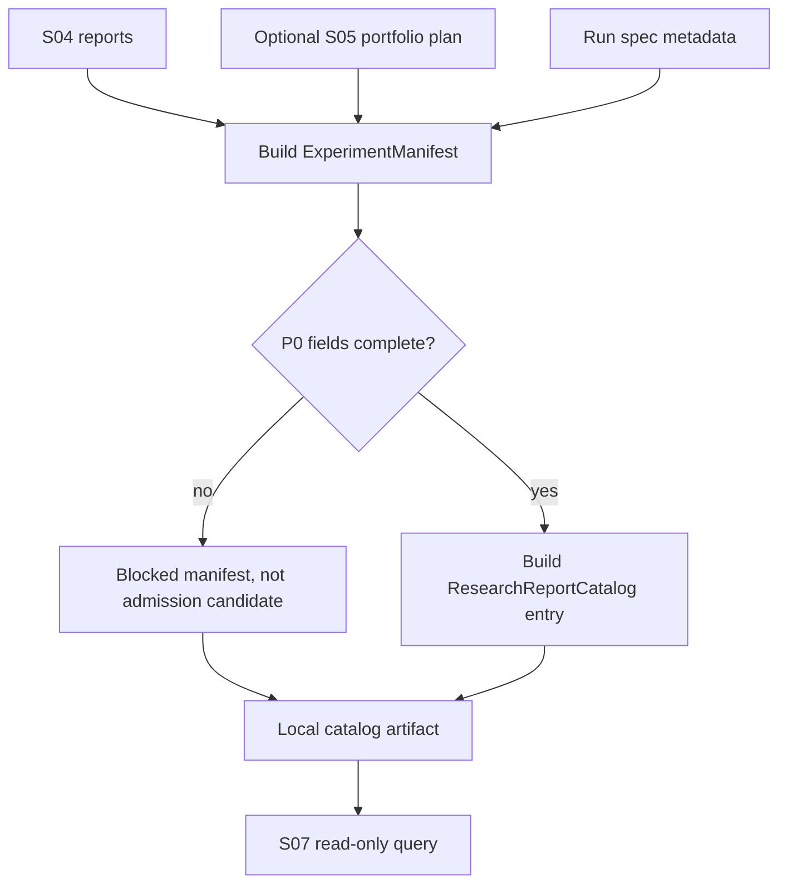

# LLD: CR030-S06-experiment-manifest-report-catalog - ExperimentManifest / ResearchReportCatalog 追踪

> 本 LLD 已通过全量 CP5 人工确认，允许按本设计合同受控实现 `ExperimentManifest` 与 `ResearchReportCatalog`。仍不采用 MLflow / pickle recorder 作为默认 truth，不 publish current pointer，不覆盖旧 reports，不写真实 lake。

## 1. Goal

创建研究 run manifest 和 report catalog 合同，使 S04 单因子评价报告、后续 S05 组合计划和 S07 准入包能够通过 run_id / report_id / artifact refs 追溯数据 release、配置 hash、因子版本、标签窗口、成本、代码版本、claims 和 evidence；缺任一 P0 字段时不得进入 `StrategyAdmissionPackage`。

## 2. Requirements（Functional / Non-Functional）

### 2.1 Functional

- 定义 `ExperimentManifest`，必填字段覆盖 `run_id`、`strategy_id`、`config_hash`、`dataset_release`、`factor_versions`、`label_window`、`benchmark`、`cost_config`、`evaluation_window`、`seed`、`code_version`、`report_paths`、`allowed_claims`、`blocked_claims`、`limitations`、`evidence_refs`。
- 定义 `ResearchReportCatalog`，必填字段覆盖 `catalog_entry_id`、`report_id`、`run_id`、`factor_ids`、`artifact_paths`、`created_at`、`source_lineage`、`status`、`admission_candidate`、`allowed_claims`、`blocked_claims`。
- catalog 只登记可追溯 JSON / CSV / Markdown artifact 和路径引用，不把 Notebook、图表、MLflow run 或 pickle 对象作为默认事实源。
- 缺 config_hash、dataset_release、factor_versions、label_window、report_paths、claims 或 evidence_refs 时，不得进入 S07 `StrategyAdmissionPackage`。
- 不 publish current pointer，不写真实 lake，不覆盖旧 reports。
- 支持按 `run_id`、`report_id`、`factor_id`、`strategy_id` 查询 report refs 和 claims。

### 2.2 Non-Functional

- 可复跑：manifest 的 `config_hash` 覆盖因子、数据、标签、成本、组合配置和 code version。
- 可审计：catalog entry 只保存路径、lineage、claims 和 limitations，不隐藏 blocked claims。
- 可测试：字段完整性、缺 P0 字段阻断 admission、old reports no-overwrite、MLflow / pickle forbidden truth 均通过 fixture-only 测试。
- 安全：catalog publish、lake write、credential read、dependency change、MLflow / pickle default truth 计数均为 0。

## 3. 模块拆分与职责

| 模块 / 文件组 | 职责 | 说明 |
|---|---|---|
| `engine/research_manifest.py` | 定义 `ExperimentManifest`、`ResearchReportCatalog`、manifest validator、catalog entry builder、query helper 和 admission readiness gate | 当前 Story primary owner；不依赖 MLflow / pickle。 |
| `reports/research_catalog/**` | 定义本地 catalog JSON / CSV / Markdown artifact 根和路径索引 | 只允许版本化本地报告索引，不 publish current pointer。 |
| `tests/test_cr030_experiment_manifest_catalog.py` | 验证 manifest / catalog 字段、config hash、artifact refs、admission block、old report no-overwrite 和 forbidden truth | fixture-only；不写真实 lake。 |
| `engine/factor_evaluation.py` | shared：提供 S04 report metadata、claims、artifact refs | S06 只读消费 S04 report 输出。 |
| `reports/factor_evaluation/**` | shared：S04 report artifact 根 | S06 只登记路径和 lineage，不覆盖或重写 report 内容。 |

## 4. 代码结构与文件影响范围

| 动作 | 文件路径 | 变更内容 |
|---|---|---|
| 创建 | `engine/research_manifest.py` | 后续实现新增 manifest / catalog schema、validator、query helper、admission readiness gate 和 forbidden truth guard。 |
| 创建 | `reports/research_catalog/**` | 后续实现新增版本化本地 catalog artifact、schema 示例或 README；不得 publish current pointer。 |
| 创建 | `tests/test_cr030_experiment_manifest_catalog.py` | 后续实现新增字段完整性、config hash、artifact refs、缺 P0 字段 blocked、old report no-overwrite、MLflow / pickle forbidden truth 测试。 |
| 不修改 | `engine/factor_evaluation.py` | shared 上游合同；只读消费 S04 report metadata。 |
| 不修改 | `reports/factor_evaluation/**` | shared report artifact；S06 不重写 S04 report。 |
| 禁止 | `pyproject.toml`、`uv.lock`、MLflow / pickle default truth、catalog publish、old reports overwrite、lake write、credential read | 本 Story 不新增依赖，不 publish，不写真实 lake。 |

## 5. 数据模型与持久化设计

后续实现可创建本地 `reports/research_catalog/**` artifact。该 catalog 是研究报告索引和审计证据，不是 data lake current pointer、publish gate、broker lake 或生产事实源。

| 对象 / 字段 | 类型 | 约束 | 说明 |
|---|---|---|---|
| `ExperimentManifest.run_id` | string | 必填，唯一 | 可复跑和查询入口。 |
| `strategy_id` | string | 必填 | 与后续 S07 admission package 衔接。 |
| `config_hash` | string | 必填，覆盖 factor / data / label / cost / combo / code | 缺失时不得进入 admission。 |
| `dataset_release` | string/object | 必填 | 不能用未发布数据替代。 |
| `factor_versions` | list[object] | 必填 | 每个 factor_id + version 不可变。 |
| `label_window` / `benchmark` / `cost_config` / `evaluation_window` | object | 必填 | 对齐 S03 / S04 合同。 |
| `seed` / `code_version` | string/int | 必填 | 支持复跑。 |
| `report_paths` | list[string] | 必填；路径必须为本地 report artifact | 缺路径不得登记 admission candidate。 |
| `allowed_claims` / `blocked_claims` / `limitations` | list[object] | 必填 | 不得隐藏 blocked claims。 |
| `evidence_refs` | list[string] | 必填 | 指向 S04 report、S05 plan 或 fixture evidence。 |
| `ResearchReportCatalog.catalog_entry_id` | string | 必填，唯一 | catalog 查询入口。 |
| `artifact_paths` / `source_lineage` / `status` / `admission_candidate` | object / enum / bool | 必填 | `admission_candidate=true` 需 P0 字段完整。 |

## 6. API / Interface 设计

| 接口 / 入口 | 输入 | 输出 | 调用方 | 说明 |
|---|---|---|---|---|
| `build_experiment_manifest(run_spec, reports, portfolio_plan, metadata)` | run spec、S04 reports、可选 S05 plan、metadata | `ExperimentManifest` | research runner / S07 admission / tests | 测试覆盖字段完整、缺 config_hash / dataset_release。 |
| `validate_experiment_manifest(manifest)` | manifest object | validation result / blocked reasons | catalog builder、S07 admission | 测试覆盖 P0 字段缺失、claims 缺失。 |
| `build_research_report_catalog_entry(manifest, report_refs)` | manifest、report paths / refs | `ResearchReportCatalog` entry | catalog writer / query helper | 测试覆盖 artifact refs、source lineage、admission_candidate。 |
| `query_research_report_catalog(catalog, filters)` | catalog entries、run_id / report_id / factor_id / strategy_id filters | matching entries | S07 admission、QA、docs | 测试覆盖 run_id 查询和 claims 查询。 |
| `assert_manifest_ready_for_admission(manifest, catalog_entry)` | manifest、catalog entry | pass / blocked reasons | S07 admission | 测试覆盖缺 P0 字段不得进入 admission。 |
| `write_research_catalog_artifacts(entries, output_root)` | validated entries、本地输出根 | write result / paths | report layer | 测试路径限定在 `reports/research_catalog/**`，不 publish。 |

## 7. 核心处理流程

1. 接收 run spec、S04 report metadata、可选 S05 portfolio plan 和研究 metadata。
2. 计算或校验 `config_hash`，确认 dataset release、factor versions、label window、benchmark、cost、evaluation window、seed、code version 均存在。
3. 收集 JSON / CSV / Markdown report paths、allowed / blocked claims、limitations 和 evidence refs。
4. 调用 manifest validator；缺任一 P0 字段时输出 blocked reasons，不登记为 admission candidate。
5. 构建 catalog entry，写入本地 `reports/research_catalog/**` 版本化 artifact；不 publish current pointer。
6. 提供 query helper 给 S07 admission 读取 run / report / factor / strategy 的 evidence refs。



## 8. 技术设计细节

- 关键算法 / 规则：`config_hash` 必须由稳定序列化后的 factor versions、dataset release、label window、benchmark、cost config、evaluation window、combiner config 和 code version 计算；缺字段时不生成 hash。
- admission readiness：`assert_manifest_ready_for_admission` 对 P0 字段、report paths、claims、evidence refs 做 all-or-block 校验。
- 依赖选择与复用点：复用 ADR-084 JSON / CSV / Markdown + config hash 方案；只读消费 S04 / S05 输出，不引入 MLflow / pickle recorder。
- 兼容性处理：旧 reports 可作为 `evidence_refs` 或 lineage 引用，但不得覆盖、重写或作为唯一 current truth。
- 错误暴露：validator 返回 `MF_SCHEMA_REQUIRED_FIELD_MISSING`、`MF_LINEAGE_MISSING`、`MF_PROVIDER_OR_LAKE_NOT_AUTHORIZED` 等 structured reasons。
- 图示类型选择：本 LLD 使用流程图，因为 manifest validation、catalog entry 和 admission readiness 有明确阻断分支。

## 9. 安全与性能设计

| 维度 | 设计措施 | 验证方式 |
|---|---|---|
| 安全 | 不采用 MLflow / pickle default truth；不 catalog publish / lake write / credential read | forbidden truth scan、counter tests。 |
| 数据边界 | catalog 是本地研究报告索引，不是 current pointer | path resolver / publish forbidden tests。 |
| 旧报告保护 | 旧 reports 只读引用，不覆盖 | old report no-overwrite fixture。 |
| 性能 | catalog query 先按 run_id / report_id exact match，fixture 中保持线性可测 | query helper unit test。 |
| 可追溯 | manifest 和 catalog entry 带 config_hash、dataset_release、code_version、evidence_refs | schema validation tests。 |

## 10. 测试设计

| 测试场景 | 前置条件 | 操作 | 预期结果 | 验证方式 |
|---|---|---|---|---|
| 完整 run manifest | run spec、S04 report、可选 S05 plan 字段完整 | 调用 `build_experiment_manifest` | manifest P0 字段覆盖率 100%，config_hash 存在 | S06 unit test。 |
| 缺 config_hash / data release | manifest 缺 P0 字段 | 调用 validator / admission readiness | 返回 blocked reasons，不得进入 admission | blocked field test。 |
| catalog 查询 | catalog entry 含 run_id / report_id / factor_id / strategy_id | 调用 query helper | 返回对应 report paths、claims、evidence refs | query test。 |
| 旧 reports 存在 | 旧实验报告 fixture 存在 | 调用 writer | 不覆盖旧 reports，只写 `reports/research_catalog/**` | no-overwrite test。 |
| MLflow / pickle 默认 truth | manifest 或 catalog 含 MLflow / pickle truth 标记 | 调用 validator / scan | 测试失败或 blocked reason | forbidden truth test。 |
| 禁止 publish / lake | fixture-only 环境 | 运行 S06 测试 | catalog publish、lake write、credential read、dependency change 均为 0 | counter assertion。 |

## 11. 实施步骤

> 以下步骤仅在全量 CP5 人工确认通过、Story dev_gate 满足后执行；本 LLD 本身不实现。

| TASK-ID | 动作 | 目标文件 | 详细描述 | 对应测试 |
|---|---|---|---|---|
| CR030-S06-T1 | 创建 | `engine/research_manifest.py` | 定义 `ExperimentManifest`、`ResearchReportCatalog`、status、blocked reason 和 admission readiness schema。 | schema 字段覆盖测试。 |
| CR030-S06-T2 | 创建 | `engine/research_manifest.py` | 实现 config hash、manifest validator、catalog entry builder、query helper、publish / truth guard。 | config hash、blocked field、query、forbidden truth tests。 |
| CR030-S06-T3 | 创建 | `reports/research_catalog/**` | 定义本地 catalog JSON / CSV / Markdown artifact 形态、命名和 no-publish 约束。 | artifact path / publish forbidden tests。 |
| CR030-S06-T4 | 创建 | `tests/test_cr030_experiment_manifest_catalog.py` | 增加完整 manifest、缺 P0 字段、catalog query、old report no-overwrite、MLflow / pickle forbidden、counter fixture。 | 全部 S06 测试。 |
| CR030-S06-T5 | 约束 | publish boundary / old reports | 明确 catalog 是研究报告索引，不 publish current pointer，不覆盖旧 reports。 | no-overwrite、publish count tests。 |

## 12. 风险、难点与预研建议

### 12.1 实现灰区与取舍记录

| Clarification ID | 问题 | 选项与推荐 | 决策 / 答案 | 影响面 | 证据 | 重访条件 |
|---|---|---|---|---|---|---|
| N/A-CR030-S06 | 本 Story 是否需要新增 LLD clarification item | 推荐：不新增。manifest / catalog P0 字段、artifact 形态、MLflow / pickle 后置和 publish 禁止已由 HLD §35.6/35.7、ADR-084 和 Story 卡片冻结。 | 未新增 LCQ；未回答阻断问题为 0；`open_items=0`。 | 接口 / 文件 owner / 测试 / 安全 / 跨 Story 契约 | `process/HLD.md` §35；`process/ARCHITECTURE-DECISION.md` ADR-084；Story 卡片；CP4 PASS。 | 若用户要求 MLflow / pickle recorder 或 catalog publish，回退 CP5 或另起 adapter / publish CR。 |

| 风险 / 难点 | 影响 | 缓解措施 / 预研建议 |
|---|---|---|
| manifest 缺字段仍进入 admission | 准入证据不可复核 | `assert_manifest_ready_for_admission` all-or-block。 |
| catalog 被误当 current pointer | 越过 publish gate | 文档和 schema 写明 report index only，publish forbidden test。 |
| 旧 report 被覆盖 | 丢失历史追溯 | writer 只写版本化 `reports/research_catalog/**`。 |
| MLflow / pickle truth 混入 | 依赖和 artifact truth 扩大 | forbidden truth guard 和依赖 diff。 |
| 与 S04/S05 artifact 字段漂移 | S07 无法消费 | CP5 统一确认 S04/S05/S06/S07 合同，S06 query helper 保持 exact fields。 |

### OPEN / Spike 跟踪

| ID | 类型（OPEN / Spike） | 问题 | 下一动作 | 责任方 |
|---|---|---|---|---|
| CR30-SPIKE-RECORDER | Spike | 外部 recorder / MLflow / pickle 是否需要 adapter | 若内部 catalog 不足且用户接受依赖与运行风险，另起 adapter / Spike；内部 catalog 仍为 truth。 | meta-po / user |

## 13. 回滚与发布策略

- 发布方式：CP5 approved 后作为受控离线 manifest / catalog 合同增量进入 Story execution；只创建自有 schema / local catalog / tests。
- 回滚触发条件：出现 MLflow / pickle default truth、catalog publish、old reports overwrite、lake write、credential read、dependency change 任一非 0，或缺 P0 字段进入 admission。
- 回滚动作：回滚 `engine/research_manifest.py`、`reports/research_catalog/**`、`tests/test_cr030_experiment_manifest_catalog.py` 中本 Story 增量；保留过程 LLD / CP5 审计；需要 publish 或 recorder 时另起 CR / Spike。

## 14. Definition of Done

- [ ] 14 个章节全部填写完成。
- [ ] manifest/catalog P0 字段覆盖率为 100%。
- [ ] 缺任一 P0 字段进入 `StrategyAdmissionPackage` 次数为 0。
- [ ] 旧报告 overwrite 次数为 0。
- [ ] catalog publish / lake write 次数为 0。
- [ ] MLflow / pickle recorder 作为默认 truth 次数为 0。
- [ ] 第 6 节每个接口在第 10 节有测试入口。
- [ ] 第 11 节 TASK-ID 覆盖全部文件影响范围。
- [ ] 实现灰区与取舍记录已显式写“无阻断 clarification item”。
- [ ] `confirmed=false` 时不进入实现。
- [ ] `open_items=0`；recorder Spike 为非阻断后续项。

## 人工确认区

> **CP5 - Story LLD 可实现性门**
> meta-dev 已写入 `process/checks/CP5-CR030-S06-experiment-manifest-report-catalog-LLD-IMPLEMENTABILITY.md` 自动预检结果。meta-po 收齐 CR030-S01..S08 全量 LLD、clarification queue、CP4 摘要和 CP5 自动预检后，再统一发起 `checkpoints/CP5-ALL-STORIES-LLD-BATCH.md` 人工确认。

**CP5 checklist 摘要**：

| # | 检查项 | 状态 | 证据 |
|---|---|---|---|
| 1 | LLD 覆盖 AC | 待人工确认 | 第 2 / 10 / 14 节 |
| 2 | 与 HLD / ADR 一致 | 待人工确认 | 第 3 / 8 / 12 节 |
| 3 | 文件影响范围明确 | 待人工确认 | 第 4 / 11 节 |
| 4 | 接口契约完整 | 待人工确认 | 第 6 节 |
| 5 | 测试与 dev_gate 可计算 | 待人工确认 | 第 10 / 14 节 |
| 6 | clarification queue 已收敛 | 待人工确认 | 第 12.1 节；open_items=0 |

**人工确认回复**：

```text
approve
修改: <具体修改点>
reject
```

**人工审查结果回填**：

- 结论：`approved | changes_requested | rejected`
- 审查人：
- 审查时间：
- 修改意见：
- 风险接受项：
