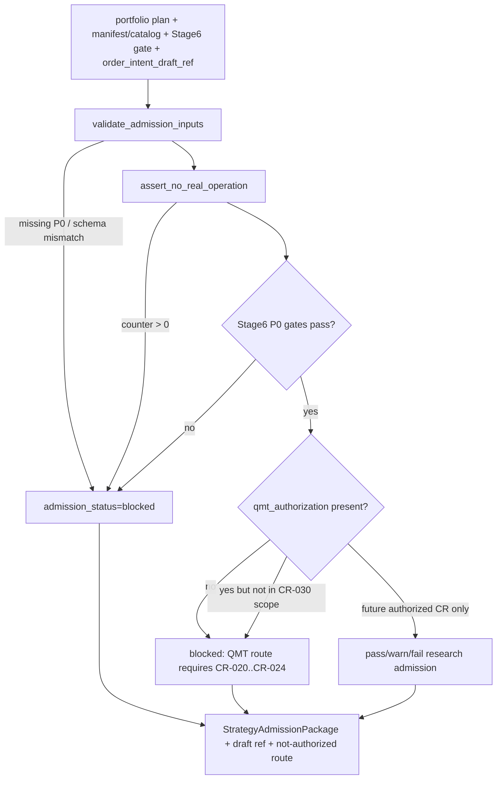

# LLD: CR030-S07 — StrategyAdmissionPackage 与研究到执行 handoff

本文档已通过 CR030-S01..S08 全量 LLD 统一 CP5 人工确认，允许按本 LLD 范围进行受控实现。它不授权依赖变更、外部项目运行、provider/lake/publish、QMT / simulation / live、账户操作或凭据读取。

## 1. Goal

创建 `engine/strategy_admission_package.py` 与 `tests/test_cr030_strategy_admission_package.py` 的实现蓝图，定义 `StrategyAdmissionPackage`、准入状态机、blocked reason 和 `order_intent_draft_v1` 草稿引用边界，使研究结果可以进入 Stage6 admission 审查，但不能被解释为 QMT-ready、simulation-ready、live-ready 或真实可交易证据。

CP5 前用户补充出口目标：CR-030 开发完成后，应支持用户开始项目自有多因子研究和本地回测，并形成“模拟盘前策略准备完成”的证据包。该证据包只表示研究 / 回测 / 准入材料已准备好供后续模拟盘路线审查，不表示已授权或已具备真实 simulation / QMT 运行条件。

## 2. Requirements（Functional / Non-Functional）

### 2.1 Functional

- 接收 CR030-S05 的 `MultiFactorPortfolioPlan`、CR030-S06 的 `ExperimentManifest` / `ResearchReportCatalog`、CR019-S01 的 Stage6 admission gate 结果和 CR025-S03 的 `order_intent_draft_v1` 草稿合同。
- 输出 `StrategyAdmissionPackage`，字段至少覆盖 `package_id`、`strategy_id`、`run_id`、`admission_status`、`evidence_refs`、`blocked_reasons`、`unlock_conditions`、`stage6_gate_summary`、`portfolio_plan_ref`、`manifest_ref`、`catalog_ref`、`order_intent_draft_ref`、`not_authorized_counters`、`allowed_claims`、`blocked_claims`、`limitations`。
- `admission_status` 固定为 `pass`、`warn`、`fail`、`blocked` 四值；任一 Stage6 P0 gate fail、manifest/catalog P0 字段缺失、无独立 QMT CR、或 QMT / broker / credential 禁止项触发时必须输出 `blocked`。
- `order_intent_draft_v1` 只作为草稿引用或待消费对象，不生成可提交订单，不补齐真实 broker 字段，不改变 CR025-S03 的权限边界。
- 对用户要求 simulation/live/QMT 的路径输出 not-authorized blocked reason，并指向 CR-020..CR-024 后续 CR 路线。
- `StrategyAdmissionPackage` 必须能表达“模拟盘前策略准备完成”的受控出口：包含研究证据、回测摘要、Stage6 gate 摘要、blocked / unlock 条件和 draft handoff ref；不得把该出口写成 simulation-ready 或真实模拟盘可运行。

### 2.2 Non-Functional

- 安全：`qmt_api_call`、`mini_qmt_call`、`xtquant_call`、`gateway_start`、`real_order`、`order_cancel`、`account_query`、`broker_lake_write`、`simulation_or_live_run`、`credential_read` 均固定为 0。
- 可审计：所有准入结论必须能追溯到 manifest/catalog、Stage6 gate、portfolio plan 和 draft handoff refs。
- 可解释：blocked reason 使用结构化错误码和人工可读说明，不允许只返回布尔值。
- 兼容：只读引用 `engine/stage6_admission.py`、`engine/order_intent_draft.py`、`trading/stage_gate.py` 的既有合同；不得回滚或扩写上游 Story 的业务范围。
- 权限最小：本 Story 不新增依赖，不 import `xtquant`，不启动 gateway，不读取 `.env` 或任何凭据文件。

## 3. 模块拆分与职责

| 模块 / 文件组 | 职责 | 说明 |
|---|---|---|
| `engine/strategy_admission_package.py` | 定义 StrategyAdmissionPackage 数据结构、状态枚举、blocked reason、构建入口和 forbidden counter 校验 | 当前 Story primary owner；实现时只消费上游合同，不生成真实 order。 |
| `tests/test_cr030_strategy_admission_package.py` | 覆盖准入状态、Stage6 fail、缺 manifest/catalog、no-QMT-CR、draft-only handoff、forbidden counter | 当前 Story primary owner；所有测试使用本地 fixture，不启动外部服务。 |
| `engine/stage6_admission.py` | 只读消费 Stage6 gate summary / P0 gate result | shared，只允许在 CP5 后按 merge_owner 串行补兼容入口；LLD 阶段不修改。 |
| `engine/order_intent_draft.py` | 只读消费 `order_intent_draft_v1` schema / limitations | shared，只允许引用草稿，不生成可提交订单。 |
| `trading/stage_gate.py` | 只读消费后续 QMT route gate 的 blocked 状态 | shared，不授权 QMT、simulation 或 live 操作。 |

## 4. 代码结构与文件影响范围

| 动作 | 文件路径 | 变更内容 |
|---|---|---|
| 创建 | `engine/strategy_admission_package.py` | 新增 `AdmissionStatus`、`AdmissionBlockedReason`、`NotAuthorizedCounters`、`StrategyAdmissionPackage`、`build_strategy_admission_package`、`validate_admission_inputs`、`assert_no_real_operation`。 |
| 创建 | `tests/test_cr030_strategy_admission_package.py` | 新增 pass/warn/fail/blocked 状态测试、Stage6 P0 fail blocked 测试、缺 catalog/manifest blocked 测试、no-QMT-CR blocked 测试、draft-only handoff 测试、forbidden counter 归零测试。 |
| 修改 | `engine/stage6_admission.py` | 仅在实现阶段确需兼容时添加只读 summary adapter；不得改 Stage6 gate 原有判定语义。 |
| 修改 | `engine/order_intent_draft.py` | 仅在实现阶段确需兼容时添加 draft ref helper；不得生成真实 order 或 broker payload。 |
| 修改 | `trading/stage_gate.py` | 仅在实现阶段确需兼容时读取 existing gate status；不得加入 QMT 调用。 |

## 5. 数据模型与持久化设计

| 对象 / 字段 | 类型 | 约束 | 说明 |
|---|---|---|---|
| `AdmissionStatus` | `Literal["pass","warn","fail","blocked"]` | 枚举固定 | `blocked` 用于权限、P0 gate 或证据缺失阻断；`fail` 用于研究准入不达标但权限边界完整。 |
| `AdmissionBlockedReason` | dataclass / TypedDict | `code`、`message`、`source`、`severity`、`unlock_condition` 必填 | 错误码建议以 `MF_ADMISSION_` 前缀命名。 |
| `NotAuthorizedCounters` | dataclass / TypedDict | 所有真实操作计数必须为 0 | 字段覆盖 QMT、order、account、broker lake、simulation/live、credential。 |
| `StrategyAdmissionPackage` | dataclass / TypedDict | P0 refs 和 status 必填 | 作为 JSON-serializable 研究准入证据对象，不写 lake、不 publish。 |
| `OrderIntentDraftRef` | TypedDict | `draft_id`、`schema_version`、`path_or_ref`、`limitations` 必填 | 只引用 CR025-S03 草稿，不补真实订单字段。 |

无新增持久化写入设计；实现阶段只生成内存对象或测试 fixture，不写真实 lake、broker lake、catalog current pointer 或报告覆盖路径。

## 6. API / Interface 设计

| 接口 / 入口 | 输入 | 输出 | 调用方 | 说明 |
|---|---|---|---|---|
| `build_strategy_admission_package(portfolio_plan, manifest, catalog_entry, stage6_gate, order_intent_draft_ref, qmt_authorization=None)` | 上游组合计划、manifest/catalog、Stage6 gate、draft ref、可选授权对象 | `StrategyAdmissionPackage` | 后续 Stage6 admission / 文档层 | 无独立 QMT CR 或授权对象为空时必须 blocked；不调用 QMT。 |
| `validate_admission_inputs(...)` | 同上核心输入 | `list[AdmissionBlockedReason]` | `build_strategy_admission_package`、测试 | 缺 P0 字段、Stage6 P0 fail、draft schema 不匹配均输出 blocked reason。 |
| `assert_no_real_operation(counters)` | `NotAuthorizedCounters` | `None` 或 blocked reason | 构建入口、测试 | 任一 forbidden counter 非 0 时阻断。 |
| `to_jsonable_admission_package(package)` | `StrategyAdmissionPackage` | JSON-serializable dict | 报告 / catalog 后续消费者 | 保持离线可审计；不 publish。 |
| `make_order_intent_draft_ref(draft)` | CR025-S03 draft 对象或 ref dict | `OrderIntentDraftRef` | 构建入口 | 只保留 ref / limitations，不生成 broker order。 |

接口测试映射见第 10 节 `T-S07-01` 至 `T-S07-06`。

## 7. 核心处理流程

1. 读取上游合同对象或 fixture，校验 `portfolio_plan`、`manifest`、`catalog_entry`、`stage6_gate`、`order_intent_draft_ref` 的 P0 字段。
2. 执行 no-real-operation counter 校验；任一禁止计数非 0 时产生 `MF_ADMISSION_REAL_OPERATION_NOT_AUTHORIZED`。
3. 汇总 Stage6 P0 gate，任一 fail 或 blocked 时设置 `admission_status=blocked`。
4. 检查 QMT / simulation / live 独立授权；CR-030 范围内恒定按未授权处理，输出后续 CR 路线。
5. 输出 `StrategyAdmissionPackage`，包含 refs、blocked reasons、unlock conditions、allowed / blocked claims 和 limitations。
6. 任何异常路径都返回结构化 blocked package；不得抛出未解释的异常作为唯一结果。

## 8. 技术设计细节

- 关键规则：准入状态由证据完整性、Stage6 gate、真实操作授权边界三层决定；权限缺失优先级高于研究质量 pass。
- 错误码建议：`MF_ADMISSION_REQUIRED_FIELD_MISSING`、`MF_ADMISSION_STAGE6_P0_GATE_FAILED`、`MF_ADMISSION_MANIFEST_NOT_READY`、`MF_ADMISSION_CATALOG_NOT_READY`、`MF_ADMISSION_QMT_CR_NOT_AUTHORIZED`、`MF_ADMISSION_ORDER_DRAFT_ONLY`、`MF_ADMISSION_REAL_OPERATION_NOT_AUTHORIZED`、`MF_ADMISSION_CREDENTIAL_READ_FORBIDDEN`。
- 依赖选择：只用标准库 dataclass / enum / typing；不新增依赖，不引入 Qlib、Backtrader、xtquant、pandas 之外的新运行要求。
- 兼容性处理：对上游对象使用结构化 dict adapter，允许测试 fixture 提供最小字段；缺字段输出 blocked reason。
- 图示类型选择：流程图；本 Story 跨组合计划、manifest/catalog、Stage6 gate、draft handoff 和 QMT boundary 五类输入。
- 失败暴露：所有 fail-closed 路径进入 `blocked_reasons[]`，并在 `blocked_claims[]` 中记录不可声明内容。

## 9. 安全与性能设计

| 维度 | 设计措施 | 验证方式 |
|---|---|---|
| 安全 | 禁止 QMT / MiniQMT / XtQuant import 或调用；禁止 gateway start、order submit/cancel、account query、broker lake write、simulation/live、credential read | `tests/test_cr030_strategy_admission_package.py` 的 counter 归零测试和 forbidden import/string scan。 |
| 安全 | `StrategyAdmissionPackage` 必须写明不是 QMT-ready / simulation-ready / live-ready / production truth | 文档 / safety Story S08 进一步扫描；S07 测试检查 blocked claims。 |
| 安全 | 无独立 QMT CR 时固定 blocked，并输出 CR-020..CR-024 路线 | `T-S07-04`。 |
| 性能 | 构建过程为对象校验与汇总，时间复杂度随 evidence refs 数线性增长 | fixture 测试不要求外部运行；后续可用小规模 fixture 验证毫秒级完成。 |
| 可维护 | 错误码集中定义，字段为 JSON-serializable | schema round-trip 测试。 |

## 10. 测试设计

| 测试场景 | 前置条件 | 操作 | 预期结果 | 验证方式 |
|---|---|---|---|---|
| T-S07-01 正常研究证据但无 QMT CR | portfolio plan、manifest、catalog、Stage6 gate 均完整 | 调用 `build_strategy_admission_package` 且 `qmt_authorization=None` | 输出 package，`admission_status=blocked`，blocked reason 指向 CR-020..CR-024 | `uv run --python 3.11 pytest -q tests/test_cr030_strategy_admission_package.py` 后续执行。 |
| T-S07-02 Stage6 P0 gate fail | Stage6 gate summary 含 P0 fail | 构建准入包 | `admission_status=blocked`，含 `MF_ADMISSION_STAGE6_P0_GATE_FAILED` | 同上。 |
| T-S07-03 缺 manifest/catalog P0 字段 | manifest 缺 config hash 或 catalog 缺 artifact refs | 构建准入包 | 不进入 pass/warn，输出 required field blocked reason | 同上。 |
| T-S07-04 draft-only handoff | 输入 `order_intent_draft_v1` ref | 构建准入包并序列化 | 只保留 draft ref 和 limitations，不包含 broker order payload | 同上。 |
| T-S07-05 forbidden counter 非 0 | `qmt_api_call=1` 或 `credential_read=1` | 调用 `assert_no_real_operation` | 输出 blocked reason；真实操作计数不得被吞掉 | 同上。 |
| T-S07-06 forbidden import/string scan | 目标模块文本 | 静态扫描 `xtquant`、gateway start、submit/cancel/account query | 命中次数为 0 | 同上。 |

## 11. 实施步骤

| TASK-ID | 动作 | 目标文件 | 详细描述 | 对应测试 |
|---|---|---|---|---|
| CR030-S07-T1 | 创建 | `engine/strategy_admission_package.py` | 定义 admission package schema、状态枚举、blocked reason、not-authorized counters 和 JSON 化输出 | T-S07-01、T-S07-03、T-S07-04 |
| CR030-S07-T2 | 创建 | `tests/test_cr030_strategy_admission_package.py` | 创建 Stage6 fail、no-QMT-CR、draft-only、缺字段、counter 非 0、forbidden scan fixture | T-S07-01 至 T-S07-06 |
| CR030-S07-T3 | 修改 | `engine/stage6_admission.py` | 如需实现兼容，仅添加只读 summary adapter；不得改变 Stage6 gate 判定 | T-S07-02 |
| CR030-S07-T4 | 修改 | `engine/order_intent_draft.py` | 如需实现兼容，仅添加 draft ref helper；不得生成可提交订单 | T-S07-04 |
| CR030-S07-T5 | 修改 | `trading/stage_gate.py` | 如需实现兼容，仅读取 gate blocked 状态；不得增加 QMT 调用路径 | T-S07-01、T-S07-05 |

## 12. 风险、难点与预研建议

### 12.1 实现灰区与取舍记录

| Clarification ID | 问题 | 选项与推荐 | 决策 / 答案 | 影响面 | 证据 | 重访条件 |
|---|---|---|---|---|---|---|
| N/A | 无阻断澄清项 | 推荐按 CP3 DQ-CP3-CR030-06 和 ADR-085 执行：只输出 draft handoff，不生成真实 order | 已由 CP3 approve 和 ADR-085 冻结；无需新增 LCQ | 接口 / 安全 / 跨 Story 契约 | `checkpoints/CP3-CR030-HLD-REVIEW.md`、ADR-085、Story 卡片 | 用户另行启动 CR-020..CR-024 或要求可执行 order 时重访。 |

| 风险 / 难点 | 影响 | 缓解措施 / 预研建议 |
|---|---|---|
| 上游 S05/S06 LLD 字段名与本 Story 预期不一致 | 准入包字段 adapter 需要返工 | 在 CP5 批量确认时对齐 `portfolio_plan_ref`、`manifest_ref`、`catalog_ref` P0 字段；实现时以已 confirmed LLD 为准。 |
| Stage6 gate 既有对象缺 summary adapter | 可能需要触碰 shared 文件 | CP5 后由 S07 merge_owner 串行补只读 adapter，不改 gate 语义。 |
| 用户把 draft handoff 误解为交易授权 | 安全风险高 | blocked claims、not-authorized counters 和 S08 文档扫描共同约束。 |
| 后续 QMT CR 启动后语义扩展 | 当前 package 可能需要消费授权对象 | 保持 `qmt_authorization` 可选输入，但 CR-030 实现中默认 None 且 blocked。 |

### OPEN / Spike 跟踪

| ID | 类型（OPEN / Spike） | 问题 | 下一动作 | 责任方 |
|---|---|---|---|---|
| 无 | N/A | 本 Story 无新增 OPEN / Spike | 不写入 clarification queue | meta-dev / meta-po |

## 13. 回滚与发布策略

- 发布方式：CP5 全量 LLD 人工确认后，按 Wave W4 在 S05/S06 合同 confirmed、CR019-S01 / CR025-S03 可只读引用且文件 owner 无冲突时进入实现；发布为离线 Python 模块和 fixture 测试，不执行真实操作。
- 回滚触发条件：CP5 要求修改；实现阶段发现上游合同字段不兼容；测试发现 QMT/order/account/provider/lake/credential 计数非 0；文档或 package 出现 QMT-ready / simulation-ready / live-ready 误导声明。
- 回滚动作：撤回本 Story 实现增量，保留 LLD 修改记录；将 package 状态降级为 `blocked`；必要时由 meta-po 创建后续 CR / Spike，不在本 Story 扩大范围。

## 14. Definition of Done

- [ ] 14 个章节全部填写完成。
- [ ] `tier`、`shared_fragments`、`open_items=0` 已在 frontmatter 填写。
- [ ] 文件影响范围、接口、测试与 TASK-ID 一一对应。
- [ ] `StrategyAdmissionPackage` 状态覆盖 pass / warn / fail / blocked。
- [ ] 任一 Stage6 P0 gate fail、manifest/catalog P0 字段缺失或无独立 QMT CR 时输出 `admission_status=blocked`。
- [ ] `qmt_api_call`、`real_order`、`account_query`、`order_cancel`、`broker_lake_write`、`credential_read` 均为 0。
- [ ] `order_intent_draft_v1` 只作为草稿引用，不生成可提交订单。
- [ ] OPEN / Spike 已清点为无新增。
- [ ] `confirmed=false` 时不进入实现；CP5 全量人工确认前 implementation_allowed=false。

## 人工确认区

**CP5 checklist 摘要**：

| # | 检查项 | 状态 | 证据 |
|---|---|---|---|
| 1 | LLD 覆盖 AC | 待检查 | 第 2 / 10 / 14 节 |
| 2 | 与 HLD / ADR 一致 | 待检查 | 第 3 / 8 / 12 节 |
| 3 | 文件影响范围明确 | 待检查 | 第 4 / 11 节 |
| 4 | 接口契约完整 | 待检查 | 第 6 节 |
| 5 | 测试与 dev_gate 可计算 | 待检查 | 第 10 / 14 节 |
| 6 | clarification queue 已收敛 | 待检查 | 第 12.1 节；无新增 LCQ |

**人工审查结果回填**：

- 结论：`pending`
- 审查人：
- 审查时间：
- 修改意见：
- 风险接受项：
