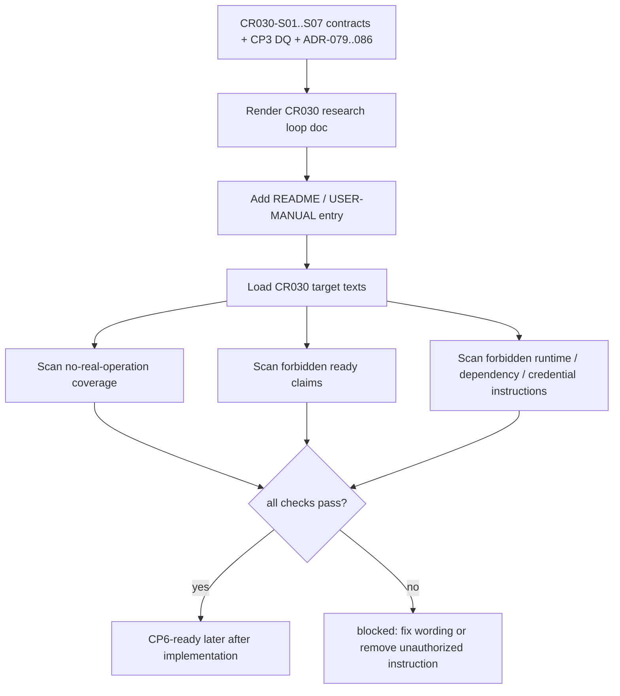

# LLD: CR030-S08 — 安全验证、文档与后续 Spike 边界

本文档已通过 CR030-S01..S08 全量 LLD 统一 CP5 人工确认，允许按本 LLD 范围修改 README / docs 正文并实现安全测试。它仍不授权安装依赖、运行外部项目、provider/lake/publish、QMT / simulation / live 或读取凭据。

## 1. Goal

创建 CR-030 用户文档与 no-real-operation safety 的实现蓝图，收敛 8 个 CR-030 Story 边界、7 个 CP3 决策项、CR-026 / optimizer / ML / vectorbt / PyBroker / RQAlpha / vn.py 后续 Spike 条件，并通过静态安全测试防止文档或代码把 CR-030 表述为真实运行授权。

CP5 前用户补充出口目标：CR-030 开发完成后，用户应可以开始项目自有多因子研究和本地回测，并获得“模拟盘前策略准备完成”的准入证据包。文档必须把该出口解释为后续模拟盘路线审查输入，而不是 simulation-ready、QMT-ready、live-ready 或真实可交易证明。

## 2. Requirements（Functional / Non-Functional）

### 2.1 Functional

- 创建 `docs/CR030-MULTIFACTOR-RESEARCH-LOOP.md`，覆盖多因子研究闭环、核心合同、准入包、not-authorized boundary 和后续 Spike 分流。
- 创建 `tests/test_cr030_no_real_operation_safety.py`，静态扫描 CR-030 目标文件和文档，验证禁止运行、依赖、源码迁移、provider/lake/publish、QMT/simulation/live、凭据示例和误导性 ready 声明。
- 设计 README / `docs/USER-MANUAL.md` 增量入口，只允许短入口与边界说明；不得写成运行授权或安装授权。
- 聚合 CR030-S01..S07 的合同边界，形成 Story traceability 表和 no-real-operation 表。
- 记录 CR-026、optimizer / ML workflow、vectorbt、PyBroker、RQAlpha、vn.py 后续 Spike 条件，不启动任何后续 CR。
- 文档必须显式说明 CR-030 的完成出口：可开始多因子研究和本地回测；可形成模拟盘前策略准备包；不可直接启动模拟盘、QMT gateway、账户 / 订单操作或真实交易链路。

### 2.2 Non-Functional

- 安全：dependency change、external project run、source copy、provider fetch、lake write、catalog publish、QMT operation、simulation/live、credential read 计数均为 0。
- 可审计：文档必须能追溯到 CP3 DQ-CP3-CR030-01..07、ADR-079..086、CR030-S01..S08。
- 可维护：forbidden scan 词表集中定义，便于后续 CR 添加禁用短语；不得依赖外部安全扫描工具。
- 用户可读：文档区分“研究证据”“本地回测”“模拟盘前策略准备包”“草稿 handoff”“真实运行授权”五类边界，避免误读。
- 权限最小：不新增依赖，不运行 Qlib / Alphalens / vectorbt / PyBroker / bt / Zipline Reloaded / LEAN / RQAlpha / vn.py / Backtrader。

## 3. 模块拆分与职责

| 模块 / 文件组 | 职责 | 说明 |
|---|---|---|
| `docs/CR030-MULTIFACTOR-RESEARCH-LOOP.md` | 用户可读主文档，说明 CR-030 自有闭环、合同对象、准入包、不授权边界和后续 Spike | 当前 Story primary owner；实现阶段创建。 |
| `tests/test_cr030_no_real_operation_safety.py` | 执行 forbidden claim、forbidden command、forbidden import、source-copy / migration、credential example 静态扫描 | 当前 Story primary owner；本地 fixture / 文件扫描，不运行外部项目。 |
| `README.md` | 增加最小入口和边界提示 | shared；S08 为 CR-030 文档 merge owner，CP5 后串行合并。 |
| `docs/USER-MANUAL.md` | 增加用户手册说明和故障 / blocked reason 指引 | shared；不得写真实 QMT runbook 或凭据示例。 |
| `docs/CR030-MULTIFACTOR-REFERENCE-MATRIX.md` | 引用 S01 外部项目矩阵 | shared；S08 只引用，不重写矩阵 truth。 |

## 4. 代码结构与文件影响范围

| 动作 | 文件路径 | 变更内容 |
|---|---|---|
| 创建 | `docs/CR030-MULTIFACTOR-RESEARCH-LOOP.md` | 新增 CR-030 闭环说明、Story traceability、CP3 DQ traceability、no-real-operation 表、CR-026 / optimizer 后续 Spike 条件和 QMT route 边界。 |
| 创建 | `tests/test_cr030_no_real_operation_safety.py` | 新增静态扫描测试，覆盖误导性 ready 声明、真实操作命令、外部项目默认运行、依赖安装授权、provider/lake/publish、凭据示例。 |
| 修改 | `README.md` | 增加 CR-030 文档入口和不授权摘要；不得加入运行命令或依赖安装授权。 |
| 修改 | `docs/USER-MANUAL.md` | 增加用户使用边界、blocked reason 解读和后续 CR 路线；不得写真实凭据或 QMT 操作步骤。 |
| 修改 | `docs/CR030-MULTIFACTOR-REFERENCE-MATRIX.md` | 仅在实现阶段需要时补充从主文档回链；不得改 S01 分类事实。 |

## 5. 数据模型与持久化设计

| 对象 / 字段 | 类型 | 约束 | 说明 |
|---|---|---|---|
| `NoRealOperationCategory` | 字符串枚举 / 常量表 | 覆盖 19 类不授权项 | 用于测试中的期望类别集合。 |
| `ForbiddenClaimPattern` | dict / tuple | `pattern`、`reason`、`allowed_context` 必填 | 区分禁止正向声明和允许的否定说明。 |
| `StoryBoundaryEntry` | Markdown 表格行 | Story ID、输出、禁止项、验证入口 | 文档对象，不写数据库。 |
| `FollowUpSpikeEntry` | Markdown 表格行 | 条件、范围、授权门、不得自动启动 | 覆盖 CR-026、optimizer/ML、vectorbt、PyBroker、RQAlpha、vn.py。 |

无新增持久化变更；实现阶段只创建 Markdown 文档和测试文件，不写 lake、catalog current pointer、broker lake 或 reports overwrite。

## 6. API / Interface 设计

| 接口 / 入口 | 输入 | 输出 | 调用方 | 说明 |
|---|---|---|---|---|
| `load_cr030_target_texts(project_root)` | repo 根目录 | `{path: text}` | 安全测试 | 只读取 CR-030 目标文档 / 模块 / 测试，不读取 `.env` 或凭据路径。 |
| `scan_forbidden_claims(texts, patterns)` | 文本映射、pattern 集合 | finding 列表 | 安全测试 | 查找 QMT-ready / simulation-ready / live-ready / production truth 等正向误导声明。 |
| `scan_no_real_operation_boundary(texts, categories)` | 文本映射、类别集合 | coverage / missing 列表 | 安全测试 | 验证 no-real-operation 表覆盖实现、依赖、外部运行、source copy、provider、lake、publish、QMT、credential。 |
| `scan_forbidden_runtime_instructions(texts)` | 文本映射 | finding 列表 | 安全测试 | 禁止默认运行外部项目、默认安装依赖、真实 provider/lake/publish/QMT 命令。 |
| `scan_credential_examples(texts)` | 文本映射 | finding 列表 | 安全测试 | 禁止 token、secret、session、cookie、交易密码、私钥示例。 |

接口测试映射见第 10 节 `T-S08-01` 至 `T-S08-07`。

## 7. 核心处理流程

1. 汇总 CP3 DQ、ADR-079..086、CR030-S01..S07 LLD / Story 边界，生成主文档结构。
2. 在主文档中写明 CR-030 只交付研究合同、报告、准入证据和草稿 handoff，不授权真实运行。
3. 在 README / USER-MANUAL 中添加最小入口和边界链接，不写默认运行命令、依赖安装授权或凭据示例。
4. 编写安全测试读取目标文本并执行 forbidden scan。
5. 若扫描发现正向 ready 声明、真实操作说明、凭据示例或后续 Spike 被写成 P0，测试失败。
6. 所有失败均通过文案修正或删除越权说明解决，不扩大 Story 范围。

## 8. 技术设计细节

- 文档结构：`目标与非目标`、`合同对象`、`Story 边界`、`CP3 决策追溯`、`StrategyAdmissionPackage 边界`、`no-real-operation 表`、`后续 Spike 条件`、`故障与 blocked reason`。
- Forbidden claim 设计：禁止正向出现“CR-030 verified 授权真实操作”“QMT-ready”“simulation-ready”“live-ready”“production truth”“可以直接发单”等语义；允许以否定句说明“不构成 QMT-ready”，也允许“模拟盘前策略准备完成”这类受控出口表述，前提是同段明确不授权真实 simulation / QMT 运行。
- 扫描实现：使用标准库 `pathlib`、`re`、`dataclasses`；不新增依赖，不调用外部安全工具。
- 目标文件白名单：README、USER-MANUAL、CR030 主文档、CR030 reference matrix、CR030 相关 engine/tests 文件；排除 `.env`、data、reports 历史大文件和凭据路径。
- 后续 Spike 条件：CR-026 需要合同冻结、runner I/O、failure model、dependency isolation、provider 禁用、source-of-truth boundary 和用户单独授权；optimizer / ML / vectorbt / PyBroker / RQAlpha / vn.py 均需单独 CR / Spike。
- 失败暴露：测试 finding 包含 path、pattern、reason、suggested_fix，避免只返回计数。

## 9. 安全与性能设计

| 维度 | 设计措施 | 验证方式 |
|---|---|---|
| 安全 | no-real-operation 表覆盖实现、依赖、外部项目运行、source copy、provider、lake、publish、QMT/simulation/live、credential | `T-S08-01`。 |
| 安全 | 禁止默认外部运行命令、依赖安装授权、provider/lake/publish/QMT 操作步骤 | `T-S08-03`、`T-S08-04`。 |
| 安全 | 禁止 QMT-ready / simulation-ready / live-ready / production truth 正向误导声明 | `T-S08-02`。 |
| 安全 | 禁止 token、secret、cookie、session、交易密码、私钥示例 | `T-S08-05`。 |
| 性能 | 文件扫描只处理 CR-030 白名单文件，复杂度为目标文本总长度线性 | fixture 级测试，避免扫描 data/reports 大目录。 |
| 可维护 | pattern 表集中定义，允许后续 CR 增量扩展 | 单元测试检查 pattern 表非空且包含核心类别。 |

## 10. 测试设计

| 测试场景 | 前置条件 | 操作 | 预期结果 | 验证方式 |
|---|---|---|---|---|
| T-S08-01 no-real-operation 覆盖完整 | 目标文档存在 | 扫描 no-real-operation 表 | 19 类不授权项均出现，执行计数为 0 | `uv run --python 3.11 pytest -q tests/test_cr030_no_real_operation_safety.py` 后续执行。 |
| T-S08-02 误导性 ready 声明为 0 | 目标文本加载完成 | 扫描 QMT-ready / simulation-ready / live-ready / production truth 正向声明 | finding 数为 0；否定说明允许；“模拟盘前策略准备完成”仅在同段声明不授权真实 simulation / QMT 运行时允许 | 同上。 |
| T-S08-03 外部项目默认运行说明为 0 | README / docs 文本 | 扫描 qrun、Notebook、外部 runner、provider_uri 默认运行语义 | finding 数为 0 | 同上。 |
| T-S08-04 依赖安装 / provider / lake / publish 授权说明为 0 | 文档文本 | 扫描 `uv add`、安装已授权、provider fetch、lake write、catalog publish 等越权语义 | finding 数为 0；历史禁止说明不算 finding | 同上。 |
| T-S08-05 凭据示例为 0 | 文档文本 | 扫描 token、secret、cookie、session、交易密码、私钥示例 | finding 数为 0 | 同上。 |
| T-S08-06 CP3 DQ 与 Story traceability 完整 | 主文档文本 | 检查 DQ-CP3-CR030-01..07、CR030-S01..S08 均出现 | 覆盖率 100% | 同上。 |
| T-S08-07 后续 Spike 不进入 P0 | 主文档文本 | 检查 CR-026、optimizer / ML、vectorbt、PyBroker、RQAlpha、vn.py 条件 | 均为后续 CR / Spike，不启动 | 同上。 |

## 11. 实施步骤

| TASK-ID | 动作 | 目标文件 | 详细描述 | 对应测试 |
|---|---|---|---|---|
| CR030-S08-T1 | 创建 | `docs/CR030-MULTIFACTOR-RESEARCH-LOOP.md` | 写入研究闭环、合同对象、准入包、不授权边界、DQ / Story traceability 和后续 Spike 条件 | T-S08-01、T-S08-06、T-S08-07 |
| CR030-S08-T2 | 创建 | `tests/test_cr030_no_real_operation_safety.py` | 实现目标文本加载、forbidden claim scan、runtime instruction scan、credential scan 和 coverage scan | T-S08-01 至 T-S08-07 |
| CR030-S08-T3 | 修改 | `README.md` | 添加 CR-030 主文档入口和一句不授权摘要；不得加入运行命令或安装授权 | T-S08-02、T-S08-03、T-S08-04 |
| CR030-S08-T4 | 修改 | `docs/USER-MANUAL.md` | 添加用户手册边界、blocked reason 解读和后续 CR 路线 | T-S08-01、T-S08-05、T-S08-07 |
| CR030-S08-T5 | 修改 | `docs/CR030-MULTIFACTOR-REFERENCE-MATRIX.md` | 如需实现回链，仅补主文档引用；不得改变 S01 外部项目分类 | T-S08-03、T-S08-07 |

## 12. 风险、难点与预研建议

### 12.1 实现灰区与取舍记录

| Clarification ID | 问题 | 选项与推荐 | 决策 / 答案 | 影响面 | 证据 | 重访条件 |
|---|---|---|---|---|---|---|
| N/A | 无阻断澄清项 | 推荐按 CP3 DQ-CP3-CR030-05 / 07、ADR-079..086 与 Story 卡片执行：文档只表达边界，不授权真实操作 | 已由 CP3 approve、CP4 PASS 和 Story 卡片冻结；无需新增 LCQ | 文档 / 安全 / 跨 Story 契约 | `checkpoints/CP3-CR030-HLD-REVIEW.md`、`process/checks/CP4-CR030-STORY-DAG-PARALLEL-SAFETY.md`、ADR-079..086 | 用户要求启动 CR-026、optimizer 或 QMT 后续 CR 时重访。 |

| 风险 / 难点 | 影响 | 缓解措施 / 预研建议 |
|---|---|---|
| 文档为了可操作性写入真实运行命令 | 可能被误读为运行授权 | 只写研究闭环和边界，不写默认 qrun、provider、QMT、publish 命令；通过 forbidden scan 阻断。 |
| 否定说明被扫描误判 | 测试噪声 | pattern 支持 `allowed_context`，允许“不构成 QMT-ready”等否定句。 |
| README / USER-MANUAL 与其他 Story 文件 owner 冲突 | 合并冲突 | S08 是 CR-030 文档 merge owner；CP5 后由 meta-po 串行调度共享文档合并。 |
| 后续 Spike 条件写得过强或过弱 | 影响 CR tracking | 复用 ADR-086 与 CP3 DQ，不新增启动授权；需要变更时交 meta-po 创建 CR。 |

### OPEN / Spike 跟踪

| ID | 类型（OPEN / Spike） | 问题 | 下一动作 | 责任方 |
|---|---|---|---|---|
| CR30-OPEN-01 | Spike | CR-026 Qlib isolated runner 后置 | 合同冻结后由 meta-po 单独启动 CR-026；本 Story只记录条件 | meta-po |
| CR30-OPEN-02 | Spike | optimizer / ML workflow / EnhancedIndexing / cvxpy 后置 | P0 采用可解释组合；不足时另起 optimizer Spike | meta-po |
| CR30-OPEN-03 | Spike | vectorbt / PyBroker / RQAlpha / vn.py 等外部 runtime 后置 | 不进入 CR-030 P0；按独立 CR / Spike 管理 | meta-po |

上述均为 CP4 已记录的 non-blocking-open，不阻断本 LLD；本 Story 无新增 `blocks_lld=true` 项。

## 13. 回滚与发布策略

- 发布方式：CP5 全量 LLD 人工确认后，待 CR030-S01..S07 合同 confirmed 且文件 owner 无冲突时进入实现；发布为 Markdown 文档增量和本地静态安全测试。
- 回滚触发条件：CP5 要求修改；安全测试发现真实运行授权、QMT-ready / simulation-ready / live-ready 误导声明、凭据示例、外部项目默认运行或依赖安装授权；共享文档与其他 Story 冲突。
- 回滚动作：删除或修正文档越权语句，保留 CR-030 主文档的 not-authorized 表；必要时将后续能力转 CR / Spike，不在 S08 中扩大实现范围。

## 14. Definition of Done

- [ ] 14 个章节全部填写完成。
- [ ] `tier`、`shared_fragments`、`open_items=0` 已在 frontmatter 填写。
- [ ] 文档覆盖 7 个 CP3 DQ 和 8 个 CR-030 Story 边界。
- [ ] no-real-operation 表覆盖实现、依赖、外部运行、source copy、provider、lake、publish、QMT/simulation/live、credential。
- [ ] CR-026 后置条件至少 1 处可追溯，且不启动 CR-026。
- [ ] “CR-030 verified 授权真实操作 / QMT-ready / simulation-ready / live-ready / production truth”正向语义匹配次数为 0。
- [ ] dependency change、external project run、provider fetch、lake write、catalog publish、QMT operation、credential read 均为 0。
- [ ] OPEN / Spike 已清点，均为 non-blocking 后续项。
- [ ] `confirmed=false` 时不进入实现；CP5 全量人工确认前 implementation_allowed=false。

## 人工确认区

**CP5 checklist 摘要**：

| # | 检查项 | 状态 | 证据 |
|---|---|---|---|
| 1 | LLD 覆盖 AC | 待检查 | 第 2 / 10 / 14 节 |
| 2 | 与 HLD / ADR 一致 | 待检查 | 第 3 / 8 / 12 节 |
| 3 | 文件影响范围明确 | 待检查 | 第 4 / 11 节 |
| 4 | 接口契约完整 | 待检查 | 第 6 节 |
| 5 | 测试与 dev_gate 可计算 | 待检查 | 第 10 / 14 节 |
| 6 | clarification queue 已收敛 | 待检查 | 第 12.1 节；无新增 LCQ |

**人工审查结果回填**：

- 结论：`pending`
- 审查人：
- 审查时间：
- 修改意见：
- 风险接受项：
