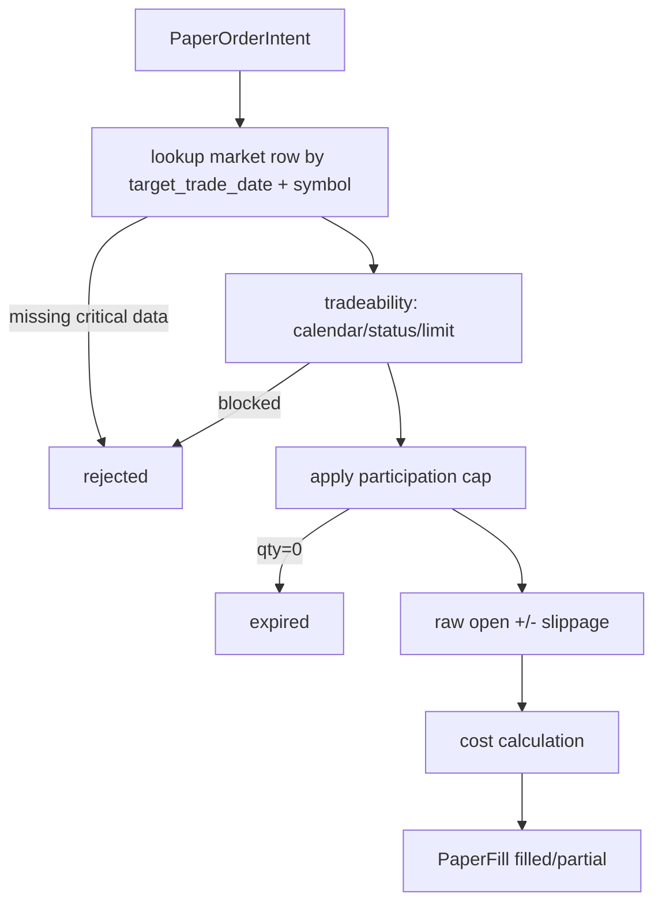

# LLD: CR041-S03 - PaperBroker Fill Engine

## 0. 上游设计依据

| 来源 | 路径 / ID | 被本 LLD 消费的内容 |
|---|---|---|
| CP2 | `process/checkpoints/CP2-CR041-REQUIREMENTS-BASELINE.md` | T+1 raw open、raw close 估值、成本、滑点、participation cap、A 股账户规则。 |
| CP3 | `process/context/CP3-CR041-DESIGN-CONTEXT.yaml` | 本地 PaperBroker fill engine 架构和 not-authorized 列表。 |
| CP4 | `process/checks/CP4-CR041-STORY-DAG-PARALLEL-SAFETY.md` | S03 依赖 S01/S02，主文件 `engine/paper_simulation.py`。 |

## 1. Goal

创建本地 `PaperBroker` 撮合引擎设计，根据 S02 的 `PaperOrderIntent` 和日频 raw OHLCV / trade_status / prices_limit / volume 数据，输出 `PaperFill`、rejected/expired reason 和 cost breakdown。

## 2. Requirements（Functional / Non-Functional）

### 2.1 Functional

- 执行价为 T+1 `raw open`，估值由 S04 使用 `raw close`。
- 买入执行价加 fixed bps slippage，卖出执行价减 fixed bps slippage。
- 成本覆盖 commission、min commission、stamp duty sell-only、transfer fee。
- 停牌、非交易日、缺 raw open/close/volume、缺涨跌停字段时 fail-closed。
- 涨停日禁止买入成交，跌停日禁止卖出成交；无法判断时 rejected。
- 成交量约束：`max_fill_qty=floor(volume * max_participation_rate / 100_share_lot) * 100`；超过则 partial fill。
- 订单生命周期：第一版日内订单，不顺延；未成交记为 `rejected` 或 `expired`。

### 2.2 Non-Functional

- 安全：不连接 broker，不调用行情订阅，不做分钟/tick/Level2 回放。
- 可解释：每个 fill 或 rejection 必须有 `reason_code`。
- 可重复：同输入顺序、同配置输出稳定。

## 3. 模块拆分与职责

| 模块 / 文件组 | 职责 | 说明 |
|---|---|---|
| `engine/paper_simulation.py` | 定义 `PaperBrokerConfig`、`MarketDataRow`、`PaperFill`、`simulate_fills`、cost/slippage/tradeability helper | 当前 Story primary owner。 |
| `tests/test_cr041_paper_simulation.py` | 覆盖成交、partial、停牌、涨跌停、费用、滑点、缺字段 fail-closed | S05 统一落测试文件。 |

## 4. 代码结构与文件影响范围

| 动作 | 文件路径 | 变更内容 |
|---|---|---|
| 创建 | `engine/paper_simulation.py` | 新增 `PaperBrokerConfig`、`PaperFill`、`PaperFillStatus`、`simulate_fills`、`calculate_costs`、`check_tradeability`。 |
| 创建 | `tests/test_cr041_paper_simulation.py` | 新增 S03 成交模型测试。 |

## 5. 数据模型与持久化设计

| 对象 / 字段 | 类型 | 约束 | 说明 |
|---|---|---|---|
| `PaperBrokerConfig.fixed_slippage_bps` | float | >=0 | 买加卖减。 |
| `commission_rate` | float | >=0 | 按成交金额。 |
| `min_commission` | float | >=0 | 单笔最低佣金。 |
| `stamp_duty_rate` | float | sell-only | 卖出收取。 |
| `transfer_fee_rate` | float | >=0 | 可配置。 |
| `max_participation_rate` | float | 0 < rate <= 1 | 成交量参与率。 |
| `PaperFill.status` | enum | filled/partial/rejected/expired | 本地成交状态。 |
| `PaperFill.exec_price` | float | raw open +/- slippage | qfq/hfq 禁止。 |
| `PaperFill.costs` | dict | 必填 | cost breakdown。 |

无新增持久化；S05 负责序列化 fills artifact。

## 6. API / Interface 设计

| 接口 / 入口 | 输入 | 输出 | 调用方 | 说明 |
|---|---|---|---|---|
| `simulate_fills(order_intents, market_data, config, cash_snapshot, position_snapshot)` | intents、日频市场数据、配置、现金/持仓快照 | `list[PaperFill]` | S04 / CLI | 不修改账本，只返回 fill 结果。 |
| `check_tradeability(intent, market_row)` | intent、行情行 | pass 或 reason | fill engine | 缺字段 / 停牌 / 涨跌停 fail-closed。 |
| `calculate_costs(side, qty, exec_price, config)` | 方向、数量、价格、配置 | cost dict | fill engine / tests | 覆盖最低佣金、印花税、过户费。 |
| `apply_participation_cap(qty, volume, rate)` | 数量、成交量、参与率 | adjusted qty、reason | fill engine | 向下取整到 100 股。 |

## 7. 核心处理流程

## 8. 技术设计细节

- 涨跌停判定：若 `raw_open >= up_limit` 且 buy，则 rejected；若 `raw_open <= down_limit` 且 sell，则 rejected；缺 limit 字段 fail-closed。
- 停牌判定：`trade_status` 必须为 open/trading 等明确可交易值；未知值 rejected。
- 现金/持仓检查在 S04 ledger 最终执行，S03 可基于 snapshot 预判并写 reason，但不直接扣账。
- 图示类型选择：流程图；存在多条异常分支。

## 9. 安全与性能设计

| 维度 | 设计措施 | 验证方式 |
|---|---|---|
| 安全 | 全部行情来自传入 DataFrame/dict，不 provider fetch | 单测和静态扫描。 |
| 安全 | 不输出 broker order id / account id | fill schema 测试。 |
| 性能 | 日频批量按 symbol/date 建索引，O(n) intents | fixture 覆盖多标的。 |

## 10. 测试设计

| 测试场景 | 前置条件 | 操作 | 预期结果 | 验证方式 |
|---|---|---|---|---|
| S03-T01 正常买入成交 | open/close/volume/limit/status 完整 | simulate | filled，价格含正滑点，成本正确 | pytest |
| S03-T02 正常卖出成交 | sell intent | simulate | filled，价格含负滑点，印花税 sell-only | pytest |
| S03-T03 volume cap partial | qty > cap | simulate | partial，qty 为 cap | pytest |
| S03-T04 涨停买入 | raw_open >= up_limit | simulate buy | rejected | pytest |
| S03-T05 缺关键行情 | 缺 volume 或 limit | simulate | rejected fail-closed | pytest |

## 11. 实施步骤

| TASK-ID | 动作 | 目标文件 | 详细描述 | 对应测试 |
|---|---|---|---|---|
| CR041-S03-T1 | 创建 | `engine/paper_simulation.py` | 定义 PaperBrokerConfig / PaperFill schema | S03-T01 |
| CR041-S03-T2 | 创建 | `engine/paper_simulation.py` | 实现 tradeability 和 limit / status guard | S03-T04、S03-T05 |
| CR041-S03-T3 | 创建 | `engine/paper_simulation.py` | 实现 slippage、cost、participation cap | S03-T01..S03-T03 |
| CR041-S03-T4 | 创建 | `tests/test_cr041_paper_simulation.py` | 添加 S03 tests | S03-T01..S03-T05 |

## 12. 风险、难点与预研建议

### 12.1 实现灰区与取舍记录

| Clarification ID | 问题 | 选项与推荐 | 决策 / 答案 | 影响面 | 证据 | 重访条件 |
|---|---|---|---|---|---|---|
| N/A | 无阻断澄清项 | 按 CP2 已确认 L2-minus 日频模型执行 | 用户已同意 | 成交 / 测试 | CP2 checkpoint | 引入 minute/VWAP/Level2 时重访。 |

| 风险 / 难点 | 影响 | 缓解措施 / 预研建议 |
|---|---|---|
| 日频 open 无法表达排队 | 真实度低于盘口级 | 明确 L2-minus，不声明盘口级。 |
| participation cap 仍是代理 | 容量估计粗糙 | 在报告中暴露 cap、unfilled qty 和 reason。 |

### OPEN / Spike 跟踪

| ID | 类型（OPEN / Spike） | 问题 | 下一动作 | 责任方 |
|---|---|---|---|---|
| N/A | OPEN | 无 | 无 | N/A |

## 13. 回滚与发布策略

- 发布方式：本地 engine + tests，CLI 未完成前不作为用户入口。
- 回滚触发条件：成交价使用复权价、缺字段未 fail-closed、费用计算错误。
- 回滚动作：回退 S03 fill engine，保留 S01/S02。

## 14. Definition of Done

- [ ] 14 个章节全部填写完成
- [ ] 文件影响范围、接口、测试与实施步骤可直接指导编码
- [ ] `confirmed=false` 时不进入实现
- [ ] OPEN / Spike 已清点

## 人工确认区

CP5 批次人工确认文件：`process/checkpoints/CP5-CR041-ALL-STORIES-LLD-BATCH.md`。
