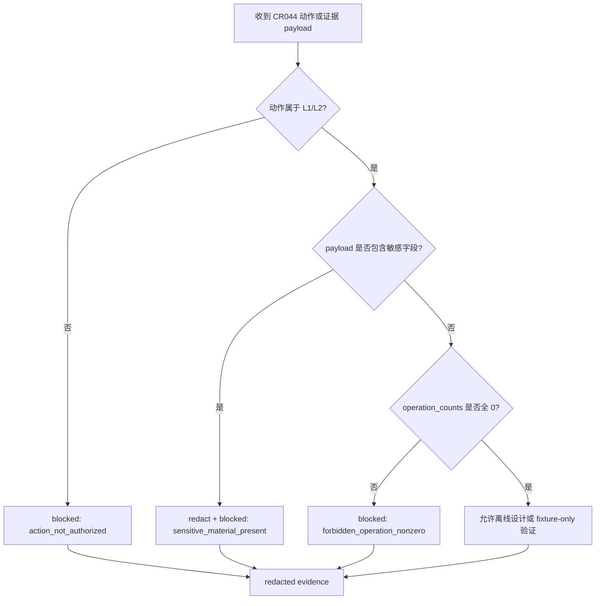

# LLD: CR044-S01 — Authorization and Secret Boundary

本文档只定义 CR044 的授权与敏感信息边界。它不授权、不实现、不触发任何真实 broker runtime。

## 0. 上游设计依据

| 来源 | 路径 / ID | 被本 LLD 消费的内容 |
|---|---|---|
| CR | `process/changes/CR-044-GOLDMINER-SIMULATION-ADMISSION-2026-06-11.md` | CR044 当前仅授权 L1 formal CR orchestration 与 L2 offline engineering design / fixture-only；L3+ 全部未授权。 |
| CP2 | `process/checkpoints/CP2-CR044-REQUIREMENTS-BASELINE.md` | 用户已确认零凭据持有、L3+ 逐 run 授权、CP2 approve 不授权 runtime。 |
| CP3 | `process/checkpoints/CP3-CR044-HLD-REVIEW.md` | 用户已确认 blocked-first、zero credential retention、redaction-first、L2 禁止真实 SDK import/call。 |
| Feature Matrix | `docs/design/FEATURE-DESIGN-MATRIX-CR044.md#feat-cr044-auth` | S01 为 full-lld；授权与敏感字段合同是后续 S02-S06 前置输入。 |
| CP4 | `process/checks/CP4-CR044-STORY-DAG-PARALLEL-SAFETY.md` | CP4 PASS；S01 是 DAG 根节点，CP5 前不允许实现。 |
| 代码基线 | `engine/broker_adapter.py` | 现有 `SENSITIVE_FIELD_PATTERNS`、`FORBIDDEN_ADAPTER_OPERATION_COUNTERS`、`BrokerAdapterResult.to_dict()` 固定 no-runtime 语义。 |
| 回归测试基线 | `tests/test_cr042_broker_adapter_contract.py` | 现有测试要求敏感字段不泄漏、真实操作计数为 0、禁止 broker/network/trading runtime import/call。 |

## 1. Goal

建立 CR044 的授权分层、禁止操作集合、敏感字段分类、脱敏证据形态和 fail-closed 决策表，作为 S02-S06 的共享设计合同，确保未获 L3+ 逐 run 授权前所有真实 broker 行为都被阻断。

## 2. Requirements（Functional / Non-Functional）

### 2.1 Functional

- 定义 `authorization_layers`：L1 formal CR orchestration、L2 offline engineering design / fixture-only、L3 credential/account permission、L4 readonly query、L5 submit/cancel/reconcile runtime。
- 定义 `not_authorized_actions`，至少包含：`credential_read`、`login`、`connect`、`account_query`、`cash_query`、`position_query`、`order_query`、`fill_query`、`order_submit`、`order_cancel`、`simulation_runtime`、`live_runtime`、`provider_fetch`、`lake_write`、`catalog_publish`。
- 定义 `sensitive_field_patterns`，至少覆盖：`token`、`secret`、`password`、`passwd`、`cookie`、`session`、`private_key`、`account_id`、`broker_account`、`real_account`、`trade_password`、`credential`。
- 定义 redaction 输出规则：允许字段名、规则 ID、`REDACTED`、`present=true/false`、计数和 hash-like 状态；禁止保存真实值。
- 定义 fail-closed 决策表：任一 L3+ 行为未授权、凭据字段出现、真实操作计数非零、broker payload 未脱敏时，设计和后续实现均必须 blocked。

### 2.2 Non-Functional

- 安全：不读取 `.env`、token、account、password、session、cookie、private key；不要求用户提供真实账户材料。
- 可审计：所有 blocked reason、redaction summary、operation counts 必须可被 CP7 静态审查。
- 可测试：合同必须可用合成 fixture 验证，不依赖真实 SDK、网络、账号或交易终端。
- 兼容：优先复用 `engine/broker_adapter.py` 的现有常量和 `BrokerAdapterResult` 输出形态；CP5 前不修改源码。

## 3. 模块拆分与职责

| 模块 / 文件组 | 职责 | 说明 |
|---|---|---|
| `CR044AuthorizationLayer`（设计对象） | 描述 L1-L5 授权层级、状态与默认动作 | 后续实现可落为 enum / literal；本 Story 只冻结合同。 |
| `CR044NotAuthorizedAction`（设计对象） | 描述未授权动作集合和阻断理由 | 必须覆盖 CR、CP2、CP3、用户当前授权边界。 |
| `CR044SensitiveFieldPolicy`（设计对象） | 描述字段名匹配、值处理和输出限制 | 与现有 `SENSITIVE_FIELD_PATTERNS` 对齐，后续可扩展但不得收窄。 |
| `CR044RedactedEvidence`（设计对象） | 描述可保存的脱敏证据结构 | 被 S05/S06 消费。 |
| `process/stories/CR044-S01-authorization-and-secret-boundary-LLD.md` | 设计证据 | 本文件是 S01 的正式 CP5 设计证据。 |

## 4. 代码结构与文件影响范围

| 动作 | 文件路径 | 变更内容 |
|---|---|---|
| 创建 | `process/stories/CR044-S01-authorization-and-secret-boundary-LLD.md` | 写入 S01 full-lld 设计证据。 |
| 创建 | `process/checks/CP5-CR044-S01-authorization-and-secret-boundary-LLD-IMPLEMENTABILITY.md` | 写入 S01 CP5 自动预检。 |
| 不修改 | `engine/broker_adapter.py` | CP5 前不实现；后续实现若修改，只能复用 / 扩展授权常量与校验逻辑，不引入 runtime。 |
| 不修改 | `tests/test_cr042_broker_adapter_contract.py` | 现有 CR042 回归保持只读，不作为 CR044 写入目标。 |

## 5. 数据模型与持久化设计

无新增持久化。后续实现可在内存 / fixture 层表达以下结构，禁止写入真实凭据或真实账号值。

| 对象 / 字段 | 类型 | 约束 | 说明 |
|---|---|---|---|
| `authorization_layer` | enum / str | `L1`..`L5` | 当前有效层级仅 L1/L2；L3-L5 状态为 `not_authorized`。 |
| `not_authorized_actions` | tuple[str, ...] | 至少 15 项；不得静默删除 | 被 S02-S06 统一消费。 |
| `sensitive_field_patterns` | tuple[str, ...] | 大小写不敏感子串匹配 | 与 CR042 现有常量保持兼容。 |
| `redaction_summary` | mapping | 只包含字段名、规则 ID、计数、`present`、`REDACTED` | 禁止保存真实值、原始 payload、token、account。 |
| `operation_counts` | mapping[str, int] | L3+ 对应计数在当前授权下必须为 0 | 非零即 blocked，不做降级运行。 |

## 6. API / Interface 设计

| 接口 / 入口 | 输入 | 输出 | 调用方 | 说明 |
|---|---|---|---|---|
| `classify_authorization(action)` | action 字符串 | `allowed_l1_l2` / `blocked_l3_l4_l5` + reason | S02/S03/S04/S06 | L1/L2 文档和 fixture 允许；L3+ 默认 blocked。 |
| `detect_sensitive_fields(payload)` | 合成 payload / 字典 | 字段路径集合 | S03/S05/测试 | 只检测字段名；遇到敏感字段时不得输出原值。 |
| `redact_evidence(payload)` | 合成 payload / blocked result | redacted evidence | S05/S06/CP7 | 输出仅含结构、计数、`REDACTED` 和摘要。 |
| `assert_no_real_operation(operation_counts)` | operation_counts | pass / blocked reason | S02/S04/S05/测试 | 任一 L3+ 计数非零必须 blocked。 |
| `fail_closed(reason)` | reason、source | `BrokerAdapterResult` compatible blocked result | S02-S05 | 不抛未归一化异常，不执行补偿性真实动作。 |

## 7. 核心处理流程

1. 接收动作名、payload 或后续测试 fixture。
2. 先判定动作是否处于 L1/L2；L3+ 一律 fail-closed。
3. 检测敏感字段名；发现后只输出字段路径和脱敏摘要。
4. 检查真实操作计数；任何非零均 blocked。
5. 生成可审计 redacted evidence，供 S05/S06 和 CP7 消费。

## 8. 技术设计细节

- 关键规则：授权判定优先级高于功能能力；SDK 静态候选能力不得提升运行授权。
- 依赖选择与复用点：复用 CR042 的 `SENSITIVE_FIELD_PATTERNS`、`FORBIDDEN_ADAPTER_OPERATION_COUNTERS`、`BrokerAdapterBlockedReason`、`BrokerAdapterResult` 形态。
- 兼容性处理：若未来新增敏感字段，只能扩展列表；不得把 `account_id`、`broker_order_id` 等真实 broker 标识降级为普通字段。
- 图示类型选择：流程图；本 Story 是所有后续 Story 的安全前置分支。

## 9. 安全与性能设计

| 维度 | 设计措施 | 验证方式 |
|---|---|---|
| 安全 | 零凭据持有；L3+ 默认 blocked；敏感字段只输出路径和 `REDACTED`；CP5/CP8 approve 不授权 runtime。 | CR044 guard fixture、artifact scan、CP5/CP7 人工审查。 |
| 性能 | 字段检测只遍历本地合成 payload；无网络、无 SDK import、无 I/O 密集路径。 | 单元测试使用小型 fixture；禁止 provider/lake/catalog 操作。 |

## 10. 测试设计

| 测试场景 | 前置条件 | 操作 | 预期结果 | 验证方式 |
|---|---|---|---|---|
| L3+ 动作默认 blocked | 无逐 run 授权 | 调用 `classify_authorization("cash_query")` | 返回 blocked，reason 包含 `cash_query_not_authorized` | 后续 CR044 fixture test |
| 敏感字段检测 | 合成 payload 含 `account_id` / `token` 字段名 | 调用 `detect_sensitive_fields` | 返回字段路径，不返回原始值 | 后续 CR044 fixture test + artifact scan |
| operation_counts 非零 blocked | 合成 payload 含 `real_broker_call: 1` | 调用 `assert_no_real_operation` | blocked，reason 包含 `forbidden_operation_nonzero` | 后续 CR044 fixture test |
| redacted evidence 可审计 | blocked result | 调用 `redact_evidence` | 包含 schema、status、blocked_reasons、redaction_summary；无真实值 | 后续 CP7 artifact scan |
| CR042 回归不破坏 | CP5 后实现时 | 运行 CR042 adapter 合同测试 | 现有 no-runtime 语义保持 | `uv run --python 3.11 pytest -q tests/test_cr042_broker_adapter_contract.py` |

## 11. 实施步骤

| TASK-ID | 动作 | 目标文件 | 详细描述 | 对应测试 |
|---|---|---|---|---|
| CR044-S01-T1 | 创建 | `process/stories/CR044-S01-authorization-and-secret-boundary-LLD.md` | 写入授权层级、禁止操作、敏感字段和 redaction 合同。 | CP5 自动预检 |
| CR044-S01-T2 | 创建 | `process/stories/CR044-S01-authorization-and-secret-boundary-LLD.md` | 写入 fail-closed 流程、接口设计和测试入口。 | CP5 自动预检 |
| CR044-S01-T3 | 创建 | `process/checks/CP5-CR044-S01-authorization-and-secret-boundary-LLD-IMPLEMENTABILITY.md` | 校验设计完整性和未越权。 | 静态文档检查 |
| CR044-S01-T4 | 后续实现 | `engine/broker_adapter.py` 或 CR044 scoped guard 文件 | CP5 approved 后才允许落代码；不得引入真实 runtime。 | CR042 回归 + CR044 fixture |

## 12. 风险、难点与预研建议

### 12.1 实现灰区与取舍记录

| Clarification ID | 问题 | 选项与推荐 | 决策 / 答案 | 影响面 | 证据 | 重访条件 |
|---|---|---|---|---|---|---|
| N/A | 本 Story 无需新增 clarification queue 项 | 推荐沿用 CP2/CP3 已批准的 L1/L2-only 与零凭据持有边界 | 已由 CP2/CP3 用户确认 | 安全 / 测试 / 跨 Story 契约 | `CP2-CR044-REQUIREMENTS-BASELINE.md`、`CP3-CR044-HLD-REVIEW.md` | 任何真实凭据、账号、查询、下单、撤单需求出现时重访。 |

| 风险 / 难点 | 影响 | 缓解措施 / 预研建议 |
|---|---|---|
| 真实账号字段未知 | 后续 S03/S05 只能定义候选映射 | 标为 static candidate / unknown，不宣称 real-verified。 |
| 敏感字段误漏 | 可能泄漏账号或 token | 默认字段名子串匹配；CP7 artifact scan；列表只能扩展不可收窄。 |
| CP5/CP8 被误解为运行授权 | 可能触发未授权 runtime | LLD、CP5、S06 runbook 均明确 approve 不授权 L3+。 |

### OPEN / Spike 跟踪

| ID | 类型（OPEN / Spike） | 问题 | 下一动作 | 责任方 |
|---|---|---|---|---|
| N/A | N/A | 无阻断 LLD 的开放问题 | N/A | N/A |

## 13. 回滚与发布策略

- 发布方式：CP5 前仅发布设计证据；CP5 全量人工确认后才可进入实现计算。
- 回滚触发条件：发现 LLD 暗含 L3+ 授权、要求读取凭据、允许真实查询/下单/撤单、或保存真实敏感值。
- 回滚动作：撤回本 LLD 的 ready-for-review 状态，退回 CP5 修改；必要时交回 meta-po 发起新的安全授权决策。

## 14. Definition of Done

- [x] 14 个章节全部填写完成。
- [x] 文件影响范围、接口、测试与实施步骤可直接指导后续编码。
- [x] 实现灰区与取舍记录已写明无新增 LCQ。
- [x] `confirmed=false` 时不进入实现。
- [x] frontmatter 已填写 `tier`、`status=ready-for-review`、`confirmed=false`。
- [x] OPEN / Spike 已清点为 N/A。
- [x] 文档未授权任何 credential / broker / account / query / order / simulation / live / provider / lake / catalog 行为。

## 人工确认区

**CP5 checklist 摘要**：

| # | 检查项 | 状态 | 证据 |
|---|---|---|---|
| 1 | LLD 覆盖 AC | 待检查 | 第 2 / 10 / 14 节 |
| 2 | 与 HLD / ADR / CP2 / CP3 一致 | 待检查 | 第 0 / 8 / 12 节 |
| 3 | 文件影响范围明确 | 待检查 | 第 4 / 11 节 |
| 4 | 接口契约完整 | 待检查 | 第 6 节 |
| 5 | 测试与 dev_gate 可计算 | 待检查 | 第 10 / 14 节 |
| 6 | clarification queue 已收敛 | 待检查 | 第 12.1 节 |

人工确认回复由 meta-po 在 `process/checkpoints/CP5-CR044-ALL-STORIES-LLD-BATCH.md` 统一发起。
