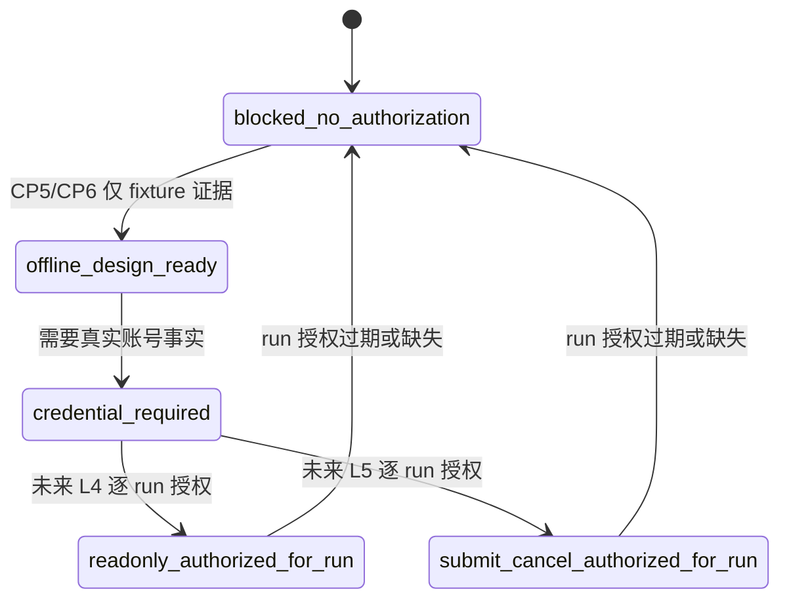

# LLD: CR044-S02 — Admission Gate and Capability State

本文档设计 Goldminer admission gate 和 capability state。CP5 确认前不修改 `engine/broker_adapter.py`，不导入 `gm` / `gmtrade`，不连接 broker。

## 0. 上游设计依据

| 来源 | 路径 / ID | 被本 LLD 消费的内容 |
|---|---|---|
| S01 LLD | `process/stories/CR044-S01-authorization-and-secret-boundary-LLD.md` | 授权层级、禁止操作、敏感字段、redaction 和 fail-closed 合同。 |
| CP3 | `process/checkpoints/CP3-CR044-HLD-REVIEW.md` | 已批准 blocked-first admission gate，保留 `GoldminerStubBrokerAdapter` 为唯一 Goldminer 运行态对象。 |
| Feature Matrix | `docs/design/FEATURE-DESIGN-MATRIX-CR044.md#feat-cr044-gate` | S02 为 full-lld；需冻结 `simulation_ready=false`、`live_ready=false` 和 blocked-first 状态。 |
| CP4 | `process/checks/CP4-CR044-STORY-DAG-PARALLEL-SAFETY.md` | `engine/broker_adapter.py` 和未来 CR044 guard test 为 shared，merge owner 为 S02；CP5 前不允许实现。 |
| 代码基线 | `engine/broker_adapter.py` | `BrokerAdapterCapability`、`BrokerAdapterResult`、`GoldminerStubBrokerAdapter` 当前均保持 no-runtime / blocked 语义。 |
| 测试基线 | `tests/test_cr042_broker_adapter_contract.py` | 验证 `GoldminerStubBrokerAdapter` blocked、真实操作计数为 0、静态 import boundary。 |

## 1. Goal

设计 CR044 admission gate，使 Goldminer 路径在未获 L3+ 授权时保持 `blocked_no_authorization`，并把 capability state 与 `simulation_ready=false`、`live_ready=false`、`real_broker_enabled=false` 绑定，防止静态 SDK 候选被误读为运行许可。

## 2. Requirements（Functional / Non-Functional）

### 2.1 Functional

- 定义 capability states：`sdk_static_candidate`、`offline_design_ready`、`credential_required`、`readonly_authorized_for_run`、`submit_cancel_authorized_for_run`、`blocked_no_authorization`。
- 定义 admission gate 输入：adapter kind、requested action、authorization layer、kill switch status、operation counts、sensitive field detection result、SDK candidate source。
- 定义 admission gate 输出：`BrokerAdapterCapability` compatible capability、blocked reason、`operation_counts`、`simulation_ready=false`、`live_ready=false`。
- 保留 `GoldminerStubBrokerAdapter` 为当前唯一 Goldminer 运行态对象；后续实现只能增强 blocked reason / capability evidence，不得替换为真实 adapter。
- 明确 `gm` / `gmtrade` 静态候选只作为 evidence source，不允许进入当前项目 runtime import/call。

### 2.2 Non-Functional

- 安全：所有 L3+ action 默认 blocked；任何 SDK import/call、login、connect、query、submit/cancel 均禁止。
- 可测试：后续测试使用合成 fixture 验证状态转移和 blocked result，不依赖真实账号。
- 可维护：capability state 必须与 CR042 的 schema 兼容，避免破坏 `BrokerAdapterCapability.to_dict()` 消费方。
- 可回滚：若任何实现试图置 `simulation_ready=true` 或 `live_ready=true`，立即回退 CP3/CP5。

## 3. 模块拆分与职责

| 模块 / 文件组 | 职责 | 说明 |
|---|---|---|
| `CR044AdmissionGate`（设计对象） | 接收 action/context，输出 blocked/pass 判定 | 当前 L2 只允许 offline / fixture pass；L3+ 均 blocked。 |
| `CR044CapabilityState`（设计对象） | 描述 Goldminer 准入状态 | 与 `BrokerAdapterCapability` 字段映射。 |
| `GoldminerStubBrokerAdapter` | 当前唯一 Goldminer 运行态对象 | 后续实现只允许保持或增强 blocked-first，不允许真实 SDK 调用。 |
| `tests/test_cr044_goldminer_admission_guard.py`（后续） | CR044 scoped fixture 测试 | CP5 后由 S02 作为 merge owner 创建。 |

## 4. 代码结构与文件影响范围

| 动作 | 文件路径 | 变更内容 |
|---|---|---|
| 创建 | `process/stories/CR044-S02-admission-gate-and-capability-state-LLD.md` | 写入 S02 full-lld 设计证据。 |
| 创建 | `process/checks/CP5-CR044-S02-admission-gate-and-capability-state-LLD-IMPLEMENTABILITY.md` | 写入 S02 CP5 自动预检。 |
| 后续修改 | `engine/broker_adapter.py` | CP5 approved 后可新增 CR044 blocked reason / capability state 辅助对象；禁止 SDK import/call。 |
| 后续创建 | `tests/test_cr044_goldminer_admission_guard.py` | CP5 approved 后创建 fixture-only tests。 |
| 不修改 | `tests/test_cr042_broker_adapter_contract.py` | 保持 CR042 回归只读。 |

## 5. 数据模型与持久化设计

无新增持久化。后续实现仅使用内存对象和合成 fixture。

| 对象 / 字段 | 类型 | 约束 | 说明 |
|---|---|---|---|
| `capability_state` | enum / str | 六个状态之一 | `readonly_authorized_for_run` / `submit_cancel_authorized_for_run` 仅在未来逐 run 授权后可出现；当前测试默认 blocked。 |
| `real_broker_enabled` | bool | 当前恒为 false | 与 CR042 `BrokerAdapterCapability` 兼容。 |
| `simulation_ready` | bool | 当前恒为 false | CP3 已确认不得置 true。 |
| `live_ready` | bool | 当前恒为 false | CP3 已确认不得置 true。 |
| `blocked_reasons` | tuple[str, ...] | 至少包含一个 reason | 如 `goldminer_not_authorized`、`credential_required`、`kill_switch_disabled`。 |
| `operation_counts` | mapping[str, int] | L3+ 计数当前必须为 0 | 非零时 blocked。 |

## 6. API / Interface 设计

| 接口 / 入口 | 输入 | 输出 | 调用方 | 说明 |
|---|---|---|---|---|
| `evaluate_goldminer_admission(context)` | action、authorization layer、kill switches、counts、sensitive flags | gate decision | `GoldminerStubBrokerAdapter` / CR044 tests | 当前所有 L3+ action 输出 blocked。 |
| `goldminer_capabilities()` | gate decision | `BrokerAdapterCapability` compatible dict/object | adapter caller / tests | `real_broker_enabled=false`、`simulation_ready=false`、`live_ready=false`。 |
| `blocked_goldminer_result(action, reason)` | action、reason | `BrokerAdapterResult` compatible object | query/submit/cancel paths | 不执行真实动作，不生成 fills/order refs。 |
| `assert_no_goldminer_runtime_imports()` | AST / source path | finding list | CP7 / tests | 禁止 `gm`、`gmtrade`、network/trading runtime import/call。 |

## 7. 核心处理流程

1. 调用方请求 Goldminer capability、query、submit 或 cancel。
2. admission gate 读取 context 中的授权层级、kill switch、operation counts 和敏感字段状态。
3. 当前 L2 下，capability 可说明 SDK 静态候选和 blocked reason，但 query/submit/cancel 均返回 blocked。
4. 输出 `BrokerAdapterCapability` 或 `BrokerAdapterResult`，固定 `simulation_ready=false`、`live_ready=false`。
5. 所有证据进入 redacted evidence，供 S05/S06/CP7 审查。

## 8. 技术设计细节

- 关键规则：capability state 是安全状态，不是 broker 实际能力宣称；`sdk_static_candidate` 不得驱动 runtime。
- 依赖选择与复用点：保留 CR042 dataclass schema；新增字段若需要对外输出，应优先放在 `blocked_reasons` 或 CR044 scoped evidence 中，避免破坏现有 schema。
- 兼容性处理：`GoldminerStubBrokerAdapter.capabilities()` 现有 `blocked_reasons=["goldminer_spike_required"]` 可在后续扩展为更细的 CR044 reason，但必须仍 blocked。
- 图示类型选择：状态图；S02 的核心是 capability state 与授权状态转换。

## 9. 安全与性能设计

| 维度 | 设计措施 | 验证方式 |
|---|---|---|
| 安全 | admission gate 在 adapter 方法入口前执行；L3+ action 未授权时不进入 SDK / 网络 / broker 层。 | CR044 fixture tests、AST 静态扫描、CR042 回归。 |
| 性能 | gate 判定为本地常量 / 字典检查；无网络、无进程、无 SDK import。 | 单测耗时应与 CR042 合同测试同量级。 |

## 10. 测试设计

| 测试场景 | 前置条件 | 操作 | 预期结果 | 验证方式 |
|---|---|---|---|---|
| 默认 Goldminer capability blocked | 无 L3+ 授权 | 调用 capabilities | `adapter_kind=goldminer_stub`，`real_broker_enabled=false`，`simulation_ready=false`，`live_ready=false` | CR044 fixture + CR042 regression |
| query 未授权 blocked | L4 未授权 | 调用 cash/position/order/fill query wrapper | blocked，不执行 runtime，counts 全 0 | CR044 fixture |
| submit/cancel 未授权 blocked | L5 未授权 | 调用 submit/cancel wrapper | blocked，无 fills / order refs，counts 全 0 | CR044 fixture |
| 禁止 SDK import/call | 源码静态扫描 | AST 扫描 `engine/broker_adapter.py` | 无 `gm` / `gmtrade` / login / connect / submit / cancel call | CR044/CR042 static test |
| 状态不提升 simulation/live | 任意 L2 context | 输出 capability/result | `simulation_ready=false`、`live_ready=false` | fixture assertion |

## 11. 实施步骤

| TASK-ID | 动作 | 目标文件 | 详细描述 | 对应测试 |
|---|---|---|---|---|
| CR044-S02-T1 | 创建 | `process/stories/CR044-S02-admission-gate-and-capability-state-LLD.md` | 写 admission gate 和 capability state 设计。 | CP5 自动预检 |
| CR044-S02-T2 | 创建 | `process/stories/CR044-S02-admission-gate-and-capability-state-LLD.md` | 映射 `BrokerAdapterCapability` / `BrokerAdapterResult` 字段和 fail-closed 流程。 | CP5 自动预检 |
| CR044-S02-T3 | 创建 | `process/checks/CP5-CR044-S02-admission-gate-and-capability-state-LLD-IMPLEMENTABILITY.md` | 校验 LLD 可实现性。 | 静态文档检查 |
| CR044-S02-T4 | 后续修改 | `engine/broker_adapter.py` | CP5 后新增 CR044 blocked reason / gate helper；不导入 SDK。 | CR042 + CR044 fixture |
| CR044-S02-T5 | 后续创建 | `tests/test_cr044_goldminer_admission_guard.py` | CP5 后创建 CR044 guard tests。 | CR044 fixture |

## 12. 风险、难点与预研建议

### 12.1 实现灰区与取舍记录

| Clarification ID | 问题 | 选项与推荐 | 决策 / 答案 | 影响面 | 证据 | 重访条件 |
|---|---|---|---|---|---|---|
| N/A | 是否要在 S02 引入真实 adapter？ | 推荐不引入；备选为未来 L3+ 后新 CR | CP3 已批准保留 `GoldminerStubBrokerAdapter` | 接口 / 安全 / 测试 | `CP3-CR044-HLD-REVIEW.md` DQ-CP3-CR044-01 | 用户逐 run 授权且 CP3/CP5 重新确认真实 adapter 范围。 |

| 风险 / 难点 | 影响 | 缓解措施 / 预研建议 |
|---|---|---|
| capability 被误读为真实能力 | 可能造成 runtime 误授权 | 输出中固定 `not_authorization=true`、`real_broker_enabled=false`、`simulation_ready=false`、`live_ready=false`。 |
| shared 文件后续冲突 | S03-S05 也会引用 `engine/broker_adapter.py` | S02 作为 merge owner；开发阶段串行。 |
| `gm` / `gmtrade` import 误入项目 runtime | 触发未授权依赖和潜在连接 | 静态禁止 import/call；CR043 只作为外部 Spike 证据。 |

### OPEN / Spike 跟踪

| ID | 类型（OPEN / Spike） | 问题 | 下一动作 | 责任方 |
|---|---|---|---|---|
| N/A | N/A | 无阻断 LLD 的开放问题 | N/A | N/A |

## 13. 回滚与发布策略

- 发布方式：本 LLD 进入 CR044 CP5 全量人工确认；不单独放行实现。
- 回滚触发条件：设计证据出现 `simulation_ready=true`、`live_ready=true`、真实 adapter 替换、SDK import/call 或 L3+ 授权暗示。
- 回滚动作：撤回 S02 LLD，回退 CP3 架构或交由 meta-po 发起新授权 CR；所有 Goldminer 路径继续使用 blocked stub。

## 14. Definition of Done

- [x] 14 个章节全部填写完成。
- [x] 文件影响范围、接口、测试与实施步骤可直接指导后续编码。
- [x] 第 6 节接口在第 10 节均有测试入口。
- [x] 异常 / blocked 路径在测试设计中有对应验证。
- [x] 实现灰区已映射到 CP3 已确认决策，无新增 LCQ。
- [x] `confirmed=false` 时不进入实现。
- [x] 文档未授权任何真实 SDK / broker runtime。

## 人工确认区

**CP5 checklist 摘要**：

| # | 检查项 | 状态 | 证据 |
|---|---|---|---|
| 1 | LLD 覆盖 AC | 待检查 | 第 2 / 10 / 14 节 |
| 2 | 与 HLD / ADR / CP3 一致 | 待检查 | 第 0 / 8 / 12 节 |
| 3 | 文件影响范围明确 | 待检查 | 第 4 / 11 节 |
| 4 | 接口契约完整 | 待检查 | 第 6 节 |
| 5 | 测试与 dev_gate 可计算 | 待检查 | 第 10 / 14 节 |
| 6 | clarification queue 已收敛 | 待检查 | 第 12.1 节 |

人工确认回复由 meta-po 在 `process/checkpoints/CP5-CR044-ALL-STORIES-LLD-BATCH.md` 统一发起。
