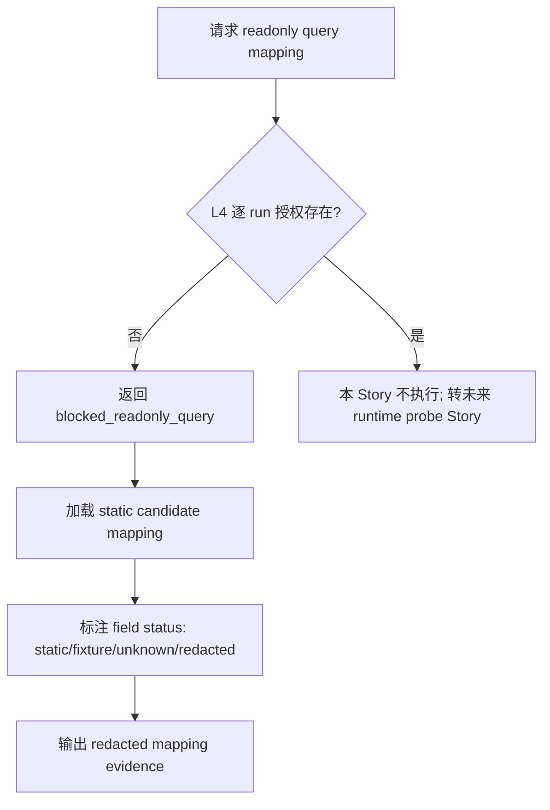

# LLD: CR044-S03 — Readonly Query Field Mapping Blocked-First

本文档只设计只读查询字段映射的候选合同。它不执行 cash / position / order / fill 查询，不保存真实 broker payload。

## 0. 上游设计依据

| 来源 | 路径 / ID | 被本 LLD 消费的内容 |
|---|---|---|
| S01 LLD | `process/stories/CR044-S01-authorization-and-secret-boundary-LLD.md` | L4 readonly query 当前未授权；敏感字段和 redaction 规则。 |
| S02 LLD | `process/stories/CR044-S02-admission-gate-and-capability-state-LLD.md` | 所有 readonly query 必须先经过 admission gate；默认 blocked。 |
| CP3 | `process/checkpoints/CP3-CR044-HLD-REVIEW.md` | `gm` 为 Python 3.11 主选静态候选，`gmtrade` 为 Python 3.10 fallback；L2 禁止真实 SDK import/call。 |
| Feature Matrix | `docs/design/FEATURE-DESIGN-MATRIX-CR044.md#feat-cr044-readonly` | S03 为 full-lld；需定义候选映射、UNKNOWN 字段、redaction 和 L4 未授权阻断。 |
| CR043 映射 | `process/research/cr043_goldminer_adapter_spike/INTERFACE-MAPPING-MATRIX.md` | 只读候选接口：`get_cash`、`get_position(s)`、unfinished order、execution report；均为 static candidate。 |
| 代码基线 | `engine/broker_adapter.py` | `BrokerCashSnapshot`、`BrokerPositionSnapshot`、`BrokerFillEvent`、`BrokerAdapterResult` schema。 |
| 测试基线 | `tests/test_cr042_broker_adapter_contract.py` | 禁止敏感 payload key，真实 query / broker call operation counts 应为 0。 |

## 1. Goal

为 Goldminer cash、position、order、fill 只读查询建立 blocked-first 字段映射合同：当前 L2 仅允许记录静态候选字段和合成 fixture，不允许真实账户查询；任何真实字段结构都必须标为 `unknown_broker_field` 或 `static_candidate`，不得标为 `real_verified`。

## 2. Requirements（Functional / Non-Functional）

### 2.1 Functional

- 定义 readonly query 类别：`cash_query`、`position_query`、`order_query`、`fill_query`。
- 为每类查询定义内部 schema 映射目标：cash / available_cash / currency / as_of；symbol / quantity / sellable_qty / average_cost / market_value；order status；fill quantity / price / time。
- 定义字段状态：`static_candidate`、`fixture_only`、`unknown_broker_field`、`blocked_no_authorization`、`redacted_sensitive_field`。
- 定义 L4 未授权行为：所有 readonly query 返回 blocked 或受控 validation error，真实 query operation count 为 0。
- 定义 L4 未来逐 run 授权后的重访边界：必须新增 runtime probe Story，不得把 L2 fixture 当真实证据。

### 2.2 Non-Functional

- 安全：不读取 account_id、token、session，不保存真实订单号、成交号或账户标识。
- 可审计：候选字段必须带来源和 confidence，不得吞掉 UNKNOWN 字段。
- 可测试：所有测试使用 synthetic payload；字段映射结果可静态断言。
- 兼容：优先映射到 CR042 的 broker-neutral snapshot / result schema。

## 3. 模块拆分与职责

| 模块 / 文件组 | 职责 | 说明 |
|---|---|---|
| `CR044ReadonlyMapping`（设计对象） | 记录内部字段到 Goldminer 静态候选字段的映射 | 不执行真实查询。 |
| `CR044FieldMappingStatus`（设计对象） | 标识 static / fixture / unknown / blocked / redacted | 被 S05 对账证据消费。 |
| `CR044ReadonlyBlockedResult`（设计对象） | 对 L4 未授权查询输出 blocked result | 与 `BrokerAdapterResult` / error event 兼容。 |
| `tests/test_cr044_goldminer_admission_guard.py`（后续） | 验证 mapping status 与 blocked-first | CP5 后创建，fixture-only。 |

## 4. 代码结构与文件影响范围

| 动作 | 文件路径 | 变更内容 |
|---|---|---|
| 创建 | `process/stories/CR044-S03-readonly-query-field-mapping-blocked-first-LLD.md` | 写入 S03 full-lld 设计证据。 |
| 创建 | `process/checks/CP5-CR044-S03-readonly-query-field-mapping-blocked-first-LLD-IMPLEMENTABILITY.md` | 写入 S03 CP5 自动预检。 |
| 后续修改 | `engine/broker_adapter.py` | CP5 后可增加 blocked readonly mapping helper；merge owner 为 S02；禁止 SDK import/call。 |
| 后续修改 | `tests/test_cr044_goldminer_admission_guard.py` | CP5 后追加 readonly fixture tests；merge owner 为 S02。 |
| 不修改 | `tests/test_cr042_broker_adapter_contract.py` | CR042 回归测试保持只读。 |

## 5. 数据模型与持久化设计

无新增持久化。候选映射和证据只应以代码常量、内存对象或合成 fixture 表达。

| 对象 / 字段 | 类型 | 约束 | 说明 |
|---|---|---|---|
| `readonly_query_type` | enum / str | `cash`、`position`、`order`、`fill` | 当前 L4 未授权，真实 query blocked。 |
| `internal_field` | str | 必须是 CR042 schema 字段或 CR044 evidence 字段 | 如 `available_cash`、`sellable_qty`、`filled_qty`。 |
| `broker_candidate_field` | str | 仅可标为候选 | 来源于 CR043 静态映射或合成 fixture。 |
| `mapping_status` | enum / str | `static_candidate` / `fixture_only` / `unknown_broker_field` / `blocked_no_authorization` / `redacted_sensitive_field` | 不允许 `real_verified`。 |
| `redaction_required` | bool | 对账号、订单号、成交号等为 true | 原值不得进入 artifact。 |

## 6. API / Interface 设计

| 接口 / 入口 | 输入 | 输出 | 调用方 | 说明 |
|---|---|---|---|---|
| `map_readonly_candidate(query_type)` | query type | mapping rows | S05 / tests | 返回候选字段和状态，不调用 SDK。 |
| `blocked_readonly_query(query_type, reason)` | query type、reason | blocked result / error | adapter query paths | L4 未授权时统一输出。 |
| `classify_unknown_broker_fields(payload)` | 合成 payload | unknown field list | S05 / tests | 只处理 synthetic payload；真实 payload 禁止保存。 |
| `redact_readonly_payload(payload)` | 合成或 redacted payload | redaction summary | S05 / CP7 | 敏感字段只输出字段名和 `REDACTED`。 |

## 7. 核心处理流程

1. 调用方请求 cash / position / order / fill 字段映射。
2. gate 检查 L4 授权；当前缺失，真实 query 直接 blocked。
3. 只加载静态候选映射，不导入 SDK。
4. 对所有候选字段标注来源和状态；无法确认的字段标为 `unknown_broker_field`。
5. 输出 redacted evidence，供 S05 reconciliation 设计消费。

## 8. 技术设计细节

- 关键规则：`candidate_mapping` 不是真实字段验证；字段名来自 CR043 静态证据时必须保留 `static_candidate` 标签。
- 依赖选择与复用点：映射目标复用 `BrokerCashSnapshot`、`BrokerPositionSnapshot`、`BrokerFillEvent`、`BrokerAdapterResult`。
- 兼容性处理：`gm` / `gmtrade` singular/plural position 差异写入 mapping status，不在 L2 中补猜。
- 图示类型选择：流程图；异常路径简单但必须展示 L4 blocked 与未来 probe 分离。

## 9. 安全与性能设计

| 维度 | 设计措施 | 验证方式 |
|---|---|---|
| 安全 | L4 未授权时 query blocked；敏感账户字段、broker order ref、execution ref 均 redacted 或 blocked。 | CR044 fixture tests、artifact scan。 |
| 性能 | 静态映射表和合成 payload 处理；无网络、无 SDK、无 I/O。 | 单测静态执行；operation counts 全 0。 |

## 10. 测试设计

| 测试场景 | 前置条件 | 操作 | 预期结果 | 验证方式 |
|---|---|---|---|---|
| cash query 未授权 | L4 未授权 | 调用 blocked cash query | blocked，`real_cash_query=0`，无真实 payload | CR044 fixture |
| position query 未授权 | L4 未授权 | 调用 blocked position query | blocked，`real_position_query=0` | CR044 fixture |
| candidate mapping 不提升 | 静态候选映射存在 | 读取 mapping table | 每行 status 为 `static_candidate` / `unknown_broker_field` / `fixture_only`，无 `real_verified` | CR044 fixture |
| 敏感字段 redacted | synthetic payload 含 `account_id` / `broker_order_id` | redact | 输出字段名和 `REDACTED`，无原值 | artifact scan + fixture |
| CR042 回归 | 后续实现完成 | 运行 CR042 adapter contract | no-runtime 边界不破坏 | `uv run --python 3.11 pytest -q tests/test_cr042_broker_adapter_contract.py` |

## 11. 实施步骤

| TASK-ID | 动作 | 目标文件 | 详细描述 | 对应测试 |
|---|---|---|---|---|
| CR044-S03-T1 | 创建 | `process/stories/CR044-S03-readonly-query-field-mapping-blocked-first-LLD.md` | 定义 readonly query mapping 与字段状态。 | CP5 自动预检 |
| CR044-S03-T2 | 创建 | `process/stories/CR044-S03-readonly-query-field-mapping-blocked-first-LLD.md` | 定义 blocked readonly result、redaction 和 L4 重访边界。 | CP5 自动预检 |
| CR044-S03-T3 | 创建 | `process/checks/CP5-CR044-S03-readonly-query-field-mapping-blocked-first-LLD-IMPLEMENTABILITY.md` | 校验 LLD 可实现性。 | 静态文档检查 |
| CR044-S03-T4 | 后续修改 | `engine/broker_adapter.py` | CP5 后新增 blocked readonly helper / mapping constants；通过 S02 merge owner 合并。 | CR044 fixture |
| CR044-S03-T5 | 后续修改 | `tests/test_cr044_goldminer_admission_guard.py` | CP5 后追加 readonly mapping tests。 | CR044 fixture |

## 12. 风险、难点与预研建议

### 12.1 实现灰区与取舍记录

| Clarification ID | 问题 | 选项与推荐 | 决策 / 答案 | 影响面 | 证据 | 重访条件 |
|---|---|---|---|---|---|---|
| N/A | 静态字段候选是否可作为真实字段？ | 推荐不可；备选为 L4 后新增 runtime probe | CP3 已接受 L2 禁止真实 SDK import/call | 接口 / 测试 / 安全 | `CP3-CR044-HLD-REVIEW.md`、CR043 mapping | 用户逐 run 授权 L4，并明确 probe 输入输出。 |

| 风险 / 难点 | 影响 | 缓解措施 / 预研建议 |
|---|---|---|
| 真实字段结构未知 | 对账无法证明真实一致 | 标为 `unknown_broker_field`，CP8 只能给 offline / blocked 结论。 |
| 候选字段被误用为生产字段 | 造成错误适配 | mapping status 必须参与测试断言；禁止 `real_verified`。 |
| broker 标识泄漏 | 订单/成交号可能敏感 | 字段名出现即 redacted；真实值禁止保存。 |

### OPEN / Spike 跟踪

| ID | 类型（OPEN / Spike） | 问题 | 下一动作 | 责任方 |
|---|---|---|---|---|
| N/A | N/A | 无阻断 LLD 的开放问题 | N/A | N/A |

## 13. 回滚与发布策略

- 发布方式：作为 CR044 CP5 全量设计证据提交。
- 回滚触发条件：任何内容把候选字段标为真实验证、要求执行账户查询、保存真实 broker payload 或引入 SDK runtime。
- 回滚动作：撤回 S03 LLD，保留 S01/S02 blocked-first；真实 readonly query 继续 blocked，等待 L4 授权或新 Spike。

## 14. Definition of Done

- [x] 14 个章节全部填写完成。
- [x] 文件影响范围、接口、测试与实施步骤可直接指导后续编码。
- [x] 第 6 节每个接口在第 10 节有测试入口。
- [x] blocked / unknown / redaction 异常路径有测试设计。
- [x] 实现灰区已收敛为 CP3 已确认决策，无新增 LCQ。
- [x] `confirmed=false` 时不进入实现。
- [x] 文档未授权真实 readonly query。

## 人工确认区

**CP5 checklist 摘要**：

| # | 检查项 | 状态 | 证据 |
|---|---|---|---|
| 1 | LLD 覆盖 AC | 待检查 | 第 2 / 10 / 14 节 |
| 2 | 与 HLD / ADR / CP3 一致 | 待检查 | 第 0 / 8 / 12 节 |
| 3 | 文件影响范围明确 | 待检查 | 第 4 / 11 节 |
| 4 | 接口契约完整 | 待检查 | 第 6 节 |
| 5 | 测试与 dev_gate 可计算 | 待检查 | 第 10 / 14 节 |
| 6 | clarification queue 已收敛 | 待检查 | 第 12.1 节 |

人工确认回复由 meta-po 在 `process/checkpoints/CP5-CR044-ALL-STORIES-LLD-BATCH.md` 统一发起。
