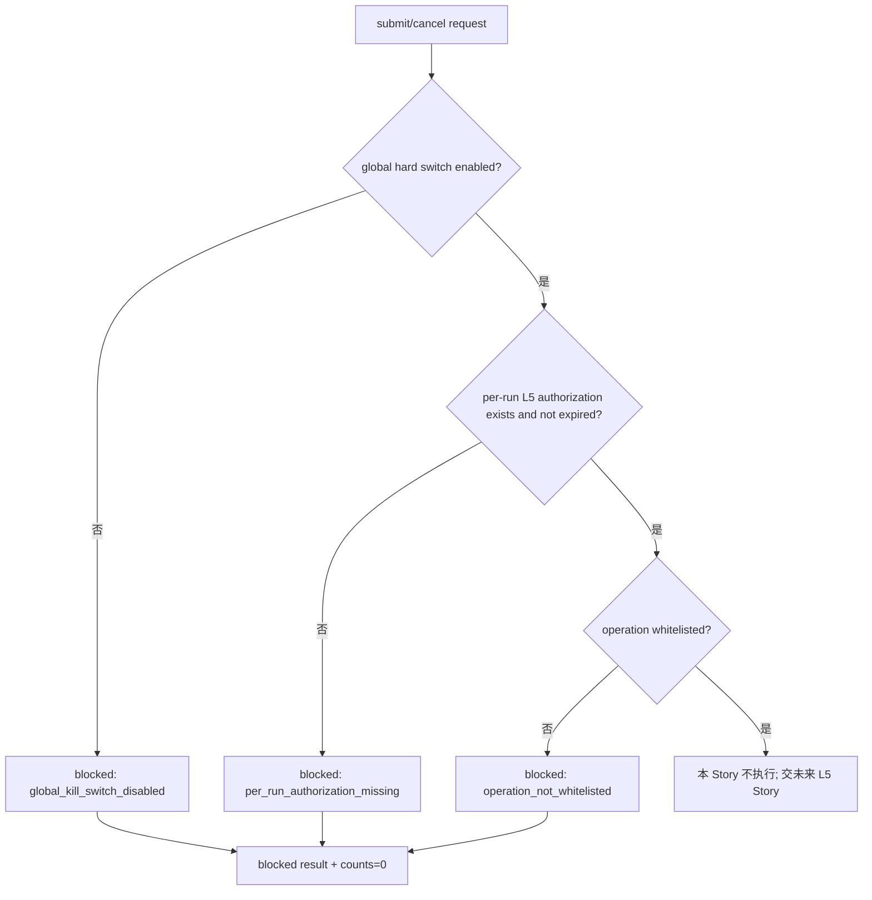

# LLD: CR044-S04 — Submit Cancel Kill Switch Contract

本文档只设计 submit/cancel 的双层 kill switch 和 blocked-first 合同。它不提交订单、不撤单、不启动 simulation/live。

## 0. 上游设计依据

| 来源 | 路径 / ID | 被本 LLD 消费的内容 |
|---|---|---|
| S01 LLD | `process/stories/CR044-S01-authorization-and-secret-boundary-LLD.md` | L5 submit/cancel 当前未授权；真实操作默认 fail-closed。 |
| S02 LLD | `process/stories/CR044-S02-admission-gate-and-capability-state-LLD.md` | 所有 submit/cancel 先经过 admission gate，capability 不提升 simulation/live。 |
| CP3 | `process/checkpoints/CP3-CR044-HLD-REVIEW.md` | 已批准 blocked-first 架构；CP3 不等于 simulation_ready/live_ready。 |
| Feature Matrix | `docs/design/FEATURE-DESIGN-MATRIX-CR044.md#feat-cr044-kill` | S04 为 full-lld；需定义 order whitelist、cancel whitelist、dual kill switch、operation counter gate。 |
| CR043 映射 | `process/research/cr043_goldminer_adapter_spike/INTERFACE-MAPPING-MATRIX.md` | `order_volume` / `order_batch` / `order_cancel` 等仅为静态候选，真实调用 forbidden。 |
| 代码基线 | `engine/broker_adapter.py` | `BrokerOrderRequest`、`BrokerFillEvent`、`BrokerAdapterResult`、`cancel_order` 默认 unsupported。 |
| 测试基线 | `tests/test_cr042_broker_adapter_contract.py` | Goldminer stub blocked；禁止 submit/cancel runtime call。 |

## 1. Goal

冻结 CR044 submit/cancel 的 no-real-operation 合同：默认 global hard switch off、per-run switch 缺失、operation whitelist 为空；L5 未授权时任何 submit/cancel 请求均 blocked，真实操作计数必须为 0，且对账失败不得触发自动补单或自动撤单。

## 2. Requirements（Functional / Non-Functional）

### 2.1 Functional

- 定义三层 kill switch：global hard switch、per-run switch、operation-level whitelist。
- 定义 submit/cancel blocked reasons：`global_kill_switch_disabled`、`per_run_authorization_missing`、`operation_not_whitelisted`、`authorization_expired`、`order_payload_sensitive`、`real_operation_counter_nonzero`。
- 定义 submit/cancel result shape：compatible `BrokerAdapterResult`，无 fills、无真实 order ref、`simulation_ready=false`、`live_ready=false`。
- 定义 operation counter gate：`real_order_call`、`real_cancel_call`、`real_broker_call`、`goldminer_import_or_call`、`gmtrade_import_or_call` 当前必须为 0。
- 定义未来 L5 授权边界：必须包含单次 run manifest、明确动作、订单白名单、数量/标的限制、过期时间和回滚策略；本 Story 不实现。

### 2.2 Non-Functional

- 安全：不提交、不撤单、不重试、不补单；不保存真实 broker order ref。
- 可审计：blocked reason 和 operation counts 能证明未触发真实副作用。
- 可测试：fixture order intent 可验证 blocked-first，不需要 broker runtime。
- 回滚明确：任何真实 submit/cancel 要求都回退到 meta-po 授权决策。

## 3. 模块拆分与职责

| 模块 / 文件组 | 职责 | 说明 |
|---|---|---|
| `CR044KillSwitchState`（设计对象） | 表达 global / per-run / operation whitelist 状态 | 当前默认 hard-off。 |
| `CR044OrderOperationGate`（设计对象） | 对 submit/cancel 请求执行 gate 判定 | L5 未授权时统一 blocked。 |
| `CR044BlockedOrderResult`（设计对象） | 输出 compatible blocked result | 不生成真实订单引用。 |
| `tests/test_cr044_goldminer_admission_guard.py`（后续） | 验证 kill switch 和 counts | CP5 后创建 / 追加。 |

## 4. 代码结构与文件影响范围

| 动作 | 文件路径 | 变更内容 |
|---|---|---|
| 创建 | `process/stories/CR044-S04-submit-cancel-kill-switch-contract-LLD.md` | 写入 S04 full-lld 设计证据。 |
| 创建 | `process/checks/CP5-CR044-S04-submit-cancel-kill-switch-contract-LLD-IMPLEMENTABILITY.md` | 写入 S04 CP5 自动预检。 |
| 后续修改 | `engine/broker_adapter.py` | CP5 后可新增 kill switch helper / blocked reasons；merge owner 为 S02。 |
| 后续修改 | `tests/test_cr044_goldminer_admission_guard.py` | CP5 后追加 submit/cancel blocked tests。 |
| 不修改 | `tests/test_cr042_broker_adapter_contract.py` | 保持 CR042 回归只读。 |

## 5. 数据模型与持久化设计

无新增持久化。kill switch 在当前范围只作为内存 / fixture 合同。

| 对象 / 字段 | 类型 | 约束 | 说明 |
|---|---|---|---|
| `global_hard_switch_enabled` | bool | 当前默认 false | false 时所有 submit/cancel blocked。 |
| `per_run_authorization_id` | str | 当前为空；不得含真实 token/account | 未来 L5 才可能出现。 |
| `operation_whitelist` | tuple[str, ...] | 当前为空 | 未来必须逐动作列出。 |
| `max_real_operation_counts` | mapping[str, int] | 当前所有真实操作上限为 0 | 非零即 blocked。 |
| `blocked_order_result` | mapping / dataclass | 无 fills、无真实 order ref | compatible `BrokerAdapterResult`。 |

## 6. API / Interface 设计

| 接口 / 入口 | 输入 | 输出 | 调用方 | 说明 |
|---|---|---|---|---|
| `evaluate_kill_switch(action, context)` | `submit` / `cancel`、switch context | allow/block decision | submit/cancel path | 当前默认 blocked。 |
| `validate_operation_whitelist(action, order_intent)` | action、synthetic order intent | pass/block reason | submit/cancel path / tests | L5 未授权时 whitelist 为空。 |
| `blocked_submit_result(order_intents, reason)` | fixture intents、reason | blocked `BrokerAdapterResult` | adapter submit | 不生成 fills 或真实 broker refs。 |
| `blocked_cancel_result(adapter_order_ref, reason)` | redacted / synthetic ref、reason | blocked `BrokerAdapterResult` | adapter cancel | 不调用 broker cancel。 |
| `assert_no_submit_cancel_side_effects(counts)` | operation counts | pass/block | tests / CP7 | `real_order_call` / `real_cancel_call` 必须为 0。 |

## 7. 核心处理流程

1. submit/cancel 请求进入 admission gate。
2. 先检查 global hard switch；当前 false，直接 blocked。
3. 若未来 global true，再检查 per-run L5 授权和 operation whitelist。
4. 当前 L2 下任何路径都不得进入真实 broker SDK。
5. 输出 blocked result，真实 operation counts 保持 0。

## 8. 技术设计细节

- 关键规则：submit/cancel 属 L5，高于 L4 readonly；即便 L4 未来授权，也不隐含 L5。
- 依赖选择与复用点：`BrokerOrderRequest` 可承接 fixture order intent；`BrokerAdapterResult` 承接 blocked result。
- 兼容性处理：`cancel_order` 当前在 base adapter 返回 unsupported；Goldminer path 可后续返回更细 blocked reason，但仍不调用 broker。
- 图示类型选择：流程图；kill switch 的异常分支必须清晰。

## 9. 安全与性能设计

| 维度 | 设计措施 | 验证方式 |
|---|---|---|
| 安全 | 三层 kill switch 默认全部阻断；无自动重试、无自动补单、无自动撤单；无真实 order ref。 | CR044 fixture tests、operation_counts 断言、artifact scan。 |
| 性能 | 本地布尔 / 集合判定；无网络、无 SDK、无交易终端。 | 静态测试；counts 全 0。 |

## 10. 测试设计

| 测试场景 | 前置条件 | 操作 | 预期结果 | 验证方式 |
|---|---|---|---|---|
| global hard-off blocked | global false | submit fixture order | blocked，fills 空，`real_order_call=0` | CR044 fixture |
| per-run missing blocked | global true、无 run auth | cancel synthetic ref | blocked，`real_cancel_call=0` | CR044 fixture |
| whitelist missing blocked | global true、run auth fixture、action 未列入 | submit/cancel | blocked，reason `operation_not_whitelisted` | CR044 fixture |
| operation count nonzero blocked | fixture counts 含 `real_order_call=1` | assert counts | blocked | CR044 fixture |
| 无自动补单/撤单 | reconciliation mismatch fixture | route mismatch | manual review，不触发 submit/cancel | S05/S06 fixture review |

## 11. 实施步骤

| TASK-ID | 动作 | 目标文件 | 详细描述 | 对应测试 |
|---|---|---|---|---|
| CR044-S04-T1 | 创建 | `process/stories/CR044-S04-submit-cancel-kill-switch-contract-LLD.md` | 定义 kill switch、whitelist、blocked reason。 | CP5 自动预检 |
| CR044-S04-T2 | 创建 | `process/stories/CR044-S04-submit-cancel-kill-switch-contract-LLD.md` | 定义 submit/cancel blocked result 和 no-side-effect 测试。 | CP5 自动预检 |
| CR044-S04-T3 | 创建 | `process/checks/CP5-CR044-S04-submit-cancel-kill-switch-contract-LLD-IMPLEMENTABILITY.md` | 校验 LLD 可实现性。 | 静态文档检查 |
| CR044-S04-T4 | 后续修改 | `engine/broker_adapter.py` | CP5 后新增 kill switch helper / blocked results；通过 S02 merge owner 合并。 | CR044 fixture |
| CR044-S04-T5 | 后续修改 | `tests/test_cr044_goldminer_admission_guard.py` | CP5 后追加 submit/cancel kill switch tests。 | CR044 fixture |

## 12. 风险、难点与预研建议

### 12.1 实现灰区与取舍记录

| Clarification ID | 问题 | 选项与推荐 | 决策 / 答案 | 影响面 | 证据 | 重访条件 |
|---|---|---|---|---|---|---|
| N/A | L2 是否允许真实 submit/cancel 默认 disabled adapter？ | 推荐不允许；备选为未来 L5 单次授权 Story | CP3 已拒绝加入 L3+ runtime Story | 安全 / 接口 / 测试 | `CP3-CR044-HLD-REVIEW.md` DQ-CP3-CR044-04 | 用户明确 L5 run manifest、订单白名单和风险接受。 |

| 风险 / 难点 | 影响 | 缓解措施 / 预研建议 |
|---|---|---|
| 误把 kill switch 当授权开关 | 可能绕过 L5 | 三层条件必须同时满足；当前默认 hard-off。 |
| 对账失败诱发自动补偿交易 | 造成真实副作用 | S04/S05 明确 mismatch 只进 manual review。 |
| 真实 order ref 泄漏 | 可能暴露账户/订单信息 | 当前只允许 synthetic ref；真实 ref 必须 redacted。 |

### OPEN / Spike 跟踪

| ID | 类型（OPEN / Spike） | 问题 | 下一动作 | 责任方 |
|---|---|---|---|---|
| N/A | N/A | 无阻断 LLD 的开放问题 | N/A | N/A |

## 13. 回滚与发布策略

- 发布方式：作为 CR044 CP5 全量设计证据提交。
- 回滚触发条件：设计或实现允许真实 submit/cancel、自动重试、自动补单/撤单、真实 order ref 保存，或 CP5 被解释为 L5 授权。
- 回滚动作：撤回 S04，恢复所有 submit/cancel 到 `unsupported_adapter_operation` 或 `not_authorized` blocked；交由 meta-po 发起 L5 授权决策。

## 14. Definition of Done

- [x] 14 个章节全部填写完成。
- [x] 文件影响范围、接口、测试与实施步骤可直接指导后续编码。
- [x] 第 6 节接口在第 10 节有对应验证入口。
- [x] blocked / kill switch / no-side-effect 异常路径有测试设计。
- [x] 实现灰区已收敛为 CP3 已确认决策，无新增 LCQ。
- [x] `confirmed=false` 时不进入实现。
- [x] 文档未授权 submit/cancel 或 simulation/live。

## 人工确认区

**CP5 checklist 摘要**：

| # | 检查项 | 状态 | 证据 |
|---|---|---|---|
| 1 | LLD 覆盖 AC | 待检查 | 第 2 / 10 / 14 节 |
| 2 | 与 HLD / ADR / CP3 一致 | 待检查 | 第 0 / 8 / 12 节 |
| 3 | 文件影响范围明确 | 待检查 | 第 4 / 11 节 |
| 4 | 接口契约完整 | 待检查 | 第 6 节 |
| 5 | 测试与 dev_gate 可计算 | 待检查 | 第 10 / 14 节 |
| 6 | clarification queue 已收敛 | 待检查 | 第 12.1 节 |

人工确认回复由 meta-po 在 `process/checkpoints/CP5-CR044-ALL-STORIES-LLD-BATCH.md` 统一发起。
