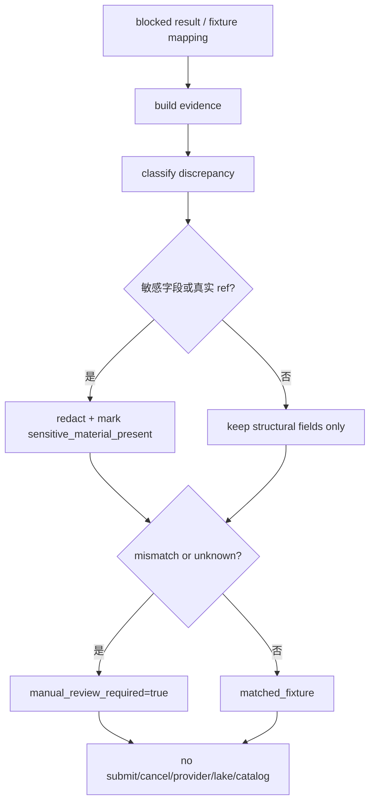

# LLD: CR044-S05 — Reconciliation and Redacted Evidence

本文档只设计离线对账证据结构。它不查询真实成交、不拉取 broker payload、不 provider_fetch、不 lake_write、不 catalog_publish。

## 0. 上游设计依据

| 来源 | 路径 / ID | 被本 LLD 消费的内容 |
|---|---|---|
| S03 LLD | `process/stories/CR044-S03-readonly-query-field-mapping-blocked-first-LLD.md` | readonly candidate mapping、UNKNOWN 字段和 redaction 规则。 |
| S04 LLD | `process/stories/CR044-S04-submit-cancel-kill-switch-contract-LLD.md` | submit/cancel blocked semantics、kill switch 和禁止自动补单/撤单。 |
| CP3 | `process/checkpoints/CP3-CR044-HLD-REVIEW.md` | redaction-first evidence；CP3 不授权 simulation/live。 |
| Feature Matrix | `docs/design/FEATURE-DESIGN-MATRIX-CR044.md#feat-cr044-recon` | S05 为 full-lld；对账证据、差异分类、脱敏 artifact 直接影响 CP7/CP8。 |
| 代码基线 | `engine/broker_adapter.py` | `BrokerAdapterResult`、snapshot、fill event、operation counts 和 sensitive field policy。 |
| 测试基线 | `tests/test_cr042_broker_adapter_contract.py` | 敏感 payload key 禁止、operation counts 为 0、no runtime import/call。 |

## 1. Goal

设计 CR044 L2 离线 reconciliation 和 redacted evidence 合同，使后续验证能证明 blocked-first、UNKNOWN 字段、差异分类和 no-real-operation 结果，同时不保存真实 broker payload、不自动补单、不自动撤单。

## 2. Requirements（Functional / Non-Functional）

### 2.1 Functional

- 定义 reconciliation status：`matched_fixture`、`blocked_no_authorization`、`unknown_broker_field`、`mismatch_requires_manual_review`。
- 定义 redacted evidence 字段：`schema_version`、`source`、`status`、`blocked_reasons`、`mapping_status_summary`、`operation_counts`、`redaction_summary`、`manual_review_required`。
- 定义 discrepancy taxonomy：`field_missing`、`field_unknown`、`fixture_mismatch`、`operation_count_nonzero`、`sensitive_material_present`、`runtime_not_authorized`。
- 定义禁止动作：对账失败不得触发 provider fetch、lake write、catalog publish、submit、cancel、retry、补单或撤单。
- 定义 CP7 artifact scan 输入：证据必须可审计但不得包含真实账号、真实订单号、真实成交号、session、cookie、token。

### 2.2 Non-Functional

- 安全：redaction-first；真实 payload 不作为 fixture 保存。
- 可审计：每个 status 和 discrepancy 都有 reason 和 route。
- 可测试：只用 synthetic fixture 和 blocked results 生成 evidence。
- 可回滚：任何真实 payload 需求必须回退安全决策。

## 3. 模块拆分与职责

| 模块 / 文件组 | 职责 | 说明 |
|---|---|---|
| `CR044ReconciliationEvidence`（设计对象） | 表达 redacted evidence 结构 | 被 CP7 / runbook 消费。 |
| `CR044DiscrepancyTaxonomy`（设计对象） | 差异分类和人工审查路由 | 不触发自动补偿动作。 |
| `CR044ArtifactRedaction`（设计对象） | artifact 输出脱敏规则 | 复用 S01/S03 敏感字段合同。 |
| `tests/test_cr044_goldminer_admission_guard.py`（后续） | 验证 evidence schema 和 no-operation | CP5 后创建 / 追加。 |

## 4. 代码结构与文件影响范围

| 动作 | 文件路径 | 变更内容 |
|---|---|---|
| 创建 | `process/stories/CR044-S05-reconciliation-and-redacted-evidence-LLD.md` | 写入 S05 full-lld 设计证据。 |
| 创建 | `process/checks/CP5-CR044-S05-reconciliation-and-redacted-evidence-LLD-IMPLEMENTABILITY.md` | 写入 S05 CP5 自动预检。 |
| 后续修改 | `engine/broker_adapter.py` | CP5 后可新增 evidence helper / taxonomy；merge owner 为 S02。 |
| 后续修改 | `tests/test_cr044_goldminer_admission_guard.py` | CP5 后追加 reconciliation evidence tests。 |
| 不修改 | `tests/test_cr042_broker_adapter_contract.py` | 保持 CR042 回归只读。 |

## 5. 数据模型与持久化设计

无新增持久化；redacted evidence 可作为后续测试内存对象或 fixture artifact，但不得包含真实 broker payload。

| 对象 / 字段 | 类型 | 约束 | 说明 |
|---|---|---|---|
| `schema_version` | str | 例如 `cr044_reconciliation_evidence_v1` | 后续实现固定版本。 |
| `source` | str | `fixture_only` / `blocked_goldminer_stub` | 不允许 `real_broker_payload`。 |
| `status` | enum / str | 四类 reconciliation status | 当前主路径为 blocked / fixture。 |
| `blocked_reasons` | list[str] | 非空 when blocked | 来自 S02-S04。 |
| `operation_counts` | mapping[str, int] | provider/lake/catalog/query/order/cancel 计数必须为 0 | 非零为 discrepancy。 |
| `redaction_summary` | mapping | 只包含字段名、计数、`REDACTED`、present flags | 禁止真实值。 |
| `manual_review_required` | bool | mismatch / unknown 时 true | 不自动补偿。 |

## 6. API / Interface 设计

| 接口 / 入口 | 输入 | 输出 | 调用方 | 说明 |
|---|---|---|---|---|
| `build_reconciliation_evidence(result, mapping)` | blocked result、mapping status | redacted evidence | S06 / CP7 / tests | 不读取真实 broker。 |
| `classify_discrepancy(expected, observed)` | synthetic expected / observed | discrepancy list | tests / evidence builder | observed 只能是 fixture 或 redacted structure。 |
| `redact_evidence_payload(payload)` | evidence payload | sanitized payload | artifact writer / tests | 去除敏感值和真实 refs。 |
| `route_manual_review(discrepancies)` | discrepancy list | route decision | runbook / CP7 | mismatch 只路由人工审查。 |
| `assert_no_compensation_actions(counts)` | operation counts | pass/block | tests / CP7 | submit/cancel/provider/lake/catalog 计数必须为 0。 |

## 7. 核心处理流程

1. 输入 blocked result、readonly mapping 或 synthetic fixture。
2. 构建 evidence 初稿，保留 schema、status、reason、counts。
3. 分类 discrepancy；unknown 和 mismatch 不做自动修复。
4. 脱敏所有敏感字段和真实 ref。
5. 输出 redacted evidence，供 S06 runbook 和 CP7 审查。

## 8. 技术设计细节

- 关键规则：reconciliation 是证据归集，不是运行动作；不得为了补齐对账而执行 query / submit / cancel。
- 依赖选择与复用点：复用 `BrokerAdapterResult.to_dict()` 的 fixed `simulation_ready=false` / `live_ready=false` 和 operation counts。
- 兼容性处理：CR041 paper ledger 经验只能作为 fixture 语义参考，不代表 Goldminer 真实成交。
- 图示类型选择：流程图；展示 mismatch 到 manual review 而非自动补偿。

## 9. 安全与性能设计

| 维度 | 设计措施 | 验证方式 |
|---|---|---|
| 安全 | redaction-first；不保存真实 payload；差异只进 manual review；禁止补单/撤单。 | artifact scan、CR044 fixture tests、CP7 审查。 |
| 性能 | 只处理小型 fixture/evidence dict；无 provider/lake/catalog I/O。 | 静态测试，operation counts 断言。 |

## 10. 测试设计

| 测试场景 | 前置条件 | 操作 | 预期结果 | 验证方式 |
|---|---|---|---|---|
| matched fixture evidence | 合成 expected/observed 一致 | build evidence | status `matched_fixture`，counts 全 0 | CR044 fixture |
| blocked no authorization evidence | Goldminer blocked result | build evidence | status `blocked_no_authorization`，blocked_reasons 非空 | CR044 fixture |
| unknown field evidence | mapping 含 unknown | build evidence | status / discrepancy 包含 `unknown_broker_field`，manual review true | CR044 fixture |
| mismatch 不自动补偿 | synthetic mismatch | route manual review | 不触发 submit/cancel/provider/lake/catalog，counts 全 0 | CR044 fixture |
| artifact 不含敏感值 | payload 含敏感字段名和值 | redact | 输出只含字段名 / REDACTED / counts，无原值 | artifact scan |

## 11. 实施步骤

| TASK-ID | 动作 | 目标文件 | 详细描述 | 对应测试 |
|---|---|---|---|---|
| CR044-S05-T1 | 创建 | `process/stories/CR044-S05-reconciliation-and-redacted-evidence-LLD.md` | 定义 evidence schema、status 和 discrepancy taxonomy。 | CP5 自动预检 |
| CR044-S05-T2 | 创建 | `process/stories/CR044-S05-reconciliation-and-redacted-evidence-LLD.md` | 定义 redaction、manual review 和禁止自动补偿。 | CP5 自动预检 |
| CR044-S05-T3 | 创建 | `process/checks/CP5-CR044-S05-reconciliation-and-redacted-evidence-LLD-IMPLEMENTABILITY.md` | 校验 LLD 可实现性。 | 静态文档检查 |
| CR044-S05-T4 | 后续修改 | `engine/broker_adapter.py` | CP5 后新增 evidence helper；通过 S02 merge owner 合并。 | CR044 fixture |
| CR044-S05-T5 | 后续修改 | `tests/test_cr044_goldminer_admission_guard.py` | CP5 后追加 evidence / redaction tests。 | CR044 fixture |

## 12. 风险、难点与预研建议

### 12.1 实现灰区与取舍记录

| Clarification ID | 问题 | 选项与推荐 | 决策 / 答案 | 影响面 | 证据 | 重访条件 |
|---|---|---|---|---|---|---|
| N/A | 是否允许真实 broker payload 作为 fixture？ | 推荐不允许；备选为未来安全授权后仅存脱敏结构 | CP2/CP3 已确认零凭据与 redaction-first | 安全 / 测试 / 文档 | `CP2-CR044-REQUIREMENTS-BASELINE.md`、`CP3-CR044-HLD-REVIEW.md` | 用户逐 run 授权并批准真实材料处理策略。 |

| 风险 / 难点 | 影响 | 缓解措施 / 预研建议 |
|---|---|---|
| artifact 意外包含真实标识 | 安全泄漏 | redaction summary + artifact scan + forbidden key scan。 |
| 对账差异被误当作可自动修复 | 触发交易副作用 | mismatch 只能 manual review，S04 禁止补单/撤单。 |
| fixture 与真实语义不一致 | CP8 结论受限 | 明确关闭为 offline / blocked，不宣称 simulation-ready。 |

### OPEN / Spike 跟踪

| ID | 类型（OPEN / Spike） | 问题 | 下一动作 | 责任方 |
|---|---|---|---|---|
| N/A | N/A | 无阻断 LLD 的开放问题 | N/A | N/A |

## 13. 回滚与发布策略

- 发布方式：作为 CR044 CP5 全量设计证据提交。
- 回滚触发条件：证据要求保存真实 broker payload、执行真实 query/provider/lake/catalog、或 mismatch 自动触发 submit/cancel。
- 回滚动作：撤回 S05 evidence 设计，保留 S03/S04 blocked-first；将真实对账诉求交回 meta-po 发起 L4/L5 授权或新 CR。

## 14. Definition of Done

- [x] 14 个章节全部填写完成。
- [x] 文件影响范围、接口、测试与实施步骤可直接指导后续编码。
- [x] 第 6 节接口在第 10 节有对应验证入口。
- [x] unknown / mismatch / redaction / no-compensation 路径有测试设计。
- [x] 实现灰区已收敛为 CP2/CP3 已确认决策，无新增 LCQ。
- [x] `confirmed=false` 时不进入实现。
- [x] 文档未授权真实 reconciliation runtime、provider/lake/catalog、submit/cancel。

## 人工确认区

**CP5 checklist 摘要**：

| # | 检查项 | 状态 | 证据 |
|---|---|---|---|
| 1 | LLD 覆盖 AC | 待检查 | 第 2 / 10 / 14 节 |
| 2 | 与 HLD / ADR / CP3 一致 | 待检查 | 第 0 / 8 / 12 节 |
| 3 | 文件影响范围明确 | 待检查 | 第 4 / 11 节 |
| 4 | 接口契约完整 | 待检查 | 第 6 节 |
| 5 | 测试与 dev_gate 可计算 | 待检查 | 第 10 / 14 节 |
| 6 | clarification queue 已收敛 | 待检查 | 第 12.1 节 |

人工确认回复由 meta-po 在 `process/checkpoints/CP5-CR044-ALL-STORIES-LLD-BATCH.md` 统一发起。
