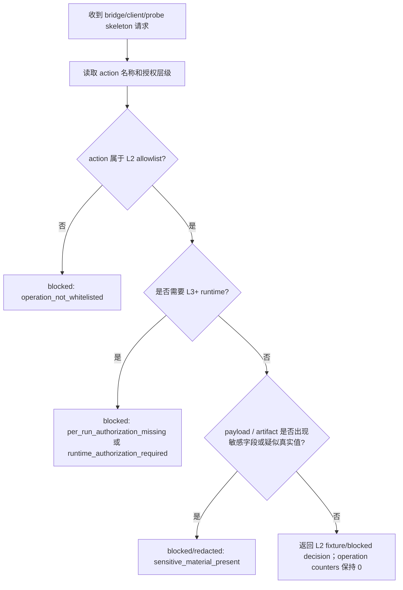

# LLD: CR045-S01 - Windows Bridge Security Boundary

## 0. 上游设计依据

| 来源 | 路径 / ID | 被本 LLD 消费的内容 |
|---|---|---|
| HLD | `docs/design/HLD-CR045-GOLDMINER-WINDOWS-BRIDGE.md` | Windows trading PC 是唯一未来 Goldminer SDK/runtime/execution boundary；WSL/Linux 只做研究、回测、组合生成、order intent 和 bridge client；当前只允许 L2 skeleton / fixture / static validation。 |
| ADR | `docs/design/ARCHITECTURE-DECISION-CR045.md` | ADR-CR045-001/003/004/005/007：Windows bridge 拓扑、零敏感值驻留、默认 hard-off、L3/L4/L5 逐 run gate、不得声明 real-readonly-verified。 |
| Feature Matrix | `docs/design/FEATURE-DESIGN-MATRIX-CR045.md` | S01 为 `full-lld`，触发原因是 security、permission、runtime_authorization、shared-story-boundary。 |
| Feature DESIGN | `docs/features/cr045-goldminer-bridge/DESIGN.md` | 授权层级、zero secret custody、blocked reason、no-operation evidence 的 Feature 级合同。 |
| Feature TEST-PLAN | `docs/features/cr045-goldminer-bridge/TEST-PLAN.md` | TP-SEC-01/02/05/06：敏感值零泄漏、capabilities false flags、forbidden operation counters 全 0、不启动 runtime。 |
| Feature TASKS | `docs/features/cr045-goldminer-bridge/TASKS.md` | CR045-S01-T1/T2：设计 L1-L5、not-authorized table、敏感字段分类、fail-closed decision table。 |
| CP3 checkpoint | `process/checkpoints/CP3-CR045-HLD-REVIEW.md` | 用户已批准 CP3 DQ-CP3-CR045-01..06，但明确不授权真实 runtime、凭据、账户查询、交易、simulation/live。 |
| CP4 precheck | `process/checks/CP4-CR045-STORY-DAG-PARALLEL-SAFETY.md` | S01 是根合同；无文件冲突；CP5 前只允许设计证据。 |

## 1. Goal

冻结 CR045 的安全与授权根合同：明确 L1-L5 授权层级、默认 hard-off、not-authorized action list、敏感字段分类、blocked reason taxonomy 和 no-operation 计数要求，使 S02-S06 后续合同都只能在 L2 skeleton / fixture / static 范围内设计和实现。

## 2. Requirements（Functional / Non-Functional）

### 2.1 Functional

- 定义 5 层授权模型：L1 formal CR orchestration、L2 bridge skeleton / fixture-only、L3 Windows credential local setup、L4 readonly probe、L5 submit/cancel/simulation/live。
- 定义当前允许动作：设计文档、Story LLD、future skeleton code、fixture/static validation、runbook，不包含任何真实 Goldminer runtime 行为。
- 定义当前不授权动作：credential_read、token/account_id collection、Windows bridge runtime start、Goldminer login/connect、account/cash/position/order/fill query、order_submit、order_cancel、simulation_runtime、live_runtime、provider_fetch、lake_write、catalog_publish。
- 定义敏感字段分类和零敏感值证据规则：只能记录字段类别、规则 ID、present/count 和 `REDACTED` 占位，禁止记录真实值。
- 定义 blocked reason taxonomy，供 S02 health/capabilities、S03 client、S04 readonly probe 和 S05 static validation 统一消费。
- 定义 no-operation counters 的基础集合，作为 S05 和 CP7 验证的根规则。

### 2.2 Non-Functional

- 安全性：真实敏感值泄漏数必须为 0，真实 broker operation count 必须为 0。
- 可靠性：缺少授权、action 不在 allowlist、kill switch 关闭、敏感字段出现时 100% fail-closed。
- 可审计性：每个被阻断的动作必须有稳定 reason code，且不包含敏感值。
- 可维护性：S01 只设计合同，不创建实现文件，避免在 CP5 前扩大范围。
- 兼容性：不新增依赖，不修改 `pyproject.toml` / `uv.lock`；后续实现仍使用 Python 3.11 + `uv run`。

## 3. 模块拆分与职责

| 模块 / 文件组 | 职责 | 说明 |
|---|---|---|
| `process/stories/CR045-S01-windows-bridge-security-boundary-LLD.md` | 安全边界和授权根合同 | 本 Story 唯一设计输出；CP5 前不创建业务代码。 |
| Authorization model | 冻结 L1-L5 层级、当前 allowed/not-authorized 行为 | 供 S02-S06 引用。 |
| Secret custody policy | 冻结 token/account_id/账号/密码/session/cookie/private key 等字段的零持有规则 | 后续实现只能处理脱敏类别，不能处理原值。 |
| Hard-off kill switch | 冻结默认拒绝和 per-run 授权缺失时的 blocked 行为 | S02/S04/S05 测试需要断言。 |
| Blocked reason taxonomy | 提供稳定错误码 | 不暴露真实配置、端口、账号、订单或凭据。 |
| No-operation counter baseline | 定义必须保持 0 的真实操作计数器 | S05 负责具体 static validation。 |

## 4. 代码结构与文件影响范围

| 动作 | 文件路径 | 变更内容 |
|---|---|---|
| 创建 | `process/stories/CR045-S01-windows-bridge-security-boundary-LLD.md` | 写入完整 LLD。 |
| 修改 | `process/stories/CR045-S01-windows-bridge-security-boundary.md` | CP5 后将状态推进为 `lld-ready-for-review`，`lld_gate.status=ready-for-review`；不修改实现范围。 |
| 创建 | `process/checks/CP5-CR045-S01-windows-bridge-security-boundary-LLD-IMPLEMENTABILITY.md` | 写入 CP5 自动预检结果。 |
| 不修改 | `engine/goldminer_bridge_contract.py` | S01 禁止创建或修改；S02 未来 owner。 |
| 不修改 | `engine/goldminer_bridge_client.py` | S01 禁止创建或修改；S03 未来 owner。 |
| 不读取 / 不修改 | `.env`、`.env.*`、Windows credential files | 禁止读取凭据材料。 |

## 5. 数据模型与持久化设计

无新增持久化变更。S01 仅定义以下设计级对象，后续 Story 可在 CP6 实现为常量、枚举或 dataclass，但本 Story 不落代码。

| 对象 / 字段 | 类型 | 约束 | 说明 |
|---|---|---|---|
| `AuthorizationLayer` | enum/string | 取值：`L1_FORMAL_CR`、`L2_SKELETON_FIXTURE`、`L3_WINDOWS_CREDENTIAL_SETUP`、`L4_READONLY_PROBE`、`L5_SUBMIT_CANCEL_SIM_LIVE` | 当前仅 L1/L2 approved。 |
| `AuthorizationState.current_allowed_layers` | list[string] | 必须为 `[L1_FORMAL_CR, L2_SKELETON_FIXTURE]` | 不代表 runtime 授权。 |
| `NotAuthorizedAction` | enum/string | 至少覆盖 16 项不授权动作 | 用于 blocked reason 和 runbook。 |
| `SensitiveFieldCategory` | enum/string | 至少覆盖 token、secret、password、passwd、cookie、session、private_key、account_id、broker_account、real_account、trade_password、credential | 仅记录类别，不记录值。 |
| `BlockedReason` | enum/string | 稳定 reason code；不得包含敏感上下文 | 供 S02-S05 共用。 |
| `OperationCounter` | mapping[string,int] | 所有 forbidden counters 在 CR045 L2 中必须为 0 | S05 负责验证。 |

## 6. API / Interface 设计

| 接口 / 入口 | 输入 | 输出 | 调用方 | 说明 |
|---|---|---|---|---|
| `is_action_authorized(action, layer, run_authorization)` | action 名称、请求层级、未来 run 授权摘要或 `None` | `AuthorizationDecision(allowed=false, reason=...)` | S02/S04 future contract | 当前 L2 对真实动作恒为 blocked；第 10 节 T-S01-01/T-S01-03 验证。 |
| `classify_sensitive_field(field_name)` | 字段名，不接收字段值 | `SensitiveFieldCategory` 或 `None` | S05 static validation | 只处理字段名/类别；第 10 节 T-S01-02 验证。 |
| `build_blocked_reason(action, cause)` | action、cause code | `BlockedReason` + 脱敏 message | S02/S03/S04 | message 不含 token/account_id/account/order/fill 原值；第 10 节 T-S01-03 验证。 |
| `forbidden_operation_counter_names()` | 无 | counter name 集合 | S05 no-operation validation | counter 集合必须覆盖真实 broker/query/order/credential/import/provider/lake/publish；第 10 节 T-S01-04 验证。 |

## 7. 核心处理流程

异常路径：

1. 若任何设计或后续实现需要读取 `.env`、token、account_id、账号、密码、session、cookie、private key，立即停止并交回 meta-po 发起 L3 security/runtime_authorization gate。
2. 若 action 试图触发 Goldminer login/connect、account/cash/position/order/fill query、submit/cancel、simulation/live，必须 blocked，不能降级为 warning。
3. 若输出文档或证据试图声明 `real-readonly-verified`、`simulation_ready=true`、`live_ready=true`，CP5/CP7 必须失败或退回。

## 8. 技术设计细节

- 关键规则：
  - 当前授权层级只允许 L1/L2；L3/L4/L5 均为 `not-authorized`。
  - L2 allowlist 只允许 `health`、`capabilities`、`readonly_probe_skeleton` 三类 action；其中 readonly 仍只能返回 skeleton/blocked，不触发真实查询。
  - `approve`、CP5、CP6、CP7、CP8 均不自动授权真实 runtime。
- 依赖选择与复用点：
  - 复用 CR042/CR044 中的 blocked-first、sensitive field、operation counter 概念，但 S01 不读取或修改 `engine/broker_adapter.py`。
  - 后续实现可把本 LLD 的表格落为常量或枚举，不需要新增依赖。
- 兼容性处理：
  - 不引入 `gm` / `gmtrade` runtime import。
  - Windows 本地真实配置、端口、进程管理仅作为未来 L3+ 设计对象，不在 L2 中落地。
- 图示类型选择：本 Story 使用流程图，因为授权、敏感字段和 blocked decision 存在多个异常分支。

## 9. 安全与性能设计

| 维度 | 设计措施 | 验证方式 |
|---|---|---|
| 安全 | 零敏感值入仓、入对话、入日志、入 fixture；字段值只可被标记为 `REDACTED`；真实 runtime 全部 blocked。 | S05 static scan；CP7 review；S01/S05 CP5 自检。 |
| 权限 | L1/L2 approved，L3/L4/L5 not-authorized；默认 hard-off；action 不在 allowlist 时 fail-closed。 | S02/S04 fixture negative cases；S06 runbook review。 |
| 可观测 | blocked reason 只暴露 reason code、字段类别和计数。 | CP7 artifact review。 |
| 性能 | L2 设计只涉及常量、枚举、fixture/static 决策，无真实网络和 SDK 调用。 | 后续 unit/fixture tests 可保持单次本地响应 < 1 秒；当前 CP5 不执行性能测试。 |

## 10. 测试设计

| 测试场景 | 前置条件 | 操作 | 预期结果 | 验证方式 |
|---|---|---|---|---|
| T-S01-01 授权层级完整 | CP6 实现 S01 合同常量 | 枚举 L1-L5 | 5 层齐全，当前仅 L1/L2 allowed | future unit/static test；CP5 review。 |
| T-S01-02 敏感字段分类 | 输入字段名集合 | 分类 token、secret、password、passwd、cookie、session、private_key、account_id、broker_account、real_account、trade_password、credential | 返回类别，不读取字段值 | S05 static validation。 |
| T-S01-03 未授权 action blocked | action=`goldminer_login`、`cash_query`、`order_submit` | 调用 authorization decision | `allowed=false`，reason 稳定且无敏感值 | S04/S05 fixture/static。 |
| T-S01-04 forbidden counters baseline | CP6 实现 counter 集合 | 断言 counter names 覆盖真实 broker/query/order/credential/import/provider/lake/publish | counter 初始值和 fixture 值全 0 | S05 no-operation validation。 |
| T-S01-05 runtime 误授权文案 | 审查 LLD/CP6/CP7/runbook | 查找 `real-readonly-verified`、`simulation_ready=true`、`live_ready=true` 等误声明 | 不得出现授权性声明 | CP5/CP7/CP8 manual review。 |

## 11. 实施步骤

| TASK-ID | 动作 | 目标文件 | 详细描述 | 对应测试 |
|---|---|---|---|---|
| CR045-S01-T1 | 创建 | `process/stories/CR045-S01-windows-bridge-security-boundary-LLD.md` | 定义 L1-L5 authorization model、当前 allowed/not-authorized 层级和 not-authorized action list。 | T-S01-01、T-S01-03 |
| CR045-S01-T2 | 创建 | `process/stories/CR045-S01-windows-bridge-security-boundary-LLD.md` | 定义 zero secret custody、敏感字段类别和 redaction 失败行为。 | T-S01-02 |
| CR045-S01-T3 | 创建 | `process/stories/CR045-S01-windows-bridge-security-boundary-LLD.md` | 定义 hard-off kill switch、blocked reason taxonomy 和 no-operation counter baseline。 | T-S01-03、T-S01-04 |
| CR045-S01-T4 | 修改 | `process/stories/CR045-S01-windows-bridge-security-boundary.md` | CP5 设计证据完成后推进 Story 为 `lld-ready-for-review`，不改变 `implementation_allowed=false`。 | T-S01-05 |
| CR045-S01-T5 | 创建 | `process/checks/CP5-CR045-S01-windows-bridge-security-boundary-LLD-IMPLEMENTABILITY.md` | 写入 CP5 自动预检。 | CP5 checklist |

## 12. 风险、难点与预研建议

### 12.1 实现灰区与取舍记录

| Clarification ID | 问题 | 选项与推荐 | 决策 / 答案 | 影响面 | 证据 | 重访条件 |
|---|---|---|---|---|---|---|
| N/A | 本 Story 未新增需要用户或上游决策的问题。 | 沿用 CP2/CP3 已批准推荐方案：Windows bridge + WSL/Linux client、零敏感值、默认 hard-off、L2 only。 | 已由 CP2/CP3 approved；无 `blocks_lld=true` 新项。 | 安全 / 接口 / 测试 / 文档 / 跨 Story 契约 | `process/checkpoints/CP3-CR045-HLD-REVIEW.md`；`docs/design/ARCHITECTURE-DECISION-CR045.md` | 任何真实 runtime、凭据、账户查询或交易需求出现时，停止并交回 meta-po。 |

| 风险 / 难点 | 影响 | 缓解措施 / 预研建议 |
|---|---|---|
| CP5/CP8 被误读为 runtime authorization | 可能越权启动 bridge 或查询账户 | LLD、CP5、S06 runbook 均明确 approve 不授权 L3/L4/L5。 |
| 敏感字段模式过宽或过窄 | 过宽影响开发体验，过窄可能漏检 | S01 定义最小类别集合；S05 可扩展规则但不得保存原值。 |
| 后续实现绕过 S01 直接导入 SDK | 凭据泄漏和真实调用风险 | S03/S05 static scan 必须检查 `gm` / `gmtrade` import/call。 |

### OPEN / Spike 跟踪

| ID | 类型（OPEN / Spike） | 问题 | 下一动作 | 责任方 |
|---|---|---|---|---|
| O-S01-01 | OPEN | Windows bridge future runtime 端口、进程管理、认证方式尚未设计。 | 不阻塞 L2；任何 L3+ 真实 runtime 前新建 gate / CR。 | meta-po / future meta-se |

## 13. 回滚与发布策略

- 发布方式：纳入 CR045 CP5 全量设计证据批次；CP5 未人工确认前不得实现。
- 回滚触发条件：用户要求 WSL/Linux direct SDK、要求读取凭据、要求真实 readonly、或 CP5 认为 S01 安全边界不足。
- 回滚动作：
  - 回退到 CP3 重新决策安全/架构边界，或关闭为 `blocked-by-runtime-authorization` / `not-recommended`。
  - 删除或修订本 LLD 和对应 CP5 自动预检，不触碰实现文件。

## 14. Definition of Done

- [x] 14 个章节全部填写完成。
- [x] 文件影响范围、接口、测试与实施步骤可直接指导编码。
- [x] 实现灰区与取舍记录已说明无新增 blocking clarification item。
- [x] `confirmed=false` 时不进入实现。
- [x] frontmatter 已填写 `tier`。
- [x] OPEN / Spike 已清点。
- [x] 不读取凭据、不启动 runtime、不连接 Goldminer、不查询账户、不交易、不 simulation/live、不 provider/lake/publish。

## 人工确认区

> **CP5 - Story 设计证据可实现性门**
> 本 LLD 需与 CR045 S02-S05 full-lld、S06 technical-note 和所有 CP5 自动预检一起，由 meta-po 汇总到 `process/checkpoints/CP5-CR045-BRIDGE-BATCH-A-LLD-BATCH.md` 后统一发起人工确认。

**CP5 checklist 摘要**：

| # | 检查项 | 状态 | 证据 |
|---|---|---|---|
| 1 | LLD 覆盖 AC | 待检查 | 第 2 / 10 / 14 节 |
| 2 | 与 HLD / ADR 一致 | 待检查 | 第 0 / 3 / 8 / 12 节 |
| 3 | 文件影响范围明确 | 待检查 | 第 4 / 11 节 |
| 4 | 接口契约完整 | 待检查 | 第 6 节 |
| 5 | 测试与 dev_gate 可计算 | 待检查 | 第 10 / 14 节 |
| 6 | clarification queue 已收敛 | 待检查 | 第 12.1 节 |

**人工审查结果回填**：

- 结论：`approved | changes_requested | rejected`
- 审查人：
- 审查时间：
- 修改意见：
- 风险接受项：
