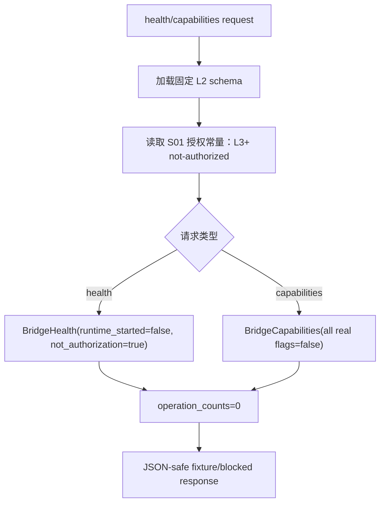

# LLD: CR045-S02 - Bridge Health Capabilities Skeleton

## 0. 上游设计依据

| 来源 | 路径 / ID | 被本 LLD 消费的内容 |
|---|---|---|
| S01 LLD | `process/stories/CR045-S01-windows-bridge-security-boundary-LLD.md` | L1/L2 allowed、L3/L4/L5 not-authorized、hard-off、blocked reason、zero secret custody。 |
| HLD | `docs/design/HLD-CR045-GOLDMINER-WINDOWS-BRIDGE.md` | L2 health/capabilities skeleton；不启动 runtime；不导入 SDK；不声明真实能力。 |
| ADR | `docs/design/ARCHITECTURE-DECISION-CR045.md` | ADR-CR045-002/004：L2 allowlist 仅三类 action；默认 hard-off。 |
| Feature Matrix | `docs/design/FEATURE-DESIGN-MATRIX-CR045.md` | S02 为 `full-lld`，触发原因 cross-module-contract、external-interface、data-model。 |
| Feature DESIGN | `docs/features/cr045-goldminer-bridge/DESIGN.md` | `BridgeHealth`、`BridgeCapabilities` 数据对象和 IF-CR045-01/02。 |
| Feature TEST-PLAN | `docs/features/cr045-goldminer-bridge/TEST-PLAN.md` | TP-SCOPE-01/02、TP-SEC-02/06。 |
| Feature TASKS | `docs/features/cr045-goldminer-bridge/TASKS.md` | CR045-S02-T1/T2：schema、false flags、contract tests。 |

## 1. Goal

设计 CR045 bridge L2 的 `health` 与 `capabilities` skeleton 合同，使后续实现可以离线返回 JSON-safe fixture/blocked response，并强制 `runtime_started=false`、`real_broker_enabled=false`、`readonly_probe_ready=false`、`simulation_ready=false`、`live_ready=false`，不启动 Windows bridge runtime，不导入或调用真实 Goldminer SDK。

## 2. Requirements（Functional / Non-Functional）

### 2.1 Functional

- 定义 `BridgeHealth` schema，至少包含 `schema_version`、`status`、`runtime_started=false`、`not_authorization=true`、`reason`、`operation_counts`。
- 定义 `BridgeCapabilities` schema，至少包含 real/simulation/live/readonly false flags 和 `allowed_actions`。
- 定义 L2 allowlist：`health`、`capabilities`、`readonly_probe_skeleton`，不包含真实 cash/position/order/fill/account endpoint。
- 定义 fixture response builder 的输出形态，所有响应不得包含 token/account_id/account state/cash/position/order/fill。
- 定义 contract tests 入口，为 S03/S04/S05 消费同一 schema。

### 2.2 Non-Functional

- 安全性：禁止真实 SDK import/call；禁止凭据读取；所有真实能力 flags 保持 false。
- 稳定性：schema version 固定为 CR045 L2 合同版本，后续扩展必须新 Story/CR。
- 可测试性：无需 Windows runtime 即可通过 fixture/unit/static tests 验证。
- 兼容性：只用标准库设计对象；不新增依赖。

## 3. 模块拆分与职责

| 模块 / 文件组 | 职责 | 说明 |
|---|---|---|
| `engine/goldminer_bridge_contract.py` | future primary：定义 schema、allowed actions、fixture response builder | CP5 后由 S02 创建；当前 LLD 仅设计。 |
| `tests/test_cr045_goldminer_bridge_contract.py` | future primary：验证 health/capabilities schema 和 false flags | CP5 后由 S02 创建。 |
| Bridge schema definitions | 数据合同 | S03/S04/S05 消费。 |
| Capability projection | 输出当前 L2 能力 | 所有真实 broker capability 均 false。 |
| Blocked response helper | 根据 S01 reason taxonomy 生成 blocked / fixture response | 不暴露敏感上下文。 |

## 4. 代码结构与文件影响范围

| 动作 | 文件路径 | 变更内容 |
|---|---|---|
| 创建 | `process/stories/CR045-S02-bridge-health-capabilities-skeleton-LLD.md` | 写入完整 LLD。 |
| 修改 | `process/stories/CR045-S02-bridge-health-capabilities-skeleton.md` | 状态推进到 `lld-ready-for-review`；保留 `implementation_allowed=false`。 |
| 创建 | `process/checks/CP5-CR045-S02-bridge-health-capabilities-skeleton-LLD-IMPLEMENTABILITY.md` | 写入 CP5 自动预检。 |
| 创建（CP6） | `engine/goldminer_bridge_contract.py` | 定义 L2 schema、allowed actions、fixture response builder；CP5 前不创建。 |
| 创建（CP6） | `tests/test_cr045_goldminer_bridge_contract.py` | 验证 schema 和 false flags；CP5 前不创建。 |
| 不修改 | `engine/goldminer_bridge_client.py` | S03 owner。 |
| 不读取 / 不修改 | `.env`、`.env.*`、Windows credential files | 禁止读取凭据材料。 |

## 5. 数据模型与持久化设计

无新增持久化变更。未来实现建议使用 dataclass 或 TypedDict，但不得引入依赖。

| 对象 / 字段 | 类型 | 约束 | 说明 |
|---|---|---|---|
| `BridgeHealth.schema_version` | string | 固定如 `cr045.l2.v1` | schema 版本。 |
| `BridgeHealth.status` | string | `fixture` 或 `blocked`；不得为 `running` | 当前不启动 runtime。 |
| `BridgeHealth.runtime_started` | bool | 必须为 `false` | 证明未启动 Windows bridge runtime。 |
| `BridgeHealth.not_authorization` | bool | 必须为 `true` | 表示非运行授权状态。 |
| `BridgeHealth.reason` | string | `windows_bridge_runtime_not_authorized`、`global_kill_switch_disabled` 或 `per_run_authorization_missing` | 不含敏感值。 |
| `BridgeHealth.operation_counts` | mapping[string,int] | forbidden counters 全 0 | S05 复验。 |
| `BridgeCapabilities.real_broker_enabled` | bool | 必须为 `false` | 不代表真实 Goldminer 能力。 |
| `BridgeCapabilities.readonly_probe_ready` | bool | 必须为 `false` | L4 未授权。 |
| `BridgeCapabilities.simulation_ready` | bool | 必须为 `false` | simulation/live 不授权。 |
| `BridgeCapabilities.live_ready` | bool | 必须为 `false` | live 不授权。 |
| `BridgeCapabilities.allowed_actions` | list[string] | 恰好或至多包含 `health`、`capabilities`、`readonly_probe_skeleton` | L2 allowlist。 |
| `BridgeCapabilities.not_authorized_actions` | list[string] | 覆盖 S01 not-authorized actions | 供 runbook/CP7 追溯。 |

## 6. API / Interface 设计

| 接口 / 入口 | 输入 | 输出 | 调用方 | 说明 |
|---|---|---|---|---|
| `build_bridge_health()` | 无真实 endpoint、无凭据 | `BridgeHealth` | S03 client、S02 tests | 第 10 节 T-S02-01/T-S02-04 验证。 |
| `build_bridge_capabilities()` | 可选 schema version / fixture mode，不含真实配置 | `BridgeCapabilities` | S03 client、S04 readonly probe、S05 static validation | 第 10 节 T-S02-02/T-S02-03 验证。 |
| `allowed_l2_actions()` | 无 | `["health", "capabilities", "readonly_probe_skeleton"]` | S03/S04 | 第 10 节 T-S02-03 验证。 |
| `is_sdk_runtime_available()` | 无 | 固定 `false` 或 equivalent blocked state | S02 tests / S03 client | 不尝试 import `gm` / `gmtrade`；第 10 节 T-S02-05 验证。 |

## 7. 核心处理流程

1. 调用方请求 health 或 capabilities。
2. contract 层读取固定 CR045 L2 schema version，不读取任何 runtime 配置。
3. contract 层从 S01 授权规则得出当前 runtime not-authorized。
4. health 返回 fixture/blocked status，且 `runtime_started=false`。
5. capabilities 返回 false flags，且 allowed actions 只包含三类 L2 skeleton action。
6. response 被 S05 static/no-operation 验证消费，forbidden operation counters 必须全 0。

## 8. 技术设计细节

- 关键算法 / 规则：
  - `allowed_l2_actions` 是固定 allowlist，不从外部配置读取。
  - `BridgeCapabilities` 中任何真实能力 flag 如果为 true，测试必须失败。
  - health 不得探测端口、进程或 Windows runtime；只能返回当前 not-authorized fixture state。
- 依赖选择与复用点：
  - 可复用 S01 的 blocked reason 和 forbidden counters 名称。
  - 后续实现只需标准库 `dataclasses` / `typing` / `json`。
- 兼容性处理：
  - 输出必须 JSON-safe：string、bool、list、dict、int；不得透传 SDK object。
  - `schema_version` 用于后续 L3/L4 升级时保持兼容。
- 图示类型选择：本 Story涉及 contract -> fixture response -> static evidence 三个模块，使用流程图。

## 9. 安全与性能设计

| 维度 | 设计措施 | 验证方式 |
|---|---|---|
| 安全 | 不读取 endpoint/token/account_id；不导入 SDK；真实 capability flags 全 false。 | T-S02-02、T-S02-05、S05 static scan。 |
| 权限 | `not_authorization=true`，health/capabilities 不构成 runtime authorization。 | T-S02-01、T-S02-04。 |
| 数据最小化 | response 不包含 account/cash/position/order/fill。 | T-S02-06。 |
| 性能 | fixture response 不触发网络，单次构造为本地常量级操作。 | 后续 unit test 可计时；CP5 不执行。 |

## 10. 测试设计

| 测试场景 | 前置条件 | 操作 | 预期结果 | 验证方式 |
|---|---|---|---|---|
| T-S02-01 health schema 完整 | CP6 创建 contract module | 调用 `build_bridge_health()` | 包含 `schema_version/status/runtime_started/not_authorization/reason/operation_counts`；`runtime_started=false` | `uv run --python 3.11 pytest -q tests/test_cr045_goldminer_bridge_contract.py` |
| T-S02-02 capabilities false flags | CP6 创建 contract module | 调用 `build_bridge_capabilities()` | `real_broker_enabled=false`、`readonly_probe_ready=false`、`simulation_ready=false`、`live_ready=false` | 同上 |
| T-S02-03 allowlist 限定 | contract module 可导入 | 调用 `allowed_l2_actions()` | 仅 `health/capabilities/readonly_probe_skeleton` | 同上 |
| T-S02-04 runtime 未启动 | health response | 检查 status/reason | 不出现 `running`，reason 为 not-authorized / kill-switch 类 | 同上 |
| T-S02-05 禁止 SDK import/call | repository static scan | 查找 S02 文件是否导入 `gm` / `gmtrade` 或调用 login/connect | 无命中 | S05 static validation / CP7 review |
| T-S02-06 response 不含账户数据 | fixture response | 扫描 token/account_id/account/cash/position/order/fill 字段 | 无真实账户或查询数据 | S05 static validation |

## 11. 实施步骤

| TASK-ID | 动作 | 目标文件 | 详细描述 | 对应测试 |
|---|---|---|---|---|
| CR045-S02-T1 | 创建 | `process/stories/CR045-S02-bridge-health-capabilities-skeleton-LLD.md` | 设计 `BridgeHealth` schema 和 runtime-not-started response。 | T-S02-01、T-S02-04 |
| CR045-S02-T2 | 创建 | `process/stories/CR045-S02-bridge-health-capabilities-skeleton-LLD.md` | 设计 `BridgeCapabilities` false flags 和 L2 allowlist actions。 | T-S02-02、T-S02-03 |
| CR045-S02-T3 | 创建（CP6） | `engine/goldminer_bridge_contract.py` | 落地 schema、fixture builder、allowed actions；CP5 前不得创建。 | T-S02-01..T-S02-06 |
| CR045-S02-T4 | 创建（CP6） | `tests/test_cr045_goldminer_bridge_contract.py` | 落地 contract fixture tests。 | T-S02-01..T-S02-06 |
| CR045-S02-T5 | 修改 | `process/stories/CR045-S02-bridge-health-capabilities-skeleton.md` | 状态推进为 `lld-ready-for-review`；保留 `implementation_allowed=false`。 | CP5 review |
| CR045-S02-T6 | 创建 | `process/checks/CP5-CR045-S02-bridge-health-capabilities-skeleton-LLD-IMPLEMENTABILITY.md` | 写入 CP5 自动预检。 | CP5 checklist |

## 12. 风险、难点与预研建议

### 12.1 实现灰区与取舍记录

| Clarification ID | 问题 | 选项与推荐 | 决策 / 答案 | 影响面 | 证据 | 重访条件 |
|---|---|---|---|---|---|---|
| N/A | 本 Story 未新增需要用户或上游决策的问题。 | 推荐沿用 CP3 已批准的 health/capabilities/readonly skeleton 三类 allowlist；备选 health-only 已在 CP3 未采用。 | 已由 CP3 approved；无 `blocks_lld=true` 新项。 | 接口 / 测试 / 安全 / 跨 Story 契约 | `process/checkpoints/CP3-CR045-HLD-REVIEW.md` DQ-CP3-CR045-02 | 用户要求真实 health check 或 runtime start 时，停止并交回 meta-po 发起 L3 授权。 |

| 风险 / 难点 | 影响 | 缓解措施 / 预研建议 |
|---|---|---|
| capabilities false flags 被后续改成 true | 误导用户认为可 simulation/live 或真实只读 | contract tests 固定 false；S06 runbook 明确不授权。 |
| health 被实现成真实端口/进程探测 | 越过 L3 runtime 授权 | S03/S05 禁止真实连接和端口探测；S02 health 只返回 fixture/blocked。 |
| schema 后续扩展破坏 S03/S04 | 跨 Story 合同不稳定 | `schema_version` 固定；新增字段需兼容或新 CR。 |

### OPEN / Spike 跟踪

| ID | 类型（OPEN / Spike） | 问题 | 下一动作 | 责任方 |
|---|---|---|---|---|
| O-S02-01 | OPEN | 真实 Windows bridge health 字段、端口和进程状态未验证。 | 不阻塞 L2；L3 bridge health 授权后另行设计。 | meta-po / future meta-dev |

## 13. 回滚与发布策略

- 发布方式：作为 CR045 CP5 全量设计证据的一部分进入人工确认。
- 回滚触发条件：CP5 认为 health/capabilities 范围过宽、schema 误导为真实能力、或需要真实 runtime health。
- 回滚动作：
  - 降级为 health-only 需回到 CP5/CP3 决策，不在本 Story 静默修改。
  - 删除或修订本 LLD / CP5 自动预检；不创建实现文件。

## 14. Definition of Done

- [x] 14 个章节全部填写完成。
- [x] `BridgeHealth` 和 `BridgeCapabilities` schema 可直接指导编码。
- [x] 每个接口在测试设计中有对应验证入口。
- [x] 异常路径在测试设计中有对应错误验证。
- [x] OPEN / Spike 已清点。
- [x] 未新增 clarification queue 阻断项。
- [x] 不读取凭据、不启动 runtime、不导入 SDK、不连接 Goldminer。

## 人工确认区

> **CP5 - Story 设计证据可实现性门**
> 本 LLD 需与 CR045 全量设计证据一起统一确认；CP5 approved 前不得创建 `engine/goldminer_bridge_contract.py` 或测试文件。

**CP5 checklist 摘要**：

| # | 检查项 | 状态 | 证据 |
|---|---|---|---|
| 1 | LLD 覆盖 AC | 待检查 | 第 2 / 5 / 10 / 14 节 |
| 2 | 与 HLD / ADR 一致 | 待检查 | 第 0 / 8 / 12 节 |
| 3 | 文件影响范围明确 | 待检查 | 第 4 / 11 节 |
| 4 | 接口契约完整 | 待检查 | 第 6 节 |
| 5 | 测试与 dev_gate 可计算 | 待检查 | 第 10 / 14 节 |
| 6 | clarification queue 已收敛 | 待检查 | 第 12.1 节 |

**人工审查结果回填**：

- 结论：`approved | changes_requested | rejected`
- 审查人：
- 审查时间：
- 修改意见：
- 风险接受项：
