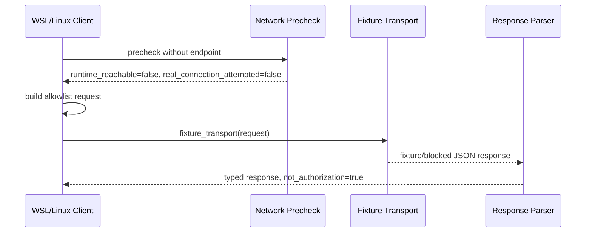

# LLD: CR045-S03 - WSL Linux Client Contract and Network Precheck

## 0. 上游设计依据

| 来源 | 路径 / ID | 被本 LLD 消费的内容 |
|---|---|---|
| S01 LLD | `process/stories/CR045-S01-windows-bridge-security-boundary-LLD.md` | WSL/Linux 不持有 SDK/凭据、不直接连接 Goldminer、不直接下单；L3+ not-authorized。 |
| S02 LLD | `process/stories/CR045-S02-bridge-health-capabilities-skeleton-LLD.md` | `BridgeHealth`、`BridgeCapabilities`、L2 allowlist schema。 |
| HLD | `docs/design/HLD-CR045-GOLDMINER-WINDOWS-BRIDGE.md` | WSL / future Linux research server 只做研究、回测、组合生成、order intent 和 bridge client。 |
| ADR | `docs/design/ARCHITECTURE-DECISION-CR045.md` | ADR-CR045-001/002/003/004：Windows bridge topology、L2 allowlist、零敏感值、hard-off。 |
| Feature DESIGN | `docs/features/cr045-goldminer-bridge/DESIGN.md` | WSL/Linux client contract、fixture transport、network precheck、runtime-not-started behavior。 |
| Feature TEST-PLAN | `docs/features/cr045-goldminer-bridge/TEST-PLAN.md` | TP-SCOPE-03、R-CR045-FD-03、TP-SEC-06。 |
| Feature TASKS | `docs/features/cr045-goldminer-bridge/TASKS.md` | CR045-S03-T1/T2：request/response、fixture transport、network precheck、forbidden import/call validation。 |

## 1. Goal

设计 WSL / Linux bridge client 的合同和 network precheck：Linux 侧只能构造 JSON-safe allowlist request、通过 fixture transport 消费 S02 response、返回 runtime-not-started / not-authorized 状态；不得导入 `gm` / `gmtrade`，不得读取 `.env` 或 token/account_id，且不得连接真实 Windows bridge endpoint。

## 2. Requirements（Functional / Non-Functional）

### 2.1 Functional

- 定义 `BridgeClientRequest`，action 仅允许 `health`、`capabilities`、`readonly_probe_skeleton`。
- 定义 `BridgeClientResponse` parsing，必须兼容 S02 health/capabilities 和 S04 readonly blocked response。
- 定义 `NetworkPrecheckResult`，当前 L2 必须表达 `runtime_reachable=false`、`runtime_start_attempted=false`、`real_connection_attempted=false`、`reason`。
- 定义 fixture transport，不触发 socket、HTTP、subprocess、Windows process start 或 endpoint probing。
- 定义 static validation：禁止 `gm` / `gmtrade` import/call，禁止读取 `.env`、endpoint、token、account_id。

### 2.2 Non-Functional

- 安全性：Linux 侧零 SDK/零凭据/零真实连接。
- 可移植性：WSL 与 future Linux research server 只能依赖 JSON-safe request/response，不依赖 Windows SDK package。
- 可测试性：所有验证使用 fixture/static；不连接真实 Windows runtime。
- 可维护性：client 不决定授权，只消费 S01/S02/S04 合同。

## 3. 模块拆分与职责

| 模块 / 文件组 | 职责 | 说明 |
|---|---|---|
| `engine/goldminer_bridge_client.py` | future primary：client request builder、fixture transport、network precheck | CP5 后由 S03 创建；当前只设计。 |
| `tests/test_cr045_goldminer_bridge_client.py` | future primary：client contract tests、forbidden import/call static tests | CP5 后由 S03 创建。 |
| Request builder | 构造 allowlist action request | 不含 token/account_id/session/cookie/private key。 |
| Fixture transport | 返回 fixture/blocked response | 不打开 socket、不启动进程。 |
| Network precheck | 表达 runtime 未启动/未授权 | 不探测真实端口。 |
| Response parser | 解析 S02/S04 JSON-safe response | 不接收 SDK object。 |

## 4. 代码结构与文件影响范围

| 动作 | 文件路径 | 变更内容 |
|---|---|---|
| 创建 | `process/stories/CR045-S03-wsl-linux-client-contract-and-network-precheck-LLD.md` | 写入完整 LLD。 |
| 修改 | `process/stories/CR045-S03-wsl-linux-client-contract-and-network-precheck.md` | 状态推进到 `lld-ready-for-review`；保留 `implementation_allowed=false`。 |
| 创建 | `process/checks/CP5-CR045-S03-wsl-linux-client-contract-and-network-precheck-LLD-IMPLEMENTABILITY.md` | 写入 CP5 自动预检。 |
| 创建（CP6） | `engine/goldminer_bridge_client.py` | 落地 client request/response、fixture transport、network precheck；CP5 前不创建。 |
| 创建（CP6） | `tests/test_cr045_goldminer_bridge_client.py` | 落地 fixture/static tests；CP5 前不创建。 |
| 只读消费（CP6） | `engine/goldminer_bridge_contract.py` | 消费 S02 contract；修改需由 S02 merge owner 协调。 |
| 不读取 / 不修改 | `.env`、`.env.*`、`gm`、`gmtrade`、Windows credential files | 禁止 SDK/凭据路径。 |

## 5. 数据模型与持久化设计

无新增持久化变更。未来实现建议使用轻量 dataclass / TypedDict。

| 对象 / 字段 | 类型 | 约束 | 说明 |
|---|---|---|---|
| `BridgeClientRequest.action` | string | 仅 `health`、`capabilities`、`readonly_probe_skeleton` | 非 allowlist action 在 client 侧可提前 blocked。 |
| `BridgeClientRequest.client_context` | dict | 仅允许 `client_name`、`schema_version`、`fixture_mode` 等非敏感字段 | 不含 hostname、username、token/account_id 或真实 endpoint。 |
| `BridgeClientRequest.payload` | dict | skeleton-only；不得包含 account/cash/position/order/fill query payload | S04 进一步约束 readonly skeleton。 |
| `BridgeClientResponse.status` | string | `fixture` 或 `blocked` | 不允许 `connected` / `running`。 |
| `NetworkPrecheckResult.runtime_reachable` | bool | L2 必须为 `false` | 不连接真实 endpoint。 |
| `NetworkPrecheckResult.runtime_start_attempted` | bool | 必须为 `false` | 不启动 runtime。 |
| `NetworkPrecheckResult.real_connection_attempted` | bool | 必须为 `false` | 不触发 socket/HTTP。 |
| `NetworkPrecheckResult.reason` | string | `windows_bridge_runtime_not_authorized` 或等价 blocked reason | 供 CP7 追溯。 |

## 6. API / Interface 设计

| 接口 / 入口 | 输入 | 输出 | 调用方 | 说明 |
|---|---|---|---|---|
| `build_bridge_client_request(action, payload=None)` | allowlist action 和 skeleton payload | `BridgeClientRequest` 或 blocked decision | future adapter / tests | 第 10 节 T-S03-01/T-S03-02 验证。 |
| `fixture_transport(request)` | `BridgeClientRequest` | JSON-safe `BridgeClientResponse` | S03 tests、future CLI | 不连接网络；第 10 节 T-S03-03 验证。 |
| `network_precheck()` | 无真实 endpoint 输入 | `NetworkPrecheckResult` | S03 tests、runbook | 表达 not-authorized，不探测端口；第 10 节 T-S03-04 验证。 |
| `parse_bridge_response(payload)` | dict | typed response / validation error | future client consumers | 拒绝 SDK object 和敏感字段；第 10 节 T-S03-05 验证。 |

## 7. 核心处理流程

异常路径：

1. action 不在 allowlist：client 返回 blocked，不传输。
2. payload 出现 token/account_id/session/cookie/private key 或真实 account query 结构：blocked/redacted，并交由 S05 static validation 失败。
3. 调用方要求真实 endpoint、socket、HTTP、subprocess 或 Windows runtime start：停止，交回 meta-po 发起 L3 authorization gate。

## 8. 技术设计细节

- 关键算法 / 规则：
  - client 不拥有授权决策，只做 allowlist 本地校验和 response parsing。
  - `network_precheck()` 在 L2 是声明性 precheck，不是连接性检测。
  - fixture transport 是唯一允许的 transport；真实 network transport 属于 L3+。
- 依赖选择与复用点：
  - 消费 S02 的 `allowed_l2_actions`、health/capabilities schema。
  - 消费 S01 的 blocked reason 和 sensitive field categories。
- 兼容性处理：
  - 所有接口只接受/返回 JSON-safe 对象。
  - 不依赖 Windows-specific package，不导入 Goldminer SDK。
- 图示类型选择：本 Story跨 client / precheck / transport / parser 四个模块，使用时序图。

## 9. 安全与性能设计

| 维度 | 设计措施 | 验证方式 |
|---|---|---|
| 安全 | 禁止 SDK import/call、禁止凭据读取、禁止真实 endpoint probing。 | T-S03-04、T-S03-06、S05 static scan。 |
| 权限 | network precheck 固定返回 not-authorized / not-started，不启动 runtime。 | T-S03-04。 |
| 数据最小化 | request/response 不含 token/account_id/account/cash/position/order/fill。 | T-S03-05、S05 scan。 |
| 性能 | fixture transport 本地返回，不做网络等待。 | CP6 unit tests 可断言不调用网络 mock。 |

## 10. 测试设计

| 测试场景 | 前置条件 | 操作 | 预期结果 | 验证方式 |
|---|---|---|---|---|
| T-S03-01 request builder 只接受 allowlist | CP6 创建 client module | 用三类 action 构造请求 | 成功返回 JSON-safe request | `uv run --python 3.11 pytest -q tests/test_cr045_goldminer_bridge_client.py` |
| T-S03-02 非 allowlist blocked | client module | action=`cash_query` / `order_submit` | blocked，reason=`operation_not_whitelisted` | 同上 |
| T-S03-03 fixture transport 不连接网络 | client module + monkeypatch 网络调用 | 调用 fixture transport | 不触发 socket/HTTP/subprocess，返回 fixture/blocked response | 同上 |
| T-S03-04 network precheck runtime-not-started | client module | 调用 `network_precheck()` | `runtime_reachable=false`、`runtime_start_attempted=false`、`real_connection_attempted=false` | 同上 |
| T-S03-05 response parser 拒绝敏感字段 | 传入含 token/account_id 的 dict | parse response | blocked / validation error，不保存原值 | S03 tests + S05 static scan |
| T-S03-06 禁止 `gm` / `gmtrade` import | repository static scan | 扫描 S03 文件 | 无 import/call 命中 | S05 static validation / CP7 review |

## 11. 实施步骤

| TASK-ID | 动作 | 目标文件 | 详细描述 | 对应测试 |
|---|---|---|---|---|
| CR045-S03-T1 | 创建 | `process/stories/CR045-S03-wsl-linux-client-contract-and-network-precheck-LLD.md` | 设计 client request builder 和 JSON-safe response parsing。 | T-S03-01、T-S03-02、T-S03-05 |
| CR045-S03-T2 | 创建 | `process/stories/CR045-S03-wsl-linux-client-contract-and-network-precheck-LLD.md` | 设计 fixture transport 和 network precheck 的 blocked 行为。 | T-S03-03、T-S03-04 |
| CR045-S03-T3 | 创建（CP6） | `engine/goldminer_bridge_client.py` | 落地 client contract；CP5 前不得创建。 | T-S03-01..T-S03-06 |
| CR045-S03-T4 | 创建（CP6） | `tests/test_cr045_goldminer_bridge_client.py` | 落地 client fixture/static tests。 | T-S03-01..T-S03-06 |
| CR045-S03-T5 | 修改 | `process/stories/CR045-S03-wsl-linux-client-contract-and-network-precheck.md` | 状态推进为 `lld-ready-for-review`；保留 `implementation_allowed=false`。 | CP5 review |
| CR045-S03-T6 | 创建 | `process/checks/CP5-CR045-S03-wsl-linux-client-contract-and-network-precheck-LLD-IMPLEMENTABILITY.md` | 写入 CP5 自动预检。 | CP5 checklist |

## 12. 风险、难点与预研建议

### 12.1 实现灰区与取舍记录

| Clarification ID | 问题 | 选项与推荐 | 决策 / 答案 | 影响面 | 证据 | 重访条件 |
|---|---|---|---|---|---|---|
| N/A | 本 Story 未新增需要用户或上游决策的问题。 | 推荐沿用 CP3：WSL/Linux 只做 allowlist client，不持有 SDK/凭据，不直接连接 Goldminer。备选 direct SDK / endpoint Spike 已在 CP3 未采用。 | 已由 CP3 approved；无 `blocks_lld=true` 新项。 | 跨平台 / 安全 / 接口 / 测试 | `process/checkpoints/CP3-CR045-HLD-REVIEW.md` DQ-CP3-CR045-01 | 任何真实 connection、endpoint probing、SDK import 或凭据读取需求出现时，停止并交回 meta-po。 |

| 风险 / 难点 | 影响 | 缓解措施 / 预研建议 |
|---|---|---|
| network precheck 被误实现为真实探测 | 可能启动或连接 runtime | LLD 明确 precheck 是声明性 blocked result；CP7 static review 关注 socket/HTTP/subprocess。 |
| future Linux research server 被误当成 broker runtime | 凭据或 SDK 进入 Linux | S03/S06 文档明确 Linux 只做 research/backtest/order intent/client。 |
| fixture transport 与未来真实 transport 混淆 | 后续扩展风险 | 真实 transport 必须新 L3+ gate / Story，不在 S03 L2 中预埋执行路径。 |

### OPEN / Spike 跟踪

| ID | 类型（OPEN / Spike） | 问题 | 下一动作 | 责任方 |
|---|---|---|---|---|
| O-S03-01 | Spike | 官方 terminal local endpoint 是否可用。 | 不阻塞 L2；若用户/官方提供资料且授权 L3/L4，再启动 endpoint Spike。 | meta-po / future meta-se |

## 13. 回滚与发布策略

- 发布方式：纳入 CR045 CP5 全量设计证据；CP5 未确认前不得实现。
- 回滚触发条件：CP5 认为 client contract 仍可能触发真实网络、或用户要求 direct SDK / direct endpoint。
- 回滚动作：
  - direct SDK / endpoint 需求必须回退 CP3 或新 CR，不在 S03 静默切换。
  - 删除或修订本 LLD / CP5 自动预检；不创建实现文件。

## 14. Definition of Done

- [x] 14 个章节全部填写完成。
- [x] client request/response、fixture transport、network precheck 均有接口和测试映射。
- [x] 异常路径覆盖 forbidden action、敏感字段、真实 connection 要求。
- [x] 未新增 clarification queue 阻断项。
- [x] CP5 前不实现，不读取凭据，不导入 SDK，不连接 Goldminer。

## 人工确认区

> **CP5 - Story 设计证据可实现性门**
> 本 LLD 需与 CR045 全量设计证据一起统一确认；CP5 approved 前不得创建 `engine/goldminer_bridge_client.py` 或测试文件。

**CP5 checklist 摘要**：

| # | 检查项 | 状态 | 证据 |
|---|---|---|---|
| 1 | LLD 覆盖 AC | 待检查 | 第 2 / 5 / 10 / 14 节 |
| 2 | 与 HLD / ADR 一致 | 待检查 | 第 0 / 8 / 12 节 |
| 3 | 文件影响范围明确 | 待检查 | 第 4 / 11 节 |
| 4 | 接口契约完整 | 待检查 | 第 6 节 |
| 5 | 测试与 dev_gate 可计算 | 待检查 | 第 10 / 14 节 |
| 6 | clarification queue 已收敛 | 待检查 | 第 12.1 节 |

**人工审查结果回填**：

- 结论：`approved | changes_requested | rejected`
- 审查人：
- 审查时间：
- 修改意见：
- 风险接受项：
