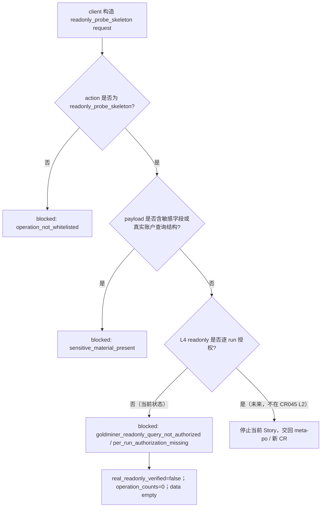

# LLD: CR045-S04 - Readonly Probe Allowlist and Blocked-First

## 0. 上游设计依据

| 来源 | 路径 / ID | 被本 LLD 消费的内容 |
|---|---|---|
| S01 LLD | `process/stories/CR045-S01-windows-bridge-security-boundary-LLD.md` | L4 readonly probe 当前 not-authorized；默认 hard-off；敏感字段和 blocked reason 根合同。 |
| S02 LLD | `process/stories/CR045-S02-bridge-health-capabilities-skeleton-LLD.md` | L2 allowlist、BridgeCapabilities false flags、JSON-safe contract。 |
| S03 LLD | `process/stories/CR045-S03-wsl-linux-client-contract-and-network-precheck-LLD.md` | WSL/Linux client request/response 和 fixture transport 语义。 |
| HLD | `docs/design/HLD-CR045-GOLDMINER-WINDOWS-BRIDGE.md` | readonly probe 只做 request/response skeleton；不查询 cash/position/order/fill/account state。 |
| ADR | `docs/design/ARCHITECTURE-DECISION-CR045.md` | ADR-CR045-002/004/007：真实 readonly 默认 blocked；默认 hard-off；不得声明 real-readonly-verified。 |
| Feature DESIGN | `docs/features/cr045-goldminer-bridge/DESIGN.md` | IF-CR045-03、ReadonlyProbeRequest/Response、Failure IDs。 |
| Feature TEST-PLAN | `docs/features/cr045-goldminer-bridge/TEST-PLAN.md` | TP-SCOPE-04、TP-SEC-03/04、R-CR045-FD-04。 |
| Feature TASKS | `docs/features/cr045-goldminer-bridge/TASKS.md` | CR045-S04-T1/T2：request/response schema、blocked reasons、negative fixture cases。 |

## 1. Goal

设计 readonly probe skeleton 的 allowlist 和 blocked-first response：允许表达 `readonly_probe_skeleton` 请求外形，但在 L4 未授权时始终返回 blocked、`real_readonly_verified=false`、forbidden operation counters 全 0，且不查询 cash、position、order、fill 或 account state。

## 2. Requirements（Functional / Non-Functional）

### 2.1 Functional

- 定义 `ReadonlyProbeRequest`，只表达 skeleton probe，不包含真实 token/account_id、account state、broker session 或真实 endpoint。
- 定义 `ReadonlyProbeResponse`，当前 L2 必须 `status=blocked`、`real_readonly_verified=false`、`not_authorization=true`。
- 定义 probe kind allowlist：仅允许 skeleton labels，不允许执行真实 cash/position/order/fill/account 查询。
- 定义 blocked reason：至少覆盖 `per_run_authorization_missing`、`goldminer_readonly_query_not_authorized`、`operation_not_whitelisted`、`sensitive_material_present`。
- 定义 negative fixture cases：真实查询请求、敏感字段、非 allowlist action 都必须 blocked。

### 2.2 Non-Functional

- 安全性：不触发任何真实 broker query，不读取账号或凭据。
- 可审计性：所有 blocked response 记录 reason code、字段类别和 zero counters。
- 可测试性：readonly 行为仅用 fixture/static 验证。
- 可回滚性：如 readonly skeleton 仍被认为过宽，可回退到 health/capabilities-only，但必须走 CP5/CP3 决策。

## 3. 模块拆分与职责

| 模块 / 文件组 | 职责 | 说明 |
|---|---|---|
| `engine/goldminer_bridge_probe.py` | future primary：readonly probe request/response schema、allowlist decision、blocked response builder | CP5 后由 S04 创建；当前只设计。 |
| `tests/test_cr045_goldminer_readonly_probe.py` | future primary：positive skeleton + negative blocked fixture tests | CP5 后由 S04 创建。 |
| Readonly probe request schema | 表达 skeleton probe | 不携带真实账户或查询 payload。 |
| Probe allowlist decision | 检查 action/probe_kind 是否为 skeleton | 不执行真实查询。 |
| Blocked-first response builder | 生成 blocked response 和 zero counters | 消费 S01 reason taxonomy。 |
| Evidence handoff | 为 S05 提供 artifact scan 输入 | 只包含脱敏 summary。 |

## 4. 代码结构与文件影响范围

| 动作 | 文件路径 | 变更内容 |
|---|---|---|
| 创建 | `process/stories/CR045-S04-readonly-probe-allowlist-and-blocked-first-LLD.md` | 写入完整 LLD。 |
| 修改 | `process/stories/CR045-S04-readonly-probe-allowlist-and-blocked-first.md` | 状态推进到 `lld-ready-for-review`；保留 `implementation_allowed=false`。 |
| 创建 | `process/checks/CP5-CR045-S04-readonly-probe-allowlist-and-blocked-first-LLD-IMPLEMENTABILITY.md` | 写入 CP5 自动预检。 |
| 创建（CP6） | `engine/goldminer_bridge_probe.py` | 落地 readonly skeleton / blocked-first contract；CP5 前不创建。 |
| 创建（CP6） | `tests/test_cr045_goldminer_readonly_probe.py` | 落地 readonly negative fixture tests；CP5 前不创建。 |
| 只读消费（CP6） | `engine/goldminer_bridge_contract.py` | 消费 S02 schema；必要修改需 S02 merge owner 协调。 |
| 不读取 / 不修改 | `.env`、`.env.*`、`data/market_data`、`catalog`、Windows credential files | 禁止凭据、provider/lake/publish 和真实账户数据路径。 |

## 5. 数据模型与持久化设计

无新增持久化变更。所有 request/response 均为内存 fixture 对象。

| 对象 / 字段 | 类型 | 约束 | 说明 |
|---|---|---|---|
| `ReadonlyProbeRequest.action` | string | 必须为 `readonly_probe_skeleton` | 非 allowlist action blocked。 |
| `ReadonlyProbeRequest.probe_kind` | string | 仅 skeleton label，如 `account_state_skeleton`、`cash_skeleton`、`position_skeleton`、`order_skeleton`、`fill_skeleton` | label 不等于真实查询。 |
| `ReadonlyProbeRequest.client_context` | dict | 仅非敏感 client/schema 信息 | 不含 token/account_id/session/cookie。 |
| `ReadonlyProbeRequest.contains_sensitive_material` | bool | 默认 false；若 true 必须 blocked | S05 验证。 |
| `ReadonlyProbeResponse.status` | string | L2 必须为 `blocked` | 不允许 `ok` / `verified`。 |
| `ReadonlyProbeResponse.reason` | string | 稳定 blocked reason | 不含敏感值。 |
| `ReadonlyProbeResponse.real_readonly_verified` | bool | 必须为 `false` | 不声明真实只读验证。 |
| `ReadonlyProbeResponse.operation_counts` | mapping[string,int] | forbidden counters 全 0 | S05 验证。 |
| `ReadonlyProbeResponse.data` | dict/null | L2 必须为空或只含脱敏 metadata | 不含 cash/position/order/fill/account data。 |

## 6. API / Interface 设计

| 接口 / 入口 | 输入 | 输出 | 调用方 | 说明 |
|---|---|---|---|---|
| `build_readonly_probe_request(probe_kind, client_context=None)` | skeleton probe kind、非敏感 context | `ReadonlyProbeRequest` | S03 client / tests | 第 10 节 T-S04-01/T-S04-02 验证。 |
| `evaluate_readonly_probe_request(request)` | `ReadonlyProbeRequest` | allow/blocked decision；当前 L2 恒 blocked | S04 probe / tests | 第 10 节 T-S04-03/T-S04-04 验证。 |
| `build_blocked_readonly_response(request, reason)` | request、reason code | `ReadonlyProbeResponse` | S04 probe / S03 client | 第 10 节 T-S04-05/T-S04-06 验证。 |
| `readonly_probe_forbidden_fields()` | 无 | 字段名/类别集合 | S05 static validation | 第 10 节 T-S04-07 验证。 |

## 7. 核心处理流程

## 8. 技术设计细节

- 关键算法 / 规则：
  - `probe_kind` 是 skeleton label，不是执行指令。
  - 当前 L2 中即使 probe kind 看似合法，也必须因 L4 not-authorized 返回 blocked。
  - blocked response 必须包含 `real_readonly_verified=false`，避免用户误读。
- 依赖选择与复用点：
  - 消费 S01 `BlockedReason` 和 no-operation counter baseline。
  - 消费 S02 allowed actions 与 schema version。
  - 消费 S03 request/response JSON-safe 约束。
- 兼容性处理：
  - future L4 真实查询必须新增接口或扩展 schema version，不得重用 L2 skeleton 直接打开。
  - response 中 `data` 字段当前为空或只含脱敏 metadata，为后续兼容保留但不承载真实数据。
- 图示类型选择：readonly probe 的异常分支是安全关键路径，使用流程图。

## 9. 安全与性能设计

| 维度 | 设计措施 | 验证方式 |
|---|---|---|
| 安全 | L4 未授权下全部真实 readonly query blocked；不保存真实账户数据。 | T-S04-03/T-S04-04/T-S04-06。 |
| 权限 | `real_readonly_verified=false` 且 `not_authorization=true`。 | T-S04-05。 |
| 数据最小化 | `data` 为空或仅脱敏 metadata；不含 cash/position/order/fill/account state。 | T-S04-06/T-S04-07。 |
| 性能 | fixture blocked response 不触发网络或 SDK 调用。 | T-S04-08。 |

## 10. 测试设计

| 测试场景 | 前置条件 | 操作 | 预期结果 | 验证方式 |
|---|---|---|---|---|
| T-S04-01 request schema 完整 | CP6 创建 probe module | 构造 skeleton request | action/probe_kind/client_context/contains_sensitive_material 字段存在；无敏感值 | `uv run --python 3.11 pytest -q tests/test_cr045_goldminer_readonly_probe.py` |
| T-S04-02 非 allowlist action | probe module | action=`cash_query` 或 `order_query` | blocked，reason=`operation_not_whitelisted` | 同上 |
| T-S04-03 L4 未授权 blocked | skeleton request | evaluate request | blocked，reason 为 `per_run_authorization_missing` 或 `goldminer_readonly_query_not_authorized` | 同上 |
| T-S04-04 敏感字段 blocked | request 包含 token/account_id 字段名或标记 | evaluate request | blocked/redacted，原值不保存 | 同上 + S05 scan |
| T-S04-05 response 不声明真实只读 | blocked response | 检查 response | `real_readonly_verified=false`、status=`blocked` | 同上 |
| T-S04-06 无账户数据 | blocked response | 扫描 data/fields | 不含 cash/position/order/fill/account state 原始数据 | 同上 + S05 scan |
| T-S04-07 forbidden fields 集合 | probe module | 获取 forbidden fields | 覆盖 S01/S05 必需敏感字段类别 | S05 static validation |
| T-S04-08 不触发 SDK/网络 | monkeypatch network/SDK entry | 调用 probe flow | 无 socket/HTTP/subprocess/SDK 调用 | CP7 static/fixture |

## 11. 实施步骤

| TASK-ID | 动作 | 目标文件 | 详细描述 | 对应测试 |
|---|---|---|---|---|
| CR045-S04-T1 | 创建 | `process/stories/CR045-S04-readonly-probe-allowlist-and-blocked-first-LLD.md` | 设计 readonly probe skeleton request/response schema。 | T-S04-01、T-S04-05、T-S04-06 |
| CR045-S04-T2 | 创建 | `process/stories/CR045-S04-readonly-probe-allowlist-and-blocked-first-LLD.md` | 设计 L4 未授权 blocked reason 和 allowlist decision table。 | T-S04-02、T-S04-03、T-S04-04 |
| CR045-S04-T3 | 创建（CP6） | `engine/goldminer_bridge_probe.py` | 落地 readonly probe skeleton 和 blocked-first response；CP5 前不得创建。 | T-S04-01..T-S04-08 |
| CR045-S04-T4 | 创建（CP6） | `tests/test_cr045_goldminer_readonly_probe.py` | 落地 positive skeleton 和 negative blocked tests。 | T-S04-01..T-S04-08 |
| CR045-S04-T5 | 修改 | `process/stories/CR045-S04-readonly-probe-allowlist-and-blocked-first.md` | 状态推进为 `lld-ready-for-review`；保留 `implementation_allowed=false`。 | CP5 review |
| CR045-S04-T6 | 创建 | `process/checks/CP5-CR045-S04-readonly-probe-allowlist-and-blocked-first-LLD-IMPLEMENTABILITY.md` | 写入 CP5 自动预检。 | CP5 checklist |

## 12. 风险、难点与预研建议

### 12.1 实现灰区与取舍记录

| Clarification ID | 问题 | 选项与推荐 | 决策 / 答案 | 影响面 | 证据 | 重访条件 |
|---|---|---|---|---|---|---|
| N/A | 本 Story 未新增需要用户或上游决策的问题。 | 推荐沿用 CP3：L2 只允许 readonly probe skeleton，真实 readonly 默认 blocked；备选 health-only 或真实 endpoint 已在 CP3 处理。 | 已由 CP3 approved；无 `blocks_lld=true` 新项。 | 接口 / 安全 / 测试 / 文档 | `process/checkpoints/CP3-CR045-HLD-REVIEW.md` DQ-CP3-CR045-02/04/05 | 用户要求真实 cash/position/order/fill/account state 时，停止并交回 meta-po 发起 L4 gate。 |

| 风险 / 难点 | 影响 | 缓解措施 / 预研建议 |
|---|---|---|
| readonly skeleton 被误认为真实只读验证 | 误导 CP8 结论 | response 强制 `real_readonly_verified=false`；S06 runbook 明确关闭语义。 |
| negative fixture 不充分 | 真实 query payload 可能漏过 | T-S04-02/04/06/08 覆盖 action、敏感字段、数据字段和 SDK/网络调用。 |
| future L4 复用 L2 skeleton 打开真实查询 | 越过授权和设计 | LLD 明确 L4 必须新 gate / Story / schema version。 |

### OPEN / Spike 跟踪

| ID | 类型（OPEN / Spike） | 问题 | 下一动作 | 责任方 |
|---|---|---|---|---|
| O-S04-01 | OPEN | 真实 readonly 字段、账号权限和 Goldminer response 结构未知。 | 不阻塞 L2；L4 授权后另行设计并验证。 | meta-po / future meta-dev |

## 13. 回滚与发布策略

- 发布方式：纳入 CR045 CP5 全量设计证据；CP5 未确认前不得实现。
- 回滚触发条件：CP5 认为 readonly skeleton 过宽、blocked reason 不充分、或用户要求 real-readonly-verified。
- 回滚动作：
  - 降级为 health/capabilities-only 需回到 CP5/CP3 决策。
  - real-readonly 需求必须交回 meta-po 发起 L3/L4 gate 或新 CR。
  - 删除或修订本 LLD / CP5 自动预检；不创建实现文件。

## 14. Definition of Done

- [x] 14 个章节全部填写完成。
- [x] ReadonlyProbeRequest / Response、allowlist、blocked reasons 和 tests 可直接指导编码。
- [x] 接口均在测试设计中有对应验证入口。
- [x] 异常路径覆盖 L4 missing authorization、非 allowlist、敏感字段、真实数据字段、SDK/网络调用。
- [x] 未新增 clarification queue 阻断项。
- [x] CP5 前不实现，不查询账户，不连接 Goldminer，不读取凭据。

## 人工确认区

> **CP5 - Story 设计证据可实现性门**
> 本 LLD 需与 CR045 全量设计证据一起统一确认；CP5 approved 前不得创建 `engine/goldminer_bridge_probe.py` 或测试文件。

**CP5 checklist 摘要**：

| # | 检查项 | 状态 | 证据 |
|---|---|---|---|
| 1 | LLD 覆盖 AC | 待检查 | 第 2 / 5 / 10 / 14 节 |
| 2 | 与 HLD / ADR 一致 | 待检查 | 第 0 / 8 / 12 节 |
| 3 | 文件影响范围明确 | 待检查 | 第 4 / 11 节 |
| 4 | 接口契约完整 | 待检查 | 第 6 节 |
| 5 | 测试与 dev_gate 可计算 | 待检查 | 第 10 / 14 节 |
| 6 | clarification queue 已收敛 | 待检查 | 第 12.1 节 |

**人工审查结果回填**：

- 结论：`approved | changes_requested | rejected`
- 审查人：
- 审查时间：
- 修改意见：
- 风险接受项：
