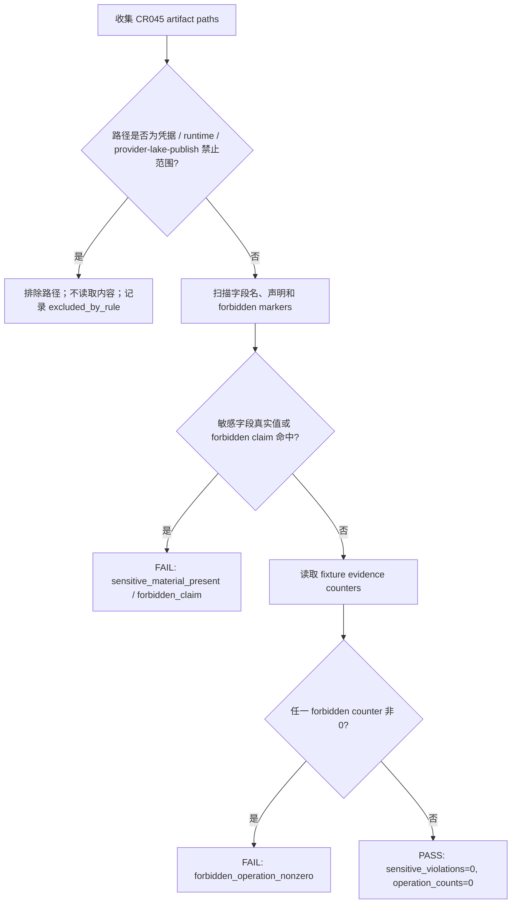

# LLD: CR045-S05 - Redaction and No-Operation Static Validation

## 0. 上游设计依据

| 来源 | 路径 / ID | 被本 LLD 消费的内容 |
|---|---|---|
| S01 LLD | `process/stories/CR045-S01-windows-bridge-security-boundary-LLD.md` | 敏感字段类别、blocked reason、forbidden operation counter baseline。 |
| S02 LLD | `process/stories/CR045-S02-bridge-health-capabilities-skeleton-LLD.md` | health/capabilities schema、false flags、operation counts。 |
| S03 LLD | `process/stories/CR045-S03-wsl-linux-client-contract-and-network-precheck-LLD.md` | WSL/Linux client 禁止 SDK/凭据/真实连接边界。 |
| S04 LLD | `process/stories/CR045-S04-readonly-probe-allowlist-and-blocked-first-LLD.md` | readonly blocked-first response、`real_readonly_verified=false`、zero counters。 |
| HLD | `docs/design/HLD-CR045-GOLDMINER-WINDOWS-BRIDGE.md` | 敏感值出现数量为 0；真实操作计数目标为 0；fixture/static only。 |
| ADR | `docs/design/ARCHITECTURE-DECISION-CR045.md` | ADR-CR045-003/004/007：零敏感值、hard-off、不得声明真实 ready/verified。 |
| Feature TEST-PLAN | `docs/features/cr045-goldminer-bridge/TEST-PLAN.md` | TP-SCOPE-05、TP-SEC-01/02/05/06、R-CR045-FD-02/03/04/05。 |
| Feature TASKS | `docs/features/cr045-goldminer-bridge/TASKS.md` | CR045-S05-T1/T2：evidence schema、artifact scan scope、zero operation counters。 |

## 1. Goal

设计 CR045 的 redaction evidence、artifact static scan 和 no-operation validation，使 CP7 能证明：真实敏感值泄漏数为 0、真实 forbidden operation counters 全 0、没有启动 Windows bridge runtime、没有导入或调用 Goldminer SDK、没有 provider/lake/publish、没有声明 real-readonly-verified。

## 2. Requirements（Functional / Non-Functional）

### 2.1 Functional

- 定义 `BridgeEvidence` / `RedactionSummary` / `OperationCounterSummary` 设计级 schema。
- 定义 artifact scan allowlist/denylist：扫描 CR045 设计和后续实现产物，显式排除 `.env`、`.env.*`、Windows credential files、token/account/password/session/cookie/private key 材料。
- 定义敏感字段类别检查：至少覆盖 S01 列出的字段类别，只输出类别、规则 ID、count、`REDACTED`。
- 定义 forbidden operation counters：至少覆盖 real broker/query/order/cancel/credential/import/provider/lake/publish/simulation/live。
- 定义 CP7 no-operation report 必备字段与失败条件。

### 2.2 Non-Functional

- 安全性：不读取凭据文件，不输出真实敏感值。
- 审计性：violations count、counter name、artifact path、rule ID 可追溯。
- 可测试性：static-only / fixture-only，可由 pytest 和人工审查组合验证。
- 最小侵入：S05 primary 只拥有 static validation test；对 S02/S04 tests 的追加需按 merge owner 协调。

## 3. 模块拆分与职责

| 模块 / 文件组 | 职责 | 说明 |
|---|---|---|
| `tests/test_cr045_goldminer_no_operation_static.py` | future primary：static validation tests | CP5 后由 S05 创建；当前只设计。 |
| `tests/test_cr045_goldminer_bridge_contract.py` | future shared：可追加 capabilities/no-operation assertions | 需要与 S02 merge owner 协调。 |
| `tests/test_cr045_goldminer_readonly_probe.py` | future shared：可追加 readonly no-operation assertions | 需要与 S04 merge owner 协调。 |
| Redaction rule set | 字段类别和 artifact scan 规则 | 不读取实际凭据材料。 |
| Operation counter validator | 验证 forbidden counters 全 0 | 消费 S01/S02/S04 response/evidence。 |
| No-operation report contract | 定义 CP7/CP8 证据字段 | 不生成 docs/quality 报告，meta-qa 后续消费。 |

## 4. 代码结构与文件影响范围

| 动作 | 文件路径 | 变更内容 |
|---|---|---|
| 创建 | `process/stories/CR045-S05-redaction-and-no-operation-static-validation-LLD.md` | 写入完整 LLD。 |
| 修改 | `process/stories/CR045-S05-redaction-and-no-operation-static-validation.md` | 状态推进到 `lld-ready-for-review`；保留 `implementation_allowed=false`。 |
| 创建 | `process/checks/CP5-CR045-S05-redaction-and-no-operation-static-validation-LLD-IMPLEMENTABILITY.md` | 写入 CP5 自动预检。 |
| 创建（CP6） | `tests/test_cr045_goldminer_no_operation_static.py` | 落地 static validation；CP5 前不创建。 |
| 可能修改（CP6） | `tests/test_cr045_goldminer_bridge_contract.py` | 追加 no-operation / false flags assertions；需 S02 merge owner 协调。 |
| 可能修改（CP6） | `tests/test_cr045_goldminer_readonly_probe.py` | 追加 readonly no-operation assertions；需 S04 merge owner 协调。 |
| 不读取 / 不修改 | `.env`、`.env.*`、Windows credential files、`reports/live`、`reports/simulation_runtime` | 禁止凭据和真实 runtime artifact。 |

## 5. 数据模型与持久化设计

无新增持久化变更。S05 设计级 evidence 可由测试中内存对象或 CP7 报告摘要承载。

| 对象 / 字段 | 类型 | 约束 | 说明 |
|---|---|---|---|
| `RedactionFinding.rule_id` | string | 稳定规则 ID，如 `secret-field-name`、`account-id-field`、`sdk-import` | 不含原始敏感值。 |
| `RedactionFinding.category` | string | S01 敏感字段类别 | 只记录类别。 |
| `RedactionFinding.count` | int | 0 表示通过；>0 表示 violation | 不记录原文。 |
| `RedactionFinding.artifact_path` | string | 仅允许仓库内非凭据产物路径 | 不扫描 `.env` 等凭据材料。 |
| `OperationCounterSummary.counter_name` | string | forbidden counter 名称 | 见第 8 节列表。 |
| `OperationCounterSummary.count` | int | CR045 L2 必须为 0 | 非 0 直接 FAIL。 |
| `BridgeEvidence.sensitive_violations` | int | 必须为 0 | CP7 安全证据。 |
| `BridgeEvidence.forbidden_operation_counts` | mapping[string,int] | 全部为 0 | CP7 no-operation 证据。 |
| `BridgeEvidence.claims` | list[string] | 不得包含 `real-readonly-verified`、`simulation_ready=true`、`live_ready=true` | CP8 文案风险控制。 |

## 6. API / Interface 设计

| 接口 / 入口 | 输入 | 输出 | 调用方 | 说明 |
|---|---|---|---|---|
| `collect_cr045_artifact_paths(project_root)` | 仓库根路径 | 非凭据 artifact path 列表 | S05 tests | 必须排除 `.env`、Windows credential files、live/simulation runtime reports；第 10 节 T-S05-01 验证。 |
| `scan_sensitive_field_names(paths)` | artifact paths | `RedactionFinding` 列表 | S05 tests / CP7 | 不读取被禁止的凭据文件；第 10 节 T-S05-02 验证。 |
| `assert_zero_forbidden_counters(evidence)` | response/evidence dict | pass/fail | S05 tests | 第 10 节 T-S05-03 验证。 |
| `scan_forbidden_runtime_claims(paths)` | artifact paths | violations | S05 tests / CP7 | 查找误声明和 forbidden operation markers；第 10 节 T-S05-04/T-S05-05 验证。 |

## 7. 核心处理流程

## 8. 技术设计细节

- 关键算法 / 规则：
  - scan 不得打开 `.env`、`.env.*`、Windows credential files 或任何明确凭据材料。
  - scan 可检查仓库内设计/实现/测试/报告文本是否出现禁止字段名、误授权声明或 runtime import/call marker。
  - 字段名检查不是凭据值检查；出现字段名未必自动失败，但真实值、未脱敏 value、或禁止路径读取必须失败。
- 依赖选择与复用点：
  - 复用 S01 敏感字段类别。
  - 消费 S02/S04 response 的 `operation_counts`。
  - 不新增依赖；测试使用标准库和 pytest。
- Forbidden operation counters 最小集合：
  - `real_broker_call`
  - `real_order_call`
  - `real_cancel_call`
  - `real_account_query`
  - `real_position_query`
  - `real_cash_query`
  - `real_order_query`
  - `real_fill_query`
  - `credential_read`
  - `goldminer_import_or_call`
  - `gmtrade_import_or_call`
  - `windows_bridge_runtime_start`
  - `provider_fetch`
  - `lake_write`
  - `catalog_publish`
  - `simulation_runtime_start`
  - `live_runtime_start`
- 兼容性处理：
  - scan path allowlist 应聚焦 CR045 story/LLD/checks/future `engine/goldminer_bridge_*` 和 `tests/test_cr045_*`，避免扫描无关历史产物造成噪音。
  - 对历史文档中的禁止项说明应允许字段名出现，但必须禁止真实值和授权性 claims。
- 图示类型选择：static validation 有排除路径、扫描、计数三段，使用流程图。

## 9. 安全与性能设计

| 维度 | 设计措施 | 验证方式 |
|---|---|---|
| 安全 | 禁止读取凭据文件；只输出字段类别/count/规则 ID；真实 operation counters 全 0。 | T-S05-01/T-S05-02/T-S05-03。 |
| 权限 | 检查 runtime、query、order、provider/lake/publish、simulation/live markers。 | T-S05-04。 |
| 审计 | 记录 scan scope、excluded paths、violation counts、counter summary。 | T-S05-06。 |
| 性能 | scope 限定 CR045 产物和未来 bridge/test 文件，避免全仓高成本扫描。 | CP6 pytest 时间；CP5 不执行。 |

## 10. 测试设计

| 测试场景 | 前置条件 | 操作 | 预期结果 | 验证方式 |
|---|---|---|---|---|
| T-S05-01 scan scope 排除凭据 | CP6 创建 static test | 收集 artifact paths | `.env`、`.env.*`、Windows credential files、live/simulation runtime reports 不被读取 | `uv run --python 3.11 pytest -q tests/test_cr045_goldminer_no_operation_static.py` |
| T-S05-02 敏感字段类别覆盖 | static rules | 检查规则集合 | 覆盖 token、secret、password、passwd、cookie、session、private_key、account_id、broker_account、real_account、trade_password、credential | 同上 |
| T-S05-03 forbidden counters 全 0 | S02/S04 fixture evidence | 校验 counter summary | 所有 forbidden counters 为 0 | 同上 |
| T-S05-04 禁止 SDK/runtime/provider markers | CR045 artifacts | scan `gm` / `gmtrade` import/call、login/connect/query/submit/cancel/provider/lake/publish markers | 无未豁免命中 | 同上 + CP7 review |
| T-S05-05 禁止误授权 claims | LLD/runbook/report artifacts | scan `real-readonly-verified`、`simulation_ready=true`、`live_ready=true` 等 | 无授权性 claim | 同上 |
| T-S05-06 CP7 evidence summary 完整 | static validation result | 生成/审查 summary | 包含 scan scope、excluded paths、violations=0、operation_counts=0、known limits | CP7 verification-execution |

## 11. 实施步骤

| TASK-ID | 动作 | 目标文件 | 详细描述 | 对应测试 |
|---|---|---|---|---|
| CR045-S05-T1 | 创建 | `process/stories/CR045-S05-redaction-and-no-operation-static-validation-LLD.md` | 设计 redaction evidence schema、artifact scan allowlist/denylist。 | T-S05-01、T-S05-02 |
| CR045-S05-T2 | 创建 | `process/stories/CR045-S05-redaction-and-no-operation-static-validation-LLD.md` | 设计 forbidden operation counters 和 zero-count assertions。 | T-S05-03、T-S05-04 |
| CR045-S05-T3 | 创建 | `process/stories/CR045-S05-redaction-and-no-operation-static-validation-LLD.md` | 设计 CP7 no-operation report evidence 字段。 | T-S05-06 |
| CR045-S05-T4 | 创建（CP6） | `tests/test_cr045_goldminer_no_operation_static.py` | 落地 static validation；CP5 前不得创建。 | T-S05-01..T-S05-06 |
| CR045-S05-T5 | 可能修改（CP6） | `tests/test_cr045_goldminer_bridge_contract.py` | 追加 no-operation/capability false assertions；需 S02 merge owner 协调。 | T-S05-03、T-S05-04 |
| CR045-S05-T6 | 可能修改（CP6） | `tests/test_cr045_goldminer_readonly_probe.py` | 追加 readonly no-operation assertions；需 S04 merge owner 协调。 | T-S05-03、T-S05-05 |
| CR045-S05-T7 | 修改 | `process/stories/CR045-S05-redaction-and-no-operation-static-validation.md` | 状态推进为 `lld-ready-for-review`；保留 `implementation_allowed=false`。 | CP5 review |
| CR045-S05-T8 | 创建 | `process/checks/CP5-CR045-S05-redaction-and-no-operation-static-validation-LLD-IMPLEMENTABILITY.md` | 写入 CP5 自动预检。 | CP5 checklist |

## 12. 风险、难点与预研建议

### 12.1 实现灰区与取舍记录

| Clarification ID | 问题 | 选项与推荐 | 决策 / 答案 | 影响面 | 证据 | 重访条件 |
|---|---|---|---|---|---|---|
| N/A | 本 Story 未新增需要用户或上游决策的问题。 | 推荐沿用 CP2/CP3 零敏感值、no-operation、fixture/static 方案；备选保存真实 payload 或读取 `.env` 已明确禁止。 | 已由 CP2/CP3 approved；无 `blocks_lld=true` 新项。 | 安全 / 测试 / 文档 / CP7 | `process/checkpoints/CP2-CR045-REQUIREMENTS-BASELINE.md`；`process/checkpoints/CP3-CR045-HLD-REVIEW.md` | 任何真实 broker payload 或敏感值保存需求出现时，停止并交回 meta-po。 |

| 风险 / 难点 | 影响 | 缓解措施 / 预研建议 |
|---|---|---|
| 扫描误读禁止项说明为违规 | 造成 false positive | 区分字段名/规则说明与真实值/授权性 claim；CP7 人工复核。 |
| 扫描范围过大 | 噪音和性能成本 | 限定 CR045 artifacts 和 future bridge/test files；明确 excluded paths。 |
| 凭据路径被误读取 | 高安全风险 | `collect_cr045_artifact_paths` 必须先过滤路径，禁止打开 `.env` 等文件。 |
| operation counter 缺失 | 无法证明 no-operation | S02/S04 response schema 必须携带 counters；缺失即 FAIL 或 BLOCKED。 |

### OPEN / Spike 跟踪

| ID | 类型（OPEN / Spike） | 问题 | 下一动作 | 责任方 |
|---|---|---|---|---|
| O-S05-01 | OPEN | CP7 最终报告格式由 meta-qa verification-execution 收敛。 | S05 只定义必备 evidence 字段；meta-qa 在 CP7 生成验证报告。 | meta-qa |

## 13. 回滚与发布策略

- 发布方式：纳入 CR045 CP5 全量设计证据；CP5 未确认前不得实现。
- 回滚触发条件：CP5 认为 static validation scope 不足、会读取凭据材料、或无法证明 no-operation。
- 回滚动作：
  - 修订 S05 LLD 和 CP5 自动预检。
  - 若需要真实 broker payload 作为验证输入，停止并交回 meta-po 发起安全/runtime gate。
  - 不创建或修改测试/代码文件直到 CP5 approved。

## 14. Definition of Done

- [x] 14 个章节全部填写完成。
- [x] redaction evidence、artifact scan、forbidden counters、CP7 evidence 字段可直接指导编码。
- [x] 每个接口和异常路径都有测试设计映射。
- [x] 未新增 clarification queue 阻断项。
- [x] CP5 前不实现，不读取凭据，不运行 runtime，不 provider/lake/publish。

## 人工确认区

> **CP5 - Story 设计证据可实现性门**
> 本 LLD 需与 CR045 全量设计证据一起统一确认；CP5 approved 前不得创建 `tests/test_cr045_goldminer_no_operation_static.py` 或修改共享测试。

**CP5 checklist 摘要**：

| # | 检查项 | 状态 | 证据 |
|---|---|---|---|
| 1 | LLD 覆盖 AC | 待检查 | 第 2 / 5 / 10 / 14 节 |
| 2 | 与 HLD / ADR 一致 | 待检查 | 第 0 / 8 / 12 节 |
| 3 | 文件影响范围明确 | 待检查 | 第 4 / 11 节 |
| 4 | 接口契约完整 | 待检查 | 第 6 节 |
| 5 | 测试与 dev_gate 可计算 | 待检查 | 第 10 / 14 节 |
| 6 | clarification queue 已收敛 | 待检查 | 第 12.1 节 |

**人工审查结果回填**：

- 结论：`approved | changes_requested | rejected`
- 审查人：
- 审查时间：
- 修改意见：
- 风险接受项：
