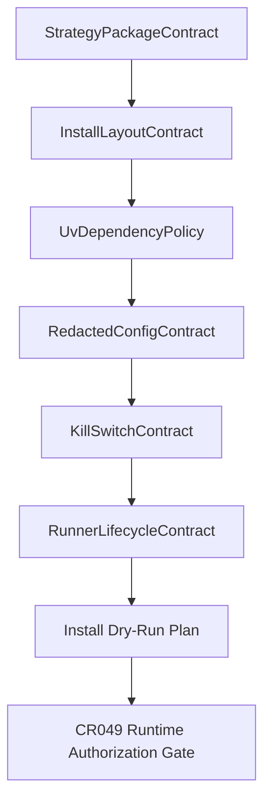

# LLD: CR046-S04 — MiniQMT runner 安装设计与运行边界

## 0. 上游设计依据

| 来源 | 路径 / ID | 被本 LLD 消费的内容 |
|---|---|---|
| HLD | `docs/design/HLD-CR046-QMT-MINIQMT-DUAL-TARGET-FRAMEWORK.md` | MiniQMT runner 只做安装设计，不真实连接 |
| ADR | `docs/design/ARCHITECTURE-DECISION-CR046.md` | ADR-CR046-004/005：runner install design-only 与后续门禁 |
| Feature DESIGN | `docs/features/qmt-miniqmt-dual-target-framework/DESIGN.md` | MiniQMTRunnerTargetContract 字段 |
| Runtime Safety | `docs/features/runtime-authorization-safety/DESIGN.md` | kill switch、fail-closed、no-real-operation |
| S02 | `process/stories/CR046-S02-strategy-package-contract-and-schema-LLD.md` | strategy package artifact、manifest、target layout |

## 1. Goal

创建并冻结 `docs/qmt/CR046-MINIQMT-RUNNER-INSTALL-DESIGN.md`，定义 MiniQMT runner 的 Windows 目录、uv 管理、依赖隔离、redacted config、日志、kill switch、upgrade/uninstall/rollback 和 install dry-run 计划。CR046 不执行真实安装、不连接 MiniQMT / XtQuant、不启动 runner。

## 2. Requirements（Functional / Non-Functional）

### 2.1 Functional

- 定义至少 6 个目录对象：install_root、package_root、config_root、log_root、evidence_root、rollback_root。
- 定义 uv 解释器、依赖声明、MiniQMT / XtQuant 依赖隔离策略。
- 定义 redacted config template，禁止真实账号、token、session、交易密码、cookie、私钥。
- 定义 start/stop/status/health/kill_switch 的未来命令合同，但 CR046 不执行。
- 定义 install dry-run、upgrade、uninstall、rollback 的设计步骤和失败行为。

### 2.2 Non-Functional

- 安全：real_install_authorized、connection_authorized、account_query_authorized、submit_cancel_authorized 全部为 false。
- 可审计：所有 install design 字段都必须能映射到 package_id、target、run_id 和 evidence path。
- 可移植：MiniQMT / XtQuant 依赖不得进入 Linux 主项目依赖。
- 可回滚：升级必须先备份旧 package，回滚必须从 rollback_root 恢复。

## 3. 模块拆分与职责

| 模块 / 文件组 | 职责 | 说明 |
|---|---|---|
| InstallLayoutContract | Windows 安装目录、包目录、日志和证据目录 | 不创建真实目录 |
| UvDependencyPolicy | Python / uv / optional dependency 策略 | 不修改主依赖 |
| RedactedConfigContract | 配置模板与敏感字段禁止规则 | 只允许占位符 |
| RunnerLifecycleContract | start/stop/status/health 未来形态 | CR046 不执行 |
| KillSwitchContract | 默认 hard-off、逐 run 授权前 fail closed | 后续 CR049 消费 |
| UpgradeRollbackContract | upgrade/uninstall/rollback 设计 | 不执行真实文件操作 |

## 4. 代码结构与文件影响范围

| 动作 | 文件路径 | 变更内容 |
|---|---|---|
| 创建 | `docs/qmt/CR046-MINIQMT-RUNNER-INSTALL-DESIGN.md` | MiniQMT runner 安装设计、依赖隔离、配置、日志、kill switch、回滚和不授权边界 |
| 创建 | `process/stories/CR046-S04-miniqmt-runner-install-and-runtime-boundary-LLD.md` | 本 LLD |

无代码文件、无脚本、无真实安装器变更。

## 5. 数据模型与持久化设计

CR046 不新增运行时持久化。新增设计层合同对象如下：

| 对象 / 字段 | 类型 | 约束 | 说明 |
|---|---|---|---|
| `install_root` | Windows path template | 必须可由用户覆盖 | 默认 `C:\local_backtest\miniqmt_runner\<package_id>` |
| `package_root` | Windows path template | 位于 install_root 下 | 解压后续策略包 |
| `config_root` | Windows path template | 只允许 redacted template | 不保存真实凭据 |
| `log_root` | Windows path template | 脱敏日志 | 不含账号、token、payload |
| `evidence_root` | Windows path template | 后续证据输出 | CR046 不写入 |
| `rollback_root` | Windows path template | 回滚备份 | CR046 不写入 |
| `runtime_flags` | object | 全部默认 false | install/connect/query/submit/cancel |
| `kill_switch` | object | default_state=`hard_off` | 无授权时 fail closed |

## 6. API / Interface 设计

| 接口 / 入口 | 输入 | 输出 | 调用方 | 说明 |
|---|---|---|---|---|
| IF-S04-01 InstallLayoutContract | package_id、target、user selected root | install layout spec | CR049 / docs | 只定义路径，不创建目录 |
| IF-S04-02 UvDependencyPolicy | runner python version、dependency group | dependency policy | CR049 | 不写入主 `pyproject.toml` |
| IF-S04-03 RedactedConfigTemplate | package_id、target placeholders | config template | CR049 / user manual | 禁止真实凭据 |
| IF-S04-04 LifecycleContract | run_id、package_id、authorization_ref | start/stop/status 未来合同 | CR049 | CR046 不执行 |
| IF-S04-05 RollbackContract | previous package ref、current package ref | rollback plan | CR049 | CR046 不执行 |

## 7. 核心处理流程

1. S02 策略包合同提供 package_id、artifact、target 信息。
2. InstallLayoutContract 定义 Windows 路径模板。
3. UvDependencyPolicy 定义 runner 环境和依赖隔离。
4. RedactedConfigContract 定义占位符配置。
5. KillSwitchContract 默认 hard-off。
6. LifecycleContract 只定义未来 start/stop/status/health 合同。
7. install dry-run 和 readonly connection 均后置 CR049。

## 8. 技术设计细节

- Windows 路径默认使用 `C:\local_backtest\miniqmt_runner\<package_id>`，但必须允许用户在 CR049 覆盖。
- uv 是唯一默认 Python 环境入口；裸 `pip install` 不能写入运行手册默认路径。
- `xtquant` / MiniQMT 相关依赖只属于 future runner target，不进入 Linux 主项目依赖。
- redacted config template 只能包含占位符和授权布尔值，不能出现真实账号、token、session、交易密码。
- kill switch 默认 `hard_off`；任何授权字段缺失、为 false 或冲突时，未来 runner 必须 fail closed。
- upgrade/uninstall/rollback 只定义步骤；CR046 不执行任何文件删除、服务停止或环境修改。

## 9. 安全与性能设计

| 维度 | 设计措施 | 验证方式 |
|---|---|---|
| 安全 | real install、connection、account query、submit/cancel 全部 false | docs guardrail / CP5 review |
| 凭据 | 配置模板只允许占位符，不读取 `.env` | redaction review |
| 隔离 | MiniQMT 依赖不进入 Linux 主依赖 | dependency review |
| 性能 | CR046 无 runtime 性能承诺 | N/A |

## 10. 测试设计

| 测试场景 | 前置条件 | 操作 | 预期结果 | 验证方式 |
|---|---|---|---|---|
| TP-S04-01 目录覆盖 | LLD 完成 | 审查 install design | 至少覆盖 6 个目录对象 | docs review |
| TP-S04-02 依赖隔离 | LLD 完成 | 审查 uv / dependency policy | MiniQMT 依赖不进入 Linux 主依赖 | docs review |
| TP-S04-03 配置脱敏 | LLD 完成 | 审查 config template | 不含真实凭据或账号 | redaction review |
| TP-S04-04 kill switch | LLD 完成 | 审查 lifecycle contract | default_state 为 hard_off | docs review |
| TP-S04-05 不授权边界 | LLD 完成 | 审查授权字段 | install/connect/query/submit/cancel 均 false | safety review |

## 11. 实施步骤

| TASK-ID | 动作 | 目标文件 | 详细描述 | 对应测试 |
|---|---|---|---|---|
| CR046-S04-T1 | 创建 | `docs/qmt/CR046-MINIQMT-RUNNER-INSTALL-DESIGN.md` | 写入 Windows 目录布局 | TP-S04-01 |
| CR046-S04-T2 | 创建 | 同上 | 写入 uv 与依赖隔离策略 | TP-S04-02 |
| CR046-S04-T3 | 创建 | 同上 | 写入 redacted config 和日志字段 | TP-S04-03 |
| CR046-S04-T4 | 创建 | 同上 | 写入 kill switch、start/stop/status 未来合同 | TP-S04-04 |
| CR046-S04-T5 | 创建 | 同上 | 写入 upgrade/uninstall/rollback 与不授权边界 | TP-S04-05 |

## 12. 风险、难点与预研建议

### 12.1 实现灰区与取舍记录

| Clarification ID | 问题 | 选项与推荐 | 决策 / 答案 | 影响面 | 证据 | 重访条件 |
|---|---|---|---|---|---|---|
| N/A | 无未回答阻断项 | N/A | 已由 CP2/CP3 确认 MiniQMT 只做 install design | N/A | STATE / CP3 | 启动 CR049 时 |

| 风险 / 难点 | 影响 | 缓解措施 / 预研建议 |
|---|---|---|
| 安装设计被误读为可执行安装脚本 | 高 | 所有文档写明 real_install_authorized=false |
| xtquant 依赖污染 Linux 主环境 | 中 | 明确依赖隔离，后续 CR049 再按 Windows runner target 管理 |
| kill switch 语义不清导致误运行 | 高 | 默认 hard-off，缺授权即 fail closed |

### OPEN / Spike 跟踪

| ID | 类型（OPEN / Spike） | 问题 | 下一动作 | 责任方 |
|---|---|---|---|---|
| O-S04-01 | OPEN | MiniQMT / XtQuant 实际安装路径、权限和 Python 版本需真实机器确认 | 后置 CR049 runtime authorization | user / CR049 |

## 13. 回滚与发布策略

- 发布方式：随 CR046 文档交付，CP8 后声明 install design ready。
- 回滚触发条件：CP5 拒绝 MiniQMT runner target 或要求取消 MiniQMT 目标。
- 回滚动作：回到 CP3 / CP4，重写 FEAT-09 和 S04/S05 依赖。
- 后续真实安装回滚：必须由 CR049 独立定义，不由 CR046 授权。

## 14. Definition of Done

- [x] 14 个章节全部填写完成
- [x] 文件影响范围、接口、测试与实施步骤可直接指导后续 CR049
- [x] 实现灰区与取舍记录已显式写明
- [x] `confirmed=false` 时不进入实现
- [x] OPEN / Spike 已清点

## 人工确认区

CP5 批次统一审查文件：`process/checkpoints/CP5-CR046-DUAL-TARGET-FRAMEWORK-BATCH-A-LLD-BATCH.md`。
