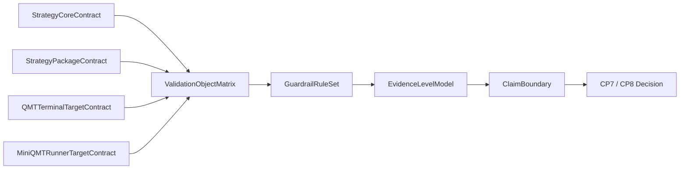

# LLD: CR046-S05 — 验证框架与证据模型

## 0. 上游设计依据

| 来源 | 路径 / ID | 被本 LLD 消费的内容 |
|---|---|---|
| HLD | `docs/design/HLD-CR046-QMT-MINIQMT-DUAL-TARGET-FRAMEWORK.md` | StrategyValidationEvidence 和 runtime_verified=false |
| ADR | `docs/design/ARCHITECTURE-DECISION-CR046.md` | ADR-CR046-004：证据分级，CR046 不声明 runtime verified |
| Feature TEST-PLAN | `docs/features/qmt-miniqmt-dual-target-framework/TEST-PLAN.md` | schema/static/fixture/manual plan 验证入口 |
| S01-S04 | `process/stories/CR046-S01..S04` | core、package、QMT target、MiniQMT target 合同 |

## 1. Goal

创建并冻结 `docs/qmt/CR046-VERIFICATION-FRAMEWORK.md`，定义 StrategyValidationEvidence 分级、验证对象、guardrail、QMT terminal shadow plan、MiniQMT install dry-run plan、失败路径和 CP7/CP8 声明边界。CR046 不做真实终端验证，不连接 MiniQMT，不声明 runtime verified。

## 2. Requirements（Functional / Non-Functional）

### 2.1 Functional

- 定义至少 6 类证据层级：schema_pass、static_guardrail_pass、fixture_dry_run_pass、qmt_terminal_shadow_plan_ready、miniqmt_install_dry_run_plan_ready、runtime_verified。
- 明确 CR046 允许前 5 类证据，禁止声明 `runtime_verified=true`。
- 为 StrategyCoreContract、StrategyPackageContract、QMTTerminalTargetContract、MiniQMTRunnerTargetContract、Documentation 定义验证入口和失败行为。
- 定义至少 6 条 guardrail 规则，覆盖 forbidden import、manifest 字段、runtime auth、redaction、submit/cancel、wording。
- 定义 QMT terminal shadow plan 与 MiniQMT install dry-run plan，但均不执行。

### 2.2 Non-Functional

- 安全：所有真实运行、连接、账户查询、submit/cancel、simulation/live 计数为 0。
- 可审计：每类证据必须说明含义、允许状态和是否等于 runtime verified。
- 可回滚：任何 runtime claim 误写都必须回到 CP5/CP7 修正文档。
- 可扩展：后续 CR047 / CR049 可补充 runtime_verified 证据，但必须独立授权。

## 3. 模块拆分与职责

| 模块 / 文件组 | 职责 | 说明 |
|---|---|---|
| EvidenceLevelModel | 定义证据层级与允许状态 | runtime_verified 在 CR046 unavailable |
| ValidationObjectMatrix | 定义各对象验证入口与失败行为 | 覆盖 S01-S04 |
| GuardrailRuleSet | 定义静态与文档 guardrail | 防止误授权 |
| QMTShadowPlan | 定义 QMT terminal 后续人工 shadow plan | 不执行 |
| MiniQMTDryRunPlan | 定义 MiniQMT install dry-run 后续计划 | 不安装、不连接 |
| ClaimBoundary | 定义 CP7/CP8 可声明和禁止声明 | 防止 trade-ready 误读 |

## 4. 代码结构与文件影响范围

| 动作 | 文件路径 | 变更内容 |
|---|---|---|
| 创建 | `docs/qmt/CR046-VERIFICATION-FRAMEWORK.md` | 验证框架、证据模型、guardrail、manual plan、声明边界 |
| 创建 | `process/stories/CR046-S05-verification-framework-and-evidence-model-LLD.md` | 本 LLD |

无代码文件、无测试脚本、无 runtime 执行。

## 5. 数据模型与持久化设计

CR046 不新增运行时持久化。新增设计层证据模型如下：

| 字段 | 类型 | CR046 状态 | 说明 |
|---|---|---|---|
| `schema_pass` | bool/evidence ref | allowed | manifest 和合同字段完整 |
| `static_guardrail_pass` | bool/evidence ref | allowed | forbidden import / submit / credential 文档检查计划 |
| `fixture_dry_run_pass` | bool/evidence ref | allowed | fixture 合同映射计划 |
| `qmt_terminal_shadow_plan_ready` | bool/evidence ref | allowed | 后续人工 shadow 计划可读 |
| `miniqmt_install_dry_run_plan_ready` | bool/evidence ref | allowed | 后续 install dry-run 计划可读 |
| `runtime_verified` | bool/evidence ref | unavailable | 必须为 false / unavailable |
| `claim_boundary` | object | required | 可声明与禁止声明列表 |

## 6. API / Interface 设计

| 接口 / 入口 | 输入 | 输出 | 调用方 | 说明 |
|---|---|---|---|---|
| IF-S05-01 EvidenceLevelModel | package/target validation result refs | evidence level summary | CP7 / CP8 | 不产生 runtime verified |
| IF-S05-02 GuardrailRuleSet | docs、manifest、target contracts | pass/fail plan | CP5 / CP7 | 规则失败即阻断 |
| IF-S05-03 QMTShadowPlan | QMT terminal target contract | manual shadow plan | CR048 | CR046 不执行 |
| IF-S05-04 MiniQMTDryRunPlan | MiniQMT runner target contract | install dry-run plan | CR049 | CR046 不执行 |
| IF-S05-05 ClaimBoundary | evidence levels | allowed / forbidden claims | CP8 | 防止 qmt_ready / trade_ready 误写 |

## 7. 核心处理流程

1. S01-S04 的合同对象进入验证对象矩阵。
2. GuardrailRuleSet 检查字段、授权、凭据、wording 和禁止动作。
3. EvidenceLevelModel 只允许 schema/static/fixture/manual plan 级别。
4. ClaimBoundary 把可声明项限制为 framework / plan ready，不允许 qmt_ready、trade_ready、runtime_verified=true。

## 8. 技术设计细节

- `runtime_verified` 是保留字段，不是 CR046 交付结果；它的状态必须是 unavailable / false。
- `fixture_dry_run_pass` 只代表本地 fixture 映射计划，不代表 QMT / MiniQMT 实机运行。
- `qmt_terminal_shadow_plan_ready` 只代表人工验证步骤存在，不代表已导入 QMT。
- `miniqmt_install_dry_run_plan_ready` 只代表安装 dry-run 计划存在，不代表已安装 runner。
- 文档 guardrail 应覆盖“ready”“verified”“trade-ready”等可能误导词。
- 后续 CR047 / CR048 / CR049 如需提升证据等级，必须新建 CR 或独立 runtime_authorization gate。

## 9. 安全与性能设计

| 维度 | 设计措施 | 验证方式 |
|---|---|---|
| 安全 | runtime_verified=false，真实运行计数为 0 | CP5 / CP7 review |
| 凭据 | guardrail 禁止真实账号、token、session | redaction review |
| 授权 | 所有 runtime 授权字段默认 false | safety review |
| 性能 | 无 runtime 性能承诺 | N/A |

## 10. 测试设计

| 测试场景 | 前置条件 | 操作 | 预期结果 | 验证方式 |
|---|---|---|---|---|
| TP-S05-01 证据层级完整 | LLD 完成 | 审查 evidence model | 至少 6 类证据存在 | docs review |
| TP-S05-02 runtime claim 禁止 | LLD 完成 | 审查 CP7/CP8 声明边界 | runtime_verified 不可为 true | wording guardrail |
| TP-S05-03 target 覆盖 | S01-S04 完成 | 审查验证对象 | core/package/QMT/MiniQMT/docs 均覆盖 | docs review |
| TP-S05-04 失败路径 | LLD 完成 | 审查失败矩阵 | 缺字段、真实授权、凭据、runtime claim 均 fail closed | safety review |
| TP-S05-05 后续计划边界 | LLD 完成 | 审查 QMT/MiniQMT plan | plan 存在但不执行 | docs review |

## 11. 实施步骤

| TASK-ID | 动作 | 目标文件 | 详细描述 | 对应测试 |
|---|---|---|---|---|
| CR046-S05-T1 | 创建 | `docs/qmt/CR046-VERIFICATION-FRAMEWORK.md` | 写入 StrategyValidationEvidence 分级 | TP-S05-01 |
| CR046-S05-T2 | 创建 | 同上 | 写入验证对象和 guardrail | TP-S05-03 / TP-S05-04 |
| CR046-S05-T3 | 创建 | 同上 | 写入 QMT shadow plan 与 MiniQMT install dry-run plan | TP-S05-05 |
| CR046-S05-T4 | 创建 | 同上 | 写入 CP7/CP8 声明边界 | TP-S05-02 |

## 12. 风险、难点与预研建议

### 12.1 实现灰区与取舍记录

| Clarification ID | 问题 | 选项与推荐 | 决策 / 答案 | 影响面 | 证据 | 重访条件 |
|---|---|---|---|---|---|---|
| N/A | 无未回答阻断项 | N/A | 已由 CP3 DQ-CP3-CR046-04 确认不声明 runtime verified | N/A | CP3 checkpoint / STATE | 后续 runtime CR |

| 风险 / 难点 | 影响 | 缓解措施 / 预研建议 |
|---|---|---|
| schema/static/fixture 被误读为实机验证 | 高 | EvidenceLevelModel 明确是否等于 runtime verified |
| QMT shadow plan 被误读为已运行 | 高 | plan_ready 与 executed 分离 |
| 后续 CR 缺少证据升级路径 | 中 | 保留 runtime_verified 字段但标记 unavailable |

### OPEN / Spike 跟踪

| ID | 类型（OPEN / Spike） | 问题 | 下一动作 | 责任方 |
|---|---|---|---|---|
| O-S05-01 | OPEN | 真实 QMT / MiniQMT runtime evidence schema 需等后续真实运行授权后冻结 | 后置 CR048 / CR049 | user / future CR |

## 13. 回滚与发布策略

- 发布方式：随 CR046 文档交付，CP8 后声明 verification framework ready。
- 回滚触发条件：CP5 发现 evidence wording 可能误导为 runtime verified。
- 回滚动作：修改验证框架和所有下游声明，重新发起 CP5。
- 后续 runtime evidence 升级必须另起 CR，不由 CR046 回滚策略覆盖。

## 14. Definition of Done

- [x] 14 个章节全部填写完成
- [x] 文件影响范围、接口、测试与实施步骤可直接指导 CP7/CP8 验证
- [x] 实现灰区与取舍记录已显式写明
- [x] `confirmed=false` 时不进入实现
- [x] OPEN / Spike 已清点

## 人工确认区

CP5 批次统一审查文件：`process/checkpoints/CP5-CR046-DUAL-TARGET-FRAMEWORK-BATCH-A-LLD-BATCH.md`。
