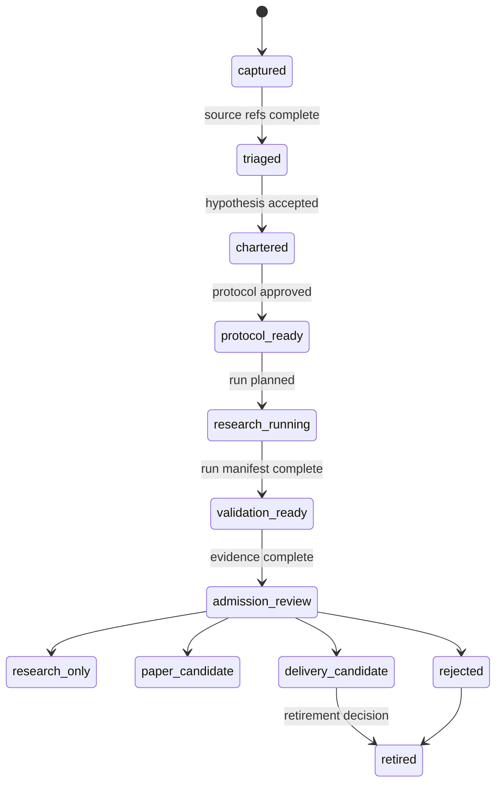

# LLD: CR051-S01 — 策略研究生命周期与 taxonomy 框架

## 0. 上游设计依据

| 来源 | 路径 / ID | 被本 LLD 消费的内容 |
|---|---|---|
| HLD | `docs/design/HLD-CR051-STRATEGY-RESEARCH-LIFECYCLE-FRAMEWORK.md` §7 / §8 / §10 | 生命周期状态机、策略 taxonomy、后续 CR 路线 |
| Feature Matrix | `docs/design/FEATURE-DESIGN-MATRIX.md` FEAT-10 / CR051-S01 | full-lld 判定、Story 下游消费表 |
| Feature DESIGN | `docs/features/strategy-research-lifecycle/DESIGN.md` | InformationSource、StrategyIdea、ResearchProject、ResearchProtocol、ResearchRun、ValidationEvidence |
| Feature TEST-PLAN | `docs/features/strategy-research-lifecycle/TEST-PLAN.md` | TC-CR051-01、TC-CR051-06、SEC-TC-03 |
| CP5 Context | `process/context/CP5-CR051-LLD-CONTEXT.yaml` | 不授权项、批次范围和 CP4 摘要 |

## 1. Goal

创建 `docs/research/LIFECYCLE.md` 和 `docs/research/STRATEGY-TAXONOMY.md`，冻结从信息源、策略想法、研究项目、研究协议、研究运行、验证证据到 `delivery_candidate` 的状态机和策略族分类规则。

## 2. Requirements（Functional / Non-Functional）

### 2.1 Functional

- 定义不少于 10 个生命周期阶段：`captured`、`triaged`、`chartered`、`protocol_ready`、`research_running`、`validation_ready`、`admission_review`、`research_only`、`paper_candidate`、`delivery_candidate`、`rejected`、`retired`。
- 定义首版不少于 8 类策略 taxonomy：多因子、事件型、择时、技术型、统计套利、机器学习、组合优化 / 增强指数、tick / 高频 Spike。
- 明确 `delivery_candidate` 只表示研究交付候选，不等于 `runtime_candidate`、simulation-ready、live-ready 或 trade-ready。
- 为后续 CR052..CR056 提供统一进入条件和重访条件。

### 2.2 Non-Functional

- 可追溯：每个状态转换必须可追溯到 source、protocol、run manifest 或 validation evidence。
- 可扩展：新增策略族不得修改生命周期主状态机，只扩展 taxonomy entry。
- 安全：文档不得授权 provider/lake/publish、QMT/MiniQMT、交易、凭据读取或 NAS 操作。
- 可测试：状态转换和 claim boundary 可通过静态文档 / schema 检查验证。

## 3. 模块拆分与职责

| 模块 / 文件组 | 职责 | 说明 |
|---|---|---|
| `docs/research/LIFECYCLE.md` | 生命周期状态机、对象关系、转换条件、失败路径 | 本 Story primary owner |
| `docs/research/STRATEGY-TAXONOMY.md` | 策略族分类、字段、扩展规则、适用后续 CR | 本 Story primary owner |
| `docs/features/strategy-research-lifecycle/*` | Feature 级约束来源 | 只读消费，不在实现阶段改写 |
| `process/changes/CR-051-*.md` | 后续 CR 路线来源 | 由 S05 负责更新，本 Story 不直接修改 |

## 4. 代码结构与文件影响范围

| 动作 | 文件路径 | 变更内容 |
|---|---|---|
| 创建 | `docs/research/LIFECYCLE.md` | 生命周期状态表、转换表、claim boundary、失败路径和不授权项 |
| 创建 | `docs/research/STRATEGY-TAXONOMY.md` | strategy_family、timeframe、data_dependency、execution_dependency、risk_class、后续 CR 映射 |

## 5. 数据模型与持久化设计

| 对象 / 字段 | 类型 | 约束 | 说明 |
|---|---|---|---|
| `InformationSource.source_id` | string | 唯一、不可为空 | 信息来源索引；原文附件可在 archive，Git 只存摘要 |
| `StrategyIdea.idea_id` | string | 唯一、不可为空 | 策略想法主键 |
| `ResearchProject.project_id` | string | 唯一、不可为空 | 立项后的研究项目主键 |
| `ResearchProtocol.protocol_id` | string | 可版本化 | 固定 universe、data release、metric suite、cost model |
| `ResearchRun.run_id` | string | 必须引用 commit / data_release / config_hash | 后续 S04 定义 manifest 字段 |
| `ValidationEvidence.evidence_id` | string | 必须区分 research / runtime claim level | 不得把 fixture/static pass 写成 runtime verified |
| `StrategyTaxonomyEntry.strategy_family` | enum | 首版 8 类 | 可扩展，但扩展必须有 owner 和重访条件 |

本 Story 不新增代码持久化实现，只定义文档合同。

## 6. API / Interface 设计

| 接口 / 入口 | 输入 | 输出 | 调用方 | 说明 |
|---|---|---|---|---|
| IF-S01-01 idea intake | source refs、hypothesis、family_hint、expected_edge | StrategyIdea draft | 后续 CR052 / 研究者 | 缺 source 时返回 `missing_source` |
| IF-S01-02 project charter | idea_id、objective、success_criteria、scope | ResearchProject chartered | 后续 CR052 | success_criteria 必须可验证 |
| IF-S01-03 lifecycle promotion | current_state、evidence_refs、claim_boundary | next_state 或 blocked reason | registry / admission review | 不满足证据时 fail closed |
| IF-S01-04 taxonomy lookup | strategy_family、data_dependency、execution_dependency | taxonomy entry | protocol / roadmap | 未知策略族标记为 `taxonomy_extension_required` |

## 7. 核心处理流程

1. 记录 InformationSource，仅保存来源摘要、使用边界和引用，不保存敏感原文。
2. 创建 StrategyIdea，绑定 source refs、hypothesis、family_hint 和 failure_mode。
3. Triage 后进入 ResearchProject，写 objective、success criteria、scope 和 owner。
4. ResearchProtocol ready 后允许研究运行；缺 data release 或 metric suite 时 blocked。
5. ResearchRun 完成并形成 ValidationEvidence 后进入 admission_review。
6. Admission review 根据 evidence 和 blocked claims 只能输出 `research_only`、`paper_candidate`、`delivery_candidate`、`rejected` 或 `retired`。

## 8. 技术设计细节

- 关键规则：生命周期主状态机稳定，策略类型通过 taxonomy 扩展，不通过新状态扩散。
- 依赖选择与复用点：复用 FEAT-03 的 StrategyAdmissionPackage 和 FEAT-09 的 StrategyCoreContract 概念，但不在本 Story 实现转换器。
- 兼容性处理：历史多因子研究成果可登记为 `legacy_research_project`，不强制补齐全部 lifecycle 字段；进入后续 CR052 时再补齐。
- 图示类型选择：状态图，用于明确合法转换。

## 9. 安全与性能设计

| 维度 | 设计措施 | 验证方式 |
|---|---|---|
| 安全 | `delivery_candidate` 必须声明不是 runtime/trade-ready；禁止 runtime 授权措辞 | SEC-TC-03、文档 review |
| 敏感信息 | InformationSource 只记录摘要和 usage boundary，不保存凭据 / 账户 / token | SEC-TC-01 |
| 性能 | 本 Story 只创建文档，无运行性能影响 | N/A |
| 可维护性 | taxonomy 扩展使用表格追加，避免修改主状态机 | TC-CR051-01 |

## 10. 测试设计

| 测试场景 | 前置条件 | 操作 | 预期结果 | 验证方式 |
|---|---|---|---|---|
| 生命周期状态机完整 | `LIFECYCLE.md` 已生成 | 检查状态和合法转换 | 覆盖 10+ 状态，非法升级有 blocked reason | TC-CR051-01 |
| delivery claim boundary | 存在 `delivery_candidate` 描述 | 扫描 runtime/trade-ready 声明 | 不出现 runtime verified / trade-ready 混用 | SEC-TC-03 |
| taxonomy 首版覆盖 | `STRATEGY-TAXONOMY.md` 已生成 | 检查策略族表 | 至少 8 类策略族且有后续 CR 映射 | 手工 review |
| Story 完整性 | Story / LLD / Matrix | 检查 feature refs 和 lld_policy | S01 证据可追溯 | TC-CR051-06 |

## 11. 实施步骤

| TASK-ID | 动作 | 目标文件 | 详细描述 | 对应测试 |
|---|---|---|---|---|
| TASK-CR051-001 | 创建 | `docs/research/LIFECYCLE.md` | 写生命周期阶段、状态转换、claim boundary、失败路径和不授权项 | TC-CR051-01、SEC-TC-03 |
| TASK-CR051-002 | 创建 | `docs/research/STRATEGY-TAXONOMY.md` | 写首版 8 类策略族、字段、扩展规则和后续 CR 映射 | TC-CR051-01 |

## 12. 风险、难点与预研建议

### 12.1 实现灰区与取舍记录

| Clarification ID | 问题 | 选项与推荐 | 决策 / 答案 | 影响面 | 证据 | 重访条件 |
|---|---|---|---|---|---|---|
| N/A | 无阻断 clarification | N/A | CP2 / CP3 已批准主范围和命名策略 | 无 | CP2 / CP3 checkpoints | 后续 CR052 启动时重访 |

| 风险 / 难点 | 影响 | 缓解措施 / 预研建议 |
|---|---|---|
| taxonomy 过度设计 | 后续实现成本上升 | 首版只定义必要字段和扩展点，具体策略证明放 CR052+ |
| delivery_candidate 被误读 | 可能引发未经授权运行 | 在 lifecycle 和 taxonomy 文档中重复声明不等于 runtime_candidate |

### OPEN / Spike 跟踪

| ID | 类型（OPEN / Spike） | 问题 | 下一动作 | 责任方 |
|---|---|---|---|---|
| N/A | N/A | 无阻断 OPEN / Spike | N/A | N/A |

## 13. 回滚与发布策略

- 发布方式：随 CR051 文档实现提交到 Git，不执行运行发布。
- 回滚触发条件：CP5 要求修改 lifecycle 范围、taxonomy 范围或 claim boundary。
- 回滚动作：回退 `docs/research/LIFECYCLE.md` / `STRATEGY-TAXONOMY.md` 的对应提交；不触碰外部 archive 或运行环境。

## 14. Definition of Done

- [ ] `docs/research/LIFECYCLE.md` 覆盖状态机、转换条件、失败路径和不授权项。
- [ ] `docs/research/STRATEGY-TAXONOMY.md` 覆盖首版 8 类策略族。
- [ ] `delivery_candidate` 与 `runtime_candidate` / trade-ready 的边界明确。
- [ ] CP5 自动预检 PASS 且人工确认前 `confirmed=false`。

## 人工确认区

**CP5 — Story 设计证据可实现性门**

- 结论：`pending`
- 审查人：
- 审查时间：
- 修改意见：
- 风险接受项：
