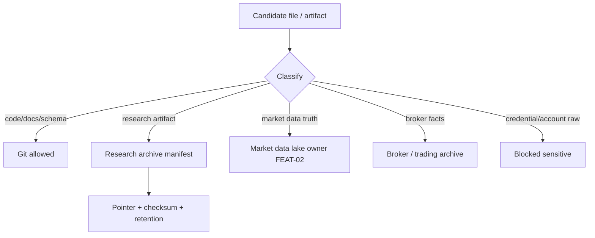

# LLD: CR051-S02 — 仓库、研究归档与数据湖边界治理

## 0. 上游设计依据

| 来源 | 路径 / ID | 被本 LLD 消费的内容 |
|---|---|---|
| HLD | `docs/design/HLD-CR051-STRATEGY-RESEARCH-LIFECYCLE-FRAMEWORK.md` §5 / §6 / §13 | 仓库拓扑、迁移目标结构、硬件冷热分层、风险 |
| Dependency Map | `docs/design/DEPENDENCY-MAP.md` FD-17..23 | 禁止 provider/lake/publish、NAS 真实操作、Git 存大 artifact |
| Feature DESIGN | `docs/features/strategy-research-lifecycle/DESIGN.md` | 推荐结构、ResearchArchiveManifest、ArchivePointer |
| Feature TEST-PLAN | `docs/features/strategy-research-lifecycle/TEST-PLAN.md` | TC-CR051-02、TC-CR051-03、SEC-TC-01、SEC-TC-02 |
| CP5 Context | `process/context/CP5-CR051-LLD-CONTEXT.yaml` | 不授权项和 real operation counters |

## 1. Goal

创建 `docs/research/ARCHIVE-GOVERNANCE.md` 和 `docs/research/RESEARCH-ARCHIVE-MANIFEST-SPEC.md`，冻结 Git 仓库、research archive、market data lake、broker lake、strategy package exchange 与当前硬件冷热分层的边界。

## 2. Requirements（Functional / Non-Functional）

### 2.1 Functional

- 明确 Git 只保存代码、docs、schema、manifest spec、redacted summary 和小型 fixture。
- 明确 `RESEARCH_ARCHIVE_ROOT`、`RESEARCH_HOT_CACHE_ROOT`、`RESEARCH_COLD_ARCHIVE_ROOT`、`MARKET_DATA_LAKE_ROOT`、`BROKER_LAKE_ROOT` / trading archive 的职责。
- 定义 ResearchArchiveManifest 字段集：archive_id、storage_tier、logical_type、artifact_refs、checksum、retention_policy、redaction_status、owner、rollback_ref。
- 定义冷热分层默认策略：研究主机 2T SSD、NAS 512G SSD、NAS 4T RAID、NAS 14T HDD、交易主机 512G SSD。

### 2.2 Non-Functional

- 安全：不得在 Git、research archive 或 docs 中保存凭据、账户原文、broker facts 原文。
- 可恢复：每个 external artifact 必须有 pointer、checksum 和 rollback_ref。
- 可配置：所有真实路径均通过环境变量 / 配置表达，不在 Git 写死私有挂载路径。
- 不执行：本 Story 只定义合同，不扫描、不挂载、不复制、不删除、不迁移 NAS。

## 3. 模块拆分与职责

| 模块 / 文件组 | 职责 | 说明 |
|---|---|---|
| `docs/research/ARCHIVE-GOVERNANCE.md` | 存储域职责、禁止内容、冷热分层、水位、迁移前置条件 | 本 Story primary owner |
| `docs/research/RESEARCH-ARCHIVE-MANIFEST-SPEC.md` | archive manifest schema、pointer、checksum、retention、redaction | 本 Story primary owner |
| `docs/research/HOST-WORKFLOW.md` | 主机文件流 | S03 owner，本 Story只提供上游合同 |
| `docs/research/RESEARCH-REGISTRY-SPEC.md` | registry 字段细化 | S04 owner，本 Story提供 manifest 基础字段 |

## 4. 代码结构与文件影响范围

| 动作 | 文件路径 | 变更内容 |
|---|---|---|
| 创建 | `docs/research/ARCHIVE-GOVERNANCE.md` | 存储边界、冷热分层、禁止内容、迁移前置授权 |
| 创建 | `docs/research/RESEARCH-ARCHIVE-MANIFEST-SPEC.md` | archive manifest schema、字段约束、错误模型 |

## 5. 数据模型与持久化设计

| 对象 / 字段 | 类型 | 约束 | 说明 |
|---|---|---|---|
| `ResearchArchiveManifest.archive_id` | string | 唯一、不可为空 | 研究归档单元 ID |
| `storage_tier` | enum | `workspace_hot` / `nas_hot` / `nas_warm` / `nas_cold` / `trading_local` | 只表达逻辑层，不写死真实路径 |
| `logical_type` | enum | `run_artifact` / `report` / `model` / `source_attachment` / `package_exchange` | 决定 owner 和 retention |
| `artifact_refs[]` | list | 只存 external pointer / relative path | 不保存 artifact 内容 |
| `checksum.sha256` | string | artifact 可用时必填 | 支持恢复和传输校验 |
| `retention_policy` | string | 必填 | 例：active、important、cold、expire-review |
| `redaction_status` | enum | `n/a` / `redacted` / `blocked-sensitive` | 敏感信息不得进 Git |
| `rollback_ref` | string | 迁移类必填 | 指向 Git commit 或 inventory entry |

本 Story不实现物理持久化；manifest spec 作为后续 S04 和 CR053 输入。

## 6. API / Interface 设计

| 接口 / 入口 | 输入 | 输出 | 调用方 | 说明 |
|---|---|---|---|---|
| IF-S02-01 archive classify | file class、size、sensitivity、owner | storage tier / forbidden reason | migration inventory | 大文件或敏感事实不得进入 Git |
| IF-S02-02 manifest register | artifact pointer、checksum、retention | ResearchArchiveManifest entry | registry / run archiver | 缺 checksum 时返回 `checksum_missing` |
| IF-S02-03 lake boundary check | data ref、dataset release、archive ref | allowed / blocked | research protocol | market data current truth 只能来自 FEAT-02 |
| IF-S02-04 broker facts boundary | broker fact ref、redaction status | blocked / broker archive route | trading evidence | broker facts 不进入 research archive |

## 7. 核心处理流程

1. 对待归档对象执行分类：Git 保留、research archive、market data lake、broker archive、trading local、blocked-sensitive。
2. 对 research archive 对象选择 storage tier：workspace hot、NAS hot、NAS warm、NAS cold。
3. 生成 manifest pointer、checksum、retention policy 和 rollback ref。
4. Registry 消费 manifest summary；Git 只保存 schema / pointer / redacted summary。
5. 任何需要真实 NAS 操作的步骤必须在后续授权 gate 中执行，本 Story 只记录 dry-run contract。

## 8. 技术设计细节

- 关键规则：research archive 是研究证据仓，不是 market data current truth，也不是 broker facts store。
- 依赖选择与复用点：复用现有 `MARKET_DATA_LAKE_ROOT` 概念，不改 FEAT-02 publish gate；broker facts 仍由 FEAT-06 / 后续交易 CR 管理。
- 兼容性处理：现有 `process/research/*` 可暂作为历史摘要保留；大 artifact 是否迁出由后续 inventory 判定。
- 图示类型选择：流程图，展示分类和禁止路径。

## 9. 安全与性能设计

| 维度 | 设计措施 | 验证方式 |
|---|---|---|
| 安全 | credentials / account / broker raw facts 分类为 blocked-sensitive 或 broker archive | SEC-TC-01 |
| 权限 | CP5 前不执行 NAS / archive / lake 操作 | SEC-TC-02 |
| 性能 | NAS 512G SSD 只做热层，4T RAID 做主 archive，14T HDD 做冷归档 | TC-CR051-03 |
| 可恢复 | 每个 external artifact 必须有 checksum 和 rollback_ref | TC-CR051-02 |

## 10. 测试设计

| 测试场景 | 前置条件 | 操作 | 预期结果 | 验证方式 |
|---|---|---|---|---|
| archive/lake/broker 隔离 | archive governance 文档已生成 | 检查三类事实域定义 | 三者 owner 和禁止内容分离 | TC-CR051-02 |
| 硬件冷热分层 | governance 文档已生成 | 检查五类设备职责 | 交易主机只消费 package；NAS 分热/温/冷 | TC-CR051-03 |
| Git 禁止内容 | manifest spec 已生成 | 扫描禁止列表 | raw data、大 artifact、凭据、broker facts 均禁止进入 Git | SEC-TC-01 |
| 未授权 NAS 操作 | CP5 产物 review | 检查是否出现执行命令 | 不出现 mount/copy/delete/migration 执行步骤 | SEC-TC-02 |

## 11. 实施步骤

| TASK-ID | 动作 | 目标文件 | 详细描述 | 对应测试 |
|---|---|---|---|---|
| TASK-CR051-003 | 创建 | `docs/research/ARCHIVE-GOVERNANCE.md` | 写存储域职责、冷热分层、禁止内容、水位和授权边界 | TC-CR051-02、TC-CR051-03、SEC-TC-02 |
| TASK-CR051-004 | 创建 | `docs/research/RESEARCH-ARCHIVE-MANIFEST-SPEC.md` | 写 manifest 字段、错误模型、redaction 和 rollback_ref | TC-CR051-02、SEC-TC-01 |

## 12. 风险、难点与预研建议

### 12.1 实现灰区与取舍记录

| Clarification ID | 问题 | 选项与推荐 | 决策 / 答案 | 影响面 | 证据 | 重访条件 |
|---|---|---|---|---|---|---|
| N/A | 无阻断 clarification | N/A | CP3 已确认硬件分层和不授权边界 | 文件 owner / 安全 | CP3 checkpoint | 真实迁移或 NAS 操作启动时重访 |

| 风险 / 难点 | 影响 | 缓解措施 / 预研建议 |
|---|---|---|
| archive 和 lake 边界混淆 | current truth 可能被污染 | 文档中强制 FEAT-02 publish gate 是唯一 current truth |
| 后续迁移误触 NAS | 数据泄露或误删 | 后续必须先 inventory、dry-run、授权，再执行 |

### OPEN / Spike 跟踪

| ID | 类型（OPEN / Spike） | 问题 | 下一动作 | 责任方 |
|---|---|---|---|---|
| N/A | N/A | 无阻断 OPEN / Spike | N/A | N/A |

## 13. 回滚与发布策略

- 发布方式：随 CR051 文档实现提交到 Git。
- 回滚触发条件：CP5 要求修改 archive 边界、storage tier 或 manifest 字段。
- 回滚动作：回退本 Story 输出文档；不删除、不移动、不修改任何外部 archive 或 NAS 文件。

## 14. Definition of Done

- [ ] `ARCHIVE-GOVERNANCE.md` 明确 Git / research archive / market data lake / broker archive / package exchange 边界。
- [ ] `RESEARCH-ARCHIVE-MANIFEST-SPEC.md` 定义最小字段和错误模型。
- [ ] 文档明确 CP5 不授权 NAS 操作、lake write、broker write、provider fetch。
- [ ] CP5 自动预检 PASS 且人工确认前 `confirmed=false`。

## 人工确认区

**CP5 — Story 设计证据可实现性门**

- 结论：`pending`
- 审查人：
- 审查时间：
- 修改意见：
- 风险接受项：
