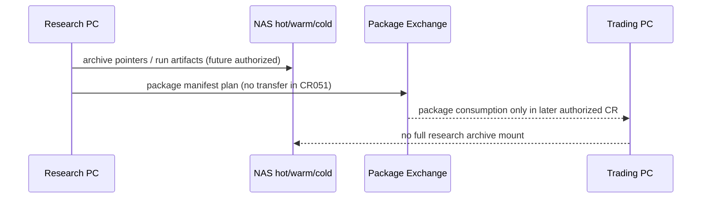

# LLD: CR051-S03 — 研究主机与交易主机工作流边界

## 0. 上游设计依据

| 来源 | 路径 / ID | 被本 LLD 消费的内容 |
|---|---|---|
| HLD | `docs/design/HLD-CR051-STRATEGY-RESEARCH-LIFECYCLE-FRAMEWORK.md` §6 | 研究主机、NAS、交易主机职责 |
| S02 LLD | `process/stories/CR051-S02-repository-archive-and-data-lake-governance-LLD.md` | storage tier 和 archive boundary |
| S06 technical-note | `process/stories/CR051-S06-project-identity-rename-and-legacy-alias.md#技术说明` | `quant-lab` / `local_backtest` alias policy |
| Feature DESIGN | `docs/features/strategy-research-lifecycle/DESIGN.md` | 推荐结构和 host roles |
| Feature TEST-PLAN | `docs/features/strategy-research-lifecycle/TEST-PLAN.md` | TC-CR051-03、SEC-TC-05 |

## 1. Goal

创建 `docs/research/HOST-WORKFLOW.md`，冻结主力研究主机、NAS 热 / 温 / 冷层、交易主机之间的职责、文件流、package exchange 和禁止路径。

## 2. Requirements（Functional / Non-Functional）

### 2.1 Functional

- 研究主机 2T SSD：承载完整 Git checkout、开发环境、active workspace、近期 run/cache。
- NAS 512G SSD：承载热缓存、package exchange、manifest index。
- NAS 4T RAID：承载 `RESEARCH_ARCHIVE_ROOT` 主体。
- NAS 14T HDD：承载 cold archive / backups。
- 交易主机 512G SSD：只消费 strategy package / checksum / manifest / docs bundle 和小型运行证据。

### 2.2 Non-Functional

- 安全：交易主机默认不 clone 完整研究仓库，不挂 full research archive，不运行研究脚本。
- 可配置：路径以环境变量或配置表达，不写死 NAS 私有挂载。
- 可审计：任何 package 进入交易主机必须经过 checksum 和 manifest。
- 不执行：本 Story 不传输 package、不连接 MiniQMT/QMT、不启动 runtime。

## 3. 模块拆分与职责

| 模块 / 文件组 | 职责 | 说明 |
|---|---|---|
| `docs/research/HOST-WORKFLOW.md` | 主机职责、文件流、package exchange、禁止路径 | 本 Story primary owner |
| `docs/research/ARCHIVE-GOVERNANCE.md` | storage tier 上游合同 | S02 owner，本 Story只读消费 |
| `docs/research/PROJECT-IDENTITY-MIGRATION.md` | canonical name / alias 上游合同 | S06 owner，本 Story只读消费 |

## 4. 代码结构与文件影响范围

| 动作 | 文件路径 | 变更内容 |
|---|---|---|
| 创建 | `docs/research/HOST-WORKFLOW.md` | 研究主机、NAS、交易主机职责矩阵、文件流、package exchange、失败路径 |

## 5. 数据模型与持久化设计

| 对象 / 字段 | 类型 | 约束 | 说明 |
|---|---|---|---|
| `HostRole.host_id` | enum | `research_pc` / `nas_hot` / `nas_warm` / `nas_cold` / `trading_pc` | 逻辑角色，不保存真实主机名 |
| `PackageExchange.package_id` | string | 必须匹配 manifest | 后续 CR047+ 使用 |
| `PackageExchange.checksum_sha256` | string | 必填 | 交易主机消费前校验 |
| `PackageExchange.transfer_status` | enum | `planned` / `staged` / `verified` / `blocked` | CR051 只允许 planned |
| `HostBoundary.forbidden_actions[]` | list | 必填 | 标记交易主机禁止研究 archive / runtime |

本 Story不新增代码持久化实现。

## 6. API / Interface 设计

| 接口 / 入口 | 输入 | 输出 | 调用方 | 说明 |
|---|---|---|---|---|
| IF-S03-01 package staging plan | package manifest、checksum、target host role | transfer plan / blocked reason | 后续 CR047 / CR049 | CR051 只允许 plan，不执行传输 |
| IF-S03-02 host role check | path purpose、host role、artifact class | allowed / forbidden | migration inventory | 交易主机遇 research archive 返回 forbidden |
| IF-S03-03 evidence return | runtime evidence summary、redaction status | archive route | 后续 runtime CR | 未脱敏 runtime evidence 不回写 Git |

## 7. 核心处理流程

1. 研究主机生成研究代码、docs、manifest spec 和候选 package 输入。
2. NAS hot / warm / cold 按 S02 archive governance 存放 manifest index、research archive 和 cold backups。
3. 后续策略 package 只通过 package exchange 进入交易主机。
4. 交易主机校验 zip / sha256 / manifest / docs bundle 后，才能由后续 runtime CR 决定是否导入或运行。
5. CR051 期间所有 transfer / import / runtime 均保持 blocked。

## 8. 技术设计细节

- 关键规则：交易主机是 package consumer，不是 research workspace。
- 依赖选择与复用点：消费 FEAT-09 package exchange 形态，不实现 package builder。
- 兼容性处理：隔离测试机可 read-only checkout，但不得作为默认交易主机边界。
- 图示类型选择：时序图，展示后续文件流和当前 blocked 边界。

## 9. 安全与性能设计

| 维度 | 设计措施 | 验证方式 |
|---|---|---|
| 安全 | 交易主机不挂 full research archive，不运行研究脚本 | SEC-TC-05 |
| 权限 | CR051 不传输、不导入、不启动 QMT/MiniQMT | CP5 review |
| 性能 | active workspace 留在研究主机 SSD，热缓存放 NAS SSD | TC-CR051-03 |
| 可恢复 | package exchange 必须有 checksum 和 manifest | 后续 CR047/049 review |

## 10. 测试设计

| 测试场景 | 前置条件 | 操作 | 预期结果 | 验证方式 |
|---|---|---|---|---|
| 主机职责唯一 | HOST-WORKFLOW 已生成 | 检查 host role matrix | 每类设备职责唯一且有禁止事项 | TC-CR051-03 |
| 交易主机 package consumer | HOST-WORKFLOW 已生成 | 检查 trading PC 章节 | 不承载研究开发或 full archive | SEC-TC-05 |
| package exchange 不执行 | CP5 产物 review | 检查是否有传输/导入命令 | 只保留 plan，不执行命令 | 安全 review |
| alias 兼容 | S06 技术说明存在 | 检查新旧名说明 | 新文档用 quant-lab，历史 alias 保留 | TC-CR051-04 |

## 11. 实施步骤

| TASK-ID | 动作 | 目标文件 | 详细描述 | 对应测试 |
|---|---|---|---|---|
| TASK-CR051-005 | 创建 | `docs/research/HOST-WORKFLOW.md` | 写主机职责矩阵、文件流、package exchange、禁止路径和失败行为 | TC-CR051-03、SEC-TC-05 |

## 12. 风险、难点与预研建议

### 12.1 实现灰区与取舍记录

| Clarification ID | 问题 | 选项与推荐 | 决策 / 答案 | 影响面 | 证据 | 重访条件 |
|---|---|---|---|---|---|---|
| N/A | 无阻断 clarification | N/A | CP3 已确认交易主机不是研究环境 | 安全 / 文件流 | CP3 checkpoint | CR049 / package consumer CR 启动时重访 |

| 风险 / 难点 | 影响 | 缓解措施 / 预研建议 |
|---|---|---|
| 为方便调试让交易主机承担研究职责 | 扩大敏感面和误运行风险 | 默认禁止；需要隔离测试机和独立 CR |
| package exchange 被误读为自动同步 | 可能触发未授权传输或导入 | 文档必须写明 CR051 只允许 plan |

### OPEN / Spike 跟踪

| ID | 类型（OPEN / Spike） | 问题 | 下一动作 | 责任方 |
|---|---|---|---|---|
| N/A | N/A | 无阻断 OPEN / Spike | N/A | N/A |

## 13. 回滚与发布策略

- 发布方式：随 CR051 文档实现提交到 Git。
- 回滚触发条件：CP5 要求调整主机职责、交易主机边界或 package exchange 边界。
- 回滚动作：回退 `docs/research/HOST-WORKFLOW.md`；不触碰任何真实主机或传输文件。

## 14. Definition of Done

- [ ] `HOST-WORKFLOW.md` 覆盖研究主机、NAS hot/warm/cold 和交易主机职责。
- [ ] 交易主机只消费 package 的边界清晰。
- [ ] 不出现实际传输、导入、运行或凭据读取步骤。
- [ ] CP5 自动预检 PASS 且人工确认前 `confirmed=false`。

## 人工确认区

**CP5 — Story 设计证据可实现性门**

- 结论：`pending`
- 审查人：
- 审查时间：
- 修改意见：
- 风险接受项：
