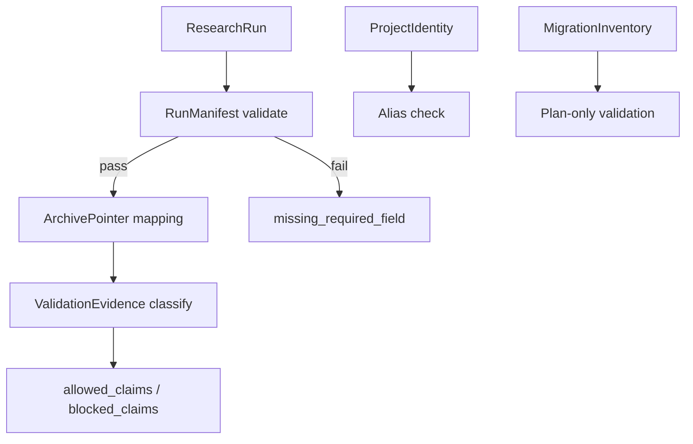

# LLD: CR051-S04 — 研究 registry 与证据合同

## 0. 上游设计依据

| 来源 | 路径 / ID | 被本 LLD 消费的内容 |
|---|---|---|
| HLD | `docs/design/HLD-CR051-STRATEGY-RESEARCH-LIFECYCLE-FRAMEWORK.md` §9 / §13 / §14 | 核心对象、风险、ADR 候选 |
| S01 LLD | `process/stories/CR051-S01-lifecycle-and-taxonomy-framework-LLD.md` | lifecycle 对象和 claim boundary |
| S02 LLD | `process/stories/CR051-S02-repository-archive-and-data-lake-governance-LLD.md` | archive manifest 基础字段 |
| Feature DESIGN | `docs/features/strategy-research-lifecycle/DESIGN.md` | ProjectIdentity、MigrationInventory、ArchivePointer |
| Feature TEST-PLAN | `docs/features/strategy-research-lifecycle/TEST-PLAN.md` | TC-CR051-02、TC-CR051-06、SEC-TC-01、SEC-TC-03 |

## 1. Goal

创建 `docs/research/RESEARCH-REGISTRY-SPEC.md`，冻结 ResearchRun、ValidationEvidence、ResearchArchiveManifest、ProjectIdentity、MigrationInventory 和 ArchivePointer 的最小 registry 合同和校验规则。

## 2. Requirements（Functional / Non-Functional）

### 2.1 Functional

- 定义 RunManifest 必填字段：run_id、commit、data_release、config_hash、seed、protocol_ref、artifact_refs、archive_manifest_ref。
- 定义 ValidationEvidence 必填字段：evidence_id、run_refs、metric_summary、bias_checks、claim_boundary、runtime_claim_level、blocked_claims。
- 定义 ProjectIdentity 必填字段：canonical_name、legacy_aliases、repo_name_target、doc_alias_policy。
- 定义 MigrationInventory 必填字段：path、path_class、owner_feature、move_action、verification_rule、rollback_ref。
- 定义 blocked error：missing_required_field、artifact_not_externalized、runtime_claim_not_authorized、historical_rewrite_blocked。

### 2.2 Non-Functional

- 安全：registry 不得保存凭据、账户、broker facts 原文或大 artifact 内容。
- 可验证：每个字段必须能被静态检查或人工 review。
- 可迁移：MigrationInventory 必须引用 rollback_ref。
- 不执行：本 Story 不实现代码、不写真实 registry 数据、不扫描文件系统。

## 3. 模块拆分与职责

| 模块 / 文件组 | 职责 | 说明 |
|---|---|---|
| `docs/research/RESEARCH-REGISTRY-SPEC.md` | registry schema、字段、错误模型、校验规则 | 本 Story primary owner |
| `docs/research/RESEARCH-ARCHIVE-MANIFEST-SPEC.md` | archive manifest 上游字段 | S02 owner，本 Story只读消费 |
| `docs/research/LIFECYCLE.md` | 状态机和 claim boundary | S01 owner，本 Story只读消费 |

## 4. 代码结构与文件影响范围

| 动作 | 文件路径 | 变更内容 |
|---|---|---|
| 创建 | `docs/research/RESEARCH-REGISTRY-SPEC.md` | RunManifest、ValidationEvidence、ProjectIdentity、MigrationInventory、ArchivePointer 字段和错误模型 |

## 5. 数据模型与持久化设计

| 对象 / 字段 | 类型 | 约束 | 说明 |
|---|---|---|---|
| `RunManifest.run_id` | string | 唯一、不可为空 | 研究运行 ID |
| `RunManifest.commit` | string | 必填 | Git commit，不允许空 |
| `RunManifest.data_release` | string | 必填或 structured missing | 指向 FEAT-02 current truth release |
| `RunManifest.config_hash` | string | 必填 | 支持复验 |
| `RunManifest.seed` | int / string | 必填或 N/A | 随机过程必须记录 |
| `ValidationEvidence.runtime_claim_level` | enum | `none` / `paper_candidate` / `delivery_candidate` / `runtime_candidate_blocked` | 不得声明 runtime verified |
| `ProjectIdentity.canonical_name` | string | 固定 `quant-lab` | 新文档主名 |
| `ProjectIdentity.legacy_aliases[]` | list | 包含 `local_backtest` | 历史审计名 |
| `MigrationInventory.move_action` | enum | `keep` / `move_later` / `externalize_later` / `blocked_sensitive` | CP5 不执行真实 move |
| `ArchivePointer.redaction_status` | enum | `n/a` / `redacted` / `blocked-sensitive` | 敏感项不得进 Git |

本 Story只定义 schema 文档；后续实现可选择 YAML / JSON schema，但当前不新增代码。

## 6. API / Interface 设计

| 接口 / 入口 | 输入 | 输出 | 调用方 | 说明 |
|---|---|---|---|---|
| IF-S04-01 run manifest validate | RunManifest document | pass / errors | 后续 CR052 | 缺 commit / data_release / config_hash / archive refs 时 fail |
| IF-S04-02 validation evidence classify | evidence summary、claim level | allowed claims / blocked claims | admission review | runtime claim 未授权时 blocked |
| IF-S04-03 identity alias check | canonical name、legacy aliases、path refs | alias report | migration planner | 历史 `local_backtest` 不批量改写 |
| IF-S04-04 migration inventory validate | inventory row | pass / blocked reason | migration planner | move_action 不得执行，只做计划 |

## 7. 核心处理流程

1. 接收 ResearchRun 输出，校验 RunManifest 必填字段。
2. 将 artifact refs 映射到 ResearchArchiveManifest 或 ArchivePointer。
3. 生成 ValidationEvidence，并按 claim_boundary 分类 allowed / blocked claims。
4. ProjectIdentity alias check 校验 canonical / legacy 策略。
5. MigrationInventory 只产生计划行和 verification_rule，不执行 move。

## 8. 技术设计细节

- 关键规则：registry 字段保存“证据索引”，不保存证据原文或大 artifact。
- 依赖选择与复用点：复用 S01 lifecycle、S02 archive manifest 和 S06 identity alias。
- 兼容性处理：历史 run 可登记为 `legacy_summary`，但进入 delivery_candidate 前必须补齐最小字段或 blocked。
- 图示类型选择：流程图，展示 manifest -> archive pointer -> evidence -> claim boundary。

## 9. 安全与性能设计

| 维度 | 设计措施 | 验证方式 |
|---|---|---|
| 安全 | 禁止 credentials / account / broker raw facts 字段 | SEC-TC-01 |
| 声明边界 | runtime_claim_level 默认 `none`，runtime verified 必须 blocked | SEC-TC-03 |
| 性能 | registry 是小型文档 / schema，不存大 artifact | 文档 review |
| 可迁移 | MigrationInventory 必须有 rollback_ref 和 verification_rule | CP5 review |

## 10. 测试设计

| 测试场景 | 前置条件 | 操作 | 预期结果 | 验证方式 |
|---|---|---|---|---|
| RunManifest 必填字段 | registry spec 已生成 | 检查字段表 | commit / data_release / config_hash / seed / artifact refs 均定义 | TC-CR051-06 |
| archive / lake / broker 隔离 | registry spec 已生成 | 检查 pointer 字段 | 不保存 raw data / broker facts 原文 | TC-CR051-02、SEC-TC-01 |
| runtime claim blocked | ValidationEvidence 字段存在 | 检查 runtime_claim_level | 不声明 runtime verified | SEC-TC-03 |
| alias report | ProjectIdentity 字段存在 | 检查 canonical / alias | `quant-lab` 主名，`local_backtest` alias | TC-CR051-04 |

## 11. 实施步骤

| TASK-ID | 动作 | 目标文件 | 详细描述 | 对应测试 |
|---|---|---|---|---|
| TASK-CR051-006 | 创建 | `docs/research/RESEARCH-REGISTRY-SPEC.md` | 写 RunManifest、ValidationEvidence、ProjectIdentity、MigrationInventory 和 ArchivePointer 字段合同 | TC-CR051-02、TC-CR051-06、SEC-TC-01、SEC-TC-03 |
| TASK-CR051-007 | 增加 | `tests/` 或检查脚本候选 | 后续实现阶段增加 manifest / guardrail 静态检查；当前仅登记候选 | CP7 static guardrail |

## 12. 风险、难点与预研建议

### 12.1 实现灰区与取舍记录

| Clarification ID | 问题 | 选项与推荐 | 决策 / 答案 | 影响面 | 证据 | 重访条件 |
|---|---|---|---|---|---|---|
| N/A | 无阻断 clarification | N/A | CP3 / CP4 已确认字段方向和不授权边界 | schema / 安全 / 测试 | CP3 checkpoint、CP4 check | 后续实现 JSON/YAML schema 时重访 |

| 风险 / 难点 | 影响 | 缓解措施 / 预研建议 |
|---|---|---|
| registry 字段过多 | 后续实现复杂 | 首版只定义最小必填字段，扩展字段留 optional |
| 运行证据误声明 | 可能导致未授权 runtime | runtime_claim_level 默认 none，runtime verified 禁止出现 |

### OPEN / Spike 跟踪

| ID | 类型（OPEN / Spike） | 问题 | 下一动作 | 责任方 |
|---|---|---|---|---|
| N/A | N/A | 无阻断 OPEN / Spike | N/A | N/A |

## 13. 回滚与发布策略

- 发布方式：随 CR051 文档实现提交到 Git。
- 回滚触发条件：CP5 要求修改 registry 字段或错误模型。
- 回滚动作：回退 `docs/research/RESEARCH-REGISTRY-SPEC.md`；不删除外部 archive 或真实 registry 数据。

## 14. Definition of Done

- [ ] `RESEARCH-REGISTRY-SPEC.md` 覆盖 RunManifest、ValidationEvidence、ProjectIdentity、MigrationInventory、ArchivePointer。
- [ ] 字段禁止保存凭据、账户、broker facts 原文和大 artifact。
- [ ] 错误模型覆盖 missing_required_field、runtime_claim_not_authorized、historical_rewrite_blocked。
- [ ] CP5 自动预检 PASS 且人工确认前 `confirmed=false`。

## 人工确认区

**CP5 — Story 设计证据可实现性门**

- 结论：`pending`
- 审查人：
- 审查时间：
- 修改意见：
- 风险接受项：
