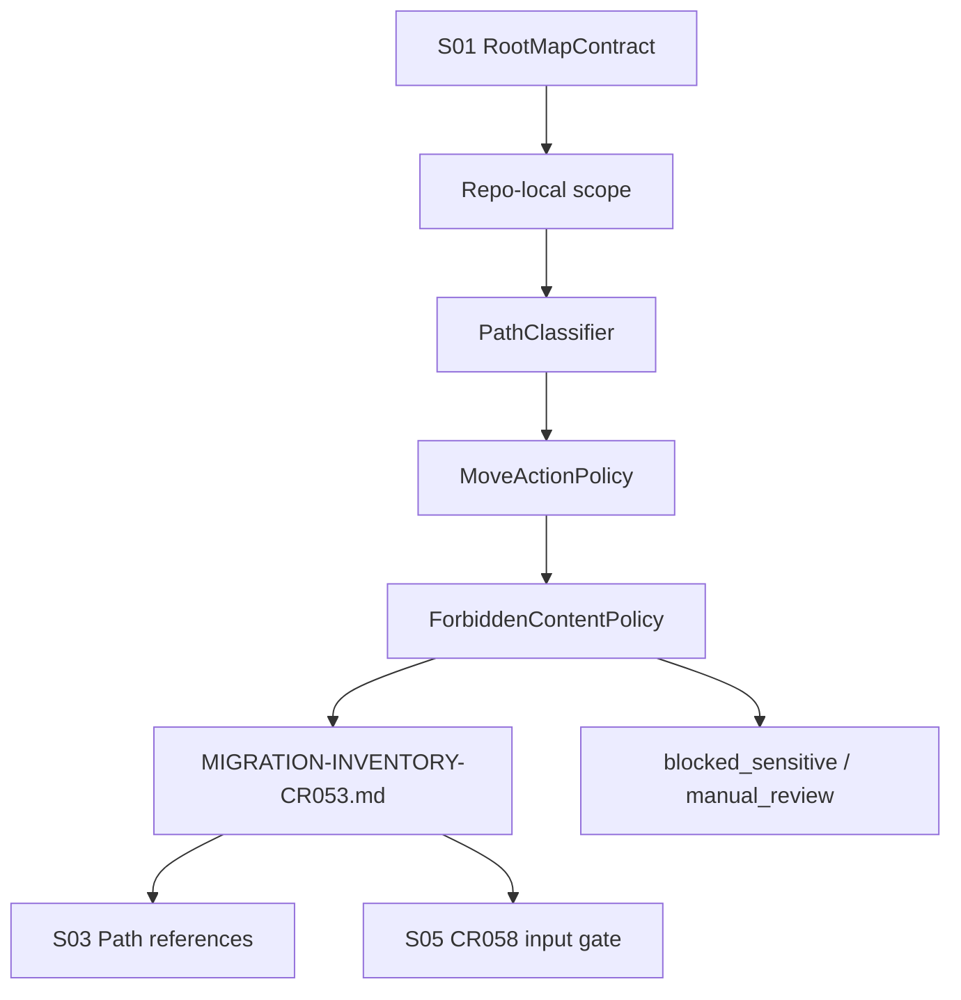

# LLD: CR053-S02 — Git 内 inventory 与路径分类器

## 0. 上游设计依据

| 来源 | 路径 / ID | 被本 LLD 消费的内容 |
|---|---|---|
| CP5 Context | `process/context/CP5-CR053-LLD-CONTEXT.yaml` | S02 evidence_path、不授权边界 |
| HLD | `docs/design/HLD-CR053-QUANT-LAB-MIGRATION-INVENTORY-AND-DRY-RUN.md` | Dry-run Report Contract、Use Case Traceability |
| ADR | `docs/design/ARCHITECTURE-DECISION-CR053.md` | ADR-CR053-004：真实迁移不在 CR053 执行 |
| Feature Matrix | `docs/design/FEATURE-DESIGN-MATRIX.md` | S02 full-lld 判定 |
| Feature DESIGN | `docs/features/quant-lab-migration-dry-run/DESIGN.md` | IF-CR053-01 inventory plan、ForbiddenContentPolicy |
| TEST-PLAN | `docs/features/quant-lab-migration-dry-run/TEST-PLAN.md` | TC-CR053-03、SEC-CR053-01 |
| TASKS | `docs/features/quant-lab-migration-dry-run/TASKS.md` | CR053-T02、CR053-R01 |
| 上游 Story | `process/stories/CR053-S01-root-map-and-host-mapping-contract-LLD.md` | root map / host mapping 合同 |

## 1. Goal

设计 repo-local migration inventory 的静态报告合同，分类 Git 内路径的 owner、artifact class、move_action、risk、verification_rule 和 forbidden content result；本 Story 不扫描 NAS、不读取凭据、不扫描 untracked bulk data。

## 2. Requirements（Functional / Non-Functional）

### 2.1 Functional

- inventory 条目必须包含 path、owner、artifact_class、storage_root、move_action、risk、verification_rule、forbidden_content_result。
- 分类范围限于 Git 内可审查路径和明确允许的小 fixture / docs / schema；不遍历 NAS、lake、broker archive、`.env` 或大数据目录。
- `move_action` 必须区分 `keep`、`candidate_move_cr058`、`manual_review`、`do_not_move`、`blocked_sensitive`。
- ForbiddenContentPolicy 必须 fail closed：命中凭据、token、账号、private key、broker raw facts、未脱敏账户信息时标记 `blocked_sensitive`。
- 输出必须为 S03 path references、S05 CR058 input 提供可追踪 path inventory。

### 2.2 Non-Functional

- 安全：禁止读取 `.env`、凭据和真实数据湖内容；禁止 provider fetch / lake write / publish。
- 可审计：每个条目都必须有 owner、risk 和 verification_rule，不能只给路径列表。
- 可回退：CR053 不移动文件；真实 repo-local move 只能由 CR058 独立授权。
- 性能：后续 CP6 静态报告应基于 Git 内清单或受控路径列表，不做全盘扫描。

## 3. 模块拆分与职责

| 模块 / 文件组 | 职责 | 说明 |
|---|---|---|
| InventoryReportContract | 定义 `MIGRATION-INVENTORY-CR053.md` 的字段、分类和摘要 | 主输出合同 |
| PathClassifier | 将 Git 内路径映射到 artifact_class、storage_root 和 owner | 消费 S01 RootMapContract |
| MoveActionPolicy | 判定 `keep` / `candidate_move_cr058` / `manual_review` / `do_not_move` / `blocked_sensitive` | 只给 dry-run action，不执行 move |
| ForbiddenContentPolicy | 定义敏感路径 / 文件名 / 内容类型的阻断分类 | 不读取真实凭据，只基于路径和允许的静态元信息 |

## 4. 代码结构与文件影响范围

| 动作 | 文件路径 | 变更内容 |
|---|---|---|
| 创建 | `process/stories/CR053-S02-repo-inventory-and-path-classification-LLD.md` | 本 full-lld 设计证据 |
| 修改 | `process/stories/CR053-S02-repo-inventory-and-path-classification.md` | 状态推进到 `lld-ready-for-review`，写入 lld_gate / dev_gate |
| 创建 | `process/checks/CP5-CR053-S02-repo-inventory-and-path-classification-LLD-IMPLEMENTABILITY.md` | CP5 自动预检 |
| 未来创建 | `docs/release/MIGRATION-INVENTORY-CR053.md` | CP5 批准后的静态 inventory 报告；不执行真实移动或外部扫描 |

## 5. 数据模型与持久化设计

| 对象 / 字段 | 类型 | 约束 | 说明 |
|---|---|---|---|
| `InventoryItem.path` | string | repo-relative；不得是绝对 NAS / lake 路径 | 避免泄漏私有挂载路径 |
| `InventoryItem.owner` | enum/string | 必填；未知写 `unknown-owner` | 未知 owner 不阻断 CP5，但阻断 CR058 自动迁移 |
| `InventoryItem.artifact_class` | enum | `source_code` / `process_evidence` / `design_doc` / `release_doc` / `test_fixture` / `report_pointer` / `large_artifact_pointer` / `sensitive_candidate` | 支持后续分类统计 |
| `InventoryItem.storage_root` | enum | 引用 S01 root_id | 不直接写真实路径 |
| `InventoryItem.move_action` | enum | `keep` / `candidate_move_cr058` / `manual_review` / `do_not_move` / `blocked_sensitive` | dry-run 行为，不执行 |
| `InventoryItem.risk` | enum | `low` / `medium` / `high` / `blocked` | `blocked_sensitive` 对应 blocked |
| `InventoryItem.verification_rule` | string | 必填 | 例如 static review、link check、manifest check |
| `InventoryItem.forbidden_content_result` | enum | `not_checked_runtime` / `path_clear` / `blocked_sensitive` / `manual_review_required` | CR053 不读取凭据正文 |

无新增数据库或持久化存储；未来报告为 Markdown 静态文档。

## 6. API / Interface 设计

| 接口 / 入口 | 输入 | 输出 | 调用方 | 说明 |
|---|---|---|---|---|
| IF-CR053-S02-inventory-contract | repo root 标识、S01 RootMapContract、allowlist / denylist、Feature DESIGN IF-CR053-01 | InventoryReportContract | S03 / S05 / CP6 报告生成 | 测试入口 TC-CR053-03 |
| IF-CR053-S02-classifier-policy | repo-relative path、artifact class rules、forbidden policy | `InventoryItem` 分类结果 | Inventory report | 测试入口 TC-CR053-03 |
| IF-CR053-S02-safety-boundary | CP5 Context not_authorized、ForbiddenContentPolicy | fail-closed 分类和 forbidden counters | CP5 / CP7 | 测试入口 SEC-CR053-01 |

## 7. 核心处理流程

1. 消费 S01 root map，将 repo workspace、docs、process、release docs、fixtures 和 pointer 类对象映射到逻辑 storage root。
2. 依据 allowlist / denylist 生成 repo-local path 分类计划。
3. 对每个路径生成 `InventoryItem`，填充 owner、artifact_class、storage_root、move_action、risk、verification_rule。
4. 命中敏感候选、凭据路径、broker raw facts 或外部数据湖正文时，标记 `blocked_sensitive` 或 `manual_review_required`。
5. 生成静态报告摘要：按 owner、artifact_class、move_action、risk 聚合。
6. 将 unknown owner、manual review 和 blocked sensitive 列为 CR058 输入门禁，不在 CR053 自动修复或移动。

## 8. 技术设计细节

- 关键算法 / 规则：分类优先级为 forbidden denylist > explicit owner rule > artifact class rule > unknown-owner；forbidden 命中必须覆盖后续 action。
- 依赖选择与复用点：复用 S01 root map；复用 Feature DESIGN IF-CR053-01 字段；不新增运行时 scanner。
- 兼容性处理：历史 `process/` 和 CR 证据默认 `keep` 或 `manual_review`，不得作为批量改写目标。
- 图示类型选择：流程图，因为存在 S01 输入、分类、策略、敏感阻断和 S03/S05 下游。

## 9. 安全与性能设计

| 维度 | 设计措施 | 验证方式 |
|---|---|---|
| 安全 | 不读取 `.env`、token、账号、密码、private key；敏感候选路径 fail closed | SEC-CR053-01；ForbiddenContentPolicy 表审查 |
| 性能 | 限定 repo-local 静态范围；不执行 NAS / lake / untracked bulk scan | CP5 / CP6 范围审查 |
| 一致性 | 所有 `candidate_move_cr058` 都必须有 verification_rule 和 rollback 前置 | S05 CR058 input gate 审查 |

## 10. 测试设计

| 测试场景 | 前置条件 | 操作 | 预期结果 | 验证方式 |
|---|---|---|---|---|
| TC-CR053-03 inventory 字段覆盖 | CP5 approved 后生成报告 | 审查 `MIGRATION-INVENTORY-CR053.md` | path、owner、class、move_action、risk、verification_rule 字段覆盖率 100% | 静态报告审查 |
| S02-NEG-sensitive-path | 报告包含敏感候选路径模式 | 审查分类结果 | 标记 `blocked_sensitive` 或 `manual_review_required`，不得给 `candidate_move_cr058` | 静态报告审查 |
| S02-NEG-unknown-owner | 路径无法分类 | 审查分类结果 | owner=`unknown-owner`，move_action=`manual_review` | 静态报告审查 |
| SEC-CR053-01 禁止操作计数 | 本 Story 设计证据与 CP6 输出 | 检查 not-authorized 表 | NAS scan、credential read、provider/lake/publish 计数为 0 | CP5 / CP7 静态审查 |

## 11. 实施步骤

| TASK-ID | 动作 | 目标文件 | 详细描述 | 对应测试 |
|---|---|---|---|---|
| CR053-T02-01 | 创建 | `process/stories/CR053-S02-repo-inventory-and-path-classification-LLD.md` | 写入 0-14 节 full-lld，冻结 InventoryItem、PathClassifier、ForbiddenContentPolicy | CP5 自动预检 |
| CR053-T02-02 | 修改 | `process/stories/CR053-S02-repo-inventory-and-path-classification.md` | 状态改为 `lld-ready-for-review`，写入 lld_gate / dev_gate，保持 implementation_allowed=false | CP5 自动预检 |
| CR053-T02-03 | 创建 | `process/checks/CP5-CR053-S02-repo-inventory-and-path-classification-LLD-IMPLEMENTABILITY.md` | 记录 Entry / Checklist / Exit / Deliverables 和 PASS 结论 | CP5 自动预检 |
| CR053-R01-01 | 未来创建 | `docs/release/MIGRATION-INVENTORY-CR053.md` | CP5 approved 后生成 repo-local 静态 inventory 报告，不扫 NAS、不读凭据 | TC-CR053-03 / SEC-CR053-01 |

## 12. 风险、难点与预研建议

### 12.1 实现灰区与取舍记录

| Clarification ID | 问题 | 选项与推荐 | 决策 / 答案 | 影响面 | 证据 | 重访条件 |
|---|---|---|---|---|---|---|
| N/A | 无阻断 clarification | 推荐 repo-local 静态 inventory，不扫描 NAS / untracked bulk data | 已由 CP3 / CP4 范围确认 | 接口 / 测试 / 安全 / 跨 Story 契约 | HLD §8、Feature DESIGN IF-CR053-01、CP4 PASS | 用户授权 NAS read-only inventory 或要求扫描外部 archive |

| 风险 / 难点 | 影响 | 缓解措施 / 预研建议 |
|---|---|---|
| unknown owner 过多 | CR058 迁移输入不足 | 报告中统计 unknown-owner，并要求 CR058 前人工归类 |
| 敏感路径误分类为可迁移 | 凭据或账户信息泄漏 | forbidden 优先级最高，命中即 blocked_sensitive |
| 将 dry-run action 当成真实 move | 提前执行迁移 | `move_action` 仅为 CR058 输入，CP5 / CP6 均声明 no-real-migration |

### OPEN / Spike 跟踪

| ID | 类型（OPEN / Spike） | 问题 | 下一动作 | 责任方 |
|---|---|---|---|---|
| N/A | N/A | 无 OPEN / Spike | N/A | N/A |

## 13. 回滚与发布策略

- 发布方式：CP5 仅发布设计证据；CP5 人工确认后才允许进入 CP6 生成静态报告。
- 回滚触发条件：CP5 审查要求扩大 inventory 范围到 NAS / untracked data / 外部 archive，或发现 forbidden policy 不足。
- 回滚动作：修订本 LLD 和 Story 卡片；若扩大范围涉及真实扫描，交回 host-orchestrator 发起新授权或 CR。

## 14. Definition of Done

- [x] 14 个章节全部填写完成
- [x] 文件影响范围、接口、测试与实施步骤可直接指导编码
- [x] 实现灰区与取舍记录已显式写“无阻断 clarification”
- [x] `confirmed=false` 时不进入实现
- [x] frontmatter 已填写 `tier`
- [x] OPEN / Spike 已清点为 0
- [x] 明确 repo-local 范围和禁止 NAS / 凭据 / provider / lake / publish 操作

## 人工确认区

**CP5 checklist 摘要**：

| # | 检查项 | 状态 | 证据 |
|---|---|---|---|
| 1 | LLD 覆盖 AC | 待检查 | 第 2 / 10 / 14 节 |
| 2 | 与 HLD / ADR 一致 | 待检查 | 第 0 / 8 / 12 节 |
| 3 | 文件影响范围明确 | 待检查 | 第 4 / 11 节 |
| 4 | 接口契约完整 | 待检查 | 第 6 节 |
| 5 | 测试与 dev_gate 可计算 | 待检查 | 第 10 / 14 节 |
| 6 | clarification queue 已收敛 | 待检查 | 第 12.1 节 |

人工确认由 host-orchestrator 在 CP5 批次审查稿中统一发起；本文件不单独请求用户确认。
