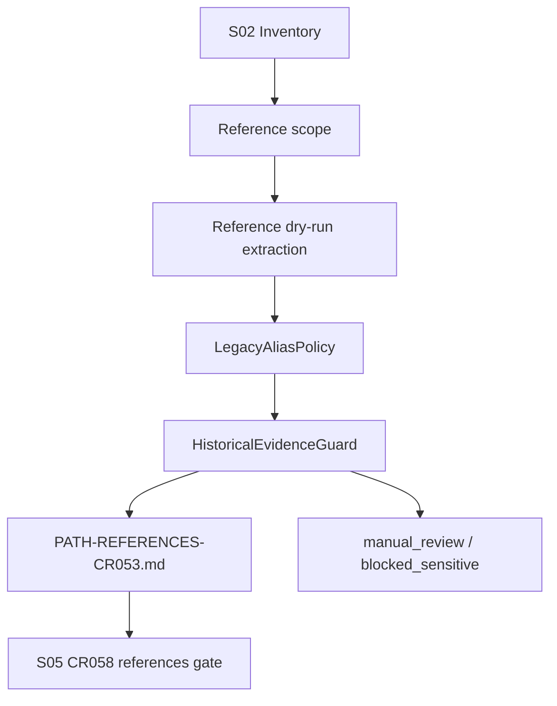

# LLD: CR053-S03 — 路径引用与 legacy alias dry-run

## 0. 上游设计依据

| 来源 | 路径 / ID | 被本 LLD 消费的内容 |
|---|---|---|
| CP5 Context | `process/context/CP5-CR053-LLD-CONTEXT.yaml` | S03 evidence_path、不授权边界 |
| HLD | `docs/design/HLD-CR053-QUANT-LAB-MIGRATION-INVENTORY-AND-DRY-RUN.md` | Dry-run Report Contract、真实迁移后置 |
| ADR | `docs/design/ARCHITECTURE-DECISION-CR053.md` | ADR-CR053-004：真实迁移不在 CR053 执行 |
| Feature Matrix | `docs/design/FEATURE-DESIGN-MATRIX.md` | S03 full-lld 判定 |
| Feature DESIGN | `docs/features/quant-lab-migration-dry-run/DESIGN.md` | IF-CR053-02 reference dry-run |
| TEST-PLAN | `docs/features/quant-lab-migration-dry-run/TEST-PLAN.md` | TC-CR053-04、SEC-CR053-01 |
| TASKS | `docs/features/quant-lab-migration-dry-run/TASKS.md` | CR053-T03、CR053-R02 |
| 上游 Story | `process/stories/CR053-S02-repo-inventory-and-path-classification-LLD.md` | inventory path、owner、move_action、risk |

## 1. Goal

设计 `local_backtest` legacy alias、旧路径、文档链接和环境变量引用的 dry-run 报告合同，区分可机械替换、需人工审查、必须保留的历史审计引用；本 Story 不批量改写历史 `process/` / CR / handoff 证据，不执行 git history rewrite。

## 2. Requirements（Functional / Non-Functional）

### 2.1 Functional

- PathReferenceReport 必须记录 reference、file_path、line_or_section、context_kind、classification、proposed_action、manual_review_required、reason。
- classification 必须至少包含 `canonical_quant_lab`、`legacy_alias_keep`、`candidate_replace_cr058`、`manual_review_required`、`historical_evidence_keep`、`blocked_sensitive`。
- 对 `process/`、历史 CR、handoff、checkpoint、DEV-LOG 中的历史证据默认保留或 manual review，不做批量改写。
- 对 README / docs / release 中的面向用户路径可以标记为 `candidate_replace_cr058`，但 CR053 不执行替换。
- 输出必须消费 S02 inventory，并为 S05 CR058 input 提供 references gate。

### 2.2 Non-Functional

- 可审计：必须保留为什么某个 `local_backtest` 引用应保留或改写的 reason。
- 安全：不得读取 `.env` 或凭据文件；命中 sensitive 引用时 fail closed。
- 兼容：legacy alias `local_backtest` 作为历史身份可保留，不能强制全量消除。
- 可回滚：CR053 不写入替换结果，真实替换只进入 CR058 repo-local mechanical move。

## 3. 模块拆分与职责

| 模块 / 文件组 | 职责 | 说明 |
|---|---|---|
| ReferenceReportContract | 定义 `PATH-REFERENCES-CR053.md` 字段和摘要 | 主输出合同 |
| LegacyAliasPolicy | 判定 `local_backtest`、`quant-lab`、legacy env var 和路径片段的分类 | 保留历史审计语境 |
| ReplacementCandidatePolicy | 输出 dry-run proposed_action，不执行修改 | 区分 CR058 候选和 manual review |
| HistoricalEvidenceGuard | 阻止批量改写历史 process / CR / handoff / checkpoint | 保障追溯链 |

## 4. 代码结构与文件影响范围

| 动作 | 文件路径 | 变更内容 |
|---|---|---|
| 创建 | `process/stories/CR053-S03-path-reference-and-legacy-alias-dry-run-LLD.md` | 本 full-lld 设计证据 |
| 修改 | `process/stories/CR053-S03-path-reference-and-legacy-alias-dry-run.md` | 状态推进到 `lld-ready-for-review`，写入 lld_gate / dev_gate |
| 创建 | `process/checks/CP5-CR053-S03-path-reference-and-legacy-alias-dry-run-LLD-IMPLEMENTABILITY.md` | CP5 自动预检 |
| 未来创建 | `docs/release/PATH-REFERENCES-CR053.md` | CP5 批准后的静态 dry-run 报告；不执行批量改写 |

## 5. 数据模型与持久化设计

| 对象 / 字段 | 类型 | 约束 | 说明 |
|---|---|---|---|
| `PathReference.reference` | string | 可脱敏；不得包含凭据正文 | 捕获 `local_backtest`、旧路径、legacy env 等 |
| `PathReference.file_path` | string | repo-relative | 引用所在文件 |
| `PathReference.context_kind` | enum | `runtime_config` / `user_doc` / `design_doc` / `process_evidence` / `code_comment` / `test_fixture` / `unknown` | 决定 action |
| `PathReference.classification` | enum | `canonical_quant_lab` / `legacy_alias_keep` / `candidate_replace_cr058` / `manual_review_required` / `historical_evidence_keep` / `blocked_sensitive` | dry-run 分类 |
| `PathReference.proposed_action` | enum | `keep` / `replace_in_cr058` / `manual_review` / `block` | 仅计划，不执行 |
| `PathReference.manual_review_required` | boolean | 必填 | 历史证据和未知上下文必须 true |
| `PathReference.reason` | string | 必填 | 解释分类依据 |

无新增数据库或持久化存储；未来报告为 Markdown 静态文档。

## 6. API / Interface 设计

| 接口 / 入口 | 输入 | 输出 | 调用方 | 说明 |
|---|---|---|---|---|
| IF-CR053-S03-reference-dry-run | S02 inventory、legacy alias rules、允许扫描的文本文件范围 | PathReferenceReport | S05 CR058 input / CP6 静态报告 | 测试入口 TC-CR053-04 |
| IF-CR053-S03-historical-guard | file_path、context_kind、reference | classification / proposed_action | ReferenceReportContract | 防止改写历史 process / CR |
| IF-CR053-S03-safety-boundary | CP5 Context not_authorized、ForbiddenContentPolicy | blocked_sensitive / manual_review_required | CP5 / CP7 | 测试入口 SEC-CR053-01 |

## 7. 核心处理流程

1. 消费 S02 inventory，确定可纳入 reference dry-run 的 repo-local 文本范围。
2. 对允许范围内的引用生成 `PathReference` 条目。
3. 依据 context_kind 应用 LegacyAliasPolicy：历史 process / CR / handoff / checkpoint 默认 `historical_evidence_keep` 或 `manual_review_required`。
4. 对用户文档、release 文档、面向未来的路径说明标记 `candidate_replace_cr058`，但只写 proposed_action。
5. 命中敏感信息、凭据路径或未知上下文时标记 `blocked_sensitive` 或 `manual_review_required`。
6. 输出摘要：按 classification、proposed_action、manual_review_required 计数。
7. 将 references gate 交给 S05，作为 CR058 启动前置条件。

## 8. 技术设计细节

- 关键算法 / 规则：历史证据保护优先级高于替换候选；`process/`、`process/changes/`、`process/checks/`、`process/checkpoints/`、handoff 和 DEV-LOG 默认不批量替换。
- 依赖选择与复用点：复用 S02 inventory 的 repo-local scope；复用 CR051 project identity / legacy alias 语义。
- 兼容性处理：`local_backtest` 作为 legacy_project_alias 可以继续存在于历史记录和兼容说明中。
- 图示类型选择：流程图，因为涉及 extraction、alias policy、historical guard 和 S05 gate。

## 9. 安全与性能设计

| 维度 | 设计措施 | 验证方式 |
|---|---|---|
| 安全 | 不读取 `.env` 或凭据；敏感引用标记 blocked，不输出原文凭据 | SEC-CR053-01；报告审查 |
| 性能 | 限定 repo-local 文本范围，不扫描 NAS / lake / external archive | CP6 范围审查 |
| 审计 | 历史 evidence keep 记录 reason，避免破坏追溯链 | TC-CR053-04 |

## 10. 测试设计

| 测试场景 | 前置条件 | 操作 | 预期结果 | 验证方式 |
|---|---|---|---|---|
| TC-CR053-04 legacy alias manual-review | CP5 approved 后生成报告 | 审查 `PATH-REFERENCES-CR053.md` | 历史 process / CR 引用标记 keep 或 manual_review，不自动批量改写 | 静态报告审查 |
| S03-positive-doc-candidate | 用户文档中存在未来路径说明 | 审查 proposed_action | 标记 `replace_in_cr058` 或 `manual_review`，不在 CR053 执行 | 静态报告审查 |
| S03-NEG-sensitive-reference | 引用命中凭据 / secret 字样 | 审查分类 | 标记 `blocked_sensitive`，不输出敏感正文 | 静态报告审查 |
| SEC-CR053-01 禁止操作计数 | 本 Story 设计证据与 CP6 输出 | 检查 not-authorized 表 | bulk rewrite、git history rewrite、credential read 计数为 0 | CP5 / CP7 静态审查 |

## 11. 实施步骤

| TASK-ID | 动作 | 目标文件 | 详细描述 | 对应测试 |
|---|---|---|---|---|
| CR053-T03-01 | 创建 | `process/stories/CR053-S03-path-reference-and-legacy-alias-dry-run-LLD.md` | 写入 0-14 节 full-lld，冻结 PathReference、LegacyAliasPolicy、HistoricalEvidenceGuard | CP5 自动预检 |
| CR053-T03-02 | 修改 | `process/stories/CR053-S03-path-reference-and-legacy-alias-dry-run.md` | 状态改为 `lld-ready-for-review`，写入 lld_gate / dev_gate，保持 implementation_allowed=false | CP5 自动预检 |
| CR053-T03-03 | 创建 | `process/checks/CP5-CR053-S03-path-reference-and-legacy-alias-dry-run-LLD-IMPLEMENTABILITY.md` | 记录 Entry / Checklist / Exit / Deliverables 和 PASS 结论 | CP5 自动预检 |
| CR053-R02-01 | 未来创建 | `docs/release/PATH-REFERENCES-CR053.md` | CP5 approved 后生成 repo-local path reference dry-run 报告，不批量改写 | TC-CR053-04 / SEC-CR053-01 |

## 12. 风险、难点与预研建议

### 12.1 实现灰区与取舍记录

| Clarification ID | 问题 | 选项与推荐 | 决策 / 答案 | 影响面 | 证据 | 重访条件 |
|---|---|---|---|---|---|---|
| N/A | 无阻断 clarification | 推荐保留历史审计引用，面向未来文档只输出 CR058 候选替换计划 | 已由 CR051 / CR053 设计边界确认 | 文档 / 测试 / 跨 Story 契约 | HLD §8、Feature DESIGN IF-CR053-02 | 用户要求真实 rename、批量 rewrite 或远端仓库改名 |

| 风险 / 难点 | 影响 | 缓解措施 / 预研建议 |
|---|---|---|
| 历史引用被误改写 | 破坏审计追溯 | HistoricalEvidenceGuard 默认 keep / manual_review |
| legacy alias 全量保留导致用户文档混乱 | CR058 后仍有旧称 | 报告区分 future-facing docs 和 historical evidence |
| dry-run 被误执行为真实 rewrite | 产生大范围 diff | proposed_action 只作为 CR058 输入，CP5 前后均不授权批量改写 |

### OPEN / Spike 跟踪

| ID | 类型（OPEN / Spike） | 问题 | 下一动作 | 责任方 |
|---|---|---|---|---|
| N/A | N/A | 无 OPEN / Spike | N/A | N/A |

## 13. 回滚与发布策略

- 发布方式：CP5 仅发布设计证据；CP5 人工确认后才允许 CP6 生成静态 reference dry-run 报告。
- 回滚触发条件：CP5 审查要求改变 legacy alias 策略、允许批量改写历史证据或扩大真实 rename 范围。
- 回滚动作：修订本 LLD 和 Story 卡片；涉及真实 rename / rewrite / git history 的要求交回 host-orchestrator 发起新 CR 或授权门。

## 14. Definition of Done

- [x] 14 个章节全部填写完成
- [x] 文件影响范围、接口、测试与实施步骤可直接指导编码
- [x] 实现灰区与取舍记录已显式写“无阻断 clarification”
- [x] `confirmed=false` 时不进入实现
- [x] frontmatter 已填写 `tier`
- [x] OPEN / Spike 已清点为 0
- [x] 明确不批量改写历史 process / CR / handoff 证据，不执行 git history rewrite

## 人工确认区

**CP5 checklist 摘要**：

| # | 检查项 | 状态 | 证据 |
|---|---|---|---|
| 1 | LLD 覆盖 AC | 待检查 | 第 2 / 10 / 14 节 |
| 2 | 与 HLD / ADR 一致 | 待检查 | 第 0 / 8 / 12 节 |
| 3 | 文件影响范围明确 | 待检查 | 第 4 / 11 节 |
| 4 | 接口契约完整 | 待检查 | 第 6 节 |
| 5 | 测试与 dev_gate 可计算 | 待检查 | 第 10 / 14 节 |
| 6 | clarification queue 已收敛 | 待检查 | 第 12.1 节 |

人工确认由 host-orchestrator 在 CP5 批次审查稿中统一发起；本文件不单独请求用户确认。
