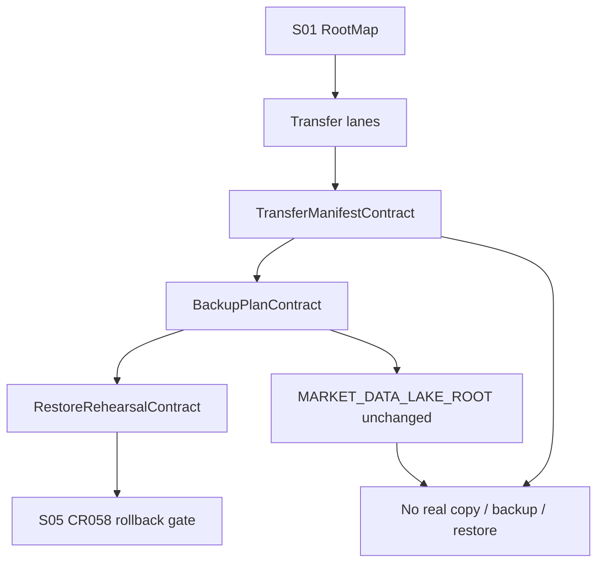

# LLD: CR053-S04 — manifest-first transfer 与 backup plan

## 0. 上游设计依据

| 来源 | 路径 / ID | 被本 LLD 消费的内容 |
|---|---|---|
| CP5 Context | `process/context/CP5-CR053-LLD-CONTEXT.yaml` | S04 evidence_path、不授权边界 |
| HLD | `docs/design/HLD-CR053-QUANT-LAB-MIGRATION-INVENTORY-AND-DRY-RUN.md` | 数据传输方案、备份方案、数据湖兼容性 |
| ADR | `docs/design/ARCHITECTURE-DECISION-CR053.md` | ADR-CR053-002、003、006 |
| Feature Matrix | `docs/design/FEATURE-DESIGN-MATRIX.md` | S04 full-lld 判定 |
| Feature DESIGN | `docs/features/quant-lab-migration-dry-run/DESIGN.md` | IF-CR053-04 backup plan、SEC-CR053-01..05 |
| TEST-PLAN | `docs/features/quant-lab-migration-dry-run/TEST-PLAN.md` | TC-CR053-05、TC-CR053-06、SEC-CR053-01 |
| TASKS | `docs/features/quant-lab-migration-dry-run/TASKS.md` | CR053-T04、CR053-R04 |
| 上游 Story | `process/stories/CR053-S01-root-map-and-host-mapping-contract-LLD.md` | root map / host mapping / lake alias 合同 |

## 1. Goal

设计 manifest-first transfer、backup plan 和 restore rehearsal 的静态合同，明确 staging -> checksum -> promote -> record -> rollback 语义，以及 hot / warm / cold / Git bundle / package manifest / lake policy 的备份边界；本 Story 不执行真实备份、恢复、NAS copy/delete 或数据湖迁移。

## 2. Requirements（Functional / Non-Functional）

### 2.1 Functional

- TransferManifest 必须包含 source_root、target_root、staging_id、checksum、file_count、total_size、promote_rule、record_rule、rollback_ref。
- BackupPlan 必须区分 hot cache、warm archive、cold backup、Git bundle、package manifest mirror、market data lake policy 6 类对象。
- RestoreRehearsalPlan 必须定义至少 manifest sample、report sample、checksum revalidate 三类验收点。
- Market data lake 继续沿用现有 `MARKET_DATA_LAKE_ROOT` / 数据湖备份策略；CR053 不迁移 lake root。
- 输出必须为 S05 CR058 input 提供 backup / rollback 前置条件。

### 2.2 Non-Functional

- 安全：不执行真实 backup / restore / NAS copy / delete；不读取 `.env` 或真实 lake。
- 可靠性：所有 durable transfer 必须先 manifest / checksum，再 promote；checksum mismatch fail closed。
- 可回滚：promote 前失败不进入目标；promote 后失败必须依赖 rollback_ref / snapshot manifest。
- 可审计：备份对象、频率、保留期、恢复验收和不授权边界必须显式记录。

## 3. 模块拆分与职责

| 模块 / 文件组 | 职责 | 说明 |
|---|---|---|
| TransferManifestContract | 定义 durable transfer 的字段、状态和失败模型 | 只做合同，不执行传输 |
| BackupPlanContract | 定义 hot / warm / cold / git / package / lake 六类对象策略 | 输出到 `BACKUP-PLAN-CR053.md` |
| RestoreRehearsalContract | 定义真实迁移前恢复演练验收点 | CR058 / CR060 前置 gate |
| LakePolicyBoundary | 明确现有数据湖 root 不调整 | 防止 lake migration 混入 CR053 |
| NoOperationGuardrail | 记录 forbidden operation 和 fail-closed 行为 | CP5 / CP7 消费 |

## 4. 代码结构与文件影响范围

| 动作 | 文件路径 | 变更内容 |
|---|---|---|
| 创建 | `process/stories/CR053-S04-manifest-transfer-and-backup-plan-LLD.md` | 本 full-lld 设计证据 |
| 修改 | `process/stories/CR053-S04-manifest-transfer-and-backup-plan.md` | 状态推进到 `lld-ready-for-review`，写入 lld_gate / dev_gate |
| 创建 | `process/checks/CP5-CR053-S04-manifest-transfer-and-backup-plan-LLD-IMPLEMENTABILITY.md` | CP5 自动预检 |
| 未来创建 | `docs/release/BACKUP-PLAN-CR053.md` | CP5 批准后的静态 transfer / backup plan 报告；不执行真实备份或恢复 |

## 5. 数据模型与持久化设计

| 对象 / 字段 | 类型 | 约束 | 说明 |
|---|---|---|---|
| `TransferManifest.transfer_id` | string | 必填，稳定可追踪 | dry-run 合同 ID |
| `TransferManifest.source_root` | enum | 引用 S01 root_id | 不写真实路径 |
| `TransferManifest.target_root` | enum | 引用 S01 root_id | 不写真实路径 |
| `TransferManifest.stage` | enum | `planned` / `staged` / `checksummed` / `promoted` / `recorded` / `failed` | CR053 只能设计，不产生真实状态 |
| `TransferManifest.checksum_policy` | string | 必填 | sha256 + manifest hash |
| `TransferManifest.rollback_ref` | string | 必填或 `required_before_cr058` | CR058 前必须补齐 |
| `BackupClass.object_class` | enum | `hot_cache` / `warm_archive` / `cold_backup` / `git_bundle` / `package_manifest` / `market_data_lake_policy` | 6 类对象 100% 覆盖 |
| `BackupClass.retention_policy` | string | 必填；hot cache 可说明 TTL / no durable backup | 备份策略 |
| `RestoreCheck.check_id` | string | 必填 | manifest sample、report sample、checksum revalidate |

无新增数据库或持久化存储；未来报告为 Markdown 静态文档。

## 6. API / Interface 设计

| 接口 / 入口 | 输入 | 输出 | 调用方 | 说明 |
|---|---|---|---|---|
| IF-CR053-S04-transfer-manifest | S01 RootMapContract、artifact classes、HLD transfer lanes | TransferManifestContract | S05 CR058 input、CP6 static report | 测试入口 TC-CR053-05 |
| IF-CR053-S04-backup-plan | S01 root map、HLD backup scheme、lake policy boundary | BackupPlanContract | S05 CR058 input | 测试入口 TC-CR053-06 |
| IF-CR053-S04-restore-rehearsal | BackupPlanContract、rollback_ref requirement | RestoreRehearsalContract | CR058 / CR060 gate | 测试入口 TC-CR053-06 |
| IF-CR053-S04-safety-boundary | CP5 Context not_authorized | forbidden operation counters | CP5 / CP7 | 测试入口 SEC-CR053-01 |

## 7. 核心处理流程

1. 消费 S01 root map，定义 research_pc -> hot、hot -> warm、warm -> cold、package exchange -> trading_pc 的 transfer lane。
2. 对 durable transfer 应用 manifest-first：planned -> staging contract -> checksum policy -> promote rule -> record rule -> rollback_ref。
3. 对 backup classes 生成策略：hot cache 不作为唯一副本，warm archive 为主层，cold backup 为独立快照，Git bundle 备份代码 / docs / schema，package manifest mirror 备份 manifest，lake 沿用现有策略。
4. 定义 restore rehearsal：至少恢复 1 个 manifest + 1 个小型报告样本并复验 checksum。
5. 对所有真实操作写 `not_authorized`：不 copy、不 backup、不 restore、不 lake move。
6. 将 backup / rollback readiness 交给 S05，作为 CR058 input gate。

## 8. 技术设计细节

- 关键算法 / 规则：durable item 必须 manifest-first；checksum mismatch 阻断 promote；hot cache 不允许作为唯一副本；RAID 不等于 backup。
- 依赖选择与复用点：复用 HLD §6 / §7；复用 ADR-CR053-002/003/006；消费 S01 root map。
- 兼容性处理：market data lake 只引用现有策略，不引入 `QUANT_LAB_MARKET_DATA_LAKE_ROOT` 运行入口。
- 图示类型选择：流程图，因为存在 transfer lanes、backup classes、restore rehearsal 和 S05 gate。

## 9. 安全与性能设计

| 维度 | 设计措施 | 验证方式 |
|---|---|---|
| 安全 | 禁止真实 backup / restore / NAS copy / delete / lake move；不读取 `.env` | SEC-CR053-01 |
| 可靠性 | checksum-first、manifest hash、rollback_ref、restore rehearsal gate | TC-CR053-05 / 06 |
| 性能 | 当前只设计静态报告，不遍历真实大文件或计算真实 checksum | CP5 / CP6 范围审查 |
| 数据保护 | 凭据、broker raw facts 和未脱敏账户信息禁止进入 backup plan | BackupPlanContract 审查 |

## 10. 测试设计

| 测试场景 | 前置条件 | 操作 | 预期结果 | 验证方式 |
|---|---|---|---|---|
| TC-CR053-05 transfer manifest 字段覆盖 | CP5 approved 后生成报告 | 审查 transfer manifest 表 | staging、checksum、promote、record、rollback 字段覆盖率 100% | 静态报告审查 |
| TC-CR053-06 backup class 覆盖 | CP5 approved 后生成报告 | 审查 backup plan 表 | hot / warm / cold / git bundle / package manifest / lake policy 六类对象 100% 覆盖 | 静态报告审查 |
| S04-NEG-hot-unique-copy | hot cache 被声明为唯一副本 | 审查报告 | 必须标记 blocked，不允许进入 CR058 | 静态报告审查 |
| S04-NEG-lake-migration | 报告出现替换 `MARKET_DATA_LAKE_ROOT` 的建议 | 审查报告 | 标记为违反 ADR-CR053-006，CP7 应 FAIL / NEEDS_REWORK | 静态报告审查 |
| SEC-CR053-01 禁止操作计数 | 本 Story 设计证据与 CP6 输出 | 检查 not-authorized 表 | real backup / restore / NAS copy / delete / lake write 计数为 0 | CP5 / CP7 静态审查 |

## 11. 实施步骤

| TASK-ID | 动作 | 目标文件 | 详细描述 | 对应测试 |
|---|---|---|---|---|
| CR053-T04-01 | 创建 | `process/stories/CR053-S04-manifest-transfer-and-backup-plan-LLD.md` | 写入 0-14 节 full-lld，冻结 TransferManifest、BackupPlan、RestoreRehearsal 合同 | CP5 自动预检 |
| CR053-T04-02 | 修改 | `process/stories/CR053-S04-manifest-transfer-and-backup-plan.md` | 状态改为 `lld-ready-for-review`，写入 lld_gate / dev_gate，保持 implementation_allowed=false | CP5 自动预检 |
| CR053-T04-03 | 创建 | `process/checks/CP5-CR053-S04-manifest-transfer-and-backup-plan-LLD-IMPLEMENTABILITY.md` | 记录 Entry / Checklist / Exit / Deliverables 和 PASS 结论 | CP5 自动预检 |
| CR053-R04-01 | 未来创建 | `docs/release/BACKUP-PLAN-CR053.md` | CP5 approved 后生成静态 transfer / backup plan，不执行真实备份或恢复 | TC-CR053-05 / 06 / SEC-CR053-01 |

## 12. 风险、难点与预研建议

### 12.1 实现灰区与取舍记录

| Clarification ID | 问题 | 选项与推荐 | 决策 / 答案 | 影响面 | 证据 | 重访条件 |
|---|---|---|---|---|---|---|
| N/A | 无阻断 clarification | 推荐 manifest-first transfer + warm archive / cold backup 分层；当前只做静态合同 | 已由 CP3 approve 接受 | 接口 / 测试 / 安全 / 跨 Story 契约 | HLD §6 / §7、ADR-CR053-002/003/006 | 真实 backup / restore、NAS copy / sync 或数据湖迁移 |

| 风险 / 难点 | 影响 | 缓解措施 / 预研建议 |
|---|---|---|
| RAID 被误当备份 | 真实迁移无独立恢复点 | 明确 warm archive 不是 backup，cold backup 才是独立快照 |
| 未执行 restore rehearsal 就启动真实迁移 | 迁移失败不可恢复 | S05 gate 要求 restore rehearsal evidence 或明确阻断 |
| 数据湖 root 被混入迁移 | 破坏已验证 lake contract | LakePolicyBoundary 明确 `MARKET_DATA_LAKE_ROOT` 不调整 |

### OPEN / Spike 跟踪

| ID | 类型（OPEN / Spike） | 问题 | 下一动作 | 责任方 |
|---|---|---|---|---|
| N/A | N/A | 无 OPEN / Spike | N/A | N/A |

## 13. 回滚与发布策略

- 发布方式：CP5 仅发布设计证据；CP5 人工确认后才允许 CP6 生成静态 backup plan 报告。
- 回滚触发条件：CP5 审查要求执行真实备份 / 恢复 / NAS copy，或要求移动现有数据湖 root。
- 回滚动作：修订本 LLD；涉及真实操作时停止并交回 host-orchestrator 发起独立授权门或后续 CR。

## 14. Definition of Done

- [x] 14 个章节全部填写完成
- [x] 文件影响范围、接口、测试与实施步骤可直接指导编码
- [x] 实现灰区与取舍记录已显式写“无阻断 clarification”
- [x] `confirmed=false` 时不进入实现
- [x] frontmatter 已填写 `tier`
- [x] OPEN / Spike 已清点为 0
- [x] 明确 manifest-first、warm / cold 分层、lake root 不调整和禁止真实 backup / restore / copy

## 人工确认区

**CP5 checklist 摘要**：

| # | 检查项 | 状态 | 证据 |
|---|---|---|---|
| 1 | LLD 覆盖 AC | 待检查 | 第 2 / 10 / 14 节 |
| 2 | 与 HLD / ADR 一致 | 待检查 | 第 0 / 8 / 12 节 |
| 3 | 文件影响范围明确 | 待检查 | 第 4 / 11 节 |
| 4 | 接口契约完整 | 待检查 | 第 6 节 |
| 5 | 测试与 dev_gate 可计算 | 待检查 | 第 10 / 14 节 |
| 6 | clarification queue 已收敛 | 待检查 | 第 12.1 节 |

人工确认由 host-orchestrator 在 CP5 批次审查稿中统一发起；本文件不单独请求用户确认。
