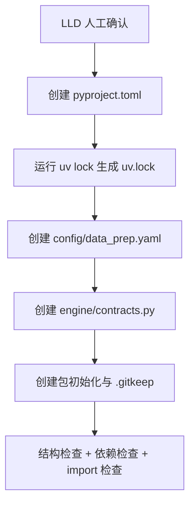

# LLD: STORY-001 - 工程基线与数据契约骨架

> 本文档是 `STORY-001` 的低层设计。用户已确认通过，`confirmed=true` 后只允许在本 LLD 第 4 节列出的 8 个文件范围内进入实现。

## 1. Goal

创建本地 Python 日频研究工具的工程基线、uv 依赖入口、默认数据准备配置和共享数据契约骨架，使后续 `STORY-002` 至 `STORY-008` 能基于稳定目录、配置键、parquet schema、manifest schema、质量状态和报告字段继续实现。

本 Story 完成后只建立“工程与契约骨架”，不实现联网数据准备、parquet 标准化、回测、参数扫描、报告生成、安装脚本或 `delivery/**` 产物。

## 2. Requirements（Functional / Non-Functional）

### 2.1 Functional

- 创建 8 个基线输出路径：`pyproject.toml`、`uv.lock`、`config/data_prep.yaml`、`engine/__init__.py`、`engine/contracts.py`、`strategies/__init__.py`、`data/.gitkeep`、`reports/.gitkeep`。
- `pyproject.toml` 声明 Python `>=3.11,<3.13`，并以 uv 为依赖管理入口；第一版依赖包含 `pandas`、`pyarrow`、`akshare`、`PyYAML`、`pytest`，不得声明 RQAlpha、Backtrader、vectorbt、bt。
- `config/data_prep.yaml` 写入数据准备默认配置，至少包含 `request_interval_seconds=2`、`batch_size=50`、`max_concurrency=1`、`max_retries=3`、`backoff_policy=exponential_jitter`、`recent_trade_days_backfill=5`。
- `engine/contracts.py` 只定义 schema、字段常量、状态枚举、默认配置键和报告字段列表，不执行 I/O，不调用 AKShare，不导入后续实现模块。
- `engine/contracts.py` 覆盖三类 parquet 必需字段、manifest 必需字段、`pass/warn/fail` 质量状态、至少 2 个报告 CSV 字段列表。
- 建立 `engine/` 与 `strategies/` Python 包初始化文件，建立 `data/` 与 `reports/` 空目录占位文件。

### 2.2 Non-Functional

- 遵循 HLD 已确认的轻量本地日频回测层方向，第一版不引入大型回测框架。
- 回测主路径离线约束在本 Story 中以契约常量表达，不实现任何网络调用入口。
- 常量命名使用大写 snake case，Python 模块使用小写 snake case，配置文件固定为 `config/data_prep.yaml`。
- 契约常量必须可被后续 Story 直接 import，导入 `engine.contracts` 不依赖 pandas、pyarrow、akshare 或文件系统。
- 工程基线不生成平台安装规范、不创建安装脚本、不写入 `delivery/**`。
- `uv.lock` 必须由后续实现阶段运行 `uv lock` 生成；LLD 起草阶段不得运行 `uv lock`。

## 3. 模块拆分与职责

| 模块 / 文件组 | 职责 | 说明 |
|---|---|---|
| 项目依赖入口 | 用 `pyproject.toml` 声明 Python 版本、项目元数据、运行依赖和测试依赖 | 只声明本地研究工具最小依赖；不声明大型回测框架 |
| 锁文件 | 用 `uv.lock` 固化依赖解析结果 | 实现阶段由 `uv lock` 生成，不手写锁文件内容 |
| 数据准备默认配置 | 用 `config/data_prep.yaml` 固化 HLD Q-012 至 Q-015 默认值 | 后续 `STORY-002` 消费；本 Story 不实现解析器 |
| 契约模块 | 用 `engine/contracts.py` 暴露 parquet、manifest、质量状态、报告字段和默认配置键 | 采用常量表，不采用 pydantic model，不执行 I/O |
| 包初始化 | 用 `engine/__init__.py`、`strategies/__init__.py` 建立导入边界 | 初始化文件不做副作用导入 |
| 空目录占位 | 用 `data/.gitkeep`、`reports/.gitkeep` 保留运行数据与报告目录 | 不创建 raw、manifest、parquet 或报告结果文件 |

## 4. 代码结构与文件影响范围

| 动作 | 文件路径 | 变更内容 |
|---|---|---|
| 创建 | `pyproject.toml` | 声明项目名、Python 版本范围、uv 管理依赖、最小运行依赖和 pytest 开发依赖；禁止大型回测框架依赖 |
| 创建 | `uv.lock` | 由 `uv lock` 根据 `pyproject.toml` 生成锁文件 |
| 创建 | `config/data_prep.yaml` | 写入数据准备默认节流、重试、退避、回补和 raw 缓存策略配置 |
| 创建 | `engine/__init__.py` | 建立 `engine` 包；不导入重型依赖或执行运行逻辑 |
| 创建 | `engine/contracts.py` | 定义字段常量、schema 常量、状态枚举常量、默认配置名、报告字段列表和公开导出列表 |
| 创建 | `strategies/__init__.py` | 建立 `strategies` 包；不导入策略实现 |
| 创建 | `data/.gitkeep` | 保留数据目录；不创建数据内容 |
| 创建 | `reports/.gitkeep` | 保留报告目录；不创建报告内容 |

## 5. 数据模型与持久化设计

本 Story 不创建业务数据文件，不写 parquet、manifest、raw 缓存或报告结果；只定义后续持久化对象的字段契约。

| 对象 / 字段 | 类型 | 约束 | 说明 |
|---|---|---|---|
| `PRICE_REQUIRED_COLUMNS` | `tuple[str, ...]` | 固定为 `trade_date`、`symbol`、`close` | 对应 HLD §8.3 `data/prices.parquet` 必需字段 |
| `PRICE_OPTIONAL_COLUMNS` | `tuple[str, ...]` | 包含 `available_at`、`adjustment_policy`、`volume`、`amount`、`is_suspended`、`limit_up`、`limit_down` | 后续增强字段先以可选字段暴露 |
| `INDEX_MEMBERS_REQUIRED_COLUMNS` | `tuple[str, ...]` | 固定为 `symbol` | 对应固定当前沪深 300 快照最小契约 |
| `INDEX_MEMBERS_OPTIONAL_COLUMNS` | `tuple[str, ...]` | 包含 `snapshot_date`、`available_at`、`is_pit_universe`、`index_code` | 第一版 `is_pit_universe` 缺失时由后续 loader 推导为 `false` |
| `TRADE_CALENDAR_REQUIRED_COLUMNS` | `tuple[str, ...]` | 固定为 `trade_date` | 对应交易日历最小契约 |
| `TRADE_CALENDAR_OPTIONAL_COLUMNS` | `tuple[str, ...]` | 包含 `is_open` | 存在时后续 loader 仅计入 `true` |
| `MANIFEST_REQUIRED_FIELDS` | `tuple[str, ...]` | 覆盖 HLD §8.4 必需字段与条件必需字段名 | 后续 `STORY-002` 以此组织 JSONL 批次记录 |
| `MANIFEST_STATUS_VALUES` | `tuple[str, ...]` | `pending`、`running`、`success`、`partial_success`、`failed`、`skipped` | 对应 ADR-005 |
| `QUALITY_STATUS_VALUES` | `tuple[str, ...]` | `pass`、`warn`、`fail` | 对应 ADR-006 |
| `DATA_PREP_CONFIG_KEYS` | `tuple[str, ...]` | 包含 6 个验收要求默认配置键，并补充退避细节键 | 后续配置解析使用 exact key 语义 |
| `BACKTEST_REPORT_FIELDS` | `tuple[str, ...]` | 至少包含 `adjustment_policy`、`available_at_rule`、`quality_status`、`is_pit_universe`、核心指标字段 | 供单次回测报告使用 |
| `SWEEP_REPORT_FIELDS` | `tuple[str, ...]` | 至少包含参数、指标、`status`、`error_message`、质量摘要和耗时字段 | 供 60 组参数扫描 CSV 使用 |
| `CANDIDATE_REPORT_FIELDS` | `tuple[str, ...]` | 包含候选类型、选择理由、聚宽回填字段、限制项 metadata | 供候选报告使用；本 Story 只定义契约 |

`config/data_prep.yaml` 是配置持久化文件，字段设计如下：

| 配置键 | 默认值 | 约束 | 来源 |
|---|---:|---|---|
| `request_interval_seconds` | `2` | 正数，相邻远程请求间隔下限 | HLD Q-012 |
| `batch_size` | `50` | 正整数，单批最大 item 数 | HLD Q-012 |
| `max_concurrency` | `1` | 正整数，第一版保守串行 | HLD Q-012 |
| `max_retries` | `3` | 非负整数，不允许无限循环 | HLD Q-013 |
| `backoff_policy` | `exponential_jitter` | 字符串枚举，后续 Story 实现解析 | HLD Q-013 |
| `backoff_base_seconds` | `2` | 正数，退避基础等待 | HLD Q-013 |
| `backoff_max_seconds` | `60` | 正数，单次退避上限 | HLD Q-013 |
| `recent_trade_days_backfill` | `5` | 非负整数 | HLD Q-015 |
| `raw_cache_retention` | `keep_forever` | 第一版不自动清理 | HLD Q-016 |
| `raw_cache_path_pattern` | `data/raw/{source}/{interface}/{yyyymmdd}/{batch_id}.{ext}` | 字符串模板 | HLD §8.2 |

## 6. API / Interface 设计

| 接口 / 入口 | 输入 | 输出 | 调用方 | 说明 |
|---|---|---|---|---|
| `import engine.contracts` | Python import | 契约常量可用，且无 I/O、无网络、无重型依赖导入 | 后续所有 `engine.*` 与测试 | 第 10 节 `T-IMPORT-01` 验证 |
| `PRICE_REQUIRED_COLUMNS` / `INDEX_MEMBERS_REQUIRED_COLUMNS` / `TRADE_CALENDAR_REQUIRED_COLUMNS` | 无 | 三类 parquet 必需字段元组 | `STORY-003` normalizer、`STORY-004` loader | 第 10 节 `T-CONTRACT-01` 验证 |
| `MANIFEST_REQUIRED_FIELDS` / `MANIFEST_STATUS_VALUES` | 无 | manifest 字段和状态枚举元组 | `STORY-002` manifest writer、`STORY-003` quality reporter | 第 10 节 `T-CONTRACT-02` 验证 |
| `QUALITY_STATUS_VALUES` | 无 | `pass/warn/fail` 元组 | `STORY-003` quality reporter、`STORY-004` loader、后续报告模块 | 第 10 节 `T-CONTRACT-03` 验证 |
| `DATA_PREP_CONFIG_KEYS` | 无 | 配置键元组 | `STORY-002` 配置解析器 | 第 10 节 `T-CONFIG-01` 验证 |
| `BACKTEST_REPORT_FIELDS` / `SWEEP_REPORT_FIELDS` / `CANDIDATE_REPORT_FIELDS` | 无 | CSV 字段顺序元组 | `STORY-006`、`STORY-007`、`STORY-008` 报告产物 | 第 10 节 `T-REPORT-01` 验证 |
| `config/data_prep.yaml` | 文件读取 | 默认配置字典 | 后续 `STORY-002` data prep 入口 | 本 Story 仅创建文件；第 10 节 `T-CONFIG-02` 做静态内容验证 |
| `pyproject.toml` | uv 解析 | 项目元数据和依赖图 | uv、pytest、后续开发入口 | 第 10 节 `T-DEPS-01` 验证 |

配置解析策略：本 Story 只提供静态 YAML 文件和配置键常量。后续 `STORY-002` 才实现读取逻辑，必须使用 `yaml.safe_load` 或等价安全解析，不允许用 `eval`，并按 `DATA_PREP_CONFIG_KEYS` 做 exact key 校验。

错误暴露策略：本 Story 不实现运行时异常类。后续调用方若发现字段缺失、状态不在枚举、配置键缺失或配置值非法，必须暴露明确错误消息并指向具体字段名；不得静默使用未登记字段或模糊匹配字段名。

## 7. 核心处理流程

1. 开发者在 LLD 获批后创建 `pyproject.toml`，声明 Python 版本和最小依赖，并确认大型回测框架未进入依赖列表。
2. 开发者运行 `uv lock` 生成 `uv.lock`，锁定依赖解析结果。
3. 开发者创建 `config/data_prep.yaml`，写入 HLD Q-012 至 Q-016 的默认配置。
4. 开发者创建 `engine/contracts.py`，以常量表表达 parquet、manifest、质量状态、配置键和报告字段契约。
5. 开发者创建包初始化文件和 `.gitkeep`，保证后续 Story 的目录存在且可导入。
6. 验证者执行结构检查、依赖检查和导入检查，确认 LLD 的文件影响范围全部落地。

异常路径：

- `uv lock` 解析失败：停止实现，保留 `pyproject.toml`，记录依赖冲突，不手写 `uv.lock`。
- 依赖检查发现大型回测框架：删除该依赖声明后重新锁定。
- `import engine.contracts` 触发 I/O、网络或重型依赖导入：移除副作用导入，使契约模块恢复纯常量模块。
- YAML 默认配置缺少验收必需键：补齐键和值后重新执行静态检查。

## 8. 技术设计细节

- 关键规则：`engine/contracts.py` 采用常量表作为对象形态，不采用 dataclass、TypedDict 或 pydantic model。原因是 STORY-001 只需要稳定字段名与枚举值，运行时校验、结构化对象和错误类型会在后续 Story 按调用场景实现，避免本 Story 过早绑定验证框架。
- 字段组织：每类 schema 同时提供 `*_REQUIRED_COLUMNS`、`*_OPTIONAL_COLUMNS` 与 `*_ALL_COLUMNS`。`*_ALL_COLUMNS` 由必需字段加可选字段顺序拼接，便于后续报告或验证按固定顺序输出。
- 状态组织：manifest 状态和质量状态分别使用元组常量；后续模块执行 membership 校验，不做模糊匹配或大小写自动修正。
- 报告字段：至少定义 `BACKTEST_REPORT_FIELDS` 与 `SWEEP_REPORT_FIELDS` 两个 CSV 字段列表，并额外定义 `CANDIDATE_REPORT_FIELDS` 供 `STORY-008` 消费。
- 配置默认值：`config/data_prep.yaml` 作为唯一默认配置文件；后续 CLI 参数可覆盖，但覆盖逻辑不属于本 Story。
- 依赖版本范围：`pandas>=2.2,<3.0`、`pyarrow>=15,<17`、`akshare>=1.14,<2.0`、`PyYAML>=6.0,<7.0`、`pytest>=8,<9`。若实现阶段 uv 解析失败，应优先收窄冲突依赖的上限或下限，并在实现日志记录偏差。
- 兼容性处理：Python 版本固定为 `>=3.11,<3.13`，避免第一版同时承担 Python 3.10 或 3.13 兼容风险。
- 图示类型选择：本 Story 命中多个文件组与依赖锁定流程，使用流程图说明基线建立顺序；不需要时序图或状态图。

## 9. 安全与性能设计

| 维度 | 设计措施 | 验证方式 |
|---|---|---|
| 安全 | `engine/contracts.py` 不读取文件、不访问网络、不加载凭据、不调用 AKShare | 执行 `uv run --python 3.11 python -c "import engine.contracts"` 并做静态检查 |
| 安全 | `config/data_prep.yaml` 不包含 token、cookie、账号、API key 或本机隐私路径 | 人工检查 YAML 内容 |
| 安全 | `pyproject.toml` 不引入 RQAlpha、Backtrader、vectorbt、bt 或自动联网回测框架 | 依赖声明静态检查 |
| 性能 | 契约模块只包含常量，导入耗时应接近 Python 普通模块导入，无 pandas/pyarrow/akshare 导入开销 | import 检查中确认 `engine.contracts` 不导入重型依赖 |
| 性能 | 默认数据准备配置采用 `max_concurrency=1`、`request_interval_seconds=2`，优先降低免费数据源压力 | 静态检查配置默认值 |

## 10. 测试设计

| 测试场景 | 前置条件 | 操作 | 预期结果 | 验证方式 |
|---|---|---|---|---|
| `T-FILES-01` 基线文件存在 | LLD 已确认且实现阶段完成 | 检查 8 个输出路径 | 8 个路径全部存在且非空；`.gitkeep` 可为空但路径存在 | `test -e` / 人工结构检查 |
| `T-DEPS-01` uv 依赖入口合规 | `pyproject.toml` 与 `uv.lock` 已创建 | 检查 Python 版本、依赖和禁止依赖 | Python 为 `>=3.11,<3.13`；存在最小依赖；不存在 RQAlpha、Backtrader、vectorbt、bt | 静态检查 `pyproject.toml` 与 `uv.lock` |
| `T-IMPORT-01` 契约模块可导入 | 依赖锁定完成 | 执行 `uv run --python 3.11 python -c "import engine.contracts"` | 命令退出码为 0，无 I/O 或网络副作用 | uv 命令验证 |
| `T-CONTRACT-01` parquet 字段契约完整 | `engine/contracts.py` 已创建 | 导入并检查三类 `*_REQUIRED_COLUMNS` | prices 覆盖 3 个必需字段；index members 覆盖 `symbol`；trade calendar 覆盖 `trade_date` | Python 断言或人工检查 |
| `T-CONTRACT-02` manifest 契约完整 | `engine/contracts.py` 已创建 | 检查 `MANIFEST_REQUIRED_FIELDS` 与 `MANIFEST_STATUS_VALUES` | 必需字段覆盖 HLD §8.4；状态枚举为 6 个值 | Python 断言或人工检查 |
| `T-CONTRACT-03` 质量状态契约完整 | `engine/contracts.py` 已创建 | 检查 `QUALITY_STATUS_VALUES` | 严格等于 `pass`、`warn`、`fail` | Python 断言或人工检查 |
| `T-CONFIG-01` 配置键契约完整 | `engine/contracts.py` 已创建 | 检查 `DATA_PREP_CONFIG_KEYS` | 至少覆盖 6 个验收键和退避细节键 | Python 断言或人工检查 |
| `T-CONFIG-02` YAML 默认值合规 | `config/data_prep.yaml` 已创建 | 检查 YAML 内容 | 默认值等于 HLD Q-012 至 Q-016；无凭据 | 人工检查或安全 YAML 解析 |
| `T-REPORT-01` 报告字段列表存在 | `engine/contracts.py` 已创建 | 检查 `BACKTEST_REPORT_FIELDS`、`SWEEP_REPORT_FIELDS`、`CANDIDATE_REPORT_FIELDS` | 至少两个 CSV 字段列表存在；扫描字段含 `status` 与 `error_message` | Python 断言或人工检查 |
| `T-ERROR-01` 错误路径覆盖 | 实现阶段遇到依赖锁定或导入失败 | 触发失败后停止并记录原因 | 不手写锁文件；不静默吞掉 import 副作用；不继续实现后续 Story | 实现日志和命令退出码 |

## 11. 实施步骤

| TASK-ID | 动作 | 目标文件 | 详细描述 | 对应测试 |
|---|---|---|---|---|
| S001-T1 | 创建 | `pyproject.toml` | 声明项目元数据、Python `>=3.11,<3.13`、最小依赖和 pytest 开发依赖；确认禁止依赖未出现 | `T-DEPS-01` |
| S001-T2 | 创建 | `uv.lock` | 在 LLD 人工确认后运行 `uv lock` 生成锁文件；若解析失败，停止并记录冲突 | `T-DEPS-01`, `T-ERROR-01` |
| S001-T3 | 创建 | `config/data_prep.yaml` | 写入节流、批大小、并发、重试、退避、回补、raw 缓存保留和路径模板默认值 | `T-CONFIG-02` |
| S001-T4 | 创建 | `engine/contracts.py` | 定义 parquet 字段、manifest 字段、状态枚举、配置键、报告字段列表和 `__all__` | `T-IMPORT-01`, `T-CONTRACT-01`, `T-CONTRACT-02`, `T-CONTRACT-03`, `T-CONFIG-01`, `T-REPORT-01` |
| S001-T5 | 创建 | `engine/__init__.py`, `strategies/__init__.py`, `data/.gitkeep`, `reports/.gitkeep` | 建立包和空目录基线；初始化文件不执行副作用导入 | `T-FILES-01`, `T-IMPORT-01` |

文件影响范围与 TASK-ID 对应关系：

| 文件影响项 | 覆盖 TASK-ID |
|---|---|
| `pyproject.toml` | S001-T1 |
| `uv.lock` | S001-T2 |
| `config/data_prep.yaml` | S001-T3 |
| `engine/contracts.py` | S001-T4 |
| `engine/__init__.py` | S001-T5 |
| `strategies/__init__.py` | S001-T5 |
| `data/.gitkeep` | S001-T5 |
| `reports/.gitkeep` | S001-T5 |

## 12. 风险、难点与预研建议

| 风险 / 难点 | 影响 | 缓解措施 / 预研建议 |
|---|---|---|
| AKShare 版本解析与 pandas/pyarrow 依赖冲突 | `uv lock` 失败，阻塞基线生成 | 实现阶段先按 LLD 版本范围解析；失败时收窄版本并记录偏差，不手写锁文件 |
| 过早把契约做成运行时 model | STORY-001 范围膨胀，并迫使后续 Story 继承未验证抽象 | 本 Story 只定义常量表；运行时校验在 `STORY-003` / `STORY-004` 按调用路径实现 |
| 报告字段列表与后续报告实现不一致 | 后续 CSV 产物返工 | 字段列表覆盖 HLD metadata 与质量摘要最小集合；后续 Story 修改字段时必须同步 `engine/contracts.py` |
| 配置文件默认值与 HLD Q-012 至 Q-016 漂移 | 数据准备节流、重试和回补行为不可验证 | 将默认值同时写入 YAML 和契约键；测试直接核对数值 |
| `.gitkeep` 被误认为业务数据 | 后续验证误判数据已准备 | LLD 与后续文档明确 `.gitkeep` 只保留目录，不代表 parquet、manifest 或报告存在 |

### OPEN / Spike 跟踪

| ID | 类型（OPEN / Spike） | 问题 | 下一动作 | 责任方 |
|---|---|---|---|---|
| - | 无 | 无 OPEN / Spike；依赖版本范围、常量表对象形态和配置默认值已在本 LLD 固化 | meta-po 发起人工确认；用户确认后方可实现 | meta-po / 用户 |

## 13. 回滚与发布策略

- 发布方式：本 Story 不发布运行功能；实现完成后以仓库文件形式提供工程基线，供 `STORY-002` 至 `STORY-008` import 和消费。
- 回滚触发条件：`uv lock` 无法生成且依赖冲突无法在版本范围内收敛；`engine.contracts` 导入存在副作用；用户在 LLD 确认中拒绝常量表对象形态或依赖范围。
- 回滚动作：删除本 Story 创建的 8 个基线路径，或按人工确认意见回退到上一个可导入的 `engine/contracts.py` 常量集合；不得删除 `process/` 中的 Story、LLD 和确认记录。
- 后续变更策略：若后续 Story 需要新增契约字段，应修改 `engine/contracts.py` 并在对应 Story LLD 中声明兼容性，不得在业务模块中私自复制字段常量。

## 14. Definition of Done

- [ ] 14 个章节全部填写完成，并保留 `tier`、`shared_fragments`、`open_items` frontmatter 强输入字段。
- [ ] LLD `confirmed=false` 时不进入实现，不运行 `uv lock`，不创建业务实现文件。
- [ ] 8 个基线输出路径在实现阶段全部存在，其中 `.gitkeep` 允许为空，其余文件必须非空。
- [ ] `pyproject.toml` 使用 uv 管理依赖，且未声明 RQAlpha、Backtrader、vectorbt、bt。
- [ ] `config/data_prep.yaml` 至少包含 6 个验收默认配置项，并包含退避上限与 raw 缓存策略。
- [ ] `engine/contracts.py` 覆盖三类 parquet 必需字段、manifest 字段、`pass/warn/fail` 质量状态和至少 2 个报告 CSV 字段列表。
- [ ] 第 6 节每个接口均在第 10 节有对应验证入口。
- [ ] 第 7 节异常路径均在第 10 节有错误路径验证入口。
- [ ] 第 11 节 TASK-ID 与第 4 节文件影响范围一一对应。
- [ ] 人工确认意见已收敛，Story 状态已由 meta-po 推进到 `lld-approved` 后才允许实现。

## 人工确认区

> **元工作流检查点 ④ - Story LLD 确认**
> meta-po 发起，用户已于 2026-05-14 确认通过，允许进入实现。

**确认结论**：确认通过。

**确认记录**：

| 日期 | 确认人 | 结论 | 后续动作 |
|---|---|---|---|
| 2026-05-14 | 用户（由 meta-po 记录） | STORY-001 LLD 人工确认通过 | STORY-001 推进到 `lld-approved`，分派 meta-dev 按本 LLD 限定范围实现 |

**确认选项**：
1. 批准 - LLD 设计合理，允许进入实现。
2. 需要修改 - 指出具体修改点后由 meta-dev 更新重提。
3. 拒绝 - 设计方向有根本问题，需重新设计。

**本轮需人工确认的设计点**：

- 是否接受 `engine/contracts.py` 采用“常量表”对象形态，而不是 dataclass、TypedDict 或 pydantic model。
- 是否接受依赖版本范围：`pandas>=2.2,<3.0`、`pyarrow>=15,<17`、`akshare>=1.14,<2.0`、`PyYAML>=6.0,<7.0`、`pytest>=8,<9`。
- 是否接受 `config/data_prep.yaml` 只提供静态默认值，配置读取与校验延后到 `STORY-002`。
