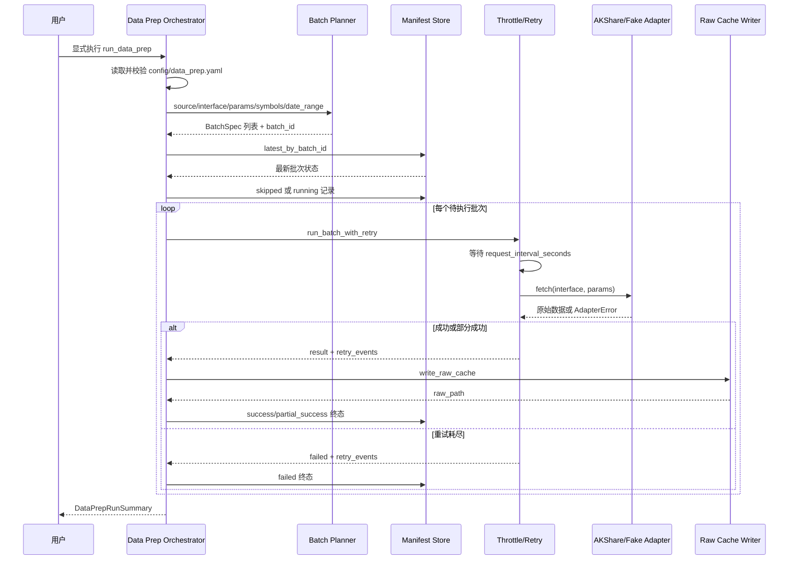

# LLD: STORY-002 - 数据准备节流重试与 manifest

> 本文档是 `STORY-002` 的低层设计。`confirmed=false` 时只允许人工评审，不得实现 `engine/data_prep.py`、`engine/akshare_adapter.py`、`engine/manifest.py`，不得修改 `engine/contracts.py`，不得写入 `data/raw/**`、`data/manifests/**` 或 `delivery/**`。

## 1. Goal

创建独立的数据准备编排设计，覆盖批次规划、保守节流、有限重试、指数抖动退避、断点续传、raw 缓存写入和 JSONL manifest 追加记录，使后续实现能够在显式数据准备入口中调用 AKShare，同时保证回测主路径不导入、不调用、不隐式触发联网补数。

本 Story 只设计并在后续实现 `engine/data_prep.py`、`engine/akshare_adapter.py`、`engine/manifest.py`，并在 `engine/contracts.py` 的 STORY-001 常量不足时做最小字段补充；不生成标准化 parquet、质量报告、回测逻辑、扫描逻辑、候选报告、安装脚本或 `delivery/**` 产物。

## 2. Requirements（Functional / Non-Functional）

### 2.1 Functional

- 数据准备入口接收 `source`、`interface`、`params`、`symbols`、`date_range`、`batch_size`、`force_refresh` 和节流/重试配置，输出可追踪的数据准备运行结果。
- Batch Planner 按稳定排序和固定批大小生成批次集合，单批 item 数 `<= batch_size`，默认 `batch_size=50`。
- Batch Planner 使用 canonical request payload 生成可复现 `batch_id`，相同 source/interface/params/symbol/date 范围生成相同批次 ID。
- Resume Filter 读取 `data/manifests/data_prep_manifest.jsonl`，在 `force_refresh=false` 且批次已有最新 `success` 记录时跳过该批次；最近 `recent_trade_days_backfill=5` 个交易日允许重新抓取。
- Throttle / Retry 保证默认相邻远程请求开始时间间隔 `>= request_interval_seconds=2` 秒，默认最大并发 `max_concurrency=1`。
- 同一批次最多执行 1 次初始请求加 `max_retries=3` 次重试；重试退避策略为 `exponential_jitter`，基础等待 2 秒，单次等待上限 60 秒。
- AKShare Adapter 只封装显式数据准备流程中的 AKShare 调用边界，返回原始表格/响应或结构化错误；测试必须可通过 fake adapter 完成，不依赖真实网络。
- Raw Cache Writer 将成功或部分成功的原始响应写入 `data/raw/<source>/<interface>/<YYYYMMDD>/<batch_id>.jsonl`，第一版长期保留，不自动清理。
- Manifest Store 以追加 JSONL 方式写入批次运行记录，覆盖 HLD §8.4 字段、重试事件、错误信息、raw 路径、状态和时间戳。
- 重试耗尽后批次状态写为 `failed` 或 `partial_success`，每次失败记录 `error_type`、`error_message`、`wait_seconds`、`attempt` 和失败时间。
- 实现阶段若 `engine/contracts.py` 的 manifest 字段常量不足，只补充 manifest 字段常量和状态枚举，不把运行逻辑放入契约模块。

### 2.2 Non-Functional

- 联网能力物理隔离在 `engine/data_prep.py` 经由 `engine/akshare_adapter.py` 的显式入口内；`engine/backtest.py`、`engine/scanner.py`、`engine/candidates.py` 不得导入数据准备模块作为自动补数路径。
- 第一版使用串行请求策略，默认 `max_concurrency=1`；不做并发优化作为验收阻塞项。
- Manifest 写入采用 append-only 策略，避免就地修改 JSONL 历史记录；断点续传通过读取同一 `batch_id` 的最新记录判定。
- 时间戳统一使用 UTC ISO 8601 毫秒精度，后缀 `Z`；日期范围使用 `YYYY-MM-DD` 字符串。
- 配置读取必须使用安全 YAML 解析或等价安全解析；不得使用 `eval`，不得从配置中执行代码。
- 错误必须结构化暴露，禁止静默吞掉 AKShare 异常、文件写入异常、manifest 解析异常或配置非法值。
- 测试默认使用 fake adapter 与临时目录，不调用真实 AKShare 网络接口，不写入真实 `data/raw/**` 或 `data/manifests/**`。
- Raw 缓存第一版长期保留，不提供自动清理逻辑；用户显式清理命令不属于本 Story。

## 3. 模块拆分与职责

| 模块 / 文件组 | 职责 | 说明 |
|---|---|---|
| Data Prep Orchestrator / `engine/data_prep.py` | 读取配置、规划批次、应用断点续传、调度节流重试、写 raw、写 manifest，并返回运行摘要 | 只允许显式执行数据准备时调用；不被回测主路径导入为自动补数 |
| Batch Planner / `engine/data_prep.py` | 将 source/interface/params/symbol/date 范围拆为稳定批次，生成 `batch_id`、`partition_date` 和 raw 路径候选 | 批次排序使用 exact canonical 语义，不做模糊匹配 |
| Throttle / Retry / `engine/data_prep.py` | 控制相邻请求间隔、最大并发、有限重试、指数抖动退避和 retry event 记录 | 默认串行；禁止无限循环 |
| AKShare Adapter / `engine/akshare_adapter.py` | 封装 AKShare 动态接口调用，返回原始响应或结构化错误对象 | 实现阶段必须支持 fake adapter 注入；测试不调用真实网络 |
| Manifest Store / `engine/manifest.py` | 读取 JSONL、追加批次记录、按 `batch_id` 聚合最新状态、提供 resume 查询 | `data/manifests/data_prep_manifest.jsonl` 是 checkpoint 事实源 |
| Raw Cache Writer / `engine/data_prep.py` | 将 adapter 返回的原始表格/响应写入 `.jsonl` raw 文件 | 路径遵循 `data/raw/<source>/<interface>/<YYYYMMDD>/<batch_id>.jsonl` |
| Contract Supplements / `engine/contracts.py` | 在 STORY-001 常量不足时补充 manifest 字段常量和状态枚举 | 仅限常量补充；不得执行 I/O、不得导入 AKShare |

## 4. 代码结构与文件影响范围

| 动作 | 文件路径 | 变更内容 |
|---|---|---|
| 创建 | `engine/manifest.py` | 实现 JSONL manifest 读取、追加写入、最新批次状态查询、成功批次过滤、结构化 manifest 记录构造和解析错误暴露 |
| 创建 | `engine/akshare_adapter.py` | 实现 AKShare 调用边界、接口名白名单/映射校验、结构化成功/错误返回、fake adapter 兼容协议 |
| 创建 | `engine/data_prep.py` | 实现配置读取、批次规划、`batch_id` 生成、resume filter、节流、重试退避、raw `.jsonl` 写入和运行摘要 |
| 修改 | `engine/contracts.py` | 仅在 STORY-001 常量不足时补充 `completed_at`、`success_items`、`failed_items`、`error_type`、`error_message`、`manifest_written_at`、`request_started_at`、`request_finished_at` 等 manifest 字段常量；保留纯常量模块 |
| 写入 | `data/raw/<source>/<interface>/<YYYYMMDD>/<batch_id>.jsonl` | 后续实现阶段由显式数据准备运行产生 raw 缓存；LLD 起草阶段不得写入 |
| 写入 | `data/manifests/data_prep_manifest.jsonl` | 后续实现阶段由 Manifest Store append-only 写入；LLD 起草阶段不得写入 |

文件边界排除项：本 Story 不创建 `engine/normalizer.py`、`engine/quality.py`、`reports/data_quality_report.*`、`data/prices.parquet`、`data/index_members.parquet`、`data/trade_calendar.parquet`，不修改回测、扫描、候选或策略模块。

## 5. 数据模型与持久化设计

### 5.1 BatchPlan / BatchSpec

| 对象 / 字段 | 类型 | 约束 | 说明 |
|---|---|---|---|
| `source` | `str` | 必需，默认示例为 `akshare` | 数据源标识 |
| `interface` | `str` | 必需，非空 | AKShare 接口名或逻辑接口名 |
| `request_params` | `dict[str, object]` | 必需，必须可 JSON 序列化 | 不包含 `run_id`、当前时间等非确定性字段 |
| `symbols` | `tuple[str, ...]` | 可为空；非空时按字典序稳定排序 | 股票范围输入 |
| `date_range` | `dict[str, str]` | 可为空；非空时包含 `start`、`end` | 日期范围输入，格式 `YYYY-MM-DD` |
| `items` | `tuple[str, ...]` 或 `tuple[dict, ...]` | 单批数量 `<= batch_size` | 批次内 item；优先由 symbols 拆分，无 symbols 时由日期切片或单请求构造 |
| `batch_id` | `str` | 必需，全局稳定 | 格式为 `<source>.<interface>.<range_key>.<digest16>` |
| `partition_date` | `str` | 8 位数字 | raw 路径中的 `YYYYMMDD`；取 `date_range.start`，无日期时取 params 中显式 `trade_date`/`snapshot_date`/`requested_for`，仍无则为 `00000000` |
| `raw_path` | `str` | 条件必需 | 成功或部分成功时写入 manifest |

`batch_id` 生成规则：

1. 构造 canonical payload：`source`、`interface`、规范化后的 `request_params`、批次 `items`、`date_range`、`schema_version`。
2. 对字典键按字典序排序；列表/元组按 Batch Planner 的稳定顺序写入；排除 `run_id`、`requested_at`、`force_refresh`、重试次数和当前时间。
3. 使用 UTF-8 JSON 文本计算 SHA-256，取前 16 个十六进制字符作为 `digest16`。
4. `range_key` 使用 `symbols`、`dates`、`single` 或 `mixed` 加首尾 item 摘要，最终格式示例：`akshare.stock_zh_a_hist.symbols-000001-600000.4f3a9c1b0d2e8a7b`。

### 5.2 Raw Cache

| 对象 / 字段 | 类型 | 约束 | 说明 |
|---|---|---|---|
| raw 文件路径 | `str` | `data/raw/<source>/<interface>/<YYYYMMDD>/<batch_id>.jsonl` | 与 `config/data_prep.yaml` 的 path pattern 对齐 |
| raw 扩展名 | `str` | 固定为 `.jsonl` | 第一版统一使用 JSON Lines，便于追加解析和人工检查 |
| 第一行 metadata | JSON object | `_record_type="batch_metadata"` | 包含 `schema_version`、`run_id`、`batch_id`、`source`、`interface`、`request_params`、`created_at` |
| 数据行 | JSON object | `_record_type="data"` 或 `_record_type="payload"` | 表格响应按行输出；非表格响应存为单行 payload |
| 保留策略 | string | `keep_forever` | 不自动清理；显式清理不属于本 Story |

### 5.3 Manifest Record

| 对象 / 字段 | 类型 | 约束 | 说明 |
|---|---|---|---|
| `schema_version` | `str` | 必需，第一版为 `1.0` | JSONL schema 版本 |
| `run_id` | `str` | 必需 | 单次数据准备运行 ID，建议格式 `dataprep-YYYYMMDDTHHMMSSZ-<digest8>` |
| `batch_id` | `str` | 必需 | Batch Planner 生成 |
| `source` | `str` | 必需 | 如 `akshare` |
| `interface` | `str` | 必需 | 数据源接口名或逻辑接口名 |
| `request_params` | `dict` | 必需 | 请求参数快照 |
| `symbol_range` | `list[str]` 或 `str` | 条件必需 | 与 `date_range` 至少一类可定位 |
| `date_range` | `dict[str, str]` | 条件必需 | `start`、`end` |
| `requested_at` | `str` | 必需 | 远程请求开始时间；UTC ISO 8601 毫秒 |
| `request_started_at` | `str` | 必需 | 与 `requested_at` 同义保留，便于测试节流断言 |
| `request_finished_at` | `str` | 条件必需 | 单次请求成功或失败返回时间 |
| `completed_at` | `str` | 终态必需 | 批次终态完成时间 |
| `manifest_written_at` | `str` | 必需 | 本条 JSONL 写入前生成的时间 |
| `attempts` | `int` | 必需，范围 `0..4` | 初始请求加已执行重试总次数；`running` 初始记录可为 0 |
| `retry_events` | `list[dict]` | 必需 | 每次失败与退避事件 |
| `raw_path` | `str` | 成功/部分成功必需 | raw `.jsonl` 文件路径 |
| `standardized_output_path` | `str` | STORY-002 可为空字符串或 `null` | 标准化 parquet 由 STORY-003 产生 |
| `coverage_start` / `coverage_end` | `str` | 可选日期 | 批次覆盖范围 |
| `success_items` / `failed_items` | `list` | 必需 | 成功和失败 symbol/date 或批次项 |
| `error_type` / `error_message` | `str` | 失败或部分成功时必需 | 结构化错误 |
| `status` | `str` | 必需，枚举 | `pending`、`running`、`success`、`partial_success`、`failed`、`skipped` |

Manifest append 顺序：

1. 若批次被 resume filter 跳过，追加 `status="skipped"` 记录，`attempts=0`，不写 raw。
2. 批次开始远程请求前追加 `status="running"` 记录，`attempts=0`，写入 `manifest_written_at`。
3. 每次请求失败后更新内存中的 `retry_events`，等待退避秒数后继续；不要求每次失败单独落一行，但终态记录必须包含完整 `retry_events`。
4. 成功 raw 写入完成后追加 `status="success"` 终态记录。
5. 部分 item 成功且部分失败时，成功 raw 写入完成后追加 `status="partial_success"` 终态记录。
6. 全部尝试耗尽且无可用 raw 时追加 `status="failed"` 终态记录。

断点续传读取策略：读取 JSONL 时按文件顺序保留每个 `batch_id` 的最后一条有效记录；只有最新终态为 `success` 且 `force_refresh=false` 且批次不属于最近 N 交易日回补范围时跳过。`partial_success` 不视为整批完成，后续运行应针对 `failed_items` 或原批次重新规划。

## 6. API / Interface 设计

| 接口 / 入口 | 输入 | 输出 | 调用方 | 说明 |
|---|---|---|---|---|
| `load_data_prep_config(config_path: str)` | `config/data_prep.yaml` 路径 | 配置字典或结构化配置对象 | Data Prep Orchestrator | 使用安全 YAML 解析，校验 exact key 和正数约束；测试 `T-CONFIG-01`、`T-ERROR-01` |
| `plan_batches(source, interface, params, symbols, date_range, batch_size)` | source/interface/params/symbol/date 范围和批大小 | `list[BatchSpec]` | Data Prep Orchestrator | 稳定排序、单批 `<=50`、生成可复现 `batch_id`；测试 `T-PLANNER-01`、`T-PLANNER-02` |
| `filter_resumable_batches(batches, manifest_store, force_refresh, recent_trade_days_backfill)` | 批次、manifest 最新状态、刷新策略 | 待执行批次和 skipped 记录 | Data Prep Orchestrator | 只跳过最新 `success` 批次；测试 `T-RESUME-01`、`T-RESUME-02` |
| `AkshareAdapter.fetch(interface: str, params: dict)` | 接口名和请求参数 | `AdapterResult` 或 `AdapterError` | Throttle / Retry | 真实 adapter 封装 AKShare；fake adapter 用于测试；测试 `T-ADAPTER-01`、`T-ERROR-03` |
| `run_batch_with_retry(batch, adapter, throttle_config)` | 单个批次、adapter、节流重试配置 | 成功/部分成功/失败结果和 retry events | Data Prep Orchestrator | 执行 1+3 尝试、退避、间隔控制；测试 `T-RETRY-01`、`T-RETRY-02`、`T-THROTTLE-01` |
| `ManifestStore.append(record)` | manifest 记录对象 | 写入后的路径和行号/序号 | Data Prep Orchestrator | append-only 写入 JSONL；测试 `T-MANIFEST-01`、`T-ERROR-02` |
| `ManifestStore.latest_by_batch_id()` | manifest 路径 | `dict[str, ManifestRecord]` | Resume Filter / 测试 | 按文件顺序取最新有效记录；测试 `T-MANIFEST-02`、`T-RESUME-01` |
| `write_raw_cache(batch, adapter_result, raw_root)` | 批次和原始响应 | raw `.jsonl` 路径 | Data Prep Orchestrator | 写 metadata 行和数据行；测试 `T-RAW-01`、`T-ERROR-04` |
| `run_data_prep(request, config_path, manifest_path, raw_root, adapter=None)` | 数据准备请求、配置路径、manifest 路径、raw 根目录、可选 adapter | 运行摘要：`run_id`、批次数、成功/失败/跳过数、manifest 路径 | 用户显式数据准备入口 / 测试 | STORY-002 主编排接口；测试 `T-E2E-FAKE-01` 至 `T-E2E-FAKE-04` |

错误暴露策略：

- 配置非法：抛出或返回 `DataPrepConfigError`，消息包含配置键名和非法值。
- Manifest 解析失败：抛出或返回 `ManifestFormatError`，消息包含文件路径和行号；不得静默忽略损坏行，除非调用方显式启用 future 的 repair 模式，本 Story 不实现 repair。
- Adapter 失败：返回结构化 `AdapterError(error_type, error_message, retryable)`，由 retry 层决定是否重试。
- Raw 写入失败：记录 `failed` manifest 终态，错误类型为 `RawCacheWriteError`，不得伪造成功。
- 父路径被普通文件占用：直接失败并暴露路径；不得输出 Python traceback 给普通用户。

## 7. 核心处理流程

1. 用户显式调用数据准备入口，传入 source/interface/params/symbol/date 范围；回测、扫描和候选入口不调用该流程。
2. Data Prep Orchestrator 读取 `config/data_prep.yaml`，校验 `request_interval_seconds > 0`、`batch_size > 0`、`max_concurrency == 1`、`max_retries >= 0`、`backoff_policy == "exponential_jitter"`。
3. Batch Planner 对 symbols 和 date 范围进行稳定排序和拆分，生成 `BatchSpec`、`batch_id`、`partition_date` 与 raw 路径。
4. Manifest Store 读取历史 JSONL，按 `batch_id` 汇总最新状态。
5. Resume Filter 在 `force_refresh=false` 时跳过已成功且不在最近 N 交易日回补范围内的批次，并为跳过批次追加 `skipped` manifest 记录。
6. 对每个待执行批次，Manifest Store 先追加 `running` 记录。
7. Throttle / Retry 等待满足相邻远程请求间隔后调用 adapter；失败时记录 retry event，按指数抖动退避等待，直到成功或尝试次数达到上限。
8. 成功或部分成功后 Raw Cache Writer 写入 `.jsonl` raw 文件；写入成功后追加 `success` 或 `partial_success` 终态 manifest。
9. 重试耗尽且无成功 item 时追加 `failed` 终态 manifest。
10. Orchestrator 返回运行摘要，包含 `run_id`、批次数、成功数、失败数、部分成功数、跳过数、manifest 路径和 raw 路径列表。



异常路径：

- 配置缺失或非法：停止运行，不规划批次，不调用 adapter，不写 raw；若 manifest 路径父目录可写，可追加全局失败记录，否则只返回结构化错误。
- manifest 文件不存在：视为空历史；创建父目录后在首次 append 时创建文件。
- manifest JSONL 存在损坏行：停止运行并暴露行号；不根据部分读取结果继续执行，避免错误断点续传。
- 父路径被普通文件占用：停止运行，错误消息包含被占用路径，不输出 traceback。
- adapter 失败且 `retryable=true`：按重试策略继续，直到 1+3 次尝试耗尽。
- adapter 失败且 `retryable=false`：不继续重试，直接写终态 `failed`。
- raw 写入失败：追加 `failed` 终态，`error_type="RawCacheWriteError"`；不追加 `success`。
- manifest 终态写入失败：返回失败，raw 文件可保留但运行摘要标记 manifest 写入失败；后续质量报告不得把未入 manifest 的 raw 视为可信输入。

## 8. 技术设计细节

- Batch Planner 算法：
  - 输入：`source`、`interface`、`params`、`symbols`、`date_range`、`batch_size`。
  - 规范化：移除空值和非确定性字段，字典键排序，symbols 去重后字典序排序，日期使用 `YYYY-MM-DD`。
  - 拆分：若 symbols 非空，以 symbols 为 item 按 `batch_size` 切片；若 symbols 为空但 date range 需要按日拆分，以日期 item 切片；若接口本身是单请求，创建 1 个 `single` 批次。
  - 输出：稳定 `BatchSpec` 列表，顺序只由 canonical 输入决定，不受运行时间影响。
- Manifest 追加一致性：
  - JSONL append-only，不重写历史行。
  - 同一 `batch_id` 允许多条记录；resume 只信任最后一条有效记录。
  - `manifest_written_at` 在写入前生成；测试按该字段和文件顺序验证终态覆盖。
- Raw 文件格式：
  - 第一版固定扩展名 `.jsonl`。
  - 第一行写 `_record_type="batch_metadata"`；后续表格行写 `_record_type="data"`，非表格响应写 `_record_type="payload"`。
  - raw path 的 `YYYYMMDD` 由 `partition_date` 决定，保持可复现；无日期定位时使用 `00000000`。
- 重试退避伪代码：

```text
attempt = 0
while attempt <= max_retries:
    wait_until_next_request_slot(request_interval_seconds)
    request_started_at = now_utc_ms()
    result = adapter.fetch(interface, request_params)
    request_finished_at = now_utc_ms()
    if result.ok:
        return success(result, retry_events)
    retry_events.append({
        "attempt": attempt + 1,
        "failed_at": request_finished_at,
        "error_type": result.error_type,
        "error_message": result.error_message,
        "wait_seconds": 0 if attempt == max_retries else compute_backoff(attempt),
    })
    if not result.retryable or attempt == max_retries:
        return failed(retry_events)
    sleep(retry_events[-1]["wait_seconds"])
    attempt += 1
```

- `compute_backoff(attempt)` 规则：
  - `base = backoff_base_seconds`，默认 2。
  - `cap = backoff_max_seconds`，默认 60。
  - `raw_wait = min(cap, base * (2 ** attempt))`。
  - `jitter = deterministic_or_random_uniform(0, min(base, raw_wait * 0.1))`；测试可注入固定 jitter，使断言稳定。
  - `wait_seconds = min(cap, raw_wait + jitter)`。
- 时间戳精度：
  - `requested_at` / `request_started_at`：每次远程请求开始前，UTC ISO 8601 毫秒。
  - `request_finished_at`：adapter 返回或抛出结构化错误后，UTC ISO 8601 毫秒。
  - `failed_at`：retry event 中的失败发生时间，等于该次 `request_finished_at`。
  - `completed_at`：批次进入终态前生成，UTC ISO 8601 毫秒。
  - `manifest_written_at`：每条 manifest 行写入前生成，UTC ISO 8601 毫秒。
- AKShare Adapter 边界：
  - 真实 adapter 只在 `engine/akshare_adapter.py` 中导入或访问 AKShare。
  - adapter 接口支持测试注入 fake adapter，fake adapter 可按 batch_id 或调用序号返回成功、可重试失败、不可重试失败或部分成功。
  - 不在 LLD 或测试中调用真实 AKShare 网络接口。
- `engine/contracts.py` 最小修改策略：
  - 当前 STORY-001 已提供 `MANIFEST_REQUIRED_FIELDS` 和 `MANIFEST_STATUS_VALUES`。
  - 实现阶段若测试需要新增字段常量，只追加 tuple 中的字段名并更新 `__all__`；不得引入 dataclass、TypedDict、pydantic、I/O、AKShare 或文件系统访问。
- 与 STORY-003 边界：
  - `standardized_output_path` 在 STORY-002 记录为空字符串或 `null`；标准化 parquet 由 STORY-003 写入并可追加后续 manifest 关联记录。
  - 本 Story 不生成 `reports/data_quality_report.*`，不判断质量状态 `pass/warn/fail`。
- 图示类型选择：本 Story 跨 Data Prep、Manifest、Adapter、Raw Cache 四个模块并包含异常路径，使用时序图说明核心流程。

## 9. 安全与性能设计

| 维度 | 设计措施 | 验证方式 |
|---|---|---|
| 安全 | 只有 `engine/akshare_adapter.py` 可封装真实 AKShare 调用；回测、扫描、候选模块不得导入 Data Prep 自动补数 | 静态检查 import 关系；测试 `T-NETWORK-BOUNDARY-01` |
| 安全 | 配置解析使用安全 YAML 解析；禁止 `eval`、`exec`、shell 拼接和从配置执行代码 | 静态扫描；测试 `T-CONFIG-01` |
| 安全 | 错误消息不得包含 token、cookie、私钥；本 Story 不需要任何凭据 | 人工检查和 dangerous pattern 扫描 |
| 安全 | 写入前逐级校验父路径为目录；普通文件占用路径时 fail fast | 测试 `T-ERROR-04` |
| 可靠性 | manifest append-only，并通过最新记录恢复批次状态 | 测试 `T-MANIFEST-01`、`T-MANIFEST-02`、`T-RESUME-01` |
| 可靠性 | adapter 失败以结构化错误进入 retry events 和 manifest 终态 | 测试 `T-RETRY-02`、`T-E2E-FAKE-02` |
| 性能 | 默认 `max_concurrency=1`、`request_interval_seconds=2`，降低免费数据源压力 | fake clock 或可注入 sleeper 验证相邻请求间隔 |
| 性能 | 批次规划按 list 切片，单批 `<=50`；不在内存中保留不必要的 raw 全量副本 | 大小边界测试 `T-PLANNER-02` |
| 可追溯性 | raw path、manifest `batch_id`、`run_id`、retry events 和时间戳完整记录 | manifest 字段测试 `T-MANIFEST-01` |

## 10. 测试设计

| 测试场景 | 前置条件 | 操作 | 预期结果 | 验证方式 |
|---|---|---|---|---|
| `T-CONFIG-01` 配置读取合法 | 临时目录含 STORY-001 格式配置 | 调用 `load_data_prep_config` | 返回配置包含 10 个键；默认间隔 2、批大小 50、并发 1、重试 3 | 单元测试 |
| `T-ERROR-01` 配置非法失败 | 配置中 `request_interval_seconds=0` 或 `batch_size=0` | 调用配置读取 | 返回/抛出结构化配置错误，消息含非法键名；不调用 adapter | 单元测试 |
| `T-PLANNER-01` batch_id 可复现 | 相同 source/interface/params/symbol/date 输入 | 连续调用 `plan_batches` 两次 | 批次数、顺序和 `batch_id` 完全一致 | 单元测试 |
| `T-PLANNER-02` 单批规模上限 | 输入 101 个 symbol，`batch_size=50` | 调用 `plan_batches` | 输出 3 批；每批 item 数分别为 50、50、1 | 单元测试 |
| `T-RESUME-01` 跳过已成功批次 | manifest 临时文件含某 batch 最新 `success` | `force_refresh=false` 调用 resume filter | 该批次进入 skipped，不调用 adapter，追加 `skipped` 记录 | fake manifest 单元测试 |
| `T-RESUME-02` force refresh 重抓 | manifest 含 `success`，但 `force_refresh=true` | 调用数据准备入口 | 该批次仍执行 adapter，不按 success 跳过 | fake adapter 集成测试 |
| `T-THROTTLE-01` 请求间隔 | fake clock/sleeper 可注入，两个待执行批次 | 运行数据准备 | 两次 `request_started_at` 间隔 `>=2` 秒 | 单元测试或 fake clock |
| `T-RETRY-01` 成功前重试 | fake adapter 前 2 次返回 retryable error，第 3 次成功 | 运行单批 | `attempts=3`，`retry_events` 2 条，终态 `success` | fake adapter 单元测试 |
| `T-RETRY-02` 重试耗尽 | fake adapter 连续 4 次 retryable error | 运行单批 | 最多 1 次初始请求 + 3 次重试；终态 `failed`；无无限循环 | fake adapter 单元测试 |
| `T-ADAPTER-01` fake adapter 成功 | fake adapter 返回表格型数据 | 调用 `run_data_prep` | raw `.jsonl` 生成于临时 raw root；manifest 终态 `success` | 临时目录集成测试 |
| `T-ERROR-03` 不可重试错误 | fake adapter 返回 `retryable=false` | 运行单批 | 只尝试 1 次；终态 `failed`；retry event 记录错误类型 | fake adapter 单元测试 |
| `T-MANIFEST-01` manifest 字段完整 | 临时 manifest 路径可写 | 运行成功批次 | 终态记录覆盖 HLD §8.4 字段和本 LLD 时间戳字段 | JSONL 解析断言 |
| `T-MANIFEST-02` latest 查询 | 同一 `batch_id` 有 running 后 success | 调用 `latest_by_batch_id` | 返回 success 作为最新记录 | 单元测试 |
| `T-RAW-01` raw 格式 | fake adapter 返回两行数据 | 调用 raw writer | `.jsonl` 第一行为 metadata，后续两行为 data | 临时文件断言 |
| `T-ERROR-02` manifest 损坏行 | manifest 临时文件含非法 JSON 行 | 调用 latest 查询 | 返回/抛出 `ManifestFormatError`，包含行号；不继续抓取 | 单元测试 |
| `T-ERROR-04` 父路径被文件占用 | 临时 raw 父路径位置创建普通文件 | 运行 raw writer | fail fast，错误消息含被占用路径；无 traceback 暴露 | 单元测试 |
| `T-E2E-FAKE-01` 成功批次 | fake adapter 全成功 | 运行 2 个批次 | 成功数 2，失败数 0，manifest 有 running + success/skipped 记录 | 临时目录集成测试 |
| `T-E2E-FAKE-02` 失败重试 | fake adapter 连续失败 | 运行单批 | 失败数 1，`attempts=4`，retry events 完整 | 临时目录集成测试 |
| `T-E2E-FAKE-03` 断点续传 | 第一次成功后第二次 `force_refresh=false` | 运行两次 | 第二次不调用 adapter，生成 skipped 记录 | fake adapter 调用计数 |
| `T-E2E-FAKE-04` 部分成功 | fake adapter 返回部分成功和 failed_items | 运行单批 | manifest 终态 `partial_success`，raw 存成功数据，failed_items 非空 | 临时目录集成测试 |
| `T-NETWORK-BOUNDARY-01` 回测主路径隔离 | 后续回测/扫描/候选文件不存在或不导入 data_prep | 静态扫描 import | 不存在从回测主路径到 `engine.data_prep` / `engine.akshare_adapter` 的自动补数导入 | 静态检查 |

第 6 节接口均有测试入口：配置读取对应 `T-CONFIG-01`，批次规划对应 `T-PLANNER-*`，resume 对应 `T-RESUME-*`，adapter 对应 `T-ADAPTER-01` / `T-ERROR-03`，retry 对应 `T-RETRY-*`，manifest 对应 `T-MANIFEST-*`，raw 对应 `T-RAW-01`，主编排对应 `T-E2E-FAKE-*`。

第 7 节异常路径均有错误测试入口：配置非法对应 `T-ERROR-01`，manifest 损坏对应 `T-ERROR-02`，adapter 失败对应 `T-ERROR-03`，路径占用/raw 写入失败对应 `T-ERROR-04`，重试耗尽对应 `T-RETRY-02`。

## 11. 实施步骤

| TASK-ID | 动作 | 目标文件 | 详细描述 | 对应测试 |
|---|---|---|---|---|
| S002-T1 | 创建 | `engine/manifest.py` | 实现 `ManifestStore`、append-only JSONL 写入、latest 查询、resume 所需状态聚合、manifest 记录构造和解析错误 | `T-MANIFEST-01`, `T-MANIFEST-02`, `T-RESUME-01`, `T-ERROR-02` |
| S002-T2 | 创建 | `engine/akshare_adapter.py` | 实现 `AkshareAdapter.fetch`、结构化 `AdapterResult` / `AdapterError`、接口名校验和 fake adapter 协议兼容；真实 AKShare 仅封装在本文件 | `T-ADAPTER-01`, `T-ERROR-03`, `T-NETWORK-BOUNDARY-01` |
| S002-T3 | 创建 | `engine/data_prep.py` | 实现配置读取、Batch Planner、`batch_id`、resume filter、节流重试、指数抖动退避、raw `.jsonl` 写入和 `run_data_prep` 运行摘要 | `T-CONFIG-01`, `T-ERROR-01`, `T-PLANNER-01`, `T-PLANNER-02`, `T-THROTTLE-01`, `T-RETRY-01`, `T-RETRY-02`, `T-RAW-01`, `T-E2E-FAKE-01` 至 `T-E2E-FAKE-04`, `T-ERROR-04` |
| S002-T4 | 修改 | `engine/contracts.py` | 若 STORY-001 字段不足，最小补充 manifest 字段常量和状态枚举，保持纯常量、无 I/O、无 AKShare、无重型依赖导入 | `T-MANIFEST-01`, `T-NETWORK-BOUNDARY-01` |

文件影响范围与 TASK-ID 对应关系：

| 文件影响项 | 覆盖 TASK-ID |
|---|---|
| `engine/manifest.py` | S002-T1 |
| `engine/akshare_adapter.py` | S002-T2 |
| `engine/data_prep.py` | S002-T3 |
| `engine/contracts.py` | S002-T4 |
| `data/raw/<source>/<interface>/<YYYYMMDD>/<batch_id>.jsonl` | S002-T3 |
| `data/manifests/data_prep_manifest.jsonl` | S002-T1, S002-T3 |

实现顺序必须按 TASK-ID 串行推进：先 manifest，再 adapter，再 data prep 编排，最后仅在测试暴露字段不足时补充 contracts。不得先创建 STORY-003 的 normalizer 或 quality reporter。

## 12. 风险、难点与预研建议

| 风险 / 难点 | 影响 | 缓解措施 / 预研建议 |
|---|---|---|
| AKShare 接口返回结构不稳定 | raw 写入或后续标准化失败 | Adapter 不做标准化，只保存原始响应；字段映射留给 STORY-003；manifest 记录接口和参数快照 |
| 免费数据源限速或临时不可用 | 数据准备耗时或批次失败 | 默认串行、2 秒间隔、有限重试、指数退避；失败进入 manifest，不污染回测主路径 |
| manifest append 成功但 raw 写入失败 | 断点续传误判成功 | 先写 running，再写 raw，raw 成功后才写 success/partial_success；raw 失败写 failed |
| raw 写入成功但 manifest 终态写入失败 | raw 文件存在但不可被审计链路消费 | 运行摘要标记 manifest 写入失败；后续 STORY-003 不消费未入 manifest 的 raw |
| `partial_success` 的续传语义复杂 | 后续运行可能重复抓取成功 item | 第一版不把 partial_success 视为整批完成；后续按 failed_items 或原批次重试，优先正确性 |
| `batch_id` 受到 params 顺序影响 | 同一请求无法断点续传 | 使用 canonical JSON、排序键和排除非确定性字段；测试两次生成一致 |
| `.jsonl` raw 对非表格响应表达不直观 | 后续 normalizer 解析分支增加 | 使用 `_record_type="payload"` 保存非表格响应；STORY-003 按 record_type 分支解析 |
| `engine/contracts.py` 字段补充过度 | 契约模块范围膨胀 | 只补充 manifest 字段常量和状态枚举；运行时类型、dataclass、错误类留在 STORY-002 模块 |
| 真实网络测试不可控 | 验收不稳定且可能触发限速 | STORY-002 验收以 fake adapter 为准；真实 AKShare smoke test 不作为必需验收 |

### OPEN / Spike 跟踪

| ID | 类型（OPEN / Spike） | 问题 | 下一动作 | 责任方 |
|---|---|---|---|---|
| - | 无 | 无阻塞性 OPEN / Spike；raw 扩展名、manifest 追加顺序、batch_id 规则、时间戳口径和 fake adapter 验证方式均已在本 LLD 固化 | meta-po 发起人工确认；用户确认后方可实现 | meta-po / 用户 |

## 13. 回滚与发布策略

- 发布方式：本 Story 后续实现以仓库源码形式提供显式数据准备能力；不生成安装脚本，不写入 `delivery/**`，不发布为独立包。
- 回滚触发条件：
  - LLD 人工确认被拒绝或要求重设 raw/manifest/batch_id 关键设计。
  - 实现后发现 `engine/data_prep.py` 被回测主路径导入为自动补数，违反 ADR-001。
  - manifest 断点续传存在误跳过失败批次或伪成功风险。
  - 节流/重试测试无法证明相邻请求间隔、最大尝试次数或无无限循环。
- 回滚动作：
  - 删除或回退 `engine/data_prep.py`、`engine/akshare_adapter.py`、`engine/manifest.py` 中本 Story 引入的实现。
  - 回退 `engine/contracts.py` 中本 Story 追加的 manifest 字段常量，但保留 STORY-001 已验证常量。
  - 不删除 `process/` 中的 Story、LLD、确认记录或 DEV-LOG。
  - 对测试产生的临时 raw/manifest 目录执行清理；不得删除用户真实 `data/raw/**` 或 `data/manifests/**`。
- 后续变更策略：若 STORY-003 需要扩展 `standardized_output_path`、质量报告关联或 raw 解析语义，必须在 STORY-003 LLD 中声明与本 manifest schema 的兼容关系；不得直接重写 STORY-002 断点续传事实源。

## 14. Definition of Done

- [ ] 14 个章节全部填写完成，并保留 `tier`、`shared_fragments`、`open_items` frontmatter 强输入字段。
- [ ] LLD `confirmed=false` 时不进入实现，不创建 `engine/data_prep.py`、`engine/akshare_adapter.py`、`engine/manifest.py`，不修改 `engine/contracts.py`。
- [ ] Batch Planner 设计覆盖 source、interface、params、symbol/date 范围和 batch_size 输入，并输出稳定批次集合。
- [ ] `batch_id` 生成规则可复现，排除 run_id、当前时间和 force_refresh 等非确定性字段。
- [ ] Raw 缓存第一版扩展名、路径模板、metadata/data 行格式和长期保留策略已明确。
- [ ] Manifest JSONL 字段、append 顺序、run_id、批次状态、断点续传查询和时间戳口径已明确。
- [ ] 重试退避伪代码覆盖 1 次初始请求 + 3 次重试、`exponential_jitter`、等待秒数记录和禁止无限循环。
- [ ] fake adapter 测试覆盖成功批次、失败重试、断点续传、`force_refresh=false`、部分成功和 raw/manifest 错误路径。
- [ ] 第 6 节每个接口均在第 10 节有对应验证入口。
- [ ] 第 7 节异常路径均在第 10 节有错误路径验证入口。
- [ ] 第 11 节 TASK-ID 与第 4 节文件影响范围一一对应。
- [ ] 与 STORY-003 边界明确：本 Story 不生成标准化 parquet、quality reporter 或 `reports/data_quality_report.*`。
- [ ] 人工确认意见已收敛，Story 状态由 meta-po 推进到 `lld-approved` 后才允许实现。

## 人工确认区

> **元工作流检查点 ④ - Story LLD 确认**
> meta-po 发起，用户确认后方可进入实现。

**确认选项**：
1. 批准 - LLD 设计合理，允许进入实现。
2. 需要修改 - 指出具体修改点后由 meta-dev 更新重提。
3. 拒绝 - 设计方向有根本问题，需重新设计。

**本轮需人工确认的设计点**：

- 是否接受 raw 缓存第一版统一使用 `.jsonl`，并以第一行 metadata、后续 data/payload 行表达原始响应。
- 是否接受 `batch_id` 采用 canonical JSON + SHA-256 前 16 位摘要，格式为 `<source>.<interface>.<range_key>.<digest16>`。
- 是否接受 manifest append 顺序为 `skipped` 或 `running` 先行，成功/部分成功/失败终态后写；resume 只读取每个 `batch_id` 的最新记录。
- 是否接受 `partial_success` 不视为整批完成，后续运行仍可针对失败项或原批次重试。
- 是否接受 STORY-002 中 `standardized_output_path` 可为空字符串或 `null`，由 STORY-003 标准化 parquet 产物再补充关联。

**确认记录**：

| 日期 | 用户回复 | meta-po 判定 | 状态更新 |
|---|---|---|---|
| 2026-05-14 | 确认通过 | STORY-002 LLD 人工确认通过 | LLD `confirmed=true`；Story 可推进到 `lld-approved`；允许按本 LLD 限定范围创建 meta-dev 实现交接 |
