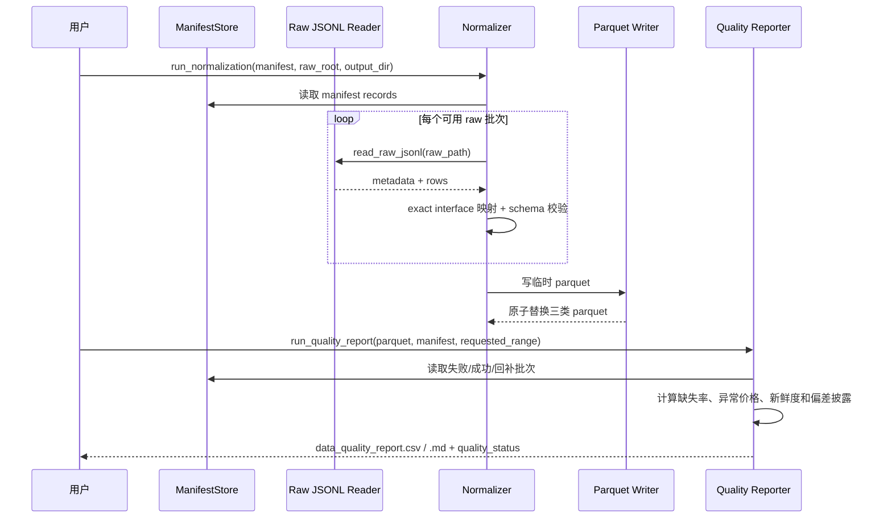

# LLD: STORY-003 - 标准化 parquet 与数据质量报告

> 本文档当前包含 CR-004 Batch D 最小 addendum，已通过 CP5 人工确认。后续若进入实现，只能按本 LLD 限定范围处理 legacy quality 与 CR-004 字段对齐边界；不得联网抓取数据，不得自动修复数据，不得生成真实 `data/*.parquet`、`reports/data_quality_report.*`、`delivery/**`、安装脚本或越界测试实现。
>
> 本 addendum 仅用于澄清 legacy quality 与 CR-004 quality 字段关系：legacy STORY-003 报告只有在字段完整对齐 CR-004 必需质量字段时，才能作为 Data Loader 机器事实源；否则它只能作为历史/人工材料，不作为新验收事实源。不得因本 addendum 抓取数据、补数据或生成真实质量报告。

## 0. 修订记录

| 版本 | 日期 | 修订人 | 变更要点 |
|---|---|---|---|
| 1.2 | 2026-05-17 | meta-po | 回填 CP5 Batch D 人工确认结果：用户回复“通过”，允许后续按本 addendum 限定范围处理 legacy quality 与 CR-004 字段对齐边界；仍禁止联网、真实数据、真实质量报告和越界实现。 |
| 1.1 | 2026-05-17 | meta-dev | CR-004 Batch D 最小 addendum：明确 legacy quality 与 CR-004 quality 字段对齐规则；字段缺失时 legacy 不作为新验收事实源；Markdown human-only；不得联网、抓取数据、自动修复或生成真实报告；重置为 CP5 待确认草案。 |
| 1.0 | 2026-05-15 | meta-dev / meta-po | STORY-003 初版 LLD 经批量 LLD / Story Package 人工确认；设计标准化 parquet 与 legacy quality report。 |

## 1. Goal

创建 raw cache 到标准化 parquet 的标准化设计，并创建数据质量报告设计。后续实现必须从 `data/raw/**` 与 `data/manifests/data_prep_manifest.jsonl` 派生 `data/prices.parquet`、`data/index_members.parquet`、`data/trade_calendar.parquet`，校验字段契约、覆盖区间、缺失率、重复键、异常价格、数据源失败和新鲜度，并输出可供 STORY-004 离线 Data Loader 消费的 `pass/warn/fail` 质量状态。

本 Story 只设计并在后续实现 `engine/normalizer.py`、`engine/quality.py`，并对 `engine/contracts.py` 做质量报告字段与 schema version 的最小常量补充；不实现策略回测、Data Loader、参数扫描、候选报告、PIT provider、自动 raw 清理、联网 AKShare 调用、安装脚本或 `delivery/**` 产物。

CR-004 Batch D addendum：STORY-003 的 legacy quality CSV/Markdown 不自动升级为 CR-004 新验收事实源。后续 Data Loader 主路径只能消费机器可读 CSV 或显式内存 quality summary；legacy CSV 若缺少 CR-004 必需字段，Data Loader 必须 fail fast 或按 LLD 明确不把它作为新质量事实源，不能用 Markdown 补齐，不能自动生成新报告。

## 2. Requirements（Functional / Non-Functional）

### 2.1 Functional

- Normalizer 读取 STORY-002 生成的 raw `.jsonl` 与 manifest 终态记录，只消费 `success`、`partial_success`、`skipped` 中有可用 raw 或已有 parquet 覆盖的批次；`failed` 批次进入质量报告统计。
- Normalizer 按 exact interface 映射将 raw 数据派生为三类 parquet：`prices`、`index_members`、`trade_calendar`；未知 interface 或无法映射字段时返回结构化失败。
- `data/prices.parquet` 必含 `trade_date`、`symbol`、`close`；可含 `available_at`、`adjustment_policy`、`volume`、`amount`、`is_suspended`、`limit_up`、`limit_down`。
- `data/index_members.parquet` 必含 `symbol`；可含 `snapshot_date`、`available_at`、`is_pit_universe`、`index_code`。第一版缺 `is_pit_universe` 时填充 `false` 并在质量报告中警示。
- `data/trade_calendar.parquet` 必含 `trade_date`；可含 `is_open`。存在 `is_open` 时仅 `true` 计入开市日和新鲜度计算。
- 标准化写 parquet 前执行 schema、类型、日期解析、重复键、复权口径和价格异常校验；`close <= 0` 的非缺失值必须进入 `fail`。
- Quality Reporter 读取三类 parquet 与 manifest，输出覆盖区间、缺失率、失败数、失败 symbol/date、字段缺失、重复记录、异常价格、回补交易日、回补记录、最近成功更新时间、交易日新鲜度、自然日新鲜度、`quality_status`、`manifest_run_id` 等字段。
- 质量状态只允许 `pass`、`warn`、`fail`。必需字段缺失、覆盖缺口、未解决重复键、异常价格或请求区间缺失率 `> 5%` 为 `fail`；`0 < missing_rate <= 5%` 为 `warn`。
- 数据源失败但本地 parquet 对请求区间合规时，质量报告必须披露失败批次；若失败不影响请求区间，可输出 `warn` 或在无其他质量问题时保持 `pass` 并记录 `failed_batch_count`。
- 删除标准化 parquet 但保留 raw 与 manifest 时，后续实现必须能重新派生等价 schema 的 parquet；raw 第一版长期保留，不自动清理。

### 2.2 Non-Functional

- 本 Story 不触发联网，不导入或调用 AKShare；测试使用 raw fixture、manifest fixture 和临时目录。
- Parquet 写入采用临时文件后原子替换策略；写入失败时不得破坏已有合规 parquet。
- `engine/contracts.py` 继续保持常量模块，不引入 I/O、pandas、pyarrow、AKShare、dataclass、TypedDict 或 pydantic model。
- 所有错误必须结构化暴露，包含 dataset、字段名、raw_path、manifest_run_id 或 parquet_path 等定位信息；不得静默吞掉字段映射失败、parquet 读取失败或 manifest 损坏。
- 第一版质量报告固定输出 CSV 与 Markdown 两种形态：CSV 是 canonical source，Markdown 仅供人工检查；复杂列表字段必须以 JSON 字符串写入 CSV，字段名统一使用 `_json` 后缀。
- 质量报告阈值必须显式配置或来自可追溯默认常量，不得在代码中隐藏写死；报告必须披露 `denominator_mode`、coverage、fetch/dataset 双状态和可复现字段。
- 未来函数和幸存者偏差防护必须可检测：标准化 parquet 或质量报告必须披露 `available_at` / `available_at_rule`、`adjustment_policy`、`is_pit_universe`、`snapshot_date`、`survivorship_bias_note`。
- CR-004 新验收路径要求 legacy quality CSV 至少对齐 `quality_status`、`fetch_status`、`dataset_status`、`denominator_mode`、coverage 字段、显式 thresholds、可复现字段、non-PIT 披露字段；任一机器必需字段缺失时，Data Loader 主路径必须拒绝该报告，不得从 Markdown 或真实抓取路径补齐。
- Markdown 报告始终 human-only；不得作为 Data Loader、CLI、实验入口或质量门的机器解析来源。
- 本 addendum 不授权 STORY-003 重新联网、抓取行情、自动修复 parquet、自动生成 CR-004 quality 报告或修改已验证实现。

## 3. 模块拆分与职责

| 模块 / 文件组 | 职责 | 说明 |
|---|---|---|
| Normalizer / `engine/normalizer.py` | 读取 raw 与 manifest，按 dataset 映射执行字段标准化、类型转换、去重策略、schema 校验和 parquet 写入 | 使用 `process/HLD.md#8.3-标准化-parquet-schema`；不得联网 |
| Raw JSONL Reader / `engine/normalizer.py` | 解析 STORY-002 raw `.jsonl`：第一行 `batch_metadata`，后续 `data` 或 `payload` 行 | 损坏 JSONL、缺 metadata、payload 不可表格化时结构化失败 |
| Dataset Mapper / `engine/normalizer.py` | 将 exact interface 或显式 `target_dataset` 映射到 `prices`、`index_members`、`trade_calendar` | 未命中映射时 `NormalizationMappingError`；不做模糊匹配 |
| Parquet Writer / `engine/normalizer.py` | 使用 pandas + pyarrow 写入三类 parquet，写入前排序、去重、校验 schema version | 写临时文件后替换，失败时保留旧文件 |
| Quality Reporter / `engine/quality.py` | 读取 parquet 与 manifest，计算覆盖、缺失率、失败批次、重复、异常价格、回补和新鲜度，生成 CSV/Markdown 报告 | 使用 `process/HLD.md#8.5-质量报告规则` 和 ADR-006 |
| Manifest Association / `engine/quality.py` | 将质量报告与 manifest `run_id`、`batch_id`、`raw_path`、`standardized_output_path` 关联 | 默认不重写历史 manifest；报告输出 `manifest_run_id` 和 source manifest path |
| Contract Supplements / `engine/contracts.py` | 补充 `PARQUET_SCHEMA_VERSION`、`QUALITY_REPORT_FIELDS`、`QUALITY_REPORT_FORMATS`、`DATASET_NAMES` 等常量 | 仅常量补充；保持无 I/O、无运行时依赖 |

## 4. 代码结构与文件影响范围

| 动作 | 文件路径 | 变更内容 |
|---|---|---|
| 创建 | `engine/normalizer.py` | 实现 raw JSONL 读取、dataset exact 映射、字段别名映射、标准化 DataFrame 构造、schema 校验、重复键处理、parquet 原子写入和标准化运行摘要 |
| 创建 | `engine/quality.py` | 实现 parquet/manifest 读取、质量指标计算、`pass/warn/fail` 判定、数据新鲜度计算、未来函数/幸存者偏差可检测字段披露、CSV/Markdown 报告渲染 |
| 修改 | `engine/contracts.py` | 追加 parquet schema version、dataset 名称、质量报告字段、质量报告格式常量；不得加入 I/O 或运行逻辑 |
| 写入 | `data/prices.parquet` | 后续实现运行时生成价格标准化 parquet；LLD 阶段不得生成 |
| 写入 | `data/index_members.parquet` | 后续实现运行时生成股票池标准化 parquet；LLD 阶段不得生成 |
| 写入 | `data/trade_calendar.parquet` | 后续实现运行时生成交易日历标准化 parquet；LLD 阶段不得生成 |
| 写入 | `reports/data_quality_report.csv` | 后续实现运行时生成机器可读质量报告；LLD 阶段不得生成 |
| 写入 | `reports/data_quality_report.md` | 后续实现运行时生成人工可读质量报告；LLD 阶段不得生成 |

文件边界排除项：本 Story 不创建或修改 `engine/data_loader.py`、`engine/backtest.py`、`engine/scanner.py`、`engine/candidates.py`、`strategies/**`、`delivery/**`、安装脚本和真实 raw/manifest 数据文件；不自动清理 `data/raw/**`。

## 5. 数据模型与持久化设计

### 5.1 RawBatchInput

| 对象 / 字段 | 类型 | 约束 | 说明 |
|---|---|---|---|
| `manifest_run_id` | `str` | 必需 | 取 manifest 记录 `run_id`；质量报告通过该字段关联 |
| `batch_id` | `str` | 必需 | STORY-002 生成的稳定批次 ID |
| `raw_path` | `str` | 成功/部分成功批次必需 | 指向 raw `.jsonl`；不存在时该批次进入失败统计 |
| `interface` | `str` | 必需 | exact 映射到 dataset；未知则失败 |
| `status` | `str` | 枚举 | `success`、`partial_success`、`failed`、`skipped` 等 |
| `coverage_start` / `coverage_end` | `str` | 可选日期 | 用于覆盖区间和失败影响范围判断 |
| `success_items` / `failed_items` | `list` | 必需 | 写入质量报告的成功/失败 symbol/date |

### 5.2 Raw JSONL 格式

| 对象 / 字段 | 类型 | 约束 | 说明 |
|---|---|---|---|
| metadata 行 | JSON object | 第一行，`_record_type="batch_metadata"` | 含 `schema_version`、`run_id`、`batch_id`、`source`、`interface`、`request_params`、`created_at` |
| data 行 | JSON object | `_record_type="data"` | 表格响应逐行存储；直接进入字段映射 |
| payload 行 | JSON object | `_record_type="payload"` | 非表格响应；必须能展开为记录列表，否则映射失败 |

### 5.3 标准化 Parquet Schema

| 对象 / 字段 | 类型 | 约束 | 说明 |
|---|---|---|---|
| `prices.trade_date` | date/string | 必需，可解析为日期 | 写出前统一为 `YYYY-MM-DD` |
| `prices.symbol` | string | 必需，非空 | 股票代码；不得模糊修正 |
| `prices.close` | float | 必需，非空价格必须 `> 0` | `close <= 0` 为异常价格 fail |
| `prices.available_at` | string | 可选 | 缺失时仅日线收盘价使用 `trade_date_close_after` 推导规则并报告 |
| `prices.adjustment_policy` | string | 可选；默认 `qfq` | 同一次标准化运行不得混用；混用为 fail |
| `index_members.symbol` | string | 必需，非空 | 第一版固定当前沪深 300 快照可用 |
| `index_members.snapshot_date` | date/string | 可选 | 缺失时报告 `snapshot_date_missing_count` |
| `index_members.is_pit_universe` | bool | 可选；缺失填 `false` | 缺失填充必须在报告中标记非 PIT 股票池 |
| `trade_calendar.trade_date` | date/string | 必需，可解析为日期且唯一 | 重复交易日导致 fail |
| `trade_calendar.is_open` | bool | 可选 | 缺失时所有 `trade_date` 视为开市日并报告规则 |

### 5.4 QualityReportRecord

| 对象 / 字段 | 类型 | 约束 | 说明 |
|---|---|---|---|
| `report_schema_version` | string | 必需，第一版 `1.0` | 质量报告 schema 版本 |
| `run_id` | string | 必需 | 本次质量报告运行 ID；用于复现 |
| `generated_at` | string | 必需 | 报告生成时间 |
| `manifest_run_id` | string | 必需 | 可为本次关注的最新数据准备 run_id；多 run 时用逗号或 JSON 列表表达 |
| `dataset` | string | 必需 | `prices`、`index_members`、`trade_calendar`、`overall` |
| `source_name` | string | 必需或空 | 来源名称，如 `akshare`、`fake` |
| `source_interface` | string | 必需或空 | exact interface 名称 |
| `target_dataset` | string | 必需 | 显式目标 dataset；与 `dataset` 行保持一致 |
| `input_config_hash` | string | 必需 | 输入配置 hash，用于复现 |
| `fetch_status` | string | 必需 | `success`、`partial_failed`、`failed` 等拉取状态 |
| `dataset_status` | string | 必需 | `pass`、`warn`、`fail`；代表本地 parquet 合规性 |
| `coverage_start` / `coverage_end` | date string | 必需 | dataset 覆盖范围 |
| `requested_start` / `requested_end` | date string | 必需 | 本次质量评估请求区间 |
| `actual_start` / `actual_end` | date string | 必需或空 | 实际覆盖区间 |
| `requested_symbols_count` / `actual_symbols_count` | int | 必需，`>=0` | 请求股票数和实际覆盖股票数 |
| `open_trade_dates_count` | int | 必需，`>=0` | 请求区间内开市日数 |
| `expected_rows` / `actual_rows` / `missing_rows` | int | 必需，`>=0` | coverage 和缺失率分母/分子 |
| `denominator_mode` | string | 必需 | prices 第一版主分母为 `open_trade_dates_in_requested_range * target_symbols` |
| `missing_rate` | float | 必需，`0..1` | prices 主分母见 §8；overall 使用 prices 缺失率作为主判定 |
| `failed_batch_count` | int | 必需，`>=0` | manifest 中影响或相关失败批次数 |
| `failed_symbol_dates_json` | JSON string | 必需，可为空列表 | 失败 symbol/date 明细 |
| `missing_required_fields_json` | JSON string | 必需，可为空列表 | 必需字段缺失明细 |
| `duplicate_record_count` | int | 必需，`>=0` | 未解决重复键数量 |
| `abnormal_price_count` | int | 必需，`>=0` | `close <= 0` 等异常非缺失价格数量 |
| `backfill_trade_days` / `backfill_record_count` | int | 必需，`>=0` | 最近 N 交易日回补覆盖统计 |
| `last_successful_update_at` | string | 必需或空字符串 | manifest 最新成功/部分成功完成时间 |
| `data_freshness_trade_days` | int | 必需，`>=0` | 目标结束日与覆盖结束日之间开市日数 |
| `data_freshness_calendar_days` | int | 必需，`>=0` | as-of 日期与最近成功更新时间自然日差 |
| `quality_status` | string | 必需 | `pass`、`warn`、`fail` |
| `quality_thresholds_json` | JSON string | 必需 | 本次使用的显式阈值，如缺失率 pass/warn/fail 与 freshness 阈值 |
| `available_at_rule` | string | 必需 | `explicit` 或 `trade_date_close_after` |
| `adjustment_policy` | string | 必需或空 | 默认 `qfq`；混用时 fail |
| `is_pit_universe` | bool | 必需 | 第一版固定快照为 `false` |
| `universe_mode` | string | 必需 | `pit`、`non_pit_snapshot` 等 |
| `pit_status` | string | 必需 | `valid_pit`、`non_pit_warn`、`invalid_pit_contract` 等 |
| `survivorship_bias_note` | string | 必需 | 披露固定当前成分股导致的幸存者偏差 |

### 5.5 CR-004 Quality 字段对齐 Addendum

| CR-004 字段组 | legacy STORY-003 字段要求 | 未满足时处理 |
|---|---|---|
| 状态字段 | 必须存在 `quality_status`、`fetch_status`、`dataset_status` | Data Loader 主路径 fail fast；legacy 报告不作为新验收事实源 |
| coverage | 必须存在 `requested_start`、`requested_end`、`actual_start`、`actual_end`、`requested_symbols_count`、`actual_symbols_count`、`open_trade_dates_count`、`expected_rows`、`actual_rows`、`missing_rows`、`missing_rate` | 缺失字段不得从 Markdown 推断；主路径 fail fast |
| denominator | 必须存在 `denominator_mode`，prices 第一版口径为 `open_trade_dates_in_requested_range * target_symbols` | 主路径 fail fast 或要求显式内存 quality summary fallback |
| thresholds | 必须存在 `quality_thresholds_json` 或等价 `thresholds_json`，且可 JSON 解析 | 主路径 fail fast，不允许隐藏默认值替代 |
| 可复现字段 | 必须存在 `run_id`、`generated_at`、`source_name`、`source_interface`、`target_dataset`、`input_config_hash` | 主路径 fail fast；不得联网重算 |
| non-PIT 披露 | 必须存在 `is_pit_universe`、`universe_mode`、`pit_status`、`survivorship_bias_note` | 固定 non-PIT 可 warn；声称 PIT 但缺字段由 Data Loader 拒绝 |
| 复杂字段 | list/dict 字段必须以 `_json` 后缀并存 JSON 字符串 | 主路径 fail fast；不得解析 Markdown 表格补齐 |

对齐结论：CR-004 后续 Story 的 canonical quality CSV 是新验收事实源。STORY-003 legacy quality CSV 可作为兼容输入，但必须逐字段满足上表；否则仅保留为历史报告或人工参考，不得驱动 Data Loader 放行。

持久化说明：后续实现运行时会写入三类 parquet 与两个质量报告文件；LLD 阶段不生成任何真实数据文件。

## 6. API / Interface 设计

| 接口 / 入口 | 输入 | 输出 | 调用方 | 说明 |
|---|---|---|---|---|
| `load_manifest_records(manifest_path: str)` | `data/manifests/data_prep_manifest.jsonl` | manifest record 列表 | Normalizer / Quality Reporter | 复用 `ManifestStore.iter_records` 语义；损坏行 fail fast；测试 `T-MANIFEST-CONSUME-01` |
| `read_raw_jsonl(raw_path: str)` | STORY-002 raw `.jsonl` | `RawBatchInput` 数据行和 metadata | Normalizer | 校验第一行 metadata 和 `_record_type`；测试 `T-RAW-FIXTURE-01`、`T-ERROR-RAW-01` |
| `map_raw_to_dataset(raw_rows, metadata, mapping)` | raw rows、metadata、exact mapping | 标准化前 DataFrame / records | Normalizer | 支持 `prices`、`index_members`、`trade_calendar`；未知 interface 失败；测试 `T-MAPPING-01`、`T-ERROR-MAPPING-01` |
| `normalize_prices(records, schema_version)` | 价格 raw records | `prices` DataFrame 和异常统计 | Normalizer | 字段别名、日期、symbol、close、复权口径、available_at 规则；测试 `T-SCHEMA-PRICES-01`、`T-CLOSE-NONPOSITIVE-01` |
| `normalize_index_members(records, schema_version)` | 成分股 raw records | `index_members` DataFrame 和偏差披露统计 | Normalizer | 缺 `is_pit_universe` 填 `false` 并报告；测试 `T-SURVIVORSHIP-01` |
| `normalize_trade_calendar(records, schema_version)` | 交易日历 raw records | `trade_calendar` DataFrame 和开市日规则 | Normalizer | 校验可排序、重复交易日；测试 `T-SCHEMA-CALENDAR-01`、`T-DUPLICATE-02` |
| `write_standard_parquet(dataset, frame, output_path)` | dataset、DataFrame、目标路径 | 写入路径和行数 | Normalizer | 临时文件后原子替换；测试 `T-PARQUET-WRITE-01`、`T-ROLLBACK-01` |
| `run_normalization(manifest_path, raw_root, output_dir, mapping)` | manifest、raw 根目录、输出目录、mapping | `StandardizationResult` | 用户显式数据准备后处理入口 / 测试 | 不联网；生成三类 parquet 的运行摘要；测试 `T-NORMALIZE-E2E-01` |
| `calculate_quality(parquet_paths, manifest_path, requested_range, as_of_date)` | 三类 parquet、manifest、请求区间、as-of 日期 | `QualitySummary` | Quality Reporter / Data Loader 后续消费 | 覆盖质量阈值和新鲜度；测试 `T-QUALITY-PASS-01` 至 `T-DATASOURCE-FAIL-CACHE-01` |
| `render_quality_reports(summary, csv_path, markdown_path)` | `QualitySummary` | CSV 与 Markdown 路径 | Quality Reporter | 固定字段顺序；复杂字段 JSON 字符串化；测试 `T-REPORT-FORMAT-01` |
| `run_quality_report(parquet_paths, manifest_path, report_dir, requested_range, as_of_date)` | parquet、manifest、报告目录、请求区间 | 报告路径和 `quality_status` | 用户显式数据准备后处理入口 / 测试 | STORY-003 主质量报告入口；测试 `T-QUALITY-E2E-01` |

错误暴露策略：

- Manifest 损坏：返回/抛出 `QualityManifestError`，消息包含路径和行号；不得基于部分读取结果继续。
- Raw 格式损坏：返回/抛出 `RawFormatError`，消息包含 raw_path、batch_id 和行号。
- 字段映射失败：返回/抛出 `NormalizationMappingError`，消息包含 interface、dataset、缺失字段别名集合。
- Schema 缺失或类型不可解析：质量状态 `fail`，并在 `missing_required_fields` / `schema_error_count` 中披露。
- Parquet 写入失败：返回/抛出 `ParquetWriteError`，保留旧文件，删除临时文件。
- 报告写入失败：返回/抛出 `QualityReportWriteError`，不修改 parquet，不清理 raw。

第 10 节为本节每个接口提供至少 1 条测试入口。

## 7. 核心处理流程

1. 用户显式执行标准化入口；入口读取 manifest，筛选 `success`、`partial_success`、`skipped` 和 `failed` 批次。`failed` 批次不进入 raw 标准化，但进入质量统计。
2. Normalizer 对每个可用 raw 批次读取 `.jsonl`，校验 metadata 与 manifest 的 `batch_id`、`run_id`、`raw_path` 一致。
3. Dataset Mapper 按 exact interface 或 metadata/request_params 中显式 `target_dataset` 选择目标 dataset；未命中映射时该批次标准化失败。
4. 各 dataset 标准化器执行字段别名映射、日期解析、类型转换、复权口径检查、available_at 规则补充和重复键处理。
5. 标准化器合并批次结果，按 dataset 固定排序并写入临时 parquet；全部 schema 校验通过后原子替换目标 parquet。
6. Quality Reporter 读取三类 parquet 与 manifest，计算覆盖区间、缺失率、失败批次、重复、异常价格、回补、新鲜度、未来函数可检测字段和幸存者偏差披露。
7. Quality Reporter 按 ADR-006 判定 `quality_status`，生成 `reports/data_quality_report.csv` 与 `reports/data_quality_report.md`。
8. 返回 `StandardizationResult` 与 `QualityReportResult`，供 STORY-004 后续只读消费；本流程不调用 AKShare、不启动回测、不自动清理 raw。

异常路径：

- manifest 文件不存在或损坏：标准化与质量报告均失败；不得生成空 parquet 冒充成功。
- raw_path 缺失或 raw 文件不存在：相关批次进入失败统计；若已有 parquet 覆盖请求区间且 schema 合规，可降级为 `warn` 或 `pass`，否则 `fail`。
- 必需字段无法映射：对应 dataset 标准化失败；质量报告 `missing_required_fields` 非空且 `quality_status=fail`。
- `trade_date` 不可解析：对应行进入 schema/type 错误；请求区间受影响时 `fail`。
- `trade_date + symbol` 未解决重复：prices 为 `fail`；如果完全重复行可去重并记录 `duplicate_resolved_count`，否则 `duplicate_record_count` 计入 fail。
- `close <= 0` 非缺失价格：`abnormal_price_count > 0` 且请求区间受影响时 `fail`。
- 同一次运行混用 `adjustment_policy`：`quality_status=fail`。
- `index_members.is_pit_universe` 缺失：填充 `false`，质量报告披露幸存者偏差；不单独 fail。
- Parquet 原子写入失败：删除临时文件，保留旧 parquet，返回结构化错误。
- 报告写入失败：不删除 parquet，不清理 raw，返回结构化错误。

## 8. 技术设计细节

- Raw 到 dataset 映射：
  - 优先读取 raw metadata 或 `request_params["target_dataset"]`，允许值仅为 `prices`、`index_members`、`trade_calendar`。
  - 未提供 `target_dataset` 时按 exact interface 映射，第一版允许 `prices`、`stock_zh_a_hist` -> `prices`；`index_members`、`index_stock_cons` -> `index_members`；`trade_calendar`、`tool_trade_date_hist_sina` -> `trade_calendar`。
  - 不做模糊匹配、相似度匹配、contains 匹配或自动猜测。
- 质量报告状态与分母：
  - 报告必须同时输出 `fetch_status` 与 `dataset_status`；数据源失败但本地 parquet schema 合规、覆盖 requested range、缺失率低于阈值且 freshness 满足要求时可 `pass`，部分覆盖或轻微影响时 `warn`，关键字段缺失、schema 不合规、覆盖不足或缺失率超阈值时 `fail`。
  - prices 缺失率第一版主分母为 `open_trade_dates_in_requested_range * target_symbols`；必须输出 `denominator_mode`，并在 non-PIT universe 下披露该口径可能把未上市、退市、停牌或非有效股票计入缺失。
  - 每个 dataset 必须输出 coverage 字段：`requested_start`、`requested_end`、`actual_start`、`actual_end`、`requested_symbols_count`、`actual_symbols_count`、`open_trade_dates_count`、`expected_rows`、`actual_rows`、`missing_rows`、`missing_rate`。
  - 阈值必须来自显式配置或默认常量，并写入 `quality_thresholds_json`；不得在计算逻辑中隐藏写死。
  - 报告可复现字段必须包括 `run_id`、`generated_at`、`source_name`、`source_interface`、`target_dataset`、`input_config_hash`。
- 字段别名映射：
  - prices：`trade_date` 可来自 `trade_date`、`date`、`日期`；`symbol` 可来自 `symbol`、`code`、`股票代码`，缺失时可从 batch items 中 exact 注入；`close` 可来自 `close`、`收盘`、`收盘价`。
  - index_members：`symbol` 可来自 `symbol`、`code`、`品种代码`、`成分券代码`；`snapshot_date` 可来自 `snapshot_date`、`date`、`纳入日期` 或请求参数。
  - trade_calendar：`trade_date` 可来自 `trade_date`、`date`、`calendar_date`、`交易日`；`is_open` 可来自 `is_open`、`open`、`是否交易`。
- Schema version 策略：
  - 第一版 `PARQUET_SCHEMA_VERSION="1.0"`、`QUALITY_REPORT_SCHEMA_VERSION="1.0"`。
  - `engine/contracts.py` 中以常量表记录，不写入运行逻辑。
  - 后续新增字段只能向后兼容追加可选列；修改必需字段或质量阈值必须通过新 Story、CR 或 ADR。
- Parquet 写入策略：
  - 写入顺序固定：prices 按 `trade_date,symbol` 排序；index_members 按 `symbol` 排序；trade_calendar 按 `trade_date` 排序。
  - 使用 `output_path.with_suffix(".tmp.parquet")` 或同目录临时文件写入；写入和读取校验成功后替换目标文件。
  - 旧 parquet 在替换前保持不变，确保失败可回滚。
- 缺失率计算分母：
  - prices 主缺失率分母为 `open_trade_dates_in_requested_range * target_symbols`。
  - `open_trade_dates_in_requested_range` 来自 `trade_calendar` 中 `is_open=true` 的日期；缺 `is_open` 时使用 `trade_calendar.trade_date` 全集。
  - `target_symbols` 来自 `index_members.symbol`；为空时整体 `fail`。
  - 缺失分子为请求区间内缺少 `(trade_date, symbol)` 行或 `close` 为空的点位数。
- 交易日新鲜度算法：
  - `data_coverage_end` 为 prices 覆盖区间内最大 `trade_date`。
  - `data_freshness_trade_days` 为 trade_calendar 中 `data_coverage_end < trade_date <= requested_end` 且开市的日期数。
  - `data_freshness_calendar_days` 为 `as_of_date - last_successful_update_at.date()` 的自然日差；测试必须注入固定 `as_of_date`。
- 数据源失败降级：
  - 若 manifest 存在 failed/partial failed 批次，但三类 parquet schema 合规且 prices 覆盖请求区间，质量状态不因远程失败自动 `fail`。
  - 失败批次影响请求区间且 parquet 无覆盖时 `fail`；失败批次不影响请求区间时 `warn`，没有其他问题时可 `pass` 但必须披露 `failed_batch_count`。
- 未来函数 / 幸存者偏差可检测字段：
  - prices 输出或报告必须包含 `available_at_rule`。缺显式 `available_at` 的日线收盘价只允许标记为 `trade_date_close_after`，供 STORY-004 在 T 日收盘后使用。
  - `adjustment_policy` 默认 `qfq`；行级存在多个非空口径时 fail。
  - index_members 缺 PIT 字段时填 `is_pit_universe=false`，报告写入 `survivorship_bias_note`。
- 图示类型选择：本 Story 跨 manifest、raw reader、normalizer、parquet writer、quality reporter 五个模块并包含降级路径，使用时序图说明主流程。

## 9. 安全与性能设计

| 维度 | 设计措施 | 验证方式 |
|---|---|---|
| 安全 | `engine/normalizer.py` 和 `engine/quality.py` 不导入 AKShare，不发起网络请求 | 静态扫描；测试 `T-NETWORK-BOUNDARY-01` |
| 安全 | 配置和 raw 内容仅按 JSON/YAML 安全解析，不使用 `eval`、`exec`、shell 或 pickle | 静态扫描；raw fixture 测试 |
| 安全 | 写入 parquet/report 前逐级确认父路径为目录；普通文件占用路径时 fail fast | 测试 `T-PATH-BLOCKED-01` |
| 可靠性 | Parquet 使用临时文件写入和原子替换；写入失败保留旧文件 | 测试 `T-ROLLBACK-01` |
| 可靠性 | manifest/raw/parquet/report 读取错误结构化暴露，包含路径和行号/字段名 | 测试 `T-ERROR-RAW-01`、`T-MANIFEST-CONSUME-01` |
| 可追溯性 | 质量报告输出 `manifest_run_id`、source manifest path、failed batch 和 standardized output path | 测试 `T-REPORT-FORMAT-01` |
| 性能 | 第一版以 pandas 批量处理，避免逐单元格写入；三类 parquet 分 dataset 写出 | 100 symbol x 10 trade day fixture 在单测内完成 |
| 性能 | 不在质量报告中展开完整价格矩阵，只输出汇总与失败明细 JSON | 报告字段断言和文件大小观察 |

## 10. 测试设计

| 测试场景 | 前置条件 | 操作 | 预期结果 | 验证方式 |
|---|---|---|---|---|
| `T-MANIFEST-CONSUME-01` manifest 消费 | 临时 manifest 含 success/failed/partial_success 记录 | 调用 `load_manifest_records` | 返回记录列表；损坏行时错误含路径和行号 | 单元测试 |
| `T-RAW-FIXTURE-01` raw fixture 解析 | raw `.jsonl` 第一行为 metadata，后续两行 data | 调用 `read_raw_jsonl` | 返回 metadata 与两条数据，batch_id 与 manifest 一致 | 单元测试 |
| `T-ERROR-RAW-01` raw 损坏失败 | raw JSONL 第 2 行非法 JSON | 调用 `read_raw_jsonl` | `RawFormatError` 含 raw_path 和行号，不生成 parquet | 单元测试 |
| `T-MAPPING-01` exact interface 映射 | raw metadata interface 为 `stock_zh_a_hist` | 调用 `map_raw_to_dataset` | 映射到 `prices`；字段别名正确转换 | 单元测试 |
| `T-ERROR-MAPPING-01` 未知 interface | interface 为未登记值 | 调用 mapping | `NormalizationMappingError`；质量报告可记录 mapping failure | 单元测试 |
| `T-SCHEMA-PRICES-01` prices schema | raw fixture 含日期、股票代码、收盘价 | 调用 `normalize_prices` | 输出含 `trade_date,symbol,close`，日期为 `YYYY-MM-DD`，close 为 float | 单元测试 |
| `T-SCHEMA-CALENDAR-01` calendar schema | 交易日历 fixture 含 `trade_date,is_open` | 调用 `normalize_trade_calendar` | 输出交易日唯一且可排序 | 单元测试 |
| `T-SURVIVORSHIP-01` 非 PIT 披露 | index_members fixture 缺 `is_pit_universe` | 调用标准化和质量报告 | parquet 填 `false`，报告含 `survivorship_bias_note` | 单元测试 |
| `T-DUPLICATE-01` prices 重复键 | prices fixture 含冲突 `trade_date+symbol` | 调用 `normalize_prices` 和质量计算 | 未解决重复导致 `duplicate_record_count>0`、`quality_status=fail` | 单元测试 |
| `T-DUPLICATE-02` calendar 重复交易日 | trade_calendar fixture 含重复日期 | 调用 `normalize_trade_calendar` | `quality_status=fail` 或结构化 schema 错误 | 单元测试 |
| `T-CLOSE-NONPOSITIVE-01` 异常价格 | prices fixture 含 `close=0` 或负数 | 调用标准化和质量计算 | `abnormal_price_count>0`，请求区间受影响时 `fail` | 单元测试 |
| `T-PARQUET-WRITE-01` parquet schema 写入 | 临时输出目录可写 | 调用 `write_standard_parquet` | 三类 parquet 可用 pyarrow/pandas 读回，字段顺序包含必需字段 | 临时目录集成测试 |
| `T-ROLLBACK-01` 写入失败保留旧文件 | 旧 parquet 存在，目标临时路径父级被普通文件占用 | 调用 parquet writer | 返回 `ParquetWriteError`，旧 parquet 未被替换 | 单元测试 |
| `T-QUALITY-PASS-01` 完整数据 pass | 三类 parquet 覆盖请求区间，无失败批次 | 调用 `calculate_quality` | `missing_rate=0`、`data_freshness_trade_days=0`、`quality_status=pass` | 单元测试 |
| `T-QUALITY-WARN-01` 少量缺失 warn | prices 缺失率 `0 < x <= 5%` | 调用质量计算 | `quality_status=warn`，缺失字段和缺失率披露 | 单元测试 |
| `T-QUALITY-FAIL-01` 缺失率 fail | prices 缺失率 `>5%` | 调用质量计算 | `quality_status=fail` | 单元测试 |
| `T-FRESHNESS-01` 交易日新鲜度 | trade_calendar 有覆盖结束后 3 个开市日 | 固定 as_of_date 调用质量计算 | `data_freshness_trade_days=3`，自然日新鲜度按日期差计算 | 单元测试 |
| `T-DATASOURCE-FAIL-CACHE-01` 数据源失败但缓存合规 | manifest 有 failed 批次，本地 parquet 覆盖请求区间且 schema 合规 | 调用质量计算 | 失败批次披露；不因远程失败自动 fail，可 `warn/pass` | 单元测试 |
| `T-REPORT-FORMAT-01` 报告字段 | QualitySummary 含 overall 和 dataset rows | 调用 `render_quality_reports` | CSV/Markdown 存在；CSV 为 canonical source；复杂列表字段以 `_json` 后缀 JSON 字符串输出 | 临时目录集成测试 |
| `T-REPORT-STATUS-01` fetch/dataset 双状态 | manifest 有 failed batch，本地 parquet 合规 | 调用 `calculate_quality` | 输出 `fetch_status` 与 `dataset_status`；本地 parquet 合规时不因 fetch failed 一律 fail | 单元测试 |
| `T-REPORT-COVERAGE-01` coverage 字段完整 | prices/index_members/calendar fixture 覆盖请求区间 | 调用 `calculate_quality` | 每个 dataset 输出 requested/actual range、symbols、open trade dates、expected/actual/missing rows、missing_rate | 单元测试 |
| `T-REPORT-THRESHOLD-01` 阈值可追溯 | 显式传入 quality thresholds | 调用 `calculate_quality` | 阈值进入 `quality_thresholds_json`，结果按配置变化 | 单元测试 |
| `T-REPORT-REPRODUCIBLE-01` 可复现字段 | 固定输入配置 | 调用 `run_quality_report` | 输出 `run_id`、`generated_at`、`source_name`、`source_interface`、`target_dataset`、`input_config_hash` | 单元测试 |
| `T-CR004-QUALITY-COMPAT-01` CR-004 字段兼容 | legacy quality CSV 含 CR-004 必需字段 | 执行字段 shape 校验 | 判定可作为 Data Loader 机器事实源候选；Markdown 不参与 | 设计级兼容测试 |
| `T-CR004-QUALITY-MISSING-FIELD-01` CR-004 字段缺失 | legacy quality CSV 缺 `dataset_status` 或 `denominator_mode` | 执行字段 shape 校验 | 主路径 fail fast；legacy 报告降级为历史/人工材料，不联网、不生成新报告 | 设计级兼容测试 |
| `T-NORMALIZE-E2E-01` raw 到 parquet 端到端 | 三类 raw fixture + manifest fixture | 调用 `run_normalization` | 生成三类临时 parquet，schema 与 contracts 一致 | 临时目录集成测试 |
| `T-QUALITY-E2E-01` 质量报告端到端 | 上一测试产物作为输入 | 调用 `run_quality_report` | 生成 CSV/Markdown，`quality_status` 符合阈值 | 临时目录集成测试 |
| `T-NETWORK-BOUNDARY-01` 无联网边界 | 目标模块源码存在 | 静态扫描 import/call | `engine/normalizer.py`、`engine/quality.py` 不导入 `akshare`、不调用 `run_data_prep` 或 adapter | 静态检查 |
| `T-PATH-BLOCKED-01` 父路径被文件占用 | 临时 reports 父路径为普通文件 | 调用报告 writer | fail fast，错误包含被占用路径，无 traceback 暴露 | 单元测试 |

第 6 节接口测试对应关系：manifest 读取对应 `T-MANIFEST-CONSUME-01`；raw 读取对应 `T-RAW-FIXTURE-01`；mapping 对应 `T-MAPPING-01`；三类 normalize 对应 `T-SCHEMA-*` 与 `T-SURVIVORSHIP-01`；parquet writer 对应 `T-PARQUET-WRITE-01`；`run_normalization` 对应 `T-NORMALIZE-E2E-01`；质量计算对应 `T-QUALITY-*`、`T-FRESHNESS-01`、`T-DATASOURCE-FAIL-CACHE-01`；报告渲染对应 `T-REPORT-FORMAT-01`。

第 7 节异常路径测试对应关系：manifest 损坏对应 `T-MANIFEST-CONSUME-01`；raw 损坏对应 `T-ERROR-RAW-01`；未知 interface 对应 `T-ERROR-MAPPING-01`；重复键对应 `T-DUPLICATE-*`；异常价格对应 `T-CLOSE-NONPOSITIVE-01`；写入失败对应 `T-ROLLBACK-01` 与 `T-PATH-BLOCKED-01`；远程失败但缓存合规对应 `T-DATASOURCE-FAIL-CACHE-01`。

## 11. 实施步骤

| TASK-ID | 动作 | 目标文件 | 详细描述 | 对应测试 |
|---|---|---|---|---|
| S003-T1 | 创建 | `engine/normalizer.py` | 实现 raw JSONL 读取、manifest 关联、exact interface/dataset 映射、字段别名转换、三类 dataset 标准化、重复键和异常价格初步统计 | `T-RAW-FIXTURE-01`, `T-ERROR-RAW-01`, `T-MAPPING-01`, `T-ERROR-MAPPING-01`, `T-SCHEMA-PRICES-01`, `T-SCHEMA-CALENDAR-01`, `T-SURVIVORSHIP-01`, `T-DUPLICATE-01`, `T-DUPLICATE-02`, `T-CLOSE-NONPOSITIVE-01` |
| S003-T2 | 创建 | `engine/normalizer.py` | 实现 parquet 原子写入、schema version 记录、`run_normalization` 运行摘要和失败回滚 | `T-PARQUET-WRITE-01`, `T-ROLLBACK-01`, `T-NORMALIZE-E2E-01`, `T-NETWORK-BOUNDARY-01` |
| S003-T3 | 创建 | `engine/quality.py` | 实现 parquet/manifest 质量计算、缺失率分母、新鲜度算法、数据源失败降级、未来函数/幸存者偏差披露和 `quality_status` 判定 | `T-QUALITY-PASS-01`, `T-QUALITY-WARN-01`, `T-QUALITY-FAIL-01`, `T-FRESHNESS-01`, `T-DATASOURCE-FAIL-CACHE-01`, `T-CLOSE-NONPOSITIVE-01` |
| S003-T4 | 创建 | `engine/quality.py` | 实现 `reports/data_quality_report.csv` 与 `.md` 渲染、字段顺序和结构化错误暴露 | `T-REPORT-FORMAT-01`, `T-QUALITY-E2E-01`, `T-PATH-BLOCKED-01` |
| S003-T5 | 修改 | `engine/contracts.py` | 追加 `PARQUET_SCHEMA_VERSION`、`QUALITY_REPORT_SCHEMA_VERSION`、`DATASET_NAMES`、`QUALITY_REPORT_FIELDS`、`QUALITY_REPORT_FORMATS` 等常量，保持纯常量模块 | `T-REPORT-FORMAT-01`, `T-NETWORK-BOUNDARY-01` |

文件影响范围与 TASK-ID 对应关系：

| 文件影响项 | 覆盖 TASK-ID |
|---|---|
| `engine/normalizer.py` | S003-T1, S003-T2 |
| `engine/quality.py` | S003-T3, S003-T4 |
| `engine/contracts.py` | S003-T5 |
| `data/prices.parquet` | S003-T2 |
| `data/index_members.parquet` | S003-T2 |
| `data/trade_calendar.parquet` | S003-T2 |
| `reports/data_quality_report.csv` | S003-T4 |
| `reports/data_quality_report.md` | S003-T4 |

## 12. 风险、难点与预研建议

| 风险 / 难点 | 影响 | 缓解措施 / 预研建议 |
|---|---|---|
| AKShare raw 字段名可能随接口变化 | 字段映射失败，无法生成 parquet | 采用 exact interface + 字段别名白名单；未知字段结构 fail fast 并在报告披露 |
| STORY-002 manifest 当前 `standardized_output_path=None` | 质量报告需要建立 parquet 与 manifest 关联 | STORY-003 报告输出 `manifest_run_id`、`source_manifest_path` 和 standardized output paths；不依赖历史行被改写 |
| 缺 `available_at` 容易引入未来函数误用 | 后续 Loader 若错误使用 T 日收盘前数据会偏差 | 第一版明确 `available_at_rule=trade_date_close_after`，由 STORY-004 在决策时点校验 |
| 固定当前成分股存在幸存者偏差 | 第一版回测结果真实性有限 | `is_pit_universe=false` 和 `survivorship_bias_note` 必须进入质量报告，M3 由 STORY-009 增强 |
| 质量阈值过严导致初期数据准备频繁 fail | 阻塞 M1 回测启动 | 遵循 ADR-006 分级：少量缺失 warn，影响请求区间的 schema/覆盖/异常价格 fail |
| parquet 原子写在跨文件系统路径上可能失败 | 旧文件可能被破坏或替换失败 | 限定临时文件与目标文件同目录；失败时删除临时文件并保留旧文件 |

### OPEN / Spike 跟踪

| ID | 类型（OPEN / Spike） | 问题 | 下一动作 | 责任方 |
|---|---|---|---|---|
| O-01 | OPEN | 无阻塞性 OPEN；当前字段映射、质量阈值、报告形态和回滚策略均已按 HLD/ADR 固化 | meta-po 发起人工确认；如人工要求调整映射或报告格式，再由 meta-dev 修订 LLD | meta-po / 用户 |

## 13. 回滚与发布策略

- 发布方式：后续实现以本地 Python 模块和运行时文件发布，不生成安装脚本，不写 `delivery/**`。本 CP5 Batch D addendum 已获批，后续仅允许在限定范围内处理 CR-004 字段对齐边界。
- 标准化运行回滚触发条件：schema 校验失败、parquet 写入失败、质量报告写入失败、质量报告字段缺失、发现联网调用或越界写入。
- 标准化运行回滚动作：删除未完成的临时 parquet/report 文件；保留旧 parquet；保留 raw 与 manifest；不自动清理 raw；用户可重新运行标准化从 raw/manifest 派生 parquet。
- 代码回滚动作：撤回 `engine/normalizer.py`、`engine/quality.py` 和 `engine/contracts.py` 中 STORY-003 的新增常量；不修改 STORY-001/002 已验证产物语义。
- 降级策略：若数据源失败但本地 parquet 合规，质量报告披露失败并允许 `warn/pass`；若无质量报告或 `quality_status=fail`，STORY-004 后续主路径必须拒绝运行。
- CR-004 兼容降级：legacy quality CSV 缺少 CR-004 必需字段时，不修改 legacy 文件、不抓取数据、不自动生成新报告；Data Loader 主路径拒绝该报告，或由调用方显式提供内存 quality summary fallback 并标记来源。

## 14. Definition of Done

- [x] 14 个章节全部填写完成，frontmatter 包含 `tier`、`shared_fragments`、`open_items`。
- [x] `STORY-003` CR-004 Batch D addendum 已经 CP5 人工确认通过。
- [x] 文件影响范围、接口、异常路径、测试和 TASK-ID 一一对应。
- [x] raw 到 parquet 的 exact 映射、schema version、缺失率分母、新鲜度算法和异常价格判断已定义。
- [x] 质量报告字段覆盖 Story 验收标准中至少 14 类字段，并包含 `manifest_run_id`。
- [x] 未来函数和幸存者偏差可检测字段已进入 parquet 或质量报告设计。
- [x] 测试设计覆盖 raw fixture、parquet schema、质量阈值、重复键、`close <= 0`、数据源失败但本地 parquet 合规的 warn/pass 行为。
- [x] 回滚策略明确保留 raw/manifest，不自动清理 raw，不写 `delivery/**` 或安装脚本。
- [x] OPEN / Spike 已清点，当前 `open_items=0`。
- [x] CR-004 Batch D addendum 已明确 legacy quality 对齐规则：字段完整才可作为机器事实源，字段缺失则 fail fast 或降级为历史/人工材料。
- [x] 已明确 Markdown human-only，不作为机器解析入口。
- [x] 已明确本 addendum 不授权联网抓取、自动修复、自动生成真实报告或越界代码修改。

## 人工确认区

> **元工作流检查点 ④ — Story LLD 确认**
> meta-po 发起，用户确认后方可进入实现。

**确认选项**：
1. ✅ **批准** — LLD 设计合理，允许进入实现
2. ✏️ **需要修改** — 指出具体修改点后由 meta-dev 更新重提
3. ❌ **拒绝** — 设计方向有根本问题，需重新设计
