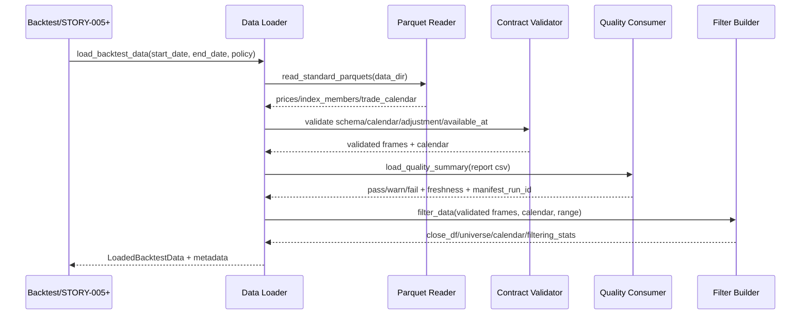

# LLD: STORY-004 - 离线 Data Loader 与合同校验

> 本文档当前为 CR-004 Batch D 的 Data Loader 先行修订，已通过 CP5 人工确认。后续只能按本 LLD 限定范围实现或修改 `engine/data_loader.py` / `engine/contracts.py`，不得联网、不得真实抓取数据、不得自动修复或生成质量报告。
>
> 本修订只收紧 Data Loader 的离线加载、质量门禁和 PIT 披露边界；不回滚此前 STORY-004 的历史交付记录，不授权 STORY-005/006、真实数据抓取、实验接入、安装脚本或任何业务代码修改。

## 0. 修订记录

| 版本 | 日期 | 修订人 | 变更要点 |
|---|---|---|---|
| 1.5 | 2026-05-17 | meta-po | 回填 CP5 Batch D 人工确认结果：用户回复“通过”，允许后续按本 LLD 限定范围实现 Data Loader 加载/校验/拒绝或放行边界；仍禁止真实抓取、自动修复、真实数据/报告写入和越界实现。 |
| 1.4 | 2026-05-17 | meta-dev | 按“Data Loader 先行，不真实抓取数据”约束修订：Data Loader 仅加载/校验/拒绝或放行；机器入口限定 quality CSV 或内存 summary fallback，Markdown human-only；质量字段缺失主路径 fail；fail 永不放行，warn 只有 `allow_warn` 放行；补齐质量决策字段、PIT 声明缺字段拒绝、non-PIT 幸存者偏差披露、`engine/contracts.py` 纯常量边界和 `tmp_path` 测试边界；重置为 CP5 Batch D 待确认草案。 |
| 1.3 | 2026-05-17 | meta-po | 按用户补充确认协议关闭 O-01..O-04：验收主路径只解析质量报告 CSV；探索 fallback 需标记 `derived_quality_summary=true`；`allow_warn` 不得放行 fail；PIT 股票池缺 `snapshot_date` 或 `available_at` 必须拒绝；补充质量决策原因、禁止自动修复和 warn 细分约束。 |
| 1.2 | 2026-05-15 | meta-po | 用户确认通过批量 LLD / Story Package，回写 `confirmed=true`、`confirmed_by=user`、`confirmed_at=2026-05-15`。 |
| 1.1 | 2026-05-15 | meta-dev / meta-qa / meta-po | 响应 F-004：补最小本地 CLI 诊断日志契约；监控口径标 NA；保持 `confirmed=false`。 |

## 1. Goal

创建离线 Data Loader 的详细设计，并对 `engine/contracts.py` 做最小 loader metadata 常量补充设计。后续实现必须只读取本地 `data/prices.parquet`、`data/index_members.parquet`、`data/trade_calendar.parquet`、`data/manifests/data_prep_manifest.jsonl` 与 `reports/data_quality_report.*`，完成 schema/contract validator、日期过滤、股票池过滤、复权一致性、`available_at <= decision_time` 与质量状态启动策略校验，向 STORY-005 的动量信号和组合层返回稳定的 `close_df`、`universe`、`calendar`、`metadata`。

本 Story 不设计也不实现数据准备、AKShare 补数、raw 标准化、质量报告生成、策略信号、组合成交、指标报告、扫描、候选报告、PIT provider、安装脚本或 `delivery/**` 产物。

Data Loader 的唯一职责是加载本地既有文件、执行合同和质量策略校验、拒绝不合规输入或放行合规输入；不得联网、不得抓取数据、不得自动修复、不得自动生成质量报告，也不得把 Markdown 报告作为机器事实源。

## 2. Requirements（Functional / Non-Functional）

### 2.1 Functional

- Data Loader 读取三类标准 parquet、manifest 和质量报告；缺少任一验收主路径必需文件时 fail fast，不触发数据准备或联网补数。
- Data Loader 对 `prices`、`index_members`、`trade_calendar` 执行必需字段校验：`prices.trade_date/symbol/close`、`index_members.symbol`、`trade_calendar.trade_date`。
- Data Loader 校验 `trade_date` 可解析、交易日历升序且去重；存在 `is_open` 时仅 `true` 计入有效交易日。
- Data Loader 根据 `start_date`、`end_date` 过滤价格、股票池和交易日历；返回的 `calendar` 覆盖请求区间内开市日，且按升序排列。
- Data Loader 根据股票池和价格数据交集构造 `close_df`：index 为请求区间开市日，columns 为通过股票池校验的 symbol，值为 close，缺失保留为 `NaN` 供 STORY-005 按缺失数据规则处理。
- Data Loader 消费 `index_members.is_pit_universe`、`snapshot_date`、`available_at` 字段；缺 `is_pit_universe` 时按 STORY-003 契约视为 `false` 并写入 metadata 警示。
- Data Loader 校验复权口径：默认 `adjustment_policy=qfq`，同一次加载不得混用多个非空复权口径；请求口径与数据口径不一致时拒绝运行。
- Data Loader 校验未来函数边界：日线收盘价缺 `available_at` 时仅可按 `trade_date_close_after` 推导；存在显式 `available_at` 时必须满足 `available_at <= decision_time`；不可推导字段进入决策时拒绝运行。
- Data Loader 消费质量报告：验收主路径必须存在机器可读 `reports/data_quality_report.csv`；缺失时直接 fail fast，不在主路径内存重算质量摘要；CSV 缺 CR-004 必需质量字段时主路径 fail fast；`quality_status=pass` 允许启动；`warn` 只有 `allow_warn=true` 或等价显式策略时允许启动且 metadata 必须披露状态、缺失率、新鲜度、失败批次和限制；`fail` 永远拒绝启动。
- Data Loader 的机器入口只允许 quality CSV 或显式内存 `quality summary` fallback；Markdown 报告只能作为 human-only 材料，传入机器入口时不得解析为质量事实。
- Data Loader 提供 `quality_policy` 参数控制质量状态处理，默认 `fail_on_warn_or_fail`；显式 `allow_warn` 只放宽 warn，不放宽 fail。
- `quality_status=fail` 或 `dataset_status=fail` 必须拒绝并不得返回成功对象；`allow_warn=true` 只允许 `quality_status=warn` 且 `dataset_status!=fail` 的路径继续。
- Data Loader 不得引入 `allow_fail`、`force_run`、`ignore_quality` 或等价绕过质量门禁的选项；成功返回不得包含 `quality_status=fail` 或 `dataset_status=fail`。
- Data Loader 返回对象或 metadata 必须携带质量决策原因：`quality_status`、`quality_policy`、`allow_warn`、`quality_source`、`quality_decision_reason`，探索 fallback 还必须标记 `derived_quality_summary=true`。
- Data Loader 只能执行加载、校验、拒绝或放行；不得补缺失、重采样、自动填充价格、自动修复股票池或自动生成质量报告。
- Data Loader 的 warn 必须使用可诊断原因码，第一版至少包含 `warn_non_pit_universe`、`warn_source_fetch_failed_but_local_valid`、`warn_minor_missing_rate`、`warn_markdown_report_ignored`。
- Data Loader 返回 metadata，至少包含复权口径、available_at 规则、质量状态、覆盖区间、最近成功更新时间、交易日/自然日新鲜度、manifest_run_id、source paths、PIT/固定股票池标记、幸存者偏差警示和 loader 过滤统计。

### 2.2 Non-Functional

- 回测加载路径对 AKShare、requests、httpx、urllib 等网络库的业务调用次数为 0；`engine/data_loader.py` 不导入 `engine.data_prep`、`engine.akshare_adapter`、`akshare` 或网络客户端。
- Data Loader 只读本地文件，不写入 `data/**`、`reports/**`、`delivery/**`，不修改 manifest 或质量报告。
- 所有合同失败必须结构化暴露，错误包含 dataset、字段名、文件路径、请求区间、质量状态或 symbol/date 等定位信息；不得抛裸 `KeyError`。
- 实现应复用 `engine.contracts` 常量和质量报告字段语义，避免重复定义质量状态和字段名；`engine/contracts.py` 在本 Story 只允许追加纯常量，禁止新增 I/O、pandas 依赖、运行逻辑或质量计算逻辑；验收主路径不得绕过质量报告文件。
- 第一版以 pandas 批量读取 parquet，面向本地日频研究规模；不引入大型回测框架、数据库或服务进程。
- 测试必须使用 `tmp_path` 下的临时 parquet、manifest 和质量报告 fixture；不得生成真实数据文件，不得真实联网，不得进入 STORY-005/006、实验脚本、安装脚本或真实数据目录。

## 3. 模块拆分与职责

| 模块 / 文件组 | 职责 | 说明 |
|---|---|---|
| Data Loader Facade / `engine/data_loader.py` | 暴露 `load_backtest_data(...)` 主入口，编排 parquet 读取、schema 校验、质量报告消费、过滤与返回对象构造 | 使用 `process/HLD.md#12.2-离线回测流程`；不得调用数据准备 |
| Parquet Reader / `engine/data_loader.py` | 读取 `prices.parquet`、`index_members.parquet`、`trade_calendar.parquet`，统一日期类型和 symbol 字符串类型 | 使用 `process/HLD.md#8.3-标准化-parquet-schema` |
| Contract Validator / `engine/data_loader.py` | 校验必需字段、复权一致性、交易日历排序、股票池字段、请求区间覆盖和 `available_at` 规则 | 使用 `process/HLD.md#9.1-复权与价格口径` 与 `#9.3-available_at-<=-decision_time-校验` |
| Quality Consumer / `engine/data_loader.py` | 验收主路径只读取机器可读质量报告 CSV；缺报告时 fail fast；可选探索模式若未来启用，必须显式传参且不得作为 P0 验收路径 | 使用 ADR-006；不得写报告文件 |
| Filtering & Shape Builder / `engine/data_loader.py` | 按日期区间、开市日、股票池和价格交集生成 `close_df`、`universe`、`calendar` 和过滤统计 | 输出是 STORY-005 的强输入边界 |
| Loader Metadata Builder / `engine/data_loader.py` | 汇总质量、复权、PIT、available_at、覆盖、新鲜度、source paths 和限制项 metadata | 后续 STORY-006/007/008 报告层继承 |
| Contract Supplements / `engine/contracts.py` | 追加 loader metadata 字段、quality policy、available_at policy 等纯常量 | 仅常量；保持无 I/O、无 pandas/pyarrow、无 dataclass/TypedDict/pydantic |

## 4. 代码结构与文件影响范围

| 动作 | 文件路径 | 变更内容 |
|---|---|---|
| 创建 | `engine/data_loader.py` | 实现离线 parquet 读取、schema/contract validator、质量状态消费、日期和股票池过滤、`close_df` 构造、metadata 构造、结构化异常类型和无网络边界 |
| 修改 | `engine/contracts.py` | 追加 `LOADER_METADATA_FIELDS`、`QUALITY_POLICY_VALUES`、`DEFAULT_QUALITY_POLICY`、`AVAILABLE_AT_POLICY_VALUES`、`DEFAULT_DECISION_TIME_RULE` 等纯常量；不得加入 I/O 或运行逻辑 |

文件边界排除项：本 Story 不创建或修改 `engine/backtest.py`、`engine/portfolio.py`、`engine/metrics.py`、`engine/reporting.py`、`engine/scanner.py`、`engine/candidates.py`、`strategies/**`、`delivery/**`、安装脚本、真实 `data/*.parquet`、真实 `data/raw/**`、真实 `data/manifests/**` 或真实 `reports/data_quality_report.*`；不修改 `engine/normalizer.py`、`engine/quality.py`、`engine/manifest.py`、`engine/data_prep.py`、`engine/akshare_adapter.py`。

## 5. 数据模型与持久化设计

### 5.1 LoaderConfig

| 对象 / 字段 | 类型 | 约束 | 说明 |
|---|---|---|---|
| `data_dir` | `str | Path` | 默认 `data` | 三类 parquet 根目录 |
| `manifest_path` | `str | Path` | 默认 `data/manifests/data_prep_manifest.jsonl` | 只读，用于质量摘要和可追溯 |
| `quality_report_path` | `str | Path | None` | 默认 `reports/data_quality_report.csv`；`.md` 只作人工材料 | CSV 为机器消费入口；验收主路径不存在时失败，不内存重算 |
| `quality_summary` | `Mapping | None` | 默认 `None` | 显式内存 fallback；仅探索/测试路径可用，必须标记 `quality_source=memory_calculate_quality` 与 `derived_quality_summary=true` |
| `start_date` | `str | date` | 必需，可解析日期 | 回测请求开始日 |
| `end_date` | `str | date` | 必需，可解析日期且 `start_date <= end_date` | 回测请求结束日 |
| `adjustment_policy` | `str` | 默认 `qfq` | 必须与数据行级或质量报告口径一致 |
| `quality_policy` | `str` | 枚举，默认 `fail_on_warn_or_fail` | 默认阻止 warn/fail；`allow_warn` 只允许 warn；不设计允许 fail 的验收路径 |
| `decision_time_rule` | `str` | 默认 `close_after` | 日线收盘价缺显式 `available_at` 时的推导规则 |

### 5.2 LoadedBacktestData

| 对象 / 字段 | 类型 | 约束 | 说明 |
|---|---|---|---|
| `close_df` | `pandas.DataFrame` | index 为升序开市日，columns 为 symbol | 后续 STORY-005 动量信号输入；缺失 close 保留 `NaN` |
| `universe` | `pandas.DataFrame` | 至少含 `symbol,is_pit_universe`；可含 `snapshot_date,available_at,index_code` | 股票池边界；固定池必须披露非 PIT |
| `calendar` | `pandas.DatetimeIndex | list[date]` | 升序、无重复、覆盖请求区间开市日 | 后续信号日、T+1 成交日计算输入 |
| `metadata` | `dict[str, Any]` | 字段覆盖 `LOADER_METADATA_FIELDS` | 后续报告、扫描和候选报告继承 |

### 5.3 Loader Metadata Schema

| 对象 / 字段 | 类型 | 约束 | 说明 |
|---|---|---|---|
| `loader_schema_version` | `str` | 必需，第一版 `1.0` | loader 输出 schema 版本 |
| `requested_start` / `requested_end` | `str` | 必需，`YYYY-MM-DD` | 用户请求区间 |
| `loaded_start` / `loaded_end` | `str` | 必需或空 | 实际加载到的价格覆盖区间 |
| `price_row_count` | `int` | `>=0` | 过滤后价格行数 |
| `universe_size` | `int` | `>=0` | 输出股票池数量 |
| `calendar_size` | `int` | `>=0` | 请求区间开市日数量 |
| `adjustment_policy` | `str` | 必需 | 默认 `qfq`；混用时不返回成功对象 |
| `available_at_rule` | `str` | 必需 | `explicit` 或 `trade_date_close_after` |
| `quality_status` | `str` | 必需 | `pass`、`warn`、`fail`；成功返回不得为 `fail` |
| `fetch_status` | `str` | 必需 | 来自质量报告；数据源拉取状态，如 `success`、`partial_failed`、`failed` |
| `dataset_status` | `str` | 必需 | 来自质量报告；本地 parquet 可用性判定，成功返回不得为 `fail` |
| `quality_policy` | `str` | 必需 | 本次启动策略 |
| `allow_warn` | `bool` | 必需 | 是否允许 `quality_status=warn` 继续；默认 `false`；不得允许 fail 成功返回 |
| `quality_source` | `str` | 必需 | `csv_report` 或 `memory_calculate_quality` |
| `quality_decision_reason` | `str` | 必需 | 解释 pass/warn/fail 放行或拒绝原因 |
| `derived_quality_summary` | `bool` | 必需 | 探索 fallback 为 `true`；验收主路径 CSV 为 `false` |
| `missing_rate` | `float` | `0..1` | 来自质量报告 overall/prices |
| `failed_batch_count` | `int` | `>=0` | 来自质量报告 |
| `manifest_run_id` | `str` | 必需或空 | 可追溯数据准备 run |
| `last_successful_update_at` | `str` | 必需或空 | 新鲜度来源 |
| `data_freshness_trade_days` | `int` | `>=0` | 交易日新鲜度 |
| `data_freshness_calendar_days` | `int` | `>=0` | 自然日新鲜度 |
| `is_pit_universe` | `bool` | 必需 | 第一版固定快照通常为 `false` |
| `universe_mode` | `str` | 必需 | `pit` 或 `non_pit_snapshot` 等明确模式 |
| `pit_status` | `str` | 必需 | `valid_pit`、`non_pit_warn`、`invalid_pit_contract` 等诊断状态 |
| `survivorship_bias_note` | `str` | 必需 | 固定当前成分股偏差警示 |
| `source_parquet_paths` | `dict[str, str]` | 必需 | 三类 parquet 路径 |
| `source_manifest_path` | `str` | 必需 | manifest 路径 |
| `source_quality_report_path` | `str` | 可为空 | 实际消费的质量报告路径 |
| `filtered_symbol_count` | `int` | `>=0` | 因股票池/价格交集过滤掉的 symbol 数 |
| `dropped_non_open_days` | `int` | `>=0` | 因 `is_open=false` 过滤的交易日数量 |
| `warnings` | `list[str]` | 必需，可空 | warn 状态、非 PIT、可交易限制等披露 |

### 5.4 Contract Failure

| 对象 / 字段 | 类型 | 约束 | 说明 |
|---|---|---|---|
| `error_type` | `str` | 必需 | 异常类名，如 `DataContractError` |
| `message` | `str` | 必需 | 面向用户的错误摘要 |
| `dataset` | `str` | 可空 | `prices`、`index_members`、`trade_calendar`、`quality_report` |
| `path` | `str` | 可空 | 触发错误的文件路径 |
| `fields` | `list[str]` | 可空 | 缺失或不合规字段 |
| `symbols` / `trade_dates` | `list[str]` | 可空 | 定位问题样本 |
| `quality_status` | `str` | 可空 | 质量策略失败时填充 |

持久化说明：本 Story 后续实现不新增持久化数据模型，不写入 parquet、manifest 或 report；仅返回内存对象和异常对象。`engine/contracts.py` 常量变更是源代码契约，不是运行时持久化。

## 6. API / Interface 设计

| 接口 / 入口 | 输入 | 输出 | 调用方 | 说明 |
|---|---|---|---|---|
| `load_backtest_data(config: LoaderConfig | None = None, **kwargs)` | `data_dir`、`manifest_path`、`quality_report_path`、`start_date`、`end_date`、`adjustment_policy`、`quality_policy` | `LoadedBacktestData(close_df, universe, calendar, metadata)` | STORY-005 `strategies/momentum.py` / STORY-006 `engine/backtest.py` | 主入口；只读本地文件；测试 `T-LOAD-PASS-01`、`T-NETWORK-BOUNDARY-01` |
| `read_standard_parquets(data_dir)` | `data/prices.parquet`、`data/index_members.parquet`、`data/trade_calendar.parquet` | `dict[str, DataFrame]` | `load_backtest_data` | 读取失败抛 `DataFileNotFoundError` 或 `DataContractError`；测试 `T-MISSING-FILE-01`、`T-SCHEMA-MISSING-01` |
| `validate_required_schema(frames)` | 三类 DataFrame | `None` 或结构化异常 | `load_backtest_data` | 校验必需字段和基础类型；测试 `T-SCHEMA-MISSING-01` |
| `validate_calendar(calendar_frame, start_date, end_date)` | trade_calendar DataFrame、请求区间 | 升序开市日序列 | `load_backtest_data` | 重复、不可排序、无请求区间交易日均失败；测试 `T-CALENDAR-SORT-01`、`T-DATE-FILTER-01` |
| `validate_adjustment_policy(prices, requested_policy)` | prices DataFrame、请求口径 | `str adjustment_policy` | `load_backtest_data` | 混用或不匹配拒绝运行；测试 `T-ADJUSTMENT-MIXED-01` |
| `validate_available_at(prices, universe, calendar, decision_time_rule)` | prices、universe、calendar、推导规则 | `available_at_rule` 与 warning | `load_backtest_data` | 显式 `available_at` 必须不晚于对应决策时点；事件字段不可进入第一版决策；测试 `T-AVAILABLE-AT-EXPLICIT-FAIL-01`、`T-AVAILABLE-AT-DERIVED-01` |
| `load_quality_summary(quality_report_path, parquet_paths, manifest_path, requested_range, as_of_date, quality_summary=None, allow_exploratory_recompute=False)` | 质量报告路径、parquet/manifest、显式内存 summary、显式探索开关 | `dict` / `QualitySummary` 规范化对象 | `load_backtest_data` | 验收主路径只消费 CSV；无报告时失败；显式 `quality_summary` 或 `allow_exploratory_recompute=True` 仅用于内存 fallback，必须标记 `derived_quality_summary=true`，不得写报告、不得满足 P0 验收；Markdown 不解析；测试 `T-QUALITY-WARN-01`、`T-QUALITY-FAIL-01`、`T-QUALITY-MISSING-REPORT-01` |
| `apply_quality_policy(summary, quality_policy)` | 质量摘要、策略 | `warnings`、`quality_decision_reason` 或 `DataQualityError` | `load_backtest_data` | pass 启动，warn 按策略披露，fail 永远拒绝；`allow_warn` 只能放宽 warn；测试 `T-QUALITY-WARN-01`、`T-QUALITY-FAIL-01` |
| `filter_data(frames, calendar, start_date, end_date)` | 已校验 frames、开市日、请求区间 | `close_df`、`universe`、`calendar`、过滤统计 | `load_backtest_data` | columns 来自股票池与价格交集；测试 `T-STOCK-POOL-FILTER-01`、`T-DATE-FILTER-01` |
| `build_loader_metadata(...)` | 配置、质量摘要、过滤统计、source paths、warnings | metadata dict | `load_backtest_data` / 后续报告层 | 字段必须覆盖 `LOADER_METADATA_FIELDS`；测试 `T-METADATA-SCHEMA-01` |

错误暴露策略：

- `DataFileNotFoundError`：本地 parquet、manifest 或验收主路径质量报告缺失时触发，消息包含路径；不得隐式内存重算。
- `DataContractError`：schema 缺失、日期不可解析、交易日历不可排序、股票池缺 symbol、复权混用、`available_at` 违反决策时点时触发。
- `DataQualityError`：质量报告 `fail` 或策略不允许继续时触发，消息包含 `quality_status`、`missing_rate`、`failed_batch_count`。
- `DataLoaderNetworkBoundaryError`：静态或运行时防线发现 loader 引入数据准备/网络客户端时触发；主要由测试验证。
- 所有异常保留 `to_dict()` 或等价结构化属性设计，供后续扫描/报告失败行消费。

第 10 节为本节每个接口提供至少 1 条测试入口。

## 7. 核心处理流程

1. 调用方传入请求区间、复权口径和质量策略；入口标准化日期，校验 `start_date <= end_date`。
2. Data Loader 解析默认路径：`data/prices.parquet`、`data/index_members.parquet`、`data/trade_calendar.parquet`、`data/manifests/data_prep_manifest.jsonl`、`reports/data_quality_report.csv`。
3. Parquet Reader 只读三类 parquet；读取失败或文件缺失时抛结构化错误，不调用 `run_data_prep` 或 AKShare adapter。
4. Contract Validator 校验三类 schema、日期类型、symbol 非空、交易日历升序去重、请求区间内开市日存在。
5. Quality Consumer 优先读取质量报告 CSV 的 `overall` 行；验收主路径报告缺失时失败，不调用 `calculate_quality(...)` 也不调用 `render_quality_reports(...)`；仅显式传入内存 `quality_summary` 或显式探索模式时可使用内存 fallback，且不得作为验收通过依据。
6. `apply_quality_policy` 按 ADR-006 判定启动：`fail` 总是拒绝；`warn` 仅在 `allow_warn=true` 或策略允许 warn 时继续并写入 warnings；`pass` 继续。
7. `validate_adjustment_policy` 校验 prices 行级或质量摘要中的复权口径与请求口径一致，混用或不匹配时拒绝。
8. `validate_available_at` 对显式 `available_at` 执行 `available_at <= decision_time`；缺显式值的日线收盘价按 `trade_date_close_after` 推导；股票池 `available_at` 晚于回测开始决策时拒绝。
9. `filter_data` 按请求区间和开市日过滤 prices，按股票池 symbol 与价格 symbol 交集构造 `close_df`；缺失 close 保留 `NaN`。
10. `build_loader_metadata` 汇总质量摘要、复权、PIT/固定池、source paths、覆盖区间、新鲜度和过滤统计，返回 `LoadedBacktestData`。

异常路径：

- parquet 文件缺失：直接失败；错误包含缺失路径；不得调用数据准备或联网补数。
- manifest 缺失或损坏：质量摘要无法追溯时失败；不得忽略 manifest 继续进入验收主路径。
- 质量报告缺失：验收主路径直接失败，错误包含 `reports/data_quality_report.csv` 路径；不得隐式调用 `calculate_quality(...)` 重算；若未来显式探索模式启用，只能内存重算且必须在 metadata 标记 `quality_summary_source=exploratory_recompute`，不得满足 P0 验收。
- 必需字段缺失：返回 `DataContractError`，字段名使用 `dataset.field`。
- `trade_calendar.trade_date` 重复、不可解析或排序后仍无法覆盖请求区间：拒绝运行。
- `index_members.symbol` 缺失或股票池为空：拒绝运行。
- 股票池与价格交集为空：拒绝运行。
- `prices.adjustment_policy` 混用或与请求 `adjustment_policy` 不一致：拒绝运行。
- 显式 `available_at > decision_time`：拒绝运行并定位 symbol/date；日线 close 缺 `available_at` 仅可按 `trade_date_close_after` 推导并披露。
- `index_members.is_pit_universe` 缺失或为 `false`：固定 non-PIT 路径可作为诊断 warning 披露；若整体 `quality_status=warn`，仍只有 `allow_warn=true` 才能放行；metadata 必须披露 `is_pit_universe=false`、`universe_mode=non_pit_snapshot`、`pit_status=non_pit_warn` 和幸存者偏差警示。
- `index_members.is_pit_universe=true` 但缺 `snapshot_date` 或 `available_at`：必须拒绝运行；不得把缺字段 PIT 声明降级为 non-PIT。
- `quality_status=warn`：默认拒绝；只有 `allow_warn=true` 或等价显式策略时允许运行，metadata 必须披露 warn 原因；后续报告不得把 warn 描述为 clean pass。
- `quality_status=fail`：拒绝运行；不返回成功的 `LoadedBacktestData`。

## 8. 技术设计细节

- 返回对象形态：
  - 后续实现使用 `@dataclass(slots=True)` 定义 `LoaderConfig` 与 `LoadedBacktestData`，因为它们是运行时返回对象，不放入 `engine/contracts.py`。
  - `engine/contracts.py` 只追加 tuple/dict 常量，不追加 dataclass、TypedDict 或 pydantic model。
- 日期规范：
  - 内部统一用 pandas 解析日期，metadata 输出统一为 `YYYY-MM-DD`。
  - 请求区间为闭区间 `[start_date, end_date]`。
  - `calendar` 只包含请求区间内 `is_open=true` 的交易日；缺 `is_open` 时全部 `trade_date` 视为开市日并在 metadata warning 披露。
- `close_df` 构造规则：
  - prices 先过滤请求区间，再限制到 `calendar` 中的开市日。
  - universe symbol 取 `index_members.symbol` 去重后的稳定排序。
  - columns 取 universe symbol 与 prices symbol 的交集，按 universe 排序保留。
  - index 按 calendar 升序；值使用 `pivot(index="trade_date", columns="symbol", values="close")` 后 reindex 到完整 calendar 和交集 columns。
  - 缺失值不填充、不前填、不后填、不置零；由 STORY-005 按 HLD §10 剔除或留现金。
- 质量报告定位方式：
  - 默认读取 `reports/data_quality_report.csv`。
  - CSV 机器消费以 `dataset == "overall"` 行为主，缺 overall 时可用 prices 行作为降级摘要并记录 warning。
  - `.md` 只作为人工可读材料，不作为第一版机器解析入口。
  - 机器入口只接受 CSV 文件或显式内存 `quality_summary` fallback；Markdown human-only，不能被解析、转换或优先于 CSV。
  - 报告缺失时验收主路径失败；不得隐式调用 `engine.quality.calculate_quality(...)`，也不得调用 `render_quality_reports(...)` 写入 `reports/**`。
  - 可选探索模式必须由调用方显式传入 `allow_exploratory_recompute=True`，并在 metadata 中标记 `quality_source=memory_calculate_quality`、`derived_quality_summary=true`，不计入 P0 验收。
  - 质量摘要必须同时消费并披露 `fetch_status` 与 `dataset_status`；fetch 失败但本地 parquet 合规时可依据 dataset 质量和策略继续，不能仅因 fetch 失败一律拒绝。
  - Data Loader 必须消费 `denominator_mode`、coverage、thresholds、`fetch_status`、`dataset_status` 和可复现字段；验收主路径缺任一必需字段时必须按质量报告契约不完整 fail fast，不得降级为普通 warn，不得从 Markdown、真实抓取或自动生成报告路径补齐。
  - Markdown 报告被传入机器入口时不得解析，应记录 `warn_markdown_report_ignored` 或抛结构化错误，具体按调用路径决定。
- 复权一致性：
  - 首选 prices `adjustment_policy` 非空唯一值；缺失时使用 `DEFAULT_ADJUSTMENT_POLICY=qfq` 并记录 warning。
  - 若质量报告 `adjustment_policy` 与 prices 行级唯一值冲突，以拒绝运行为准。
  - 请求参数 `adjustment_policy` 必须等于最终唯一口径。
- `available_at` 校验：
  - 对 prices 显式 `available_at`，按行比较 `available_at <= trade_date close_after decision_time`；第一版可将 decision_time 表达为同一 `trade_date` 收盘后逻辑时点。
  - 对 prices 缺显式 `available_at`，仅当字段属于日线 close 时使用 `trade_date_close_after` 推导。
  - 对 index_members 显式 `available_at`，必须不晚于请求 `start_date` 的首个决策时点。
  - 第一版不允许财报、公告、ST 等事件字段进入信号输入；检测到被配置为 loader 输出字段时失败并提示后续 STORY-011。
- PIT 警示字段消费：
  - `index_members.is_pit_universe` 缺失时按 `false` 处理。
  - 任一输出股票池不是 PIT 时，metadata 写入 `is_pit_universe=false` 和 `survivorship_bias_note`。
  - 若 `is_pit_universe=true` 但缺 `available_at` 或 `snapshot_date`，第一版必须按合同不完整拒绝运行。
  - 固定非 PIT 股票池允许作为诊断 warning 继续披露；若该 warning 导致整体质量状态为 warn，则仍受 `allow_warn` 门控；必须披露 `universe_mode`、`pit_status` 与 survivorship bias；若存在 `available_at`，必须校验 `available_at <= load_as_of`。
- 数据修复边界：
  - Data Loader 不补缺失、不重采样、不前填/后填、不自动生成质量报告、不修复股票池。
  - 任何修复、标准化或报告生成应由数据准备/质量报告组件完成；Data Loader 只消费既有 parquet、manifest 和质量摘要。
- 无网络边界：
  - `engine/data_loader.py` 不导入 `engine.data_prep`、`engine.akshare_adapter`、`akshare`、`requests`、`httpx`、`urllib.request`。
  - 测试用 monkeypatch 将相关模块调用置为失败哨兵，并做源码静态扫描。
- 图示类型选择：本 Story 跨 Data Loader、Parquet Reader、Contract Validator、Quality Consumer、Filter Builder，并含 fail/warn 分支，使用时序图说明主流程。

## 9. 安全与性能设计

| 维度 | 设计措施 | 验证方式 |
|---|---|---|
| 安全 | Data Loader 不导入 AKShare、requests、httpx、urllib、data_prep 或 adapter，不触发远程补数 | `T-NETWORK-BOUNDARY-01` 静态扫描 + monkeypatch 哨兵 |
| 安全 | 只读本地 parquet、manifest 和质量报告，不写 `data/**`、`reports/**`、`delivery/**` | `T-READONLY-BOUNDARY-01` 文件系统快照 |
| 安全 | 不使用 `eval`、`exec`、shell、pickle 或动态 import 解析配置/报告 | dangerous-command-scan 风格静态扫描 |
| 可靠性 | schema、质量、复权、available_at、calendar、股票池失败均结构化异常，不抛裸 `KeyError` | `T-SCHEMA-MISSING-01`、`T-QUALITY-FAIL-01`、`T-AVAILABLE-AT-EXPLICIT-FAIL-01` |
| 可靠性 | warn 状态默认拒绝，只有 `allow_warn=true` 放行；放行时 metadata 强制披露，不静默降级为 pass | `T-QUALITY-WARN-01`、`T-METADATA-SCHEMA-01` |
| 可追溯性 | metadata 输出 source paths、manifest_run_id、质量报告路径、覆盖区间和新鲜度 | `T-METADATA-SCHEMA-01` |
| 可观测性 | 本地 CLI/离线入口使用标准 logging 输出到 stderr；`INFO start/end`、`WARNING quality_warn/exploratory_recompute`、`ERROR structured_error`，字段含 `event_name`、`run_id` 或 `manifest_run_id`、`module=data_loader`、`story_id=STORY-004`、`status`、`params_summary`、`relative_path`、`elapsed_seconds`；不写持久化日志文件、不记录凭据、绝对隐私路径或完整 DataFrame；服务监控标 NA | `T-LOGGING-MINIMAL-01` |
| 性能 | pandas 一次性读取三类 parquet，按日期/symbol 向量化过滤和 pivot；不做逐 symbol 远程查询 | 100 symbol x 20 trade day fixture 在单测内完成 |
| 性能 | 不在 metadata 中嵌入完整价格矩阵，只输出统计和 source paths | metadata 字段断言 |

## 10. 测试设计

| 测试场景 | 前置条件 | 操作 | 预期结果 | 验证方式 |
|---|---|---|---|---|
| `T-LOAD-PASS-01` 合规加载 | 临时三类 parquet、manifest、quality CSV 均 pass | 调用 `load_backtest_data(start,end)` | 返回 `close_df`、`universe`、`calendar`、`metadata` 四类对象；metadata `quality_status=pass` | 临时目录单元测试 |
| `T-MISSING-FILE-01` 本地文件缺失 | 缺 `prices.parquet` 或 manifest | 调用 loader | 抛 `DataFileNotFoundError`，错误含路径；无联网调用 | 单元测试 |
| `T-SCHEMA-MISSING-01` 必需字段缺失 | `prices.parquet` 缺 `close` | 调用 loader | 抛 `DataContractError`，fields 含 `prices.close`，不抛裸 `KeyError` | 单元测试 |
| `T-CALENDAR-SORT-01` 交易日历重复/不可排序 | calendar 含重复或不可解析 `trade_date` | 调用 `validate_calendar` | 拒绝运行，错误含 `trade_calendar.trade_date` | 单元测试 |
| `T-DATE-FILTER-01` 日期过滤 | parquet 覆盖请求区间前后额外日期 | 调用 loader | `calendar` 仅请求区间开市日；`close_df.index` 升序且等于 calendar | 单元测试 |
| `T-STOCK-POOL-FILTER-01` 股票池过滤 | universe 含 A/B/C，prices 仅 A/B | 调用 loader | `close_df.columns == [A,B]`；metadata `filtered_symbol_count=1` | 单元测试 |
| `T-STOCK-POOL-EMPTY-01` 股票池为空或无交集 | universe 空或与 prices 无交集 | 调用 loader | 抛 `DataContractError`，错误说明股票池无可加载 symbol | 单元测试 |
| `T-ADJUSTMENT-MIXED-01` 复权混用 | prices 同时含 `qfq` 与 `hfq` | 调用 loader | 抛 `DataContractError`，不返回成功对象 | 单元测试 |
| `T-ADJUSTMENT-MISMATCH-01` 请求口径不一致 | prices 唯一 `qfq`，请求 `hfq` | 调用 loader | 抛 `DataContractError`，错误含 requested/actual policy | 单元测试 |
| `T-AVAILABLE-AT-DERIVED-01` 日线 close 缺显式可用时点 | prices 无 `available_at` | 调用 loader | 成功；metadata `available_at_rule=trade_date_close_after` 且 warnings 披露推导 | 单元测试 |
| `T-AVAILABLE-AT-EXPLICIT-FAIL-01` 显式未来数据 | prices 某行 `available_at` 晚于对应决策时点 | 调用 loader | 抛 `DataContractError`，错误含 symbol/date | 单元测试 |
| `T-UNIVERSE-AVAILABLE-AT-FAIL-01` 股票池未来可用 | universe `available_at` 晚于 start decision time | 调用 loader | 拒绝使用该股票池 | 单元测试 |
| `T-PIT-WARNING-01` 固定股票池披露 | index_members 缺 `is_pit_universe` 或为 false | 调用 loader | 成功但 metadata `is_pit_universe=false`，含幸存者偏差警示 | 单元测试 |
| `T-QUALITY-WARN-01` quality warn 需显式放行 | quality CSV overall 行 `quality_status=warn` | 分别以默认策略和 `allow_warn=true` 调用 loader | 默认策略拒绝；`allow_warn=true` 成功且 metadata 含 `quality_status`、missing_rate、新鲜度、failed_batch_count、`quality_policy`、`allow_warn` 和 warnings | 单元测试 |
| `T-QUALITY-FAIL-01` quality fail 拒绝 | quality CSV overall 行 `quality_status=fail` | 调用 loader | 抛 `DataQualityError`，不返回成功对象 | 单元测试 |
| `T-QUALITY-FAIL-ALLOW-WARN-01` fail 不被 allow_warn 放行 | quality CSV `quality_status=fail` 且调用方传 `quality_policy=allow_warn` | 调用 loader | 仍抛 `DataQualityError`；metadata/错误包含 `allow_warn=true` 与拒绝原因 | 单元测试 |
| `T-QUALITY-POLICY-NO-FAIL-BYPASS-01` fail 不可被策略绕过 | quality CSV `quality_status=fail`，调用方传入任何可选策略 | 调用 loader | 拒绝运行；不存在 `allow_fail`、`force_run`、`ignore_quality` 等成功路径 | 单元测试 |
| `T-QUALITY-DECISION-REASON-01` 质量决策原因 | pass/warn/fail 三类质量摘要 fixture | 调用质量策略函数 | 成功或失败路径均包含 `quality_source` 与 `quality_decision_reason` | 单元测试 |
| `T-QUALITY-MISSING-REPORT-01` 质量报告缺失主路径失败 | quality CSV 不存在，parquet/manifest 可读，`allow_exploratory_recompute=False` | 调用 loader | 抛 `DataFileNotFoundError` 或等价质量报告缺失错误；不调用 `calculate_quality`，不写 `reports/**` | monkeypatch + 文件系统断言 |
| `T-QUALITY-EXPLORATORY-RECOMPUTE-01` 显式探索重算 | quality CSV 不存在，parquet/manifest 可读，`allow_exploratory_recompute=True` | 调用 loader | 仅内存返回探索质量摘要，metadata 标记 `quality_source=memory_calculate_quality`、`derived_quality_summary=true`，不满足 P0 验收 | 单元测试 |
| `T-QUALITY-SUMMARY-FALLBACK-01` 显式内存 summary fallback | quality CSV 不存在，调用方显式传入内存 `quality_summary` | 调用 loader | 仅使用内存 summary，metadata 标记 `quality_source=memory_calculate_quality`、`derived_quality_summary=true`，不写质量报告 | `tmp_path` 单元测试 |
| `T-QUALITY-MARKDOWN-IGNORED-01` Markdown 不作机器入口 | 仅存在或传入 `data_quality_report.md` | 调用 loader | 不解析 Markdown；记录 `warn_markdown_report_ignored` 或结构化失败；不把 Markdown 当 CSV | 单元测试 |
| `T-PIT-CLAIM-INCOMPLETE-FAIL-01` PIT 声明不完整拒绝 | `is_pit_universe=true` 但缺 `snapshot_date` 或 `available_at` | 调用 loader | 拒绝运行，错误含 `invalid_pit_contract` | 单元测试 |
| `T-METADATA-SCHEMA-01` metadata 字段完整 | 合规或 warn fixture | 调用 `build_loader_metadata` | metadata 覆盖 `LOADER_METADATA_FIELDS`，类型符合 §5.3 | 单元测试 |
| `T-NO-AUTO-REPAIR-01` loader 不自动修复 | parquet 存在缺失价格、断档或股票池缺字段 | 调用 loader | 不补值、不重采样、不写报告；按合同 warn 或 fail | 单元测试 |
| `T-TMP-PATH-ONLY-01` 测试产物不进入真实目录 | 所有 fixture 均在 `tmp_path` | 运行 loader 测试集 | 不写真实 `data/**`、`reports/**`、`delivery/**`，不生成真实行情 | 文件系统断言 |
| `T-NETWORK-BOUNDARY-01` 无联网边界 | 源码存在，网络模块 monkeypatch 为失败 | 调用 loader 并静态扫描 | 不导入/调用 AKShare、requests、httpx、urllib、data_prep、adapter | 静态检查 + monkeypatch |
| `T-READONLY-BOUNDARY-01` 不写真实数据 | 记录 `data/`、`reports/`、`delivery/` 文件快照 | 调用 loader fixture | 快照无新增真实文件；临时目录产物不进入仓库 | 文件系统检查 |
| `T-STORY005-CONTRACT-01` 后续接口边界 | 合规 LoadedBacktestData | 模拟 STORY-005 读取 `close_df/universe/calendar/metadata` | 字段和类型满足动量信号输入；不要求实现策略 | 接口契约测试 |
| `T-LOGGING-MINIMAL-01` 最小诊断日志 | caplog/stderr fixture | 调用 loader 成功、warn、结构化失败路径 | 输出 start/end、warning、structured_error，字段完整且不含凭据/绝对隐私路径/完整 DataFrame | 单元测试 |

第 6 节接口测试对应关系：`load_backtest_data` 对应 `T-LOAD-PASS-01`；parquet reader 对应 `T-MISSING-FILE-01`；schema validator 对应 `T-SCHEMA-MISSING-01`；calendar validator 对应 `T-CALENDAR-SORT-01` 和 `T-DATE-FILTER-01`；复权 validator 对应 `T-ADJUSTMENT-*`；available_at validator 对应 `T-AVAILABLE-AT-*` 与 `T-UNIVERSE-AVAILABLE-AT-FAIL-01`；quality consumer 和 policy 对应 `T-QUALITY-*`，其中 `T-QUALITY-MISSING-REPORT-01` 是验收主路径缺报告失败；filter builder 对应 `T-STOCK-POOL-*`；metadata builder 对应 `T-METADATA-SCHEMA-01`。

第 7 节异常路径测试对应关系：文件缺失对应 `T-MISSING-FILE-01`；manifest/quality 缺失对应 `T-QUALITY-MISSING-REPORT-01`；必需字段缺失对应 `T-SCHEMA-MISSING-01`；calendar 失败对应 `T-CALENDAR-SORT-01`；股票池失败对应 `T-STOCK-POOL-EMPTY-01`；复权失败对应 `T-ADJUSTMENT-*`；available_at 失败对应 `T-AVAILABLE-AT-EXPLICIT-FAIL-01`；quality warn/fail 对应 `T-QUALITY-WARN-01` 和 `T-QUALITY-FAIL-01`；无网络和只读边界对应 `T-NETWORK-BOUNDARY-01` 与 `T-READONLY-BOUNDARY-01`。

## 11. 实施步骤

| TASK-ID | 动作 | 目标文件 | 详细描述 | 对应测试 |
|---|---|---|---|---|
| S004-T1 | 创建 | `engine/data_loader.py` | 定义 `LoaderConfig`、`LoadedBacktestData`、结构化异常类、默认路径解析、`read_standard_parquets` 与 `validate_required_schema` | `T-LOAD-PASS-01`, `T-MISSING-FILE-01`, `T-SCHEMA-MISSING-01`, `T-NETWORK-BOUNDARY-01` |
| S004-T2 | 创建 | `engine/data_loader.py` | 实现 `validate_calendar`、日期闭区间过滤、股票池 symbol 校验、价格/股票池交集过滤和 `close_df` 构造 | `T-CALENDAR-SORT-01`, `T-DATE-FILTER-01`, `T-STOCK-POOL-FILTER-01`, `T-STOCK-POOL-EMPTY-01`, `T-STORY005-CONTRACT-01` |
| S004-T3 | 创建 | `engine/data_loader.py` | 实现 `validate_adjustment_policy`、`validate_available_at`、PIT/固定股票池警示字段消费和未来函数防护异常路径 | `T-ADJUSTMENT-MIXED-01`, `T-ADJUSTMENT-MISMATCH-01`, `T-AVAILABLE-AT-DERIVED-01`, `T-AVAILABLE-AT-EXPLICIT-FAIL-01`, `T-UNIVERSE-AVAILABLE-AT-FAIL-01`, `T-PIT-WARNING-01` |
| S004-T4 | 创建 | `engine/data_loader.py` | 实现 `load_quality_summary`、`apply_quality_policy`、quality CSV 消费、显式内存 summary fallback、Markdown human-only 拒绝、缺报告主路径失败；fail 永不放行，显式探索重算不得满足 P0 验收且不写报告 | `T-QUALITY-WARN-01`, `T-QUALITY-FAIL-01`, `T-QUALITY-FAIL-ALLOW-WARN-01`, `T-QUALITY-MISSING-REPORT-01`, `T-QUALITY-SUMMARY-FALLBACK-01`, `T-QUALITY-EXPLORATORY-RECOMPUTE-01`, `T-READONLY-BOUNDARY-01` |
| S004-T5 | 创建 | `engine/data_loader.py` | 实现 `build_loader_metadata` 与 `load_backtest_data` 主流程整合，确保返回对象满足 STORY-005 输入边界 | `T-METADATA-SCHEMA-01`, `T-LOAD-PASS-01`, `T-STORY005-CONTRACT-01` |
| S004-T6 | 修改 | `engine/contracts.py` | 仅追加 loader metadata、quality policy、available_at policy、decision time rule 等纯常量，并更新 `__all__`；不得新增 I/O、pandas、运行逻辑、质量计算或报告生成 | `T-METADATA-SCHEMA-01`, `T-NETWORK-BOUNDARY-01` |
| S004-T7 | 创建 | `engine/data_loader.py` | 在入口、质量 warn、探索重算和结构化失败路径输出最小 CLI 诊断日志；不新增持久化日志文件 | `T-LOGGING-MINIMAL-01` |

每个 TASK-ID 与文件影响范围对应关系：`S004-T1` 至 `S004-T5` 覆盖创建 `engine/data_loader.py`；`S004-T6` 覆盖修改 `engine/contracts.py`。不得新增其他实现文件。

## 12. 风险、难点与预研建议

| 风险 / 难点 | 影响 | 缓解措施 / 预研建议 |
|---|---|---|
| quality CSV 与探索模式 `calculate_quality(...)` 内存摘要字段存在细节差异 | 可能导致 warn/fail 策略不一致 | 验收主路径只消费 CSV；探索模式单独标记并不作为 P0 验收 |
| `available_at` 的收盘后逻辑时点没有真实 timestamp | 若处理过宽可能产生未来函数争议 | 第一版仅日线 close 缺显式字段时允许 `trade_date_close_after`；显式晚于决策日直接失败；后续事件级精细时点交给 STORY-011 |
| 固定当前股票池会带来幸存者偏差 | 本地结果可能高估历史表现 | metadata 强制 `is_pit_universe=false` 与 `survivorship_bias_note`；不阻断 M1 学习主路径 |
| 缺失 close 保留 `NaN` 后由 STORY-005 处理 | 下游若未正确过滤会产生错误收益 | STORY-004 只保证不填充，STORY-005 LLD 必须消费 `close_df` 缺失并记录剔除/留现金 |
| 质量报告缺失时若隐式重算会弱化“报告必需” | 用户可能误以为已生成报告 | 主路径缺 CSV 直接失败；探索重算必须显式启用并标记，不作为验收依据 |
| `scripts/check_delivery_guardrails.py` 缺失 | 无法执行仓库规则中的提交前 guardrail | 按 handoff 作为非阻断流程观察项记录；本 Story 不创建脚本 |
| `process/VALIDATION-ENV.yaml story_id` 元数据滞后 | 后续 QA 审计可能混淆目标 Story | 按 handoff 作为非阻断观察项；STORY-004 验证前由 meta-po/meta-qa 决定是否刷新 |

### OPEN / Spike 跟踪

| ID | 类型（OPEN / Spike） | 问题 | 下一动作 | 责任方 |
|---|---|---|---|---|
| O-01 | RESOLVED | 质量报告缺失时允许内存 `calculate_quality(...)` 重算摘要，但仅作为 exploratory fallback / 非验收主路径；fallback 结果必须标记 `derived_quality_summary=true` | 用户于 2026-05-17 确认 | meta-po / 用户 |
| O-02 | RESOLVED | 第一版 `quality_policy` 不允许 fail 成功返回；`allow_warn` 只能放宽 warn；不得引入 `allow_fail`、`force_run`、`ignore_quality` 等绕过质量门禁的选项 | 用户于 2026-05-17 确认 | meta-po / 用户 |
| O-03 | RESOLVED | Markdown 质量报告仅作为人工材料，不作为 Data Loader 机器解析入口；机器解析入口仅允许 CSV 或内存质量摘要 | 用户于 2026-05-17 确认 | meta-po / 用户 |
| O-04 | RESOLVED | 声称 PIT 的股票池如果缺 `snapshot_date` 或 `available_at`，第一版必须拒绝运行；固定非 PIT 股票池允许 warn 继续并披露幸存者偏差 | 用户于 2026-05-17 确认 | meta-po / 用户 |

## 13. 回滚与发布策略

- 发布方式：CR-004 Batch D LLD 修订获人工确认后，才允许按 `S004-T1` 至 `S004-T6` 串行实现；实现只创建/修改 `engine/data_loader.py` 并最小追加 `engine/contracts.py` 纯常量。验证使用 `tmp_path` fixture，不写真实数据、真实报告和交付目录。
- 回滚触发条件：实现后任一 BLOCKING 验证失败，包括主路径联网、写真实 `data/reports/delivery`、quality fail 未阻断、复权混用未拒绝、`available_at` 未来数据未拒绝、metadata 缺必需字段、STORY-005 输入边界不稳定。
- 回滚动作：删除或停用 `engine/data_loader.py` 的本 Story 新实现，撤回 `engine/contracts.py` 中仅由 STORY-004 新增的 loader 常量，保持 STORY-001/002/003 已 verified 文件行为不变；不得修改 HLD、ADR、已确认 STORY-003 产物或真实数据目录。
- 发布后兼容：后续 STORY-005 只能消费 `LoadedBacktestData` 的 `close_df/universe/calendar/metadata`，不得绕过 loader 直接读取 parquet；若需要新增字段，必须在 STORY-005/006 LLD 中显式声明并保持向后兼容。

## 14. Definition of Done

- [x] 14 个章节全部填写完成，且保持可见章节编号。
- [x] frontmatter 已填写 `tier=L`、`shared_fragments`、`open_items=0`、`confirmed=true`、`implementation_allowed=true`、`dev_gate=cp5_approved`。
- [x] 文件影响范围限定为 `engine/data_loader.py` 与 `engine/contracts.py`，未授权实现阶段外文件。
- [x] 第 6 节接口设计在第 10 节均有对应验证入口。
- [x] 第 7 节异常路径在第 10 节均有对应错误路径验证。
- [x] 第 11 节 TASK-ID 与文件影响范围一一对应。
- [x] 明确 Data Loader 不触发 AKShare、requests、httpx、urllib 或任何远程补数。
- [x] 明确 Data Loader 仅加载/校验/拒绝或放行，不自动修复、不自动生成质量报告。
- [x] 明确机器质量入口只允许 CSV 或内存 summary fallback，Markdown human-only。
- [x] 明确 fail 永不放行，`allow_warn` 只放宽 warn。
- [x] 明确 PIT 声明缺 `snapshot_date` 或 `available_at` 必须拒绝，固定 non-PIT 可 warn 但必须披露幸存者偏差。
- [x] 明确 `engine/contracts.py` 只追加纯常量，测试只使用 `tmp_path` fixture。
- [x] 明确不进入 STORY-005/006、真实数据、实验接入或安装脚本。
- [x] CP5 Batch D 已于 2026-05-17T15:53:20+08:00 经用户回复“通过”确认；后续仅允许按本 LLD 限定范围实现。

## 人工确认区

> **元工作流检查点 CP5 - CR-004 Batch D Data Loader LLD 修订确认**
> meta-po 发起，用户确认后方可进入实现。

**确认选项**：

1. **批准** - LLD 设计合理，允许进入实现。
2. **需要修改** - 指出具体修改点后由 meta-dev 更新重提。
3. **拒绝** - 设计方向有根本问题，需重新设计。
