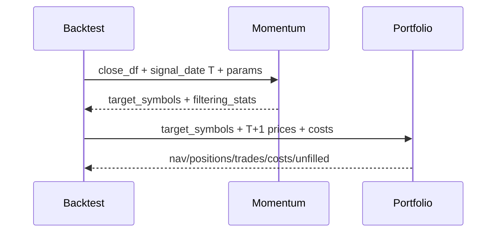

# LLD: STORY-005 - 动量信号与组合成交引擎

> 用户已于 2026-05-15 确认通过；允许在 `STORY-004` 通过实现与验证后实现 `strategies/momentum.py`、`engine/portfolio.py` 并按 LLD 修改 `engine/contracts.py`，仍不得生成真实生产数据、写入 `delivery/**` 或安装脚本。

## 0. 修订记录

| 版本 | 日期 | 修订人 | 变更要点 |
|---|---|---|---|
| 1.2 | 2026-05-15 | meta-po | 用户确认通过批量 LLD / Story Package，回写 `confirmed=true`、`confirmed_by=user`、`confirmed_at=2026-05-15`。 |
| 1.1 | 2026-05-15 | meta-dev / meta-qa / meta-po | 响应 F-001/F-004：补组合会计状态机、核心对象字段表、先卖后买、现金不足买入缩放、调仓幂等键、会计恒等式测试和最小 CLI 诊断日志契约；保持 `confirmed=false`。 |

## 1. Goal

创建动量信号纯函数与组合成交引擎的实现设计。后续实现必须消费 STORY-004 `LoadedBacktestData.close_df/universe/calendar/metadata`，按 T 日收盘动量、T+1 收盘成交、等权目标、成本扣除、现金留存和未成交原因记录生成可供 STORY-006 编排与指标层消费的组合结果。

## 2. Requirements（Functional / Non-Functional）

### 2.1 Functional

- 动量公式固定为 `close[T] / close[T-lookback_days] - 1`。
- 历史窗口不足、信号端点价格缺失、非正价格或非股票池成员必须在信号层剔除并计入 `filtering_stats`。
- `top_fraction` 选择向上取整且至少 1 只；`sell_buffer` 允许当前持仓在边界附近保留，减少不必要换手。
- 组合层只消费目标集合或目标权重，不计算动量排名。
- 成交日必须是信号日后的第一个可用交易日或更晚日期，默认 T+1 收盘价成交。
- 缺失成交价、显式停牌、未知不可交易状态不得生成真实成交；目标资金留现金并记录 `unfilled_reason`。
- 成本至少包含 `commission_rate`、`slippage_rate`、`sell_tax_rate`，并在成交后从组合净值扣除。
- 输出 `PortfolioResult`，覆盖日净值、持仓、成交、成本、现金、换手和未成交明细。

### 2.2 Non-Functional

- 策略函数保持纯函数：不读写文件、不联网、不访问全局可变状态。
- 组合层不导入 AKShare、data_prep、scanner、reporting 或候选模块。
- 不填充缺失价格，不使用指数收益或 0 价格替代缺失成交价。
- pandas 操作面向本地日频研究规模，默认不引入大型回测框架。
- 所有错误结构化暴露，包含 `signal_date`、`execution_date`、`symbol`、`reason`。

## 3. 模块拆分与职责

| 模块 / 文件组 | 职责 | 说明 |
|---|---|---|
| `strategies/momentum.py` | 计算动量、排名、目标集合与过滤统计 | 策略层纯函数，不处理成本和成交 |
| `engine/portfolio.py` | 将目标集合转为等权目标，执行 T+1 成交、成本扣除、现金和持仓更新 | 消费信号结果与价格矩阵 |
| `engine/contracts.py` | 补充过滤原因、未成交原因、成本字段、组合结果字段常量 | 仅常量补充 |

## 4. 代码结构与文件影响范围

| 动作 | 文件路径 | 变更内容 |
|---|---|---|
| 创建 | `strategies/momentum.py` | 实现 `MomentumParams`、`MomentumSignalResult`、`calculate_momentum_scores`、`select_momentum_targets` |
| 创建 | `engine/portfolio.py` | 实现 `PortfolioConfig`、`PortfolioState`、`TradeRecord`、`PortfolioResult`、`run_portfolio` |
| 修改 | `engine/contracts.py` | 追加 `FILTER_REASON_VALUES`、`UNFILLED_REASON_VALUES`、`COST_FIELD_NAMES`、`PORTFOLIO_RESULT_FIELDS` |

排除项：不创建 `engine/backtest.py`、`engine/metrics.py`、`engine/reporting.py`、`engine/scanner.py`、`reports/**`、`data/**` 或 `delivery/**`。

## 5. 数据模型与持久化设计

本 Story 不新增持久化文件，只定义内存对象。

| 对象 / 字段 | 类型 | 约束 | 说明 |
|---|---|---|---|
| `MomentumParams.lookback_days` | int | `>0` | 动量回看交易日数 |
| `MomentumParams.top_fraction` | float | `0 < value <= 1` | 目标持仓比例 |
| `MomentumParams.sell_buffer` | float | `>=0` | 当前持仓保留缓冲比例 |
| `MomentumSignalResult.target_symbols` | list[str] | 稳定排序 | 组合层输入 |
| `MomentumSignalResult.filtering_stats` | dict | reason -> count | 历史窗口不足和缺失价格统计 |
| `PortfolioConfig.initial_cash` | float | `>0` | 初始资金 |
| `PortfolioConfig.commission_rate/slippage_rate/sell_tax_rate` | float | `>=0` | 成本参数 |
| `PortfolioState.cash` | float | `>=0`，浮点 epsilon 内允许微小误差 | 每个交易日结束现金；成本通过现金流体现 |
| `PortfolioState.positions` | dict[str, `PositionRecord`] | symbol 唯一 | 当前持仓状态 |
| `PortfolioState.applied_rebalance_keys` | set[str] | 同一 state 内唯一 | 防止重复应用同一调仓 |
| `PortfolioState.snapshots` | DataFrame/list[`DailyPortfolioSnapshot`] | 交易日升序 | 每日 nav、现金、持仓市值、换手 |
| `PositionRecord.symbol` | str | 非空 | 股票代码 |
| `PositionRecord.quantity` | float | `>=0`；第一版允许小数股 | 数量；不做整手约束 |
| `PositionRecord.last_price` | float | `>0` 或缺失时保留前一估值并 warning | 最近用于估值的价格 |
| `PositionRecord.market_value` | float | `quantity * last_price` | 持仓市值 |
| `PositionRecord.weight` | float | `market_value / nav`，nav 为 0 时空值 | 组合权重 |
| `PositionRecord.cost_basis` | float | `>=0` | 加权持仓成本，第一版用于报告不驱动卖出决策 |
| `PositionRecord.as_of_date` | date | 交易日 | 状态日期 |
| `TradeRecord.trade_id` | str | `rebalance_key + symbol + side` 派生且唯一 | 成交或未成交明细 ID |
| `TradeRecord.rebalance_key` | str | `signal_date + execution_date + params_hash` | 调仓幂等键 |
| `TradeRecord.signal_date/execution_date` | date | execution_date 晚于 signal_date | 信号日与成交日 |
| `TradeRecord.symbol/side` | str | side 为 `buy/sell` | 标的与方向 |
| `TradeRecord.quantity/price/gross_amount` | float | 成交时非负；未成交可为 0/空 | 数量、价格、成交额 |
| `TradeRecord.commission/slippage/sell_tax` | float | `>=0` | 分项成本；卖出税仅卖出时非 0 |
| `TradeRecord.net_cash_flow` | float | 买入为负，卖出为正 | 已扣成本后的现金流 |
| `TradeRecord.status/unfilled_reason` | str | `filled/unfilled`；未成交时 reason 非空 | 未成交原因进入 STORY-006/012 |
| `CostRecord` | dict/dataclass | 含 `trade_id`、`cost_type`、`amount`、`symbol`、`execution_date` | 成本明细；不单独从 nav 二次扣除 |
| `DailyPortfolioSnapshot` | dict/dataclass | 含 `trade_date`、`ending_cash`、`positions_market_value`、`nav`、`turnover_amount` | 会计恒等式事实源 |
| `PortfolioResult.nav` | pandas.Series | 交易日升序，值为 `ending_cash + positions_market_value` | STORY-006 指标输入 |
| `PortfolioResult.positions/trades/costs/cash/unfilled` | DataFrame/Series | 可为空但 schema 固定 | STORY-006/012 报告与审计输入 |
| `PortfolioResult.turnover_amount` | float/Series | `>=0` | STORY-006 换手输入 |
| `PortfolioResult.trade_notional` | float/Series | `>=0` | 成交名义金额字段，报告层保留 |

## 6. API / Interface 设计

| 接口 / 入口 | 输入 | 输出 | 调用方 | 说明 |
|---|---|---|---|---|
| `calculate_momentum_scores(close_df, signal_date, lookback_days)` | 价格矩阵、信号日、回看窗口 | scores、过滤统计 | `select_momentum_targets` | 测试 `T-MOMENTUM-FORMULA-01` |
| `select_momentum_targets(close_df, signal_date, current_positions, params)` | 价格矩阵、当前持仓、参数 | `MomentumSignalResult` | `engine.backtest` | 测试 `T-TOP-FRACTION-01`、`T-SELL-BUFFER-01` |
| `build_equal_weight_targets(target_symbols, available_cash)` | 目标股票、资金 | 目标权重/目标金额 | `run_portfolio` | 测试 `T-EQUAL-WEIGHT-01` |
| `run_portfolio(close_df, calendar, signal_results, config, trade_status=None)` | 价格、交易日、信号、成本配置 | `PortfolioResult` | STORY-006 | 测试 `T-TPLUS1-TRADE-01`、`T-ACCOUNTING-IDENTITY-01` |
| `apply_rebalance(state, signal_result, execution_date, prices, config)` | 当前 `PortfolioState`、目标、成交日价格、成本配置 | 更新后的 `PortfolioState` 与 trades/costs | `run_portfolio` | 测试 `T-SELL-BEFORE-BUY-01`、`T-CASH-SCALE-BUY-01`、`T-REBALANCE-IDEMPOTENT-01` |
| `apply_trade_costs(trades, config)` | 成交记录、成本参数 | 成本明细 | `run_portfolio` | 测试 `T-COST-FIELDS-01` |

错误暴露：参数非法抛 `StrategyParameterError`；关键价格矩阵为空抛 `PortfolioInputError`；成交价缺失生成未成交明细而非真实成交；成本导致现金为负时抛 `PortfolioAccountingError`。

## 7. 核心处理流程

1. STORY-006 后续编排从 STORY-004 取得 `close_df`、`calendar`、`metadata`。
2. 每个调仓信号日 T 调用 `select_momentum_targets`。
3. 信号层取 `T-lookback_days` 与 T 的 close，剔除窗口不足和端点缺失 symbol。
4. 信号层按动量降序、symbol 升序稳定排序，应用 `top_fraction` 和 `sell_buffer`。
5. 组合层在 T+1 或更晚可用交易日读取成交价。
6. `apply_rebalance` 生成 `rebalance_key = signal_date + execution_date + params_hash`；若同一 `PortfolioState` 已应用该 key，直接抛 `PortfolioAccountingError`，不得重复扣现金或重复生成成交。
7. 组合层先卖出非目标或超配部分；卖出成交先增加现金，佣金、滑点和卖出税从卖出现金流中扣除，卖出不可交易则保留原持仓并记录 `unfilled_reason`。
8. 基于卖出后现金和目标等权金额生成买入计划；当计划买入总额加买入成本超过可用现金时，对全部买入目标按同一比例缩放，缩放后保留目标金额与实际成交金额差异。
9. 买入成交后扣减现金；缺失成交价、不可交易或缩放后金额为 0 的目标留现金并记录原因。
10. 每个交易日收盘后更新 `PositionRecord.last_price/market_value/weight`、`PortfolioState.cash`、`DailyPortfolioSnapshot` 和 `PortfolioResult`。
11. 每日强制校验会计恒等式：`nav = ending_cash + sum(position_market_value)`；成本只通过现金流体现，不从 nav 二次扣除。

异常路径：窗口不足导致 symbol 剔除；全部 symbol 被剔除时当期目标为空并持有现金；成交日价格缺失生成 `missing_execution_price`；交易日不足以取得 T+1 时本组回测失败并给 STORY-007 保留失败行。

## 8. 技术设计细节

- 排名规则：`momentum` 降序，tie-breaker 使用 symbol 升序，保证扫描可复现。
- `top_fraction` 个数：`ceil(valid_symbol_count * top_fraction)`，上下限为 `[1, valid_symbol_count]`。
- `sell_buffer`：将当前持仓中排名未跌出 `top_count * (1 + sell_buffer)` 的 symbol 继续保留；新买入仍来自 top_count。
- 收益归属：调仓前持仓承担至 T+1 收盘；调仓后持仓从 T+1 收盘后参与下一日收益。
- 成本扣除顺序：先卖后买；卖出先释放现金并扣卖出侧成本，买入再按可用现金执行并扣买入侧成本，最后更新现金和净值。
- 现金不足买入缩放：若 `sum(planned_buy_gross + buy_commission + buy_slippage) > cash_after_sell`，按 `cash_after_sell / planned_buy_cash_required` 对所有买入目标金额统一缩放；缩放比例进入 `PortfolioResult.metadata["buy_scale_ratio"]` 或等价统计。
- 幂等规则：`rebalance_key = f"{signal_date}|{execution_date}|{params_hash}"`；同一 `PortfolioState` 内重复 key 必须 fail fast，禁止静默覆盖或重复应用。
- 会计恒等式：每日 `nav = ending_cash + positions_market_value`，误差容忍为 `epsilon = max(1e-8, nav * 1e-10)`；成本明细只解释现金流，不再单独扣减 nav。
- 图示类型选择：跨策略、组合和后续 backtest 三个模块，使用时序图。

## 9. 安全与性能设计

| 维度 | 设计措施 | 验证方式 |
|---|---|---|
| 安全 | 策略和组合层不导入网络、data_prep 或文件写入模块 | `T-NETWORK-BOUNDARY-01` 静态扫描 |
| 安全 | 不使用 eval/exec/shell/pickle 解释参数 | `T-DANGEROUS-COMMAND-01` |
| 可靠性 | 缺失价格不填充，全部进入过滤或未成交原因 | `T-MISSING-SIGNAL-PRICE-01`、`T-MISSING-EXECUTION-PRICE-01` |
| 可靠性 | 每次调仓记录 `rebalance_key` 并校验会计恒等式，重复 key fail fast | `T-REBALANCE-IDEMPOTENT-01`、`T-ACCOUNTING-IDENTITY-01` |
| 可观测性 | 本地 CLI/离线入口使用标准 logging 输出到 stderr；`INFO start/end`、`WARNING unfilled/degraded`、`ERROR structured_error`，字段含 `event_name`、`run_id`、`module=portfolio`、`story_id=STORY-005`、`status`、`params_summary`、`elapsed_seconds`；不写持久化日志文件、不记录凭据或绝对隐私路径；服务监控标 NA | `T-LOGGING-MINIMAL-01` |
| 性能 | 动量和权重计算使用 pandas/向量化，避免逐 symbol I/O | 100 symbol x 100 day fixture |

## 10. 测试设计

| 测试场景 | 前置条件 | 操作 | 预期结果 | 验证方式 |
|---|---|---|---|---|
| `T-MOMENTUM-FORMULA-01` | 构造 3 只股票 20 日 close | 调用 `calculate_momentum_scores` | 公式严格等于 `close[T]/close[T-lookback]-1` | 单元测试 |
| `T-MISSING-SIGNAL-PRICE-01` | 某股票端点缺失 | 选择目标 | 缺失股票不参与排名，原因计数非 0 | 单元测试 |
| `T-TOP-FRACTION-01` | 10 只有效股票，`top_fraction=0.2` | 选择目标 | 返回 2 只目标 | 单元测试 |
| `T-SELL-BUFFER-01` | 当前持仓排名在缓冲区内 | 选择目标 | 持仓被保留 | 单元测试 |
| `T-TPLUS1-TRADE-01` | calendar 含 T 与 T+1 | 运行组合 | 任一成交日不早于 T+1 | 单元测试 |
| `T-COST-FIELDS-01` | 生成买卖交易 | 应用成本 | 成本字段含佣金、滑点、卖出税 | 单元测试 |
| `T-MISSING-EXECUTION-PRICE-01` | T+1 价格缺失 | 运行组合 | 不生成成交，`unfilled_reason` 非空 | 单元测试 |
| `T-STORY006-CONTRACT-01` | 合规结果 | 读取 `PortfolioResult` | nav/positions/trades/costs schema 稳定 | 接口测试 |
| `T-SELL-BEFORE-BUY-01` | 当前持仓含非目标股且新目标需买入 | 应用调仓 | 卖出现金先入账，再计算买入可用现金 | 单元测试 |
| `T-CASH-SCALE-BUY-01` | 计划买入额加成本超过卖出后现金 | 应用调仓 | 全部买入目标按同一比例缩放，现金不为负 | 单元测试 |
| `T-REBALANCE-IDEMPOTENT-01` | 同一 state 重复应用同一 `rebalance_key` | 调用 `apply_rebalance` 两次 | 第二次 fail fast，不重复成交 | 单元测试 |
| `T-ACCOUNTING-IDENTITY-01` | 多日买卖和成本 fixture | 运行组合 | 每日 `nav == ending_cash + positions_market_value` 在 epsilon 内成立 | 单元测试 |
| `T-LOGGING-MINIMAL-01` | caplog/stderr fixture | 运行组合入口成功、warning、错误路径 | 输出 start/end、warning、structured_error，且不含凭据/绝对隐私路径 | 单元测试 |

## 11. 实施步骤

| TASK-ID | 动作 | 目标文件 | 详细描述 | 对应测试 |
|---|---|---|---|---|
| S005-T1 | 创建 | `strategies/momentum.py` | 定义参数、结果对象、动量公式、过滤统计和排序选择 | `T-MOMENTUM-FORMULA-01`, `T-MISSING-SIGNAL-PRICE-01`, `T-TOP-FRACTION-01` |
| S005-T2 | 创建 | `strategies/momentum.py` | 实现 `sell_buffer` 保留规则和非法参数错误 | `T-SELL-BUFFER-01` |
| S005-T3 | 创建 | `engine/portfolio.py` | 定义组合配置、状态、成交、成本和结果对象 | `T-STORY006-CONTRACT-01` |
| S005-T4 | 创建 | `engine/portfolio.py` | 实现 T+1 成交、先卖后买、现金留存、现金不足买入缩放、成本扣除和未成交原因 | `T-TPLUS1-TRADE-01`, `T-COST-FIELDS-01`, `T-MISSING-EXECUTION-PRICE-01`, `T-SELL-BEFORE-BUY-01`, `T-CASH-SCALE-BUY-01` |
| S005-T5 | 创建 | `engine/portfolio.py` | 实现 `rebalance_key` 幂等检查、每日会计恒等式校验和最小 CLI 诊断日志 | `T-REBALANCE-IDEMPOTENT-01`, `T-ACCOUNTING-IDENTITY-01`, `T-LOGGING-MINIMAL-01` |
| S005-T6 | 修改 | `engine/contracts.py` | 补充过滤、未成交、成本、现金、换手和组合结果字段常量 | `T-STORY006-CONTRACT-01`, `T-NETWORK-BOUNDARY-01` |

## 12. 风险、难点与预研建议

| 风险 / 难点 | 影响 | 缓解措施 / 预研建议 |
|---|---|---|
| STORY-004 输出对象仍未人工确认 | 下游接口可能随 LLD review 调整 | 保持 open item，确认后按 `LoadedBacktestData` final schema 实现 |
| `sell_buffer` 与 `top_fraction` 交互不直观 | 换手结果难解释 | LLD review 确认缓冲区算法，并在 metadata 输出规则摘要 |
| 现金与成本扣除顺序可能影响净值 | 指标层复用时不一致 | 固化先卖后买、现金不足缩放和成本经现金流体现，测试会计恒等式 |
| 交易状态增强尚未实现 | 第一版只能处理显式字段或缺失价格 | 未成交原因预留枚举，STORY-010 后扩展 provider |

### OPEN / Spike 跟踪

| ID | 类型（OPEN / Spike） | 问题 | 下一动作 | 责任方 |
|---|---|---|---|---|
| O-01 | OPEN | STORY-004 `LoadedBacktestData` schema 与 `metadata` 字段需随批量 LLD 一并确认 | Story Package review 确认 | meta-po / 用户 |
| O-02 | RESOLVED | `sell_buffer` 的精确定义采用 `top_count * (1 + sell_buffer)` 后取整为卖出缓冲边界 | 已回写 §8；等待用户在批量 LLD 中确认，不代表 `confirmed=true` | meta-po / 用户 |
| O-03 | RESOLVED | 全部目标未成交时单期留现金并记录原因；仅关键输入缺失或全区间不可运行时失败 | 已回写 §7/§8；等待用户在批量 LLD 中确认，不代表 `confirmed=true` | meta-po / 用户 |

## 13. 回滚与发布策略

- 发布方式：LLD 确认后按 S005-T1 至 S005-T5 实现，先策略层后组合层。
- 回滚触发条件：动量公式、T+1 成交、成本字段、缺失成交价处理或无网络边界任一 BLOCKING 验证失败。
- 回滚动作：撤回 `strategies/momentum.py`、`engine/portfolio.py` 和 `engine/contracts.py` 中仅由 STORY-005 增加的常量，保留 STORY-001 至 STORY-004 产物。

## 14. Definition of Done

- [x] 14 个章节全部填写完成。
- [x] frontmatter 含 `tier`、`shared_fragments`、`open_items`、`confirmed: true`。
- [x] 文件影响范围限定为 `strategies/momentum.py`、`engine/portfolio.py`、`engine/contracts.py`。
- [x] 第 6 节接口在第 10 节有测试入口。
- [x] 第 7 节异常路径在第 10 节有错误路径验证。
- [x] 第 11 节 TASK-ID 与文件影响范围一一对应。
- [x] 已完成实现验证；未写真实 `data/**`、`reports/**` 或 `delivery/**`。

## 人工确认区

> **元工作流检查点 - 批量 Story Package 确认**：由 meta-po 聚合 STORY-004 至 STORY-013 LLD 后发起。确认前不得实现本 Story。
