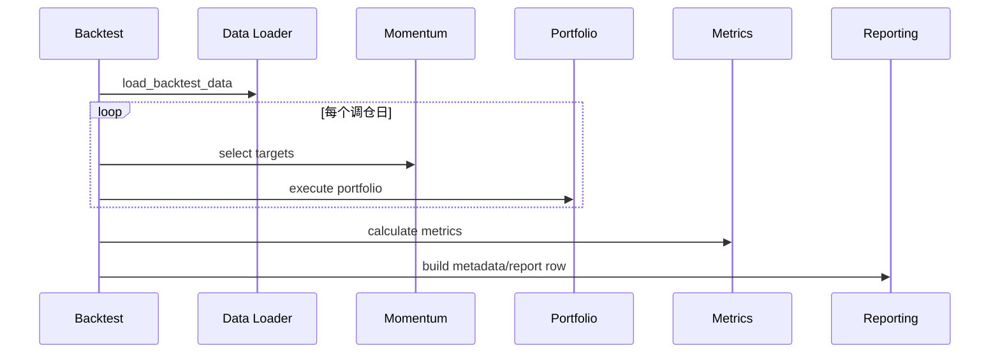

# LLD: STORY-006 - 指标、单次回测报告与 metadata

> 用户已于 2026-05-15 确认通过；允许在 `STORY-005` 通过实现与验证后实现 `engine/backtest.py`、`engine/metrics.py`、`engine/reporting.py` 并按 LLD 修改 `engine/contracts.py`，仍不得生成真实生产数据、写入 `delivery/**` 或安装脚本。

## 0. 修订记录

| 版本 | 日期 | 修订人 | 变更要点 |
|---|---|---|---|
| 1.2 | 2026-05-15 | meta-po | 用户确认通过批量 LLD / Story Package，回写 `confirmed=true`、`confirmed_by=user`、`confirmed_at=2026-05-15`。 |
| 1.1 | 2026-05-15 | meta-dev / meta-qa / meta-po | 响应 F-001/F-002/F-004：固化 `PortfolioResult` 消费字段、调仓日生成接口与边界规则、2019-2025 schedule 测试和最小 CLI 诊断日志契约；保持 `confirmed=false`。 |

## 1. Goal

创建单次回测编排、绩效指标和报告 metadata 的设计。后续实现必须串联 Data Loader、动量信号、组合成交、指标计算与报告 builder，输出完整日净值、至少 5 项绩效指标和限制项 metadata，并为 STORY-007 提供可重复调用的单组回测入口。

## 2. Requirements（Functional / Non-Functional）

### 2.1 Functional

- `run_backtest(...)` 接收日期区间、策略参数、成本参数、数据路径和质量策略。
- 数据合同 `fail` 时拒绝运行；`warn` 可运行但 metadata 必须披露。
- 指标至少包含 `total_return`、`annual_return`、`max_drawdown`、`sharpe`、`turnover`、`final_nav`。
- 年化默认使用 252 个交易日，无风险利率默认 0，并进入 metadata。
- `nav` 完整性必须显式校验：日期唯一升序、首尾覆盖请求回测区间内交易日、所有净值为有限正数，不得包含重复日期、缺起止日期、负值、0、NaN 或 inf。
- 默认验收场景必须覆盖 `2019-01-01` 至 `2025-12-31`，在合规本地数据或等价 fixture 下输出完整日净值、指标与 metadata。
- 报告 metadata 覆盖复权口径、信号/成交时点、`available_at` 规则、固定当前沪深 300、`is_pit_universe`、幸存者偏差、停牌、涨跌停、新股、退市、ST、财报披露日和历史成分变化限制。
- 单次结果能转为扫描行基础字段，供 STORY-007 复用。

### 2.2 Non-Functional

- 回测主路径离线运行，不导入 data_prep、AKShare 或聚宽接口。
- 回测入口无全局可变状态，60 组扫描重复调用时结果互不污染。
- 指标函数不修改输入净值和交易明细。
- 报告 builder 不写真实 `reports/**`；本 Story 只返回 dict/row，CSV 写入由 STORY-007/008 执行。
- 错误结构化返回给扫描层，包含 `error_type`、`error_message`、`params`。

## 3. 模块拆分与职责

| 模块 / 文件组 | 职责 | 说明 |
|---|---|---|
| `engine/backtest.py` | 编排 loader、momentum、portfolio、metrics、reporting | STORY-007 复用入口 |
| `engine/metrics.py` | 计算收益、回撤、Sharpe、换手和净值摘要 | 纯计算，无 I/O |
| `engine/reporting.py` | 汇总单次报告 row、metadata、限制项字段 | 后续扫描/候选复用 |
| `engine/contracts.py` | 补充指标字段和 metadata 字段常量 | 仅常量 |

## 4. 代码结构与文件影响范围

| 动作 | 文件路径 | 变更内容 |
|---|---|---|
| 创建 | `engine/backtest.py` | 定义 `BacktestConfig`、`BacktestResult`、`run_backtest`、错误包装 |
| 创建 | `engine/metrics.py` | 实现 `calculate_metrics`、最大回撤、Sharpe、换手计算 |
| 创建 | `engine/reporting.py` | 实现 `build_backtest_metadata`、`build_backtest_report_row`、限制项字段合并 |
| 修改 | `engine/contracts.py` | 追加 `METRIC_FIELD_NAMES`、`REPORT_METADATA_FIELDS`、`LIMITATION_FIELD_NAMES` |

排除项：不创建扫描 CSV、候选 CSV、真实报告文件、`delivery/**` 或安装脚本。

## 5. 数据模型与持久化设计

本 Story 不新增持久化；所有对象为内存对象。

| 对象 / 字段 | 类型 | 约束 | 说明 |
|---|---|---|---|
| `BacktestConfig.start_date/end_date` | date/string | 闭区间 | 回测区间 |
| `BacktestConfig.strategy_params` | dict | 含 lookback/rebalance/fraction/sell_buffer | 传给 STORY-005 |
| `BacktestConfig.cost_params` | dict | 三项成本非负 | 报告必须披露 |
| `BacktestResult.nav` | pandas.Series | 交易日升序，非空 | 指标输入 |
| `BacktestResult.metrics` | dict | 至少 6 个指标 | 报告与扫描输入 |
| `BacktestResult.metadata` | dict | 覆盖限制项字段 | 扫描与候选继承 |
| `BacktestResult.portfolio` | object/dict | 含 positions/trades/costs | 审计和指标输入 |
| `NavIntegrityResult` | dict/dataclass | 含 `is_unique_sorted`、`covers_start_end`、`finite_positive`、`missing_boundary_dates` | 回测完成后、指标计算前的强校验结果 |
| `RebalanceScheduleItem.signal_date` | date | 请求区间内开市日 | 可产生信号的日期 |
| `RebalanceScheduleItem.execution_date` | date | signal_date 后第一个开市日，且不晚于请求区间内可归属收益日期 | 默认 T+1 成交日期；无合法执行日时跳过 |
| `RebalanceScheduleItem.skip_reason` | str | 跳过项非空 | 如 `skipped_no_execution_date` |
| `PortfolioResult.nav` | pandas.Series | 唯一升序、有限正数 | 来自 STORY-005 |
| `PortfolioResult.positions` | DataFrame | 含 `symbol,quantity,last_price,market_value,weight,cost_basis,as_of_date` | 指标、报告和审计输入 |
| `PortfolioResult.trades` | DataFrame | 含 `trade_id,rebalance_key,signal_date,execution_date,symbol,side,quantity,price,gross_amount,commission,slippage,sell_tax,net_cash_flow,status,unfilled_reason` | 换手、约束统计和审计输入 |
| `PortfolioResult.costs` | DataFrame | 含 `trade_id,cost_type,amount,symbol,execution_date` | 成本披露 |
| `PortfolioResult.cash` | Series/DataFrame | 含 `ending_cash` | nav 恒等式校验与报告 |
| `PortfolioResult.turnover_amount/trade_notional` | float/Series | `>=0` | 换手率和成交额字段；报告统一消费 `turnover_amount` |

## 6. API / Interface 设计

| 接口 / 入口 | 输入 | 输出 | 调用方 | 说明 |
|---|---|---|---|---|
| `run_backtest(config: BacktestConfig)` | 数据路径、日期、策略、成本 | `BacktestResult` | STORY-007 scanner | 测试 `T-BACKTEST-PASS-01` |
| `build_rebalance_schedule(calendar, lookback_days, rebalance_freq, start_date, end_date)` | 升序开市日、回看窗口、调仓频率、请求区间 | list[`RebalanceScheduleItem`] 与 skipped 统计 | `run_backtest` / STORY-007 | 测试 `T-REBALANCE-SCHEDULE-01`、`T-REBALANCE-WARMUP-01`、`T-NO-TPLUS1-SKIP-01`、`T-BACKTEST-2019-2025-SCHEDULE-01` |
| `calculate_metrics(nav, trades, positions, annualization_days=252, risk_free_rate=0.0)` | 净值、交易、持仓 | metrics dict | `run_backtest` | 测试 `T-METRICS-01` |
| `calculate_max_drawdown(nav)` | 净值序列 | 最大回撤 | `calculate_metrics` | 测试 `T-MAX-DRAWDOWN-01` |
| `calculate_turnover(trades, nav)` | 成交、净值 | 换手率 | `calculate_metrics` | 测试 `T-TURNOVER-01` |
| `validate_nav_integrity(nav, calendar, requested_start, requested_end)` | 净值、交易日历、请求区间 | `NavIntegrityResult` 或错误 | `run_backtest` / `calculate_metrics` | 测试 `T-NAV-INTEGRITY-01`、`T-NAV-BAD-VALUE-01` |
| `build_backtest_metadata(loader_metadata, portfolio_stats, config)` | loader metadata、组合统计、配置 | metadata dict | `run_backtest` / STORY-007 | 测试 `T-METADATA-LIMITATIONS-01` |
| `build_backtest_report_row(result)` | BacktestResult | 扫描可复用 row | STORY-007/008 | 测试 `T-REPORT-ROW-01` |

错误暴露：loader 或 portfolio 结构化错误由 `run_backtest` 包装为 `BacktestExecutionError`；指标输入为空抛 `MetricsInputError`；metadata 缺必需限制项抛 `ReportMetadataError`。

## 7. 核心处理流程

1. `run_backtest` 校验配置、日期和参数。
2. 调用 STORY-004 loader，质量 fail 直接失败，warn 继续并保留 warning。
3. 调用 `build_rebalance_schedule(...)` 生成确定性调仓计划；空 schedule 直接失败，跳过项进入 metadata warning。
4. 对每个 `RebalanceScheduleItem(signal_date, execution_date)` 调用 STORY-005 动量目标与组合成交逻辑。
5. 收集完整 `PortfolioResult`。
6. 调用 `validate_nav_integrity` 校验净值日期唯一升序、起止覆盖和有限正数；失败则结构化报错。
7. 调用 `calculate_metrics` 计算绩效。
8. 调用 reporting 构建 metadata 与 report row。
9. 返回 `BacktestResult` 给用户或 STORY-007。

异常路径：loader fail 终止；末尾信号日无请求区间内 T+1 执行日时跳过并记录 `skipped_no_execution_date`，若整个 schedule 为空则本次回测失败；指标输入净值为空失败；`nav` 出现重复日期、缺起止日期、非有限值、非正值或排序错误时失败；metadata 缺限制项失败；warn 不失败但必须披露。

## 8. 技术设计细节

- 累计收益：`final_nav / initial_nav - 1`。
- 年化收益：按实际交易日数和 `annualization_days=252` 计算。
- 最大回撤：基于累计净值滚动峰值。
- Sharpe：日收益均值减无风险日化后除以标准差，再乘 `sqrt(252)`；标准差为 0 时输出空值并 warning。
- 换手：成交金额绝对值之和除以平均净值或期初净值，口径进入 metadata。
- 限制项 metadata 使用 `engine.reporting` 统一字段，供单次、扫描、候选一致复用。
- 调仓日生成：
  - `calendar` 来自 STORY-004 请求区间内开市日，必须升序且无重复。
  - `signal_date` 必须已有 `lookback_days` 个历史开市日可计算动量端点；首个合格信号日为 `calendar[lookback_days]` 或等价第一个满足窗口的开市日。
  - 首个合格信号日触发一次，此后每隔 `rebalance_freq` 个开市日触发一次，计数仅基于开市日，不用自然日。
  - 每个 signal_date 默认取下一个开市日为 `execution_date`；若不存在，或执行日超过请求区间可归属收益边界，则该 signal 不进入 schedule，并记录 `skipped_no_execution_date` warning。
  - schedule 为空时 `run_backtest` fail fast，错误包含 `lookback_days`、`rebalance_freq`、`start_date`、`end_date` 和 calendar 长度。
  - 2019-2025 验收 fixture 必须断言 signal/execution 日期集合，而不只断言 nav 覆盖。
- `PortfolioResult` 字段消费固定：报告层统一使用 `turnover_amount` 作为换手金额来源，保留 `trade_notional` 作为成交名义金额；`positions/trades/costs/cash/unfilled` schema 以 STORY-005 §5 为准。
- 图示类型选择：跨 5 个模块，使用时序图。

## 9. 安全与性能设计

| 维度 | 设计措施 | 验证方式 |
|---|---|---|
| 安全 | backtest/metrics/reporting 不导入联网模块或 data_prep | `T-NETWORK-BOUNDARY-01` |
| 安全 | metadata 不含凭据或本机隐私路径，只含相对 source paths | `T-METADATA-SAFE-01` |
| 可靠性 | warn/fail 质量状态按 ADR-006 处理 | `T-QUALITY-FAIL-STOP-01`, `T-QUALITY-WARN-DISCLOSE-01` |
| 可靠性 | 调仓 schedule 独立可测，warm-up、首个信号日、最后无 T+1 均有确定行为 | `T-REBALANCE-SCHEDULE-01`, `T-NO-TPLUS1-SKIP-01` |
| 可观测性 | 本地 CLI/离线入口使用标准 logging 输出到 stderr；`INFO start/end`、`WARNING skipped_no_execution_date/quality_warn`、`ERROR structured_error`，字段含 `event_name`、`run_id`、`module=backtest`、`story_id=STORY-006`、`status`、`params_summary`、`relative_path`、`elapsed_seconds`；不写持久化日志文件、不记录凭据或绝对隐私路径；服务监控标 NA | `T-LOGGING-MINIMAL-01` |
| 性能 | 单次回测只加载一次数据，指标计算复用内存结果 | `T-REPEATABLE-ENTRY-01` |

## 10. 测试设计

| 测试场景 | 前置条件 | 操作 | 预期结果 | 验证方式 |
|---|---|---|---|---|
| `T-BACKTEST-PASS-01` | 合成 loader 与组合 fixture | 调用 `run_backtest` | 返回 nav、metrics、metadata | 单元测试 |
| `T-METRICS-01` | 已知净值序列 | 计算指标 | 6 项指标字段存在 | 单元测试 |
| `T-MAX-DRAWDOWN-01` | 峰谷净值 fixture | 计算回撤 | 与手工值一致 | 单元测试 |
| `T-TURNOVER-01` | 成交 fixture | 计算换手 | 换手值非负 | 单元测试 |
| `T-NAV-INTEGRITY-01` | nav 覆盖请求区间内交易日且日期唯一升序 | 校验完整性 | 返回通过，首尾日期覆盖请求区间 | 单元测试 |
| `T-NAV-BAD-VALUE-01` | nav 含重复日期、NaN、inf、0 或负值之一 | 校验完整性 | 抛 `MetricsInputError` 或等价完整性错误 | 单元测试 |
| `T-BACKTEST-2019-2025-01` | 合规 2019-01-01 至 2025-12-31 calendar/loader/portfolio fixture | 调用默认动量回测 | 输出完整区间日净值、指标和 metadata | 集成式单元测试 |
| `T-REBALANCE-SCHEDULE-01` | calendar 覆盖 40 个开市日，`lookback_days=20`、`rebalance_freq=5` | 调用 `build_rebalance_schedule` | 首个 signal 为第 21 个开市日，此后每 5 个开市日触发，execution 为下一开市日 | 单元测试 |
| `T-REBALANCE-WARMUP-01` | calendar 少于或刚好等于 lookback 所需窗口 | 构建 schedule | 历史窗口不足不产生 signal；空 schedule fail fast | 单元测试 |
| `T-NO-TPLUS1-SKIP-01` | 最后一个 signal_date 无后续开市日或执行日超出请求区间 | 构建 schedule | 跳过该 signal，metadata warning 含 `skipped_no_execution_date` | 单元测试 |
| `T-BACKTEST-2019-2025-SCHEDULE-01` | 固定 2019-01-01 至 2025-12-31 开市日 fixture 与默认参数 | 构建 schedule 并运行回测 | signal/execution 日期集合与 fixture 期望完全一致，且 nav/metadata 完整 | 集成式单元测试 |
| `T-STORY005-PORTFOLIO-RESULT-CONTRACT-01` | STORY-005 合规 `PortfolioResult` fixture | 构建指标和报告 row | 消费 `nav/positions/trades/costs/cash/unfilled/turnover_amount/trade_notional` 字段，报告层使用 `turnover_amount` | 接口测试 |
| `T-METADATA-LIMITATIONS-01` | loader metadata + config | 构建 metadata | 覆盖至少 10 类限制项 | 单元测试 |
| `T-REPORT-ROW-01` | BacktestResult | 构建 row | 字段可被 STORY-007 扩展 | 接口测试 |
| `T-QUALITY-FAIL-STOP-01` | loader 抛 DataQualityError | 调用 backtest | 回测失败且错误结构化 | 单元测试 |
| `T-QUALITY-WARN-DISCLOSE-01` | loader metadata 为 warn | 调用 backtest | 成功且 metadata 披露 warn | 单元测试 |
| `T-REPEATABLE-ENTRY-01` | 相同配置调用两次 | 比较结果 | 无全局状态污染 | 单元测试 |
| `T-NETWORK-BOUNDARY-01` | 源码静态扫描 | 扫描 import | 无 AKShare/聚宽/data_prep | 静态检查 |
| `T-LOGGING-MINIMAL-01` | caplog/stderr fixture | 运行成功、跳过调仓、错误路径 | 输出 start/end、warning、structured_error，且不含凭据/绝对隐私路径 | 单元测试 |

## 11. 实施步骤

| TASK-ID | 动作 | 目标文件 | 详细描述 | 对应测试 |
|---|---|---|---|---|
| S006-T1 | 创建 | `engine/backtest.py` | 定义配置、结果、错误包装和 `run_backtest` 编排骨架 | `T-BACKTEST-PASS-01`, `T-QUALITY-FAIL-STOP-01` |
| S006-T2 | 创建 | `engine/backtest.py` | 实现 `build_rebalance_schedule(...)`，接入 warm-up、首个信号日、每 `rebalance_freq` 个开市日、无 T+1 跳过/空 schedule 失败和 STORY-005 结果汇总 | `T-REBALANCE-SCHEDULE-01`, `T-REBALANCE-WARMUP-01`, `T-NO-TPLUS1-SKIP-01`, `T-REPEATABLE-ENTRY-01` |
| S006-T3 | 创建 | `engine/metrics.py` | 实现 nav 完整性校验、收益、年化、回撤、Sharpe、换手 | `T-NAV-INTEGRITY-01`, `T-NAV-BAD-VALUE-01`, `T-METRICS-01`, `T-MAX-DRAWDOWN-01`, `T-TURNOVER-01` |
| S006-T4 | 创建 | `engine/reporting.py` | 实现 metadata 和 report row builder | `T-METADATA-LIMITATIONS-01`, `T-REPORT-ROW-01`, `T-QUALITY-WARN-DISCLOSE-01` |
| S006-T5 | 创建/修改 | `engine/backtest.py`, `engine/reporting.py` | 固化 `PortfolioResult` 消费字段、2019-2025 schedule fixture 验收和最小 CLI 诊断日志 | `T-STORY005-PORTFOLIO-RESULT-CONTRACT-01`, `T-BACKTEST-2019-2025-SCHEDULE-01`, `T-LOGGING-MINIMAL-01` |
| S006-T6 | 修改 | `engine/contracts.py` | 补充指标与报告 metadata 常量 | `T-REPORT-ROW-01`, `T-NETWORK-BOUNDARY-01` |

## 12. 风险、难点与预研建议

| 风险 / 难点 | 影响 | 缓解措施 / 预研建议 |
|---|---|---|
| STORY-005 `PortfolioResult` 未确认 | 指标输入可能变化 | 将接口假设写入 shared/open，批量确认后一致实现 |
| 调仓日生成若只按自然日或自然月理解 | 60 组扫描与候选选择不可复现 | 使用 `build_rebalance_schedule` 固化开市日计数、warm-up、T+1 和 2019-2025 fixture |
| Sharpe 标准差为 0 | 指标异常或除零 | 输出空值/0 并写 warning，测试固定 |
| metadata 字段膨胀 | 扫描 CSV 可读性下降 | 单次 row 保持扁平，复杂限制项用稳定 JSON 字符串 |
| 报告 builder 边界与 CSV 写入混淆 | 可能越界写 reports | 本 Story 只返回 row，不写真实文件 |

### OPEN / Spike 跟踪

| ID | 类型（OPEN / Spike） | 问题 | 下一动作 | 责任方 |
|---|---|---|---|---|
| O-01 | OPEN | 是否确认 Sharpe 标准差为 0 时输出空值并在 metadata warning 披露 | Story Package review 确认 | meta-po / 用户 |
| O-02 | RESOLVED | STORY-005 `PortfolioResult` 成交金额字段统一：报告层消费 `turnover_amount`，保留 `trade_notional` 作为成交名义金额 | 已回写 §5/§8；等待用户在批量 LLD 中确认，不代表 `confirmed=true` | meta-po / 用户 |

## 13. 回滚与发布策略

- 发布方式：LLD 确认后按 backtest、metrics、reporting、contracts 顺序实现。
- 回滚触发条件：指标公式错误、metadata 限制项缺失、回测入口联网、质量 fail 未阻断或扫描复用入口不稳定。
- 回滚动作：撤回 `engine/backtest.py`、`engine/metrics.py`、`engine/reporting.py` 和 `engine/contracts.py` 中 STORY-006 新增常量，保留 STORY-005 及以前产物。

## 14. Definition of Done

- [x] 14 个章节全部填写完成。
- [x] frontmatter 含 `tier`、`shared_fragments`、`open_items`、`confirmed: true`。
- [x] 文件影响范围限定为 `engine/backtest.py`、`engine/metrics.py`、`engine/reporting.py`、`engine/contracts.py`。
- [x] 第 6 节接口在第 10 节有测试入口。
- [x] 第 7 节异常路径在第 10 节有错误路径验证。
- [x] 第 11 节 TASK-ID 与文件影响范围一一对应。
- [x] 已完成实现验证；未写真实 `reports/**`、`data/**` 或 `delivery/**`。

## 人工确认区

> **元工作流检查点 - 批量 Story Package 确认**：由 meta-po 聚合后发起。确认前不得实现本 Story。
