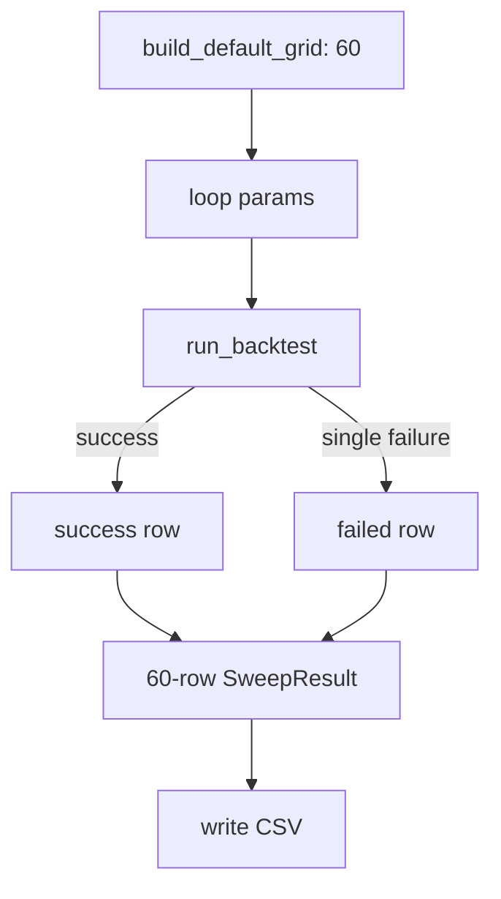

# LLD: STORY-007 - 60 组参数扫描报告

> 用户已于 2026-05-15 确认通过；允许在 `STORY-006` 通过实现与验证后实现 `engine/scanner.py` 并按 LLD 修改 `engine/reporting.py`。仍不得生成真实生产数据、写入 `delivery/**` 或安装脚本。

## 0. 修订记录

| 版本 | 日期 | 修订人 | 变更要点 |
|---|---|---|---|
| 1.2 | 2026-05-15 | meta-po | 用户确认通过批量 LLD / Story Package，回写 `confirmed=true`、`confirmed_by=user`、`confirmed_at=2026-05-15`。 |
| 1.1 | 2026-05-15 | meta-dev / meta-qa / meta-po | 响应 F-002/F-004/F-007：引用 STORY-006 确定性 schedule、补最小 CLI 诊断日志和 CSV 文本字段公式注入防护；保持 `confirmed=false`。 |

## 1. Goal

创建参数扫描设计。后续实现必须构造默认 `5 * 4 * 3 = 60` 组动量参数，离线循环调用 STORY-006 单次回测入口，输出包含成功和失败组合的扫描行，并在实现阶段由显式入口写出 `reports/momentum_param_sweep_local.csv`。

## 2. Requirements（Functional / Non-Functional）

### 2.1 Functional

- 默认参数网格固定为 `lookbacks=[5,10,20,30,60]`、`rebalance_freqs=[5,10,20,30]`、`fractions=[0.05,0.10,0.20]`。
- 输出恰好 60 行；单组失败不得丢行。
- 数据合同 fail 终止全局扫描并返回结构化错误，不输出部分 CSV。
- 单组策略/组合/指标失败时保留 `status=failed`、`error_type`、`error_message` 和参数字段。
- 成功行继承 STORY-006 指标、metadata、成本参数、质量状态和限制项。
- 每行包含 `scan_elapsed_seconds`；报告包含样本内选择或过拟合警示字段。
- 扫描 CSV 必须按固定 schema 输出以下字段：`lookback_days`、`rebalance_freq`、`top_fraction`、`sell_buffer`、`commission_rate`、`slippage_rate`、`sell_tax_rate`、`start_date`、`end_date`、`total_return`、`annual_return`、`max_drawdown`、`sharpe`、`turnover`、`final_nav`、`scan_elapsed_seconds`、`status`、`error_type`、`error_message`、`adjustment_policy`、`signal_timing`、`execution_timing`、`is_pit_universe`、`survivorship_bias_warning`、`data_limitations`、`data_coverage_start`、`data_coverage_end`、`last_successful_update_at`、`data_freshness_days`、`data_freshness_trade_days`、`data_freshness_calendar_days`、`data_quality_status`、`overfit_warning`。

### 2.2 Non-Functional

- 扫描主路径网络调用次数为 0，不调用 data_prep 或 AKShare。
- 默认串行执行，不把并行优化作为验收阻塞项。
- CSV 字段顺序稳定，候选生成可直接读取。
- 测试使用 fake backtest，不依赖真实数据和网络。

## 3. 模块拆分与职责

| 模块 / 文件组 | 职责 | 说明 |
|---|---|---|
| `engine/scanner.py` | 构造网格、调用 backtest、捕获失败、写扫描 CSV | 本 Story 主模块 |
| `engine/reporting.py` | 扩展扫描 row metadata 和过拟合警示 | 复用 STORY-006 |
| `reports/momentum_param_sweep_local.csv` | 实现阶段显式运行后输出的扫描报告 | LLD 阶段不生成 |

## 4. 代码结构与文件影响范围

| 动作 | 文件路径 | 变更内容 |
|---|---|---|
| 创建 | `engine/scanner.py` | 实现 `SweepConfig`、`build_default_grid`、`run_parameter_sweep`、`write_sweep_csv` |
| 修改 | `engine/reporting.py` | 增加 `build_sweep_row` 和过拟合警示字段复用 |
| 写入 | `reports/momentum_param_sweep_local.csv` | 后续实现运行时由显式扫描入口生成；LLD 阶段不得生成 |

## 5. 数据模型与持久化设计

| 对象 / 字段 | 类型 | 约束 | 说明 |
|---|---|---|---|
| `SweepConfig.lookbacks` | list[int] | 默认 5 个 | 扫描维度 |
| `SweepConfig.rebalance_freqs` | list[int] | 默认 4 个 | 扫描维度 |
| `SweepConfig.fractions` | list[float] | 默认 3 个 | 扫描维度 |
| `SweepRow.status` | str | `success/failed` | 单组状态 |
| `SweepRow.error_message` | str | 失败非空 | 单组失败说明 |
| `scan_elapsed_seconds` | float | `>=0` | 单组或累计耗时字段，字段口径固定为每组 elapsed |
| `sanitize_tabular_text(value)` | function | 仅作用于自由文本字段 | 文本首个非空字符为 `= + - @` 时前置单引号，数值/日期/枚举不转字符串 |
| CSV | file | 60 行 | 实现阶段生成，不在 LLD 阶段写入 |

### 5.1 扫描 CSV 固定字段

| 字段组 | 字段 | 来源 | 约束 |
|---|---|---|---|
| 参数 | `lookback_days`, `rebalance_freq`, `top_fraction`, `sell_buffer` | SweepConfig / STORY-006 strategy_params | 每行必填，失败行也必填 |
| 成本 | `commission_rate`, `slippage_rate`, `sell_tax_rate` | BacktestConfig / STORY-006 report row | 每行必填，使用实际值 |
| 区间 | `start_date`, `end_date` | SweepConfig / BacktestConfig | `YYYY-MM-DD` |
| 指标 | `total_return`, `annual_return`, `max_drawdown`, `sharpe`, `turnover`, `final_nav` | STORY-006 `build_backtest_report_row` | 成功行必填；失败行可空 |
| 扫描状态 | `scan_elapsed_seconds`, `status`, `error_type`, `error_message` | scanner | `status=success/failed`；失败行 `error_message` 非空 |
| 口径 | `adjustment_policy`, `signal_timing`, `execution_timing` | STORY-004/006 metadata | 成功行必填；全局数据契约 fail 不写部分 CSV |
| 偏差限制 | `is_pit_universe`, `survivorship_bias_warning`, `data_limitations`, `overfit_warning` | STORY-006 reporting + scanner | 成功行必填；失败行尽量继承可用 metadata |
| 覆盖与质量 | `data_coverage_start`, `data_coverage_end`, `last_successful_update_at`, `data_freshness_days`, `data_freshness_trade_days`, `data_freshness_calendar_days`, `data_quality_status` | STORY-004 loader metadata / STORY-006 report row | `data_freshness_days` 为兼容字段，默认等于 `data_freshness_trade_days` |

## 6. API / Interface 设计

| 接口 / 入口 | 输入 | 输出 | 调用方 | 说明 |
|---|---|---|---|---|
| `build_default_grid()` | 无 | 60 个参数 dict | `run_parameter_sweep` | 测试 `T-GRID-60-01` |
| `run_parameter_sweep(config, backtest_fn=run_backtest)` | SweepConfig、可注入 backtest | `SweepResult` | 用户/候选生成 | 测试 `T-SWEEP-SUCCESS-01` |
| `build_failed_sweep_row(params, error, elapsed)` | 参数、异常、耗时 | failed row | `run_parameter_sweep` | 测试 `T-SINGLE-FAIL-ROW-01` |
| `write_sweep_csv(result, output_path)` | SweepResult、路径 | CSV 路径 | 用户显式扫描入口 | 测试 `T-CSV-SCHEMA-01`、`T-CSV-FULL-SCHEMA-01` |
| `sanitize_tabular_text(value)` | 自由文本字段值 | 安全文本 | `write_sweep_csv` / reporting writer | 测试 `T-CSV-FORMULA-INJECTION-01` |

错误暴露：`DataContractError/DataQualityError` 在扫描前或首组 loader 阶段触发时终止全局扫描；参数非法或单组执行错误保留失败行；CSV 写入失败抛 `SweepReportWriteError`。

## 7. 核心处理流程

1. 构造默认 60 组参数网格。
2. 对每组参数记录开始时间。
3. 调用 STORY-006 `run_backtest`。
4. 成功时调用 reporting 构建成功行。
5. 单组失败时构建失败行，参数字段、status、error 必须非空。
6. 全部组合完成后校验行数为 60。
7. 显式调用 `write_sweep_csv` 写出 CSV。

异常路径：数据合同 fail 终止全局扫描；单组失败保留行；CSV 父目录被文件占用时失败并暴露路径。

## 8. 技术设计细节

- 网格顺序：lookback 外层、rebalance 中层、fraction 内层，保证稳定输出。
- `scan_elapsed_seconds` 使用 `time.monotonic()` 差值。
- 失败行指标为空字符串或 `None`，但参数、状态、错误字段非空。
- `build_sweep_row` 继承 STORY-006 report row，并补充 `lookback_days/rebalance_freq/top_fraction/sell_buffer/status/error_type/error_message/scan_elapsed_seconds/overfit_warning`。
- 字段顺序严格以 §5.1 为准；`data_freshness_days` 作为 REQ-012/报告 schema 兼容字段保留，默认写入 `data_freshness_trade_days` 的值，同时保留 `data_freshness_trade_days` 与 `data_freshness_calendar_days` 以满足 HLD Q-019。
- 调仓日字段继承 STORY-006 `build_rebalance_schedule(...)` 口径；扫描不得重写 schedule 算法，若 STORY-006 返回 `skipped_no_execution_date` warning，扫描行必须保留该 warning 或等价 `data_limitations` 文本。
- CSV 文本字段防护：`error_message`、`data_limitations`、`overfit_warning` 和所有自由文本 reason 字段写入前必须调用 `sanitize_tabular_text`；文本首个非空字符为 `=`、`+`、`-`、`@` 时前置单引号，数值指标、日期、枚举状态和参数值不做文本化处理。
- 图示类型选择：扫描有循环与失败分支，使用流程图。

## 9. 安全与性能设计

| 维度 | 设计措施 | 验证方式 |
|---|---|---|
| 安全 | 不导入 AKShare、聚宽、data_prep 或网络客户端 | `T-NETWORK-BOUNDARY-01` |
| 可靠性 | 单组失败保留行，数据合同 fail 全局终止 | `T-SINGLE-FAIL-ROW-01`, `T-DATA-CONTRACT-FAIL-01` |
| 安全 | CSV 自由文本字段写入前做公式注入防护，数值字段保持原类型 | `T-CSV-FORMULA-INJECTION-01` |
| 性能 | 默认串行 60 组，记录耗时，不做并行复杂化 | `T-GRID-60-01`, `T-ELAPSED-01` |
| 可追溯 | CSV 行包含质量状态、限制项和参数字段 | `T-CSV-SCHEMA-01` |
| 可观测性 | 本地 CLI/离线入口使用标准 logging 输出到 stderr；`INFO start/end`、`WARNING single_group_failed/degraded`、`ERROR structured_error`，字段含 `event_name`、`run_id`、`module=scanner`、`story_id=STORY-007`、`status`、`params_summary`、`relative_path`、`elapsed_seconds`；不写持久化日志文件、不记录凭据或绝对隐私路径；服务监控标 NA | `T-LOGGING-MINIMAL-01` |

## 10. 测试设计

| 测试场景 | 前置条件 | 操作 | 预期结果 | 验证方式 |
|---|---|---|---|---|
| `T-GRID-60-01` | 默认配置 | 调用 `build_default_grid` | 返回 60 组 | 单元测试 |
| `T-SWEEP-SUCCESS-01` | fake backtest 全成功 | 运行扫描 | 60 行全部 success | 单元测试 |
| `T-SINGLE-FAIL-ROW-01` | fake backtest 某组失败 | 运行扫描 | 行数仍 60，失败行 error 非空 | 单元测试 |
| `T-DATA-CONTRACT-FAIL-01` | fake backtest 抛合同 fail | 运行扫描 | 全局失败，不写 CSV | 单元测试 |
| `T-CSV-SCHEMA-01` | SweepResult | 写临时 CSV | 字段覆盖状态、错误、耗时、质量状态 | CSV 检查 |
| `T-CSV-FULL-SCHEMA-01` | SweepResult 含成功和失败行 | 写临时 CSV 并读取表头 | 表头严格覆盖 §5.1 全部字段，失败行参数/status/error 非空 | CSV 检查 |
| `T-ELAPSED-01` | fake backtest | 运行扫描 | elapsed 字段非负 | 单元测试 |
| `T-NETWORK-BOUNDARY-01` | 源码 | 静态扫描 | 无网络/data_prep 导入 | 静态检查 |
| `T-CSV-FORMULA-INJECTION-01` | failed row 文本以 `= + - @` 开头，数值字段正常 | 写临时 CSV | 文本字段前置单引号，数值/日期/枚举字段保持可读类型 | CSV 检查 |
| `T-LOGGING-MINIMAL-01` | caplog/stderr fixture | 运行扫描成功、单组失败、全局错误路径 | 输出 start/end、warning、structured_error，且不含凭据/绝对隐私路径 | 单元测试 |

## 11. 实施步骤

| TASK-ID | 动作 | 目标文件 | 详细描述 | 对应测试 |
|---|---|---|---|---|
| S007-T1 | 创建 | `engine/scanner.py` | 定义配置、结果、默认 60 组网格 | `T-GRID-60-01` |
| S007-T2 | 创建 | `engine/scanner.py` | 实现扫描循环、单组失败捕获、数据合同 fail 全局终止 | `T-SWEEP-SUCCESS-01`, `T-SINGLE-FAIL-ROW-01`, `T-DATA-CONTRACT-FAIL-01` |
| S007-T3 | 创建 | `engine/scanner.py` | 实现 CSV 写入、耗时统计、§5.1 固定字段顺序、文本字段公式注入防护和最小 CLI 诊断日志 | `T-CSV-SCHEMA-01`, `T-CSV-FULL-SCHEMA-01`, `T-ELAPSED-01`, `T-CSV-FORMULA-INJECTION-01`, `T-LOGGING-MINIMAL-01` |
| S007-T4 | 修改 | `engine/reporting.py` | 增加扫描 row builder 和过拟合警示字段 | `T-CSV-SCHEMA-01` |

## 12. 风险、难点与预研建议

| 风险 / 难点 | 影响 | 缓解措施 / 预研建议 |
|---|---|---|
| STORY-006 report row schema 若后续变更 | STORY-008 候选读取可能变化 | 以本 LLD §5.1 扫描 CSV 固定字段为下游契约；后续变更必须同步 STORY-008 |
| 全局数据合同 fail 与单组失败边界不清 | 扫描可能误输出不完整 CSV | 按 HLD §12.4 固化数据合同 fail 终止 |
| 60 组运行时间较长 | 用户体验差 | 记录耗时；并行优化不作为本 Story 验收 |

### OPEN / Spike 跟踪

| ID | 类型（OPEN / Spike） | 问题 | 下一动作 | 责任方 |
|---|---|---|---|---|
| - | RESOLVED | 扫描 CSV 字段已在 §5.1 固化，包含参数、成本、区间、指标、状态、质量、新鲜度、偏差和过拟合警示字段 | 用户修改要求已确认 | meta-po / 用户 |

## 13. 回滚与发布策略

- 发布方式：LLD 确认后实现 `engine/scanner.py`，再最小修改 `engine/reporting.py`。
- 回滚触发条件：默认网格不是 60 行、失败行丢失、扫描联网、数据合同 fail 后仍写 CSV。
- 回滚动作：撤回 `engine/scanner.py` 与 `engine/reporting.py` 中 STORY-007 新增函数，删除实现阶段生成的临时扫描报告；不修改已验证 W0/W1 产物。

## 14. Definition of Done

- [x] 14 个章节全部填写完成。
- [x] frontmatter 含 `tier`、`shared_fragments`、`open_items=0`、`confirmed: true`。
- [x] 文件影响范围限定为 `engine/scanner.py`、`engine/reporting.py` 和运行时扫描 CSV。
- [x] 接口、异常路径、测试、TASK-ID 已对应。
- [x] 已完成实现验证；未生成真实 `reports/momentum_param_sweep_local.csv`。

## 人工确认区

> **元工作流检查点 - 批量 Story Package 确认**：由 meta-po 聚合后发起。确认前不得实现本 Story。
