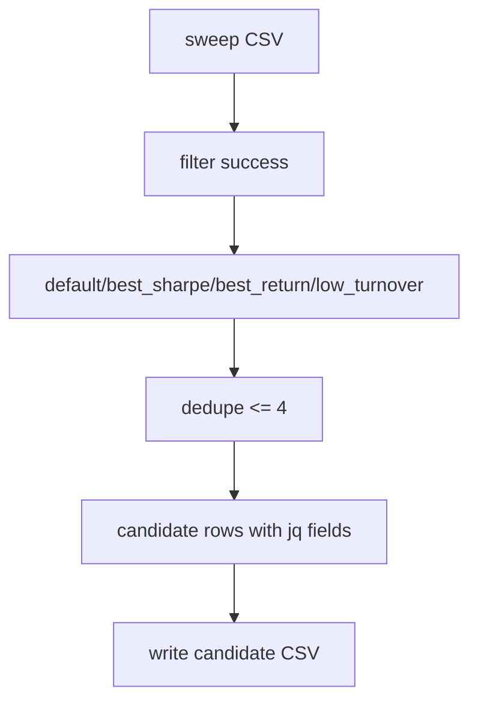

# LLD: STORY-008 - 候选报告与聚宽人工验证模板

> 用户已于 2026-05-15 确认通过；允许在 `STORY-007` 通过实现与验证后实现 `engine/candidates.py` 并按 LLD 修改 `engine/reporting.py`。仍不得生成真实生产数据、写入 `delivery/**` 或安装脚本。

## 0. 修订记录

| 版本 | 日期 | 修订人 | 变更要点 |
|---|---|---|---|
| 1.2 | 2026-05-15 | meta-po | 用户确认通过批量 LLD / Story Package，回写 `confirmed=true`、`confirmed_by=user`、`confirmed_at=2026-05-15`。 |
| 1.1 | 2026-05-15 | meta-dev / meta-qa / meta-po | 响应 F-004/F-007：补最小 CLI 诊断日志和候选 CSV/聚宽文本字段公式注入防护；保持 `confirmed=false`。 |

## 1. Goal

创建候选报告设计。后续实现从 STORY-007 扫描 CSV 中选择不超过 4 组候选，覆盖默认参数、Sharpe 最优、收益最优、保守低换手参数，输出聚宽人工回填字段和方向一致性差异分析字段；不自动调用、提交或轮询聚宽。

## 2. Requirements（Functional / Non-Functional）

### 2.1 Functional

- 读取 `reports/momentum_param_sweep_local.csv`，只从 `status=success` 行选择候选。
- 候选类型固定为 `default`、`best_sharpe`、`best_return`、`conservative_low_turnover`。
- 候选去重后行数 `<=4`；去重导致缺项时输出 `dedupe_reason`。
- 每行 `selection_reason` 非空。
- 输出聚宽人工回填字段：`lookback_days`、`rebalance_freq`、`top_fraction`、`sell_buffer`。
- 保留本地指标、质量状态、限制项 metadata、聚宽手动回填空字段和差异分析字段。
- 候选 CSV 必须包含聚宽方向一致性五类字段：候选排序方向、收益量级、回撤量级、换手特征和差异原因；字段名固定为 `jq_rank_direction_note`、`jq_return_scale_delta`、`jq_drawdown_scale_delta`、`jq_turnover_delta`、`jq_difference_reason`。
- 保守低换手候选必须先过滤成功行和质量合格行，再应用风险/收益阈值：`max_drawdown` 不差于成功行中位数的 1.25 倍，且 `total_return` 非负或 `sharpe` 不低于成功行中位数的 80%；通过过滤后按 `turnover` 升序、`max_drawdown` 较小、`total_return` 较高排序。

### 2.2 Non-Functional

- 候选生成不联网，不导入聚宽 SDK，不创建平台任务。
- 扫描 CSV 不存在、字段缺失或无成功参数时结构化失败。
- CSV 字段顺序稳定，方便用户手动回填。
- 测试使用扫描 CSV fixture 和临时输出路径。

## 3. 模块拆分与职责

| 模块 / 文件组 | 职责 | 说明 |
|---|---|---|
| `engine/candidates.py` | 读取扫描结果、选择候选、去重、输出候选 CSV | 本 Story 主模块 |
| `engine/reporting.py` | 复用限制项 metadata，增加候选差异字段 | 不联网 |
| `reports/momentum_candidates_local.csv` | 实现阶段显式运行后生成 | LLD 阶段不生成 |

## 4. 代码结构与文件影响范围

| 动作 | 文件路径 | 变更内容 |
|---|---|---|
| 创建 | `engine/candidates.py` | 实现 `CandidateConfig`、`select_candidates`、`build_candidate_rows`、`write_candidate_csv` |
| 修改 | `engine/reporting.py` | 增加候选报告字段、聚宽回填字段和差异分析字段 builder |
| 写入 | `reports/momentum_candidates_local.csv` | 后续实现运行时由显式候选入口生成；LLD 阶段不得生成 |

## 5. 数据模型与持久化设计

| 对象 / 字段 | 类型 | 约束 | 说明 |
|---|---|---|---|
| `CandidateType` | str | 4 类枚举 | 候选来源 |
| `CandidateRow.selection_reason` | str | 非空 | 人工可读选择理由 |
| `dedupe_reason` | str | 可空 | 去重后缺项说明 |
| `jq_*` 字段 | str/float | 初始可空 | 用户手动回填聚宽结果 |
| `jq_rank_direction_note` | str | 初始可空 | 聚宽回填后记录候选排序方向是否一致 |
| `jq_return_scale_delta` | float/str | 初始可空 | 聚宽收益量级差异 |
| `jq_drawdown_scale_delta` | float/str | 初始可空 | 聚宽回撤量级差异 |
| `jq_turnover_delta` | float/str | 初始可空 | 聚宽换手特征差异 |
| `jq_difference_reason` | str | 初始可空 | 差异原因解释，覆盖复权、非 PIT、停牌/涨跌停、成交约束、成本和事件时点限制 |
| `sanitize_tabular_text(value)` | function | 仅作用于自由文本字段 | 文本首个非空字符为 `= + - @` 时前置单引号，数值/日期/枚举不转字符串 |
| CSV | file | `<=4` 行 | 实现阶段显式生成 |

## 6. API / Interface 设计

| 接口 / 入口 | 输入 | 输出 | 调用方 | 说明 |
|---|---|---|---|---|
| `load_sweep_report(path)` | 扫描 CSV | DataFrame/list rows | `select_candidates` | 测试 `T-LOAD-SWEEP-01` |
| `select_candidates(sweep_rows, config)` | 扫描成功行 | 候选定义列表 | 用户入口 | 测试 `T-FOUR-CANDIDATES-01` |
| `dedupe_candidates(candidates)` | 候选列表 | 去重候选与原因 | `select_candidates` | 测试 `T-DEDUPE-01` |
| `build_candidate_rows(candidates, sweep_rows)` | 候选、扫描 row | 候选 CSV rows | `write_candidate_csv` | 测试 `T-CANDIDATE-SCHEMA-01`、`T-JQ-DIFF-FIELDS-01` |
| `write_candidate_csv(rows, output_path)` | rows、路径 | CSV 路径 | 用户入口 | 测试 `T-WRITE-CANDIDATE-01` |
| `sanitize_tabular_text(value)` | 自由文本字段值 | 安全文本 | `write_candidate_csv` / reporting writer | 测试 `T-CSV-FORMULA-INJECTION-01` |

错误暴露：扫描文件缺失抛 `CandidateInputNotFoundError`；无成功行抛 `CandidateSelectionError`；必要字段缺失抛 `CandidateSchemaError`；CSV 写入失败抛 `CandidateReportWriteError`。

## 7. 核心处理流程

1. 读取扫描 CSV 并校验必要字段。
2. 过滤 `status=success` 行；无成功行则失败。
3. 选择默认参数行；选择 Sharpe 最大行；选择收益最大行；按 §8 风险/收益阈值选择保守低换手行。
4. 按候选类型顺序去重，同一参数组合只保留首次出现。
5. 构建候选行，继承扫描 metadata，填充聚宽手动回填字段为空。
6. 显式入口写出候选 CSV。

异常路径：扫描 CSV 缺失失败；无成功行失败；去重少于 4 不失败但记录原因；聚宽字段为空不失败。

## 8. 技术设计细节

- 默认参数应与 STORY-007/006 默认策略参数一致。
- Sharpe 最优按 `sharpe` 降序，tie-breaker 使用 `max_drawdown` 较小、`turnover` 较低、参数字典序。
- 收益最优按 `total_return` 降序。
- 保守低换手规则：
  - 输入只允许 `status=success` 且质量状态非 fail 的行。
  - 计算成功行 `max_drawdown`、`total_return`、`sharpe`、`turnover` 的中位数；`max_drawdown` 若为负值，比较绝对回撤幅度。
  - 首选过滤条件为 `total_return >= 0` 且回撤幅度不超过成功行中位回撤幅度的 `1.25` 倍。
  - 若无候选，再放宽为 `sharpe >= median_sharpe * 0.8` 且回撤幅度不超过 `1.25` 倍；仍无候选时该候选类型缺失并写入 `dedupe_reason` / `selection_reason`，不得强行选失败行。
  - 排序规则为 `turnover` 升序、回撤幅度升序、`total_return` 降序、参数字典序。
- 聚宽字段只作为人工回填列，命名如 `jq_total_return`、`jq_max_drawdown`、`jq_sharpe`、`jq_notes`。
- 方向一致性差异字段固定为 `jq_rank_direction_note`、`jq_return_scale_delta`、`jq_drawdown_scale_delta`、`jq_turnover_delta`、`jq_difference_reason`，覆盖候选排序、收益/回撤量级、换手特征和差异原因五类验收维度。
- CSV 文本字段防护：`selection_reason`、`dedupe_reason`、`jq_notes`、`jq_rank_direction_note`、`jq_difference_reason` 以及所有自由文本说明写入前必须调用 `sanitize_tabular_text`；文本首个非空字符为 `=`、`+`、`-`、`@` 时前置单引号，数值指标、日期、枚举状态和参数值不做文本化处理。
- 图示类型选择：候选选择有多分支和去重，使用流程图。

## 9. 安全与性能设计

| 维度 | 设计措施 | 验证方式 |
|---|---|---|
| 安全 | 不导入聚宽、AKShare、requests、data_prep | `T-NETWORK-BOUNDARY-01` |
| 安全 | 候选 CSV 自由文本字段写入前做公式注入防护，数值字段保持原类型 | `T-CSV-FORMULA-INJECTION-01` |
| 可靠性 | 无成功扫描行直接失败，不生成误导候选 | `T-NO-SUCCESS-01` |
| 可解释性 | 每行 `selection_reason` 非空，去重原因显式 | `T-SELECTION-REASON-01`, `T-DEDUPE-01` |
| 可观测性 | 本地 CLI/离线入口使用标准 logging 输出到 stderr；`INFO start/end`、`WARNING dedupe/no_candidate/degraded`、`ERROR structured_error`，字段含 `event_name`、`run_id`、`module=candidates`、`story_id=STORY-008`、`status`、`params_summary`、`relative_path`、`elapsed_seconds`；不写持久化日志文件、不记录凭据或绝对隐私路径；服务监控标 NA | `T-LOGGING-MINIMAL-01` |
| 性能 | 只处理 60 行级别 CSV，pandas 或 csv 均可 | `T-FOUR-CANDIDATES-01` |

## 10. 测试设计

| 测试场景 | 前置条件 | 操作 | 预期结果 | 验证方式 |
|---|---|---|---|---|
| `T-LOAD-SWEEP-01` | 合规扫描 CSV fixture | 加载 | 字段校验通过 | 单元测试 |
| `T-FOUR-CANDIDATES-01` | 四类候选不同 | 选择 | 输出 4 行 | 单元测试 |
| `T-DEDUPE-01` | 四类候选重复 | 选择 | 行数少于 4 且有 dedupe_reason | 单元测试 |
| `T-NO-SUCCESS-01` | 全部 failed | 选择 | 抛候选失败错误 | 单元测试 |
| `T-CANDIDATE-SCHEMA-01` | 候选 rows | 构建 schema | 含参数、理由、聚宽字段 | 单元测试 |
| `T-CONSERVATIVE-RULE-01` | 成功扫描行含不同换手、回撤、收益和 Sharpe | 选择保守低换手 | 只从满足风险/收益阈值的成功行中按低换手选出 | 单元测试 |
| `T-JQ-DIFF-FIELDS-01` | 候选 rows | 构建 schema | 五类方向一致性字段均存在 | 单元测试 |
| `T-SELECTION-REASON-01` | 任意候选 | 检查 | `selection_reason` 非空 | 单元测试 |
| `T-WRITE-CANDIDATE-01` | 临时目录 | 写 CSV | 输出 `<=4` 行 | CSV 检查 |
| `T-NETWORK-BOUNDARY-01` | 源码 | 静态扫描 | 无联网/聚宽导入 | 静态检查 |
| `T-CSV-FORMULA-INJECTION-01` | 候选文本字段以 `= + - @` 开头，数值字段正常 | 写临时候选 CSV | 文本字段前置单引号，数值/日期/枚举字段保持可读类型 | CSV 检查 |
| `T-LOGGING-MINIMAL-01` | caplog/stderr fixture | 运行候选生成成功、去重/缺候选、错误路径 | 输出 start/end、warning、structured_error，且不含凭据/绝对隐私路径 | 单元测试 |

## 11. 实施步骤

| TASK-ID | 动作 | 目标文件 | 详细描述 | 对应测试 |
|---|---|---|---|---|
| S008-T1 | 创建 | `engine/candidates.py` | 加载扫描 CSV、校验 schema、过滤成功行 | `T-LOAD-SWEEP-01`, `T-NO-SUCCESS-01` |
| S008-T2 | 创建 | `engine/candidates.py` | 实现四类候选选择、保守低换手风险/收益阈值、排序和去重 | `T-FOUR-CANDIDATES-01`, `T-DEDUPE-01`, `T-CONSERVATIVE-RULE-01` |
| S008-T3 | 创建 | `engine/candidates.py` | 构建候选 rows，写 CSV，执行文本字段公式注入防护并输出最小 CLI 诊断日志 | `T-CANDIDATE-SCHEMA-01`, `T-JQ-DIFF-FIELDS-01`, `T-WRITE-CANDIDATE-01`, `T-CSV-FORMULA-INJECTION-01`, `T-LOGGING-MINIMAL-01` |
| S008-T4 | 修改 | `engine/reporting.py` | 增加聚宽回填字段、选择理由和五类方向一致性差异分析字段 | `T-SELECTION-REASON-01`, `T-JQ-DIFF-FIELDS-01` |

## 12. 风险、难点与预研建议

| 风险 / 难点 | 影响 | 缓解措施 / 预研建议 |
|---|---|---|
| 扫描字段未最终确认 | 候选选择读取失败 | 将字段清单与 STORY-007 一起确认 |
| 保守低换手排序口径争议 | 候选解释不一致 | 已在 §8 固化风险/收益阈值和排序规则；后续变更需同步 REQ-029 |
| 用户误以为已自动聚宽验证 | 边界误解 | 文件字段命名和 metadata 明确 `manual_jq_validation` |

### OPEN / Spike 跟踪

| ID | 类型（OPEN / Spike） | 问题 | 下一动作 | 责任方 |
|---|---|---|---|---|
| - | RESOLVED | 保守低换手规则已固化：成功且质量合格，回撤不差于中位回撤 1.25 倍，收益非负或 Sharpe 不低于中位数 80%，再按换手升序选择 | 用户修改要求已确认 | meta-po / 用户 |

## 13. 回滚与发布策略

- 发布方式：LLD 确认后实现候选模块，再最小扩展 reporting。
- 回滚触发条件：候选数超过 4、无成功行仍输出候选、联网或自动聚宽调用、选择理由为空。
- 回滚动作：撤回 `engine/candidates.py` 和 `engine/reporting.py` 中 STORY-008 新增内容；删除实现阶段生成的候选 CSV。

## 14. Definition of Done

- [x] 14 个章节全部填写完成。
- [x] frontmatter 含强输入字段、`open_items=0` 且 `confirmed: true`。
- [x] 接口、异常、测试、TASK-ID 对应完整。
- [x] 已完成实现验证；未联网、未生成真实候选 CSV、未写 delivery。

## 人工确认区

> **元工作流检查点 - 批量 Story Package 确认**：确认前不得实现本 Story。
