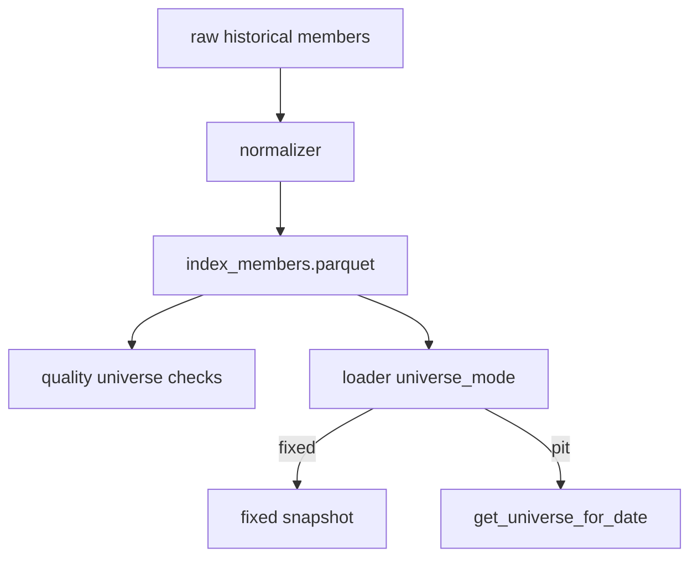

# LLD: STORY-009 - PIT 股票池 Provider 增强契约

> 用户已于 2026-05-15 确认通过；允许在 `STORY-008` 通过实现与验证后实现 `engine/universe.py` 并按 LLD 修改相关文件。W3 source/interface 仍保持 `UNRESOLVED` 的路径必须 fail fast，禁止模糊匹配或伪造数据源；仍不得生成真实生产数据、写入 `delivery/**` 或安装脚本。

## 0. 修订记录

| 版本 | 日期 | 修订人 | 变更要点 |
|---|---|---|---|
| 1.2 | 2026-05-15 | meta-po | 用户确认通过批量 LLD / Story Package，回写 `confirmed=true`、`confirmed_by=user`、`confirmed_at=2026-05-15`；保留 W3 `UNRESOLVED` fail-fast 硬门禁。 |
| 1.1 | 2026-05-15 | meta-dev / meta-qa / meta-po | 响应 F-003/F-004：补 source/interface exact registry、`UNRESOLVED` fail fast 规则和最小 CLI 诊断日志契约；保持 `confirmed=false`。 |

## 1. Goal

创建 PIT 股票池增强设计。后续实现必须在固定当前沪深 300 快照之后，增量支持按决策日期查询当时可用成分股，扩展 raw/manifest/quality/loader 契约，并明确 `is_pit_universe=true`、`index_code`、`effective_date`、`available_at` 字段和固定池兼容路径。

## 2. Requirements（Functional / Non-Functional）

### 2.1 Functional

- 新增 `engine/universe.py`，提供按 `decision_date` 查询股票池的 provider。
- 历史成分股 schema 至少含 `symbol`、`index_code`、`effective_date`、`available_at`、`is_member`、`is_pit_universe`。
- `available_at` 必须不晚于对应 `decision_time`；缺失时 PIT 模式 fail。
- fixed 模式继续支持，metadata 保持 `is_pit_universe=false`。
- 扩展 normalizer 对历史成分股 raw 的标准化映射。
- 扩展 data_prep / manifest 契约，新增历史成分股接口的 source、interface、index_code/date_range 批次字段、raw_path 与 standardized_output_path 记录。
- 扩展 quality 增加成分覆盖、缺失日期和可用时点统计。
- 扩展 loader 按每个信号日查询 PIT universe。

### 2.2 Non-Functional

- 新增联网数据仍只允许经 data_prep 进入 raw/manifest；回测主路径不联网。
- PIT 增强不得破坏 M0-M2 fixed universe 路径。
- 所有 schema 变化通过 constants 公开，不使用模糊字段匹配。
- 测试使用历史成分股 fixture，不依赖真实网络。

## 3. 模块拆分与职责

| 模块 / 文件组 | 职责 | 说明 |
|---|---|---|
| `engine/universe.py` | PIT/fixed universe provider，按日期返回成分股 | 本 Story 主模块 |
| `engine/data_prep.py` / `engine/manifest.py` | 增加历史成分股数据准备请求和 manifest 字段约束 | 只允许显式数据准备入口联网；回测主路径不调用 |
| `engine/normalizer.py` | 扩展历史成分股标准化 | 只处理 raw 派生 |
| `engine/quality.py` | 增加成分覆盖与 available_at 质量检查 | ADR-006 |
| `engine/data_loader.py` | 支持 PIT 模式按信号日查询 universe | 不联网 |
| `engine/contracts.py` | 增加 universe schema 与质量字段常量 | 纯常量 |

## 4. 代码结构与文件影响范围

| 动作 | 文件路径 | 变更内容 |
|---|---|---|
| 创建 | `engine/universe.py` | 定义 `UniverseConfig`、`UniverseSnapshot`、`get_universe_for_date` |
| 修改 | `engine/data_prep.py` | 增加历史成分股接口的显式数据准备请求类型和 batch planning 输入字段 |
| 修改 | `engine/manifest.py` | 增加 `index_code`、成分覆盖区间、historical members dataset 标识等 manifest 读取/写入字段 |
| 修改 | `engine/normalizer.py` | 增加 historical index members 映射和字段校验 |
| 修改 | `engine/quality.py` | 增加 universe coverage、available_at、missing date 检查 |
| 修改 | `engine/data_loader.py` | 增加 fixed/PIT 模式切换与按日股票池加载 |
| 修改 | `engine/contracts.py` | 增加 `UNIVERSE_*` 字段常量 |

## 5. 数据模型与持久化设计

| 对象 / 字段 | 类型 | 约束 | 说明 |
|---|---|---|---|
| `index_members.symbol` | str | 必需 | 股票代码 |
| `index_members.index_code` | str | 必需于 PIT | 指数标识 |
| `effective_date` | date | 必需于 PIT | 成分生效日期 |
| `available_at` | datetime/date | 必需于 PIT | 可用时点 |
| `is_member` | bool | 必需于 PIT | 是否为成分 |
| `is_pit_universe` | bool | PIT 为 true | fixed 为 false |
| `UniverseSnapshot.symbols` | list[str] | 可为空则质量 fail | 决策日股票池 |
| `UniverseSnapshot.metadata` | dict | 含 coverage/available_at | 报告继承 |
| manifest `target_dataset` | str | `index_members` | 标识 raw 批次用于历史成分股标准化 |
| manifest `index_code` | str | PIT 必需 | 指数标识，如 `CSI300` 或实现前确认的接口标识 |
| manifest `membership_coverage_start/end` | date | PIT 必需 | 成分股覆盖区间 |
| manifest `standardized_output_path` | str | 成功派生后必需 | 指向扩展后的 `data/index_members.parquet` |

### 5.1 Source / Interface Exact Registry

| target_dataset | source | interface | raw_metadata_required | manifest_required | normalizer_entry | fail_fast_rule |
|---|---|---|---|---|---|---|
| `index_members` | `UNRESOLVED` | `UNRESOLVED` | `target_dataset`、`source`、`interface`、`request_params`、`index_code`、覆盖区间、`raw_path` | `target_dataset`、`index_code`、`membership_coverage_start/end`、`raw_path`、`standardized_output_path`、`success_items`、`failed_items`、`status` | `normalize_historical_members` | 任一 `source/interface=UNRESOLVED` 时，data_prep batch planning、normalizer exact dispatch、quality 入口和 loader PIT 启用均必须 fail fast，错误说明“W3 实现前确认历史成分股 source/interface”，禁止模糊匹配或字符串包含推断。 |

持久化：复用/扩展 `data/index_members.parquet`，不新增真实数据文件到 LLD 阶段。

## 6. API / Interface 设计

| 接口 / 入口 | 输入 | 输出 | 调用方 | 说明 |
|---|---|---|---|---|
| `get_universe_for_date(index_members, decision_date, mode, index_code)` | 成分表、日期、模式 | `UniverseSnapshot` | data_loader/backtest | 测试 `T-PIT-QUERY-01` |
| `validate_universe_available_at(frame, decision_date)` | 成分数据、决策日 | None/错误 | provider/quality | 测试 `T-AVAILABLE-AT-FAIL-01` |
| `plan_historical_members_batches(index_code, date_range, config)` | 指数代码、日期范围、数据准备配置 | BatchSpec 列表 | data_prep | 测试 `T-DATAPREP-PIT-BATCH-01` |
| `append_historical_members_manifest(record)` | 历史成分股批次记录 | manifest 记录 | manifest | 测试 `T-MANIFEST-PIT-FIELDS-01` |
| `normalize_historical_members(raw_rows)` | raw rows | DataFrame | normalizer | 测试 `T-NORMALIZE-PIT-01` |
| `calculate_universe_quality(frame, requested_range)` | 成分 parquet、区间 | quality fields | quality | 测试 `T-QUALITY-UNIVERSE-01` |
| `load_backtest_data(..., universe_mode="fixed|pit")` | loader 配置 | LoadedBacktestData | backtest | 测试 `T-LOADER-PIT-MODE-01` |

错误暴露：PIT 缺 `available_at/effective_date/index_code` 抛 `UniverseContractError`；日期无覆盖按质量策略 fail/warn；fixed 模式不得伪装成 PIT。

## 7. 核心处理流程

1. data_prep 通过显式历史成分股请求生成 raw 批次，不允许回测主路径触发联网。
2. manifest 为每个历史成分股批次记录 `target_dataset=index_members`、`index_code`、覆盖区间、raw 路径和标准化输出路径。
3. normalizer 将 raw 映射为扩展 `index_members.parquet`。
4. quality 计算成分覆盖和可用时点质量。
5. loader 读取 `universe_mode`。
6. fixed 模式保持 STORY-004 行为。
7. PIT 模式在每个信号日调用 `get_universe_for_date`。
8. provider 过滤 `effective_date <= decision_date` 且 `available_at <= decision_time` 的有效成分。
9. 返回 `UniverseSnapshot` 给信号层。

异常路径：PIT 字段缺失 fail；无日期覆盖 fail；fixed 缺 PIT 字段不失败但披露；`available_at` 未来 fail。

## 8. 技术设计细节

- PIT 查询规则：取 `effective_date <= decision_date` 的最新 membership 状态，再过滤 `is_member=true`。
- `available_at` 规则：每条 membership 的可用时点必须不晚于决策时点。
- fixed 兼容：若 `is_pit_universe` 缺失或 false，走当前快照模式并披露幸存者偏差。
- quality 字段增加 `universe_coverage_start/end`、`universe_missing_trade_days`、`universe_available_at_violation_count`。
- raw/manifest 同步契约：
  - raw metadata 必须包含 `target_dataset=index_members`、`index_code`、`source`、`interface`、`request_params` 和批次覆盖日期；`source/interface` 只能来自 §5.1 registry，不允许模糊匹配。
  - manifest 记录必须包含 `index_code`、`membership_coverage_start/end`、`raw_path`、`standardized_output_path`、`success_items`、`failed_items` 和 `status`。
  - normalizer 只接受 exact `target_dataset=index_members` 与已登记 interface；若 registry 为 `UNRESOLVED`，必须 fail fast，不按字符串包含关系推断。
- 图示类型选择：跨 raw、normalizer、quality、loader、provider，使用流程图。

## 9. 安全与性能设计

| 维度 | 设计措施 | 验证方式 |
|---|---|---|
| 安全 | provider/loader 不联网，不调用 data_prep | `T-NETWORK-BOUNDARY-01` |
| 可靠性 | PIT 缺 available_at fail，fixed 明确披露偏差 | `T-AVAILABLE-AT-FAIL-01`, `T-FIXED-COMPAT-01` |
| 可靠性 | source/interface 使用 exact registry；`UNRESOLVED` 禁止进入 batch planning、normalizer、quality 或 loader PIT 模式 | `T-UNRESOLVED-INTERFACE-FAIL-01` |
| 可观测性 | 本地 CLI/离线入口使用标准 logging 输出到 stderr；`INFO start/end`、`WARNING fixed_fallback/degraded`、`ERROR structured_error`，字段含 `event_name`、`run_id` 或 `manifest_run_id`、`module=universe`、`story_id=STORY-009`、`status`、`params_summary`、`relative_path`、`elapsed_seconds`；不写持久化日志文件、不记录凭据或绝对隐私路径；服务监控标 NA | `T-LOGGING-MINIMAL-01` |
| 性能 | 成分数据按 date/index_code 预排序或缓存查询结果 | `T-PIT-QUERY-01` |
| 兼容性 | fixed 模式回归不变 | `T-FIXED-COMPAT-01` |

## 10. 测试设计

| 测试场景 | 前置条件 | 操作 | 预期结果 | 验证方式 |
|---|---|---|---|---|
| `T-PIT-QUERY-01` | 日期前后成分变化 fixture | 查询两个日期 | 返回不同成分集合 | 单元测试 |
| `T-AVAILABLE-AT-FAIL-01` | 成分 available_at 晚于决策 | 查询 | 抛结构化错误 | 单元测试 |
| `T-DATAPREP-PIT-BATCH-01` | index_code 与日期区间 | 规划历史成分股批次 | BatchSpec 含 target_dataset 与 index_code | 单元测试 |
| `T-MANIFEST-PIT-FIELDS-01` | 历史成分股批次结果 | 写入/读取 manifest | manifest 含 index_code、覆盖区间、raw_path、standardized_output_path | 单元测试 |
| `T-NORMALIZE-PIT-01` | raw 历史成分 fixture | 标准化 | schema 字段完整 | 单元测试 |
| `T-QUALITY-UNIVERSE-01` | 成分覆盖缺口 | 计算质量 | 输出缺失日期和状态 | 单元测试 |
| `T-LOADER-PIT-MODE-01` | loader PIT 配置 | 加载 | metadata `is_pit_universe=true` | 接口测试 |
| `T-FIXED-COMPAT-01` | fixed 快照 fixture | 加载 | fixed 行为保持且 metadata false | 回归测试 |
| `T-NETWORK-BOUNDARY-01` | 源码 | 静态扫描 | 主路径无联网导入 | 静态检查 |
| `T-UNRESOLVED-INTERFACE-FAIL-01` | registry 中 source/interface 为 `UNRESOLVED` | 调用 batch planning、normalizer、quality 或 loader PIT 入口 | fail fast，错误说明需实现前确认 source/interface，且不执行模糊匹配 | 单元测试 |
| `T-LOGGING-MINIMAL-01` | caplog/stderr fixture | 运行 provider 成功、fixed fallback、结构化失败路径 | 输出 start/end、warning、structured_error，且不含凭据/绝对隐私路径 | 单元测试 |

## 11. 实施步骤

| TASK-ID | 动作 | 目标文件 | 详细描述 | 对应测试 |
|---|---|---|---|---|
| S009-T1 | 创建 | `engine/universe.py` | 定义 provider 对象、PIT 查询、available_at 校验 | `T-PIT-QUERY-01`, `T-AVAILABLE-AT-FAIL-01` |
| S009-T2 | 修改 | `engine/data_prep.py`, `engine/manifest.py` | 增加历史成分股 raw/manifest 同步契约、source/interface exact registry 和批次字段 | `T-DATAPREP-PIT-BATCH-01`, `T-MANIFEST-PIT-FIELDS-01`, `T-UNRESOLVED-INTERFACE-FAIL-01` |
| S009-T3 | 修改 | `engine/normalizer.py` | 扩展历史成分股 raw 映射，只接受 registry exact dispatch，`UNRESOLVED` fail fast | `T-NORMALIZE-PIT-01`, `T-UNRESOLVED-INTERFACE-FAIL-01` |
| S009-T4 | 修改 | `engine/quality.py` | 增加成分覆盖和可用时点质量字段 | `T-QUALITY-UNIVERSE-01` |
| S009-T5 | 修改 | `engine/data_loader.py` | 增加 fixed/PIT mode 和按日查询 | `T-LOADER-PIT-MODE-01`, `T-FIXED-COMPAT-01` |
| S009-T6 | 修改 | `engine/contracts.py` | 增加 universe schema、manifest 字段、质量字段、模式枚举、registry 常量和最小日志字段约定 | `T-NETWORK-BOUNDARY-01`, `T-MANIFEST-PIT-FIELDS-01`, `T-LOGGING-MINIMAL-01` |

## 12. 风险、难点与预研建议

| 风险 / 难点 | 影响 | 缓解措施 / 预研建议 |
|---|---|---|
| 历史成分股数据源字段未最终确定 | raw 映射可能返工 | 保留 exact mapping 配置，缺字段 fail |
| PIT 与 fixed 模式并存 | 报告可能混淆 | metadata 强制输出 mode 与 `is_pit_universe` |
| available_at 粒度不同 | 未来函数判断争议 | 统一按决策日收盘后逻辑时点比较 |
| W3 依赖 W2 未实现 | 批量 LLD 只能设计不能实现 | 在 depends_on/open 中状态化 |

### OPEN / Spike 跟踪

| ID | 类型（OPEN / Spike） | 问题 | 下一动作 | 责任方 |
|---|---|---|---|---|
| O-01 | HARD-GATE | 历史沪深 300 成分股 raw source/interface 名称暂为 `UNRESOLVED`；实现前必须替换为 exact source/interface，否则 batch planning、normalizer、quality 和 loader PIT 均 fail fast | W3 实现前确认；不得模糊匹配 | meta-po / 用户 |
| O-02 | OPEN | `available_at` 若只有日期无时间，是否统一按当日收盘后可用 | Story Package review 确认 | meta-po / 用户 |
| O-03 | OPEN | PIT 缺单日成分覆盖时质量状态默认 fail 还是 warn | Story Package review 确认 | meta-po / 用户 |
| O-04 | OPEN | 是否允许同一回测区间部分 fixed、部分 PIT 混合模式 | Story Package review 确认；默认不允许 | meta-po / 用户 |

## 13. 回滚与发布策略

- 发布方式：LLD 确认后先实现 `engine/universe.py`，再扩展 normalizer/quality/loader/contracts。
- 回滚触发条件：fixed 路径回归失败、PIT 缺 available_at 仍通过、回测主路径联网。
- 回滚动作：撤回 STORY-009 修改，恢复 fixed universe 行为；不删除 W0-M2 产物。

## 14. Definition of Done

- [x] 14 个章节全部填写完成。
- [x] frontmatter 含强输入字段且 `confirmed: true`。
- [x] 文件影响、接口、异常、测试、TASK-ID 对应完整。
- [x] 已完成实现验证；未生成真实数据、报告或 delivery。

## 人工确认区

> **元工作流检查点 - 批量 Story Package 确认**：确认前不得实现本 Story。
