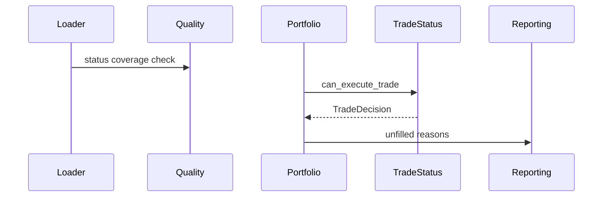

# LLD: STORY-010 - 交易状态与不可交易约束

> 用户已于 2026-05-15 确认通过；允许在 `STORY-009` 通过实现与验证后实现 `engine/trade_status.py` 并按 LLD 修改相关文件。W3 source/interface 仍保持 `UNRESOLVED` 的路径必须 fail fast，禁止模糊匹配或伪造数据源；仍不得生成真实生产数据、写入 `delivery/**` 或安装脚本。

## 0. 修订记录

| 版本 | 日期 | 修订人 | 变更要点 |
|---|---|---|---|
| 1.2 | 2026-05-15 | meta-po | 用户确认通过批量 LLD / Story Package，回写 `confirmed=true`、`confirmed_by=user`、`confirmed_at=2026-05-15`；保留 W3 `UNRESOLVED` fail-fast 硬门禁。 |
| 1.1 | 2026-05-15 | meta-dev / meta-qa / meta-po | 响应 F-003/F-004：补 source/interface exact registry、`UNRESOLVED` fail fast 规则和最小 CLI 诊断日志契约；保持 `confirmed=false`。 |

## 1. Goal

创建交易状态增强设计。后续实现必须引入停牌、无成交、特殊处理和未知状态的本地离线查询接口，让组合层在成交前应用不可交易约束，并把未成交原因和统计写入报告 metadata。

## 2. Requirements（Functional / Non-Functional）

### 2.1 Functional

- 新增 `engine/trade_status.py`，按 `symbol/trade_date` 查询状态。
- 状态 schema 至少含 `trade_date`、`symbol`、`is_tradable`、`status_reason`、`available_at`。
- 显式不可交易目标 100% 不生成真实成交记录。
- 每个未成交目标输出非空 `unfilled_reason`。
- 报告至少输出停牌、无成交、特殊处理、未知状态 4 类统计。
- 交易状态字段同步进入 raw、manifest、quality、loader 契约。
- data_prep / manifest / normalizer 必须显式支持交易状态数据集：raw 批次标记 `target_dataset=trade_status`，manifest 记录状态覆盖区间、接口名、raw 路径、标准化输出路径和失败项，normalizer 从 raw 派生本地标准化交易状态数据。
- 未启用交易状态时，M0-M2 第一版主路径兼容。

### 2.2 Non-Functional

- 交易状态数据只能经数据准备链路进入本地 parquet/quality；组合层不联网。
- 状态 `available_at` 晚于成交/决策时点时拒绝使用。
- 状态缺失按质量策略 warn/fail，不静默成交。
- 不修改动量信号纯函数契约。

## 3. 模块拆分与职责

| 模块 / 文件组 | 职责 | 说明 |
|---|---|---|
| `engine/trade_status.py` | 读取/查询交易状态，暴露可交易性判断 | 本 Story 主模块 |
| `engine/data_prep.py` / `engine/manifest.py` | 增加交易状态数据准备请求和 manifest 字段约束 | 只允许显式数据准备入口联网 |
| `engine/normalizer.py` | 从 raw 派生交易状态标准化数据 | 不联网，exact dataset 映射 |
| `engine/portfolio.py` | 成交前消费 trade status，生成未成交原因 | 不计算信号 |
| `engine/data_loader.py` | 加载交易状态数据与 metadata | 离线只读 |
| `engine/quality.py` | 检查交易状态覆盖和缺失 | ADR-006 |
| `engine/reporting.py` | 输出不可交易原因统计 | 报告一致性 |
| `engine/contracts.py` | 状态 schema 和原因枚举常量 | 纯常量 |

## 4. 代码结构与文件影响范围

| 动作 | 文件路径 | 变更内容 |
|---|---|---|
| 创建 | `engine/trade_status.py` | 定义 `TradeStatusProvider`、`get_trade_status`、状态校验错误 |
| 修改 | `engine/data_prep.py` | 增加交易状态接口的显式数据准备请求类型和 batch planning 输入字段 |
| 修改 | `engine/manifest.py` | 增加 `target_dataset=trade_status`、状态覆盖区间、raw/standardized 路径等字段读写 |
| 修改 | `engine/normalizer.py` | 增加 trade_status raw 到标准化数据的 exact 映射和字段校验 |
| 修改 | `engine/portfolio.py` | 成交前应用不可交易状态，记录留现金/延后原因 |
| 修改 | `engine/data_loader.py` | 加载可选 `trade_status` 数据并传给组合层 |
| 修改 | `engine/quality.py` | 增加状态覆盖、缺失和 available_at 检查 |
| 修改 | `engine/reporting.py` | 增加不可交易统计字段 |
| 修改 | `engine/contracts.py` | 增加状态 schema、原因枚举、统计字段 |

## 5. 数据模型与持久化设计

| 对象 / 字段 | 类型 | 约束 | 说明 |
|---|---|---|---|
| `trade_status.trade_date` | date | 必需 | 状态日期 |
| `trade_status.symbol` | str | 必需 | 股票代码 |
| `is_tradable` | bool | 必需 | 是否可交易 |
| `status_reason` | str | 枚举 | `suspended/no_trade/special_treatment/unknown_status/tradable` |
| `available_at` | date/datetime | 必需 | 可用时点 |
| `TradeDecision.can_trade` | bool | 必需 | 组合层消费 |
| `TradeDecision.unfilled_reason` | str | 不可交易时非空 | 报告字段 |
| manifest `target_dataset` | str | `trade_status` | 标识 raw 批次用于交易状态标准化 |
| manifest `trade_status_coverage_start/end` | date | 必需 | 交易状态覆盖区间 |
| manifest `standardized_output_path` | str | 成功派生后必需 | 指向本地标准化交易状态数据 |

### 5.1 Source / Interface Exact Registry

| target_dataset | source | interface | raw_metadata_required | manifest_required | normalizer_entry | fail_fast_rule |
|---|---|---|---|---|---|---|
| `trade_status` | `UNRESOLVED` | `UNRESOLVED` | `target_dataset`、`source`、`interface`、`request_params`、symbols、覆盖区间、`raw_path` | `target_dataset`、`trade_status_coverage_start/end`、`raw_path`、`standardized_output_path`、`success_items`、`failed_items`、`status` | `normalize_trade_status` | 任一 `source/interface=UNRESOLVED` 时，data_prep batch planning、normalizer exact dispatch、quality 入口和 loader trade status 启用均必须 fail fast，错误说明“W3 实现前确认交易状态 source/interface”，禁止模糊匹配或字符串包含推断。 |

持久化：后续可扩展本地标准化状态数据；LLD 阶段不生成 `data/**`。

## 6. API / Interface 设计

| 接口 / 入口 | 输入 | 输出 | 调用方 | 说明 |
|---|---|---|---|---|
| `load_trade_status(path_or_frame)` | 本地状态数据 | provider | data_loader | 测试 `T-LOAD-STATUS-01` |
| `plan_trade_status_batches(symbols, date_range, config)` | 股票、日期范围、数据准备配置 | BatchSpec 列表 | data_prep | 测试 `T-DATAPREP-STATUS-BATCH-01` |
| `append_trade_status_manifest(record)` | 交易状态批次记录 | manifest 记录 | manifest | 测试 `T-MANIFEST-STATUS-FIELDS-01` |
| `normalize_trade_status(raw_rows)` | raw rows | 标准化状态 DataFrame | normalizer | 测试 `T-NORMALIZE-STATUS-01` |
| `get_trade_status(symbol, trade_date)` | 股票、日期 | 状态对象 | portfolio | 测试 `T-STATUS-QUERY-01` |
| `can_execute_trade(symbol, trade_date, side, price)` | 交易请求 | `TradeDecision` | portfolio | 测试 `T-SUSPENDED-BUY-01` |
| `calculate_trade_status_quality(frame, requested_range)` | 状态数据、区间 | quality fields | quality | 测试 `T-STATUS-QUALITY-01` |
| `build_trade_status_metadata(trades)` | 未成交明细 | 统计 dict | reporting | 测试 `T-REPORT-STATS-01` |

错误暴露：状态 schema 缺失抛 `TradeStatusContractError`；状态缺失按 policy 返回 `unknown_status` 或 fail；available_at 未来抛 `TradeStatusAvailabilityError`。

## 7. 核心处理流程

1. data_prep 通过显式交易状态请求生成 raw 批次，不允许组合层或 loader 联网。
2. manifest 为交易状态批次记录 `target_dataset=trade_status`、覆盖区间、raw 路径、标准化输出路径和失败项。
3. normalizer 从 raw 派生本地标准化交易状态数据。
4. loader 读取可选交易状态数据。
5. quality 校验覆盖、缺失和 available_at。
6. portfolio 处理每个买/卖目标前调用 `can_execute_trade`。
7. `is_tradable=false` 时不生成真实成交，资金留现金或卖出延后。
8. `status_reason` 写入 `unfilled_reason`。
9. reporting 聚合原因统计。

异常路径：状态字段缺失 fail；状态未知按策略 warn/fail；显式不可交易拒绝成交；未启用状态走兼容路径并披露限制。

## 8. 技术设计细节

- 状态优先级：schema/available_at fail > explicit untradable > unknown status > tradable。
- 买入不可交易：目标资金留现金。
- 卖出不可交易：保留原持仓并记录延后/未成交。
- 未启用状态：沿用 STORY-005 行为，但 metadata 显示 `trade_status_enabled=false`。
- 与 STORY-011 涨跌停顺序：先检查交易状态，再检查涨跌停价格约束。
- raw/manifest 同步契约：raw metadata 必须含 `target_dataset=trade_status`、`source`、`interface`、`request_params` 和覆盖区间，且 `source/interface` 只能来自 §5.1 registry；manifest 必须含 `trade_status_coverage_start/end`、`raw_path`、`standardized_output_path`、`success_items`、`failed_items` 和 `status`；normalizer 只接受 exact `target_dataset=trade_status` 与已登记状态接口；registry 为 `UNRESOLVED` 时必须 fail fast，不按字符串包含关系推断。
- 图示类型选择：跨 loader/quality/portfolio/reporting，使用时序图。

## 9. 安全与性能设计

| 维度 | 设计措施 | 验证方式 |
|---|---|---|
| 安全 | trade_status/portfolio 不联网，不调用 data_prep | `T-NETWORK-BOUNDARY-01` |
| 可靠性 | 显式不可交易不成交且原因非空 | `T-SUSPENDED-BUY-01`, `T-SUSPENDED-SELL-01` |
| 可靠性 | source/interface 使用 exact registry；`UNRESOLVED` 禁止进入 batch planning、normalizer、quality 或 loader trade status 模式 | `T-UNRESOLVED-INTERFACE-FAIL-01` |
| 兼容性 | 未启用状态时 M0-M2 回归不变 | `T-DISABLED-COMPAT-01` |
| 可观测性 | 本地 CLI/离线入口使用标准 logging 输出到 stderr；`INFO start/end`、`WARNING unknown_status/degraded`、`ERROR structured_error`，字段含 `event_name`、`run_id` 或 `manifest_run_id`、`module=trade_status`、`story_id=STORY-010`、`status`、`params_summary`、`relative_path`、`elapsed_seconds`；不写持久化日志文件、不记录凭据或绝对隐私路径；服务监控标 NA | `T-LOGGING-MINIMAL-01` |
| 性能 | 状态表按 `(trade_date, symbol)` 索引查询 | `T-STATUS-QUERY-01` |

## 10. 测试设计

| 测试场景 | 前置条件 | 操作 | 预期结果 | 验证方式 |
|---|---|---|---|---|
| `T-LOAD-STATUS-01` | 合规状态 fixture | 加载 | provider 可用 | 单元测试 |
| `T-DATAPREP-STATUS-BATCH-01` | symbols 与日期区间 | 规划状态批次 | BatchSpec 含 target_dataset 与覆盖区间 | 单元测试 |
| `T-MANIFEST-STATUS-FIELDS-01` | 状态批次结果 | 写入/读取 manifest | manifest 含覆盖区间、raw_path、standardized_output_path | 单元测试 |
| `T-NORMALIZE-STATUS-01` | raw 状态 fixture | 标准化 | schema 字段完整 | 单元测试 |
| `T-STATUS-QUERY-01` | 多日期状态 | 查询 | 返回指定状态 | 单元测试 |
| `T-SUSPENDED-BUY-01` | 买入日 suspended | 成交 | 不成交，留现金 | 单元测试 |
| `T-SUSPENDED-SELL-01` | 卖出日 suspended | 成交 | 不卖出，保留持仓 | 单元测试 |
| `T-UNKNOWN-STATUS-01` | 状态缺失 | 成交 | 按 policy warn/fail | 单元测试 |
| `T-AVAILABLE-AT-FAIL-01` | 状态未来可用 | 查询 | fail | 单元测试 |
| `T-STATUS-QUALITY-01` | 覆盖缺失 | 计算质量 | 统计缺失 | 单元测试 |
| `T-REPORT-STATS-01` | 未成交明细 | reporting | 输出 4 类统计 | 单元测试 |
| `T-DISABLED-COMPAT-01` | 未启用状态 | 回测 | 行为兼容且 metadata 披露 | 回归测试 |
| `T-NETWORK-BOUNDARY-01` | 源码 | 静态扫描 | 无网络/data_prep 导入 | 静态检查 |
| `T-UNRESOLVED-INTERFACE-FAIL-01` | registry 中 source/interface 为 `UNRESOLVED` | 调用 batch planning、normalizer、quality 或 loader trade status 入口 | fail fast，错误说明需实现前确认 source/interface，且不执行模糊匹配 | 单元测试 |
| `T-LOGGING-MINIMAL-01` | caplog/stderr fixture | 运行状态查询成功、unknown/degraded、结构化失败路径 | 输出 start/end、warning、structured_error，且不含凭据/绝对隐私路径 | 单元测试 |

## 11. 实施步骤

| TASK-ID | 动作 | 目标文件 | 详细描述 | 对应测试 |
|---|---|---|---|---|
| S010-T1 | 创建 | `engine/trade_status.py` | 定义状态对象、加载、查询和 available_at 校验 | `T-LOAD-STATUS-01`, `T-STATUS-QUERY-01`, `T-AVAILABLE-AT-FAIL-01` |
| S010-T2 | 修改 | `engine/data_prep.py`, `engine/manifest.py`, `engine/normalizer.py` | 增加交易状态 raw/manifest/standardization 同步契约和 source/interface exact registry；`UNRESOLVED` fail fast | `T-DATAPREP-STATUS-BATCH-01`, `T-MANIFEST-STATUS-FIELDS-01`, `T-NORMALIZE-STATUS-01`, `T-UNRESOLVED-INTERFACE-FAIL-01` |
| S010-T3 | 修改 | `engine/portfolio.py` | 买卖成交前应用状态约束，记录未成交原因 | `T-SUSPENDED-BUY-01`, `T-SUSPENDED-SELL-01`, `T-UNKNOWN-STATUS-01` |
| S010-T4 | 修改 | `engine/data_loader.py` | 加载可选状态数据并传递给组合层 | `T-DISABLED-COMPAT-01` |
| S010-T5 | 修改 | `engine/quality.py` | 增加状态覆盖和缺失质量检查 | `T-STATUS-QUALITY-01` |
| S010-T6 | 修改 | `engine/reporting.py` | 输出不可交易统计 | `T-REPORT-STATS-01` |
| S010-T7 | 修改 | `engine/contracts.py` | 增加状态 schema、manifest 字段、原因枚举、统计字段、registry 常量和最小日志字段约定 | `T-NETWORK-BOUNDARY-01`, `T-MANIFEST-STATUS-FIELDS-01`, `T-LOGGING-MINIMAL-01` |

## 12. 风险、难点与预研建议

| 风险 / 难点 | 影响 | 缓解措施 / 预研建议 |
|---|---|---|
| 状态缺失时 warn/fail 边界不清 | 成交真实性不一致 | open item 确认默认策略 |
| 买卖限制差异 | 组合收益归属复杂 | 明确买入留现金、卖出保留持仓 |
| 与涨跌停约束顺序冲突 | 未成交原因不稳定 | 固化先交易状态后涨跌停 |

### OPEN / Spike 跟踪

| ID | 类型（OPEN / Spike） | 问题 | 下一动作 | 责任方 |
|---|---|---|---|---|
| O-01 | OPEN | 状态缺失默认是 warn 并按 unknown 不成交，还是 quality fail | Story Package review 确认 | meta-po / 用户 |
| O-02 | OPEN | 卖出不可交易时未成交原因命名使用 `suspended` 还是 `sell_suspended` | Story Package review 确认枚举 | meta-po / 用户 |
| O-03 | HARD-GATE | 交易状态数据 source/interface 名称暂为 `UNRESOLVED`；实现前必须替换为 exact source/interface，否则 batch planning、normalizer、quality 和 loader trade status 均 fail fast | W3 实现前确认；不得模糊匹配 | meta-po / 用户 |

## 13. 回滚与发布策略

- 发布方式：LLD 确认后先实现状态 provider，再接入 portfolio/loader/quality/reporting。
- 回滚触发条件：显式不可交易仍成交、未成交原因为空、未启用状态回归失败、主路径联网。
- 回滚动作：撤回 STORY-010 对相关文件的修改，恢复 STORY-005 组合行为。

## 14. Definition of Done

- [x] 14 个章节全部填写完成。
- [x] frontmatter 含强输入字段且 `confirmed: true`。
- [x] 文件影响、接口、异常、测试、TASK-ID 对应完整。
- [x] 已完成实现验证；未生成真实数据、报告或 delivery。

## 人工确认区

> **元工作流检查点 - 批量 Story Package 确认**：确认前不得实现本 Story。
