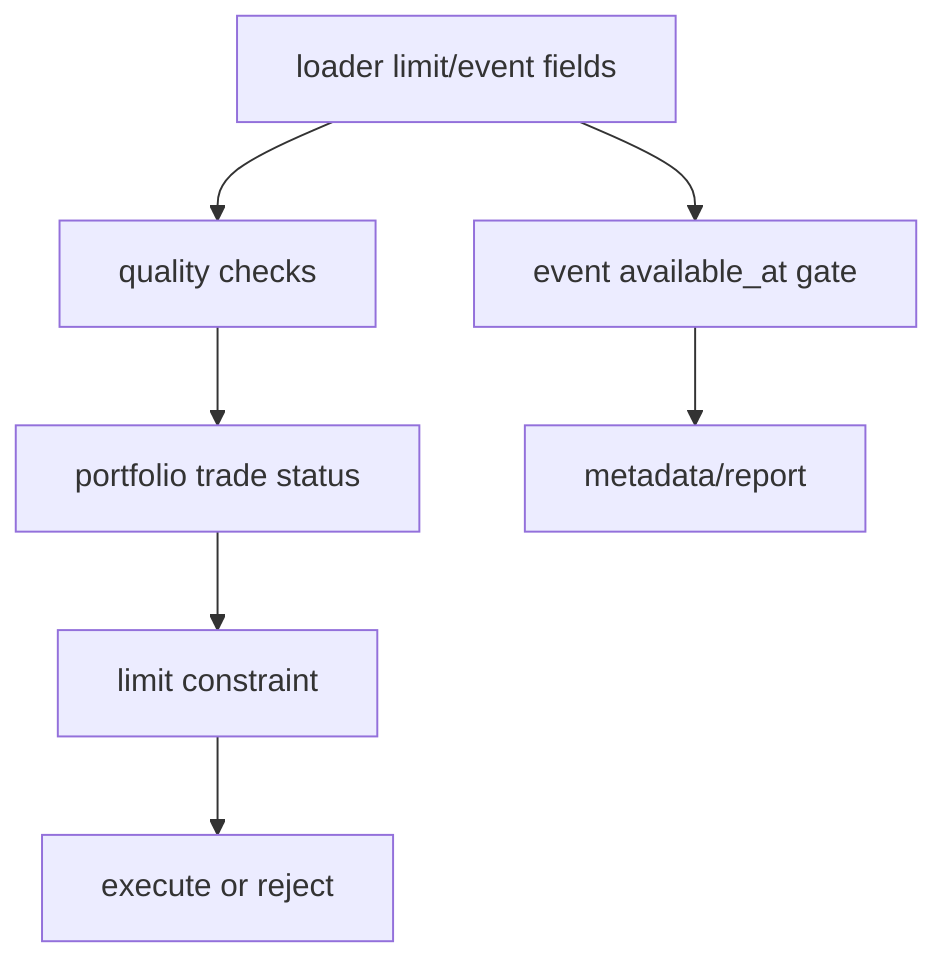

# LLD: STORY-011 - 涨跌停与事件 available_at 增强

> 用户已于 2026-05-15 确认通过；允许在 `STORY-010` 交易状态接口通过实现与验证后实现 `engine/trading_constraints.py`、`engine/events.py` 并按 LLD 修改相关文件。W3 source/interface 仍保持 `UNRESOLVED` 的路径必须 fail fast，禁止模糊匹配或伪造数据源；仍不得生成真实生产数据、写入 `delivery/**` 或安装脚本。

## 0. 修订记录

| 版本 | 日期 | 修订人 | 变更要点 |
|---|---|---|---|
| 1.2 | 2026-05-15 | meta-po | 用户确认通过批量 LLD / Story Package，回写 `confirmed=true`、`confirmed_by=user`、`confirmed_at=2026-05-15`；保留 `STORY-010 -> STORY-011` 串行依赖与 W3 `UNRESOLVED` fail-fast 硬门禁。 |
| 1.1 | 2026-05-15 | meta-dev / meta-qa / meta-po | 响应 F-003/F-004：补 source/interface exact registry、`UNRESOLVED` fail fast 规则和最小 CLI 诊断日志契约；保持 `confirmed=false`。 |

## 1. Goal

创建涨跌停成交约束和事件级 `available_at` 增强设计。后续实现必须在回测主路径离线条件下，拒绝或延后涨停买入、跌停卖出，并阻止缺少字段级 `available_at` 或未来可用的事件字段进入信号或过滤。

## 2. Requirements（Functional / Non-Functional）

### 2.1 Functional

- 新增 `engine/trading_constraints.py`，按 `symbol/trade_date/side/execution_price` 判断涨跌停可成交性。
- 新增 `engine/events.py`，加载和校验事件字段 `event_type/event_date/available_at/source`。
- `limit_up`、`limit_down` 缺失时可按未启用约束披露；启用约束后缺字段按质量策略 fail/warn。
- 涨停买入、跌停卖出 100% 记录拒绝或延后原因。
- 事件字段缺 `available_at` 或 `available_at > decision_time` 时 100% 不允许进入信号或过滤。
- 报告 metadata 说明启用/未启用的涨跌停和事件约束。
- data_prep / manifest / normalizer 必须显式支持 limit/event 增强数据：raw 批次标记 `target_dataset=prices_limit` 或 `target_dataset=events`，manifest 记录接口名、覆盖区间、raw 路径、标准化输出路径和失败项，normalizer 从 raw 派生可离线读取字段。

### 2.2 Non-Functional

- 不把财报/公告/ST 事件默认加入动量第一版信号。
- 不用财报报告期日期替代披露日。
- 不联网，不自动补事件数据。
- 与 STORY-010 顺序固定为先交易状态，再涨跌停，再事件过滤。

## 3. 模块拆分与职责

| 模块 / 文件组 | 职责 | 说明 |
|---|---|---|
| `engine/trading_constraints.py` | 涨跌停买卖约束判断 | 本 Story 主模块 |
| `engine/events.py` | 事件 schema 与 available_at 校验 | 不默认进动量信号 |
| `engine/data_prep.py` / `engine/manifest.py` | 增加 limit/event 数据准备请求和 manifest 字段约束 | 只允许显式数据准备入口联网 |
| `engine/normalizer.py` | 从 raw 派生 limit/event 标准化字段 | 不联网，exact dataset 映射 |
| `engine/portfolio.py` | 成交前消费涨跌停约束 | 与交易状态顺序明确 |
| `engine/data_loader.py` | 加载价格 limit 字段和事件字段开关 | 离线只读 |
| `engine/quality.py` | 检查 limit/event 字段质量 | ADR-006 |
| `engine/contracts.py` | limit/event schema 和原因枚举 | 纯常量 |

## 4. 代码结构与文件影响范围

| 动作 | 文件路径 | 变更内容 |
|---|---|---|
| 创建 | `engine/trading_constraints.py` | 定义 `TradingConstraintDecision`、涨跌停判断和错误类型 |
| 创建 | `engine/events.py` | 定义事件 schema、加载、启用配置和 available_at 校验 |
| 修改 | `engine/data_prep.py` | 增加涨跌停与事件接口的显式数据准备请求类型和 batch planning 输入字段 |
| 修改 | `engine/manifest.py` | 增加 `target_dataset=prices_limit/events`、覆盖区间、raw/standardized 路径等字段读写 |
| 修改 | `engine/normalizer.py` | 增加 limit/event raw 到标准化数据的 exact 映射和字段校验 |
| 修改 | `engine/portfolio.py` | 在成交前消费涨跌停约束 |
| 修改 | `engine/data_loader.py` | 加载可选 limit/event 字段与 metadata |
| 修改 | `engine/quality.py` | 增加 limit/event 质量检查 |
| 修改 | `engine/contracts.py` | 增加 limit/event 字段与原因枚举 |

## 5. 数据模型与持久化设计

| 对象 / 字段 | 类型 | 约束 | 说明 |
|---|---|---|---|
| `prices.limit_up` | float | 可选，启用约束时必需 | 涨停价 |
| `prices.limit_down` | float | 可选，启用约束时必需 | 跌停价 |
| `EventRecord.event_type` | str | 必需 | 事件类型 |
| `EventRecord.event_date` | date | 必需 | 事件日期，不等同披露日 |
| `EventRecord.available_at` | date/datetime | 必需 | 可用时点 |
| `EventRecord.source` | str | 必需 | 数据来源 |
| `ConstraintDecision.reason` | str | 非空于拒绝 | `limit_up_buy/limit_down_sell/event_future_data` |
| manifest `target_dataset` | str | `prices_limit` 或 `events` | 标识 raw 批次用于涨跌停或事件标准化 |
| manifest `constraint_coverage_start/end` | date | limit/event 必需 | 约束字段覆盖区间 |
| manifest `standardized_output_path` | str | 成功派生后必需 | 指向扩展后的本地标准化数据 |

### 5.1 Source / Interface Exact Registry

| target_dataset | source | interface | raw_metadata_required | manifest_required | normalizer_entry | fail_fast_rule |
|---|---|---|---|---|---|---|
| `prices_limit` | `UNRESOLVED` | `UNRESOLVED` | `target_dataset`、`source`、`interface`、`request_params`、symbols、覆盖区间、`raw_path` | `target_dataset`、`constraint_coverage_start/end`、`raw_path`、`standardized_output_path`、`success_items`、`failed_items`、`status` | `normalize_limit_event` | 任一 `source/interface=UNRESOLVED` 时，data_prep batch planning、normalizer exact dispatch、quality 入口和 loader limit 启用均必须 fail fast，错误说明“W3 实现前确认涨跌停 source/interface”，禁止模糊匹配或字符串包含推断。 |
| `events` | `UNRESOLVED` | `UNRESOLVED` | `target_dataset`、`source`、`interface`、`request_params`、event types、覆盖区间、`raw_path` | `target_dataset`、`constraint_coverage_start/end`、`raw_path`、`standardized_output_path`、`success_items`、`failed_items`、`status` | `normalize_limit_event` | 任一 `source/interface=UNRESOLVED` 时，data_prep batch planning、normalizer exact dispatch、quality 入口和 events 启用均必须 fail fast，错误说明“W3 实现前确认事件 source/interface”，禁止模糊匹配或字符串包含推断。 |

持久化：后续可能扩展本地 parquet 字段；LLD 阶段不生成数据。

## 6. API / Interface 设计

| 接口 / 入口 | 输入 | 输出 | 调用方 | 说明 |
|---|---|---|---|---|
| `check_limit_constraint(symbol, trade_date, side, execution_price, limit_up, limit_down)` | 交易请求与涨跌停价 | decision | portfolio | 测试 `T-LIMIT-UP-BUY-01` |
| `plan_limit_event_batches(dataset, symbols, date_range, config)` | 数据集、股票、日期范围、数据准备配置 | BatchSpec 列表 | data_prep | 测试 `T-DATAPREP-LIMIT-EVENT-BATCH-01` |
| `append_limit_event_manifest(record)` | limit/event 批次记录 | manifest 记录 | manifest | 测试 `T-MANIFEST-LIMIT-EVENT-FIELDS-01` |
| `normalize_limit_event(raw_rows, target_dataset)` | raw rows、目标数据集 | 标准化 DataFrame | normalizer | 测试 `T-NORMALIZE-LIMIT-EVENT-01` |
| `load_events(path_or_frame, enabled_event_types)` | 事件数据与启用配置 | EventStore | loader | 测试 `T-EVENT-LOAD-01` |
| `validate_event_available_at(events, decision_time)` | 事件、决策时点 | None/错误 | events/quality | 测试 `T-EVENT-FUTURE-FAIL-01` |
| `calculate_limit_event_quality(...)` | prices/events/区间 | quality fields | quality | 测试 `T-LIMIT-EVENT-QUALITY-01` |
| `build_constraint_metadata(decisions, enabled_flags)` | 约束决策 | metadata | reporting | 测试 `T-CONSTRAINT-METADATA-01` |

错误暴露：启用事件缺 `available_at` 抛 `EventContractError`；未来事件抛 `FutureEventDataError`；启用涨跌停但价格字段缺失抛或质量 fail；约束拒绝返回 decision 而非异常。

## 7. 核心处理流程

1. data_prep 通过显式 limit/event 请求生成 raw 批次，不允许 loader 或 portfolio 联网。
2. manifest 为 limit/event 批次记录 `target_dataset`、覆盖区间、raw 路径、标准化输出路径和失败项。
3. normalizer 从 raw 派生价格 limit 字段或事件标准化数据。
4. loader 根据配置加载 limit 字段和事件字段。
5. quality 检查字段覆盖和可用时点。
6. portfolio 先执行 STORY-010 交易状态检查。
7. portfolio 调用 `check_limit_constraint` 判断买卖是否受限。
8. 受限时不生成真实成交，记录原因。
9. 如果事件过滤启用，events 校验字段级 `available_at`。
10. reporting 汇总启用状态和影响计数。

异常路径：limit 字段缺失且启用约束 fail；事件缺 available_at fail；事件未来可用 fail；未启用事件不影响动量主路径但披露。

## 8. 技术设计细节

- 买入约束：`side=buy` 且 `execution_price >= limit_up` 时拒绝或延后。
- 卖出约束：`side=sell` 且 `execution_price <= limit_down` 时拒绝或延后。
- 浮点比较可使用小 epsilon，epsilon 常量写入 contracts。
- 事件启用必须显式传入 `enabled_event_types`；默认空集合。
- 不允许把 `event_date` 当作 `available_at`。
- raw/manifest 同步契约：raw metadata 必须含 `target_dataset=prices_limit/events`、`source`、`interface`、`request_params` 和覆盖区间，且 `source/interface` 只能来自 §5.1 registry；manifest 必须含 `constraint_coverage_start/end`、`raw_path`、`standardized_output_path`、`success_items`、`failed_items` 和 `status`；normalizer 只接受 exact target dataset 与已登记接口；registry 为 `UNRESOLVED` 时必须 fail fast，不按字符串包含关系推断。
- 图示类型选择：存在多约束顺序和异常分支，使用流程图。

## 9. 安全与性能设计

| 维度 | 设计措施 | 验证方式 |
|---|---|---|
| 安全 | 不联网，不导入 data_prep/AKShare/聚宽 | `T-NETWORK-BOUNDARY-01` |
| 可靠性 | 事件缺 available_at 或未来可用直接失败 | `T-EVENT-MISSING-AVAILABLE-AT-01`, `T-EVENT-FUTURE-FAIL-01` |
| 可靠性 | source/interface 使用 exact registry；`UNRESOLVED` 禁止进入 batch planning、normalizer、quality、loader limit 或 events 启用路径 | `T-UNRESOLVED-INTERFACE-FAIL-01` |
| 可解释性 | 拒绝/延后原因进入 trades 和 metadata | `T-CONSTRAINT-METADATA-01` |
| 可观测性 | 本地 CLI/离线入口使用标准 logging 输出到 stderr；`INFO start/end`、`WARNING disabled_constraint/degraded`、`ERROR structured_error`，字段含 `event_name`、`run_id` 或 `manifest_run_id`、`module=trading_constraints`、`story_id=STORY-011`、`status`、`params_summary`、`relative_path`、`elapsed_seconds`；不写持久化日志文件、不记录凭据或绝对隐私路径；服务监控标 NA | `T-LOGGING-MINIMAL-01` |
| 兼容性 | 事件未启用不影响动量主路径 | `T-EVENT-DISABLED-COMPAT-01` |

## 10. 测试设计

| 测试场景 | 前置条件 | 操作 | 预期结果 | 验证方式 |
|---|---|---|---|---|
| `T-LIMIT-UP-BUY-01` | 买入价等于涨停 | 检查约束 | 拒绝买入，原因非空 | 单元测试 |
| `T-LIMIT-DOWN-SELL-01` | 卖出价等于跌停 | 检查约束 | 拒绝卖出，原因非空 | 单元测试 |
| `T-DATAPREP-LIMIT-EVENT-BATCH-01` | symbols 与日期区间 | 规划 limit/event 批次 | BatchSpec 含 target_dataset 与覆盖区间 | 单元测试 |
| `T-MANIFEST-LIMIT-EVENT-FIELDS-01` | limit/event 批次结果 | 写入/读取 manifest | manifest 含覆盖区间、raw_path、standardized_output_path | 单元测试 |
| `T-NORMALIZE-LIMIT-EVENT-01` | raw limit/event fixture | 标准化 | schema 字段完整 | 单元测试 |
| `T-EVENT-LOAD-01` | 合规事件 fixture | 加载 | EventStore 可用 | 单元测试 |
| `T-EVENT-MISSING-AVAILABLE-AT-01` | 事件缺 available_at | 校验 | fail | 单元测试 |
| `T-EVENT-FUTURE-FAIL-01` | available_at 晚于决策 | 校验 | fail 且定位事件 | 单元测试 |
| `T-LIMIT-EVENT-QUALITY-01` | 字段缺失/覆盖缺口 | 质量检查 | 输出质量字段 | 单元测试 |
| `T-CONSTRAINT-METADATA-01` | 拒绝记录 | 构建 metadata | 含启用状态和计数 | 单元测试 |
| `T-EVENT-DISABLED-COMPAT-01` | 未启用事件 | 回测 | 动量主路径不变 | 回归测试 |
| `T-NETWORK-BOUNDARY-01` | 源码 | 静态扫描 | 无联网导入 | 静态检查 |
| `T-UNRESOLVED-INTERFACE-FAIL-01` | registry 中 source/interface 为 `UNRESOLVED` | 调用 limit/event batch planning、normalizer、quality 或启用入口 | fail fast，错误说明需实现前确认 source/interface，且不执行模糊匹配 | 单元测试 |
| `T-LOGGING-MINIMAL-01` | caplog/stderr fixture | 运行约束检查成功、disabled/degraded、结构化失败路径 | 输出 start/end、warning、structured_error，且不含凭据/绝对隐私路径 | 单元测试 |

## 11. 实施步骤

| TASK-ID | 动作 | 目标文件 | 详细描述 | 对应测试 |
|---|---|---|---|---|
| S011-T1 | 创建 | `engine/trading_constraints.py` | 实现涨跌停约束决策和原因枚举 | `T-LIMIT-UP-BUY-01`, `T-LIMIT-DOWN-SELL-01` |
| S011-T2 | 创建 | `engine/events.py` | 实现事件加载、启用配置和 available_at 校验 | `T-EVENT-LOAD-01`, `T-EVENT-MISSING-AVAILABLE-AT-01`, `T-EVENT-FUTURE-FAIL-01` |
| S011-T3 | 修改 | `engine/data_prep.py`, `engine/manifest.py`, `engine/normalizer.py` | 增加 limit/event raw/manifest/standardization 同步契约和 source/interface exact registry；`UNRESOLVED` fail fast | `T-DATAPREP-LIMIT-EVENT-BATCH-01`, `T-MANIFEST-LIMIT-EVENT-FIELDS-01`, `T-NORMALIZE-LIMIT-EVENT-01`, `T-UNRESOLVED-INTERFACE-FAIL-01` |
| S011-T4 | 修改 | `engine/portfolio.py` | 成交前接入涨跌停约束，且必须在 STORY-010 交易状态检查之后执行 | `T-LIMIT-UP-BUY-01`, `T-LIMIT-DOWN-SELL-01` |
| S011-T5 | 修改 | `engine/data_loader.py` | 加载 limit/event 字段并输出 metadata | `T-EVENT-DISABLED-COMPAT-01` |
| S011-T6 | 修改 | `engine/quality.py` | 增加 limit/event 质量检查 | `T-LIMIT-EVENT-QUALITY-01` |
| S011-T7 | 修改 | `engine/contracts.py` | 增加字段、manifest 字段、枚举、epsilon、registry 常量和最小日志字段约定 | `T-NETWORK-BOUNDARY-01`, `T-MANIFEST-LIMIT-EVENT-FIELDS-01`, `T-LOGGING-MINIMAL-01` |

## 12. 风险、难点与预研建议

| 风险 / 难点 | 影响 | 缓解措施 / 预研建议 |
|---|---|---|
| 涨跌停价格与复权价格口径不一致 | 错误拒绝成交 | 质量检查要求口径 metadata 一致 |
| 事件字段被误用为信号 | 未来函数风险 | 默认事件禁用，启用必须字段级 available_at |
| 与交易状态原因冲突 | 报告统计不稳定 | 固定顺序：交易状态先于涨跌停 |

### OPEN / Spike 跟踪

| ID | 类型（OPEN / Spike） | 问题 | 下一动作 | 责任方 |
|---|---|---|---|---|
| O-01 | OPEN | 涨停买入/跌停卖出默认是拒绝还是延后到下一交易日 | Story Package review 确认；默认拒绝并留现金/保留持仓 | meta-po / 用户 |
| O-02 | HARD-GATE | limit_up/limit_down 与 qfq close 的口径一致性来源字段及 source/interface 暂为 `UNRESOLVED`；实现前必须替换为 exact source/interface，否则 batch planning、normalizer、quality 和启用约束均 fail fast | W3 实现前确认；不得模糊匹配 | meta-po / 用户 |
| O-03 | OPEN | 第一批允许启用的事件类型是否为空集合，还是包含 ST/公告占位 | Story Package review 确认；默认空集合 | meta-po / 用户 |

## 13. 回滚与发布策略

- 发布方式：LLD 确认后先实现约束与事件模块，再接入 portfolio/loader/quality/contracts。
- 回滚触发条件：未来事件进入信号、涨跌停拒绝失效、未启用事件破坏动量主路径、联网。
- 回滚动作：撤回 STORY-011 新增模块和对相关文件的修改，恢复 STORY-010 状态约束。

## 14. Definition of Done

- [x] 14 个章节全部填写完成。
- [x] frontmatter 含强输入字段且 `confirmed: true`。
- [x] 文件影响、接口、异常、测试、TASK-ID 对应完整。
- [x] 已完成实现验证；未生成真实数据、报告或 delivery。

## 人工确认区

> **元工作流检查点 - 批量 Story Package 确认**：确认前不得实现本 Story。
