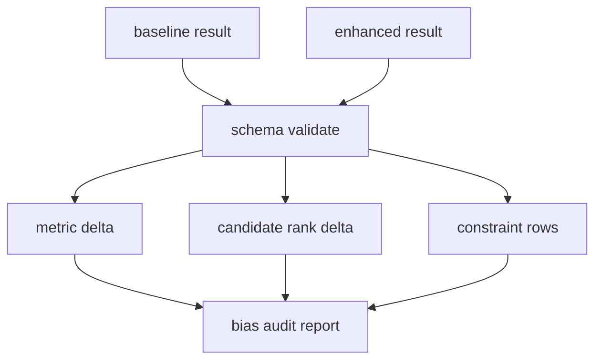

# LLD: STORY-012 - 偏差审计报告

> 用户已于 2026-05-15 确认通过；允许在 `STORY-011` 通过实现与验证后实现 `engine/bias_audit.py` 并按 LLD 修改 `engine/reporting.py`。仍不得生成真实生产数据、写入 `delivery/**` 或安装脚本。

## 0. 修订记录

| 版本 | 日期 | 修订人 | 变更要点 |
|---|---|---|---|
| 1.2 | 2026-05-15 | meta-po | 用户确认通过批量 LLD / Story Package，回写 `confirmed=true`、`confirmed_by=user`、`confirmed_at=2026-05-15`。 |
| 1.1 | 2026-05-15 | meta-dev / meta-qa / meta-po | 响应 F-004/F-005/F-007：采用“对象优先 + CSV/JSON sidecar 兼容”审计输入契约，定义 `AuditComparableRun`、参数组合 key、baseline/enhanced `run_id`、候选 rank 降级 schema、最小 CLI 诊断日志和表格文本公式注入防护；保持 `confirmed=false`。 |

## 1. Goal

创建偏差审计报告设计。后续实现必须比较 baseline 与 enhanced 回测/候选结果，量化非 PIT、幸存者偏差、停牌/无成交、涨跌停、事件时点和成交假设对收益、回撤、换手和候选排序的影响；不新增交易规则，不自动调用聚宽。

## 2. Requirements（Functional / Non-Functional）

### 2.1 Functional

- 审计输入采用对象优先、CSV/JSON sidecar 兼容：首选 `BacktestResult` / candidate rows 内存对象；可选读取 CSV 行级数据与 JSON metadata sidecar，并统一转换为 `AuditComparableRun`。
- 报告至少覆盖 5 类限制项：非 PIT/幸存者偏差、停牌/无成交、涨跌停、事件时点、成交假设。
- 每类输出 `enabled`、`affected_samples`、`impact_summary`。
- 至少输出 4 类指标变化：收益、回撤、换手、候选排序。
- 未启用约束不得省略，必须标记 `enabled=false` 与剩余限制。
- 缺 baseline 或 enhanced result 时审计失败。

### 2.2 Non-Functional

- 审计只消费已有回测和增强结果，不触发回测、聚宽或网络。
- 报告字段稳定，可输出 CSV 与 Markdown/文本摘要。
- 指标 delta 计算不修改输入对象。
- 测试使用 fixture，不生成真实报告到仓库。

## 3. 模块拆分与职责

| 模块 / 文件组 | 职责 | 说明 |
|---|---|---|
| `engine/bias_audit.py` | 比较 baseline/enhanced，计算限制项影响和指标 delta | 本 Story 主模块 |
| `engine/reporting.py` | 复用限制项 metadata，渲染审计 rows | 不新增交易规则 |
| `reports/bias_audit_report.*` | 实现阶段显式运行后生成 | LLD 阶段不生成 |

## 4. 代码结构与文件影响范围

| 动作 | 文件路径 | 变更内容 |
|---|---|---|
| 创建 | `engine/bias_audit.py` | 定义 `BiasAuditInput`、`BiasAuditResult`、`compare_results`、`write_bias_audit_report` |
| 修改 | `engine/reporting.py` | 增加审计字段、delta 格式化和未启用限制项渲染 |
| 写入 | `reports/bias_audit_report.*` | 后续实现运行时由显式审计入口生成；LLD 阶段不得生成 |

## 5. 数据模型与持久化设计

| 对象 / 字段 | 类型 | 约束 | 说明 |
|---|---|---|---|
| `BiasAuditInput.baseline` | Backtest/Candidate result | 必需 | 增强前 |
| `BiasAuditInput.enhanced` | Backtest/Candidate result | 必需 | 增强后 |
| `AuditInputSource` | str | `object/csv_with_sidecar/csv_only` | 输入来源枚举；CSV only 允许但信息不足需 warning |
| `AuditComparableRun.run_id` | str | baseline/enhanced 各自非空 | 可来自 BacktestResult、metadata sidecar 或显式参数 |
| `AuditComparableRun.scenario_label` | str | `baseline/enhanced` | 比较方向 |
| `AuditComparableRun.params_key` | str | 参数组合 key 序列化 | 由 `strategy_name`、`lookback_days`、`rebalance_freq`、`top_fraction`、`sell_buffer`、成本参数组成 |
| `AuditComparableRun.metrics` | dict | 至少含 `total_return`、`annual_return`、`max_drawdown`、`sharpe`、`turnover`、`final_nav` | 指标 delta 输入 |
| `AuditComparableRun.metadata` | dict | 含 PIT、trade status、limit、event、execution timing、available_at rule | 限制项启用与剩余风险输入 |
| `AuditComparableRun.constraint_details` | list/dict | 可空 | `unfilled_reason`、constraint reason、affected sample count；缺明细时使用 metadata 汇总并 warning |
| `AuditComparableRun.candidate_rows` | list[`AuditCandidateRow`] | 可空 | 候选排序比较输入 |
| `AuditCandidateRow.candidate_type` | str | 可空 | `default/best_sharpe/best_return/conservative_low_turnover` 等 |
| `AuditCandidateRow.rank` | int | 可空；缺失时降级 | 候选 rank 字段 |
| `AuditCandidateRow.params_key` | str | 必需 | 用于 baseline/enhanced 对齐 |
| `constraint_name` | str | 5 类之一 | 限制项 |
| `enabled` | bool | 必需 | 是否启用 |
| `affected_samples` | int | `>=0` | 受影响样本数 |
| `metric_delta` | dict | 收益/回撤/换手 | 指标变化 |
| `candidate_rank_delta` | dict/list | 可为空 | 候选排序变化 |
| `candidate_rank_delta_status` | str | `available/not_available/partial` | 缺候选排序时为 `not_available` 并输出 warning |
| `warning` | str/list | 可空 | 缺 sidecar、缺候选 rank、约束明细不足等降级原因 |
| `sanitize_tabular_text(value)` | function | 仅作用于自由文本字段 | 文本首个非空字符为 `= + - @` 时前置单引号，数值/日期/枚举不转字符串 |

持久化：实现阶段可生成报告文件；LLD 阶段不生成。

## 6. API / Interface 设计

| 接口 / 入口 | 输入 | 输出 | 调用方 | 说明 |
|---|---|---|---|---|
| `compare_backtest_results(baseline, enhanced)` | 两个回测结果 | metric delta | audit | 测试 `T-METRIC-DELTA-01` |
| `compare_candidate_ranks(baseline_candidates, enhanced_candidates)` | 候选 rows | rank delta | audit | 测试 `T-RANK-DELTA-01` |
| `build_constraint_audit_rows(metadata, trades)` | metadata/trades | 审计 rows | audit | 测试 `T-CONSTRAINT-ROWS-01` |
| `load_audit_inputs(source_config)` | 内存对象、CSV 路径、JSON sidecar 路径 | 原始输入包 | `run_bias_audit` | 测试 `T-AUDIT-OBJECT-INPUT-01`、`T-AUDIT-CSV-SIDECAR-01` |
| `normalize_audit_input(raw_input, scenario_label)` | 原始输入包 | `AuditComparableRun` | `run_bias_audit` | 测试 `T-AUDIT-COMPARABLE-RUN-01` |
| `run_bias_audit(input)` | baseline/enhanced 对象或 CSV+sidecar 配置 | `BiasAuditResult` | 用户入口 | 测试 `T-AUDIT-PASS-01` |
| `write_bias_audit_report(result, output_paths)` | 审计结果、路径 | 报告路径 | 用户入口 | 测试 `T-REPORT-SCHEMA-01` |
| `sanitize_tabular_text(value)` | 自由文本字段值 | 安全文本 | `write_bias_audit_report` / Markdown 表格 writer | 测试 `T-CSV-FORMULA-INJECTION-01` |

错误暴露：缺 baseline/enhanced 抛 `BiasAuditInputError`；缺关键指标抛 `BiasAuditSchemaError`；报告写入失败抛 `BiasAuditReportWriteError`。

## 7. 核心处理流程

1. 读取或接收 baseline 与 enhanced result；首选内存对象，也可从 CSV + JSON sidecar 读取。
2. 将 baseline/enhanced 统一归一化为 `AuditComparableRun`，生成 `run_id`、`scenario_label`、`params_key`、metrics、metadata、constraint details 和 candidate rows。
3. 校验关键指标、候选字段和 metadata；缺 sidecar 或缺约束明细时不阻断指标 delta，但写 warning。
4. 计算收益、回撤、换手等 metric delta。
5. 比较候选排序变化；缺候选 rank 时输出 `candidate_rank_delta_status=not_available`，保留指标 delta 和 warning。
6. 汇总 5 类限制项启用状态和影响样本数。
7. 对未启用限制项写剩余风险。
8. 显式入口写出报告。

异常路径：baseline 缺失失败；enhanced 缺失失败；某类约束未启用不失败但输出剩余限制；候选排序缺失时只输出指标 delta 并 warning。

## 8. 技术设计细节

- delta 口径：`enhanced - baseline`，同时输出百分比变化和方向。
- 输入优先级：对象输入优先；CSV + JSON sidecar 次之；CSV only 作为兼容路径，但 metadata/constraint details 不足时必须 warning。
- 参数组合 key：`strategy_name|lookback_days|rebalance_freq|top_fraction|sell_buffer|commission_rate|slippage_rate|sell_tax_rate`，字段缺失时 schema fail，禁止使用模糊参数名。
- baseline/enhanced `run_id`：必须非空；若对象缺失但 sidecar 提供则使用 sidecar；两者都缺失则 `BiasAuditSchemaError`。
- 候选排序：按参数组合 key 比较 rank；新增/删除候选分别标记。若 baseline 或 enhanced 缺 `rank`，输出 `candidate_rank_delta_status=not_available`、`warning=missing_candidate_rank`，不阻断 metric delta。
- 受影响样本数：优先取未成交/约束决策明细计数，无明细时取 metadata 汇总。
- 报告格式：CSV 为机器可读，Markdown 为人工解释；复杂字段 JSON 字符串。
- 表格文本防护：`impact_summary`、`warning`、`data_limitations`、`constraint_name` 附加说明和所有自由文本 reason 写入 CSV/Markdown 表格前调用 `sanitize_tabular_text`；文本首个非空字符为 `=`、`+`、`-`、`@` 时前置单引号，数值指标、日期、枚举状态和参数值不做文本化处理。
- 图示类型选择：输入比较与多输出，使用流程图。

## 9. 安全与性能设计

| 维度 | 设计措施 | 验证方式 |
|---|---|---|
| 安全 | 不联网、不调用聚宽、不触发回测 | `T-NETWORK-BOUNDARY-01` |
| 安全 | 审计 CSV/Markdown 表格自由文本字段写入前做公式注入防护，数值字段保持原类型 | `T-CSV-FORMULA-INJECTION-01` |
| 可靠性 | 缺 baseline/enhanced fail fast | `T-MISSING-INPUT-01` |
| 可解释性 | 未启用限制项显式输出 | `T-DISABLED-CONSTRAINT-01` |
| 可观测性 | 本地 CLI/离线入口使用标准 logging 输出到 stderr；`INFO start/end`、`WARNING missing_candidate_rank/csv_only_metadata_limited`、`ERROR structured_error`，字段含 `event_name`、`run_id`、`module=bias_audit`、`story_id=STORY-012`、`status`、`params_summary`、`relative_path`、`elapsed_seconds`；不写持久化日志文件、不记录凭据或绝对隐私路径；服务监控标 NA | `T-LOGGING-MINIMAL-01` |
| 性能 | 只处理结果摘要和报告 rows | fixture 测试 |

## 10. 测试设计

| 测试场景 | 前置条件 | 操作 | 预期结果 | 验证方式 |
|---|---|---|---|---|
| `T-AUDIT-PASS-01` | baseline/enhanced fixture | 运行审计 | 输出 5 类限制项 | 单元测试 |
| `T-METRIC-DELTA-01` | 已知指标 | 比较 | delta 正确 | 单元测试 |
| `T-RANK-DELTA-01` | 候选排序变化 | 比较 | 输出 rank delta | 单元测试 |
| `T-AUDIT-OBJECT-INPUT-01` | baseline/enhanced BacktestResult 与候选 rows 内存对象 | 运行审计 | 转换为 `AuditComparableRun` 并输出完整 delta | 单元测试 |
| `T-AUDIT-CSV-SIDECAR-01` | baseline/enhanced CSV + JSON metadata sidecar | 运行审计 | 使用 sidecar 补 run_id/metadata/constraint details | 单元测试 |
| `T-AUDIT-COMPARABLE-RUN-01` | raw input 包含对象或文件字段 | 调用 `normalize_audit_input` | 输出字段覆盖 run_id、scenario_label、params_key、metrics、metadata、candidate_rows | 单元测试 |
| `T-MISSING-CANDIDATE-RANK-WARNING-01` | 候选 rows 缺 rank | 比较候选 | `candidate_rank_delta_status=not_available`，warning 非空，指标 delta 仍输出 | 单元测试 |
| `T-CONSTRAINT-ROWS-01` | 约束 metadata | 构建 rows | enabled/affected_samples 非空 | 单元测试 |
| `T-DISABLED-CONSTRAINT-01` | 某约束未启用 | 审计 | 标记 enabled=false | 单元测试 |
| `T-MISSING-INPUT-01` | 缺 enhanced | 审计 | fail fast | 单元测试 |
| `T-REPORT-SCHEMA-01` | 审计结果 | 写临时报告 | 字段完整 | 文件检查 |
| `T-NETWORK-BOUNDARY-01` | 源码 | 静态扫描 | 无联网/聚宽导入 | 静态检查 |
| `T-CSV-FORMULA-INJECTION-01` | 审计文本字段以 `= + - @` 开头，数值字段正常 | 写临时 CSV/Markdown | 文本字段前置单引号，数值/日期/枚举字段保持可读类型 | 文件检查 |
| `T-LOGGING-MINIMAL-01` | caplog/stderr fixture | 运行审计成功、缺候选 rank 降级、错误路径 | 输出 start/end、warning、structured_error，且不含凭据/绝对隐私路径 | 单元测试 |

## 11. 实施步骤

| TASK-ID | 动作 | 目标文件 | 详细描述 | 对应测试 |
|---|---|---|---|---|
| S012-T1 | 创建 | `engine/bias_audit.py` | 定义输入/结果/错误对象、`AuditComparableRun`、`AuditCandidateRow`、参数组合 key 和 schema 校验 | `T-AUDIT-PASS-01`, `T-MISSING-INPUT-01`, `T-AUDIT-COMPARABLE-RUN-01` |
| S012-T2 | 创建 | `engine/bias_audit.py` | 实现对象优先与 CSV/JSON sidecar 输入加载、归一化和 run_id 校验 | `T-AUDIT-OBJECT-INPUT-01`, `T-AUDIT-CSV-SIDECAR-01` |
| S012-T3 | 创建 | `engine/bias_audit.py` | 实现指标 delta、候选排序 delta、缺候选 rank warning 降级和限制项 rows | `T-METRIC-DELTA-01`, `T-RANK-DELTA-01`, `T-MISSING-CANDIDATE-RANK-WARNING-01`, `T-CONSTRAINT-ROWS-01` |
| S012-T4 | 创建 | `engine/bias_audit.py` | 实现报告写入入口、文本字段公式注入防护和最小 CLI 诊断日志 | `T-REPORT-SCHEMA-01`, `T-CSV-FORMULA-INJECTION-01`, `T-LOGGING-MINIMAL-01` |
| S012-T5 | 修改 | `engine/reporting.py` | 复用 metadata 限制项字段并增加审计渲染 | `T-DISABLED-CONSTRAINT-01` |

## 12. 风险、难点与预研建议

| 风险 / 难点 | 影响 | 缓解措施 / 预研建议 |
|---|---|---|
| baseline/enhanced 对象字段不一致 | delta 计算失败 | 定义 schema 校验和缺字段错误 |
| 某增强未启用 | 报告可能误认为无影响 | 显式输出 `enabled=false` 和剩余限制 |
| 候选排序缺失 | 审计不完整 | 输出 `candidate_rank_delta_status=not_available` 与 warning，不阻断指标 delta |

### OPEN / Spike 跟踪

| ID | 类型（OPEN / Spike） | 问题 | 下一动作 | 责任方 |
|---|---|---|---|---|
| O-01 | RESOLVED | baseline/enhanced 结果采用对象优先 + CSV/JSON sidecar 兼容；CSV only 允许但信息不足时 warning 降级 | 已回写 §5/§6/§8；等待用户在批量 LLD 中确认，不代表 `confirmed=true` | meta-po / 用户 |
| O-02 | RESOLVED | 候选排序变化优先比较 baseline/enhanced candidate rows；缺 rank 时输出 `candidate_rank_delta_status=not_available` 与 warning，不要求回头强制重跑 W2 | 已回写 §5/§8/§10；等待用户在批量 LLD 中确认，不代表 `confirmed=true` | meta-po / 用户 |

## 13. 回滚与发布策略

- 发布方式：LLD 确认后实现审计模块，再最小扩展 reporting。
- 回滚触发条件：缺输入不失败、未启用限制项被省略、联网或自动聚宽调用。
- 回滚动作：撤回 `engine/bias_audit.py` 和 reporting 新增审计函数，删除实现阶段生成的审计报告。

## 14. Definition of Done

- [x] 14 个章节全部填写完成。
- [x] frontmatter 含强输入字段且 `confirmed: true`。
- [x] 文件影响、接口、异常、测试、TASK-ID 对应完整。
- [x] 已完成实现验证；未生成真实审计报告或 delivery。

## 人工确认区

> **元工作流检查点 - 批量 Story Package 确认**：确认前不得实现本 Story。
