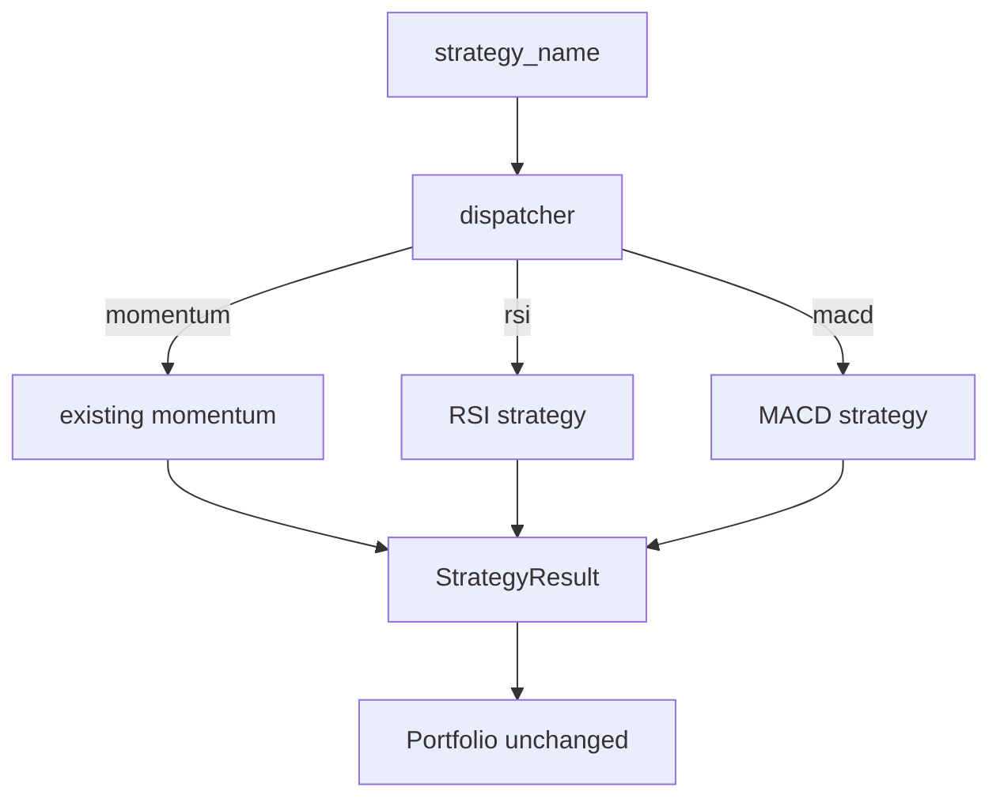

# LLD: STORY-013 - 策略扩展接口与 RSI/MACD 示例

> 用户已于 2026-05-15 确认通过；允许在 `STORY-008` 通过实现与验证后实现 `strategies/base.py`、`strategies/rsi.py`、`strategies/macd.py` 并按 LLD 修改 `engine/scanner.py`、`engine/reporting.py`。因文件所有权不冲突，可与 W3 起点并行排队，仍不得生成真实生产数据、写入 `delivery/**` 或安装脚本。

## 0. 修订记录

| 版本 | 日期 | 修订人 | 变更要点 |
|---|---|---|---|
| 1.2 | 2026-05-15 | meta-po | 用户确认通过批量 LLD / Story Package，回写 `confirmed=true`、`confirmed_by=user`、`confirmed_at=2026-05-15`；记录 `STORY-008` 后可与 W3 起点并行排队。 |
| 1.1 | 2026-05-15 | meta-dev / meta-qa / meta-po | 响应 F-004/F-006：固化 RSI/MACD 公式、默认参数、warm-up、排序字段、tie-breaker、空目标策略、非法参数测试和最小 CLI 诊断日志契约；保持 `confirmed=false`。 |

## 1. Goal

创建策略扩展接口与 RSI/MACD 示例设计。后续实现必须在不修改组合层和指标层主契约的前提下，定义策略纯函数接口，提供 RSI 与 MACD 两个示例策略，并让扫描/报告可通过 `strategy_name` 区分策略。

## 2. Requirements（Functional / Non-Functional）

### 2.1 Functional

- 新增 `strategies/base.py` 定义统一策略输入、参数和结果对象。
- 新增 `strategies/rsi.py` 与 `strategies/macd.py` 示例策略函数。
- 策略函数接收 price matrix、当前持仓和参数，返回目标集合或目标权重前置集合。
- 新策略不要求组合层、指标层为 RSI/MACD 单独改造。
- scanner 支持 `strategy_name` 分派策略，非法参数作为单组失败行保留。
- reporting 增加 `strategy_name` 与策略参数字段。

### 2.2 Non-Functional

- 策略函数 100% 不读写文件、不联网、不依赖回测全局状态。
- 不引入大型回测框架。
- Notebook、热力图、图形化展示不作为验收阻塞项。
- 动量主路径必须回归通过。

## 3. 模块拆分与职责

| 模块 / 文件组 | 职责 | 说明 |
|---|---|---|
| `strategies/base.py` | 定义策略协议、输入、输出、错误 | 策略扩展基础 |
| `strategies/rsi.py` | RSI 示例策略 | 纯函数 |
| `strategies/macd.py` | MACD 示例策略 | 纯函数 |
| `engine/scanner.py` | 按 `strategy_name` 分派策略 | 不改变组合层 |
| `engine/reporting.py` | 报告增加策略字段 | 与扫描/候选兼容 |

## 4. 代码结构与文件影响范围

| 动作 | 文件路径 | 变更内容 |
|---|---|---|
| 创建 | `strategies/base.py` | 定义 `StrategyInput`、`StrategyResult`、`StrategySpec`、`StrategyParameterError` |
| 创建 | `strategies/rsi.py` | 实现 RSI 指标和目标选择示例 |
| 创建 | `strategies/macd.py` | 实现 MACD 指标和目标选择示例 |
| 修改 | `engine/scanner.py` | 增加 `strategy_name` 分派与参数透传 |
| 修改 | `engine/reporting.py` | 增加策略名和策略参数字段 |

## 5. 数据模型与持久化设计

本 Story 不新增持久化文件。

| 对象 / 字段 | 类型 | 约束 | 说明 |
|---|---|---|---|
| `StrategyInput.close_df` | DataFrame | 必需 | 价格矩阵 |
| `StrategyInput.current_positions` | collection | 可空 | 当前持仓 |
| `StrategyInput.params` | dict | 策略自定义 | 参数 |
| `StrategyResult.target_symbols` | list[str] | 稳定排序 | 组合层输入 |
| `StrategyResult.filtering_stats` | dict | reason -> count | 过滤统计 |
| `strategy_name` | str | `momentum/rsi/macd` | 报告字段 |
| `RSIParams.period` | int | 默认 14，`>1` | Wilder RSI 周期 |
| `RSIParams.oversold` | float | 默认 30，`0<oversold<100` | 低位反转阈值 |
| `MACDParams.fast/slow/signal` | int | 默认 `12/26/9`，`fast < slow` 且 `signal > 1` | EMA 参数 |
| `StrategyResult.warnings` | list[str] | 可空 | 空目标、warm-up 不足、缺失价格等 |

## 6. API / Interface 设计

| 接口 / 入口 | 输入 | 输出 | 调用方 | 说明 |
|---|---|---|---|---|
| `run_strategy(strategy_name, input)` | 策略名、输入 | `StrategyResult` | scanner/backtest | 测试 `T-DISPATCH-01` |
| `select_rsi_targets(close_df, signal_date, current_positions, params)` | 价格、日期、持仓、参数 | StrategyResult | dispatcher | 测试 `T-RSI-TARGETS-01` |
| `select_macd_targets(close_df, signal_date, current_positions, params)` | 价格、日期、持仓、参数 | StrategyResult | dispatcher | 测试 `T-MACD-TARGETS-01` |
| `build_strategy_report_fields(strategy_name, params)` | 策略名、参数 | dict | reporting | 测试 `T-REPORT-STRATEGY-FIELDS-01` |

错误暴露：未知策略抛 `UnknownStrategyError`；参数非法抛 `StrategyParameterError`，scanner 捕获后保留失败行；策略返回空目标可成功但 metadata 披露。

## 7. 核心处理流程

1. scanner/backtest 接收 `strategy_name`。
2. dispatcher 查找策略函数。
3. 策略函数读取 `close_df` 和参数，计算 RSI 或 MACD 信号。
4. 返回 `StrategyResult`。
5. 组合层继续消费目标集合，不关心策略类型。
6. reporting 写入策略名和参数。

异常路径：未知策略失败；参数非法作为扫描单组失败；RSI/MACD 历史窗口不足剔除 symbol；动量策略路径保持原行为。

## 8. 技术设计细节

- RSI 默认参数固定为 `period=14`、`oversold=30`、`top_fraction=0.1`。
- RSI 公式使用 Wilder 平滑：先计算日收益差分的 `gain=max(delta,0)` 与 `loss=max(-delta,0)`，再用 `ewm(alpha=1/period, adjust=False)` 或等价递推得到 `avg_gain/avg_loss`；`RS=avg_gain/avg_loss`，`RSI = 100 - 100/(1+RS)`。`avg_loss=0` 时 RSI 记为 100；warm-up 不足的 symbol 剔除并计入 `filtering_stats`.
- RSI 目标选择：要求 `rsi_prev < oversold` 且 `rsi_current >= oversold`；排序按 `rsi_current - rsi_prev` 降序、`rsi_current` 升序、symbol 升序；无反转目标时返回空目标集合并 warning，不抛异常。
- MACD 默认参数固定为 `fast=12`、`slow=26`、`signal=9`、`top_fraction=0.1`。
- MACD 公式使用 EMA `adjust=False`：`ema_fast = ewm(close, span=fast, adjust=False)`，`ema_slow = ewm(close, span=slow, adjust=False)`，`macd_line = ema_fast - ema_slow`，`signal_line = ewm(macd_line, span=signal, adjust=False)`，`histogram = macd_line - signal_line`。
- MACD 目标选择：金叉条件为 `hist_prev <= 0` 且 `hist_current > 0`；排序按 `hist_current - hist_prev` 降序、`hist_current` 降序、symbol 升序；无金叉目标时返回空目标集合并 warning，不抛异常。
- warm-up：RSI 至少需要 `period + 1` 个有效 close；MACD 至少需要 `slow + signal` 个有效 close；不足或端点价格缺失的 symbol 剔除。
- 参数校验：`period > 1`；`0 < oversold < 100`；`fast > 1`、`slow > fast`、`signal > 1`；`0 < top_fraction <= 1`。非法参数抛 `StrategyParameterError`，scanner 保留失败行。
- 策略接口只输出目标集合，不输出成交和指标。
- scanner 对每个策略使用同一失败行 schema。
- reporting 增加 `strategy_name`、`strategy_params_json`。
- 图示类型选择：策略分派结构清晰，使用流程图。

## 9. 安全与性能设计

| 维度 | 设计措施 | 验证方式 |
|---|---|---|
| 安全 | 策略函数不读写文件、不联网、不导入 data_prep | `T-STRATEGY-PURE-01` |
| 可靠性 | 非法参数由 scanner 保留失败行 | `T-INVALID-PARAM-FAIL-ROW-01` |
| 可靠性 | RSI/MACD 公式、warm-up、排序字段和 tie-breaker 固定，空目标返回 warning | `T-RSI-FORMULA-01`, `T-MACD-FORMULA-01`, `T-RSI-MACD-WARMUP-01`, `T-EMPTY-TARGET-WARNING-01` |
| 兼容性 | 动量策略回归不变，组合/指标主接口不改 | `T-MOMENTUM-REGRESSION-01` |
| 可观测性 | 本地 CLI/离线入口使用标准 logging 输出到 stderr；`INFO start/end`、`WARNING empty_targets/warmup_filtered`、`ERROR structured_error`，字段含 `event_name`、`run_id`、`module=strategy_dispatch`、`story_id=STORY-013`、`status`、`params_summary`、`elapsed_seconds`；不写持久化日志文件、不记录凭据或绝对隐私路径；服务监控标 NA | `T-LOGGING-MINIMAL-01` |
| 性能 | RSI/MACD 使用 pandas rolling/ewm | 小型 fixture 测试 |

## 10. 测试设计

| 测试场景 | 前置条件 | 操作 | 预期结果 | 验证方式 |
|---|---|---|---|---|
| `T-DISPATCH-01` | 注册三类策略 | 调用 dispatcher | 正确路由 | 单元测试 |
| `T-RSI-TARGETS-01` | RSI fixture | 运行 RSI | 返回目标集合 | 单元测试 |
| `T-MACD-TARGETS-01` | MACD fixture | 运行 MACD | 返回目标集合 | 单元测试 |
| `T-RSI-FORMULA-01` | 已知 close 序列和 Wilder RSI fixture | 计算 RSI | 与 `ewm(alpha=1/period, adjust=False)` 口径一致 | 单元测试 |
| `T-MACD-FORMULA-01` | 已知 close 序列和 MACD fixture | 计算 MACD | `macd_line/signal_line/histogram` 与固定公式一致 | 单元测试 |
| `T-RSI-MACD-WARMUP-01` | 历史窗口不足或端点缺失 | 运行 RSI/MACD | symbol 被剔除，`filtering_stats` 记录原因 | 单元测试 |
| `T-TIE-BREAKER-01` | 多 symbol 信号得分相同 | 选择目标 | RSI/MACD 按固定排序字段和 symbol 升序稳定输出 | 单元测试 |
| `T-EMPTY-TARGET-WARNING-01` | 无 RSI 反转或 MACD 金叉 | 运行策略 | 返回空目标集合且 warning 非空 | 单元测试 |
| `T-STRATEGY-PURE-01` | 源码 | 静态扫描 | 无 I/O/网络导入 | 静态检查 |
| `T-INVALID-PARAM-FAIL-ROW-01` | 非法 RSI/MACD 参数 | scanner 执行 | 失败行保留 | 单元测试 |
| `T-REPORT-STRATEGY-FIELDS-01` | 策略参数 | reporting | 字段含 strategy_name | 单元测试 |
| `T-MOMENTUM-REGRESSION-01` | 动量 fixture | 运行旧路径 | 行为不变 | 回归测试 |
| `T-NO-PORTFOLIO-METRICS-CHANGE-01` | 源码/接口 | 检查 | 组合层和指标层主接口无需 RSI/MACD 特化 | 接口检查 |
| `T-LOGGING-MINIMAL-01` | caplog/stderr fixture | 运行策略成功、空目标 warning、非法参数错误路径 | 输出 start/end、warning、structured_error，且不含凭据/绝对隐私路径 | 单元测试 |

## 11. 实施步骤

| TASK-ID | 动作 | 目标文件 | 详细描述 | 对应测试 |
|---|---|---|---|---|
| S013-T1 | 创建 | `strategies/base.py` | 定义策略协议、输入/输出和错误类型 | `T-DISPATCH-01` |
| S013-T2 | 创建 | `strategies/rsi.py` | 实现 Wilder RSI 公式、低位反转目标选择、warm-up、tie-breaker、空目标 warning 和参数校验 | `T-RSI-TARGETS-01`, `T-RSI-FORMULA-01`, `T-RSI-MACD-WARMUP-01`, `T-TIE-BREAKER-01`, `T-EMPTY-TARGET-WARNING-01`, `T-INVALID-PARAM-FAIL-ROW-01` |
| S013-T3 | 创建 | `strategies/macd.py` | 实现 MACD `adjust=False` 公式、金叉目标选择、warm-up、tie-breaker、空目标 warning 和参数校验 | `T-MACD-TARGETS-01`, `T-MACD-FORMULA-01`, `T-RSI-MACD-WARMUP-01`, `T-TIE-BREAKER-01`, `T-EMPTY-TARGET-WARNING-01`, `T-INVALID-PARAM-FAIL-ROW-01` |
| S013-T4 | 修改 | `engine/scanner.py` | 增加策略分派、失败行集成和最小 CLI 诊断日志 | `T-DISPATCH-01`, `T-MOMENTUM-REGRESSION-01`, `T-LOGGING-MINIMAL-01` |
| S013-T5 | 修改 | `engine/reporting.py` | 增加策略名和参数字段 | `T-REPORT-STRATEGY-FIELDS-01`, `T-NO-PORTFOLIO-METRICS-CHANGE-01` |

## 12. 风险、难点与预研建议

| 风险 / 难点 | 影响 | 缓解措施 / 预研建议 |
|---|---|---|
| 策略接口过度抽象 | 增加复杂度 | 仅定义最小纯函数协议 |
| RSI/MACD 参数默认值争议 | 示例结果不稳定 | 已固定 RSI 14、MACD 12/26/9；后续变更需更新测试 fixture 和报告参数 |
| 修改 scanner 影响动量扫描 | W2 回归风险 | 保留 momentum 默认路径并加回归测试 |

### OPEN / Spike 跟踪

| ID | 类型（OPEN / Spike） | 问题 | 下一动作 | 责任方 |
|---|---|---|---|---|
| O-01 | RESOLVED | RSI/MACD 默认参数采用 RSI 14 与 MACD 12/26/9 | 已回写 §5/§8；等待用户在批量 LLD 中确认，不代表 `confirmed=true` | meta-po / 用户 |
| O-02 | RESOLVED | 策略接口第一版返回目标集合；权重仍由组合层统一处理 | 已回写 §8；等待用户在批量 LLD 中确认，不代表 `confirmed=true` | meta-po / 用户 |

## 13. 回滚与发布策略

- 发布方式：LLD 确认后先实现 `strategies/base.py` 和示例策略，再扩展 scanner/reporting。
- 回滚触发条件：策略函数读写文件/联网、动量路径回归失败、组合/指标接口被迫改造。
- 回滚动作：撤回新增策略文件和 scanner/reporting 中策略扩展，恢复动量单策略扫描。

## 14. Definition of Done

- [x] 14 个章节全部填写完成。
- [x] frontmatter 含强输入字段且 `confirmed: true`。
- [x] 文件影响、接口、异常、测试、TASK-ID 对应完整。
- [x] 已完成实现验证；未生成真实生产数据或 delivery。

## 人工确认区

> **元工作流检查点 - 批量 Story Package 确认**：确认前不得实现本 Story。
