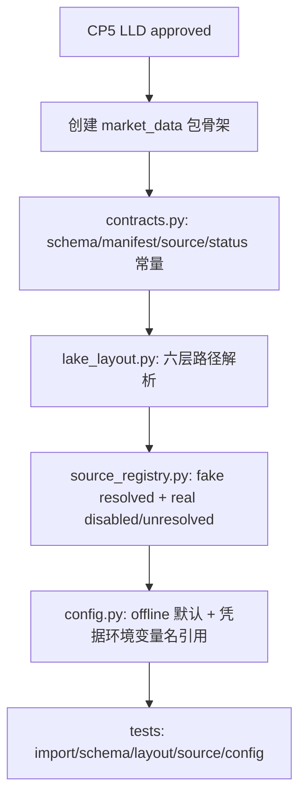

# LLD: STORY-014 - CR-004 market_data 包骨架与数据湖契约

> 本文档已于 2026-05-17 通过 CP5 批次 A 人工确认，结论为 `approved-with-constraints`。实现仅允许进入本 LLD 第 4 / 11 节限定文件，不得修改 `engine/**`、`experiments/**`、真实 `data/**`、真实 `reports/**`、`delivery/**` 或任何凭据文件。

## 0. 修订记录

| 版本 | 日期 | 修订人 | 变更要点 |
|---|---|---|---|
| 1.2 | 2026-05-17 | meta-po | 回填 CP5 批次 A `approved-with-constraints` 状态，确认允许按本 LLD 限定范围实现；补充实现后仍受文件边界和约束协议保护。 |
| 1.1 | 2026-05-17 | meta-dev | 按 CP5 Batch A review findings 修订：加入 `source_unresolved` 错误枚举、Batch A canonical 范围边界、manifest resume/血缘/校验字段、真实源状态映射和缓存禁入库检查；保持 `confirmed=false`。 |
| 1.0 | 2026-05-17 | meta-dev | 基于 CR-004、HLD §21、ADR-008/011、STORY-014 和 CP4 批次 A 规划起草 LLD；保持 `confirmed=false`，仅供 CP5 审查。 |

## 1. Goal

创建 `market_data/` 的独立包骨架和静态契约设计，冻结数据湖 raw / manifest / canonical / gold / quality / catalog 六层路径、canonical prices schema、manifest schema、source registry、offline 默认配置和不依赖 `engine` 的边界。

本 Story 完成后只提供可被 STORY-015..018 消费的源代码契约，不实现 connector 请求、runtime 执行、raw 写入、canonical 生成、reader、CLI、真实数据抓取或实验接入。

## 2. Requirements（Functional / Non-Functional）

### 2.1 Functional

- 创建 `market_data/__init__.py`、`market_data/py.typed`、`market_data/contracts.py`、`market_data/config.py`、`market_data/source_registry.py`、`market_data/lake_layout.py` 和 `tests/test_market_data_contracts.py` 的实现设计。
- `market_data.contracts` 定义 schema 版本、数据集名称、lake 层级、canonical prices 字段、manifest 字段、状态枚举、错误类型枚举和质量状态枚举。
- `market_data.lake_layout` 提供 `LakeLayout` 或等价对象，根据 `lake_root` 解析六层路径，不写入任何生产数据。
- `market_data.source_registry` 提供 exact source registry：`fake` 默认 `resolved/enabled`；`akshare`、`tushare`、`tickflow` 默认 `disabled/unresolved`，未显式启用时不得触发真实 adapter。
- `market_data.config` 提供 offline 默认配置、真实 source 显式启用字段、凭据环境变量名引用和路径配置；不得保存真实凭据值。
- `market_data` 包不得 import `engine.*`、`experiments.*`、`reports.*` 或真实网络 adapter。
- Batch A 只冻结 `prices` canonical 最小契约和 raw/manifest 基础契约；`index_members`、`trade_calendar` 只登记占位 dataset 名称，字段契约、quality gate 和多源比对接口延期到 STORY-016/017。

### 2.2 Non-Functional

- 默认测试路径网络调用次数为 0；本 Story 只设计静态契约和路径解析。
- 不新增依赖；`pyproject.toml` 与 `uv.lock` 在本 Story 实现中不修改。
- 契约模块导入必须无 I/O、无网络、无 pandas/pyarrow/akshare/tushare/tickflow 重型导入。
- 路径解析必须支持 `tmp_path` 和自定义 `lake_root`，默认值为 `data/market_data` 但测试不得写真实 `data/market_data/raw/**`。
- source、dataset、interface、schema_version 均采用 exact 语义；禁止模糊匹配、大小写猜测或自动纠错。
- CP5 人工确认前不得实现代码；若实现阶段发现契约与 HLD/ADR 冲突，必须回到 LLD 修改而不是直接编码绕过。

## 3. 模块拆分与职责

| 模块 / 文件组 | 职责 | 说明 |
|---|---|---|
| `market_data/__init__.py` | 暴露包版本、核心契约对象和轻量导入边界 | 不导入 connector/runtime/storage；不触发 I/O |
| `market_data/py.typed` | 标记包提供类型信息 | 空文件即可；用于后续可迁移包边界 |
| `market_data/contracts.py` | 定义 schema、字段、状态、错误类型和 `__all__` | 采用常量表 + frozen dataclass/TypedDict 的轻量组合；不依赖 pandas |
| `market_data/lake_layout.py` | 封装 lake root 与六层路径解析 | 只返回 `Path`；提供父路径占用校验函数设计；不主动创建生产目录 |
| `market_data/source_registry.py` | 定义 source/interface registry 与解析函数 | fake resolved；真实源 disabled/unresolved；exact lookup fail fast |
| `market_data/config.py` | 定义 offline 默认配置和真实 source 显式启用配置 | 凭据只记录环境变量名，如 `TUSHARE_TOKEN`；不读取或输出凭据值 |
| `tests/test_market_data_contracts.py` | 覆盖静态契约、路径解析、source 默认关闭和导入隔离 | 实现阶段用 `tmp_path`；本 LLD 阶段不运行测试 |

共享设计片段：本 LLD 消费 `process/HLD.md#21.4-数据湖分层` 与 ADR-011 的 manifest/canonical 字段契约；消费 ADR-008 的 `market_data` 独立性约束。

## 4. 代码结构与文件影响范围

| 动作 | 文件路径 | 变更内容 |
|---|---|---|
| 创建 | `market_data/__init__.py` | 声明 `__version__`，导出 `LakeLayout`、schema 常量、source registry 入口；不做副作用导入 |
| 创建 | `market_data/py.typed` | 标记 typed package |
| 创建 | `market_data/contracts.py` | 定义 lake 层级、dataset、canonical prices 字段、manifest 字段、状态枚举、错误类型、质量状态和 schema version |
| 创建 | `market_data/lake_layout.py` | 定义 `LakeLayout`、六层路径属性、raw/manifest/canonical 路径构造函数和父路径占用校验函数 |
| 创建 | `market_data/source_registry.py` | 定义 `SourceSpec`、`InterfaceSpec`、`SOURCE_REGISTRY`、`resolve_source`、`resolve_interface` |
| 创建 | `market_data/config.py` | 定义 `MarketDataConfig`、`RuntimePolicyDefaults`、`SourceConfig` 和 `DEFAULT_CONFIG` |
| 创建 | `tests/test_market_data_contracts.py` | 覆盖导入无副作用、字段集合、路径解析、source registry、真实源默认关闭和禁止依赖 |

明确不修改：`market_data/connectors/**`、`market_data/runtime.py`、`market_data/storage.py`、`engine/**`、`experiments/**`、`delivery/**`、`data/**`、`reports/**`、`pyproject.toml`、`uv.lock`。

## 5. 数据模型与持久化设计

本 Story 不写入运行时数据、Parquet、raw、manifest、quality、catalog 或真实生产数据；只定义后续持久化对象的字段契约。

### 5.1 常量与 schema 对象

| 对象 / 字段 | 类型 | 约束 | 说明 |
|---|---|---|---|
| `SCHEMA_VERSION` | `str` | 固定为 `"1.0"` | manifest、canonical、catalog 的首版契约版本 |
| `LAKE_LAYERS` | `tuple[str, ...]` | 严格为 `raw, manifest, canonical, gold, quality, catalog` | 对应 HLD §21.4 六层 |
| `DATASET_PRICES` | `str` | `"prices"` | 首个 canonical dataset |
| `DATASET_INDEX_MEMBERS` | `str` | `"index_members"` | Batch A 只登记占位；字段契约由 STORY-016 冻结 |
| `DATASET_TRADE_CALENDAR` | `str` | `"trade_calendar"` | Batch A 只登记占位；字段契约由 STORY-016 冻结 |
| `CANONICAL_PRICES_REQUIRED_COLUMNS` | `tuple[str, ...]` | 至少 `trade_date,symbol,close,source,source_run_id` | ADR-011 必需字段 |
| `CANONICAL_PRICES_CONDITIONAL_COLUMNS` | `tuple[str, ...]` | `adjustment_policy,available_at` | 价格数据条件必需；fake 可固定值 |
| `MANIFEST_REQUIRED_FIELDS` | `tuple[str, ...]` | 不少于 20 个字段 | 包含 `schema_version,run_id,batch_id,idempotency_key,source,interface,params,params_hash,requested_at,started_at,finished_at,attempts,status,raw_path,raw_checksum,raw_row_count,canonical_path,error_type,error_message,retryable` |
| `MANIFEST_STATUS_VALUES` | `tuple[str, ...]` | `pending,running,success,partial_success,failed,skipped,circuit_open,orphan_raw` | STORY-015 runtime、resume 与 storage 消费 |
| `SOURCE_STATUS_VALUES` | `tuple[str, ...]` | `resolved,disabled,unresolved` | fake 与真实源默认状态 |
| `CONNECTOR_ERROR_TYPES` | `tuple[str, ...]` | `source_disabled,source_unresolved,interface_not_allowed,missing_credential,network_error,rate_limited,provider_error,contract_error,circuit_open,storage_error,credential_exposure` | STORY-015 错误映射消费；`source_unresolved` 用于 TickFlow exact API 未确认等强关闭状态 |
| `QUALITY_STATUS_VALUES` | `tuple[str, ...]` | `pass,warn,fail` | STORY-016 quality 消费 |

Batch A canonical 范围说明：本 LLD 只把 `prices` 作为 canonical 最小字段契约冻结对象。`index_members` 与 `trade_calendar` 在 Batch A 中仅作为 dataset registry 占位，避免 STORY-015 fake connector 和后续 planner 对 dataset 名称各自发明；二者必需字段、quality gate、覆盖缺口、重复记录和多源比对接口由 STORY-016/017 LLD 冻结。

### 5.2 `LakeLayout`

| 字段 / 方法 | 类型 | 约束 | 说明 |
|---|---|---|---|
| `lake_root` | `Path` | 默认 `Path("data/market_data")` | 可被测试传入 `tmp_path` 覆盖 |
| `raw_root` / `manifest_root` / `canonical_root` / `gold_root` / `quality_root` / `catalog_root` | `Path` property | 只拼接路径 | 不创建目录 |
| `raw_batch_path(source, interface, trade_date, batch_id, suffix="jsonl")` | 方法 | exact source/interface；日期格式 `YYYYMMDD` | 返回 `raw/<source>/<interface>/<YYYYMMDD>/<batch_id>.jsonl` |
| `manifest_path()` | 方法 | 固定文件名 | 返回 `manifest/market_data_manifest.jsonl` |
| `canonical_dataset_root(dataset, schema_version=SCHEMA_VERSION)` | 方法 | exact dataset | 返回 `canonical/<dataset>/<schema_version>/` |
| `ensure_parent_dirs_for_write(path)` | 函数 | 逐级父路径必须是目录或不存在 | 任一级为普通文件时抛 `MarketDataPathError`；实现阶段由写入方调用 |
| `orphan_raw_root` | `Path` property | 位于 `raw/_orphan/` | STORY-015 manifest append 失败补偿时隔离不可追溯 raw |

### 5.3 `SourceRegistry`

| source | 默认状态 | 接口 | 凭据引用 | 说明 |
|---|---|---|---|---|
| `fake` | `resolved` | `prices.daily`, `index_members.snapshot`, `trade_calendar.daily` | 无 | 默认测试和 CLI smoke 唯一启用源 |
| `akshare` | `disabled` | 首轮只登记允许接口名，不真实调用 | 无默认凭据 | adapter 边界由 STORY-015 fail fast |
| `tushare` | `disabled` | 首轮只登记允许接口名占位 | `TUSHARE_TOKEN` | 只引用环境变量名，不读取、不打印 |
| `tickflow` | `unresolved` | 空或占位接口 | `TICKFLOW_TOKEN` / `TICKFLOW_ENDPOINT` | exact API 未确认，不标记 resolved |

状态映射：`unresolved` 是比 `disabled` 更强的默认关闭状态，表示 source 的 exact API、认证或限频契约尚未确认；它同样属于默认不可联网状态。`disabled` 对应已知 source 但未显式启用，错误类型为 `source_disabled`；`unresolved` 对应 source 契约未确认，错误类型为 `source_unresolved`。所有真实 source 默认都不得联网。

持久化说明：以上对象均是源代码契约。真实 manifest JSONL、canonical Parquet、quality 文件由后续 Story 设计和实现。

## 6. API / Interface 设计

| 接口 / 入口 | 输入 | 输出 | 调用方 | 说明 |
|---|---|---|---|---|
| `import market_data` | Python import | 版本与轻量对象可用 | 用户、测试、后续 Story | 不导入 connector/runtime/storage；测试 `T014-IMPORT-01` |
| `import market_data.contracts` | Python import | schema/字段/状态常量 | STORY-015..018、测试 | 无 I/O、无网络、无重型依赖；测试 `T014-CONTRACT-01` |
| `LakeLayout(lake_root)` | `str | Path` | layout 实例 | storage、normalization、readers、CLI | 不创建目录；测试 `T014-LAYOUT-01` |
| `LakeLayout.raw_batch_path(source, interface, trade_date, batch_id)` | exact source/interface、日期、batch_id | raw 文件路径 | STORY-015 storage | 路径符合 HLD §21.4；测试 `T014-LAYOUT-02` |
| `LakeLayout.manifest_path()` | 无 | manifest JSONL 路径 | STORY-015 storage、STORY-016 normalization | 固定 `manifest/market_data_manifest.jsonl`；测试 `T014-LAYOUT-03` |
| `resolve_source(source, config=None)` | source 字符串、可选配置 | `SourceSpec` 或 `SourceRegistryError` | connector factory、CLI | unknown/disabled/unresolved 均 fail fast；测试 `T014-SOURCE-01` |
| `resolve_interface(source, interface)` | source、interface 字符串 | `InterfaceSpec` 或 `SourceRegistryError` | connector runtime | exact match；禁止模糊匹配；测试 `T014-SOURCE-02` |
| `DEFAULT_CONFIG` / `MarketDataConfig` | 无或显式字段 | offline 默认配置对象 | planner/runtime/CLI | `offline=True`、`default_source=fake`；测试 `T014-CONFIG-01` |

错误暴露策略：

- `SourceRegistryError`：未知 source、source disabled、source unresolved、interface 未允许时触发，结构化属性包含 `source`、`interface`、`error_type`、`source_status`、`retryable=false`；TickFlow unresolved 必须使用 `source_unresolved`，不得降级为泛化 `contract_error`。
- `MarketDataPathError`：路径父级被普通文件占用或 lake root 非法时触发，消息包含路径；不暴露 Python traceback 给 CLI。
- `MarketDataConfigError`：真实 source 启用但缺少 required env var name、allowlist 为空或 offline=false 未显式设置时触发。

第 10 节为本节每个接口提供对应测试入口。

## 7. 核心处理流程

1. 实现阶段在 CP5 通过后创建 `market_data/` 目录和轻量 `__init__.py`。
2. 在 `contracts.py` 中写入 schema version、字段列表、状态枚举和错误类型常量，保持纯常量导入。
3. 在 `lake_layout.py` 中实现路径解析对象，仅拼接路径，不创建目录、不写文件。
4. 在 `source_registry.py` 中登记 fake 与真实源状态；fake exact resolved，真实源默认 disabled/unresolved。
5. 在 `config.py` 中登记 offline 默认配置和真实源显式启用配置结构；凭据只保存环境变量名引用。
6. 在测试文件中用 `tmp_path` 验证路径解析和 fail-fast，不写真实 `data/market_data/raw/**`。

异常路径：

- CP5 未批准：停止，不创建 `market_data/**`。
- `contracts.py` 需要新增依赖：停止并记录偏差；本 Story 不修改 `pyproject.toml` / `uv.lock`。
- source 未登记或大小写不匹配：抛 `SourceRegistryError`，不做模糊匹配。
- 真实 source 被默认启用：测试失败并回滚为 disabled/unresolved。
- 路径父级被普通文件占用：`ensure_parent_dirs_for_write` 抛 `MarketDataPathError`，后续写入方不得继续。

## 8. 技术设计细节

- 契约对象形态：字段列表和枚举值采用 `tuple[str, ...]` 常量；`SourceSpec`、`InterfaceSpec`、`MarketDataConfig`、`LakeLayout` 采用 `@dataclass(frozen=True, slots=True)`。不使用 pydantic，避免新增依赖。
- 类型边界：`py.typed` 与类型注解只服务静态可读性；运行时校验保持 stdlib 实现。
- schema 版本：首版固定 `SCHEMA_VERSION = "1.0"`。后续 schema 破坏性变更必须新增版本目录，不在同目录混写。
- manifest 字段：`canonical_path` 在 STORY-015 raw 阶段允许为空字符串或 `None`，但字段必须存在，供 STORY-016 派生后回填或追加派生记录。
- source registry：`resolve_source("Fake")`、`resolve_source("fake ")` 均失败；调用方必须传 exact 字符串 `fake`。
- source 状态：`disabled` 与 `unresolved` 都表示默认关闭且不可联网；`unresolved` 额外表示 exact API 未确认，因此错误诊断必须保留 `source_unresolved`，便于 QA 与用户区分“未启用”和“未知接口”。
- 配置安全：配置对象只包含 `credential_env_var` 字段名，不读取 `os.environ` 值；读取凭据值属于真实 adapter 显式启用路径，由 STORY-015 fail-fast adapter 处理。
- 路径策略：`LakeLayout` 不调用 `mkdir`；写入前父路径校验函数由 STORY-015 storage 调用，避免契约层产生文件系统副作用。
- 图示类型选择：本 Story 跨 contracts/config/source_registry/lake_layout/tests 五个模块，使用流程图表达实现顺序；不需要时序图。

## 9. 安全与性能设计

| 维度 | 设计措施 | 验证方式 |
|---|---|---|
| 安全 | `market_data` 与 `market_data.contracts` 导入不读取环境变量、不访问网络、不读写文件 | `T014-IMPORT-01`、静态扫描 |
| 安全 | 凭据只以环境变量名引用：`TUSHARE_TOKEN`、`TICKFLOW_TOKEN`、`TICKFLOW_ENDPOINT`；不记录值 | `T014-CONFIG-02` 人工/自动断言无 token 值 |
| 安全 | 真实 source 默认 `disabled/unresolved`，且 `retryable=false` fail fast | `T014-SOURCE-01` |
| 安全 | 禁止 import `engine.*`、`experiments.*`、`reports.*` | `rg -n "from engine|import engine|from experiments|import experiments|from reports|import reports" market_data` |
| 可移植性 | 不提交 `__pycache__/`、`*.pyc`、`.ipynb_checkpoints/` 等缓存产物 | `find . -path "./.venv" -prune -o -path "./.git" -prune -o \\( -type d -name "__pycache__" -o -name "*.pyc" -o -path "*/.ipynb_checkpoints/*" \\) -print` 人工确认无新增交付项 |
| 性能 | 契约导入只执行常量和 dataclass 定义，不加载 pandas/pyarrow/akshare | `T014-IMPORT-01` |
| 性能 | 路径解析为纯 `Path` 拼接，无目录扫描 | `T014-LAYOUT-01` |
| 可移植性 | 不使用当前仓库内部模块；默认 lake root 可配置 | 单元测试 + 静态扫描 |

## 10. 测试设计

本节是实现后的测试设计；本 LLD 起草阶段不运行测试。

| 测试场景 | 前置条件 | 操作 | 预期结果 | 验证方式 |
|---|---|---|---|---|
| `T014-IMPORT-01` 包导入无副作用 | CP5 通过且实现完成 | `python -c "import market_data; import market_data.contracts"` | 退出码 0；不导入 connector/runtime；无 I/O、无网络 | `uv run --python 3.11 python -c ...` |
| `T014-CONTRACT-01` canonical prices 字段完整 | `contracts.py` 已实现 | 检查 `CANONICAL_PRICES_REQUIRED_COLUMNS` | 至少包含 `trade_date,symbol,close,source,source_run_id` | pytest 断言 |
| `T014-CONTRACT-02` manifest 字段完整 | `contracts.py` 已实现 | 检查 `MANIFEST_REQUIRED_FIELDS` | 不少于 20 个必需字段，包含 idempotency_key/source/interface/params/params_hash/attempts/status/raw_path/raw_checksum/raw_row_count/canonical_path | pytest 断言 |
| `T014-CONTRACT-03` 状态枚举完整 | `contracts.py` 已实现 | 检查 manifest/source/quality/error 枚举 | 状态值 exact 且无重复 | pytest 断言 |
| `T014-CONTRACT-04` Batch A dataset 范围明确 | `contracts.py` 已实现 | 检查 dataset 常量 | `prices` 字段契约已冻结；`index_members`、`trade_calendar` 仅占位并标注 STORY-016 冻结 | pytest 断言或人工审查 |
| `T014-LAYOUT-01` 六层路径解析 | `LakeLayout(tmp_path)` | 读取六层 root 属性 | 均位于 `tmp_path` 下，层级名 exact | pytest + `tmp_path` |
| `T014-LAYOUT-02` raw batch path | `LakeLayout(tmp_path)` | 调用 `raw_batch_path("fake","prices.daily","2026-01-02","b1")` | 返回 `raw/fake/prices.daily/20260102/b1.jsonl` 等价路径 | pytest |
| `T014-LAYOUT-03` manifest/canonical path | `LakeLayout(tmp_path)` | 调用 `manifest_path()` 与 `canonical_dataset_root("prices")` | 返回 manifest JSONL 与 canonical prices schema version 目录 | pytest |
| `T014-SOURCE-01` 真实源默认关闭 | registry 已实现 | resolve `akshare/tushare/tickflow` | 返回 disabled/unresolved 结构或非重试结构化错误；不联网 | pytest |
| `T014-SOURCE-03` unresolved 诊断稳定 | registry 已实现 | resolve `tickflow` | source_status 为 `unresolved`，错误类型为 `source_unresolved` | pytest |
| `T014-SOURCE-02` exact source/interface | registry 已实现 | resolve `"Fake"`、unknown interface | 抛 `SourceRegistryError`；不做模糊匹配 | pytest |
| `T014-CONFIG-01` offline 默认配置 | config 已实现 | 检查 `DEFAULT_CONFIG` | `offline=True`、`default_source="fake"`、真实源未启用 | pytest |
| `T014-CONFIG-02` 凭据不泄露 | config 已实现 | 扫描配置对象和源码 | 只出现环境变量名，不出现 token/API key 值 | pytest + `rg` |
| `T014-BOUNDARY-01` 不依赖 engine | 实现完成 | 静态扫描 `market_data` | 无 `engine/experiments/reports` import | `rg` 命令 |
| `T014-HYGIENE-01` 缓存禁入库扫描 | 实现完成并运行过测试 | 执行缓存扫描命令 | 无新增 `__pycache__/`、`*.pyc`、`.ipynb_checkpoints/` 交付项 | `find` 命令 + 人工确认 |

## 11. 实施步骤

| TASK-ID | 动作 | 目标文件 | 详细描述 | 对应测试 |
|---|---|---|---|---|
| S014-T1 | 创建 | `market_data/__init__.py`, `market_data/py.typed` | 建立可导入包；导出版本和轻量契约对象；初始化文件不得导入 runtime/connector | `T014-IMPORT-01` |
| S014-T2 | 创建 | `market_data/contracts.py` | 定义 schema version、lake 层级、canonical prices 字段、Batch A dataset 占位、manifest 字段、状态枚举、错误类型和 `__all__` | `T014-CONTRACT-01`, `T014-CONTRACT-02`, `T014-CONTRACT-03`, `T014-CONTRACT-04` |
| S014-T3 | 创建 | `market_data/lake_layout.py` | 实现 `LakeLayout`、六层路径属性、raw/manifest/canonical 路径函数和父路径占用校验函数 | `T014-LAYOUT-01`, `T014-LAYOUT-02`, `T014-LAYOUT-03` |
| S014-T4 | 创建 | `market_data/source_registry.py` | 实现 exact registry；fake resolved；AkShare/Tushare disabled；TickFlow unresolved；unknown fail fast；unresolved 映射 `source_unresolved` | `T014-SOURCE-01`, `T014-SOURCE-02`, `T014-SOURCE-03` |
| S014-T5 | 创建 | `market_data/config.py` | 实现 offline 默认配置和真实 source 显式启用配置结构；凭据仅保存环境变量名 | `T014-CONFIG-01`, `T014-CONFIG-02` |
| S014-T6 | 创建 | `tests/test_market_data_contracts.py` | 覆盖导入、schema、路径、registry、config 和静态边界 | 第 10 节全部测试 |

文件影响范围与 TASK-ID 对应关系：

| 文件影响项 | 覆盖 TASK-ID |
|---|---|
| `market_data/__init__.py` | S014-T1 |
| `market_data/py.typed` | S014-T1 |
| `market_data/contracts.py` | S014-T2 |
| `market_data/lake_layout.py` | S014-T3 |
| `market_data/source_registry.py` | S014-T4 |
| `market_data/config.py` | S014-T5 |
| `tests/test_market_data_contracts.py` | S014-T6 |

## 12. 风险、难点与预研建议

| 风险 / 难点 | 影响 | 缓解措施 / 预研建议 |
|---|---|---|
| 契约层过早绑定真实 provider 字段 | 后续真实 adapter 返工，或默认测试误联网 | 真实 TickFlow/Tushare/AkShare 只登记 disabled/unresolved 边界；不猜测 exact API |
| manifest 字段与 STORY-015 raw writer 不一致 | runtime/storage 无法稳定写入和追溯 | 本 LLD 冻结 `MANIFEST_REQUIRED_FIELDS`；STORY-015 只能消费或提出 LLD 修改 |
| Batch A 范围被误解为完整数据湖契约 | CP5/CP7 误判 index_members、trade_calendar、quality 和多源比对已冻结 | 本 LLD 只冻结 `prices` + raw/manifest 基础契约；其余对象明确延期到 STORY-016/017 |
| 路径解析函数隐式创建目录 | LLD 阶段或契约层产生副作用 | `LakeLayout` 只返回路径；写入前目录创建由 STORY-015 storage 显式执行 |
| `market_data` 反向依赖 `engine` | 可迁移性失败 | 静态扫描纳入 CP6；本 Story 不复用 engine contracts |
| 真实源凭据泄露 | 安全事故 | 只保存环境变量名，不读取、不打印、不写 manifest |

### OPEN / Spike 跟踪

| ID | 类型（OPEN / Spike） | 问题 | 下一动作 | 责任方 |
|---|---|---|---|---|
| CR4-S014-O1 | OPEN | TickFlow exact API、认证方式、限频规则和字段 schema 未确认 | 保持 `tickflow` 为 `unresolved`；真实启用前另行确认接口 | 用户 / 后续数据源 owner |
| CR4-S014-O2 | OPEN | Tushare token 管理方式和允许接口未确认 | 只引用 `TUSHARE_TOKEN` 环境变量名；真实启用前确认 token 策略与接口配额 | 用户 / 后续数据源 owner |

## 13. 回滚与发布策略

- 发布方式：CP5 确认后，作为仓库内源代码契约随 Story 实现提交；不发布跨仓库安装包，不写 `delivery/**`。
- 回滚触发条件：CP5 人工确认拒绝；实现后发现 `market_data` 反向依赖 `engine`；真实源默认启用；manifest/canonical 字段与 ADR-011 冲突；无新增依赖约束无法满足。
- 回滚动作：删除本 Story 创建的 `market_data/__init__.py`、`market_data/py.typed`、`market_data/contracts.py`、`market_data/config.py`、`market_data/source_registry.py`、`market_data/lake_layout.py` 和 `tests/test_market_data_contracts.py`；不得删除 `process/` 中的 Story、LLD、CP5 审查记录。
- 兼容策略：后续 Story 若需要扩展 schema，只能追加向后兼容字段或新增 schema version；不得在同名常量中静默删除已冻结必需字段。

## 14. Definition of Done / 确认清单

- [x] 14 个章节全部填写完成，并保留 `tier`、`shared_fragments`、`open_items` frontmatter 强输入字段。
- [x] CP5 已通过，确认状态为 `confirmed=true`、`dev_gate=cp5_approved_with_constraints`、`implementation_allowed=true`。
- [x] 第 4 节文件影响范围只覆盖 STORY-014 primary 文件和测试文件，不触碰禁止目录。
- [x] 第 5 节冻结六层 lake、canonical prices、manifest、source registry 和配置对象契约。
- [x] Batch A 只冻结 `prices` + raw/manifest 基础契约；`index_members`、`trade_calendar`、quality gate、多源比对接口已明确延期到 STORY-016/017。
- [x] 第 6 节每个接口均在第 10 节存在对应测试入口。
- [x] 第 7 节异常路径均在第 10 节或第 12 节有验证/缓解入口。
- [x] 第 11 节 TASK-ID 与第 4 节文件影响范围一一对应。
- [x] 真实 TickFlow/Tushare/AkShare 默认不联网；凭据只以环境变量名引用。
- [x] `market_data` 不依赖 `engine`、`experiments`、`reports`。
- [x] CP6 前执行缓存禁入库扫描，确认无新增 `__pycache__/`、`*.pyc`、`.ipynb_checkpoints/` 交付项。
- [x] CP5 自动预检和人工确认已通过，meta-dev 已按限定范围进入实现并生成 CP6。

## 人工确认区

> **CP5 - STORY-014 LLD 可实现性门**
> 本 Story 已通过 `checkpoints/CP5-CR004-BATCH-A-LLD-REVIEW.md` 批次 A 人工确认；后续变更必须重新走 CP5 或 CR 变更流程。

**CP5 建议审查重点**：

| # | 检查项 | 建议结论 | 证据 |
|---|---|---|---|
| 1 | LLD 覆盖 AC | 已确认 | 第 2 / 5 / 10 / 14 节 |
| 2 | 与 HLD / ADR 一致 | 已确认 | HLD §21.4；ADR-008、ADR-011；第 3 / 8 / 12 节 |
| 3 | 文件影响范围明确 | 已确认 | 第 4 / 11 节 |
| 4 | 接口契约完整 | 已确认 | 第 6 节 |
| 5 | 测试与 dev_gate 可计算 | 已确认 | 第 10 / 14 节 |

**确认选项**：

- 结论：`approved-with-constraints`
- 审查人：user
- 审查时间：2026-05-17T13:04:25+08:00
- 约束文件：`process/constraints/CR004-QUALITY-DATALOADER-CONFIRMATION-CONSTRAINTS-2026-05-17.md`
