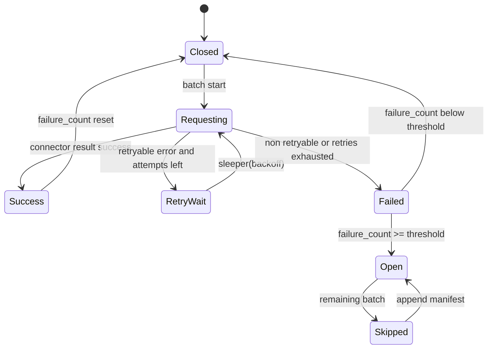

# LLD: STORY-015 - CR-004 connector runtime 与 raw/manifest 写入

> 本文档已于 2026-05-17 通过 CP5 批次 A 人工确认，结论为 `approved-with-constraints`。实现仅允许进入本 LLD 第 4 / 11 节限定文件，不得修改 `engine/**`、`experiments/**`、真实 `data/**`、真实 `reports/**`、`delivery/**` 或任何凭据文件。
>
> STORY-015 的实现依赖 STORY-014 schema/source registry/lake layout 契约冻结。LLD 可在同一 CP5 批次中审查；编码必须等待 STORY-014 LLD 批准，且共享契约变更必须回写 STORY-014 或另行确认。

## 0. 修订记录

| 版本 | 日期 | 修订人 | 变更要点 |
|---|---|---|---|
| 1.2 | 2026-05-17 | meta-po | 回填 CP5 批次 A `approved-with-constraints` 状态，确认允许按本 LLD 限定范围实现；补充实现后仍受文件边界和约束协议保护。 |
| 1.1 | 2026-05-17 | meta-dev | 按 CP5 Batch A review findings 修订：补充 resume/幂等键、`run_id/source_run_id` 血缘、fake `available_at`/`adjustment_policy` 来源、raw `.tmp` 原子 rename、checksum/row_count、orphan raw 补偿、runtime 边界测试和缓存禁入库检查；保持 `confirmed=false`。 |
| 1.0 | 2026-05-17 | meta-dev | 基于 CR-004、HLD §21、ADR-010/011、STORY-015 和 STORY-014 契约输入起草 LLD；保持 `confirmed=false`，仅供 CP5 审查。 |

## 1. Goal

创建 connector protocol、fake/offline connector、真实 TickFlow/AkShare/Tushare fail-fast adapter 边界、runtime 限速/重试/熔断状态机、resume 协议、raw writer 和 manifest writer 的详细实现设计，使后续实现能在无网络、无凭据、无真实数据的默认路径下生成 deterministic fake raw 与可追溯 manifest。

本 Story 不设计 canonical normalization、quality validation、reader、CLI、多源比对、实验接入或真实联网抓数；这些能力由 STORY-016..018 接续。Batch A 只冻结 `prices` + raw/manifest 基础契约；`index_members`、`trade_calendar`、quality gate 和多源比对接口延期到 STORY-016/017。

## 2. Requirements（Functional / Non-Functional）

### 2.1 Functional

- 创建 `market_data/connectors/__init__.py`、`protocol.py`、`fake.py`、`akshare.py`、`tushare.py`、`tickflow.py`、`market_data/runtime.py`、`market_data/storage.py` 和 `tests/test_market_data_runtime_storage.py` 的实现设计。
- `ConnectorProtocol.fetch(interface, params)` 返回 `ConnectorResult` 或抛/返回结构化 `ConnectorError`，错误包含 `error_type`、`error_message`、`retryable`、`source`、`interface`。
- fake connector 在相同 seed、symbols、date_range、interface 下输出 deterministic raw rows，并支持 failure plan 模拟 retryable、non-retryable、partial success。
- 真实 AkShare/Tushare/TickFlow adapter 默认 fail fast；只有 `enabled=true`、source/interface allowlist、凭据环境变量引用存在且用户显式执行时才允许后续真实调用路径。首轮默认测试不走真实联网。
- runtime 支持可测试的 throttle、有限 retry、backoff jitter、circuit breaker，并注入 `clock`、`sleeper`、`jitter`，测试不真实等待。
- storage 写 raw JSONL 与 manifest JSONL；manifest 每批记录 source、interface、params、requested_at、attempts、status、raw_path、canonical_path、错误字段和时间字段。
- 熔断打开后剩余批次状态明确为 `skipped` 或 `circuit_open`，并写入 manifest。
- runtime 启动时读取 manifest，按 `run_id + batch_id + source + interface + params_hash` 幂等键执行 resume：`success` 默认跳过，`failed`/`partial_success` 按策略重试或跳过，重复 manifest 记录必须被检测。
- raw 写入采用 `.tmp` 完整写入后原子 rename，manifest 记录 `raw_checksum` 与 `raw_row_count`；manifest append 失败时必须隔离 orphan raw 或返回可审计失败。

### 2.2 Non-Functional

- 默认测试网络调用次数为 0，不需要任何 token、API key、cookie、session 或真实行情数据。
- 不新增依赖；`pyproject.toml` 与 `uv.lock` 在本 Story 实现中不修改。
- `akshare.py`、`tushare.py`、`tickflow.py` 模块 import 不得联网，不得在 import 阶段导入真实 provider；AkShare 如需支持真实路径，采用函数内部延迟导入。
- raw/manifest 测试写入只使用 `tmp_path`；不得写真实 `data/market_data/raw/**` 或提交真实数据。
- 错误和 manifest 不得包含凭据值；最多记录环境变量名、source、interface 和错误类型。
- CP5 人工确认前不得实现代码；若 STORY-014 契约未冻结，不得进入 STORY-015 编码。

## 3. 模块拆分与职责

| 模块 / 文件组 | 职责 | 说明 |
|---|---|---|
| `market_data/connectors/protocol.py` | 定义 connector 数据结构、协议、错误对象和 adapter 基类边界 | 消费 STORY-014 `CONNECTOR_ERROR_TYPES`、source/interface exact 语义 |
| `market_data/connectors/fake.py` | 实现 deterministic fake connector 和 failure plan | 默认 offline 测试唯一成功 connector |
| `market_data/connectors/akshare.py` | 实现 AkShare adapter fail-fast 边界、接口 allowlist、延迟导入设计 | 默认 disabled；无显式启用时非重试错误 |
| `market_data/connectors/tushare.py` | 实现 Tushare adapter fail-fast 边界、token env var 名校验设计 | 默认 disabled；不提交 token |
| `market_data/connectors/tickflow.py` | 实现 TickFlow unresolved adapter 边界 | exact API 未确认，默认 unresolved fail fast |
| `market_data/connectors/__init__.py` | 导出 protocol 与 fake connector 的轻量入口 | 不导入真实 provider |
| `market_data/runtime.py` | 编排批次执行、throttle、retry、backoff、熔断、时间注入 | 不直接写文件；调用 storage |
| `market_data/storage.py` | 写 raw JSONL、append manifest JSONL、manifest 读取、父路径校验、checksum、orphan raw 隔离和相对路径规范化 | 消费 STORY-014 `LakeLayout` 和 manifest 字段 |
| `tests/test_market_data_runtime_storage.py` | 覆盖 fake 成功/失败、重试、熔断、resume、raw/manifest 原子性、真实源默认关闭、无网络 | 使用 `tmp_path`、fake clock/sleeper/jitter |

共享设计片段：本 LLD 消费 STORY-014 的 schema/source registry/lake layout 设计；若 CP5 修改 STORY-014 契约，本 LLD 的第 5/6/10/11 节必须同步修订。

## 4. 代码结构与文件影响范围

| 动作 | 文件路径 | 变更内容 |
|---|---|---|
| 创建 | `market_data/connectors/__init__.py` | 导出 `ConnectorProtocol`、`ConnectorResult`、`ConnectorError`、`FakeConnector`；不导入真实 provider |
| 创建 | `market_data/connectors/protocol.py` | 定义 `ConnectorProtocol`、`ConnectorRequest`、`ConnectorResult`、`ConnectorError`、`AdapterConfig` |
| 创建 | `market_data/connectors/fake.py` | 实现 fake connector、deterministic row generator、failure plan |
| 创建 | `market_data/connectors/akshare.py` | 实现 AkShare fail-fast adapter 边界与显式启用校验；真实调用入口默认不可达 |
| 创建 | `market_data/connectors/tushare.py` | 实现 Tushare fail-fast adapter 边界与 `TUSHARE_TOKEN` 环境变量名引用校验 |
| 创建 | `market_data/connectors/tickflow.py` | 实现 TickFlow unresolved adapter 边界与 exact API 未确认错误 |
| 创建 | `market_data/runtime.py` | 实现 `RuntimePolicy`、`CircuitBreakerState`、batch execution、retry/backoff/throttle、clock/sleeper/jitter 注入 |
| 创建 | `market_data/storage.py` | 实现 `RawWriter`、`ManifestWriter`、raw JSONL 写入、manifest append、父路径校验 |
| 创建 | `tests/test_market_data_runtime_storage.py` | 覆盖 runtime/storage/connector 默认离线行为 |

可共享读取但不得无确认修改：`market_data/contracts.py`、`market_data/source_registry.py`、`market_data/lake_layout.py`。若实现发现必须修改共享契约，停止并回到 LLD/CP5 修改。

明确不修改：`market_data/normalization.py`、`market_data/validation.py`、`market_data/readers.py`、`market_data/cli.py`、`engine/**`、`experiments/**`、`delivery/**`、`data/**`、`reports/**`、`pyproject.toml`、`uv.lock`。

## 5. 数据模型与持久化设计

### 5.1 Connector 数据结构

| 对象 / 字段 | 类型 | 约束 | 说明 |
|---|---|---|---|
| `ConnectorRequest.source` | `str` | exact source | `fake`、`akshare`、`tushare`、`tickflow` |
| `ConnectorRequest.interface` | `str` | exact interface | 如 `prices.daily`；必须在 source registry allowlist |
| `ConnectorRequest.params` | `Mapping[str, Any]` | JSON 可序列化；不得含凭据值 | symbols/date_range/seed 等 |
| `ConnectorRequest.run_id` | `str` | 必需，由 `RuntimeContext` 注入 | 同一 run 的 raw metadata、manifest 和后续 canonical `source_run_id` 共用该值 |
| `ConnectorRequest.batch_id` | `str` | 必需，稳定可追溯 | 写 raw/manifest |
| `ConnectorRequest.params_hash` | `str` | 由脱敏后 canonical JSON 计算 SHA-256 | 幂等键组成部分；不含凭据值 |
| `ConnectorResult.rows` | `list[dict[str, Any]]` | fake 小样本；真实首轮默认不可返回成功 | raw writer 序列化为 JSONL |
| `ConnectorResult.metadata` | `dict[str, Any]` | 不含凭据 | 记录 `run_id`、source/interface、row_count、`adjustment_policy`、`available_at_rule` 等 |
| `ConnectorResult.partial_errors` | `list[ConnectorError]` | 可空 | partial success 场景写 manifest |
| `ConnectorError.error_type` | `str` | 枚举值 | 与 STORY-014 `CONNECTOR_ERROR_TYPES` 对齐 |
| `ConnectorError.retryable` | `bool` | 必需 | runtime 依据此字段决定重试 |
| `ConnectorError.safe_message` | `str` | 不含凭据 | manifest 只写安全消息 |

fake `prices.daily` rows 字段来源：

| 字段 | 来源规则 | 说明 |
|---|---|---|
| `trade_date` | 请求 date_range 展开 | 升序输出 |
| `symbol` | 请求 symbols exact 值 | 按输入排序或稳定排序输出 |
| `close` | `seed + symbol + trade_date` deterministic 生成 | 同参同输出，非真实行情 |
| `source` | 固定 `fake` | raw 与 canonical 一致 |
| `source_run_id` | 等于 `ConnectorRequest.run_id` | 后续 canonical 必须继承同一值 |
| `adjustment_policy` | manifest params 或 metadata；默认 `none` | fake 默认不表达真实复权 |
| `available_at` | deterministic derivation：`trade_date` 当日 `16:00:00+08:00` | 作为日线收盘后可用时点；STORY-016 可直接映射 |

### 5.2 Runtime 数据结构

| 对象 / 字段 | 类型 | 约束 | 说明 |
|---|---|---|---|
| `RuntimePolicy.max_retries` | `int` | `>=0`；默认 2 或 STORY-014 配置值 | 总尝试次数最多 `1 + max_retries` |
| `RuntimePolicy.throttle_seconds` | `float` | `>=0` | 批次间最小间隔；测试注入 sleeper 不等待 |
| `RuntimePolicy.backoff_base_seconds` | `float` | `>=0` | retry 退避基数 |
| `RuntimePolicy.backoff_max_seconds` | `float` | `>=0` | 单次退避上限 |
| `RuntimePolicy.circuit_breaker_failure_threshold` | `int` | `>=1` | 连续失败达到阈值后 open |
| `RuntimePolicy.circuit_breaker_skipped_status` | `str` | `skipped` 或 `circuit_open` | 熔断后剩余批次 manifest 状态 |
| `ResumePolicy.success` | `str` | 默认 `skip` | 幂等键已有 success 且 raw 校验通过时跳过 connector |
| `ResumePolicy.failed` | `str` | 默认 `retry` | 失败批次默认重新执行；可配置 `skip` |
| `ResumePolicy.partial_success` | `str` | 默认 `retry` | 部分成功默认重新执行并生成新 manifest 记录 |
| `ResumePolicy.duplicate_manifest` | `str` | 默认 `fail` | 同一幂等键存在多个 terminal 记录时 fail fast，除非最后一条状态可判定 |
| `RuntimeContext.run_id` | `str` | 必需，单次执行唯一 | request/raw metadata/manifest/canonical 血缘根 |
| `RuntimeContext.idempotency_key` | `str` | `run_id + batch_id + source + interface + params_hash` | resume 与重复 manifest 检测使用 |
| `BatchExecutionResult.status` | `str` | manifest status 枚举 | success/partial_success/failed/skipped/circuit_open |
| `BatchExecutionResult.attempts` | `int` | `1..1+max_retries` 或熔断跳过为 0 | manifest 必填 |
| `BatchExecutionResult.raw_path` | `str | None` | 成功/部分成功时存在 | canonical_path 此 Story 为空 |
| `CircuitBreakerState` | dataclass | `closed/open` + failure_count | 测试可直接断言 |

### 5.3 Raw 与 manifest 持久化

| 对象 / 字段 | 类型 | 约束 | 说明 |
|---|---|---|---|
| raw 文件 | JSONL | 每行一条原始 row；第一行允许 `_metadata` 记录 batch 信息 | 默认路径 `raw/<source>/<interface>/<YYYYMMDD>/<batch_id>.jsonl` |
| manifest 文件 | JSONL append | 每行一个 batch record | 默认路径 `manifest/market_data_manifest.jsonl` |
| `manifest.schema_version` | `str` | 必填 | 来源 STORY-014 `SCHEMA_VERSION` |
| `manifest.run_id` / `batch_id` / `idempotency_key` | `str` | 必填 | run/batch 可追溯；idempotency_key 用于 resume |
| `manifest.source` / `interface` / `params` / `params_hash` | JSON / `str` | 必填；params 不含凭据值 | 请求事实与幂等校验 |
| `manifest.requested_at` / `started_at` / `finished_at` | ISO string | 必填或跳过时按状态填充 | 由 injected clock 生成 |
| `manifest.status` | `str` | 必填 | pending/running/success/partial_success/failed/skipped/circuit_open/orphan_raw |
| `manifest.attempts` | `int` | 必填 | retry 可验证 |
| `manifest.raw_path` | `str | None` | 成功/部分成功时填充 | 建议记录相对 lake root 路径；orphan_raw 时指向隔离路径 |
| `manifest.raw_checksum` | `str | None` | 成功/部分成功/orphan_raw 时填充 | raw JSONL 完整内容 SHA-256 |
| `manifest.raw_row_count` | `int | None` | 成功/部分成功/orphan_raw 时填充 | 不含 `_metadata` 的数据行数 |
| `manifest.canonical_path` | `str | None` | 本 Story 固定为空 | STORY-016 派生 canonical 后追加或更新策略另行设计 |
| `manifest.error_type` / `error_message` / `retryable` | JSON | 失败时填充 | 不含凭据值 |
| `manifest.success_items` / `failed_items` | `int` | 必填 | partial success 可审计 |
| `manifest.backoff_seconds` | `list[float]` | 可空 | retry 可审计 |

raw 与 manifest 写入必须先逐级校验父路径：任一级被普通文件占用时 fail fast，错误消息包含 `安装路径被非目录占用` 风格的可读路径说明或 `MarketDataPathError` 等价结构化信息，不向用户暴露 traceback。

### 5.4 Resume 与原子性协议

| 协议点 | 设计 |
|---|---|
| 幂等键 | `idempotency_key = sha256(f"{run_id}|{batch_id}|{source}|{interface}|{params_hash}")`，其中 `params_hash` 来自脱敏后按 key 排序的 JSON |
| 启动读取 manifest | runtime 启动时读取现有 manifest JSONL，解析为 `idempotency_key -> terminal records` 索引；损坏行触发 `ManifestCorruptionError` |
| success 跳过 | 已有 success 且 raw 文件存在、checksum 和 row_count 匹配时，按 `ResumePolicy.success=skip` 返回 skipped/resumed result，不调用 connector |
| failed 策略 | 默认 `retry`，生成新 attempts 与新 manifest terminal record；可配置 `skip` 但必须记录 skipped |
| partial_success 策略 | 默认 `retry`，避免下游把不完整 raw 当作成功；若改为 skip 必须人工接受风险 |
| duplicate manifest | 同一 idempotency_key 出现多条 terminal success 或 success 与 failed 混杂时默认 fail fast；只有最后一条可判定且 raw 校验通过时可按最后一条恢复 |
| raw 原子写入 | 写 `<raw_path>.tmp`，flush/fsync 后计算 checksum 和 row_count，再 `Path.replace(raw_path)` 原子 rename |
| manifest append 失败 | raw 已 rename 但 manifest append 失败时，将 raw 移动到 `raw/_orphan/<run_id>/<batch_id>.jsonl`，并返回 `StorageWriteError`；若可写 manifest，则追加 `orphan_raw` 记录，否则停止并在错误中给出 orphan path |
| resume raw 校验 | resume/normalize 前必须校验 manifest 指向 raw 存在且 checksum/row_count 匹配；不匹配视为 failed，需要重跑或人工清理 |

## 6. API / Interface 设计

| 接口 / 入口 | 输入 | 输出 | 调用方 | 说明 |
|---|---|---|---|---|
| `ConnectorProtocol.fetch(request)` | `ConnectorRequest` | `ConnectorResult` 或 `ConnectorError` | runtime | 协议主入口；测试 `T015-FAKE-01`, `T015-REAL-FAILFAST-01` |
| `FakeConnector(seed, failure_plan=None).fetch(request)` | seed、failure plan、symbols/date_range | deterministic rows 或结构化错误 | runtime、测试 | 不联网；测试 `T015-FAKE-01` 至 `T015-FAKE-03` |
| `AkShareAdapter(config).fetch(request)` | source config、allowlist | 默认非重试 `ConnectorError` | runtime | 未显式启用或 interface 未允许时 fail fast；测试 `T015-REAL-FAILFAST-01` |
| `TushareAdapter(config).fetch(request)` | source config、`TUSHARE_TOKEN` env var name | 默认非重试 `ConnectorError` | runtime | 不读取/记录 token 值；测试 `T015-REAL-FAILFAST-02` |
| `TickFlowAdapter(config).fetch(request)` | source config、endpoint/token env var name | 默认非重试 unresolved `ConnectorError` | runtime | exact API 未确认；测试 `T015-REAL-FAILFAST-03` |
| `execute_batches(batches, connector, layout, policy, clock, sleeper, jitter)` | batch 列表、connector、layout、policy、注入函数 | `list[BatchExecutionResult]` | 后续 planner/CLI | 编排 throttle/retry/circuit/storage；测试 `T015-RUNTIME-01` 至 `T015-CIRCUIT-01` |
| `load_manifest_index(layout)` | manifest path | idempotency index | runtime resume | 启动时读取 manifest、检测重复和损坏行；测试 `T015-RESUME-01`, `T015-DUPLICATE-01` |
| `RawWriter.write_atomic(result, request, layout)` | connector result、request、layout | raw path、checksum、row_count | runtime | `.tmp` 写入后原子 rename；测试 `T015-STORAGE-01`, `T015-ATOMIC-01` |
| `ManifestWriter.append(record, layout)` | manifest record、layout | manifest path 或 record count | runtime、storage | append JSONL；测试 `T015-MANIFEST-01`, `T015-MANIFEST-FAIL-01` |
| `sanitize_params(params)` | request params | safe params | manifest writer | 删除/遮蔽 token/password/cookie/session 等敏感键；测试 `T015-SECURITY-01` |

错误暴露策略：

- `ConnectorError`：provider、配置、凭据、接口、网络、限频等错误统一结构；非重试 fail-fast 不进入 retry。
- `RuntimeExecutionError`：runtime 内部不可恢复错误，包含 batch_id/source/interface；不吞掉原始错误。
- `CircuitOpenError` 或等价状态：熔断打开后不调用 connector，直接生成 skipped/circuit_open manifest。
- `StorageWriteError`：raw/manifest 写入失败，包含目标路径和安全消息；不得继续标记 success。
- `ManifestCorruptionError`：manifest JSONL 损坏、幂等键重复且不可判定、checksum/row_count 不匹配时触发。
- `CredentialExposureError`：检测到 params 或 error_message 含敏感键值时阻断 manifest 写入。

第 10 节为本节每个接口提供对应测试入口。

## 7. 核心处理流程

1. 调用方创建 `RuntimeContext(run_id)`，构造 batch requests；runtime 为每个 request 注入同一 `run_id`，计算脱敏 `params_hash` 与 `idempotency_key`。
2. runtime 启动时调用 `load_manifest_index(layout)`，读取既有 manifest 并建立幂等索引；损坏行或不可判定重复记录直接失败。
3. runtime 按顺序处理 batch；若幂等键已有 success 且 raw checksum/row_count 校验通过，则按 resume policy 跳过 connector 并返回 resumed/skipped result。
4. 若 circuit breaker 已 open，跳过 connector 调用并写 `skipped` 或 `circuit_open` manifest。
5. 每个需要执行的 batch 开始前按 `throttle_seconds` 调用 injected sleeper；`throttle_seconds=0` 不调用 sleeper 或只记录 0，不真实等待。
6. runtime 调用 `connector.fetch(request)`；fake connector 返回 deterministic rows，rows/metadata 必须携带 `run_id/source_run_id`、`adjustment_policy`、`available_at` 或 derivation rule。
7. 若错误 `retryable=true` 且 attempts 未超过 `1 + max_retries`，runtime 计算 backoff：`min(backoff_max, backoff_base * 2 ** retry_index + jitter())`，记录 backoff 并重试。
8. 若错误 `retryable=false` 或 retry 耗尽，runtime 生成 failed result，更新 failure_count，必要时打开 circuit breaker。
9. 成功或 partial success 时，storage 用 `.tmp` 写 raw JSONL，flush/fsync 后计算 checksum 和 row_count，再原子 rename；随后 append manifest，canonical_path 固定为空。
10. 若 manifest append 失败且 raw 已落盘，storage 将 raw 移动到 orphan raw 目录，并尽量追加 `orphan_raw` manifest 记录；若 manifest 完全不可写，返回包含 orphan path 的 `StorageWriteError` 并停止。
11. 全部 batch 完成后，runtime 返回 batch execution results，供后续 STORY-016 从 manifest/raw 消费；后续 canonical `source_run_id` 必须等于 manifest/raw metadata 的 `run_id`。

异常路径：

- source disabled：adapter 返回 `error_type=source_disabled,retryable=false`；runtime 不重试，写 failed manifest。
- source unresolved：adapter 返回 `error_type=source_unresolved,retryable=false`；runtime 不重试，写 failed manifest。
- interface 未 allowlist：返回 `interface_not_allowed`，不重试。
- 缺凭据：返回 `missing_credential`，不重试；manifest 只记录环境变量名，不记录值。
- retryable provider error：最多重试 `max_retries` 次；attempts 不超过 `1 + max_retries`。
- raw 写入失败：`.tmp` 删除或保留为错误诊断文件并标记 failed，错误路径写 manifest；如果 manifest 也失败，runtime 返回 `StorageWriteError` 并停止后续批次。
- raw 已 rename 但 manifest append 失败：raw 移动到 orphan raw 目录，返回 `StorageWriteError`；若可写 manifest，追加 `orphan_raw` 记录。
- resume 发现 success manifest 指向 raw 缺失、checksum 不匹配或 row_count 不匹配：视为不可恢复重复/损坏记录，按 `ResumePolicy.failed` 重新执行或 fail fast，不静默跳过。
- circuit open：后续批次不调用 connector，直接写 skipped/circuit_open manifest。
- params 或 error 中出现敏感值：阻断 manifest 写入并返回 `CredentialExposureError`，需要实现修正。

## 8. 技术设计细节

- Connector 对象形态：`ConnectorRequest`、`ConnectorResult`、`ConnectorError`、`RuntimePolicy`、`BatchExecutionResult` 使用 `@dataclass(frozen=True, slots=True)`；`ConnectorProtocol` 使用 `typing.Protocol`。
- fake 数据生成：使用 `random.Random(seed)` 的本地实例，不使用全局 random；按 symbols 升序、trade_date 升序生成 rows，字段至少含 `trade_date,symbol,close,source,source_run_id,adjustment_policy,available_at`，确保同参同输出。默认 `adjustment_policy="none"`，`available_at` 为交易日当日 `16:00:00+08:00`。
- failure plan：支持按 `batch_id` 或 attempt index 配置 `retryable_error`、`non_retryable_error`、`partial_success`；测试可精确触发 retry/circuit。
- 真实 adapter：模块 import 只定义类和错误映射；AkShare 真实导入只允许在显式启用且 allowlist 通过后的函数内部发生。Tushare/TickFlow 因接口/凭据未确认，首轮只返回 fail-fast；TickFlow unresolved 必须使用 `source_unresolved`。
- retry/backoff：`max_retries=0` 表示只尝试 1 次。backoff 通过 injected sleeper 执行；测试传入记录型 sleeper。
- jitter：`jitter()` 返回 float；默认可为 0 或小幅随机，但测试注入固定 0，避免不稳定。
- throttle：批次间节流和 retry backoff 分开记录；测试可断言 sleeper 调用参数。
- raw/manifest 原子性：raw 必须先写 `.tmp`，flush/fsync 后计算 checksum/row_count，再原子 rename；manifest 每条记录先 `json.dumps` 成完整字符串再一次 append 并 flush。raw 成功但 manifest 失败时必须隔离 orphan raw。并发写入不属于本 Story；若未来并发，需要引入文件锁或单 writer。
- resume 索引：manifest 读取以最后可判定 terminal record 为准；重复 success 或 checksum 不匹配默认 fail fast。resume 不得仅凭 batch_id 判断，必须使用完整 idempotency_key。
- raw 格式：首轮 JSONL，避免在 raw 阶段引入 parquet schema；canonical parquet 由 STORY-016 负责。
- 参数脱敏：递归移除或遮蔽键名包含 `token`、`secret`、`password`、`cookie`、`session`、`key` 的字段值。保留 `credential_env_var` 的变量名。
- 图示类型选择：本 Story 有 retry/circuit 状态转换，使用状态图；不需要跨进程时序图。

## 9. 安全与性能设计

| 维度 | 设计措施 | 验证方式 |
|---|---|---|
| 安全 | fake/offline 是唯一默认成功路径；真实 adapter 默认 fail fast | `T015-REAL-FAILFAST-01..03` |
| 安全 | 不读取、不打印、不写入 token/API key/cookie/session；manifest params 脱敏 | `T015-SECURITY-01` |
| 安全 | 默认测试 monkeypatch socket 或 provider spy，网络调用次数为 0 | `T015-NETWORK-01` |
| 安全 | AkShare/Tushare/TickFlow 模块 import 不触发真实 provider 导入或网络 | `T015-REAL-IMPORT-01` |
| 可靠性 | retry 次数上限为 `1 + max_retries`；non-retryable 不重试 | `T015-RUNTIME-02`, `T015-RUNTIME-03` |
| 可靠性 | 熔断打开后后续批次不调用 connector，并写 skipped/circuit manifest | `T015-CIRCUIT-01` |
| 可靠性 | runtime 启动读取 manifest，success 跳过，failed/partial 按 policy 处理，重复 manifest fail fast | `T015-RESUME-01`, `T015-RESUME-02`, `T015-DUPLICATE-01` |
| 可靠性 | raw `.tmp` 原子 rename，checksum/row_count 写入 manifest，manifest 失败隔离 orphan raw | `T015-ATOMIC-01`, `T015-MANIFEST-FAIL-01` |
| 性能 | 测试注入 sleeper/jitter，不真实等待；fake 小样本 rows | `T015-THROTTLE-01` |
| 可观测性 | manifest 记录 run/batch/source/interface/status/attempts/raw_path/error/backoff | `T015-MANIFEST-01` |
| 可移植性 | 不提交 `__pycache__/`、`*.pyc`、`.ipynb_checkpoints/` 等缓存产物 | `T015-HYGIENE-01` |

## 10. 测试设计

本节是实现后的测试设计；本 LLD 起草阶段不运行测试。

| 测试场景 | 前置条件 | 操作 | 预期结果 | 验证方式 |
|---|---|---|---|---|
| `T015-FAKE-01` fake deterministic 成功 | fake connector 实现完成 | 同 seed/symbols/date_range 调用两次 | rows 完全一致；不联网 | pytest |
| `T015-FAKE-04` fake PIT 字段来源 | fake connector 实现完成 | 调用 `prices.daily` | rows 或 metadata 提供 `adjustment_policy="none"` 与 deterministic `available_at`；`source_run_id == run_id` | pytest |
| `T015-FAKE-02` fake retryable failure plan | failure plan 第 1 次 retryable、第 2 次成功 | `execute_batches` | attempts=2；status=success；backoff 记录存在 | pytest + fake sleeper |
| `T015-FAKE-03` fake partial success | failure plan 返回部分成功 | `execute_batches` | status=partial_success；success_items/failed_items 写 manifest | pytest |
| `T015-REAL-FAILFAST-01` AkShare 默认关闭 | AkShare config disabled | 调用 adapter fetch | 非重试 `source_disabled` 或 `interface_not_allowed`；不导入真实 provider | pytest |
| `T015-REAL-FAILFAST-02` Tushare 缺凭据 fail fast | config enabled 但 env var 不存在或未允许 | 调用 adapter fetch | 非重试 `missing_credential`；不记录 token 值 | pytest |
| `T015-REAL-FAILFAST-03` TickFlow unresolved | TickFlow 默认 unresolved | 调用 adapter fetch | 非重试 `source_unresolved`；消息说明 exact API 未确认 | pytest |
| `T015-REAL-IMPORT-01` 真实 adapter import 安全 | 模块存在 | import 三个真实 adapter 模块 | 不联网，不读取环境变量值，不真实导入 TickFlow/Tushare provider | pytest + monkeypatch |
| `T015-RUNTIME-01` 成功批次写 raw + manifest | `tmp_path` layout、fake connector | 执行单批 | raw JSONL 存在；manifest 一行 success | pytest |
| `T015-RUNTIME-02` retry 上限 | `max_retries=2` 且持续 retryable | 执行单批 | connector 调用 3 次；status=failed | pytest |
| `T015-RUNTIME-02A` retry 为 0 | `max_retries=0` 且 retryable failure | 执行单批 | connector 调用 1 次；status=failed；无 backoff sleep | pytest |
| `T015-RUNTIME-03` non-retryable 不重试 | fake 返回 non-retryable | 执行单批 | connector 调用 1 次；status=failed | pytest |
| `T015-THROTTLE-01` sleep 注入不真实等待 | fake sleeper 记录参数 | 执行多批 + retry | sleeper 参数可断言；测试无实际长等待 | pytest |
| `T015-THROTTLE-02` throttle 为 0 | `throttle_seconds=0` | 执行多批 | 不真实等待；sleeper 未调用或只记录 0 | pytest |
| `T015-BACKOFF-01` backoff cap 与固定 jitter | backoff_base、backoff_max、jitter 固定 | 执行持续 retryable failure | backoff 不超过 cap，jitter 值可断言 | pytest |
| `T015-CIRCUIT-01` 熔断跳过后续批次 | failure threshold=1，多批失败 | 执行多批 | 第一批 failed；后续 skipped/circuit_open；后续 connector 未调用 | pytest |
| `T015-CIRCUIT-02` failure threshold 大于 1 | threshold=2，首批失败、次批成功 | 执行多批 | 第一批不打开熔断；成功后 failure_count reset | pytest |
| `T015-RESUME-01` success 跳过 | manifest 已有 success 且 raw 校验通过 | 重新执行同一 idempotency_key | 不调用 connector；返回 skipped/resumed | pytest |
| `T015-RESUME-02` failed/partial 重试策略 | manifest 已有 failed 或 partial_success | 按默认 policy 重新执行 | connector 被调用，新 manifest terminal record 追加 | pytest |
| `T015-DUPLICATE-01` 重复 manifest 检测 | manifest 存在同一 idempotency_key 多条冲突 terminal record | load manifest index | 抛 `ManifestCorruptionError` 或等价结构化错误 | pytest |
| `T015-STORAGE-01` raw JSONL 格式 | 成功 result | `RawWriter.write_atomic` | 每行 JSON 可解析；包含 metadata/rows；路径位于 tmp_path | pytest |
| `T015-ATOMIC-01` raw 原子写入 | monkeypatch replace 前后状态 | 写 raw | `.tmp` 完整写入后 rename；最终无残留 tmp；checksum/row_count 正确 | pytest |
| `T015-MANIFEST-01` manifest 字段完整 | 执行成功/失败批次 | 读取 manifest JSONL | 每行覆盖 STORY-014 manifest 必需字段，canonical_path 为空但字段存在 | pytest |
| `T015-MANIFEST-FAIL-01` manifest append 失败补偿 | raw 已 rename，manifest append 抛错 | 执行单批 | raw 被移动到 orphan 目录或记录 `orphan_raw`；返回 `StorageWriteError` | pytest |
| `T015-LINEAGE-01` run_id 血缘一致 | RuntimeContext 有 run_id | 执行 fake 批次 | request、raw metadata、manifest.run_id、rows.source_run_id 均一致 | pytest |
| `T015-SECURITY-01` manifest 脱敏 | params 含 token/password/cookie/session | 执行写 manifest | 敏感值不出现在 manifest；只保留安全占位或 env var 名 | pytest |
| `T015-NETWORK-01` 默认测试无网络 | monkeypatch socket connect 抛错 | 执行全部默认测试路径 | 测试通过；网络调用次数 0 | pytest |
| `T015-HYGIENE-01` 缓存禁入库扫描 | 实现完成并运行过测试 | 执行缓存扫描命令 | 无新增 `__pycache__/`、`*.pyc`、`.ipynb_checkpoints/` 交付项 | `find` 命令 + 人工确认 |

## 11. 实施步骤

| TASK-ID | 动作 | 目标文件 | 详细描述 | 对应测试 |
|---|---|---|---|---|
| S015-T1 | 创建 | `market_data/connectors/protocol.py`, `market_data/connectors/__init__.py` | 定义 connector request/result/error/protocol 和轻量导出；不导入真实 provider | `T015-REAL-IMPORT-01` |
| S015-T2 | 创建 | `market_data/connectors/fake.py` | 实现 deterministic fake rows、failure plan、partial success；rows/metadata 提供 `source_run_id`、`adjustment_policy`、`available_at`；不联网 | `T015-FAKE-01`, `T015-FAKE-02`, `T015-FAKE-03`, `T015-FAKE-04` |
| S015-T3 | 创建 | `market_data/connectors/akshare.py`, `market_data/connectors/tushare.py`, `market_data/connectors/tickflow.py` | 实现真实 adapter fail-fast 边界、显式启用校验、错误映射和凭据 env var 名引用 | `T015-REAL-FAILFAST-01`, `T015-REAL-FAILFAST-02`, `T015-REAL-FAILFAST-03`, `T015-REAL-IMPORT-01` |
| S015-T4 | 创建 | `market_data/runtime.py` | 实现 runtime context/run_id、resume policy、manifest index、batch execution、retry/backoff/throttle、circuit breaker、clock/sleeper/jitter 注入 | `T015-RUNTIME-01`, `T015-RUNTIME-02`, `T015-RUNTIME-02A`, `T015-RUNTIME-03`, `T015-THROTTLE-01`, `T015-THROTTLE-02`, `T015-BACKOFF-01`, `T015-CIRCUIT-01`, `T015-CIRCUIT-02`, `T015-RESUME-01`, `T015-RESUME-02`, `T015-DUPLICATE-01`, `T015-LINEAGE-01` |
| S015-T5 | 创建 | `market_data/storage.py` | 实现 raw `.tmp` 原子 JSONL writer、checksum/row_count、manifest JSONL append、orphan raw 隔离、父路径校验、params 脱敏 | `T015-STORAGE-01`, `T015-ATOMIC-01`, `T015-MANIFEST-01`, `T015-MANIFEST-FAIL-01`, `T015-SECURITY-01` |
| S015-T6 | 创建 | `tests/test_market_data_runtime_storage.py` | 覆盖 fake、真实 fail-fast、runtime、storage、manifest、安全和无网络 | 第 10 节全部测试 |

文件影响范围与 TASK-ID 对应关系：

| 文件影响项 | 覆盖 TASK-ID |
|---|---|
| `market_data/connectors/__init__.py` | S015-T1 |
| `market_data/connectors/protocol.py` | S015-T1 |
| `market_data/connectors/fake.py` | S015-T2 |
| `market_data/connectors/akshare.py` | S015-T3 |
| `market_data/connectors/tushare.py` | S015-T3 |
| `market_data/connectors/tickflow.py` | S015-T3 |
| `market_data/runtime.py` | S015-T4 |
| `market_data/storage.py` | S015-T5 |
| `tests/test_market_data_runtime_storage.py` | S015-T6 |

## 12. 风险、难点与预研建议

| 风险 / 难点 | 影响 | 缓解措施 / 预研建议 |
|---|---|---|
| STORY-014 契约未冻结即实现 STORY-015 | raw/manifest/source registry 字段漂移 | 编码前必须确认 STORY-014 CP5 approved；共享契约变更回到 LLD |
| 真实 adapter 误联网 | 破坏默认 offline 安全边界 | 真实 adapter 默认 fail fast；测试 monkeypatch 网络；AkShare 延迟导入 |
| retry/backoff 测试真实等待 | 测试慢且不稳定 | clock/sleeper/jitter 全部可注入；默认单测用记录型 sleeper |
| manifest 泄露凭据 | 安全事故 | params/error_message 脱敏；凭据只允许环境变量名引用 |
| manifest append 非原子或 raw/manifest 不一致 | 后续 normalization 无法读取或出现不可追溯 raw | raw `.tmp` 原子 rename；manifest append 失败时隔离 orphan raw；resume 校验 checksum/row_count |
| resume 策略不稳定 | 重跑时重复抓取或误跳过失败批次 | 使用 `run_id + batch_id + source + interface + params_hash` 幂等键；success 校验后跳过，failed/partial 默认重试 |
| raw 格式和 canonical 期望不一致 | STORY-016 派生困难 | raw JSONL 中保留 batch metadata 与 rows；STORY-016 LLD 消费此结构 |

### OPEN / Spike 跟踪

| ID | 类型（OPEN / Spike） | 问题 | 下一动作 | 责任方 |
|---|---|---|---|---|
| CR4-S015-O1 | OPEN | TickFlow exact API、认证方式、限频规则和字段 schema 未确认 | TickFlow adapter 保持 unresolved fail-fast；真实启用前另行确认 | 用户 / 后续数据源 owner |
| CR4-S015-O2 | OPEN | Tushare token 管理方式、接口配额和允许接口未确认 | Tushare adapter 只校验 env var 名与 allowlist；真实调用后置 | 用户 / 后续数据源 owner |
| CR4-S015-O3 | OPEN | AkShare 真实调用是否允许进入后续手工命令路径 | 首轮默认 disabled；如需启用，必须由用户显式命令并补充 QA 联网隔离策略 | 用户 / meta-po |

## 13. 回滚与发布策略

- 发布方式：CP5 确认后，作为仓库内 `market_data` runtime/storage 源代码随 Story 实现提交；不发布安装包，不写 `delivery/**`。
- 回滚触发条件：CP5 人工确认拒绝；实现后默认测试触发真实网络；真实 adapter 默认返回成功；manifest 泄露凭据值；retry 次数不可计算；熔断后仍调用 connector；raw/manifest 写入真实 `data/**`。
- 回滚动作：删除本 Story 创建的 `market_data/connectors/**`、`market_data/runtime.py`、`market_data/storage.py` 和 `tests/test_market_data_runtime_storage.py`；保留 STORY-014 契约文件；不得删除 `process/` 中的 Story、LLD、CP5 审查记录。
- 兼容策略：manifest 字段只能追加，不能删除 STORY-014 已冻结必需字段；canonical_path 在本 Story 可为空，STORY-016 若需要派生记录策略，必须在其 LLD 中声明。

## 14. Definition of Done / 确认清单

- [x] 14 个章节全部填写完成，并保留 `tier`、`shared_fragments`、`open_items` frontmatter 强输入字段。
- [x] CP5 已通过，确认状态为 `confirmed=true`、`dev_gate=cp5_approved_with_constraints`、`implementation_allowed=true`。
- [x] STORY-014 LLD 已通过 CP5，schema/source registry/lake layout 已冻结后，才允许 STORY-015 编码。
- [x] 第 4 节文件影响范围只覆盖 STORY-015 primary 文件和测试文件；共享契约变更必须重新确认。
- [x] 第 5 节冻结 connector、runtime、raw JSONL 和 manifest JSONL 数据结构。
- [x] runtime/request/raw metadata/manifest/后续 canonical 的 `run_id/source_run_id` 血缘闭环已设计并有测试入口。
- [x] resume 协议已覆盖幂等键、启动读取 manifest、success 跳过、failed/partial 策略、重复 manifest 检测和测试入口。
- [x] raw `.tmp` 原子 rename、checksum/row_count、manifest append 失败补偿或 orphan raw 隔离策略已设计并有测试入口。
- [x] fake raw rows 或 metadata 提供 `available_at` 与 `adjustment_policy`，或 deterministic derivation rule 已冻结。
- [x] Batch A 只冻结 `prices` + raw/manifest 基础契约；`index_members`、`trade_calendar`、quality gate、多源比对接口已明确延期到 STORY-016/017。
- [x] 第 6 节每个接口均在第 10 节存在对应测试入口。
- [x] 第 7 节异常路径均在第 10 节有错误路径验证入口。
- [x] 第 11 节 TASK-ID 与第 4 节文件影响范围一一对应。
- [x] 默认测试路径 fake/offline，网络调用次数为 0，不需要凭据。
- [x] manifest 不写 token/API key/cookie/session 值，只允许环境变量名引用。
- [x] CP6 前执行缓存禁入库扫描，确认无新增 `__pycache__/`、`*.pyc`、`.ipynb_checkpoints/` 交付项。
- [x] CP5 自动预检和人工确认已通过，meta-dev 已按限定范围进入实现并生成 CP6。

## 人工确认区

> **CP5 - STORY-015 LLD 可实现性门**
> 本 Story 已通过 `checkpoints/CP5-CR004-BATCH-A-LLD-REVIEW.md` 批次 A 人工确认；后续变更必须重新走 CP5 或 CR 变更流程。

**CP5 建议审查重点**：

| # | 检查项 | 建议结论 | 证据 |
|---|---|---|---|
| 1 | LLD 覆盖 AC | 已确认 | 第 2 / 5 / 10 / 14 节 |
| 2 | 与 HLD / ADR 一致 | 已确认 | HLD §21.6、§21.7；ADR-010、ADR-011；第 3 / 8 / 12 节 |
| 3 | 文件影响范围明确 | 已确认 | 第 4 / 11 节 |
| 4 | 接口、错误和限制完整 | 已确认 | 第 6 / 7 节 |
| 5 | 测试与 dev_gate 可计算 | 已确认 | 第 10 / 14 节 |

**确认选项**：

- 结论：`approved-with-constraints`
- 审查人：user
- 审查时间：2026-05-17T13:04:25+08:00
- 约束文件：`process/constraints/CR004-QUALITY-DATALOADER-CONFIRMATION-CONSTRAINTS-2026-05-17.md`
