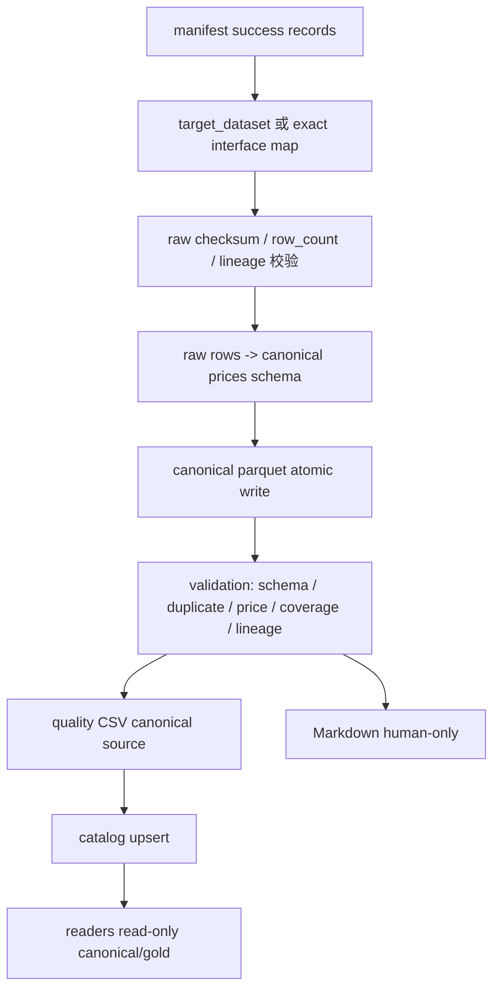

# LLD: STORY-016 - CR-004 canonical 标准化、质量校验与只读 reader

> 本文档仅用于 CP5 批次 B 的 LLD 人工确认。`confirmed=false` 且 `implementation_allowed=false` 时，禁止创建或修改本 LLD 第 4 / 11 节列出的代码与测试文件。
>
> 本 Story 消费 STORY-014 已验证的 contracts/lake layout/source registry，以及 STORY-015 已验证的 raw/manifest/runtime/storage 契约。STORY-016 只设计 canonical normalization、validation、catalog 和只读 reader；不设计或实现 CLI、多源 comparison、Data Loader、真实沪深 300 gold、实验十/十二接入或任何真实联网路径。

## 0. 修订记录

| 版本 | 日期 | 修订人 | 变更要点 |
|---|---|---|---|
| 1.1 | 2026-05-17 | meta-po | 回填 CP5 批次 B 人工确认结果：用户回复“通过”，允许按本 LLD 限定范围实现 STORY-016；保持禁止 CLI、多源 comparison、Data Loader、真实沪深 300 gold、实验接入和真实联网。 |
| 1.0 | 2026-05-17 | meta-dev | 基于 STORY-016、STORY-014/015 confirmed LLD、CP7 PASS 结果、HLD §21、ADR-009/011 和 CR-004 质量/Data Loader 补充约束起草 CP5 LLD；保持 `confirmed=false`、`implementation_allowed=false`。 |

## 1. Goal

从 STORY-015 产出的 raw JSONL 与 manifest JSONL 派生 `prices` canonical parquet，执行字段、重复键、异常价格、覆盖率、manifest 一致性等质量校验，输出 canonical CSV 质量报告与 human-only Markdown 报告，维护最小 catalog，并提供不触发 connector、不联网、不写数据湖的只读 reader。

本 Story 完成后，下游只应通过 canonical/gold parquet、quality CSV 和 catalog 读取数据状态。reader 不得导入 `market_data.connectors`、`market_data.runtime` 或真实 provider；缺口不得自动联网补数。Data Loader 的质量门禁和实验十/十二接入由后续 Story 消费本 Story 产物，但不在本 Story 实现。

## 2. Requirements（Functional / Non-Functional）

### 2.1 Functional

- 创建 `market_data/normalization.py`、`market_data/validation.py`、`market_data/catalog.py`、`market_data/readers.py` 和 `tests/test_market_data_normalization_validation_readers.py` 的实现设计。
- `normalization.py` 从 manifest terminal success 记录读取 raw，按显式 `target_dataset` 或 exact interface 映射派生 canonical `prices` parquet；禁止 contains、相似度、大小写猜测或自动推断 dataset。
- `validation.py` 对 canonical `prices` 执行 schema、重复 `(trade_date, symbol)`、负价格、coverage、manifest/raw lineage 一致性检查，并生成 `QualityResult`。
- quality 报告第一版固定输出 CSV 与 Markdown；CSV 是 canonical source，Markdown 仅为人类可读渲染，不得作为机器解析入口。
- quality CSV 必须同时输出 `fetch_status` 与 `dataset_status`，不得只输出泛化 `status`；必须输出 `denominator_mode`、显式 thresholds、coverage 字段和可复现字段。
- CSV 中复杂列表字段必须使用 JSON 字符串并以 `_json` 后缀命名。
- 第一版接受 non-PIT 股票池，但必须输出 `is_pit_universe=false`、`universe_mode`、`pit_status` 和 survivorship bias 风险披露；若未来声明 PIT 却缺少 `snapshot_date` 或 `available_at`，应由后续 Data Loader 拒绝，本 Story 只在 quality 输出中披露。
- `catalog.py` 维护最小 `catalog/catalog.json`，至少记录 dataset、schema_version、coverage、quality_status、latest_manifest_run_id、canonical_path、quality_csv_path 和 generated_at。
- `readers.py` 只读 canonical/gold parquet 与 catalog，按 dataset/date/symbol/columns filter 返回 DataFrame 或 typed result；不写 raw/manifest/canonical/quality/catalog。
- 必要共享扩展仅允许设计追加 `market_data/contracts.py` / `market_data/lake_layout.py` 的兼容常量或路径 helper；实现前必须经 CP5 确认。

### 2.2 Non-Functional

- 默认测试网络调用次数为 0；测试只使用 fake/offline raw、manifest 和 `tmp_path`。
- 不新增依赖；`pyproject.toml` 与 `uv.lock` 在本 Story 实现中不修改。若发现当前环境缺少 parquet 读写依赖，必须阻塞并回到计划，不得直接改依赖。
- 不修改 `engine/**`、`experiments/**`、`delivery/**`、真实 `data/**`、真实 `reports/**`、`market_data/connectors/**`。
- normalization/validation/readers 不导入真实 adapter；reader 额外不得导入 `market_data.connectors` 或 `market_data.runtime`。
- 所有写入测试产物必须落在 `tmp_path`；不得提交真实行情、凭据、token、缓存或 `__pycache__` / `*.pyc`。
- CP5 人工确认前不得实现代码；若实现阶段发现 STORY-014/015 契约无法消费，必须回到 LLD 修订而不是在代码中临时绕过。

## 3. 模块拆分与职责

| 模块 / 文件组 | 职责 | 说明 |
|---|---|---|
| `market_data/normalization.py` | 读取 manifest/raw，执行 dataset 显式映射、schema 规范化、lineage 继承、canonical parquet 原子写入 | 仅处理 `prices`；`index_members`、`trade_calendar` 只保留延期占位，不实现 normalizer |
| `market_data/validation.py` | 定义 quality thresholds、coverage summary、quality result、CSV/Markdown 报告生成和校验规则 | CSV 为机器事实源；Markdown 从 `QualityResult` 渲染 |
| `market_data/catalog.py` | 维护最小 catalog JSON 的 upsert/read/list | 不承担 quality 决策，只记录 validation 结果 |
| `market_data/readers.py` | 提供只读 canonical/gold reader | 不导入 connector/runtime，不写文件，不联网 |
| `tests/test_market_data_normalization_validation_readers.py` | 覆盖 normalization、schema fail、duplicate、negative price、coverage、quality 报告、reader 边界、catalog、缓存扫描 | 使用 `tmp_path` 和 fake raw/manifest |
| `market_data/contracts.py`（共享、可选） | 兼容追加 quality/report 字段常量、dataset/interface exact map、threshold 名称 | 只能追加常量，不改 STORY-014 已冻结字段语义 |
| `market_data/lake_layout.py`（共享、可选） | 兼容追加 canonical run path、quality report path、catalog path helper | 只能追加路径 helper，不改变现有路径返回 |

共享设计片段：本 Story 消费 ADR-009 的 reader 只读边界、ADR-011 的 canonical/manifest/quality/catalog 契约，消费 STORY-015 的 `run_id/source_run_id`、raw checksum、raw row count、manifest resume/terminal status 和 fake `adjustment_policy` / `available_at` 来源。

## 4. 代码结构与文件影响范围

| 动作 | 文件路径 | 变更内容 |
|---|---|---|
| 创建 | `market_data/normalization.py` | 定义 normalization 输入/输出、raw->dataset exact 映射、manifest/raw 校验、canonical parquet 写入 |
| 创建 | `market_data/validation.py` | 定义 thresholds、coverage、quality result、校验规则、CSV/Markdown 报告输出 |
| 创建 | `market_data/catalog.py` | 定义 `CatalogStore`、`CatalogEntry`、catalog JSON upsert/read/list |
| 创建 | `market_data/readers.py` | 定义只读 `read_canonical` / `read_dataset` / filter API |
| 创建 | `tests/test_market_data_normalization_validation_readers.py` | 覆盖第 10 节测试场景 |
| 可选追加 | `market_data/contracts.py` | 只追加兼容常量：quality CSV 字段、threshold 名称、dataset exact map、catalog 字段；不得改已有常量含义 |
| 可选追加 | `market_data/lake_layout.py` | 只追加兼容 helper：canonical run path、quality CSV/Markdown path、catalog path；不得改现有方法行为 |

明确不修改：`market_data/connectors/**`、`market_data/runtime.py`、`market_data/storage.py`、`market_data/config.py`、`market_data/source_registry.py`、`engine/**`、`experiments/**`、`strategies/**`、`notebooks/**`、`docs/**`、`delivery/**`、真实 `data/**`、真实 `reports/**`、`pyproject.toml`、`uv.lock`。

## 5. 数据模型与持久化设计

### 5.1 Canonical `prices` schema

| 字段 | 类型 | 必填 | 来源 | 说明 |
|---|---|---|---|---|
| `trade_date` | string/date | 是 | raw row | exact 交易日；第一版保留为可排序 `YYYY-MM-DD` 或 parquet date，测试固定断言 |
| `symbol` | string | 是 | raw row | 证券代码或 fake symbol；不得空 |
| `close` | float | 是 | raw row | 必须 `>= 0`；真实价格应 `> 0`，0 仅允许后续按规则解释，不由本 Story静默填充 |
| `source` | string | 是 | raw row / manifest | 必须与 manifest `source` 一致 |
| `source_run_id` | string | 是 | raw metadata / manifest `run_id` | 与同一 run 的 request/runtime/raw/manifest 共用血缘 |
| `adjustment_policy` | string | 是 | raw row / raw metadata / manifest params | fake 默认 `none`；缺失时 schema fail，不在 canonical 阶段猜测 |
| `available_at` | datetime/string | 是 | raw row / raw metadata | fake 按 STORY-015 规则为交易日 `16:00:00+08:00`；缺失时 schema fail |

Batch B 范围说明：本 Story 只实现 `prices` canonical。`index_members`、`trade_calendar` 在本 Story 保留 dataset 名称和 future normalizer 占位，不生成 canonical schema、不做 quality gate、不做 PIT universe 计算；相关完整契约与多源比对由 STORY-017 或后续 Story 单独确认。

### 5.2 Manifest 与 raw 消费规则

| 对象 / 字段 | 规则 |
|---|---|
| manifest status | normalization 默认只消费 terminal `success`；`partial_success` 默认不进入 canonical，除非未来 CP5 显式改变策略 |
| `run_id` | canonical `source_run_id`、quality `run_id`、catalog `latest_manifest_run_id` 均使用同一 manifest `run_id` |
| `raw_path` | 必须存在且位于传入 `lake_root` 下；缺失为 `ManifestLineageError` |
| `raw_checksum` / `raw_row_count` | normalization 前必须重算 raw checksum/row_count 并与 manifest 一致；不一致失败 |
| `canonical_path` | STORY-015 raw 阶段可为 `None`；本 Story 生成 canonical 后在 normalization summary 和 catalog 中记录，不修改历史 manifest 行 |
| `params.target_dataset` | 若存在，必须 exact 等于 `prices` 才进入 prices normalizer |
| `interface` exact map | 若无 `target_dataset`，仅允许 `prices.daily -> prices`；其他 interface fail fast |

raw 到 dataset 映射只允许以下两种入口：

| 入口 | 允许条件 | 禁止条件 |
|---|---|---|
| 显式 `target_dataset` | manifest params 或 normalization request 明确给出 `target_dataset="prices"` | target_dataset 缺失时不得通过字符串 contains 猜测 |
| exact interface map | `source_interface == "prices.daily"` 精确匹配到 `prices` | 不允许 `daily_prices`、`prices`、`price.daily`、大小写变体或相似度匹配 |

### 5.3 Canonical / quality / catalog 路径

| 产物 | 推荐路径 | 写入策略 |
|---|---|---|
| canonical parquet | `canonical/prices/1.0/run_id=<run_id>/part-<batch_id>.parquet` | 写 `<path>.tmp` 或临时 sibling 后原子替换；只在 `tmp_path` 测试写入 |
| quality CSV | `quality/<run_id>/prices_quality.csv` | CSV 为 canonical source；一次写完整文件后 replace |
| quality Markdown | `quality/<run_id>/prices_quality.md` | 从 `QualityResult` 渲染；human-only |
| catalog JSON | `catalog/catalog.json` | 读取旧 JSON、upsert entry、写临时文件后 replace |

若实现阶段当前 `LakeLayout` 缺少上述 helper，可在 `market_data/lake_layout.py` 追加兼容方法；不得改变 `manifest_path()`、`canonical_dataset_root()` 的既有行为。

### 5.4 Quality 数据模型

| 对象 / 字段 | 类型 | 必填 | 说明 |
|---|---|---|---|
| `QualityThresholds.prices_missing_rate_pass` | float | 是 | 显式默认常量；建议 `0.0` |
| `QualityThresholds.prices_missing_rate_warn` | float | 是 | 显式默认常量；建议 `0.02` |
| `QualityThresholds.prices_missing_rate_fail` | float | 是 | 显式默认常量；建议 `0.05` |
| `QualityThresholds.allow_negative_price` | bool | 是 | 默认 `false` |
| `QualityThresholds.max_duplicate_keys` | int | 是 | 默认 `0` |
| `QualityResult.quality_status` | str | 是 | `pass` / `warn` / `fail`；由 dataset 质量和阈值决定 |
| `QualityResult.fetch_status` | str | 是 | 反映 manifest/fetch 事实，如 `success`、`failed`、`partial_success` |
| `QualityResult.dataset_status` | str | 是 | 反映 canonical dataset 事实，仅允许 `pass`、`warn`、`fail` |
| `QualityResult.denominator_mode` | str | 是 | `open_trade_dates_in_requested_range_x_target_symbols` |
| `QualityResult.coverage` | object | 是 | 必含第 5.5 节字段 |
| `QualityResult.thresholds` | object | 是 | 输出到 `thresholds_json` |
| `QualityResult.issue_count` | int | 是 | 所有 fail/warn issue 数 |

阈值必须来自 `QualityThresholds` 或等价显式默认常量，禁止在校验逻辑中写隐藏魔法数。

### 5.5 Quality CSV 字段

CSV 至少包含以下字段，字段名为 snake_case；复杂字段以 `_json` 后缀并存储 JSON 字符串：

| 字段组 | 字段 |
|---|---|
| 标识 | `run_id`, `generated_at`, `dataset`, `source_name`, `source_interface`, `target_dataset`, `input_config_hash` |
| 状态 | `quality_status`, `fetch_status`, `dataset_status`, `issue_count` |
| coverage | `requested_start`, `requested_end`, `actual_start`, `actual_end`, `requested_symbols_count`, `actual_symbols_count`, `open_trade_dates_count`, `expected_rows`, `actual_rows`, `missing_rows`, `missing_rate`, `denominator_mode` |
| 阈值与问题 | `thresholds_json`, `missing_required_fields_json`, `duplicate_keys_json`, `negative_price_rows_json`, `coverage_gaps_json`, `manifest_inconsistencies_json`, `warnings_json` |
| PIT 披露 | `is_pit_universe`, `universe_mode`, `pit_status`, `survivorship_bias_note` |

non-PIT 默认披露：缺少 `is_pit_universe` 时必须输出 `is_pit_universe=false`、`universe_mode="non_pit_static"`、`pit_status="non_pit_disclosed"`，并在 `survivorship_bias_note` 说明可能把未上市、退市、停牌或非有效股票计入缺失分母。

## 6. API / Interface 设计

| 接口 / 入口 | 输入 | 输出 | 调用方 | 说明 |
|---|---|---|---|---|
| `map_raw_to_dataset(manifest_record, target_dataset=None, interface_map=None)` | manifest record、可选 explicit dataset、exact map | dataset 名称或 `DatasetMappingError` | normalization | 只允许 `target_dataset` 或 exact map；测试 `T016-NORM-MAP-01` |
| `normalize_run(manifest_path, lake_root, dataset="prices", run_id=None, thresholds=None)` | manifest、lake root、dataset、可选 run filter | `NormalizationResult` | CLI 后续、测试 | 本 Story 不实现 CLI；接口可被后续调用；测试 `T016-NORM-01` |
| `load_manifest_success_records(manifest_path, dataset)` | manifest path、dataset | terminal success records | normalization | 过滤 status、checksum/row_count、dataset exact map；测试 `T016-MANIFEST-01` |
| `validate_dataset(dataset, lake_root, expected_range, expected_symbols, thresholds, validation_context)` | dataset、范围、symbols、阈值、上下文 | `QualityResult` | validation、后续 Data Loader | 不联网、不补数；测试 `T016-VALID-*` |
| `write_quality_reports(result, layout)` | `QualityResult`、layout | CSV path、Markdown path | validation | CSV canonical，Markdown human-only；测试 `T016-QUALITY-CSV-01`, `T016-QUALITY-MD-01` |
| `CatalogStore(layout).upsert(entry)` | `CatalogEntry` | catalog path | validation | 原子写 JSON；测试 `T016-CATALOG-01` |
| `CatalogStore(layout).get(dataset)` | dataset | `CatalogEntry` 或结构化错误 | readers/CLI 后续 | exact dataset；测试 `T016-CATALOG-01` |
| `read_canonical(dataset, lake_root, start=None, end=None, symbols=None, columns=None, quality_policy=None)` | dataset、filter、列、可选 quality policy | DataFrame 或 typed read result | engine/Data Loader 后续、测试 | 只读 canonical/gold；不导入 connector/runtime；测试 `T016-READER-01` |

错误暴露策略：

- `DatasetMappingError`：缺少 `target_dataset` 且 interface 不在 exact map、dataset 不等于 `prices`、或传入大小写/相似名称时触发。
- `CanonicalSchemaError`：必需字段缺失、字段不可转换、`adjustment_policy` / `available_at` 缺失时触发。
- `ManifestLineageError`：manifest 指向 raw 缺失、checksum/row_count 不一致、`run_id/source_run_id` 不一致、source/interface 不一致时触发。
- `QualityValidationError`：重复键、负价格、coverage 超阈值、manifest 不一致等导致 `quality_status=fail` 时可携带结构化详情；报告仍应可输出。
- `QualityReportError`：CSV/Markdown 写入失败、复杂字段未以 `_json` 后缀、必需报告字段缺失时触发。
- `CatalogError`：catalog JSON 损坏、dataset 重复冲突、原子写失败时触发。
- `ReaderBoundaryError`：reader 尝试导入 connector/runtime、请求未知 dataset、读取路径缺失或 filter 非 exact 时触发。

第 10 节为本节每个接口提供对应测试入口。

## 7. 核心处理流程

1. 调用方传入 `lake_root`、manifest path、目标 dataset 和 validation context；本 Story 不从 CLI 解析参数。
2. normalization 读取 manifest JSONL，仅选择 terminal `success` 记录；`partial_success`、`failed`、`skipped`、`circuit_open`、`orphan_raw` 不进入 canonical。
3. 对每条 manifest 记录执行 raw->dataset 映射：优先 explicit `target_dataset`，否则 exact `interface == "prices.daily"`；无法映射则 fail fast。
4. 对 raw 文件执行存在性、checksum、row_count 校验；不一致抛 `ManifestLineageError`。
5. 读取 raw JSONL，剥离 `_metadata` 行，校验并映射 `trade_date`、`symbol`、`close`、`source`、`source_run_id`、`adjustment_policy`、`available_at`。
6. 校验 `source_run_id == manifest.run_id`；若 raw row 缺 `source_run_id`，允许从 raw metadata/manifest `run_id` 补齐并在 normalization summary 记录 `lineage_filled_from_manifest=true`，但不得补 `adjustment_policy` 或 `available_at`。
7. 写 canonical parquet 到临时路径，再原子替换为 `canonical/prices/1.0/run_id=<run_id>/part-<batch_id>.parquet`；不更新历史 manifest 行。
8. validation 读取 canonical parquet，执行 schema、重复键、负价格、coverage、manifest lineage 一致性检查。
9. coverage 使用 `open_trade_dates_in_requested_range * target_symbols` 作为 `prices` 主分母，输出 `denominator_mode` 和第 5.5 节完整字段。
10. validation 依据显式 thresholds 计算 `quality_status`，同时独立输出 `fetch_status` 与 `dataset_status`；fetch 失败但本地 parquet 合规可按约束输出 warn/pass，但不能隐藏 fetch 事实。
11. 写 quality CSV 与 Markdown；CSV 是后续机器入口，Markdown 仅从同一 `QualityResult` 渲染给人工审查。
12. catalog upsert 最新 dataset entry，记录 canonical path、quality CSV path、coverage、quality status、latest manifest run_id。
13. reader 只读 catalog/canonical/gold，根据 exact dataset、date、symbols、columns 过滤返回；缺数据抛结构化错误，不调用 connector/runtime 补数。



异常路径：

- manifest 为空或无 success：normalization 不生成 canonical，返回 fail result 或抛 `ManifestLineageError`。
- `partial_success`：默认跳过并在 quality/normalization summary 记录为 fetch coverage 风险，不作为 canonical 输入。
- raw checksum/row_count 不一致：停止处理该 run，不写 canonical。
- canonical schema 缺字段：validation fail，quality CSV 仍记录 `missing_required_fields_json`。
- duplicate key 或负价格：validation fail，输出 `duplicate_keys_json` / `negative_price_rows_json`。
- coverage 超阈值：按 thresholds 输出 warn/fail，不自动补数据。
- Markdown 写入失败但 CSV 写入成功：机器入口仍以 CSV 为准，但返回 `QualityReportError` 或 warn，人工报告不可用。
- reader 找不到 quality report：本 Story reader 不执行 Data Loader fallback；后续 Data Loader 的 exploratory fallback 另行实现。

## 8. 技术设计细节

- 数据结构形态：`NormalizationResult`、`QualityThresholds`、`CoverageSummary`、`QualityResult`、`CatalogEntry`、`ReadRequest` 使用 `@dataclass(frozen=True, slots=True)` 或轻量 TypedDict；不引入 pydantic。
- parquet 写入：优先使用项目既有 pandas/pyarrow 环境；若实现阶段缺失，进入 blocked，不修改 `pyproject.toml` / `uv.lock`。
- manifest 读取：复用 STORY-015 JSONL 事实源；manifest 损坏行应触发结构化错误，不静默跳过。
- `input_config_hash`：由 validation input 中的 dataset、requested range、symbols、thresholds、denominator_mode、target_dataset、source/interface 等脱敏 canonical JSON 计算 SHA-256。
- `generated_at`：测试可注入 clock；不直接依赖当前时间导致测试不稳定。
- `open_trade_dates_count`：第一版可由 validation context 显式传入 open trade dates；若未传入，允许以 requested date range 中的业务日/测试日历计算，但必须在 `denominator_mode` 或 `warnings_json` 披露来源，不允许隐藏假设。
- `fetch_status` 与 `dataset_status`：fetch 事实来自 manifest terminal status；dataset status 来自 canonical schema/coverage/quality 检查。二者独立计算，最终 `quality_status` 不等同于 fetch status。
- non-PIT 披露：第一版不计算 PIT universe，不连接真实指数成分；缺 universe metadata 时强制 non-PIT 披露并可给 `quality_status=warn`，具体取决于 thresholds/policy。
- Markdown human-only：Markdown 不包含机器唯一字段；所有结构化字段必须先进入 CSV/`QualityResult`，Markdown 只是渲染摘要。
- reader 边界：`readers.py` 可导入 `contracts`、`lake_layout`、`catalog` 和 pandas/pyarrow；不得导入 `connectors`、`runtime`、`storage`、真实 source adapter 或网络库。
- 原子写：canonical、quality CSV、quality Markdown、catalog 均使用临时文件后 replace；失败时不得留下被 catalog 指向的不完整文件。

## 9. 安全与性能设计

| 维度 | 设计措施 | 验证方式 |
|---|---|---|
| 安全 | reader 不导入 connector/runtime，不触发网络，不因缺口自动补数 | `T016-READER-BOUNDARY-01` + 静态扫描 |
| 安全 | quality report、catalog、manifest 不写凭据值；只允许 source/interface/env var 名等安全字段 | `T016-SECURITY-01` |
| 安全 | 测试只写 `tmp_path`，不得写真实 `data/**`、`reports/**`、`delivery/**` | `T016-WRITE-BOUNDARY-01` |
| 可复现 | 注入 clock；`input_config_hash` 稳定；CSV 含 run/source/interface/target dataset | `T016-QUALITY-CSV-01` |
| 可移植 | 不修改 `engine/**`、`experiments/**`、`delivery/**`；不新增依赖 | 静态扫描 + CP6 检查 |
| 性能 | reader 按 date/symbol/columns 过滤读取，避免默认加载无关列 | `T016-READER-01` 小样本断言 |
| 稳定 | thresholds 显式常量，测试不依赖隐藏魔法数 | `T016-THRESHOLDS-01` |
| 仓库卫生 | 缓存文件禁入库，测试后扫描 `__pycache__`、`*.pyc`、`.ipynb_checkpoints` | `T016-CACHE-01` |

## 10. 测试设计

本节是 CP5 通过后的测试设计；本 LLD 起草阶段不运行测试。

| 测试场景 | 前置条件 | 操作 | 预期结果 | 验证方式 |
|---|---|---|---|---|
| `T016-NORM-01` fake raw 生成 canonical | `tmp_path` 中有 STORY-015 格式 raw/manifest success | 调用 `normalize_run(..., dataset="prices")` | 生成 canonical parquet，字段包含 `trade_date,symbol,close,source,source_run_id,adjustment_policy,available_at` | pytest + pandas/pyarrow |
| `T016-NORM-MAP-01` exact dataset 映射 | manifest 分别含 `target_dataset="prices"`、`interface="prices.daily"`、未知 interface | 调用 `map_raw_to_dataset` | 前两者映射到 `prices`；未知/大小写/contains 失败 | pytest |
| `T016-LINEAGE-01` run_id/source_run_id 血缘闭环 | raw row/source metadata 与 manifest run_id 一致 | normalize + validate | canonical `source_run_id`、quality `run_id`、catalog latest run 一致 | pytest |
| `T016-MANIFEST-01` checksum/row_count 校验 | manifest 指向 raw，另建 checksum 不匹配样例 | normalize | 不匹配触发 `ManifestLineageError`，不写 canonical | pytest |
| `T016-SCHEMA-FAIL-01` 必需字段缺失 | raw 缺 `close` 或 `available_at` | normalize/validate | schema fail，报告 `missing_required_fields_json` | pytest |
| `T016-DUPLICATE-01` 重复键 | canonical 含重复 `(trade_date, symbol)` | validate | `quality_status=fail`，`duplicate_keys_json` 非空 | pytest |
| `T016-NEGATIVE-PRICE-01` 负价格 | canonical `close < 0` | validate | `quality_status=fail`，`negative_price_rows_json` 非空 | pytest |
| `T016-COVERAGE-01` coverage 分母 | requested range、symbols、open trade dates 明确 | validate | 输出完整 coverage 字段，`denominator_mode=open_trade_dates_in_requested_range_x_target_symbols` | pytest |
| `T016-THRESHOLDS-01` 显式 thresholds | 使用默认和自定义 `QualityThresholds` | validate | 缺失率按显式阈值判定 pass/warn/fail，`thresholds_json` 可追溯 | pytest |
| `T016-QUALITY-CSV-01` CSV canonical source | validate 后写报告 | 读取 CSV | 必含 fetch_status/dataset_status、coverage、thresholds、可复现字段；复杂字段以 `_json` 后缀且可 JSON 解析 | pytest |
| `T016-QUALITY-MD-01` Markdown human-only | validate 后写报告 | 读取 Markdown | Markdown 由同一 `QualityResult` 渲染；测试不以 Markdown 作为机器事实源 | pytest |
| `T016-NONPIT-01` non-PIT 披露 | validation context 缺 PIT metadata | validate | 输出 `is_pit_universe=false`、`universe_mode`、`pit_status`、survivorship bias note | pytest |
| `T016-CATALOG-01` catalog upsert/read | quality pass/warn/fail 各一条小样本 | `CatalogStore.upsert/get` | catalog JSON 记录 dataset/schema/coverage/quality/latest run/path，exact get 生效 | pytest |
| `T016-READER-01` reader 只读过滤 | canonical parquet + catalog 存在 | `read_canonical("prices", start, end, symbols, columns)` | 返回过滤后数据；不写任何文件 | pytest |
| `T016-READER-BOUNDARY-01` reader 不导入 connector/runtime | monkeypatch 或静态扫描 | import/readers | `market_data.readers` 不导入 connectors/runtime/storage，不调用 socket/requests | pytest + `rg` |
| `T016-WRITE-BOUNDARY-01` 写入边界 | 测试完成后 | 扫描真实 `data/reports/delivery` | 无本 Story 新增真实数据或报告 | `find` / pytest 辅助断言 |
| `T016-CACHE-01` 缓存禁入库 | 测试完成后 | 扫描 `market_data tests` | 无 `__pycache__`、`*.pyc`、`.ipynb_checkpoints` 交付项 | `find` 命令 + CP6 记录 |

建议执行命令（实现完成后由 CP6 使用，LLD 阶段不运行）：

```bash
uv run --python 3.11 pytest -q tests/test_market_data_normalization_validation_readers.py
rg -n "from market_data\\.connectors|import market_data\\.connectors|from market_data\\.runtime|import market_data\\.runtime" market_data/readers.py
find market_data tests -path '*/__pycache__' -o -name '*.pyc' -o -path '*/.ipynb_checkpoints/*'
```

## 11. 实施步骤

| TASK-ID | 动作 | 目标文件 | 详细描述 | 对应测试 |
|---|---|---|---|---|
| S016-T1 | 创建 | `market_data/normalization.py` | 定义 normalization 数据结构、manifest success 过滤、raw->dataset exact 映射、raw checksum/row_count 校验、canonical prices parquet 原子写入 | `T016-NORM-01`, `T016-NORM-MAP-01`, `T016-LINEAGE-01`, `T016-MANIFEST-01` |
| S016-T2 | 创建 | `market_data/validation.py` | 定义 thresholds、coverage、quality result、schema/duplicate/price/coverage/manifest 校验、quality CSV/Markdown 写入 | `T016-SCHEMA-FAIL-01`, `T016-DUPLICATE-01`, `T016-NEGATIVE-PRICE-01`, `T016-COVERAGE-01`, `T016-THRESHOLDS-01`, `T016-QUALITY-CSV-01`, `T016-QUALITY-MD-01`, `T016-NONPIT-01` |
| S016-T3 | 创建 | `market_data/catalog.py` | 实现最小 catalog JSON entry、upsert/read/list、原子写入和损坏 JSON fail fast | `T016-CATALOG-01` |
| S016-T4 | 创建 | `market_data/readers.py` | 实现只读 canonical/gold reader、date/symbol/columns filter、缺失路径结构化错误和 import 边界 | `T016-READER-01`, `T016-READER-BOUNDARY-01` |
| S016-T5 | 创建 | `tests/test_market_data_normalization_validation_readers.py` | 构造 fake raw/manifest/parquet fixture，覆盖 normalization/validation/report/catalog/reader/边界/缓存扫描 | 第 10 节全部测试 |
| S016-T6 | 可选追加 | `market_data/contracts.py`, `market_data/lake_layout.py` | 仅在实现需要时追加兼容常量或路径 helper；不得改变既有 STORY-014/015 行为 | `T016-QUALITY-CSV-01`, `T016-CATALOG-01` |

文件影响范围与 TASK-ID 对应关系：

| 文件影响项 | 覆盖 TASK-ID |
|---|---|
| `market_data/normalization.py` | S016-T1 |
| `market_data/validation.py` | S016-T2 |
| `market_data/catalog.py` | S016-T3 |
| `market_data/readers.py` | S016-T4 |
| `tests/test_market_data_normalization_validation_readers.py` | S016-T5 |
| `market_data/contracts.py`（可选共享追加） | S016-T6 |
| `market_data/lake_layout.py`（可选共享追加） | S016-T6 |

实现顺序必须按 TASK-ID 串行推进。若 S016-T6 被证明必要，先确保追加内容为兼容常量/helper，并在 CP6 明确列出偏差与测试证据。

## 12. 风险、难点与开放问题

| 类型 | 状态 | 风险 / 难点 | 影响 | 应对 |
|---|---|---|---|---|
| 范围风险 | 已收敛 | 多源 comparison、CLI、Data Loader、实验接入容易与 validation 混入同一批实现 | 扩大回归面并违反 Story 边界 | 本 LLD 明确延期到 STORY-017/后续；第 4 节禁止修改相关文件 |
| 数据风险 | 已收敛 | non-PIT 股票池可能导致 survivorship bias 和分母误读 | quality 结果可能被后续使用方误当 PIT | 强制输出 non-PIT 披露字段；后续 Data Loader 再执行拒绝/放行策略 |
| 契约风险 | 已收敛 | raw->dataset 若使用模糊匹配会把未知接口错误归类 | 质量报告不可诊断 | 只允许 `target_dataset` 或 exact interface map，测试覆盖失败路径 |
| 可复现风险 | 已收敛 | `generated_at`、open trade dates、thresholds 若隐式生成会导致测试不稳定 | QA 难以复现 | 注入 clock；thresholds 显式；coverage 来源进入报告 |
| 依赖风险 | 已收敛 | parquet 读写依赖若环境不可用 | 实现无法通过测试 | 不修改依赖；进入 blocked 并交由 meta-po 决策 |
| 开放问题 | 无阻塞 OPEN | 真实沪深 300 gold、PIT universe、Data Loader quality_policy、真实多源比对 | 不阻塞 STORY-016 LLD/实现 | 分别由 STORY-017、STORY-018、STORY-003/004 或后续 CR 处理 |

## 13. 回滚与发布策略

- 发布门控：CP5 人工确认前不实现；CP6 编码完成前不得交给 CP7；CP7 前不推进 Story `verified`。
- 回滚策略：若实现失败，删除或回退本 Story 新增的 `normalization.py`、`validation.py`、`catalog.py`、`readers.py` 和对应测试；若曾追加 `contracts.py` / `lake_layout.py`，只回退 S016-T6 追加的兼容常量/helper，不改 STORY-014/015 已验证契约。
- 数据回滚：测试数据仅位于 `tmp_path`，不需要清理真实 lake；若误写真实 `data/**`、`reports/**`、`delivery/**`，必须停止并上报，不得自行把真实文件纳入交付。
- 兼容策略：reader API 第一版为后续 Data Loader/实验接入预留，但不承诺 CLI 参数或 Data Loader policy；后续 Story 必须通过新 LLD 消费。
- 回滚验证：执行聚焦测试、静态 import 边界扫描、真实数据写入扫描和缓存扫描，确认仓库不含本 Story 残留缓存或真实数据。

## 14. Definition of Done / 确认清单

### 14.1 CP5 LLD 确认清单

- [x] LLD frontmatter 已回填 `confirmed=true`、`implementation_allowed=true`、`dev_gate=cp5_approved`。
- [ ] 14 个可见章节与人工确认区完整，`tier`、`shared_fragments`、`open_items`、`change_id`、`cp5_batch` 均存在。
- [ ] 第 4 / 11 节文件范围仅覆盖 STORY-016 允许文件，且共享修改只允许兼容追加 `contracts.py` / `lake_layout.py`。
- [ ] 质量/Data Loader 补充约束已完整消费：CSV canonical、Markdown human-only、`_json` 字段、exact mapping、双状态、denominator、thresholds、coverage、可复现字段、non-PIT 披露。
- [ ] Batch A/本 Story 边界清晰：不做 CLI、多源比对、Data Loader、真实沪深 300 gold、实验十/十二接入。

### 14.2 CP6 编码完成检查清单（实现后使用）

- [ ] canonical `prices` parquet 至少包含 `trade_date,symbol,close,source,source_run_id,adjustment_policy,available_at`，且 `source_run_id` 追溯 manifest `run_id`。
- [ ] validation 至少覆盖字段缺失、重复键、负价格、coverage、manifest 一致性。
- [ ] quality CSV 包含第 5.5 节全部字段；Markdown 仅作为 human-only 渲染。
- [ ] raw->dataset 只使用 `target_dataset` 或 exact interface map；失败路径可诊断。
- [ ] catalog 至少记录 dataset、schema_version、coverage、quality_status、latest_manifest_run_id、canonical_path、quality_csv_path。
- [ ] reader 网络调用次数为 0，静态上不导入 connector/runtime/storage，不写数据湖。
- [ ] 测试使用 `uv run --python 3.11 pytest -q tests/test_market_data_normalization_validation_readers.py`，并记录输出。
- [ ] CP6 包含缓存禁入库扫描结果：无 `__pycache__/`、`*.pyc`、`.ipynb_checkpoints/` 交付项。
- [ ] 未修改禁止路径：`engine/**`、`experiments/**`、`delivery/**`、真实 `data/**`、真实 `reports/**`、`pyproject.toml`、`uv.lock`。

## 人工确认区

> 由 meta-po 在 CP5 批次 B 人工审查时回填；meta-dev 不得自行确认。

| 项目 | 结果 |
|---|---|
| CP5 审查结论 | approved |
| 人工确认人 | user |
| 确认时间 | 2026-05-17T13:57:01+08:00 |
| 是否允许实现 | 是，仅限本 LLD 第 4 / 11 节限定范围 |
| 附加约束 | 不覆盖 CLI、多源 comparison、Data Loader、真实沪深 300 gold、实验十/十二接入或真实联网 |
