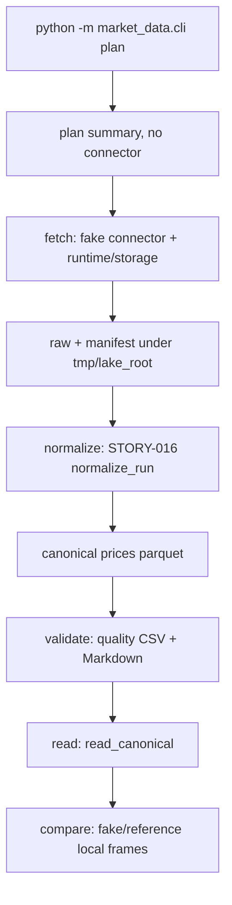

# LLD: STORY-017 - CR-004 CLI offline 闭环与多源比对接口

> 本文档已通过 CP5 批次 C 人工确认。`confirmed=true` 且 `implementation_allowed=true` 时，允许在本 LLD 第 4 / 11 节限定范围内实现代码与测试文件。
>
> STORY-017 消费 STORY-014..016 已验证能力，把 fake/offline 数据湖操作串成可执行 CLI smoke，并冻结 fake/reference comparison 输出接口。本 Story 不实现真实联网抓取、真实多源比对、Data Loader、真实沪深 300 gold、实验十/十二接入或安装交付脚本。

## 0. 修订记录

| 版本 | 日期 | 修订人 | 变更要点 |
|---|---|---|---|
| 1.0 | 2026-05-17 | meta-dev | 基于 STORY-017、STORY-014/015/016 confirmed LLD、STORY-016 CP7 PASS、HLD §21、ADR-010/012 和 CR-004 质量/Data Loader 补充约束起草 CP5 LLD；保持 `confirmed=false`、`implementation_allowed=false`。 |

## 1. Goal

提供 `market_data` 的 offline CLI 闭环和 fake/reference comparison 接口，使用户能在无网络、无凭据、无真实行情的默认路径下，通过 `python -m market_data.cli` 完成 `plan -> fetch -> normalize -> validate -> read -> compare` 的最小 smoke。

本 Story 的关键产出是可迁移命令入口和 comparison 结构化输出契约。CLI 只串联 STORY-014..016 已验证的 fake connector、runtime/storage、normalization、validation、quality report、catalog 和 reader；comparison 只比较本地 canonical/reference DataFrame 或临时 fixture。真实 TickFlow/AkShare/Tushare 多源联网比对、Data Loader 质量放行策略、真实沪深 300 gold 和实验十/十二接入均后置。

## 2. Requirements（Functional / Non-Functional）

### 2.1 Functional

- 创建 `market_data/cli.py`、`market_data/comparison.py` 和 `tests/test_market_data_cli_comparison.py` 的实现设计。
- CLI 子命令至少覆盖 `plan`、`fetch`、`normalize`、`validate`、`read`、`compare`，并可在 `tmp_path` lake root 下完成 offline smoke。
- CLI 默认 `source=fake`、`offline=true`；`plan` 不调用 connector；`fetch` 默认只使用 fake connector 与 STORY-015 runtime/storage。
- 指定 `akshare`、`tushare`、`tickflow` 等真实 source 且未显式启用时必须 fail fast，并输出结构化错误；默认测试不得真实联网。
- `normalize` 只调用 STORY-016 `normalize_run(...)`，继续遵守 raw 到 dataset 的 explicit `target_dataset` 或 exact interface 映射规则。
- `validate` 只调用 STORY-016 `validate_dataset(...)` / `write_quality_reports(...)`，质量报告必须保留 CSV canonical source、Markdown human-only、`fetch_status`、`dataset_status`、coverage、thresholds、denominator 和可复现字段。
- `read` 只调用 STORY-016 `read_canonical(...)`，不导入 connector/runtime，不写数据湖，不联网。
- `compare` 默认只使用 fake/reference fixture、本地 CSV 或本地 parquet，不调用真实 source；输出字段至少包含 `dataset`、`key`、`field`、`left_source`、`right_source`、`left_value`、`right_value`、`diff`、`tolerance`、`status`。
- 首版 CLI 主入口采用 `python -m market_data.cli`；不设计 console script，不修改 `pyproject.toml` / `uv.lock`。

### 2.2 Non-Functional

- 默认 CLI smoke 网络调用次数为 0，不需要 token、API key、cookie、session 或真实行情。
- 测试只使用 `tmp_path` lake root、临时 CSV/parquet fixture 和 fake/reference 数据；不得写真实 `data/**`、真实 `reports/**` 或 `delivery/**`。
- 不修改 `engine/**`、`experiments/**`、`strategies/**`、`notebooks/**`、`docs/**`、`delivery/**`、`market_data/connectors/**`、`market_data/runtime.py`、`market_data/storage.py`、`market_data/normalization.py`、`market_data/validation.py`、`market_data/readers.py`、`market_data/catalog.py`、`pyproject.toml`、`uv.lock`。
- CLI 输出必须可测试：默认 JSON 摘要或退出码可断言；错误消息不得包含凭据值。
- CP5 人工确认前不得实现代码；若实现阶段发现需要 console script 或新增依赖，必须回到 LLD/CP5 修改，不得直接改 `pyproject.toml` / `uv.lock`。

## 3. 模块拆分与职责

| 模块 / 文件组 | 职责 | 说明 |
|---|---|---|
| `market_data/cli.py` | 提供 `python -m market_data.cli` 入口、argparse 子命令、离线计划、fake fetch、normalize、validate、read、compare 编排 | 只串联已有模块；不承担业务 schema 再定义 |
| `market_data/comparison.py` | 定义 comparison 输入、行级差异算法、tolerance 判定、结构化输出 | 默认 fake/reference，本地 DataFrame/CSV/parquet；不调用 connector |
| `tests/test_market_data_cli_comparison.py` | 覆盖 CLI offline smoke、真实 source fail-fast、无网络、tmp_path 写入、quality report shape、comparison tolerance、缓存扫描 | 使用 `uv run --python 3.11 pytest -q`；不写真实数据 |

共享设计片段：本 LLD 消费 STORY-014 的 source registry/offline config，STORY-015 的 runtime/raw/manifest/fail-fast adapter，STORY-016 的 normalization/validation/catalog/reader/quality CSV 契约，以及 ADR-010/012 的默认离线和真实多源后置策略。

## 4. 代码结构与文件影响范围

| 动作 | 文件路径 | 变更内容 |
|---|---|---|
| 创建 | `market_data/cli.py` | 定义 `main(argv=None)`、子命令 parser、offline plan/fetch/normalize/validate/read/compare handlers、退出码和 JSON 摘要 |
| 创建 | `market_data/comparison.py` | 定义 comparison dataclass/函数、key 序列化、字段差异、tolerance/status 判定、本地文件加载 helper |
| 创建 | `tests/test_market_data_cli_comparison.py` | 覆盖第 10 节测试场景 |

明确不修改：`pyproject.toml`、`uv.lock`。本 Story 首选 `uv run --python 3.11 python -m market_data.cli ...`，不新增 console script。若 CP5 审查要求 console script，必须新增 LLD 修订并说明 `pyproject.toml` / `uv.lock` 的修改和回滚方式。

明确不修改：`engine/**`、`experiments/**`、`strategies/**`、`notebooks/**`、`docs/**`、`delivery/**`、真实 `data/**`、真实 `reports/**`、`market_data/connectors/**`、`market_data/runtime.py`、`market_data/storage.py`、`market_data/normalization.py`、`market_data/validation.py`、`market_data/readers.py`、`market_data/catalog.py`。

## 5. 数据模型与持久化设计

### 5.1 CLI 参数与摘要对象

| 对象 / 字段 | 类型 | 约束 | 说明 |
|---|---|---|---|
| `CliContext.lake_root` | `Path` | 默认 `data/market_data`，测试传入 `tmp_path` | 所有写入通过现有 layout/runtime/validation 完成 |
| `CliContext.offline` | `bool` | 默认 `true` | 默认路径不联网 |
| `CliContext.enable_real_source` | `bool` | 默认 `false` | 真实 source 必须显式启用；本 Story 仍不保证真实联网成功 |
| `CliContext.output_format` | `str` | 默认 `json` | stdout 摘要可机器断言 |
| `PlanSummary` | dict | 不写文件、不调用 connector | 包含 dataset/source/interface/symbols/date_range/batch_count/offline |
| `FetchSummary` | dict | 来自 STORY-015 `BatchExecutionResult` | 包含 status、run_id、batch_id、manifest_path、raw_paths、attempts |
| `NormalizeSummary` | dict | 来自 STORY-016 `NormalizationResult` | 包含 dataset、run_id、canonical_paths、row_count、skipped_status_counts |
| `ValidateSummary` | dict | 来自 STORY-016 `QualityResult` + report paths | 必含 quality/fetch/dataset status、CSV/Markdown path、coverage、thresholds |
| `ReadSummary` | dict | 来自 reader DataFrame | 包含 dataset、row_count、columns、sample rows；不写文件 |
| `CompareSummary` | dict | 来自 comparison result | 包含 row_count、status_counts、comparison_rows 或输出路径 |

CLI stdout 摘要不替代 quality CSV。涉及质量报告时，CSV 仍是 canonical source，Markdown 仅 human-only。

### 5.2 子命令参数

| 子命令 | 必需 / 默认参数 | 输出 | 写入 |
|---|---|---|---|
| `plan` | `--dataset prices`、`--source fake`、`--interface prices.daily`、`--symbols`、`--start-date`、`--end-date` | JSON plan summary | 无 |
| `fetch` | plan 同款参数、`--run-id` 可选、`--batch-id` 可选 | JSON fetch summary | raw + manifest，仅在 `--lake-root` 下 |
| `normalize` | `--lake-root`、`--dataset prices`、`--run-id` 可选 | JSON normalize summary | canonical parquet，仅在 `--lake-root` 下 |
| `validate` | `--lake-root`、`--dataset prices`、`--symbols`、`--start-date`、`--end-date`、`--open-trade-dates` 可选、threshold 参数可选 | JSON validate summary；quality CSV/Markdown paths | quality CSV + Markdown，仅在 `--lake-root` 下 |
| `read` | `--lake-root`、`--dataset prices`、`--start-date`、`--end-date`、`--symbols`、`--columns` 可选 | JSON read summary + sample rows | 无 |
| `compare` | `--dataset prices`、`--left-path` 或 canonical discovery、`--right-path` 或 `--reference-fixture fake`、`--keys trade_date,symbol`、`--fields close`、`--tolerance` | JSON compare summary；可选 CSV path | 可选 comparison CSV，仅在显式 `--output` 且测试 tmp_path 下 |

### 5.3 Quality report 形态

`validate` 输出/消费质量报告时必须保留 STORY-016 字段，不得裁剪或重命名：

| 字段组 | 字段 |
|---|---|
| 状态 | `quality_status`, `fetch_status`, `dataset_status`, `issue_count` |
| coverage | `requested_start`, `requested_end`, `actual_start`, `actual_end`, `requested_symbols_count`, `actual_symbols_count`, `open_trade_dates_count`, `expected_rows`, `actual_rows`, `missing_rows`, `missing_rate`, `denominator_mode` |
| 阈值与问题 | `thresholds_json`, `missing_required_fields_json`, `duplicate_keys_json`, `negative_price_rows_json`, `coverage_gaps_json`, `manifest_inconsistencies_json`, `warnings_json` |
| 可复现 | `run_id`, `generated_at`, `source_name`, `source_interface`, `target_dataset`, `input_config_hash` |
| non-PIT | `is_pit_universe`, `universe_mode`, `pit_status`, `survivorship_bias_note` |

CLI `validate` 可以在 stdout 摘要中列出上述字段子集，但 CSV 文件必须完整保存。CLI `read` 不实现 Data Loader 质量放行，不因 quality fail 自动修复或补数。

### 5.4 Comparison 数据模型

| 字段 | 类型 | 必填 | 说明 |
|---|---|---|---|
| `dataset` | str | 是 | 第一版仅 `prices` |
| `key` | str | 是 | 由 `keys` exact 序列化，如 `trade_date=2026-01-02|symbol=000001.SZ` |
| `field` | str | 是 | 对比字段，如 `close` |
| `left_source` / `right_source` | str | 是 | 默认 `fake` / `reference`，也可来自输入列 |
| `left_value` / `right_value` | JSON scalar | 是 | 缺失时为 `null` |
| `diff` | float 或 null | 是 | 数值字段为 `left - right` 的绝对差或 signed diff，需在实现中固定；非数值 exact 比较时可为 null |
| `tolerance` | float | 是 | 默认 `0.0`，每字段统一 tolerance |
| `status` | str | 是 | `match`、`mismatch`、`missing_left`、`missing_right`、`non_numeric_mismatch` |

comparison 输出可为 list[dict]、DataFrame 或 CSV，但测试必须断言字段全集、tolerance 边界和缺失键状态。

## 6. API / Interface 设计

| 接口 / 入口 | 输入 | 输出 | 调用方 | 说明 |
|---|---|---|---|---|
| `main(argv=None)` | CLI argv | exit code | `python -m market_data.cli`、测试 | 顶层入口，不在 import 时执行 |
| `build_parser()` | 无 | `argparse.ArgumentParser` | `main`、测试 | 定义 plan/fetch/normalize/validate/read/compare |
| `cmd_plan(args)` | CLI args | `PlanSummary` | `main` | 不调用 connector/runtime；测试 `T017-PLAN-01` |
| `cmd_fetch(args)` | CLI args | `FetchSummary` | `main` | 默认 fake；真实 source 未启用 fail fast；测试 `T017-FETCH-01`, `T017-REAL-FAILFAST-01` |
| `cmd_normalize(args)` | CLI args | `NormalizeSummary` | `main` | 调用 STORY-016 `normalize_run`；测试 `T017-NORMALIZE-01` |
| `cmd_validate(args)` | CLI args | `ValidateSummary` | `main` | 调用 `validate_dataset` / `write_quality_reports`；测试 `T017-VALIDATE-01` |
| `cmd_read(args)` | CLI args | `ReadSummary` | `main` | 调用 `read_canonical`；不写文件；测试 `T017-READ-01` |
| `cmd_compare(args)` | CLI args | `CompareSummary` | `main` | 调用 `compare_sources`；默认 fake/reference fixture；测试 `T017-COMPARE-01` |
| `compare_sources(left, right, dataset, keys, fields, tolerance, left_source="fake", right_source="reference")` | DataFrame/records、keys、fields、tolerance | list[ComparisonRow] | CLI、测试、后续 QA | 不调用 connector；测试 `T017-COMPARE-02` |
| `load_comparison_frame(path)` | CSV/parquet path | DataFrame | comparison CLI | 只读本地文件；测试 `T017-COMPARE-FILE-01` |

错误暴露策略：

- `CliUsageError`：缺少必要参数、日期区间无效、symbols 为空、未知 dataset/source/interface，退出码 `2`。
- `RealSourceDisabledError`：真实 source 未带 `--enable-real-source` 或启用条件不足，退出码 `2`；消息包含 source/interface/error_type，不包含凭据值。
- `CliExecutionError`：runtime/normalization/validation/reader/comparison 执行失败，退出码 `3`；保留结构化 error_type。
- `ComparisonInputError`：keys/fields 缺列、重复 key、无法读取本地 reference，退出码 `3`。
- `QualityReportShapeError`：CLI validate 产出的 CSV 缺少第 5.3 节必需字段或 `_json` 字段不可解析，退出码 `3`。

第 10 节为本节每个接口提供对应测试入口。

## 7. 核心处理流程

1. 用户或测试通过 `uv run --python 3.11 python -m market_data.cli <subcommand> ...` 调用 CLI；模块 import 阶段不解析参数、不联网、不写文件。
2. `plan` 解析 dataset/source/interface/symbols/date range，输出计划 JSON；不实例化 connector，不调用 runtime。
3. `fetch` 默认构造 fake `ConnectorRequest`，调用 STORY-015 `execute_batches`，写 raw + manifest 到 `--lake-root`；真实 source 未显式启用时在 runtime 前 fail fast。
4. 若用户显式传入真实 source，本 Story 只允许进入 fail-fast adapter 或配置校验路径；默认测试仍 monkeypatch 网络，确保连接次数为 0。
5. `normalize` 调用 STORY-016 `normalize_run(layout.manifest_path(), lake_root, dataset, run_id)`，输出 canonical path 与 row_count。
6. `validate` 调用 STORY-016 `validate_dataset(...)` 和 `write_quality_reports(...)`，输出 JSON summary 与 quality CSV/Markdown path；CSV 字段形态按第 5.3 节校验。
7. `read` 调用 STORY-016 `read_canonical(...)`，输出 row_count、columns 和少量 sample rows；不写任何文件，不触发 fetch。
8. `compare` 加载 left canonical/reference frame；若未传 `--right-path`，只能使用 `--reference-fixture fake` 生成本地 deterministic reference；调用 `compare_sources` 并输出 status_counts。
9. 全流程 smoke 在 `tmp_path` lake root 完成：`plan -> fetch -> normalize -> validate -> read -> compare`，不修改真实数据目录或报告目录。



异常路径：

- `plan` 传真实 source：允许输出计划，但必须标注 `offline=true` 且 `requires_enable_real_source=true`，不得调用 connector。
- `fetch --source akshare/tushare/tickflow` 且未传 `--enable-real-source`：fail fast，退出码 `2`，不写 raw/manifest。
- `fetch --enable-real-source`：本 Story 仍不实现成功真实联网，最多调用 STORY-015 fail-fast adapter；若后续真实启用，需要新 LLD/CR。
- `normalize` 找不到 success manifest 或 raw 校验失败：退出码 `3`，不写 canonical。
- `validate` 生成 CSV 后发现字段缺失：退出码 `3`，不把 Markdown 当机器入口补救。
- `read` 缺 canonical：退出码 `3`，不自动 fetch/normalize。
- `compare` 缺 key/field、重复 key、reference 缺失：退出码 `3`，不调用真实 source。

## 8. 技术设计细节

- CLI 实现：使用 stdlib `argparse` 和 `json`，避免新增依赖。`if __name__ == "__main__": raise SystemExit(main())` 只在模块执行时触发。
- 命令返回：handler 返回 dict，`main` 统一 JSON dump 到 stdout；错误统一写 stderr 并返回退出码，不暴露 traceback 给普通 CLI smoke。
- 批次策略：首版 `fetch` 只生成单 batch，`batch_id` 默认为 `b1` 或由 `--batch-id` 指定；`run_id` 可指定，否则生成稳定可测试前缀或使用时间注入测试。
- 日期与 symbols：`--symbols` 用逗号分隔并保持 exact 值；不做证券代码纠错。`--open-trade-dates` 可显式传入，validate 缺失时沿用 STORY-016 的披露/warning。
- 真实 source 边界：source 不等于 `fake` 时，`fetch` 必须先检查 `--enable-real-source`；未启用直接失败。即使启用，真实 adapter 成功联网不属于本 Story 默认路径。
- Quality report 校验：CLI `validate` 写出 CSV 后读取 header，断言第 5.3 节必需字段存在；所有 `_json` 字段必须能 `json.loads`。
- comparison key：key columns 必须 exact 存在；多列 key 用稳定字符串 `name=value` 并按 keys 参数顺序拼接。
- comparison diff：数值字段使用绝对差 `abs(left - right)`；`diff <= tolerance` 为 `match`，否则 `mismatch`。非数值字段 exact 相等为 `match`，不等为 `non_numeric_mismatch`。
- comparison 输出：默认 stdout JSON summary；可选 `--output <path>` 写 comparison CSV，但路径必须由用户传入，测试使用 `tmp_path`，不得默认写真实 `reports/**`。
- console script：本 LLD 不设计。后续若用户需要 `market-data` 命令，需单独 CP5 修订允许 `pyproject.toml` / `uv.lock` 变更。

## 9. 安全与性能设计

| 维度 | 设计措施 | 验证方式 |
|---|---|---|
| 安全 | CLI 默认 fake/offline；真实 source 未显式启用前 fail fast | `T017-REAL-FAILFAST-01` |
| 安全 | 默认测试 monkeypatch socket/connect，网络调用次数为 0 | `T017-NETWORK-01` |
| 安全 | 不写真实 `data/**`、`reports/**`、`delivery/**`；所有 smoke 使用 `tmp_path` | `T017-WRITE-BOUNDARY-01` |
| 安全 | 错误消息和 JSON 摘要不包含 token/API key/cookie/session 值 | `T017-SECURITY-01` |
| 质量 | `validate` 保留 quality CSV canonical source，Markdown human-only | `T017-QUALITY-SHAPE-01` |
| 质量 | `fetch_status`、`dataset_status`、coverage、thresholds、denominator、可复现字段完整 | `T017-QUALITY-SHAPE-01` |
| 可移植 | 不新增依赖，不修改 `pyproject.toml` / `uv.lock` | CP6 文件清单 + `git diff --name-only` |
| 性能 | CLI smoke 使用 fake 小样本；comparison 只处理测试级小型 DataFrame | `T017-OFFLINE-SMOKE-01` |
| 仓库卫生 | CP6 前清理并扫描 `__pycache__`、`*.pyc`、`.ipynb_checkpoints` | `T017-CACHE-01` |

## 10. 测试设计

本节是 CP5 通过后的测试设计；本 LLD 起草阶段不运行测试。

| 测试场景 | 前置条件 | 操作 | 预期结果 | 验证方式 |
|---|---|---|---|---|
| `T017-PLAN-01` plan 不调用 connector | monkeypatch fake connector 若被调用则失败 | `python -m market_data.cli plan ... --lake-root tmp` | exit 0；stdout JSON 含 plan；无文件写入 | pytest subprocess 或 `main(argv)` |
| `T017-FETCH-01` fetch 默认 fake | `tmp_path` lake root | `fetch --source fake --symbols ...` | raw + manifest 写入 tmp；网络 0 次；summary 含 success/raw_path | pytest |
| `T017-NORMALIZE-01` normalize | 已有 fake raw + manifest | `normalize --lake-root tmp --dataset prices` | canonical parquet 生成；summary 含 canonical_paths/row_count | pytest |
| `T017-VALIDATE-01` validate | 已有 canonical | `validate --symbols ... --start-date ... --end-date ... --open-trade-dates ...` | 写 quality CSV/Markdown；summary 含 quality/fetch/dataset status | pytest |
| `T017-READ-01` read | 已有 canonical/catalog 可选 | `read --dataset prices --symbols ... --columns trade_date,symbol,close` | exit 0；summary row_count > 0；不写文件 | pytest |
| `T017-COMPARE-01` compare offline smoke | 已有 canonical，reference fixture 在 tmp | `compare --left-path ... --right-path ... --keys trade_date,symbol --fields close --tolerance 0.01` | 输出 comparison summary 和 rows；字段全集存在 | pytest |
| `T017-OFFLINE-SMOKE-01` 完整闭环 | tmp lake root | 依次执行 plan/fetch/normalize/validate/read/compare | 全部 exit 0；raw/manifest/canonical/quality/read/compare 完成 | pytest |
| `T017-REAL-FAILFAST-01` 真实 source 默认关闭 | monkeypatch 网络 | `fetch --source akshare/tushare/tickflow` 不传 `--enable-real-source` | exit 2；不写 raw/manifest；错误含 fail-fast 类型 | pytest |
| `T017-NETWORK-01` 默认无网络 | monkeypatch `socket.socket.connect` 抛错 | 执行全部默认 CLI smoke | 测试通过；无网络调用 | pytest |
| `T017-TMPPATH-01` 临时目录隔离 | tmp lake root | 执行 fetch/normalize/validate/compare | 所有新增文件位于 tmp；真实 `data/market_data`、`reports/market_data` 无新增 | pytest + find |
| `T017-QUALITY-SHAPE-01` quality report shape | validate 后读取 CSV | 检查 header 和 `_json` 字段 | CSV 含状态、coverage、thresholds、denominator、可复现字段；Markdown human-only | pytest |
| `T017-COMPARE-02` tolerance 判定 | 构造 left/right DataFrame | 调用 `compare_sources` | diff <= tolerance 为 match，超出为 mismatch，缺 key 标记 missing | pytest |
| `T017-COMPARE-FILE-01` comparison 本地文件 | tmp CSV/parquet fixture | `load_comparison_frame` | 只读本地文件，不联网 | pytest |
| `T017-SECURITY-01` 凭据不泄露 | args 含 token-like params 或 env var 名 | 执行错误路径 | stdout/stderr 不包含真实 token 值 | pytest |
| `T017-BOUNDARY-01` 禁止目录不改 | 实现完成 | 静态扫描文件清单 | 未修改禁止目录和 `pyproject.toml` / `uv.lock` | CP6 检查 |
| `T017-CACHE-01` 缓存禁入库 | 测试完成后 | 扫描 `market_data tests` | 无 `__pycache__`、`*.pyc`、`.ipynb_checkpoints` 交付项 | find + CP6 |

建议实现后运行：

```bash
uv run --python 3.11 pytest -q tests/test_market_data_cli_comparison.py
uv run --python 3.11 pytest -q tests/test_market_data_contracts.py tests/test_market_data_runtime_storage.py tests/test_market_data_normalization_validation_readers.py tests/test_market_data_cli_comparison.py
find market_data tests -path '*/__pycache__' -o -name '*.pyc' -o -path '*/.ipynb_checkpoints/*'
```

## 11. 实施步骤

| TASK-ID | 动作 | 目标文件 | 详细描述 | 对应测试 |
|---|---|---|---|---|
| S017-T1 | 创建 | `market_data/comparison.py` | 定义 comparison 数据结构、key 序列化、字段 diff、tolerance/status 判定、本地 CSV/parquet frame 读取 | `T017-COMPARE-01`, `T017-COMPARE-02`, `T017-COMPARE-FILE-01` |
| S017-T2 | 创建 | `market_data/cli.py` | 定义 argparse parser、`main(argv=None)`、统一 JSON 输出、错误/退出码、`plan` handler | `T017-PLAN-01` |
| S017-T3 | 创建 | `market_data/cli.py` | 实现 `fetch` handler，默认 fake/offline，真实 source 未启用 fail fast，调用 STORY-015 runtime/storage | `T017-FETCH-01`, `T017-REAL-FAILFAST-01`, `T017-NETWORK-01` |
| S017-T4 | 创建 | `market_data/cli.py` | 实现 `normalize` / `validate` / `read` handlers，调用 STORY-016 normalization/validation/reports/reader，并校验 quality CSV shape | `T017-NORMALIZE-01`, `T017-VALIDATE-01`, `T017-READ-01`, `T017-QUALITY-SHAPE-01` |
| S017-T5 | 创建 | `market_data/cli.py` | 实现 `compare` handler，支持本地 reference path 或 fake reference fixture，默认不联网 | `T017-COMPARE-01`, `T017-OFFLINE-SMOKE-01` |
| S017-T6 | 创建 | `tests/test_market_data_cli_comparison.py` | 构造 CLI smoke、tmp lake、quality shape、comparison tolerance、真实 source fail-fast、无网络、缓存扫描测试 | 第 10 节全部测试 |

文件影响范围与 TASK-ID 对应关系：

| 文件影响项 | 覆盖 TASK-ID |
|---|---|
| `market_data/comparison.py` | S017-T1 |
| `market_data/cli.py` | S017-T2, S017-T3, S017-T4, S017-T5 |
| `tests/test_market_data_cli_comparison.py` | S017-T6 |

不设置 S017 console script 任务；`pyproject.toml` / `uv.lock` 不进入本轮实施步骤。

## 12. 风险、难点与开放问题

| 类型 | 状态 | 风险 / 难点 | 影响 | 应对 |
|---|---|---|---|---|
| 范围风险 | 已收敛 | CLI 容易扩展到 Data Loader、实验接入或真实 gold | 违反 STORY-017 边界并扩大回归面 | 本 LLD 明确只做 market_data CLI/comparison；Data Loader、实验十/十二和真实 gold 后置 |
| 安全风险 | 已收敛 | 用户传真实 source 可能误联网 | 默认 fail fast；真实 source 必须 `--enable-real-source`，本 Story 默认测试仍网络 0 次 |
| 质量风险 | 已收敛 | CLI validate 只打印摘要导致 quality CSV 字段丢失 | CSV 始终由 STORY-016 写出并作为 canonical source；CLI 额外校验 shape |
| comparison 风险 | 已收敛 | fake/reference 被误解为真实多源一致性结论 | 输出字段固定，但文档和 summary 标注 `comparison_mode=fake_reference`；真实多源后置 |
| 入口风险 | 已收敛 | console script 需要改 `pyproject.toml` / `uv.lock` | 首版只支持 `python -m market_data.cli`，不改依赖和锁文件 |
| 开放问题 | 无阻塞 OPEN | TickFlow/Tushare/AkShare 真实联网启用、真实沪深 300 gold、实验接入 | 不阻塞 STORY-017 offline LLD/实现 | 后续 Story/CR 单独确认 |

## 13. 回滚与发布策略

- 发布门控：CP5 人工确认前不实现；CP6 编码完成前不得交给 CP7；CP7 前不推进 Story `verified`。
- 回滚策略：若实现失败，删除或回退 `market_data/cli.py`、`market_data/comparison.py` 和 `tests/test_market_data_cli_comparison.py`；不得回退 STORY-014..016 已验证实现。
- 依赖回滚：本 LLD 不修改 `pyproject.toml` / `uv.lock`。若后续 CP5 修订引入 console script，必须在修订中定义锁文件回滚方式。
- 数据回滚：测试数据只位于 `tmp_path`；若误写真实 `data/**`、`reports/**`、`delivery/**`，必须停止并上报，不得把真实文件纳入交付。
- 兼容策略：comparison 输出字段只能追加，不能删除 ADR-012 规定的字段；CLI 子命令参数如需破坏性变更，需重新走 CP5 或后续 CR。
- 回滚验证：执行 CLI/comparison 聚焦测试、真实 source fail-fast、网络阻断、写入边界、缓存扫描。

## 14. Definition of Done / 确认清单

### 14.1 CP5 LLD 确认清单

- [ ] LLD frontmatter 保持 `confirmed=false`、`implementation_allowed=false`、`dev_gate=blocked_until_cp5_approved`，直到 meta-po 回填人工确认。
- [ ] 14 个可见章节与人工确认区完整，`tier`、`shared_fragments`、`open_items`、`change_id`、`cp5_batch` 均存在。
- [ ] 第 4 / 11 节文件范围仅覆盖 `market_data/cli.py`、`market_data/comparison.py`、`tests/test_market_data_cli_comparison.py`。
- [ ] 本 LLD 明确首选 `python -m market_data.cli`，不修改 `pyproject.toml` / `uv.lock`。
- [ ] 已消费质量约束：CSV canonical、Markdown human-only、双状态、coverage、thresholds、denominator、可复现字段。
- [ ] 已消费 ADR-010/012：默认 fake/offline、真实 source fail-fast、comparison 默认 fake/reference、不做真实多源联网比对。
- [ ] 本 Story 不做 Data Loader、真实沪深 300 gold、实验十/十二接入、真实联网或禁止目录修改。

### 14.2 CP6 编码完成检查清单（实现后使用）

- [ ] CLI 至少覆盖 `plan`、`fetch`、`normalize`、`validate`、`read`、`compare`。
- [ ] CLI offline smoke 在 `tmp_path` 完成 raw -> manifest -> canonical -> quality -> read -> compare。
- [ ] `validate` 生成 quality CSV/Markdown，CSV 字段满足第 5.3 节，Markdown human-only。
- [ ] comparison 输出至少包含 `dataset,key,field,left_source,right_source,left_value,right_value,diff,tolerance,status`。
- [ ] 真实 source 未显式启用时 fail fast，默认网络调用次数为 0。
- [ ] 未修改 `engine/**`、`experiments/**`、`delivery/**`、真实 `data/**`、真实 `reports/**`、`pyproject.toml`、`uv.lock`。
- [ ] 测试使用 `uv run --python 3.11 pytest -q tests/test_market_data_cli_comparison.py`，并记录输出。
- [ ] 如合理，组合运行 STORY-014..017 聚焦测试。
- [ ] CP6 包含缓存禁入库扫描结果：无 `__pycache__/`、`*.pyc`、`.ipynb_checkpoints/` 交付项。

## 人工确认区

> 由 meta-po 在 CP5 批次 C 人工审查时回填；meta-dev 不得自行确认。

| 项目 | 结果 |
|---|---|
| CP5 审查结论 | 待确认 |
| 人工确认人 | user |
| 确认时间 | 2026-05-17T14:25:58+08:00 |
| 是否允许实现 | 是，仅限第 4 / 11 节文件范围 |
| 附加约束 | 不做真实联网抓取、真实沪深 300 gold、实验十/十二接入、Data Loader、安装交付脚本、console script 或依赖锁文件修改。 |
